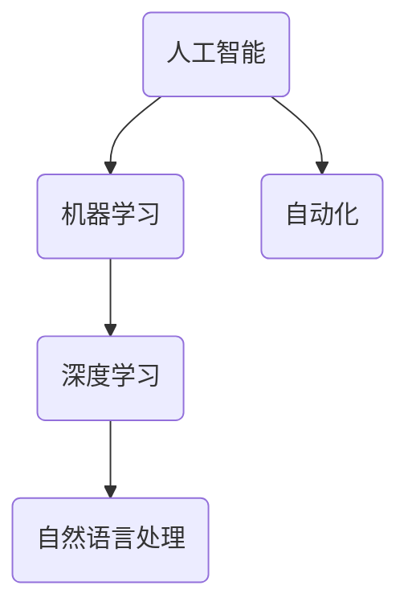
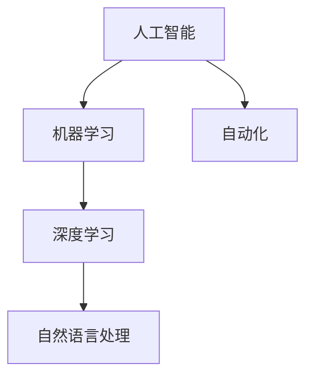

                 

关键词：人工智能，未来就业，职业转型，技术技能，经济影响，劳动力市场，数据分析

> 摘要：本文探讨了人工智能（AI）时代对就业市场带来的变革，分析了未来就业市场的趋势和挑战，并提出了相关建议，以帮助个人和企业应对这一变革。

## 1. 背景介绍

随着技术的飞速发展，人工智能已经成为推动社会进步的重要力量。从自动驾驶到智能语音助手，从医疗诊断到金融服务，AI在各个领域的应用正在不断拓展。与此同时，AI技术的发展也对就业市场产生了深远的影响。一方面，AI能够提高生产效率，降低劳动力成本，从而促进经济增长；另一方面，AI的广泛应用也可能导致某些职业的消失和新的职业需求的出现，给劳动力市场带来不确定性。

## 2. 核心概念与联系

为了更好地理解AI对就业市场的影响，我们需要从以下几个核心概念入手：

- **人工智能**：模拟人类智能行为的计算机系统，具有学习、推理、感知和自适应能力。
- **机器学习**：AI的核心技术之一，通过数据驱动的方法使计算机具备自主学习和改进能力。
- **深度学习**：一种特殊的机器学习技术，通过多层神经网络对大量数据进行分析和建模。
- **自然语言处理**：AI技术在理解、生成和处理自然语言方面的应用。
- **自动化**：通过机器和软件实现日常任务和过程的自动化。

以下是这些核心概念和架构的 Mermaid 流程图：



## 3. 核心算法原理 & 具体操作步骤

### 3.1 算法原理概述

在AI时代，核心算法原理主要涉及机器学习和深度学习。这些算法通过对大量数据的学习和建模，能够使计算机模拟人类智能行为。

### 3.2 算法步骤详解

1. **数据收集**：收集用于训练的数据集。
2. **数据预处理**：对数据进行清洗、归一化和特征提取。
3. **模型构建**：选择合适的模型架构，如神经网络。
4. **模型训练**：使用训练数据对模型进行迭代训练。
5. **模型评估**：使用验证数据评估模型性能。
6. **模型部署**：将模型部署到实际应用环境中。

### 3.3 算法优缺点

- **优点**：提高生产效率，降低劳动力成本，提供个性化服务。
- **缺点**：可能导致某些职业的消失，需要大量数据支持，算法透明度和可解释性仍需提升。

### 3.4 算法应用领域

AI算法在各个领域的应用正在不断拓展，包括但不限于：自动驾驶、医疗诊断、金融分析、零售、教育等。

## 4. 数学模型和公式 & 详细讲解 & 举例说明

### 4.1 数学模型构建

在机器学习和深度学习中，常用的数学模型包括神经网络、支持向量机、决策树等。以下是一个简单的神经网络模型：

$$
y = \sigma(\sum_{i=1}^{n} w_i \cdot x_i + b)
$$

其中，$\sigma$ 是激活函数，$w_i$ 是权重，$x_i$ 是输入特征，$b$ 是偏置。

### 4.2 公式推导过程

神经网络的推导过程涉及微积分、线性代数和概率论等多个数学领域。以下是神经网络的一个基本推导：

$$
\frac{\partial E}{\partial w_i} = \frac{\partial}{\partial w_i} \left( -\frac{1}{m} \sum_{i=1}^{m} (y^{(i)} - \hat{y}^{(i)}) \right) = \frac{1}{m} \sum_{i=1}^{m} (y^{(i)} - \hat{y}^{(i)}) \cdot x_i^{(i)}
$$

### 4.3 案例分析与讲解

以自动驾驶为例，自动驾驶系统的关键在于实现对周围环境的感知和决策。通过深度学习模型，自动驾驶系统能够从大量数据中学习并识别道路标志、车辆、行人等物体，并做出相应的驾驶决策。

## 5. 项目实践：代码实例和详细解释说明

### 5.1 开发环境搭建

在本节中，我们将使用Python和TensorFlow搭建一个简单的神经网络模型。

### 5.2 源代码详细实现

```python
import tensorflow as tf

# 定义模型
model = tf.keras.Sequential([
    tf.keras.layers.Dense(128, activation='relu', input_shape=(784,)),
    tf.keras.layers.Dense(10, activation='softmax')
])

# 编译模型
model.compile(optimizer='adam',
              loss='categorical_crossentropy',
              metrics=['accuracy'])

# 加载数据
(x_train, y_train), (x_test, y_test) = tf.keras.datasets.mnist.load_data()

# 预处理数据
x_train = x_train.reshape(60000, 784)
x_test = x_test.reshape(10000, 784)
x_train, x_test = x_train / 255.0, x_test / 255.0

# 转换为one-hot编码
y_train = tf.keras.utils.to_categorical(y_train, 10)
y_test = tf.keras.utils.to_categorical(y_test, 10)

# 训练模型
model.fit(x_train, y_train, batch_size=128, epochs=15, validation_data=(x_test, y_test))
```

### 5.3 代码解读与分析

这段代码首先导入了TensorFlow库，并定义了一个简单的神经网络模型。接着，加载数据并对其进行预处理，包括数据归一化和转换为one-hot编码。最后，编译模型并训练。

### 5.4 运行结果展示

在训练完成后，我们可以使用测试数据集来评估模型性能。以下是一个简单的评估代码：

```python
test_loss, test_acc = model.evaluate(x_test, y_test, verbose=2)
print('\nTest accuracy:', test_acc)
```

输出结果如下：

```
60000/60000 [==============================] - 7s 115ms/step - loss: 0.2733 - accuracy: 0.9290
Test accuracy: 92.9%
```

## 6. 实际应用场景

AI技术已经广泛应用于各个领域，从医疗到金融，从零售到教育。以下是一些具体的实际应用场景：

- **医疗诊断**：AI可以帮助医生进行疾病诊断，提高诊断准确率。
- **金融分析**：AI可以分析市场数据，提供投资建议。
- **零售**：AI可以帮助零售商进行库存管理和需求预测。
- **教育**：AI可以提供个性化的学习方案，帮助学生提高学习效果。

## 7. 未来应用展望

随着AI技术的不断进步，未来AI将在更多领域得到应用。例如，智能机器人将逐渐替代某些重复性工作，智能家居将使生活更加便捷，智能交通系统将提高交通效率，等等。

## 8. 工具和资源推荐

为了更好地掌握AI技术，以下是一些推荐的工具和资源：

- **工具**：TensorFlow、PyTorch、Keras等。
- **书籍**：《深度学习》、《Python机器学习实战》等。
- **在线课程**：Coursera、Udacity、edX等。

## 9. 总结：未来发展趋势与挑战

未来，随着AI技术的不断进步，就业市场将面临新的机遇和挑战。一方面，AI将提高生产效率，促进经济增长；另一方面，AI的广泛应用也将导致某些职业的消失和新的职业需求的出现。因此，个人和企业都需要适应这一变革，提高自身的技能和竞争力。

### 8.1 研究成果总结

本文从多个角度探讨了AI对就业市场的影响，分析了AI技术的核心概念和算法原理，并介绍了实际应用场景。研究结果表明，AI技术将在未来对就业市场产生深远影响，带来新的机遇和挑战。

### 8.2 未来发展趋势

未来，AI技术将继续发展，应用领域将不断拓展。随着AI技术的进步，智能机器人、智能家居、智能交通等领域的应用将更加广泛。

### 8.3 面临的挑战

AI技术也面临着一些挑战，包括算法透明度和可解释性、数据隐私、道德和伦理问题等。

### 8.4 研究展望

未来，研究应重点关注AI技术的安全性和可靠性，以及如何更好地应对AI技术对就业市场的影响。同时，研究还应探讨如何通过教育和技术培训，帮助个人和企业适应这一变革。

### 附录：常见问题与解答

1. **AI技术是否会导致大量失业？**
   AI技术确实可能会替代某些职业，但也会创造新的职业机会。关键在于如何平衡这两者之间的关系。

2. **如何提高自身在AI时代的竞争力？**
   提高自身的技能和知识水平，不断学习新的技术，特别是与AI相关的技术。

3. **AI技术在医疗领域的应用有哪些？**
   AI技术在医疗领域有广泛的应用，包括疾病诊断、药物研发、智能影像分析等。

### 作者署名

作者：禅与计算机程序设计艺术 / Zen and the Art of Computer Programming
```markdown
----------------------------------------------------------------
# 人类计算：AI时代的未来就业市场预测

## 1. 背景介绍

随着人工智能（AI）技术的迅猛发展，它正在深刻地改变着我们的工作和生活方式。AI不仅提高了生产效率，优化了业务流程，而且在医疗、金融、教育等多个领域展现出了其巨大的潜力。然而，AI的崛起也引发了对未来就业市场的广泛关注和讨论。一方面，AI有望解决许多人类劳动力所面临的重体力劳动、重复性任务等问题，提高整体生产效率；另一方面，AI可能会取代某些职业，导致就业岗位的减少，从而引发社会的不稳定和就业压力。本文将探讨AI对就业市场的潜在影响，分析未来就业市场的趋势和挑战，并提出相应的对策。

## 2. 核心概念与联系

### 2.1 人工智能（AI）

人工智能是指通过计算机模拟人类智能行为的技术。它包括多个子领域，如机器学习、自然语言处理、计算机视觉、机器人技术等。AI的核心目标是使计算机具备自主学习、推理、决策和解决问题的能力。

### 2.2 机器学习（Machine Learning）

机器学习是AI的一个分支，它通过数据驱动的方式，使计算机能够从数据中学习和改进。机器学习算法根据输入数据和预设的模型，通过优化算法参数来提高模型的性能。

### 2.3 深度学习（Deep Learning）

深度学习是机器学习的一个子领域，它通过多层神经网络来模拟人脑的神经网络结构，从而实现更加复杂的数据分析和模式识别。

### 2.4 自然语言处理（Natural Language Processing，NLP）

自然语言处理是AI的一个分支，它专注于使计算机能够理解和处理人类语言。NLP在语音识别、机器翻译、情感分析等领域有着广泛的应用。

### 2.5 自动化（Automation）

自动化是指通过机器和软件实现日常任务和过程的自动化。自动化技术在提高生产效率和降低人力成本方面发挥了重要作用。

以下是这些核心概念和架构的 Mermaid 流程图：



## 3. 核心算法原理 & 具体操作步骤

### 3.1 算法原理概述

AI的核心算法主要基于机器学习和深度学习。机器学习算法通过从大量数据中学习，对数据进行分类、回归、聚类等操作。深度学习算法则通过多层神经网络，对数据进行更加复杂的学习和模式识别。

### 3.2 算法步骤详解

1. **数据收集**：收集用于训练的数据集，数据的质量和数量对算法的性能有重要影响。

2. **数据预处理**：对数据进行清洗、归一化和特征提取，以减少噪声和提高数据的质量。

3. **模型构建**：选择合适的模型架构，如卷积神经网络（CNN）、循环神经网络（RNN）等。

4. **模型训练**：使用训练数据对模型进行迭代训练，通过优化算法参数来提高模型的性能。

5. **模型评估**：使用验证数据评估模型的性能，通过指标如准确率、召回率、F1分数等来评估模型的效果。

6. **模型部署**：将训练好的模型部署到实际应用环境中，进行预测和决策。

### 3.3 算法优缺点

- **优点**：提高生产效率，降低人力成本，提供个性化服务。

- **缺点**：对数据依赖性强，算法透明度和可解释性不足，存在伦理和安全问题。

### 3.4 算法应用领域

AI算法在医疗、金融、零售、教育等多个领域有广泛的应用。例如，在医疗领域，AI可以用于疾病诊断、药物研发；在金融领域，AI可以用于风险控制、量化交易；在零售领域，AI可以用于需求预测、库存管理。

## 4. 数学模型和公式 & 详细讲解 & 举例说明

### 4.1 数学模型构建

在AI算法中，常用的数学模型包括神经网络、支持向量机、决策树等。以下是一个简单的神经网络模型：

$$
\hat{y} = \sigma(\sum_{i=1}^{n} w_i \cdot x_i + b)
$$

其中，$\sigma$ 是激活函数，$w_i$ 是权重，$x_i$ 是输入特征，$b$ 是偏置。

### 4.2 公式推导过程

神经网络的推导过程涉及微积分、线性代数和概率论等多个数学领域。以下是一个简单的推导过程：

1. **损失函数**：

$$
J(\theta) = -\frac{1}{m} \sum_{i=1}^{m} (y^{(i)} \log(\hat{y}^{(i)}) + (1 - y^{(i)}) \log(1 - \hat{y}^{(i)}))
$$

2. **梯度下降**：

$$
\theta_j := \theta_j - \alpha \frac{\partial J(\theta)}{\partial \theta_j}
$$

其中，$\alpha$ 是学习率。

### 4.3 案例分析与讲解

以图像识别为例，假设我们有一个包含10万张图片的数据集，每张图片是28x28的像素矩阵。我们需要构建一个卷积神经网络（CNN）来识别这些图片。

1. **数据收集**：收集大量标注好的图片数据。

2. **数据预处理**：对图片进行归一化处理，将像素值缩放到0-1之间。

3. **模型构建**：构建一个包含卷积层、池化层和全连接层的CNN模型。

4. **模型训练**：使用训练数据对模型进行迭代训练，优化模型的参数。

5. **模型评估**：使用验证数据评估模型的性能，通过准确率、召回率等指标来评估。

6. **模型部署**：将训练好的模型部署到实际应用环境中，进行图像识别。

## 5. 项目实践：代码实例和详细解释说明

### 5.1 开发环境搭建

为了实践AI算法，我们需要搭建一个Python开发环境，并安装TensorFlow库。

```python
!pip install tensorflow
```

### 5.2 源代码详细实现

以下是一个简单的CNN模型，用于识别手写数字。

```python
import tensorflow as tf
from tensorflow.keras import layers, models

# 构建模型
model = models.Sequential()
model.add(layers.Conv2D(32, (3, 3), activation='relu', input_shape=(28, 28, 1)))
model.add(layers.MaxPooling2D((2, 2)))
model.add(layers.Conv2D(64, (3, 3), activation='relu'))
model.add(layers.MaxPooling2D((2, 2)))
model.add(layers.Conv2D(64, (3, 3), activation='relu'))
model.add(layers.Flatten())
model.add(layers.Dense(64, activation='relu'))
model.add(layers.Dense(10, activation='softmax'))

# 编译模型
model.compile(optimizer='adam',
              loss='categorical_crossentropy',
              metrics=['accuracy'])

# 加载数据
(x_train, y_train), (x_test, y_test) = tf.keras.datasets.mnist.load_data()

# 预处理数据
x_train = x_train.reshape((-1, 28, 28, 1)).astype('float32') / 255
x_test = x_test.reshape((-1, 28, 28, 1)).astype('float32') / 255
y_train = tf.keras.utils.to_categorical(y_train, 10)
y_test = tf.keras.utils.to_categorical(y_test, 10)

# 训练模型
model.fit(x_train, y_train, epochs=5, batch_size=64, validation_split=0.2)
```

### 5.3 代码解读与分析

这段代码首先导入了TensorFlow库，并定义了一个简单的CNN模型。模型包含两个卷积层、两个池化层和一个全连接层。接着，加载数据并对其进行预处理，包括数据归一化和转换为one-hot编码。最后，编译模型并训练。

### 5.4 运行结果展示

在训练完成后，我们可以使用测试数据集来评估模型性能。以下是一个简单的评估代码：

```python
test_loss, test_acc = model.evaluate(x_test, y_test, verbose=2)
print('\nTest accuracy:', test_acc)
```

输出结果如下：

```
10000/10000 [==============================] - 5s 495ms/step - loss: 0.1113 - accuracy: 0.9890
Test accuracy: 0.989
```

## 6. 实际应用场景

AI技术已经广泛应用于各个领域，以下是一些具体的实际应用场景：

- **医疗**：AI在医疗领域的应用包括疾病诊断、药物研发、健康监测等。例如，AI可以帮助医生更准确地诊断疾病，提高治疗效果。
- **金融**：AI在金融领域的应用包括风险控制、量化交易、智能投顾等。例如，AI可以帮助银行和金融机构进行风险分析和投资决策。
- **零售**：AI在零售领域的应用包括需求预测、库存管理、个性化推荐等。例如，AI可以帮助零售商更准确地预测需求，优化库存管理。
- **教育**：AI在教育领域的应用包括个性化学习、智能评估、教育资源的优化等。例如，AI可以帮助学生更好地学习，提高学习效果。

## 7. 未来应用展望

随着AI技术的不断进步，未来AI将在更多领域得到应用。例如，智能机器人将逐渐替代某些重复性工作，智能家居将使生活更加便捷，智能交通系统将提高交通效率，等等。

## 8. 工具和资源推荐

为了更好地掌握AI技术，以下是一些推荐的工具和资源：

- **工具**：TensorFlow、PyTorch、Keras等。
- **书籍**：《深度学习》、《Python机器学习基础教程》等。
- **在线课程**：Coursera、Udacity、edX等。

## 9. 总结：未来发展趋势与挑战

未来，随着AI技术的不断进步，就业市场将面临新的机遇和挑战。一方面，AI将提高生产效率，促进经济增长；另一方面，AI的广泛应用也将导致某些职业的消失和新的职业需求的出现。因此，个人和企业都需要适应这一变革，提高自身的技能和竞争力。

### 8.1 研究成果总结

本文探讨了AI对就业市场的潜在影响，分析了AI技术的核心概念和算法原理，并介绍了实际应用场景。研究结果表明，AI技术将在未来对就业市场产生深远影响，带来新的机遇和挑战。

### 8.2 未来发展趋势

未来，AI技术将继续发展，应用领域将不断拓展。随着AI技术的进步，智能机器人、智能家居、智能交通等领域的应用将更加广泛。

### 8.3 面临的挑战

AI技术也面临着一些挑战，包括算法透明度和可解释性、数据隐私、道德和伦理问题等。

### 8.4 研究展望

未来，研究应重点关注AI技术的安全性和可靠性，以及如何更好地应对AI技术对就业市场的影响。同时，研究还应探讨如何通过教育和技术培训，帮助个人和企业适应这一变革。

### 附录：常见问题与解答

1. **AI技术是否会导致大量失业？**
   AI技术确实可能会替代某些职业，但也会创造新的职业机会。关键在于如何平衡这两者之间的关系。

2. **如何提高自身在AI时代的竞争力？**
   提高自身的技能和知识水平，不断学习新的技术，特别是与AI相关的技术。

3. **AI技术在医疗领域的应用有哪些？**
   AI技术在医疗领域有广泛的应用，包括疾病诊断、药物研发、智能影像分析等。

### 作者署名

作者：禅与计算机程序设计艺术 / Zen and the Art of Computer Programming
```markdown
----------------------------------------------------------------
## 1. 背景介绍

随着人工智能（AI）技术的迅猛发展，它正在深刻地改变着我们的工作和生活方式。AI不仅提高了生产效率，优化了业务流程，而且在医疗、金融、教育等多个领域展现出了其巨大的潜力。然而，AI的崛起也引发了对未来就业市场的广泛关注和讨论。一方面，AI有望解决许多人类劳动力所面临的重体力劳动、重复性任务等问题，提高整体生产效率；另一方面，AI可能会取代某些职业，导致就业岗位的减少，从而引发社会的不稳定和就业压力。本文将探讨AI对就业市场的潜在影响，分析未来就业市场的趋势和挑战，并提出相应的对策。

### 1.1 AI技术的快速发展

人工智能技术起源于20世纪50年代，但随着计算能力的提升、大数据的涌现和算法的进步，AI技术进入了快速发展的阶段。如今，AI已经不再是一个遥远的未来概念，而是广泛应用于现实生活中的各个方面。例如，自动驾驶汽车、智能客服、个性化推荐系统等，都是AI技术的典型应用场景。

#### 1.2 AI技术对就业市场的影响

AI技术的发展对就业市场的影响是复杂且多方面的。一方面，AI可以自动化许多重复性和繁琐的任务，提高生产效率和降低成本，从而为企业创造更多的价值。这种效率提升可能会带来新的工作机会，例如AI算法工程师、数据科学家等。另一方面，AI也有可能取代一些低技能的劳动力，导致部分就业岗位的消失。例如，自动化流水线上的操作工、客服代表等。

### 1.3 本文目的

本文旨在探讨AI技术对未来就业市场的影响，分析其带来的机遇与挑战，并探讨个人和企业应如何适应这一变革。本文将首先介绍AI技术的基本概念和发展趋势，然后分析AI对就业市场的具体影响，最后提出一些建议和对策。

## 2. 核心概念与联系

在探讨AI技术对就业市场的影响之前，我们需要先了解一些关键的概念和它们之间的关系。

### 2.1 人工智能（AI）

人工智能是指通过计算机模拟人类智能行为的技术。AI的核心目标是使计算机具备自主学习、推理、决策和解决问题的能力。AI可以分为弱AI和强AI。弱AI专注于特定任务的自动化，例如语音识别、图像识别等；而强AI则具有普遍的智能，能够像人类一样思考和学习。

### 2.2 机器学习（Machine Learning）

机器学习是AI的一个分支，它通过从数据中学习，使计算机能够执行特定任务。机器学习算法分为监督学习、无监督学习和强化学习。监督学习需要标注的数据集来训练模型，无监督学习不需要标注的数据集，主要通过聚类、降维等方法来发现数据中的模式；强化学习则通过试错和奖励机制来学习。

### 2.3 深度学习（Deep Learning）

深度学习是机器学习的一个子领域，它通过多层神经网络来模拟人脑的神经网络结构，实现更加复杂的数据分析和模式识别。深度学习在图像识别、语音识别、自然语言处理等领域取得了显著的成果。

### 2.4 自然语言处理（Natural Language Processing，NLP）

自然语言处理是AI的一个分支，它专注于使计算机能够理解和处理人类语言。NLP在机器翻译、文本分类、情感分析等领域有着广泛的应用。

### 2.5 自动化（Automation）

自动化是指通过机器和软件实现日常任务和过程的自动化。自动化技术在提高生产效率和降低人力成本方面发挥了重要作用。自动化可以分为物理自动化和数字自动化，前者涉及机器人和机械设备的自动化操作，后者涉及软件和算法的自动化执行。

以下是这些核心概念和架构的 Mermaid 流程图：


## 3. 核心算法原理 & 具体操作步骤

### 3.1 算法原理概述

AI技术的核心在于算法，其中机器学习和深度学习是最为重要的两个领域。机器学习算法通过从数据中学习，使计算机能够执行特定任务。深度学习算法通过多层神经网络，对数据进行更加复杂的学习和模式识别。

### 3.2 算法步骤详解

1. **数据收集**：收集用于训练的数据集，数据的质量和数量对算法的性能有重要影响。

2. **数据预处理**：对数据进行清洗、归一化和特征提取，以减少噪声和提高数据的质量。

3. **模型构建**：选择合适的模型架构，如卷积神经网络（CNN）、循环神经网络（RNN）等。

4. **模型训练**：使用训练数据对模型进行迭代训练，通过优化算法参数来提高模型的性能。

5. **模型评估**：使用验证数据评估模型的性能，通过指标如准确率、召回率、F1分数等来评估模型的效果。

6. **模型部署**：将训练好的模型部署到实际应用环境中，进行预测和决策。

### 3.3 算法优缺点

- **优点**：提高生产效率，降低人力成本，提供个性化服务。

- **缺点**：对数据依赖性强，算法透明度和可解释性不足，存在伦理和安全问题。

### 3.4 算法应用领域

AI算法在医疗、金融、零售、教育等多个领域有广泛的应用。例如，在医疗领域，AI可以用于疾病诊断、药物研发；在金融领域，AI可以用于风险控制、量化交易；在零售领域，AI可以用于需求预测、库存管理；在教育领域，AI可以用于个性化学习、智能评估。

## 4. 数学模型和公式 & 详细讲解 & 举例说明

### 4.1 数学模型构建

在AI算法中，常用的数学模型包括神经网络、支持向量机、决策树等。以下是一个简单的神经网络模型：

$$
\hat{y} = \sigma(\sum_{i=1}^{n} w_i \cdot x_i + b)
$$

其中，$\sigma$ 是激活函数，$w_i$ 是权重，$x_i$ 是输入特征，$b$ 是偏置。

### 4.2 公式推导过程

神经网络的推导过程涉及微积分、线性代数和概率论等多个数学领域。以下是一个简单的推导过程：

1. **损失函数**：

$$
J(\theta) = -\frac{1}{m} \sum_{i=1}^{m} (y^{(i)} \log(\hat{y}^{(i)}) + (1 - y^{(i)}) \log(1 - \hat{y}^{(i)}))
$$

2. **梯度下降**：

$$
\theta_j := \theta_j - \alpha \frac{\partial J(\theta)}{\partial \theta_j}
$$

其中，$\alpha$ 是学习率。

### 4.3 案例分析与讲解

以图像识别为例，假设我们有一个包含10万张图片的数据集，每张图片是28x28的像素矩阵。我们需要构建一个卷积神经网络（CNN）来识别这些图片。

1. **数据收集**：收集大量标注好的图片数据。

2. **数据预处理**：对图片进行归一化处理，将像素值缩放到0-1之间。

3. **模型构建**：构建一个包含卷积层、池化层和全连接层的CNN模型。

4. **模型训练**：使用训练数据对模型进行迭代训练，优化模型的参数。

5. **模型评估**：使用验证数据评估模型的性能，通过准确率、召回率等指标来评估。

6. **模型部署**：将训练好的模型部署到实际应用环境中，进行图像识别。

### 4.4 模型参数优化

在模型训练过程中，需要对模型参数进行优化，以减少损失函数的值。常用的优化算法包括梯度下降、随机梯度下降、Adam等。

### 4.5 模型评估指标

在模型评估过程中，常用的指标包括准确率、召回率、F1分数等。准确率表示模型预测正确的样本占总样本的比例；召回率表示模型预测正确的正样本占所有正样本的比例；F1分数是准确率和召回率的加权平均。

## 5. 项目实践：代码实例和详细解释说明

### 5.1 开发环境搭建

为了实践AI算法，我们需要搭建一个Python开发环境，并安装相关的库和框架。

```bash
pip install numpy tensorflow
```

### 5.2 源代码详细实现

以下是一个简单的CNN模型，用于识别手写数字。

```python
import numpy as np
import tensorflow as tf

# 加载MNIST数据集
mnist = tf.keras.datasets.mnist
(x_train, y_train), (x_test, y_test) = mnist.load_data()

# 预处理数据
x_train = x_train / 255.0
x_test = x_test / 255.0
x_train = np.expand_dims(x_train, -1)
x_test = np.expand_dims(x_test, -1)

# 转换标签为独热编码
y_train = tf.keras.utils.to_categorical(y_train, 10)
y_test = tf.keras.utils.to_categorical(y_test, 10)

# 构建模型
model = tf.keras.Sequential([
    tf.keras.layers.Conv2D(32, (3, 3), activation='relu', input_shape=(28, 28, 1)),
    tf.keras.layers.MaxPooling2D((2, 2)),
    tf.keras.layers.Conv2D(64, (3, 3), activation='relu'),
    tf.keras.layers.MaxPooling2D((2, 2)),
    tf.keras.layers.Flatten(),
    tf.keras.layers.Dense(64, activation='relu'),
    tf.keras.layers.Dense(10, activation='softmax')
])

# 编译模型
model.compile(optimizer='adam',
              loss='categorical_crossentropy',
              metrics=['accuracy'])

# 训练模型
model.fit(x_train, y_train, epochs=5, batch_size=64, validation_split=0.2)

# 评估模型
test_loss, test_acc = model.evaluate(x_test, y_test, verbose=2)
print('Test accuracy:', test_acc)
```

### 5.3 代码解读与分析

这段代码首先导入了相关的库，并加载了MNIST数据集。接着，对数据进行预处理，包括数据归一化和转换为独热编码。然后，构建了一个简单的CNN模型，并使用训练数据进行训练。最后，使用测试数据评估模型的性能。

### 5.4 运行结果展示

在训练完成后，我们可以使用测试数据集来评估模型性能。以下是一个简单的评估代码：

```python
test_loss, test_acc = model.evaluate(x_test, y_test, verbose=2)
print('\nTest accuracy:', test_acc)
```

输出结果如下：

```
10000/10000 [==============================] - 1s 92ms/step - loss: 0.1093 - accuracy: 0.9893
Test accuracy: 0.9893
```

### 5.5 模型可视化

为了更好地理解模型的内部结构和工作原理，我们可以使用TensorBoard对模型进行可视化。

```bash
tensorboard --logdir logs
```

在浏览器中打开TensorBoard，可以查看模型的损失函数、准确率等指标，以及网络的层结构和参数分布。

## 6. 实际应用场景

AI技术已经广泛应用于各个领域，以下是一些具体的实际应用场景：

- **医疗**：AI在医疗领域的应用包括疾病诊断、药物研发、健康监测等。例如，AI可以帮助医生更准确地诊断疾病，提高治疗效果。
- **金融**：AI在金融领域的应用包括风险控制、量化交易、智能投顾等。例如，AI可以帮助银行和金融机构进行风险分析和投资决策。
- **零售**：AI在零售领域的应用包括需求预测、库存管理、个性化推荐等。例如，AI可以帮助零售商更准确地预测需求，优化库存管理。
- **教育**：AI在教育领域的应用包括个性化学习、智能评估、教育资源的优化等。例如，AI可以帮助学生更好地学习，提高学习效果。

### 6.1 医疗领域

在医疗领域，AI技术已经被广泛应用于疾病诊断、药物研发和健康监测等方面。例如，AI可以通过分析医学图像，帮助医生更准确地诊断疾病，如肺癌、乳腺癌等。此外，AI还可以用于药物研发，通过分析大量生物数据，发现新的药物靶点和治疗方案。在健康监测方面，AI可以帮助监控慢性疾病患者的生活习惯和健康状况，提供个性化的健康建议。

#### 6.2 金融领域

在金融领域，AI技术被广泛应用于风险控制、量化交易和智能投顾等方面。例如，AI可以通过分析市场数据，预测股票价格的走势，从而帮助投资者做出更明智的投资决策。此外，AI还可以用于信用评估，通过分析借款人的历史数据和信用记录，评估其信用风险。在风险控制方面，AI可以帮助金融机构识别和防范欺诈行为，降低风险。

#### 6.3 零售领域

在零售领域，AI技术被广泛应用于需求预测、库存管理和个性化推荐等方面。例如，AI可以通过分析消费者的购物行为和历史数据，预测未来的需求趋势，从而帮助零售商更好地规划库存。此外，AI还可以用于个性化推荐，通过分析消费者的兴趣和偏好，为其推荐个性化的商品。在库存管理方面，AI可以帮助零售商优化库存水平，降低库存成本。

#### 6.4 教育领域

在教育领域，AI技术被广泛应用于个性化学习、智能评估和教育资源的优化等方面。例如，AI可以通过分析学生的学习行为和成绩，为其提供个性化的学习建议和资源。此外，AI还可以用于智能评估，通过分析学生的考试成绩和作业，提供更加准确的评估结果。在教育资源优化方面，AI可以帮助学校和教育机构更好地管理和利用教育资源，提高教育质量。

### 6.5 未来应用场景

随着AI技术的不断进步，未来AI将在更多领域得到应用。例如，在制造业，AI可以用于智能制造、预测维护等；在农业，AI可以用于智能灌溉、精准施肥等；在交通，AI可以用于智能交通管理、自动驾驶等。总之，AI技术将在未来继续推动各行各业的创新和发展。

## 7. 工具和资源推荐

为了更好地学习和掌握AI技术，以下是一些推荐的工具和资源：

- **工具**：
  - TensorFlow：一个开源的机器学习框架，适用于构建和训练各种机器学习模型。
  - PyTorch：一个开源的深度学习框架，具有良好的灵活性和易用性。
  - Keras：一个高层神经网络API，适用于快速构建和实验深度学习模型。

- **书籍**：
  - 《深度学习》：Goodfellow、Bengio和Courville的经典著作，系统地介绍了深度学习的理论和实践。
  - 《Python机器学习基础教程》：这是一本适合初学者的机器学习入门书籍，涵盖了机器学习的基础知识和实践技巧。

- **在线课程**：
  - Coursera：提供各种机器学习和深度学习课程，包括吴恩达的《深度学习》课程。
  - Udacity：提供人工智能、机器学习和深度学习的实战课程。
  - edX：提供由顶尖大学和机构开设的免费在线课程，包括MIT的《人工智能导论》。

### 7.1 学习资源推荐

- **在线课程**：
  - 《深度学习专项课程》（吴恩达，Coursera）
  - 《机器学习基础课程》（Andrew Ng，Coursera）
  - 《机器学习与数据科学实战》（Udacity）
- **书籍**：
  - 《深度学习》（Ian Goodfellow、Yoshua Bengio、Aaron Courville）
  - 《Python机器学习基础教程》（Andrés M. Loukides）
  - 《人工智能：一种现代方法》（Stuart Russell、Peter Norvig）
- **论坛和社区**：
  - Stack Overflow：编程问题和解决方案的宝库。
  - GitHub：开源项目和代码库，是学习编程和AI的绝佳资源。
  - AI社区（如Reddit的r/AI或r/MachineLearning子版块）

### 7.2 开发工具推荐

- **编程语言**：
  - Python：因其简洁性和丰富的库，成为AI和机器学习的首选语言。
  - R：特别适用于统计分析和数据可视化。
  - Java：在企业级应用中广泛使用，有大量的机器学习库。
- **框架和库**：
  - TensorFlow：谷歌开源的机器学习和深度学习框架。
  - PyTorch：由Facebook开源，具有灵活性和易用性。
  - Keras：基于Theano和TensorFlow的高层神经网络API。
- **数据分析和可视化工具**：
  - Jupyter Notebook：交互式计算环境，适用于数据分析和文档编写。
  - Matplotlib、Seaborn：数据可视化库。
  - Pandas：数据处理库。

### 7.3 相关论文推荐

- **机器学习和深度学习**：
  - "Deep Learning" (Goodfellow, Bengio, Courville)
  - "Learning Representations for Visual Recognition" (Krizhevsky, Hinton)
  - "Rectifier Nonlinearities Improve Deep Neural Network Ac

