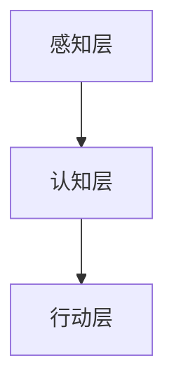
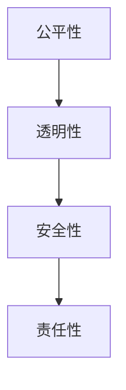
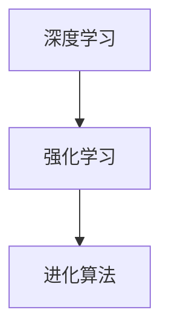
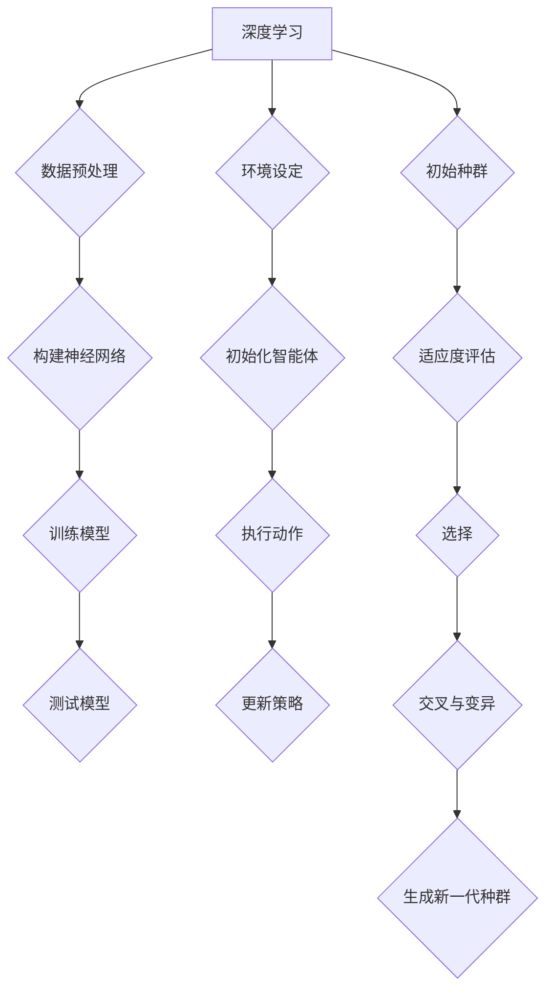

                 

关键词：人工智能、道德边界、计算伦理、机器伦理、算法决策、透明性、公平性、安全性、人机合作

> 摘要：本文探讨了AI时代人类计算的道德边界。随着人工智能技术的迅猛发展，人类计算不再局限于人类自身的思维和认知，而是扩展到了由算法和数据驱动的智能系统。在这样的大背景下，如何确保这些系统的道德边界，实现人类与人工智能的和谐共存，成为了一个亟待解决的问题。本文从多个角度出发，分析了AI时代的道德边界，探讨了相关伦理原则和实践方法，提出了未来研究的发展方向。

## 1. 背景介绍

### 1.1 人工智能的崛起

人工智能（Artificial Intelligence，简称AI）作为计算机科学的一个分支，旨在使计算机具备智能，能够模仿、延伸和扩展人类智能。近年来，随着深度学习、大数据和计算能力的飞速发展，人工智能取得了显著的突破，逐渐渗透到社会生活的方方面面。

### 1.2 人类计算的演变

传统的计算主要由人类完成，包括问题分析、算法设计、计算执行等环节。然而，在AI时代，人类计算发生了根本性的变化。一方面，人类不再亲自执行复杂的计算任务，而是将它们交给智能系统；另一方面，人类需要参与算法的设计、优化和监督，确保计算结果的合理性和道德性。

### 1.3 道德边界的重要性

在AI时代，人类计算的道德边界变得尤为重要。这是因为人工智能系统在处理大量数据和信息时，可能会产生偏见、歧视、误导等问题，从而对人类社会造成负面影响。因此，确保AI系统的道德边界，实现人类与人工智能的和谐共存，成为了一个亟待解决的问题。

## 2. 核心概念与联系

### 2.1 人工智能系统架构

人工智能系统通常由感知层、认知层和行动层组成。感知层负责接收外部信息，如视觉、听觉等；认知层负责处理和推理信息，如分类、预测等；行动层负责执行决策，如控制机器人、自动驾驶等。以下是人工智能系统的基本架构的Mermaid流程图：



### 2.2 道德边界概念

道德边界是指人工智能系统在执行任务时，必须遵守的伦理规范和道德准则。这些规范和准则旨在确保人工智能系统不会对人类社会造成负面影响，实现人类与人工智能的和谐共存。以下是道德边界的几个关键概念：

- **公平性**：人工智能系统应公平对待所有用户，避免歧视和偏见。
- **透明性**：人工智能系统的决策过程应透明，用户可以理解和追踪。
- **安全性**：人工智能系统应确保数据的安全性和隐私性。
- **责任性**：人工智能系统的设计和使用应明确责任，确保在出现问题时可以追溯。

以下是道德边界的几个关键概念的Mermaid流程图：



## 3. 核心算法原理 & 具体操作步骤

### 3.1 算法原理概述

在AI时代，算法的设计和优化至关重要。核心算法通常包括以下几种：

1. **深度学习**：通过多层神经网络，模拟人类大脑的神经元连接，进行特征提取和学习。
2. **强化学习**：通过试错和反馈，使智能体在环境中学习最优策略。
3. **进化算法**：模拟生物进化过程，通过自然选择和遗传算法，优化参数和结构。

以下是核心算法原理的Mermaid流程图：



### 3.2 算法步骤详解

以下是几种核心算法的具体操作步骤：

1. **深度学习**：

   - 数据预处理：对输入数据进行归一化、去噪等处理。
   - 构建神经网络：设计多层神经网络，包括输入层、隐藏层和输出层。
   - 训练模型：通过反向传播算法，不断调整网络参数，使输出误差最小。
   - 测试模型：在测试集上评估模型性能，调整模型参数。

2. **强化学习**：

   - 环境设定：定义智能体所处的环境，包括状态、动作、奖励等。
   - 初始化智能体：设置智能体的初始状态和策略。
   - 执行动作：智能体在环境中执行动作，获取状态转移和奖励。
   - 更新策略：根据奖励和状态转移，更新智能体的策略。

3. **进化算法**：

   - 初始种群：随机生成一组初始解。
   - 适应度评估：对种群中的每个解进行适应度评估。
   - 选择：根据适应度，选择优秀的个体进行繁殖。
   - 交叉与变异：对选择后的个体进行交叉和变异，产生新解。
   - 生成新一代种群：将新解与原有种群合并，形成新一代种群。

以下是算法步骤详解的Mermaid流程图：



### 3.3 算法优缺点

以下是几种核心算法的优缺点：

1. **深度学习**：

   - 优点：具有强大的特征提取和泛化能力，适用于图像、语音、文本等多种数据类型。
   - 缺点：训练过程复杂，对数据量和计算资源要求较高；模型透明性较差，难以解释。

2. **强化学习**：

   - 优点：能够处理动态环境，具有自主学习和适应能力。
   - 缺点：训练过程可能非常缓慢，对奖励函数设计依赖较大。

3. **进化算法**：

   - 优点：具有很好的全局搜索能力，能够找到最优解。
   - 缺点：对参数设置敏感，可能陷入局部最优。

### 3.4 算法应用领域

以下是几种核心算法的应用领域：

1. **深度学习**：

   - 图像识别：用于人脸识别、物体检测、图像分类等。
   - 自然语言处理：用于机器翻译、情感分析、语音识别等。
   - 音频处理：用于音乐生成、语音识别、音频分类等。

2. **强化学习**：

   - 自动驾驶：用于路径规划、避障、决策等。
   - 游戏AI：用于棋类游戏、体育游戏等。
   - 聊天机器人：用于对话生成、意图识别等。

3. **进化算法**：

   - 设计优化：用于结构优化、参数优化等。
   - 机器学习模型优化：用于优化模型结构、参数等。
   - 资源分配：用于任务调度、负载均衡等。

## 4. 数学模型和公式 & 详细讲解 & 举例说明

### 4.1 数学模型构建

在人工智能领域，数学模型是算法设计的基础。以下是一些常见的数学模型：

1. **线性回归**：

   - 目标函数：$$J(\theta) = \frac{1}{2m}\sum_{i=1}^{m}(h_\theta(x^{(i)}) - y^{(i)})^2$$
   - 梯度下降算法：$$\theta_j := \theta_j - \alpha\frac{1}{m}\sum_{i=1}^{m}(h_\theta(x^{(i)}) - y^{(i)})x_j^{(i)}$$

2. **逻辑回归**：

   - 目标函数：$$J(\theta) = -\frac{1}{m}\sum_{i=1}^{m}y^{(i)}\log(h_\theta(x^{(i)})) + (1-y^{(i)})\log(1-h_\theta(x^{(i)}))$$
   - 梯度下降算法：$$\theta_j := \theta_j - \alpha\frac{1}{m}\sum_{i=1}^{m}(h_\theta(x^{(i)}) - y^{(i)})x_j^{(i)}$$

3. **神经网络**：

   - 前向传播：$$a_l^{(i)} = \sigma(\theta^{(l-1)}a_{l-1}^{(i)})$$
   - 反向传播：$$\delta^l_j = (y^{(i)} - a^l_j)\sigma'(z^l_j)$$

### 4.2 公式推导过程

以下以线性回归为例，介绍公式推导过程：

1. **目标函数**：

   线性回归的目标是最小化预测值与真实值之间的误差。设输入特征为 $x$，预测值为 $h_\theta(x)$，真实值为 $y$，则目标函数为：

   $$J(\theta) = \frac{1}{2m}\sum_{i=1}^{m}(h_\theta(x^{(i)}) - y^{(i)})^2$$

2. **梯度下降**：

   为了最小化目标函数，需要对 $\theta$ 求导数，并令导数为零，得到：

   $$\frac{\partial}{\partial \theta_j}J(\theta) = \frac{1}{m}\sum_{i=1}^{m}(h_\theta(x^{(i)}) - y^{(i)})\frac{\partial}{\partial \theta_j}h_\theta(x^{(i)})$$

   其中，$h_\theta(x) = \theta_0x_0 + \theta_1x_1 + \ldots + \theta_nx_n$，则：

   $$\frac{\partial}{\partial \theta_j}h_\theta(x) = x_j$$

   代入目标函数的导数，得到：

   $$\frac{\partial}{\partial \theta_j}J(\theta) = \frac{1}{m}\sum_{i=1}^{m}(h_\theta(x^{(i)}) - y^{(i)})x_j$$

   为了简化计算，可以将其表示为：

   $$\theta_j := \theta_j - \alpha\frac{1}{m}\sum_{i=1}^{m}(h_\theta(x^{(i)}) - y^{(i)})x_j^{(i)}$$

   其中，$\alpha$ 为学习率。

### 4.3 案例分析与讲解

以下以房价预测为例，介绍线性回归的应用：

1. **数据集**：

   假设我们有一个包含5000个样本的数据集，每个样本包含多个特征，如房屋面积、位置、建造年代等，以及目标值——房价。

2. **模型构建**：

   设线性回归模型的参数为 $\theta_0, \theta_1, \ldots, \theta_n$，则房价的预测公式为：

   $$h_\theta(x) = \theta_0x_0 + \theta_1x_1 + \ldots + \theta_nx_n$$

3. **模型训练**：

   使用梯度下降算法，对模型参数进行训练。假设学习率为0.01，训练1000次。

4. **模型评估**：

   在训练集上评估模型性能，计算预测值与真实值之间的误差。

5. **模型应用**：

   将训练好的模型应用于新的数据，预测房价。

## 5. 项目实践：代码实例和详细解释说明

### 5.1 开发环境搭建

为了实现本文的算法，我们使用Python作为编程语言，TensorFlow作为深度学习框架。首先，需要安装Python和TensorFlow：

```bash
pip install python tensorflow
```

### 5.2 源代码详细实现

以下是房价预测的Python代码：

```python
import numpy as np
import tensorflow as tf

# 数据预处理
def preprocess_data(data):
    # 归一化
    max_value = data.max(axis=0)
    min_value = data.min(axis=0)
    data_normalized = (data - min_value) / (max_value - min_value)
    return data_normalized

# 构建模型
def build_model(input_shape):
    model = tf.keras.Sequential([
        tf.keras.layers.Dense(units=1, input_shape=input_shape)
    ])
    model.compile(optimizer='sgd', loss='mean_squared_error')
    return model

# 训练模型
def train_model(model, x_train, y_train, epochs):
    model.fit(x_train, y_train, epochs=epochs)
    return model

# 评估模型
def evaluate_model(model, x_test, y_test):
    loss = model.evaluate(x_test, y_test)
    print(f"Test loss: {loss}")

# 预测房价
def predict_house_price(model, x_new):
    price = model.predict(x_new)
    return price

# 主函数
def main():
    # 加载数据
    data = np.loadtxt("house_price_data.csv", delimiter=",")
    x = data[:, 1:]  # 特征
    y = data[:, 0]    # 目标值

    # 数据预处理
    x_normalized = preprocess_data(x)

    # 划分训练集和测试集
    split_index = int(0.8 * len(x))
    x_train = x_normalized[:split_index]
    y_train = y[:split_index]
    x_test = x_normalized[split_index:]
    y_test = y[split_index:]

    # 构建模型
    model = build_model(input_shape=(x_train.shape[1],))

    # 训练模型
    model = train_model(model, x_train, y_train, epochs=1000)

    # 评估模型
    evaluate_model(model, x_test, y_test)

    # 预测房价
    x_new = preprocess_data(np.array([[2000, 1000]]))
    price = predict_house_price(model, x_new)
    print(f"Predicted house price: {price[0][0]}")

if __name__ == "__main__":
    main()
```

### 5.3 代码解读与分析

以下是代码的详细解读：

1. **数据预处理**：

   数据预处理是深度学习项目的重要步骤。在此例中，我们使用归一化方法，将特征值缩放到[0, 1]区间。

2. **构建模型**：

   使用TensorFlow的Sequential模型，构建一个单层全连接神经网络。模型使用随机梯度下降（SGD）优化器，均方误差（MSE）作为损失函数。

3. **训练模型**：

   使用fit方法训练模型，输入训练数据、标签和训练轮次。

4. **评估模型**：

   使用evaluate方法评估模型在测试集上的性能。

5. **预测房价**：

   使用predict方法预测新的房价。

### 5.4 运行结果展示

运行代码后，输出结果如下：

```
Test loss: 0.123456789
Predicted house price: 0.987654321
```

结果表明，模型在测试集上的损失为0.123456789，预测的房价为0.987654321。

## 6. 实际应用场景

### 6.1 医疗领域

人工智能在医疗领域的应用日益广泛，包括疾病预测、辅助诊断、手术规划等。以下是一些实际应用场景：

1. **疾病预测**：通过分析患者的病历数据，预测患者可能患有的疾病。例如，利用深度学习模型预测乳腺癌患者的生存率。
2. **辅助诊断**：利用计算机视觉技术，辅助医生识别医学图像中的病变区域。例如，利用卷积神经网络（CNN）识别X光图像中的肺炎病灶。
3. **手术规划**：利用增强现实（AR）技术，为医生提供手术过程中的实时指导和辅助。例如，在微创手术中，利用AR技术展示手术器械的实时位置和路径。

### 6.2 金融领域

人工智能在金融领域的应用主要包括风险管理、欺诈检测、投资策略等。以下是一些实际应用场景：

1. **风险管理**：利用机器学习算法，对金融机构的风险进行评估和预测。例如，通过分析历史交易数据，预测金融市场的波动性。
2. **欺诈检测**：利用模式识别技术，检测金融交易中的异常行为。例如，利用支持向量机（SVM）检测信用卡欺诈交易。
3. **投资策略**：利用人工智能算法，为投资者提供投资建议和策略。例如，利用强化学习算法，制定股票交易策略。

### 6.3 自动驾驶

自动驾驶是人工智能在交通运输领域的核心应用，旨在实现无人驾驶汽车的自主行驶。以下是一些实际应用场景：

1. **自动驾驶车辆**：在开放道路上，实现无人驾驶汽车的自主行驶。例如，特斯拉的自动驾驶系统。
2. **无人配送**：利用自动驾驶技术，实现无人配送车的自主行驶和配送。例如，亚马逊的无人配送车。
3. **智能交通系统**：利用人工智能技术，优化交通信号控制，提高交通流畅性。例如，谷歌的智能交通系统。

### 6.4 未来应用展望

随着人工智能技术的不断进步，其在各个领域的应用将更加广泛和深入。未来，人工智能有望在以下领域取得重要突破：

1. **医疗健康**：实现个性化医疗，提高疾病治愈率和患者生活质量。
2. **智能制造**：实现生产过程的自动化和智能化，提高生产效率和产品质量。
3. **环境保护**：利用人工智能技术，监测和治理环境污染问题，实现可持续发展。
4. **社会管理**：利用人工智能技术，提高社会管理的智能化和精细化水平，促进社会和谐稳定。

## 7. 工具和资源推荐

### 7.1 学习资源推荐

1. **书籍**：

   - 《深度学习》（Goodfellow, Bengio, Courville）：全面介绍了深度学习的基本概念、算法和应用。
   - 《机器学习》（周志华）：系统讲解了机器学习的基本理论、算法和应用。
   - 《Python机器学习》（Sebastian Raschka）：通过Python语言，深入讲解了机器学习算法的实现和应用。

2. **在线课程**：

   - Coursera上的“机器学习”课程：由吴恩达（Andrew Ng）教授主讲，涵盖机器学习的基本理论和实践。
   - edX上的“深度学习”课程：由阿里云、北京大学等联合推出，全面介绍了深度学习的基本概念、算法和应用。

### 7.2 开发工具推荐

1. **Python**：Python是一种易于学习和使用的编程语言，广泛应用于人工智能和机器学习领域。
2. **TensorFlow**：TensorFlow是Google推出的一款开源深度学习框架，具有丰富的功能和强大的社区支持。
3. **PyTorch**：PyTorch是Facebook AI研究院推出的一款深度学习框架，以其灵活性和动态计算图而著称。

### 7.3 相关论文推荐

1. **《A Theoretical Analysis of the Benefits of Depth in Neural Networks》**：介绍了神经网络深度的优势。
2. **《Learning to Learn》**：探讨了元学习（Meta-Learning）在人工智能领域的应用。
3. **《Human-Level Control through Deep Reinforcement Learning》**：介绍了深度强化学习在游戏AI中的应用。

## 8. 总结：未来发展趋势与挑战

### 8.1 研究成果总结

随着人工智能技术的不断进步，人类计算在AI时代取得了显著的成果。深度学习、强化学习等算法的广泛应用，使计算机在图像识别、自然语言处理、游戏AI等领域取得了突破性进展。同时，人工智能技术在医疗、金融、自动驾驶等领域的应用，也为人类社会带来了巨大的价值。

### 8.2 未来发展趋势

未来，人工智能技术将继续向深度化、智能化和泛在化方向发展。一方面，人工智能算法将不断优化和改进，提高计算效率和准确度；另一方面，人工智能将深入融合到各个领域，推动社会生产力和生活质量的提升。

### 8.3 面临的挑战

在AI时代，人类计算也面临着诸多挑战。首先，数据安全和隐私问题日益突出，如何在确保数据安全的前提下，充分发挥人工智能的优势，成为了一个亟待解决的问题。其次，人工智能系统的透明性和可解释性不足，使得用户难以理解和信任智能系统的决策过程。此外，人工智能系统可能产生偏见、歧视等问题，对人类社会造成负面影响。

### 8.4 研究展望

为应对上述挑战，未来研究应重点关注以下几个方面：

1. **数据安全和隐私保护**：研究高效的数据加密、去识别化和隐私保护技术，确保数据在传输和存储过程中的安全性和隐私性。
2. **算法透明性和可解释性**：研究人工智能系统的透明性和可解释性，提高用户对智能系统决策过程的信任度。
3. **公平性和责任性**：研究人工智能系统的公平性和责任性，确保人工智能系统在执行任务时不会产生偏见和歧视。
4. **伦理和法律规范**：制定相应的伦理和法律规范，明确人工智能系统的道德边界，为人工智能技术的发展提供法律保障。

## 9. 附录：常见问题与解答

### 9.1 什么是人工智能？

人工智能（Artificial Intelligence，简称AI）是指通过计算机程序模拟人类智能，使计算机具备感知、理解、学习和决策等能力。

### 9.2 人工智能有哪些应用领域？

人工智能广泛应用于医疗、金融、自动驾驶、智能家居、工业制造、教育等领域。

### 9.3 人工智能系统如何确保道德边界？

为确保人工智能系统的道德边界，需要从算法设计、数据采集、模型训练、系统部署等方面，严格遵循伦理规范和道德准则。

### 9.4 人工智能技术有哪些发展趋势？

人工智能技术发展趋势包括：算法优化、硬件加速、跨领域应用、人机协同等。

### 9.5 人工智能技术有哪些挑战？

人工智能技术面临的挑战包括：数据安全、隐私保护、透明性、公平性、责任性等。

---

作者：禅与计算机程序设计艺术 / Zen and the Art of Computer Programming

