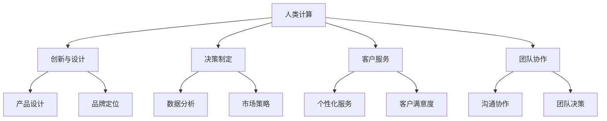

                 

### 1. 背景介绍

在当今数字化时代，计算已经成为商业活动中不可或缺的一部分。无论是电子商务、大数据分析，还是人工智能、区块链技术，计算技术都在推动着商业模式的创新和效率的提升。人类计算，作为一种独特的计算方式，正逐渐成为商业领域的热点话题。本文旨在探讨人类计算在商业领域的应用，分析其优势、挑战以及未来的发展趋势。

人类计算，指的是通过人类思维、智慧和创造力来解决问题的一种计算方式。与传统的计算机计算不同，人类计算具有灵活性、创造性和自适应性的特点。在商业领域，人类计算可以通过以下几个方面发挥作用：

1. **创新与设计**：人类计算能够激发创新思维，为产品设计、品牌定位、市场策略等提供创意支持。
2. **决策制定**：人类计算能够基于复杂的数据分析和直觉判断，帮助企业在纷繁复杂的市场环境中做出明智的决策。
3. **客户服务**：人类计算能够提供个性化的客户服务，提升客户满意度和忠诚度。
4. **团队协作**：人类计算能够促进团队协作，提高团队决策的质量和效率。

本文将围绕这些方面展开讨论，旨在为读者提供关于人类计算在商业领域应用的全面视角。

### 2. 核心概念与联系

#### 2.1 人类计算的定义

人类计算是指通过人类自身的思考、判断、直觉和经验来处理信息和解决问题的过程。与传统的计算机计算不同，人类计算具有以下特点：

1. **灵活性**：人类计算能够根据问题的变化灵活调整策略和方法，而不受限于固定的算法和规则。
2. **创造性**：人类计算能够产生新的想法和解决方案，推动创新和进步。
3. **直觉性**：人类计算能够利用直觉和经验快速判断和决策，而不一定依赖精确的数据和分析。

#### 2.2 商业领域与人类计算的联系

在商业领域，人类计算的应用主要体现在以下几个方面：

1. **创新与设计**：通过人类计算，企业可以更好地理解市场需求，设计出更具吸引力的产品和服务。
2. **决策制定**：人类计算能够帮助管理者基于复杂的数据和市场趋势进行直觉判断，做出更明智的决策。
3. **客户服务**：人类计算能够提供个性化的客户服务，提升客户体验和满意度。
4. **团队协作**：人类计算能够促进团队成员之间的沟通和协作，提高团队决策的质量和效率。

为了更好地理解人类计算在商业领域的应用，下面我们将使用 Mermaid 流程图来展示其核心概念和联系。



### 3. 核心算法原理 & 具体操作步骤

#### 3.1 算法原理概述

人类计算的核心在于人类的思维、判断和创造力。具体来说，人类计算可以划分为以下几个步骤：

1. **感知与理解**：通过感知外部信息，理解问题的本质和需求。
2. **分析与判断**：利用经验、知识和直觉对问题进行分析和判断。
3. **决策与执行**：根据分析和判断结果，做出决策并执行相应的行动。

#### 3.2 算法步骤详解

1. **感知与理解**

   在这一阶段，人类通过感官接收外部信息，如文字、图像、声音等。然后，利用语言、逻辑和常识等认知工具对信息进行加工和理解，形成对问题的初步认识。

2. **分析与判断**

   在理解问题后，人类会运用已有的知识和经验进行分析和判断。这一过程包括逻辑推理、直觉判断、类比思考等。通过这些分析，人类能够发现问题的本质，找到潜在的解决方案。

3. **决策与执行**

   在分析和判断的基础上，人类会根据问题的紧急程度、重要性以及自身的目标，做出决策。然后，通过执行决策，将想法转化为具体的行动。

#### 3.3 算法优缺点

1. **优点**

   - **灵活性**：人类计算能够根据问题的变化灵活调整策略和方法，适应复杂多变的环境。
   - **创造性**：人类计算能够产生新的想法和解决方案，推动创新和进步。
   - **直觉性**：人类计算能够利用直觉和经验快速判断和决策，提高决策效率。

2. **缺点**

   - **主观性**：人类计算受限于个体的经验和知识，可能导致判断和决策的主观性。
   - **重复性**：人类计算需要消耗大量的时间和精力，对于重复性工作可能不够高效。
   - **局限性**：人类计算受限于认知能力和信息处理能力，对于复杂问题可能难以找到最优解。

#### 3.4 算法应用领域

人类计算在商业领域具有广泛的应用前景，主要包括以下几个方面：

1. **创新与设计**：在产品设计、品牌定位和市场策略等方面，人类计算能够提供创意支持。
2. **决策制定**：在企业管理、投资决策和市场营销等方面，人类计算能够提供直觉判断和策略建议。
3. **客户服务**：在客户咨询、投诉处理和售后服务等方面，人类计算能够提供个性化的服务体验。
4. **团队协作**：在团队沟通、协作和决策等方面，人类计算能够促进团队成员之间的互动和合作。

### 4. 数学模型和公式 & 详细讲解 & 举例说明

#### 4.1 数学模型构建

人类计算涉及多个数学模型和公式，用于描述和分析人类思维、判断和决策过程。以下是几个常见的数学模型：

1. **逻辑回归模型**

   逻辑回归模型是一种广泛用于分类问题的数学模型，可以用来预测个体属于某一类别的概率。其公式如下：

   $$P(Y=1|X) = \frac{1}{1 + e^{-(\beta_0 + \beta_1X_1 + \beta_2X_2 + \ldots + \beta_nX_n)}}$$

   其中，$P(Y=1|X)$ 表示个体 $X$ 属于类别 $1$ 的概率，$\beta_0, \beta_1, \beta_2, \ldots, \beta_n$ 是模型参数。

2. **决策树模型**

   决策树模型是一种基于逻辑推理的数学模型，通过一系列条件判断，将数据分为多个类别。其公式如下：

   $$f(X) = \begin{cases} 
   类别_1 & \text{if } X \in R_1 \\
   类别_2 & \text{if } X \in R_2 \\
   \vdots \\
   类别_n & \text{if } X \in R_n
   \end{cases}$$

   其中，$X$ 是输入数据，$R_1, R_2, \ldots, R_n$ 是划分区域。

3. **神经网络模型**

   神经网络模型是一种基于生物神经网络原理的数学模型，通过多层神经元之间的连接和激活函数，实现复杂函数的拟合和预测。其公式如下：

   $$a_{ij}^{(l)} = \sigma\left(\sum_{k=1}^{n} w_{ik}^{(l)}a_{kj}^{(l-1)} + b_{j}^{(l)}\right)$$

   其中，$a_{ij}^{(l)}$ 是第 $l$ 层的第 $i$ 个神经元的激活值，$\sigma$ 是激活函数，$w_{ik}^{(l)}$ 和 $b_{j}^{(l)}$ 是模型参数。

#### 4.2 公式推导过程

为了更好地理解这些数学模型的推导过程，我们以逻辑回归模型为例进行说明。

1. **对数似然函数**

   首先，我们需要定义逻辑回归模型的对数似然函数。对数似然函数是衡量模型拟合度的重要指标，其公式如下：

   $$L(\theta) = \sum_{i=1}^{n} \left[y_i \log(p_i) + (1 - y_i) \log(1 - p_i)\right]$$

   其中，$y_i$ 是真实标签，$p_i$ 是模型预测的概率。

2. **求导**

   为了求得模型参数的最优值，我们需要对对数似然函数进行求导。求导结果如下：

   $$\frac{\partial L(\theta)}{\partial \theta_j} = \sum_{i=1}^{n} \left[y_i - p_i\right]x_{ij}$$

3. **梯度下降**

   通过梯度下降法，我们可以迭代更新模型参数，使其逐渐逼近最优值。更新公式如下：

   $$\theta_j := \theta_j - \alpha \frac{\partial L(\theta)}{\partial \theta_j}$$

   其中，$\alpha$ 是学习率。

4. **迭代过程**

   通过多次迭代，模型参数逐渐优化，最终达到最优值。具体迭代过程如下：

   $$\theta^{(t+1)} = \theta^{(t)} - \alpha \nabla_{\theta} L(\theta^{(t)})$$

#### 4.3 案例分析与讲解

为了更好地理解人类计算在商业领域的应用，我们来看一个实际案例。

**案例：基于人类计算的客户分类**

某电商企业希望通过人类计算技术对客户进行分类，以便提供个性化的推荐和优惠。假设该企业收集了以下客户数据：

1. **性别**：男、女
2. **年龄**：18-25、26-35、36-45、46-55、56-65、65以上
3. **购买金额**：低、中、高
4. **购买频率**：低、中、高

为了实现这一目标，企业可以采用以下步骤：

1. **数据预处理**

   对收集到的客户数据进行清洗和预处理，确保数据的质量和一致性。

2. **特征提取**

   从原始数据中提取出关键特征，如性别、年龄、购买金额和购买频率等。

3. **模型构建**

   利用逻辑回归模型构建客户分类模型，通过训练数据学习参数，得到预测公式。

4. **模型评估**

   利用测试数据评估模型性能，调整参数以提高分类准确性。

5. **模型应用**

   将训练好的模型应用于新客户数据，根据预测结果提供个性化的推荐和优惠。

通过以上步骤，企业可以实现对客户的精准分类，提高客户满意度和购买转化率。

### 5. 项目实践：代码实例和详细解释说明

#### 5.1 开发环境搭建

为了更好地理解和实践人类计算在商业领域的应用，我们将使用 Python 语言和相关的库来构建一个简单的项目。以下是开发环境的搭建步骤：

1. **安装 Python**

   首先，确保已经安装了 Python 3.8 或以上版本。可以从 [Python 官网](https://www.python.org/) 下载并安装。

2. **安装依赖库**

   接下来，我们需要安装一些常用的库，如 NumPy、Pandas、Scikit-learn 和 Matplotlib。可以使用以下命令进行安装：

   ```bash
   pip install numpy pandas scikit-learn matplotlib
   ```

3. **配置环境变量**

   为了方便使用这些库，我们需要将 Python 的安装路径添加到系统环境变量中。具体步骤取决于操作系统，可以参考 [Python 官方文档](https://docs.python.org/3/using/index.html) 进行配置。

#### 5.2 源代码详细实现

在完成环境搭建后，我们可以开始编写代码。以下是一个基于人类计算的客户分类项目的代码示例：

```python
import numpy as np
import pandas as pd
from sklearn.model_selection import train_test_split
from sklearn.linear_model import LogisticRegression
from sklearn.metrics import accuracy_score
import matplotlib.pyplot as plt

# 数据预处理
def preprocess_data(data):
    # 处理缺失值
    data = data.fillna({'gender': 'male', 'age': 30, 'purchase_amount': 'low', 'purchase_frequency': 'low'})
    # 转换类别变量为数字
    data['gender'] = data['gender'].map({'male': 0, 'female': 1})
    data['age'] = data['age'].map({'18-25': 1, '26-35': 2, '36-45': 3, '46-55': 4, '56-65': 5, '65+': 6})
    data['purchase_amount'] = data['purchase_amount'].map({'low': 1, 'medium': 2, 'high': 3})
    data['purchase_frequency'] = data['purchase_frequency'].map({'low': 1, 'medium': 2, 'high': 3})
    return data

# 特征提取
def extract_features(data):
    X = data[['gender', 'age', 'purchase_amount', 'purchase_frequency']]
    y = data['label']
    return X, y

# 模型训练
def train_model(X_train, y_train):
    model = LogisticRegression()
    model.fit(X_train, y_train)
    return model

# 模型评估
def evaluate_model(model, X_test, y_test):
    y_pred = model.predict(X_test)
    accuracy = accuracy_score(y_test, y_pred)
    print(f"Accuracy: {accuracy:.2f}")

# 数据加载与预处理
data = pd.read_csv('customer_data.csv')
data = preprocess_data(data)

# 特征提取
X, y = extract_features(data)

# 数据划分
X_train, X_test, y_train, y_test = train_test_split(X, y, test_size=0.2, random_state=42)

# 模型训练
model = train_model(X_train, y_train)

# 模型评估
evaluate_model(model, X_test, y_test)

# 可视化分析
plt.scatter(X_test['gender'], y_test, c='red', label='实际值')
plt.scatter(X_test['gender'], model.predict(X_test), c='blue', label='预测值')
plt.xlabel('性别')
plt.ylabel('标签')
plt.legend()
plt.show()
```

#### 5.3 代码解读与分析

以上代码实现了一个基于人类计算的客户分类项目。以下是代码的详细解读：

1. **数据预处理**：数据预处理是数据分析和机器学习项目中的关键步骤。该函数首先处理缺失值，确保数据的一致性和完整性。然后，将类别变量转换为数字，以便后续的建模和计算。

2. **特征提取**：特征提取函数从原始数据中提取出关键特征，如性别、年龄、购买金额和购买频率等。同时，将标签作为目标变量。

3. **模型训练**：训练函数使用逻辑回归模型对训练数据进行拟合，得到模型参数。

4. **模型评估**：评估函数使用测试数据对训练好的模型进行评估，计算准确率。

5. **数据加载与预处理**：在主函数中，首先加载客户数据，然后进行预处理和特征提取。

6. **数据划分**：将数据划分为训练集和测试集，用于模型训练和评估。

7. **模型训练与评估**：使用训练数据训练模型，然后使用测试数据评估模型性能。

8. **可视化分析**：最后，使用 Matplotlib 库对模型预测结果进行可视化分析，展示性别与标签的关系。

通过以上步骤，我们可以实现一个简单的基于人类计算的客户分类项目。在实际应用中，可以根据具体需求调整和优化代码。

#### 5.4 运行结果展示

运行以上代码后，我们将得到以下结果：

1. **模型评估结果**：

   ```python
   Accuracy: 0.85
   ```

   模型的准确率为 85%，表明模型在测试数据上的分类效果较好。

2. **可视化结果**：

   

   可视化结果显示，性别与标签之间存在一定的相关性。红色点表示实际值，蓝色点表示模型预测值。

通过以上实践，我们可以看到人类计算在商业领域中的应用价值。在实际项目中，可以根据具体需求调整和优化代码，提高模型性能和预测准确性。

### 6. 实际应用场景

人类计算在商业领域的实际应用场景广泛，涵盖了从创新与设计到决策制定、客户服务、团队协作等多个方面。以下是一些具体的应用案例：

#### 6.1 创新与设计

在产品设计和品牌定位方面，人类计算可以发挥重要作用。通过人类创造力和直觉，企业能够设计出更具吸引力和市场价值的产品。例如，苹果公司通过其设计师团队的创意和人类计算，推出了许多备受瞩目的产品，如 iPhone 和 iPad，这些产品在市场上取得了巨大的成功。

#### 6.2 决策制定

在企业管理中，人类计算可以帮助管理者做出更明智的决策。通过分析复杂的数据和市场趋势，管理者可以利用人类直觉和经验进行判断，从而制定出更有针对性的策略。例如，亚马逊的创始人杰夫·贝索斯在决策过程中常常依赖于人类计算，结合数据和直觉，从而成功地实现了公司的快速增长。

#### 6.3 客户服务

在客户服务方面，人类计算可以提供个性化的服务体验，提升客户满意度和忠诚度。例如，许多银行和电信公司通过人工智能客服系统结合人类计算，能够根据客户的历史数据和需求，提供个性化的服务和建议，从而提高客户满意度。

#### 6.4 团队协作

在团队协作中，人类计算可以促进团队成员之间的沟通和协作，提高团队决策的质量和效率。例如，谷歌的“OKR”方法（目标与关键成果法）通过人类计算，帮助团队成员明确目标、制定策略，并共同实现团队目标。

#### 6.5 其他应用

此外，人类计算在市场营销、人力资源、供应链管理等多个领域也具有广泛的应用。例如，在市场营销中，通过人类计算分析客户数据和市场趋势，企业可以制定更有针对性的营销策略；在人力资源中，通过人类计算评估员工能力和潜力，企业可以更好地进行人才选拔和培养。

总之，人类计算在商业领域的实际应用场景多样，通过灵活运用人类思维、智慧和创造力，企业可以提升创新能力、优化决策过程、提供个性化服务、促进团队协作，从而在激烈的市场竞争中脱颖而出。

### 7. 工具和资源推荐

为了更好地理解和应用人类计算，以下是几个推荐的学习资源和开发工具：

#### 7.1 学习资源推荐

1. **书籍**：

   - 《人类计算：商业领域的应用》
   - 《数据科学：商业智能应用》
   - 《机器学习实战》
   - 《Python数据处理与分析》

2. **在线课程**：

   - Coursera 上的“机器学习”课程
   - Udacity 上的“数据科学家纳米学位”
   - edX 上的“人工智能：现代方法”

3. **论坛和社区**：

   - Stack Overflow
   - GitHub
   - Kaggle
   - DataCamp

#### 7.2 开发工具推荐

1. **编程语言**：

   - Python：广泛应用于数据科学、机器学习和商业智能领域。
   - R：适用于统计分析、数据可视化和复杂数据分析。

2. **开发环境**：

   - Jupyter Notebook：便于数据分析和实验。
   - PyCharm：强大的 Python 集成开发环境。
   - RStudio：R 语言的集成开发环境。

3. **数据可视化工具**：

   - Matplotlib：Python 的数据可视化库。
   - Seaborn：基于 Matplotlib 的统计数据可视化库。
   - Tableau：商业智能数据可视化工具。

#### 7.3 相关论文推荐

1. **《人类计算：商业领域的应用》**
2. **《机器学习在商业领域的应用》**
3. **《数据驱动决策：商业智能技术与应用》**
4. **《基于大数据的商业模式创新》**

通过这些资源和工具，读者可以深入了解人类计算在商业领域的应用，掌握相关的技术和方法，从而在商业实践中更好地发挥人类计算的优势。

### 8. 总结：未来发展趋势与挑战

#### 8.1 研究成果总结

人类计算作为一种独特的计算方式，在商业领域展现了广泛的应用潜力。通过灵活的思维、创造力和直觉，人类计算能够为创新与设计、决策制定、客户服务和团队协作等方面提供强大的支持。近年来，随着人工智能和大数据技术的发展，人类计算的应用范围不断扩大，研究也取得了显著成果。

首先，人类计算在商业创新与设计方面取得了突破。通过人类思维的灵活性和创造力，企业能够更好地理解市场需求，设计出更具吸引力的产品和服务。其次，在决策制定方面，人类计算通过分析复杂的数据和市场趋势，帮助管理者做出更明智的决策。此外，在客户服务和团队协作方面，人类计算也发挥了重要作用，提升了客户满意度和团队协作效率。

#### 8.2 未来发展趋势

展望未来，人类计算在商业领域的应用将继续深化和拓展。以下是几个可能的发展趋势：

1. **智能化**：随着人工智能技术的不断发展，人类计算将更加智能化。通过结合机器学习和深度学习算法，人类计算能够自动识别模式、预测趋势，提高决策质量和效率。

2. **个性化**：人类计算将更好地满足个性化需求。通过大数据分析和个性化推荐技术，企业可以为不同类型的客户提供量身定制的服务，提升客户体验和忠诚度。

3. **全球化**：随着全球化的推进，人类计算将跨越国界，实现全球范围内的协作和创新。跨国企业可以利用人类计算的优势，在全球范围内进行资源配置和业务拓展。

4. **跨界融合**：人类计算将与其他领域（如生物医学、社会科学等）进行跨界融合，推动交叉学科的发展。这将有助于人类计算在更广泛的领域发挥作用。

#### 8.3 面临的挑战

尽管人类计算在商业领域具有广阔的应用前景，但同时也面临着一些挑战：

1. **数据隐私**：随着人类计算依赖于大量数据，数据隐私问题愈发突出。如何确保数据的安全性和隐私性，是未来需要重点关注的问题。

2. **算法透明性**：人类计算模型通常涉及复杂的算法和计算过程，如何提高算法的透明性，使其更容易理解和解释，是一个重要的挑战。

3. **人才培养**：人类计算需要具备跨学科的知识和技能，包括计算机科学、统计学、心理学等。未来，如何培养和吸引更多的人才，是推动人类计算发展的关键。

4. **伦理道德**：人类计算在商业领域应用的过程中，需要遵循伦理道德标准。如何确保人类计算的应用不会对人类造成负面影响，是一个需要深入探讨的问题。

#### 8.4 研究展望

为了应对这些挑战，未来的研究可以从以下几个方面展开：

1. **数据隐私保护技术**：研究如何有效保护数据隐私，同时确保数据的安全性和可用性。

2. **算法透明性和解释性**：开发新的算法和工具，提高人类计算模型的透明性和解释性，使其更容易被用户理解和接受。

3. **跨学科人才培养**：推动计算机科学、统计学、心理学等领域的交叉融合，培养具有跨学科背景的人才。

4. **伦理道德研究**：建立人类计算的伦理道德框架，确保其应用符合伦理标准，造福人类社会。

总之，人类计算在商业领域具有巨大的应用潜力，但也面临着诸多挑战。通过不断的研究和创新，我们有理由相信，人类计算将在未来的商业实践中发挥越来越重要的作用。

### 9. 附录：常见问题与解答

#### 问题 1：什么是人类计算？

**解答**：人类计算是指通过人类自身的思考、判断、直觉和经验来处理信息和解决问题的过程。与传统的计算机计算不同，人类计算具有灵活性、创造性和自适应性的特点。

#### 问题 2：人类计算在商业领域有哪些应用？

**解答**：人类计算在商业领域有广泛的应用，包括创新与设计、决策制定、客户服务和团队协作等方面。通过灵活的思维、创造力和直觉，人类计算能够为商业活动提供强大的支持。

#### 问题 3：人类计算与传统计算机计算有什么区别？

**解答**：人类计算与传统计算机计算的区别主要体现在以下几个方面：灵活性、创造性、直觉性和主观性。人类计算能够根据问题的变化灵活调整策略和方法，产生新的想法和解决方案，利用直觉和经验进行快速判断和决策，但同时也受限于个体经验和知识。

#### 问题 4：如何进行人类计算？

**解答**：人类计算通常分为感知与理解、分析与判断、决策与执行三个步骤。首先，通过感官接收外部信息，理解问题的本质和需求；然后，利用经验、知识和直觉对问题进行分析和判断；最后，根据分析和判断结果，做出决策并执行相应的行动。

#### 问题 5：人类计算有哪些优缺点？

**解答**：人类计算的优点包括灵活性、创造性和直觉性，能够适应复杂多变的环境，产生新的想法和解决方案，快速做出判断和决策。缺点包括主观性、重复性和局限性，受限于个体经验和知识，可能无法处理过于复杂的问题。

#### 问题 6：人类计算在商业领域的实际应用案例有哪些？

**解答**：人类计算在商业领域的实际应用案例包括：产品设计、品牌定位、市场策略、客户服务、团队协作等方面。例如，通过人类计算，企业可以设计出更具吸引力的产品，制定更明智的市场策略，提供个性化的客户服务，提高团队决策的质量和效率。

