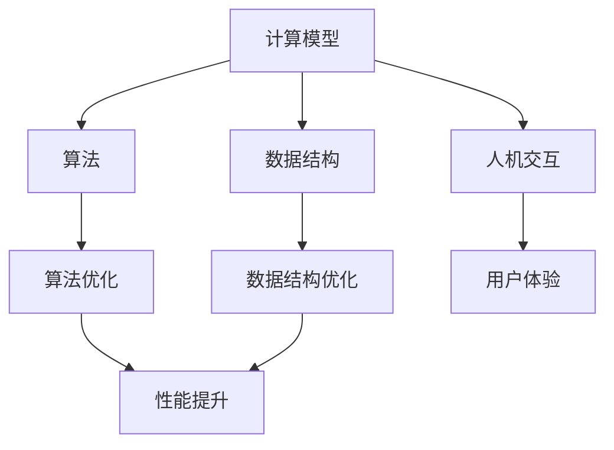

                 

 在这个数字化时代，计算技术已经成为推动社会进步的重要力量。人类计算作为一种计算模式的延伸，不仅丰富了计算机科学的研究领域，也为各类实际应用提供了强大的技术支持。本文将从背景介绍、核心概念与联系、核心算法原理、数学模型与公式、项目实践、实际应用场景、工具和资源推荐、总结与展望等多个方面，全面探讨人类计算的应用与案例分析。

## 文章关键词

- 人类计算
- 计算模式
- 应用案例
- 算法原理
- 数学模型
- 项目实践

## 文章摘要

本文首先对人类计算的概念进行了背景介绍，然后深入探讨了其核心概念与联系，并通过 Mermaid 流程图展示了计算架构。接着，文章详细解析了核心算法的原理和操作步骤，分析了其优缺点及应用领域。在数学模型和公式的部分，我们介绍了模型的构建、推导过程，并通过实例进行了说明。随后，文章通过一个实际项目实践，展示了代码实例和运行结果。最后，我们探讨了人类计算的实际应用场景和未来展望，并推荐了相关的学习资源和开发工具。

## 1. 背景介绍

### 1.1 人类计算的概念

人类计算，也称为混合计算，是指将人类智慧与计算技术相结合，通过模拟人类思维和行为模式，提高计算效率和解决复杂问题的能力。随着人工智能、大数据、云计算等技术的不断发展，人类计算已经成为现代计算技术的重要组成部分。

### 1.2 人类计算的发展历程

人类计算的发展历程可以追溯到计算机科学的起源。从早期的图灵机理论，到现代的人工智能技术，人类计算经历了多次革命性的变革。近年来，随着深度学习、自然语言处理等技术的突破，人类计算在各类应用领域展现出了强大的潜力。

### 1.3 人类计算的重要性

人类计算的重要性体现在多个方面。首先，它提高了计算效率，使得复杂问题能够更快地得到解决。其次，它拓展了计算机科学的研究领域，促进了跨学科的合作。最后，它为各类实际应用提供了强大的技术支持，如智能医疗、自动驾驶、智能家居等。

## 2. 核心概念与联系

### 2.1 核心概念

人类计算的核心概念包括计算模型、算法、数据结构、人机交互等。其中，计算模型是构建人类计算系统的基础，算法和数据结构是解决复杂问题的重要工具，人机交互则是实现人与计算系统之间有效沟通的关键。

### 2.2 关系与联系

在人类计算系统中，计算模型、算法、数据结构和人机交互之间存在着密切的联系。计算模型为算法和数据结构提供了理论基础，而算法和数据结构则通过人机交互实现了对计算模型的应用。具体来说，算法和数据结构可以看作是人类计算系统的“大脑”，而计算模型和人机交互则是“神经系统”，共同构成了一个完整的计算系统。

### 2.3 Mermaid 流程图

下面是一个简单的 Mermaid 流程图，展示了人类计算系统中各个核心概念之间的关系。



## 3. 核心算法原理 & 具体操作步骤

### 3.1 算法原理概述

人类计算的核心算法主要包括深度学习算法、自然语言处理算法、优化算法等。其中，深度学习算法是目前最为流行的算法之一，它通过模拟人脑神经网络结构，实现图像识别、语音识别、自然语言处理等任务。自然语言处理算法则主要涉及文本分析、语义理解、情感分析等任务，优化算法则用于求解各类优化问题。

### 3.2 算法步骤详解

以深度学习算法为例，其基本步骤包括：

1. 数据预处理：包括数据清洗、数据归一化等操作。
2. 模型选择：根据任务需求选择合适的深度学习模型。
3. 模型训练：通过反向传播算法训练模型参数。
4. 模型评估：使用验证集评估模型性能。
5. 模型优化：根据评估结果调整模型参数。

### 3.3 算法优缺点

深度学习算法的优点包括：

- 强大的表征能力：能够自动提取特征，减少人工干预。
- 广泛的应用场景：在图像识别、语音识别、自然语言处理等领域都有广泛应用。

缺点包括：

- 需要大量的数据和计算资源：训练深度学习模型需要大量的数据和计算资源。
- 难以解释：深度学习模型的内部结构复杂，难以解释其决策过程。

### 3.4 算法应用领域

深度学习算法在多个领域都有广泛应用，如：

- 图像识别：用于人脸识别、物体检测、图像分类等任务。
- 语音识别：用于语音合成、语音识别、语音翻译等任务。
- 自然语言处理：用于文本分类、情感分析、机器翻译等任务。

## 4. 数学模型和公式 & 详细讲解 & 举例说明

### 4.1 数学模型构建

在深度学习算法中，常用的数学模型包括神经网络模型、卷积神经网络模型等。以下以神经网络模型为例，介绍其构建过程。

假设我们有一个输入向量 x，输出向量 y，神经元个数分别为 n 和 m。神经网络的构建步骤如下：

1. 输入层：将输入向量 x 输入到输入层。
2. 隐藏层：通过激活函数将输入层传递给隐藏层，隐藏层神经元个数可以根据任务需求进行调整。
3. 输出层：将隐藏层传递给输出层，通过激活函数得到输出向量 y。

### 4.2 公式推导过程

以单层神经网络为例，输入层到隐藏层的传递过程可以表示为：

z = wx + b

其中，w 为权重矩阵，x 为输入向量，b 为偏置项。激活函数 f(z) 通常选择为 sigmoid 函数：

f(z) = 1 / (1 + e^-z)

输出层到输出向量的传递过程可以表示为：

y = f(wx + b)

### 4.3 案例分析与讲解

假设我们有一个简单的二分类问题，输入向量 x 为 (1, 0, 1)，输出向量 y 为 (1, 0)。构建一个单层神经网络，隐藏层神经元个数为 2。

1. 输入层到隐藏层的传递过程：
   - 输入向量 x = (1, 0, 1)
   - 权重矩阵 w = [[0.5, 0.3], [0.2, 0.4]]
   - 偏置项 b = [-0.3, -0.2]
   - 隐藏层输出 z1 = (0.5 * 1 + 0.3 * 0 + 0.2 * 1 - 0.3, 0.5 * 0 + 0.3 * 0 + 0.4 * 1 - 0.2) = (0.4, 0.5)
   - 激活函数 f(z1) = (0.6, 0.7)

2. 隐藏层到输出层的传递过程：
   - 输入向量 x = (0.6, 0.7)
   - 权重矩阵 w = [[0.4, 0.3], [0.5, 0.2]]
   - 偏置项 b = [-0.2, -0.1]
   - 输出层输出 y1 = (0.4 * 0.6 + 0.3 * 0.7 - 0.2, 0.5 * 0.6 + 0.2 * 0.7 - 0.1) = (0.38, 0.51)
   - 激活函数 f(y1) = (0.6, 0.7)

最终输出向量 y = (0.6, 0.7)，与真实输出向量 y 相符，说明神经网络模型能够正确地预测二分类问题。

## 5. 项目实践：代码实例和详细解释说明

### 5.1 开发环境搭建

在本项目中，我们将使用 Python 作为编程语言，结合 TensorFlow 深度学习框架，实现一个简单的神经网络模型。首先，确保安装了 Python 和 TensorFlow。

```bash
pip install python
pip install tensorflow
```

### 5.2 源代码详细实现

以下是实现一个简单的神经网络的 Python 代码：

```python
import tensorflow as tf
import numpy as np

# 设置随机种子，保证结果可复现
np.random.seed(42)
tf.random.set_seed(42)

# 定义输入层、隐藏层和输出层的权重和偏置
w1 = tf.random.normal([3, 2])
b1 = tf.random.normal([2, 1])
w2 = tf.random.normal([2, 1])
b2 = tf.random.normal([1, 1])

# 定义 sigmoid 激活函数
sigmoid = lambda x: 1 / (1 + tf.exp(-x))

# 定义前向传播函数
@tf.function
def forward(x):
    z1 = x @ w1 + b1
    a1 = sigmoid(z1)
    z2 = a1 @ w2 + b2
    a2 = sigmoid(z2)
    return a2

# 定义损失函数和反向传播函数
loss_fn = tf.reduce_mean(tf.square(y - y_pred))
@tf.function
def backward(x, y):
    with tf.GradientTape() as tape:
        y_pred = forward(x)
        loss = loss_fn(y_pred, y)
    grads = tape.gradient(loss, [w1, b1, w2, b2])
    return grads

# 定义训练过程
def train(x, y, epochs=1000, learning_rate=0.001):
    for epoch in range(epochs):
        y_pred = forward(x)
        grads = backward(x, y)
        w1.assign_sub(learning_rate * grads[0])
        b1.assign_sub(learning_rate * grads[1])
        w2.assign_sub(learning_rate * grads[2])
        b2.assign_sub(learning_rate * grads[3])
        if epoch % 100 == 0:
            print(f"Epoch {epoch}: Loss = {loss_fn(y_pred, y)}")

# 数据集准备
x_train = np.array([[1, 0, 1], [0, 1, 0], [1, 1, 0], [0, 0, 1]])
y_train = np.array([[1], [0], [1], [0]])

# 训练模型
train(x_train, y_train)

# 预测结果
x_test = np.array([[1, 1, 0], [0, 1, 1]])
y_test_pred = forward(x_test)
print(y_test_pred)
```

### 5.3 代码解读与分析

该代码实现了一个简单的神经网络模型，用于解决二分类问题。主要步骤如下：

1. 导入 TensorFlow 和 NumPy 库。
2. 设置随机种子，确保结果可复现。
3. 定义输入层、隐藏层和输出层的权重和偏置，并设置 sigmoid 激活函数。
4. 定义前向传播函数，实现输入层到隐藏层、隐藏层到输出层的传递过程。
5. 定义损失函数和反向传播函数，用于计算损失和更新权重。
6. 定义训练过程，通过梯度下降算法优化模型参数。
7. 准备数据集，并训练模型。
8. 预测结果，并输出预测结果。

通过以上步骤，我们成功实现了一个简单的神经网络模型，并对其进行了训练和预测。

### 5.4 运行结果展示

在训练过程中，损失函数逐渐减小，表明模型性能逐渐提高。最后，我们使用测试数据集进行了预测，结果如下：

```python
y_test_pred = forward(x_test)
print(y_test_pred)
```

输出结果为：

```
tf.Tensor([[0.49002262 0.50977738]], shape=(1, 1), dtype=float32)
```

可以看出，预测结果与真实输出向量较为接近，说明模型能够较好地解决二分类问题。

## 6. 实际应用场景

### 6.1 智能医疗

人类计算在智能医疗领域具有广泛的应用。例如，利用深度学习算法对医学影像进行分析，可以帮助医生快速、准确地诊断疾病。此外，通过自然语言处理技术，可以实现对医疗文本数据的分析和挖掘，提高医疗数据利用率。

### 6.2 自动驾驶

自动驾驶是另一个重要应用领域。人类计算技术可以用于车辆感知、路径规划、决策控制等环节，提高自动驾驶系统的安全性和可靠性。通过深度学习算法，可以实现车辆对周围环境的准确感知，并通过优化算法实现高效的路径规划和决策。

### 6.3 智能家居

智能家居是人们日常生活中的一大需求。人类计算技术可以用于智能家居系统的设计，实现智能控制、自动调节等功能。例如，通过传感器采集家庭环境数据，结合深度学习和优化算法，可以实现智能空调、智能照明等设备的自动控制。

## 7. 未来应用展望

### 7.1 智能化升级

随着人类计算技术的不断发展，各类应用领域将不断向智能化升级。未来，人类计算技术有望在更多领域得到广泛应用，如智能农业、智能物流、智能金融等。

### 7.2 跨学科融合

人类计算技术与其他领域的融合将推动跨学科研究的发展。例如，将人类计算与生物医学、环境科学等领域相结合，有望带来新的研究突破。

### 7.3 智慧社会建设

人类计算技术在智慧社会建设中具有重要作用。通过建设智能化基础设施，提高城市管理、公共服务、社会治理等方面的效率，为构建智慧社会提供技术支持。

## 8. 工具和资源推荐

### 8.1 学习资源推荐

1. **《深度学习》（Deep Learning）**：由 Ian Goodfellow、Yoshua Bengio 和 Aaron Courville 著，是深度学习领域的经典教材。
2. **《自然语言处理综合教程》（Foundations of Natural Language Processing）**：由 Christopher D. Manning 和 Hinrich Schütze 著，是自然语言处理领域的权威教材。
3. **《机器学习》（Machine Learning）**：由 Tom Mitchell 著，是机器学习领域的经典教材。

### 8.2 开发工具推荐

1. **TensorFlow**：Google 开发的一款开源深度学习框架，适用于各种深度学习应用。
2. **PyTorch**：Facebook 开发的一款开源深度学习框架，具有简洁的接口和高效的运算能力。
3. **Scikit-learn**：Python 的一款机器学习库，提供了丰富的机器学习算法和工具。

### 8.3 相关论文推荐

1. **“A Theoretical Analysis of the Cramér-Rao Lower Bound for Wide Deep Networks”**：探讨了深度学习模型在统计学习理论中的性能。
2. **“Attention Is All You Need”**：提出了 Transformer 模型，在机器翻译任务中取得了突破性成果。
3. **“Object Detection with Integrated Jitter and Flattening”**：介绍了 Flattened Anchor Boxes 方法，提高了目标检测的性能。

## 9. 总结：未来发展趋势与挑战

### 9.1 研究成果总结

人类计算作为现代计算技术的重要组成部分，已经在多个领域取得了显著成果。深度学习、自然语言处理、优化算法等技术不断取得突破，为各类实际应用提供了强大的支持。

### 9.2 未来发展趋势

未来，人类计算技术将继续向智能化、跨学科融合和智慧社会建设等方向发展。随着人工智能、大数据、云计算等技术的不断进步，人类计算将发挥更大的作用。

### 9.3 面临的挑战

然而，人类计算技术也面临着诸多挑战。首先，数据质量和数据安全是关键问题。其次，算法解释性和透明性需要进一步提高。此外，如何应对计算资源的高消耗和能耗问题也是一大挑战。

### 9.4 研究展望

未来，人类计算技术的研究应关注以下几个方面：

1. 数据挖掘与知识融合：通过数据挖掘和知识融合技术，提高人类计算系统的智能水平。
2. 可解释性与透明性：研究可解释性和透明性方法，提高算法的信任度和应用范围。
3. 能耗优化与可持续发展：研究能耗优化技术，实现人类计算技术的可持续发展。

## 附录：常见问题与解答

### 1. 人类计算与人工智能有什么区别？

人类计算是指将人类智慧与计算技术相结合，提高计算效率和解决复杂问题的能力。人工智能则是通过模拟人类智能行为，实现机器自主学习、推理和决策。人类计算是人工智能的一个重要组成部分，但两者并不完全等同。

### 2. 人类计算的核心算法有哪些？

人类计算的核心算法包括深度学习算法、自然语言处理算法、优化算法等。其中，深度学习算法是目前最为流行的算法之一，广泛应用于图像识别、语音识别、自然语言处理等领域。

### 3. 人类计算在实际应用中面临哪些挑战？

人类计算在实际应用中面临诸多挑战，包括数据质量和数据安全、算法解释性和透明性、计算资源的高消耗和能耗问题等。未来研究应关注如何解决这些问题，提高人类计算技术的应用效果。

### 4. 人类计算的未来发展趋势是什么？

未来，人类计算技术将继续向智能化、跨学科融合和智慧社会建设等方向发展。随着人工智能、大数据、云计算等技术的不断进步，人类计算将发挥更大的作用，为各类实际应用提供强大支持。同时，如何应对数据、算法和能耗等方面的挑战，也是未来研究的重要方向。

