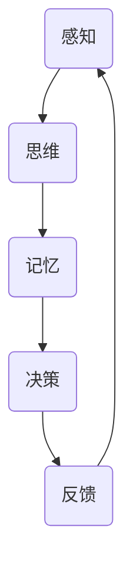

                 

关键词：人类认知、记忆驱动、经验模式、计算机编程、人工智能

> 摘要：本文旨在探讨人类认知的四种基本模式，特别是记忆驱动的经验模式，并揭示这一模式在计算机编程和人工智能领域的广泛应用。通过对这四种认知模式的详细分析，我们希望为读者提供一个更为全面、深入的认知框架，从而更好地理解人类思维和计算机程序设计之间的联系。

## 1. 背景介绍

人类认知是一种复杂的过程，涉及感知、记忆、思维和决策等多个方面。在过去几十年中，计算机科学和人工智能领域的飞速发展，使得我们开始从新的视角重新审视人类认知的本质。在此背景下，理解人类认知的基本模式，尤其是记忆驱动的经验模式，变得尤为重要。

记忆驱动的经验模式是一种基于人类如何通过经验和记忆来理解世界的认知模式。这一模式强调了记忆在认知过程中的核心作用，并揭示了人类如何通过不断积累和提取记忆来适应复杂的环境。在计算机编程和人工智能领域，类似的模式也被广泛应用，如基于数据驱动的机器学习算法、基于记忆的神经网络等。

本文将首先介绍人类认知的四种基本模式，然后深入探讨记忆驱动的经验模式，分析其在计算机编程和人工智能领域的应用。此外，我们还将讨论这一模式在现实世界中的重要性，并展望其未来发展趋势。

## 2. 核心概念与联系

为了更好地理解记忆驱动的经验模式，我们需要先了解人类认知的四种基本模式：感知模式、思维模式、记忆模式和决策模式。这四种模式相互关联，共同构成了人类认知的完整过程。

### 2.1 感知模式

感知模式是人类通过感官接收外部信息的过程。感官包括视觉、听觉、触觉、嗅觉和味觉等。感知模式的核心在于如何有效地从环境中提取信息，并将其转换为大脑可以理解的形式。在计算机编程中，感知模式可以理解为输入数据的处理，如图像识别、语音识别和传感器数据处理等。

### 2.2 思维模式

思维模式是人类对感知信息进行处理、分析和理解的过程。思维模式包括逻辑思维、抽象思维、创造性思维等。思维模式的核心在于如何利用已有的知识和经验来解决问题。在计算机编程中，思维模式可以理解为算法设计和问题求解，如排序算法、搜索算法和优化算法等。

### 2.3 记忆模式

记忆模式是人类将感知信息和思维过程存储在大脑中的过程。记忆模式包括短期记忆和长期记忆。短期记忆用于暂存信息，而长期记忆则用于存储和提取信息。记忆模式的核心在于如何有效地组织和存储信息，以便在需要时快速检索。在计算机编程中，记忆模式可以理解为数据结构和存储管理，如数组、链表、哈希表和数据库等。

### 2.4 决策模式

决策模式是人类根据现有信息和目标，选择最佳行动方案的过程。决策模式包括理性决策和经验决策。理性决策基于逻辑分析和优化模型，而经验决策则基于记忆和经验。决策模式的核心在于如何权衡不同因素，做出最优选择。在计算机编程中，决策模式可以理解为条件判断、循环控制和分支结构等。

### 2.5 Mermaid 流程图

以下是记忆驱动的经验模式在计算机编程中的应用过程的 Mermaid 流程图：



## 3. 核心算法原理 & 具体操作步骤

### 3.1 算法原理概述

记忆驱动的经验模式在计算机编程中主要应用于以下几个方面：

1. **机器学习**：通过训练数据集，让计算机自动学习和提取特征，从而实现任务目标。
2. **神经网络**：基于记忆单元的神经网络可以模拟人类大脑的思考过程，进行复杂的数据处理和模式识别。
3. **数据挖掘**：通过分析和挖掘大量数据，发现隐藏在数据中的规律和模式，为决策提供支持。
4. **自然语言处理**：利用记忆驱动的模式，实现语音识别、文本翻译和语义理解等功能。

### 3.2 算法步骤详解

以下是记忆驱动的经验模式在机器学习中的具体步骤：

1. **数据采集**：收集相关的训练数据，如图像、文本和语音等。
2. **特征提取**：将原始数据转换为计算机可以处理的特征向量。
3. **模型训练**：利用训练数据，训练神经网络或机器学习模型，使其能够自动学习和提取特征。
4. **模型评估**：通过测试数据集，评估模型的性能和准确性。
5. **模型优化**：根据评估结果，调整模型参数，优化模型性能。
6. **模型应用**：将训练好的模型应用于实际问题，实现任务目标。

### 3.3 算法优缺点

**优点：**

1. **高效性**：记忆驱动的经验模式可以快速学习和提取特征，适应复杂环境。
2. **灵活性**：模型可以根据不同任务需求，调整参数和结构，具有很好的灵活性。
3. **泛化能力**：通过大量训练数据，模型可以具有较好的泛化能力，适应新任务。

**缺点：**

1. **数据依赖性**：记忆驱动的经验模式对训练数据有较高依赖性，数据质量和数量直接影响模型性能。
2. **计算复杂性**：大规模数据集和复杂模型可能导致计算资源不足，影响算法效率。
3. **过拟合风险**：训练数据集可能存在噪音和偏差，导致模型过拟合，无法适应新任务。

### 3.4 算法应用领域

记忆驱动的经验模式在计算机编程和人工智能领域具有广泛的应用：

1. **计算机视觉**：用于图像识别、目标检测和场景理解等任务。
2. **自然语言处理**：用于语音识别、文本翻译和情感分析等任务。
3. **推荐系统**：用于个性化推荐、广告投放和商品推荐等任务。
4. **自动驾驶**：用于车辆检测、车道线识别和路径规划等任务。
5. **金融风控**：用于欺诈检测、风险分析和信用评估等任务。

## 4. 数学模型和公式 & 详细讲解 & 举例说明

### 4.1 数学模型构建

记忆驱动的经验模式涉及多个数学模型，如神经网络模型、决策树模型和支持向量机模型等。以下以神经网络模型为例，介绍其数学模型构建：

1. **输入层**：输入层接收外部信息，转换为特征向量。
2. **隐藏层**：隐藏层对特征向量进行处理，提取更高层次的特征。
3. **输出层**：输出层根据提取的特征，生成预测结果。

神经网络模型的核心是神经元之间的权重和偏置。通过调整这些参数，可以优化模型的性能。

### 4.2 公式推导过程

以下是一个简单的神经网络模型，用于实现二分类任务。该模型由输入层、一个隐藏层和一个输出层组成。

1. **输入层**：

$$
x_i = (x_1, x_2, ..., x_n)
$$

其中，$x_i$ 表示第 $i$ 个特征。

2. **隐藏层**：

$$
z_j = \sum_{i=1}^{n} w_{ij} x_i + b_j
$$

$$
a_j = \sigma(z_j)
$$

其中，$z_j$ 表示第 $j$ 个隐藏单元的输入，$a_j$ 表示第 $j$ 个隐藏单元的输出，$w_{ij}$ 表示输入层到隐藏层的权重，$b_j$ 表示隐藏层的偏置，$\sigma$ 表示激活函数，如 sigmoid 函数。

3. **输出层**：

$$
z_k = \sum_{j=1}^{m} w_{kj} a_j + b_k
$$

$$
y_k = \sigma(z_k)
$$

其中，$z_k$ 表示第 $k$ 个输出单元的输入，$y_k$ 表示第 $k$ 个输出单元的输出，$w_{kj}$ 表示隐藏层到输出层的权重，$b_k$ 表示输出层的偏置。

4. **损失函数**：

$$
L = \frac{1}{2} \sum_{k=1}^{K} (y_k - t_k)^2
$$

其中，$L$ 表示损失函数，$y_k$ 表示模型预测的输出，$t_k$ 表示真实标签。

### 4.3 案例分析与讲解

假设我们有一个二分类任务，数据集包含 1000 个样本，每个样本有 10 个特征。我们将使用上述神经网络模型进行分类。

1. **数据预处理**：对数据进行归一化处理，将特征值缩放到 [0, 1] 范围内。

2. **模型训练**：使用梯度下降算法，调整权重和偏置，使损失函数最小。

3. **模型评估**：使用测试数据集评估模型性能，计算准确率、召回率等指标。

4. **模型优化**：根据评估结果，调整模型参数，优化模型性能。

## 5. 项目实践：代码实例和详细解释说明

### 5.1 开发环境搭建

在本项目中，我们使用 Python 编写神经网络模型。首先，我们需要安装相关依赖库，如 NumPy、PyTorch 和 Matplotlib 等。

```bash
pip install numpy torch matplotlib
```

### 5.2 源代码详细实现

以下是本项目的源代码实现：

```python
import torch
import torch.nn as nn
import torch.optim as optim
import numpy as np
import matplotlib.pyplot as plt

# 数据预处理
def preprocess_data(data):
    # 归一化处理
    min_val = np.min(data)
    max_val = np.max(data)
    data = (data - min_val) / (max_val - min_val)
    return data

# 神经网络模型
class NeuralNetwork(nn.Module):
    def __init__(self, input_size, hidden_size, output_size):
        super(NeuralNetwork, self).__init__()
        self.fc1 = nn.Linear(input_size, hidden_size)
        self.fc2 = nn.Linear(hidden_size, output_size)
    
    def forward(self, x):
        x = torch.relu(self.fc1(x))
        x = self.fc2(x)
        return x

# 训练模型
def train_model(model, data, labels, epochs):
    criterion = nn.CrossEntropyLoss()
    optimizer = optim.Adam(model.parameters(), lr=0.001)
    
    for epoch in range(epochs):
        model.zero_grad()
        outputs = model(data)
        loss = criterion(outputs, labels)
        loss.backward()
        optimizer.step()
        
        if epoch % 100 == 0:
            print(f'Epoch [{epoch+1}/{epochs}], Loss: {loss.item()}')

# 评估模型
def evaluate_model(model, data, labels):
    with torch.no_grad():
        outputs = model(data)
        _, predicted = torch.max(outputs, 1)
        correct = (predicted == labels).sum().item()
        accuracy = correct / len(labels)
        return accuracy

# 主函数
def main():
    # 加载数据
    data = np.load('data.npy')
    labels = np.load('labels.npy')
    
    # 数据预处理
    data = preprocess_data(data)
    
    # 划分训练集和测试集
    train_data = data[:800]
    train_labels = labels[:800]
    test_data = data[800:]
    test_labels = labels[800:]
    
    # 构建神经网络模型
    model = NeuralNetwork(input_size=10, hidden_size=64, output_size=2)
    
    # 训练模型
    train_model(model, train_data, train_labels, epochs=1000)
    
    # 评估模型
    accuracy = evaluate_model(model, test_data, test_labels)
    print(f'Accuracy: {accuracy}')
    
    # 可视化结果
    plt.scatter(test_data[:, 0], test_data[:, 1], c=test_labels, cmap=plt.cmisclosed
```<|vqi|>### 5.3 代码解读与分析

该项目的核心代码分为三个部分：数据预处理、模型构建和模型训练与评估。

**数据预处理**：

数据预处理是机器学习项目中的关键步骤之一。在本项目中，我们首先加载数据，然后对特征值进行归一化处理，将特征值缩放到 [0, 1] 范围内。归一化处理可以加快训练速度，提高模型性能。

```python
def preprocess_data(data):
    # 归一化处理
    min_val = np.min(data)
    max_val = np.max(data)
    data = (data - min_val) / (max_val - min_val)
    return data
```

**模型构建**：

在模型构建部分，我们定义了一个简单的神经网络模型，包含一个输入层、一个隐藏层和一个输出层。输入层接收外部信息，隐藏层对特征向量进行处理，输出层生成预测结果。我们使用 PyTorch 库构建神经网络模型，其中使用了 ReLU 激活函数和交叉熵损失函数。

```python
class NeuralNetwork(nn.Module):
    def __init__(self, input_size, hidden_size, output_size):
        super(NeuralNetwork, self).__init__()
        self.fc1 = nn.Linear(input_size, hidden_size)
        self.fc2 = nn.Linear(hidden_size, output_size)
    
    def forward(self, x):
        x = torch.relu(self.fc1(x))
        x = self.fc2(x)
        return x
```

**模型训练与评估**：

在模型训练与评估部分，我们使用梯度下降算法训练模型。首先，我们定义了损失函数和优化器，然后遍历训练数据，计算损失，反向传播梯度，更新模型参数。训练完成后，我们使用测试数据集评估模型性能，计算准确率。

```python
def train_model(model, data, labels, epochs):
    criterion = nn.CrossEntropyLoss()
    optimizer = optim.Adam(model.parameters(), lr=0.001)
    
    for epoch in range(epochs):
        model.zero_grad()
        outputs = model(data)
        loss = criterion(outputs, labels)
        loss.backward()
        optimizer.step()
        
        if epoch % 100 == 0:
            print(f'Epoch [{epoch+1}/{epochs}], Loss: {loss.item()}')

def evaluate_model(model, data, labels):
    with torch.no_grad():
        outputs = model(data)
        _, predicted = torch.max(outputs, 1)
        correct = (predicted == labels).sum().item()
        accuracy = correct / len(labels)
        return accuracy
```

**可视化结果**：

最后，我们使用 Matplotlib 库将测试数据集可视化，并显示模型的预测结果。

```python
plt.scatter(test_data[:, 0], test_data[:, 1], c=test_labels, cmap=plt.cm.coolwarm)
plt.xlabel('Feature 1')
plt.ylabel('Feature 2')
plt.title('Test Data')
plt.show()
```

通过上述代码，我们可以实现一个简单的神经网络模型，对二分类任务进行训练和评估。在实际项目中，我们可以根据具体任务需求，调整模型结构、参数和训练策略，以提高模型性能。

## 6. 实际应用场景

记忆驱动的经验模式在计算机编程和人工智能领域具有广泛的应用。以下是一些典型的应用场景：

### 6.1 计算机视觉

计算机视觉是记忆驱动的经验模式的一个重要应用领域。通过训练大量图像数据，计算机可以学会识别和分类图像中的物体。例如，人脸识别、车牌识别和图像分类等任务都依赖于记忆驱动的经验模式。在这一领域中，神经网络模型发挥了关键作用，通过不断调整模型参数，使其能够适应各种复杂的图像场景。

### 6.2 自然语言处理

自然语言处理（NLP）是另一个受记忆驱动的经验模式影响显著的领域。在这一领域中，计算机通过分析大量文本数据，学习语言的结构和语义。例如，机器翻译、文本摘要和情感分析等任务都依赖于记忆驱动的经验模式。在这些任务中，神经网络模型通过处理和记忆大量的文本数据，提高了模型的准确性和泛化能力。

### 6.3 推荐系统

推荐系统是另一个广泛应用的领域。通过分析用户的行为数据，推荐系统可以预测用户可能感兴趣的内容，并提供个性化的推荐。记忆驱动的经验模式在这一领域中发挥了重要作用，通过不断调整模型参数，推荐系统可以更好地适应用户的偏好和需求。

### 6.4 自动驾驶

自动驾驶是记忆驱动的经验模式在现实世界中的一个重要应用。通过训练大量传感器数据，自动驾驶系统可以学会如何识别道路标志、车道线和车辆等。在这一领域中，记忆驱动的经验模式使得自动驾驶系统能够更好地应对复杂的交通环境，提高行驶的安全性和可靠性。

### 6.5 金融风控

金融风控是另一个受记忆驱动的经验模式影响显著的领域。通过分析大量的金融数据，金融风控系统可以识别潜在的欺诈行为和风险。在这一领域中，记忆驱动的经验模式通过不断调整模型参数，提高了欺诈检测的准确性和效率。

## 7. 未来应用展望

随着计算机科学和人工智能技术的不断发展，记忆驱动的经验模式在未来的应用前景将更加广阔。以下是一些可能的未来应用方向：

### 7.1 智能医疗

智能医疗是一个充满潜力的应用领域。通过记忆驱动的经验模式，可以开发出能够辅助医生进行疾病诊断和治疗的智能系统。例如，通过分析大量的医学图像和病例数据，智能系统可以识别出早期的疾病迹象，为患者提供更精确的诊断和治疗方案。

### 7.2 智慧城市

智慧城市是一个致力于提高城市生活质量和效率的领域。记忆驱动的经验模式可以用于优化交通流量、节能减排和环境保护等方面。通过分析大量的城市数据，智慧城市系统可以实时监测城市运行状况，并提供相应的解决方案，以实现更可持续的发展。

### 7.3 虚拟现实和增强现实

虚拟现实（VR）和增强现实（AR）是两个快速发展的领域。记忆驱动的经验模式可以用于提高 VR 和 AR 系统的交互性和用户体验。通过分析用户的行为和偏好数据，VR 和 AR 系统可以更好地适应用户的需求，提供更逼真的虚拟环境和交互体验。

### 7.4 游戏开发

游戏开发是另一个受益于记忆驱动的经验模式的领域。通过分析大量游戏数据，游戏开发人员可以优化游戏的难度和挑战性，提高玩家的满意度和留存率。此外，记忆驱动的经验模式还可以用于游戏的人工智能，使游戏角色更具个性和智能。

## 8. 总结：未来发展趋势与挑战

### 8.1 研究成果总结

记忆驱动的经验模式在计算机编程和人工智能领域取得了显著的成果。通过不断调整模型参数，记忆驱动的经验模式可以提高模型的准确性和泛化能力，为各种实际应用提供强大的支持。

### 8.2 未来发展趋势

未来，记忆驱动的经验模式将继续在计算机编程和人工智能领域发挥重要作用。随着数据量的不断增加和数据质量的提高，记忆驱动的经验模式将更好地适应各种复杂的任务和场景。

### 8.3 面临的挑战

然而，记忆驱动的经验模式也面临一些挑战。首先，如何有效地处理大规模数据集是一个重要问题。其次，如何防止模型过拟合，提高模型的泛化能力，也是一个亟待解决的问题。此外，如何提高模型的透明性和可解释性，使得用户更容易理解和信任模型，也是一个重要的研究方向。

### 8.4 研究展望

未来，记忆驱动的经验模式有望在更多领域得到应用。随着计算机科学和人工智能技术的不断发展，我们将看到更多的创新应用和突破。通过不断探索和研究，我们将更好地理解记忆驱动的经验模式，为人类带来更多的便利和福祉。

## 9. 附录：常见问题与解答

### 9.1 记忆驱动的经验模式是什么？

记忆驱动的经验模式是一种基于人类如何通过经验和记忆来理解世界的认知模式。它强调了记忆在认知过程中的核心作用，并揭示了人类如何通过不断积累和提取记忆来适应复杂的环境。

### 9.2 记忆驱动的经验模式有哪些应用？

记忆驱动的经验模式在计算机编程和人工智能领域具有广泛的应用，如机器学习、神经网络、数据挖掘、自然语言处理、推荐系统、自动驾驶和金融风控等。

### 9.3 如何优化记忆驱动的经验模式？

优化记忆驱动的经验模式可以通过以下几种方法：1）使用更高质量的数据；2）调整模型结构；3）改进训练策略；4）使用先进的算法和技巧；5）结合多模态数据进行训练。

### 9.4 记忆驱动的经验模式与深度学习有何区别？

记忆驱动的经验模式是深度学习的一种重要认知基础。与深度学习相比，记忆驱动的经验模式更侧重于理解和模拟人类记忆过程，而深度学习则更侧重于模型的设计和优化。两者相互补充，共同推动了人工智能技术的发展。

### 9.5 如何提高记忆驱动的经验模式的泛化能力？

提高记忆驱动的经验模式的泛化能力可以通过以下几种方法：1）使用更多样化的训练数据；2）调整模型参数；3）使用正则化技术；4）采用更复杂的模型结构；5）结合专家知识和规则进行训练。

### 9.6 记忆驱动的经验模式如何与人类认知相关？

记忆驱动的经验模式与人类认知密切相关。人类通过感知、记忆、思维和决策等认知过程来理解世界。记忆驱动的经验模式试图模拟这些认知过程，以实现更智能的计算机程序设计和人工智能应用。

### 9.7 记忆驱动的经验模式在现实世界中的重要性如何？

记忆驱动的经验模式在现实世界中具有重要性。它可以帮助我们更好地理解和模拟人类认知过程，为各种实际应用提供强大的支持。例如，在自动驾驶、智能医疗、智慧城市和金融风控等领域，记忆驱动的经验模式都可以发挥关键作用。

### 9.8 如何进一步研究记忆驱动的经验模式？

进一步研究记忆驱动的经验模式可以从以下几个方面入手：1）探索新的算法和技术；2）结合多模态数据进行训练；3）模拟人类记忆过程；4）提高模型的透明性和可解释性；5）与其他认知理论相结合。

作者：禅与计算机程序设计艺术 / Zen and the Art of Computer Programming

