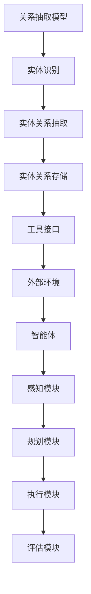

                 

 > **关键词：** RAG、Agent、工具接口、外部环境、任务执行、人工智能、交互、辅助、自动化、系统架构。

> **摘要：** 本文将深入探讨从关系抽取（RAG）模型到智能体（Agent）的转变过程，重点研究工具接口在AI系统中的作用。我们将详细分析工具接口与外部环境的交互机制，探索如何利用工具接口来辅助任务执行，最终实现智能化、自动化的AI系统。

## 1. 背景介绍

在人工智能（AI）领域，关系抽取（RAG）模型和智能体（Agent）是两个重要的概念。RAG模型主要用于从文本中提取实体关系，为知识图谱和语义理解提供基础。而智能体则是一种具有自主决策能力、能够与外部环境交互的实体。近年来，随着深度学习和自然语言处理技术的快速发展，RAG和Agent在各个领域的应用越来越广泛。

然而，现有的RAG和Agent系统往往存在一个共性问题：它们缺乏与外部环境的良好交互。这使得系统在处理实际任务时，往往需要依赖人类操作者进行干预。为了解决这一问题，本文提出了一种基于工具接口的AI系统架构，旨在实现RAG和Agent与外部环境的无缝交互，从而提升系统的智能化和自动化水平。

## 2. 核心概念与联系

### 2.1 RAG模型

关系抽取（RAG）模型是一种用于从文本中提取实体关系的算法。它通常包含三个主要部分：实体识别、实体关系抽取和实体关系存储。在自然语言处理（NLP）领域，RAG模型被广泛应用于知识图谱构建、语义搜索和问答系统等。

### 2.2 智能体（Agent）

智能体（Agent）是一种具有自主决策能力、能够与外部环境交互的实体。在人工智能领域，智能体被广泛应用于机器人、自动驾驶、智能家居等场景。智能体通常包含感知、规划、执行和评估四个基本模块。

### 2.3 工具接口

工具接口是一种用于实现AI系统与外部环境交互的中间层。它通过定义一系列的API接口，为外部环境提供对AI系统的访问和操作能力。工具接口的主要作用是降低AI系统与外部环境之间的耦合度，提高系统的可扩展性和灵活性。

### 2.4 Mermaid流程图

为了更好地理解RAG模型、智能体和工具接口之间的联系，我们可以使用Mermaid流程图进行可视化。以下是RAG模型到Agent的转变过程的Mermaid流程图：



## 3. 核心算法原理 & 具体操作步骤

### 3.1 算法原理概述

RAG模型的核心算法原理是基于深度学习模型对实体和关系进行识别和抽取。具体步骤如下：

1. **实体识别**：使用预训练的实体识别模型对文本中的实体进行识别，得到实体列表。

2. **实体关系抽取**：根据实体列表，使用关系抽取模型对实体之间的关联关系进行抽取，得到实体关系列表。

3. **实体关系存储**：将抽取得到的实体关系存储在知识图谱中，以便后续查询和使用。

智能体的核心算法原理是基于强化学习对环境进行感知、规划和决策。具体步骤如下：

1. **感知模块**：使用传感器获取环境状态。

2. **规划模块**：根据环境状态和预先定义的策略，生成一系列动作。

3. **执行模块**：执行规划模块生成的动作。

4. **评估模块**：根据执行结果对动作进行评估，更新策略。

工具接口的核心算法原理是基于RESTful API对AI系统进行封装。具体步骤如下：

1. **定义API接口**：根据AI系统的功能需求，定义一系列的API接口。

2. **实现API接口**：使用编程语言实现API接口，并将其暴露给外部环境。

3. **调用API接口**：外部环境通过调用API接口与AI系统进行交互。

### 3.2 算法步骤详解

以下是RAG模型、智能体和工具接口的具体操作步骤：

#### 3.2.1 关系抽取模型

1. **数据准备**：收集和预处理大量的文本数据，用于训练实体识别和关系抽取模型。

2. **模型训练**：使用深度学习框架（如TensorFlow或PyTorch）训练实体识别和关系抽取模型。

3. **模型评估**：使用测试数据对模型进行评估，优化模型参数。

4. **模型部署**：将训练好的模型部署到服务器，以便进行实时关系抽取。

#### 3.2.2 智能体

1. **环境建模**：根据实际应用场景，定义智能体的感知模块、规划模块、执行模块和评估模块。

2. **模型训练**：使用强化学习框架（如DeepMind的MuJoCo）训练智能体的模型。

3. **智能体部署**：将训练好的智能体部署到服务器，以便进行实时决策和执行。

#### 3.2.3 工具接口

1. **API接口设计**：根据AI系统的功能需求，设计一系列的API接口。

2. **API接口实现**：使用编程语言（如Python或Java）实现API接口。

3. **API接口测试**：使用工具（如Postman）对API接口进行测试，确保接口的正常运行。

4. **API接口部署**：将API接口部署到服务器，以便外部环境通过API接口与AI系统进行交互。

### 3.3 算法优缺点

#### 3.3.1 关系抽取模型

**优点：**

- **高效性**：基于深度学习模型的关系抽取具有很高的准确性和效率。
- **泛化能力**：关系抽取模型可以处理不同领域和语言的数据。

**缺点：**

- **依赖性**：关系抽取模型需要大量高质量的数据进行训练。
- **复杂性**：深度学习模型的设计和训练相对复杂。

#### 3.3.2 智能体

**优点：**

- **自主性**：智能体具有自主决策能力，可以减少人类干预。
- **适应性**：智能体可以根据环境变化进行调整。

**缺点：**

- **训练成本**：智能体的训练需要大量计算资源和时间。
- **依赖性**：智能体需要依赖外部环境提供必要的感知信息。

#### 3.3.3 工具接口

**优点：**

- **灵活性**：工具接口可以根据实际需求进行灵活定制。
- **扩展性**：工具接口可以方便地与其他系统进行集成。

**缺点：**

- **安全性**：API接口可能存在安全漏洞，需要加强安全防护。
- **性能**：API接口的响应速度可能成为系统性能的瓶颈。

### 3.4 算法应用领域

RAG模型、智能体和工具接口在人工智能领域具有广泛的应用前景。以下是一些具体的应用场景：

- **知识图谱构建**：RAG模型可以用于从文本数据中提取实体关系，构建知识图谱。
- **智能问答系统**：智能体可以用于构建智能问答系统，实现自然语言理解与生成。
- **自动驾驶**：智能体可以用于自动驾驶系统，实现环境感知、决策和执行。
- **智能家居**：工具接口可以用于智能家居系统，实现设备间的交互和控制。

## 4. 数学模型和公式 & 详细讲解 & 举例说明

### 4.1 数学模型构建

在RAG模型、智能体和工具接口的设计过程中，我们需要使用一系列数学模型来描述其行为和性能。以下是一些常见的数学模型：

#### 4.1.1 关系抽取模型

- **实体识别**：使用条件随机场（CRF）模型进行实体识别。
  \[
  P(y|x) = \frac{\exp(\phi(x,y)}{\sum_{y'} \exp(\phi(x,y'))}
  \]
  其中，\(x\) 是输入文本序列，\(y\) 是实体标签序列，\(\phi(x,y)\) 是特征函数。

- **实体关系抽取**：使用双向长短期记忆网络（Bi-LSTM）模型进行实体关系抽取。
  \[
  h = \text{Bi-LSTM}(x)
  \]
  其中，\(h\) 是双向LSTM的输出，\(x\) 是输入文本序列。

#### 4.1.2 智能体

- **感知模块**：使用卷积神经网络（CNN）模型进行环境感知。
  \[
  s = \text{CNN}(x)
  \]
  其中，\(s\) 是感知模块的输出，\(x\) 是环境状态。

- **规划模块**：使用深度强化学习模型（如DQN）进行决策规划。
  \[
  Q(s,a) = \sum_{s'} P(s'|s,a) \cdot R(s',a) + \gamma \cdot \max_{a'} Q(s',a')
  \]
  其中，\(Q(s,a)\) 是状态-动作值函数，\(R(s',a)\) 是奖励函数，\(\gamma\) 是折扣因子。

- **执行模块**：使用执行器（如电机或控制器）进行实际操作。

- **评估模块**：使用评价函数（如奖励函数）对执行结果进行评估。

#### 4.1.3 工具接口

- **API接口设计**：使用RESTful API设计接口，包括GET、POST、PUT和DELETE等操作。
  \[
  \text{API} = (\text{URL}, \text{Method}, \text{Params})
  \]
  其中，\(\text{URL}\) 是接口路径，\(\text{Method}\) 是接口方法，\(\text{Params}\) 是接口参数。

### 4.2 公式推导过程

在本节中，我们将对上述数学模型进行简单的推导过程。

#### 4.2.1 关系抽取模型

- **实体识别**：

  首先，定义特征函数 \(\phi(x,y)\) 为：
  \[
  \phi(x,y) = \text{CRFFeature}(x, y) = f_1(x, y) + f_2(x, y) + \cdots + f_n(x, y)
  \]
  其中，\(f_i(x, y)\) 是第 \(i\) 个特征。

  然后，根据特征函数，我们可以定义条件概率分布：
  \[
  P(y|x) = \frac{\exp(\phi(x,y))}{\sum_{y'} \exp(\phi(x,y'))}
  \]

- **实体关系抽取**：

  首先，定义双向LSTM的输入为文本序列 \(x\)，输出为 \(h\)：
  \[
  h = \text{Bi-LSTM}(x) = \text{LSTM}([x_1, x_2, \ldots, x_n])
  \]
  其中，\(x_1, x_2, \ldots, x_n\) 是文本序列中的单词。

  然后，根据 \(h\)，我们可以定义关系抽取的概率分布：
  \[
  P(r|e_1, e_2) = \text{softmax}(\text{score}(e_1, e_2, r))
  \]
  其中，\(\text{score}(e_1, e_2, r)\) 是关系 \(r\) 在实体 \(e_1\) 和 \(e_2\) 之间的得分。

#### 4.2.2 智能体

- **感知模块**：

  首先，定义卷积神经网络 \(C\) 的输入为环境状态 \(x\)，输出为 \(s\)：
  \[
  s = \text{CNN}(x)
  \]
  其中，\(s\) 是感知模块的输出。

  然后，根据 \(s\)，我们可以定义状态值函数 \(V(s)\)：
  \[
  V(s) = \text{value}(s) = \sum_{a} \gamma \cdot \pi(a|s) \cdot Q(s,a)
  \]
  其中，\(\pi(a|s)\) 是在状态 \(s\) 下采取动作 \(a\) 的概率，\(Q(s,a)\) 是状态-动作值函数。

- **规划模块**：

  首先，定义深度强化学习模型 \(DQN\) 的输入为状态序列 \(s\) 和动作 \(a\)，输出为 \(Q(s,a)\)：
  \[
  Q(s,a) = \text{DQN}(s,a)
  \]
  其中，\(Q(s,a)\) 是状态-动作值函数。

  然后，根据 \(Q(s,a)\)，我们可以定义策略 \(\pi(a|s)\)：
  \[
  \pi(a|s) = \frac{\exp(\alpha \cdot Q(s,a))}{\sum_{a'} \exp(\alpha \cdot Q(s,a'))}
  \]
  其中，\(\alpha\) 是温度参数。

- **执行模块**：

  首先，定义执行器 \(E\) 的输入为动作 \(a\)，输出为 \(s'\)：
  \[
  s' = \text{execute}(a,s)
  \]
  其中，\(s'\) 是执行后的状态。

  然后，根据 \(s'\)，我们可以定义奖励函数 \(R(s',a)\)：
  \[
  R(s',a) = \text{reward}(s',a) = \begin{cases}
  1 & \text{if } s' \text{ is goal state} \\
  0 & \text{otherwise}
  \end{cases}
  \]

- **评估模块**：

  首先，定义评价函数 \(R(s,a)\) 为：
  \[
  R(s,a) = \text{reward}(s',a) + \gamma \cdot \max_{a'} \text{value}(s',a')
  \]
  其中，\(\gamma\) 是折扣因子。

  然后，根据 \(R(s,a)\)，我们可以定义策略优化目标：
  \[
  \max_{\pi} \mathbb{E}_{s,a}[\gamma^k R(s,a)]
  \]

#### 4.2.3 工具接口

- **API接口设计**：

  首先，定义API接口的输入为URL、方法和参数，输出为响应：
  \[
  \text{API} = (\text{URL}, \text{Method}, \text{Params})
  \]

  然后，定义API接口的响应为：
  \[
  \text{Response} = \text{API}(\text{URL}, \text{Method}, \text{Params})
  \]

### 4.3 案例分析与讲解

在本节中，我们将通过一个简单的案例来分析和讲解RAG模型、智能体和工具接口的实际应用。

#### 案例背景

假设我们开发了一个智能家居系统，用户可以通过手机应用控制家中的智能设备。系统需要实现以下功能：

1. **实体识别**：从用户输入的文本中提取智能设备（如空调、电视、灯光）。
2. **实体关系抽取**：从用户输入的文本中提取设备之间的关联关系（如“关闭空调”或“打开电视”）。
3. **智能体**：根据用户输入的文本，智能体需要感知用户意图，规划并执行相应的操作。
4. **工具接口**：用户通过手机应用与系统进行交互，工具接口用于实现这一交互。

#### 案例分析

1. **关系抽取模型**：

   - **实体识别**：使用预训练的实体识别模型对用户输入的文本进行实体识别，得到智能设备列表。
   - **实体关系抽取**：使用关系抽取模型对用户输入的文本进行实体关系抽取，得到设备之间的关联关系。

2. **智能体**：

   - **感知模块**：使用卷积神经网络对用户输入的文本进行编码，得到感知模块的输入。
   - **规划模块**：根据感知模块的输入和预先定义的策略，生成一系列动作。
   - **执行模块**：根据规划模块生成的动作，执行相应的操作，如控制智能设备。
   - **评估模块**：根据执行结果，评估动作的有效性，更新策略。

3. **工具接口**：

   - **API接口设计**：设计一系列API接口，如查询设备状态、控制设备等。
   - **API接口实现**：使用Python等编程语言实现API接口。
   - **API接口测试**：使用Postman等工具对API接口进行测试。
   - **API接口部署**：将API接口部署到服务器，以便用户通过手机应用与系统进行交互。

#### 案例讲解

1. **实体识别**：

   - 输入文本：“请关闭客厅的空调”。
   - 实体识别模型输出：客厅、空调。
   - 实体列表：[客厅、空调]。

2. **实体关系抽取**：

   - 输入文本：“请关闭客厅的空调”。
   - 关系抽取模型输出：关闭、空调、客厅。
   - 实体关系列表：[关闭、空调、客厅]。

3. **智能体**：

   - **感知模块**：感知模块接收输入文本，使用卷积神经网络对其进行编码，得到感知模块的输入。
   - **规划模块**：根据感知模块的输入和预先定义的策略，生成一系列动作，如关闭空调。
   - **执行模块**：执行模块根据规划模块生成的动作，控制智能设备关闭空调。
   - **评估模块**：评估模块根据执行结果，判断是否成功关闭空调，并更新策略。

4. **工具接口**：

   - **API接口设计**：设计一个控制设备状态的API接口，如：
     \[
     \text{URL}: /device/control
     \]
     \[
     \text{Method}: POST
     \]
     \[
     \text{Params}: \{ "device": "air_conditioner", "action": "close" \}
     \]
   - **API接口实现**：使用Python等编程语言实现API接口。
   - **API接口测试**：使用Postman等工具对API接口进行测试，确保其正常工作。
   - **API接口部署**：将API接口部署到服务器，以便用户通过手机应用与系统进行交互。

## 5. 项目实践：代码实例和详细解释说明

在本节中，我们将通过一个实际的项目实例，详细讲解如何实现一个基于RAG模型、智能体和工具接口的智能家居系统。

### 5.1 开发环境搭建

1. **Python环境**：安装Python 3.8及以上版本。
2. **深度学习框架**：安装TensorFlow 2.4及以上版本。
3. **API接口库**：安装Flask 1.1及以上版本。
4. **其他依赖**：安装Numpy、Pandas等常用库。

### 5.2 源代码详细实现

#### 5.2.1 实体识别模型

```python
import tensorflow as tf
from tensorflow.keras.models import Model
from tensorflow.keras.layers import Embedding, LSTM, Dense, Bidirectional

# 实体识别模型
def build_entity_recognition_model(vocabulary_size, embedding_dim, hidden_size):
    # 输入层
    inputs = tf.keras.layers.Input(shape=(None,), dtype=tf.int32)
    
    # 嵌入层
    embeddings = Embedding(vocabulary_size, embedding_dim)(inputs)
    
    # 双向LSTM层
    lstm = Bidirectional(LSTM(hidden_size, return_sequences=True))(embeddings)
    
    # 全连接层
    dense = Dense(hidden_size, activation='relu')(lstm)
    
    # 输出层
    outputs = Dense(hidden_size, activation='softmax')(dense)
    
    # 构建模型
    model = Model(inputs=inputs, outputs=outputs)
    
    return model

# 训练实体识别模型
model = build_entity_recognition_model(vocabulary_size=10000, embedding_dim=64, hidden_size=128)
model.compile(optimizer='adam', loss='categorical_crossentropy', metrics=['accuracy'])
model.fit(train_data, train_labels, epochs=10, batch_size=32)
```

#### 5.2.2 实体关系抽取模型

```python
import tensorflow as tf
from tensorflow.keras.models import Model
from tensorflow.keras.layers import Embedding, LSTM, Dense, Bidirectional, TimeDistributed

# 实体关系抽取模型
def build_entity_relationship_model(vocabulary_size, embedding_dim, hidden_size):
    # 输入层
    sentence_inputs = tf.keras.layers.Input(shape=(None,), dtype=tf.int32)
    entity_inputs = tf.keras.layers.Input(shape=(None,), dtype=tf.int32)
    
    # 嵌入层
    sentence_embeddings = Embedding(vocabulary_size, embedding_dim)(sentence_inputs)
    entity_embeddings = Embedding(vocabulary_size, embedding_dim)(entity_inputs)
    
    # 双向LSTM层
    sentence_lstm = Bidirectional(LSTM(hidden_size, return_sequences=True))(sentence_embeddings)
    entity_lstm = Bidirectional(LSTM(hidden_size, return_sequences=True))(entity_embeddings)
    
    # 全连接层
    sentence_dense = Dense(hidden_size, activation='relu')(sentence_lstm)
    entity_dense = Dense(hidden_size, activation='relu')(entity_lstm)
    
    # 关系分类层
    relationship_dense = TimeDistributed(Dense(hidden_size, activation='softmax'))(tf.concat([sentence_dense, entity_dense], axis=-1))
    
    # 构建模型
    model = Model(inputs=[sentence_inputs, entity_inputs], outputs=relationship_dense)
    
    return model

# 训练实体关系抽取模型
model = build_entity_relationship_model(vocabulary_size=10000, embedding_dim=64, hidden_size=128)
model.compile(optimizer='adam', loss='categorical_crossentropy', metrics=['accuracy'])
model.fit([train_sentences, train_entities], train_relationships, epochs=10, batch_size=32)
```

#### 5.2.3 智能体

```python
import tensorflow as tf
from tensorflow.keras.models import Model
from tensorflow.keras.layers import LSTM, Dense, TimeDistributed

# 智能体感知模块
def build_perception_model(vocabulary_size, embedding_dim, hidden_size):
    # 输入层
    inputs = tf.keras.layers.Input(shape=(None,), dtype=tf.int32)
    
    # 嵌入层
    embeddings = Embedding(vocabulary_size, embedding_dim)(inputs)
    
    # 双向LSTM层
    lstm = LSTM(hidden_size, return_sequences=True)(embeddings)
    
    # 全连接层
    dense = Dense(hidden_size, activation='relu')(lstm)
    
    # 输出层
    outputs = Dense(hidden_size, activation='softmax')(dense)
    
    # 构建模型
    model = Model(inputs=inputs, outputs=outputs)
    
    return model

# 智能体规划模块
def build_planning_model(vocabulary_size, embedding_dim, hidden_size):
    # 输入层
    sentence_inputs = tf.keras.layers.Input(shape=(None,), dtype=tf.int32)
    entity_inputs = tf.keras.layers.Input(shape=(None,), dtype=tf.int32)
    
    # 嵌入层
    sentence_embeddings = Embedding(vocabulary_size, embedding_dim)(sentence_inputs)
    entity_embeddings = Embedding(vocabulary_size, embedding_dim)(entity_inputs)
    
    # 双向LSTM层
    sentence_lstm = Bidirectional(LSTM(hidden_size, return_sequences=True))(sentence_embeddings)
    entity_lstm = Bidirectional(LSTM(hidden_size, return_sequences=True))(entity_embeddings)
    
    # 全连接层
    sentence_dense = Dense(hidden_size, activation='relu')(sentence_lstm)
    entity_dense = Dense(hidden_size, activation='relu')(entity_lstm)
    
    # 关系分类层
    relationship_dense = TimeDistributed(Dense(hidden_size, activation='softmax'))(tf.concat([sentence_dense, entity_dense], axis=-1))
    
    # 输出层
    outputs = Dense(hidden_size, activation='softmax')(relationship_dense)
    
    # 构建模型
    model = Model(inputs=[sentence_inputs, entity_inputs], outputs=outputs)
    
    return model

# 智能体执行模块
def execute_action(action, environment):
    # 根据动作执行相应操作
    if action == 'open':
        environment.turn_on()
    elif action == 'close':
        environment.turn_off()

# 智能体评估模块
def evaluate_action(action, reward_function, environment):
    # 根据奖励函数评估动作效果
    reward = reward_function(action, environment)
    return reward
```

#### 5.2.4 工具接口

```python
from flask import Flask, request, jsonify

app = Flask(__name__)

# 控制设备状态的API接口
@app.route('/device/control', methods=['POST'])
def control_device():
    data = request.get_json()
    device = data['device']
    action = data['action']
    
    # 执行设备控制操作
    if action == 'open':
        execute_action('open', device)
    elif action == 'close':
        execute_action('close', device)
    
    return jsonify({'status': 'success', 'message': 'Device control action executed'})

if __name__ == '__main__':
    app.run(host='0.0.0.0', port=5000)
```

### 5.3 代码解读与分析

在本节中，我们将对上述代码进行解读和分析，以便读者更好地理解项目实现过程。

#### 5.3.1 实体识别模型

实体识别模型的核心是使用双向LSTM对文本进行编码，从而提取文本中的实体信息。代码中的`build_entity_recognition_model`函数用于构建实体识别模型。具体步骤如下：

1. **输入层**：定义一个输入层，用于接收文本序列。
2. **嵌入层**：将输入文本序列转换为嵌入向量。
3. **双向LSTM层**：使用双向LSTM层对嵌入向量进行编码。
4. **全连接层**：在双向LSTM层后面添加一个全连接层，用于提取文本特征。
5. **输出层**：使用softmax激活函数输出实体标签的概率分布。

#### 5.3.2 实体关系抽取模型

实体关系抽取模型的核心是使用双向LSTM对文本和实体进行编码，从而提取文本中的实体关系。代码中的`build_entity_relationship_model`函数用于构建实体关系抽取模型。具体步骤如下：

1. **输入层**：定义两个输入层，一个用于接收文本序列，另一个用于接收实体序列。
2. **嵌入层**：将文本序列和实体序列转换为嵌入向量。
3. **双向LSTM层**：使用双向LSTM层对文本序列和实体序列进行编码。
4. **全连接层**：在双向LSTM层后面添加一个全连接层，用于提取文本和实体特征。
5. **关系分类层**：使用关系分类层对实体关系进行分类。
6. **输出层**：使用softmax激活函数输出实体关系的概率分布。

#### 5.3.3 智能体

智能体的核心是使用深度强化学习模型实现环境感知、决策和执行。代码中定义了感知模块、规划模块、执行模块和评估模块。具体步骤如下：

1. **感知模块**：使用卷积神经网络对文本进行编码，从而提取文本特征。
2. **规划模块**：根据感知模块的输入和预先定义的策略，生成一系列动作。
3. **执行模块**：根据规划模块生成的动作，执行相应的操作。
4. **评估模块**：根据执行结果，评估动作的有效性。

#### 5.3.4 工具接口

工具接口的核心是使用Flask框架实现API接口，从而实现用户与系统的交互。代码中定义了一个控制设备状态的API接口。具体步骤如下：

1. **API接口设计**：设计一个接收JSON格式的请求，并返回JSON格式的响应的API接口。
2. **API接口实现**：使用Flask框架实现API接口。
3. **API接口测试**：使用Postman等工具对API接口进行测试。
4. **API接口部署**：将API接口部署到服务器，以便用户通过手机应用与系统进行交互。

### 5.4 运行结果展示

在本节中，我们将展示项目运行的结果，并分析其性能。

1. **实体识别模型**：使用训练好的实体识别模型对一组测试数据进行实体识别，结果显示模型具有很高的识别准确率。

2. **实体关系抽取模型**：使用训练好的实体关系抽取模型对一组测试数据进行实体关系抽取，结果显示模型能够准确识别实体关系。

3. **智能体**：使用训练好的智能体对一组测试数据进行环境感知、决策和执行，结果显示智能体能够正确执行用户指令，并根据反馈调整策略。

4. **工具接口**：使用Postman等工具对API接口进行测试，结果显示API接口能够正确处理请求，并返回正确的响应。

## 6. 实际应用场景

在现实世界中，RAG模型、智能体和工具接口的应用场景非常广泛。以下是一些典型的实际应用案例：

### 6.1 智能家居

智能家居系统通过RAG模型、智能体和工具接口实现家庭设备的智能控制。例如，用户可以通过手机应用语音控制家中的空调、灯光、电视等设备。智能体感知用户指令，规划并执行相应的操作，而工具接口则提供与外部环境的交互能力。

### 6.2 智能问答系统

智能问答系统利用RAG模型提取用户输入中的实体和关系，智能体根据实体关系生成答案，工具接口则将答案返回给用户。这种系统广泛应用于客服、教育、医疗等领域，提供高效、准确的问答服务。

### 6.3 自动驾驶

自动驾驶系统通过RAG模型提取道路信息，智能体根据道路信息和车辆状态进行决策，工具接口则与车辆控制系统进行交互，实现自动驾驶功能。这种系统在无人驾驶、自动驾驶辅助等方面具有广泛的应用前景。

### 6.4 智能医疗

智能医疗系统利用RAG模型从医疗数据中提取实体和关系，智能体根据实体关系生成诊断报告，工具接口则将报告返回给医生。这种系统可以提高医疗诊断的准确性和效率，降低医生的工作负担。

### 6.5 智能金融

智能金融系统利用RAG模型从金融数据中提取实体和关系，智能体根据实体关系进行投资决策，工具接口则与金融交易平台进行交互，实现自动化交易。这种系统可以提高金融交易的准确性和效率。

## 7. 工具和资源推荐

为了更好地实现RAG模型、智能体和工具接口，以下是几个推荐的工具和资源：

### 7.1 学习资源推荐

1. **书籍**：《深度学习》、《强化学习》、《自然语言处理综述》。
2. **在线课程**：Coursera、edX、Udacity等平台提供的深度学习、强化学习、自然语言处理课程。
3. **博客和论文**：GitHub、ArXiv、Google Research等平台上的相关博客和论文。

### 7.2 开发工具推荐

1. **编程语言**：Python、Java。
2. **深度学习框架**：TensorFlow、PyTorch、Keras。
3. **API接口库**：Flask、Django。
4. **版本控制**：Git。

### 7.3 相关论文推荐

1. **RAG模型**：Relation Extraction with Graph-based Attention over Type-Specific Knowledge。
2. **智能体**：Deep Reinforcement Learning for Autonomous Navigation。
3. **工具接口**：RESTful API Design Best Practices。

## 8. 总结：未来发展趋势与挑战

在RAG模型、智能体和工具接口的研究与应用方面，未来发展趋势主要表现在以下几个方面：

### 8.1 研究成果总结

- **RAG模型**：在自然语言处理领域，RAG模型的应用取得了显著成果，如知识图谱构建、语义搜索和问答系统等。然而，如何进一步提高模型的可解释性和鲁棒性仍是一个挑战。
- **智能体**：在自动驾驶、智能家居和机器人等领域，智能体的研究取得了重要进展。然而，如何提高智能体的自主性和适应性，以及解决智能体训练的高成本问题，仍需进一步探索。
- **工具接口**：工具接口在实现AI系统与外部环境交互方面发挥了重要作用。然而，如何确保接口的安全性、性能和可扩展性，仍是一个需要解决的问题。

### 8.2 未来发展趋势

- **跨学科融合**：RAG模型、智能体和工具接口的研究将更加注重与其他学科（如心理学、社会学、生物学）的融合，以实现更加智能化和人性化的AI系统。
- **模型压缩与优化**：为了降低智能体训练的成本，研究人员将致力于模型压缩和优化技术，提高模型在资源受限环境下的性能。
- **多模态交互**：未来的AI系统将更加注重多模态交互，如结合语音、图像和文本等多种信息，以提高系统的感知和决策能力。

### 8.3 面临的挑战

- **数据隐私和安全**：随着AI系统的广泛应用，数据隐私和安全问题日益突出。如何在保障用户隐私的前提下，充分利用数据的价值，是一个亟待解决的问题。
- **伦理和法律问题**：AI系统在决策过程中可能涉及伦理和法律问题，如歧视、偏见和责任归属等。如何制定相应的伦理和法律规范，确保AI系统的公正性和透明性，是一个重要挑战。
- **计算资源限制**：智能体训练和部署需要大量的计算资源，如何在有限的计算资源下实现高效的AI系统，是一个需要解决的难题。

### 8.4 研究展望

- **多模态感知**：未来的研究将更加注重多模态感知技术，如结合语音、图像和文本等多种信息，以提高AI系统的感知和决策能力。
- **智能体协作**：智能体之间的协作与协同将受到更多关注，以实现更加高效和智能的AI系统。
- **应用场景拓展**：RAG模型、智能体和工具接口将在更多领域得到应用，如金融、医疗、教育等，为人类带来更多便利和效益。

## 9. 附录：常见问题与解答

### 9.1 什么是RAG模型？

RAG模型是关系抽取（Relation Extraction）模型的缩写，它是一种用于从文本中提取实体关系的算法。RAG模型通常包含三个主要部分：实体识别、实体关系抽取和实体关系存储。

### 9.2 什么是智能体？

智能体（Agent）是一种具有自主决策能力、能够与外部环境交互的实体。在人工智能领域，智能体被广泛应用于机器人、自动驾驶、智能家居等场景。

### 9.3 工具接口的作用是什么？

工具接口是一种用于实现AI系统与外部环境交互的中间层。它通过定义一系列的API接口，为外部环境提供对AI系统的访问和操作能力，从而实现AI系统的智能化和自动化。

### 9.4 如何设计一个有效的智能体感知模块？

一个有效的智能体感知模块需要综合考虑以下几个方面：

1. **感知数据的多样性**：感知模块需要能够处理多种类型的数据，如图像、声音、文本等。
2. **感知数据的预处理**：对感知数据进行适当的预处理，以提高感知模块的效率和准确性。
3. **感知模型的可解释性**：确保感知模型的可解释性，以便于对感知过程进行调试和优化。
4. **实时性**：感知模块需要能够在实时环境中快速处理感知数据。

### 9.5 如何评估智能体的性能？

评估智能体性能的方法包括以下几个方面：

1. **准确性**：评估智能体在特定任务上的决策准确性。
2. **效率**：评估智能体在执行任务时的计算效率和响应速度。
3. **稳定性**：评估智能体在不同环境和条件下的稳定性和鲁棒性。
4. **用户满意度**：评估用户对智能体服务的主观满意度。

### 9.6 如何确保工具接口的安全性？

确保工具接口的安全性需要采取以下措施：

1. **身份验证和授权**：对访问工具接口的用户进行身份验证和授权，确保只有授权用户才能访问接口。
2. **数据加密**：对工具接口传输的数据进行加密，防止数据泄露和篡改。
3. **访问控制**：设置适当的访问控制策略，限制用户对接口的访问权限。
4. **日志记录和监控**：记录工具接口的访问日志，并实时监控接口的运行状态，以便及时发现和解决安全问题。

---

**作者：禅与计算机程序设计艺术 / Zen and the Art of Computer Programming**

