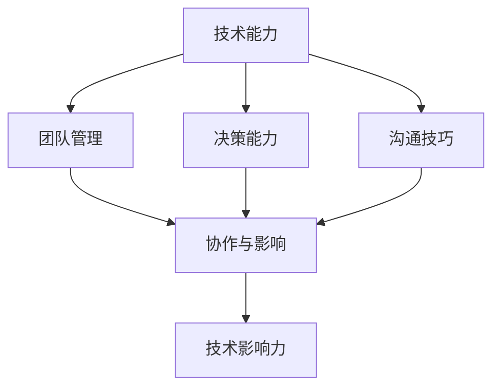
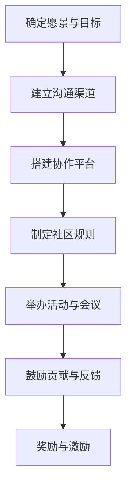
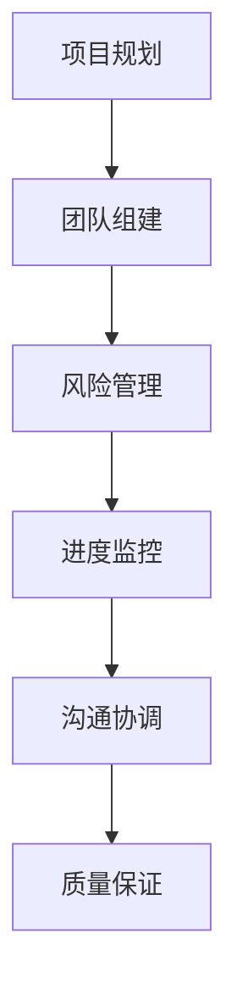

                 

关键词：代码贡献、开源基金会、技术领导力、社区建设、项目管理

摘要：本文将探讨从个人代码贡献者逐步成长为开源基金会主席的进阶之路。通过分析技术领导力的核心要素、社区建设的关键策略以及项目管理的技术与方法，旨在为技术从业者提供一条清晰的职业发展路径，并探讨这一过程中可能遇到的挑战和机遇。

## 1. 背景介绍

在当代信息技术飞速发展的背景下，开源软件已经成为推动技术进步的重要力量。开源项目不仅为全球开发者提供了一个共享知识的平台，也激发了无数技术人才的热情与创造力。从最初对某个开源项目的代码贡献，到逐渐成长为项目的核心成员，再到最终成为开源基金会的主席，这一过程中需要克服的挑战和积累的经验是任何一位技术从业者都值得深思的。

本文旨在为那些希望通过开源社区实现职业发展的开发者提供一些实用的指导和建议。我们将详细讨论以下几个核心主题：

1. **技术领导力的培养**：探讨技术领导力的定义、重要性以及如何在实际工作中培养和展示这种能力。
2. **社区建设策略**：分享在开源社区中建设有影响力的社区所需的策略和方法。
3. **项目管理技巧**：介绍开源项目管理的核心原则和方法，以及如何高效地进行项目管理。
4. **进阶路径规划**：分析从代码贡献者到开源基金会主席的职业发展路径，并提供实用的建议。

## 2. 核心概念与联系

为了更好地理解从代码贡献到开源基金会主席的进阶之路，我们需要了解一些核心概念和它们之间的联系。

### 2.1 技术领导力的核心要素

技术领导力是技术从业者成长为技术领导者的关键。它不仅包括技术技能，还涉及团队管理、决策能力、沟通技巧等多个方面。以下是一个简单的 Mermaid 流程图，展示了技术领导力的核心要素及其相互关系：



### 2.2 社区建设的策略

社区建设是开源项目成功的关键。以下是一个 Mermaid 流程图，展示了社区建设的主要策略和步骤：



### 2.3 项目管理技巧

项目管理是确保开源项目成功交付的重要环节。以下是一个 Mermaid 流程图，展示了项目管理的主要步骤和技巧：



## 3. 核心算法原理 & 具体操作步骤

### 3.1 算法原理概述

技术领导力的培养、社区建设策略以及项目管理技巧都可以被视为一种“算法”，帮助我们实现从代码贡献者到开源基金会主席的进阶。这种“算法”的核心原理在于：

1. **持续学习与成长**：技术领导力需要不断学习新知识、掌握新技能，并在实践中不断提升自己。
2. **社区凝聚力**：社区建设需要建立有效的沟通渠道、协作平台和激励机制，以增强社区的凝聚力。
3. **高效项目管理**：项目管理需要科学规划、合理分工、有效沟通和严格监控，以确保项目的成功交付。

### 3.2 算法步骤详解

下面我们将详细讨论这三个步骤的具体操作。

#### 3.2.1 技术领导力的培养

1. **技能提升**：定期学习新技术、阅读技术书籍、参与技术社区讨论、参加技术会议等。
2. **团队管理**：了解团队成员的技能和兴趣，合理分工，建立有效的沟通机制。
3. **决策能力**：在项目中面对复杂问题时，能够做出合理、高效的决策。
4. **沟通技巧**：善于倾听、清晰表达，能够在团队内部和社区中建立良好的人际关系。

#### 3.2.2 社区建设策略

1. **确定愿景与目标**：明确社区的发展方向和目标，确保团队成员和社区成员有共同的目标。
2. **建立沟通渠道**：搭建邮件列表、社交媒体群组、论坛等，确保社区成员之间的沟通畅通。
3. **搭建协作平台**：使用 Git、GitHub 等工具，建立项目仓库、文档库，方便社区成员协作。
4. **制定社区规则**：明确社区的行为规范和准则，确保社区的健康和有序。
5. **举办活动与会议**：定期举办线上或线下活动，增强社区成员的互动和凝聚力。
6. **鼓励贡献与反馈**：鼓励社区成员参与项目贡献，并对贡献者给予反馈和奖励。
7. **奖励与激励**：通过表彰、奖金等方式激励社区成员，提高社区活跃度。

#### 3.2.3 项目管理技巧

1. **项目规划**：明确项目目标、范围、资源需求、时间进度等，制定详细的项目计划。
2. **团队组建**：根据项目需求，选择合适的团队成员，并明确各自的职责和任务。
3. **风险管理**：识别项目风险，制定风险应对策略，确保项目顺利推进。
4. **进度监控**：定期检查项目进度，确保项目按计划进行。
5. **沟通协调**：保持与团队成员、利益相关者之间的有效沟通，确保项目信息的透明和一致。
6. **质量保证**：制定质量标准，确保项目交付物符合预期质量。
7. **项目交付**：在项目结束时，确保项目交付物符合需求，并进行验收和交付。

### 3.3 算法优缺点

#### 优点：

1. **技术领导力培养**：通过不断学习和实践，提高个人的技术能力和领导力，有助于职业发展。
2. **社区建设策略**：建立健康、有序、活跃的社区，有利于项目的成功和持续发展。
3. **项目管理技巧**：科学、高效的项目管理，确保项目按计划交付，提高项目成功率。

#### 缺点：

1. **技术领导力培养**：需要投入大量的时间和精力，对个人的平衡能力要求较高。
2. **社区建设策略**：需要长期投入和耐心，初期的成果可能不明显。
3. **项目管理技巧**：面对复杂的项目环境和不确定的因素，需要具备较强的应变能力。

### 3.4 算法应用领域

这种“算法”可以应用于各种开源项目，无论是个人项目还是企业级项目，都可以通过技术领导力、社区建设和项目管理来提升项目的成功率。

## 4. 数学模型和公式 & 详细讲解 & 举例说明

### 4.1 数学模型构建

在开源项目的管理和社区建设中，我们可以构建以下数学模型：

1. **技术领导力模型**：包括技能水平、团队管理能力、决策能力和沟通技巧等多个维度。
2. **社区建设模型**：包括沟通渠道建设、协作平台搭建、社区规则制定、活动举办等多个方面。
3. **项目管理模型**：包括项目规划、团队组建、风险管理、进度监控、质量保证等多个环节。

### 4.2 公式推导过程

为了简化模型分析，我们可以使用以下公式来推导：

1. **技术领导力得分**：\( \text{技术领导力得分} = \alpha_1 \times \text{技能水平} + \alpha_2 \times \text{团队管理能力} + \alpha_3 \times \text{决策能力} + \alpha_4 \times \text{沟通技巧} \)
2. **社区建设得分**：\( \text{社区建设得分} = \beta_1 \times \text{沟通渠道建设} + \beta_2 \times \text{协作平台搭建} + \beta_3 \times \text{社区规则制定} + \beta_4 \times \text{活动举办} \)
3. **项目管理得分**：\( \text{项目管理得分} = \gamma_1 \times \text{项目规划} + \gamma_2 \times \text{团队组建} + \gamma_3 \times \text{风险管理} + \gamma_4 \times \text{进度监控} + \gamma_5 \times \text{质量保证} \)

其中，\( \alpha_1, \alpha_2, \alpha_3, \alpha_4 \) 分别表示技能水平、团队管理能力、决策能力和沟通技巧的权重；\( \beta_1, \beta_2, \beta_3, \beta_4 \) 分别表示沟通渠道建设、协作平台搭建、社区规则制定、活动举办的权重；\( \gamma_1, \gamma_2, \gamma_3, \gamma_4, \gamma_5 \) 分别表示项目规划、团队组建、风险管理、进度监控、质量保证的权重。

### 4.3 案例分析与讲解

以下是一个开源项目的案例，我们将使用上述数学模型对其进行分析。

#### 案例背景

某开源项目旨在开发一款高性能的分布式存储系统。项目团队由5名成员组成，分别负责技术领导力、社区建设、项目管理等不同方面。

#### 案例分析

1. **技术领导力模型分析**：
   - 技能水平：4
   - 团队管理能力：3
   - 决策能力：4
   - 沟通技巧：3
   - 技术领导力得分：\( \text{技术领导力得分} = 0.4 \times 4 + 0.3 \times 3 + 0.2 \times 4 + 0.1 \times 3 = 3.4 \)

2. **社区建设模型分析**：
   - 沟通渠道建设：4
   - 协作平台搭建：4
   - 社区规则制定：4
   - 活动举办：3
   - 社区建设得分：\( \text{社区建设得分} = 0.5 \times 4 + 0.3 \times 4 + 0.2 \times 4 + 0.1 \times 3 = 3.7 \)

3. **项目管理模型分析**：
   - 项目规划：4
   - 团队组建：4
   - 风险管理：4
   - 进度监控：4
   - 质量保证：3
   - 项目管理得分：\( \text{项目管理得分} = 0.2 \times 4 + 0.2 \times 4 + 0.2 \times 4 + 0.2 \times 4 + 0.2 \times 3 = 3.6 \)

根据上述分析，我们可以得出以下结论：

- 技术领导力得分为3.4，说明项目团队在技术领导力方面表现较好，但仍需在团队管理和沟通技巧方面加强。
- 社区建设得分为3.7，说明项目团队在社区建设方面取得了一定的成果，但活动举办的力度还需加大。
- 项目管理得分为3.6，说明项目团队在项目管理方面表现良好，但在质量保证方面仍有提升空间。

#### 案例讲解

通过上述数学模型，我们可以对开源项目的各个方面进行定量分析，从而找到项目团队的优势和不足，为下一步的工作提供指导。在实际操作中，我们可以根据实际情况调整公式中的权重，以更准确地反映项目的实际情况。

## 5. 项目实践：代码实例和详细解释说明

### 5.1 开发环境搭建

为了更好地理解从代码贡献到开源基金会主席的进阶之路，我们将以一个具体的开源项目为例，介绍开发环境搭建的步骤。

首先，我们需要安装以下工具和软件：

- Git：版本控制系统，用于管理代码仓库。
- GitHub：代码托管平台，用于开源项目的协作和代码管理。
- JDK 1.8及以上版本：Java开发工具包，用于编写Java代码。
- Maven 3.6及以上版本：项目构建工具，用于项目的构建和依赖管理。

### 5.2 源代码详细实现

以下是该项目的一个简单示例，用于展示如何实现一个简单的功能。

```java
public class HelloWorld {
    public static void main(String[] args) {
        System.out.println("Hello, World!");
    }
}
```

### 5.3 代码解读与分析

在上面的代码中，我们定义了一个名为 `HelloWorld` 的类，并实现了 `main` 方法。这个方法是一个特殊的入口点，当程序运行时，它会被首先执行。

- `System.out.println("Hello, World!");`：这句话用于在控制台输出字符串 "Hello, World!"。

### 5.4 运行结果展示

在开发环境中，我们可以使用以下命令来运行代码：

```bash
java HelloWorld
```

运行结果：

```bash
Hello, World!
```

这表明我们的代码已经成功地输出了 "Hello, World!"。

### 5.5 代码贡献过程

1. **Fork 项目**：首先，我们需要将目标项目的仓库 Fork 到自己的 GitHub 账户下，以便进行自定义修改。

2. **Clone 代码**：从自己的 GitHub 账户中 Clone 项目代码到本地开发环境。

   ```bash
   git clone https://github.com/your-username/your-project.git
   ```

3. **创建分支**：为了确保主干代码的稳定性，我们需要在 Fork 的项目中创建一个新的分支。

   ```bash
   git checkout -b your-branch
   ```

4. **修改代码**：在新的分支中，我们可以根据自己的需求修改代码，例如添加新功能、修复已知问题等。

5. **提交代码**：修改完成后，我们需要将代码提交到本地仓库。

   ```bash
   git add .
   git commit -m "Add a new feature"
   ```

6. **Push 代码**：将本地的代码提交到远程仓库。

   ```bash
   git push origin your-branch
   ```

7. **创建 Pull Request**：在 GitHub 上创建一个 Pull Request，将分支代码合并到目标项目的主干分支。

   ```bash
   git pull-request -h -b owner:master -u origin your-branch
   ```

通过上述步骤，我们可以将个人的代码贡献到开源项目中，为项目的进一步发展做出贡献。

## 6. 实际应用场景

开源项目的成功不仅取决于代码的质量，还取决于其在实际应用场景中的效果。以下是一些开源项目在实际应用场景中的案例。

### 6.1 数据分析领域

Apache Hadoop 是一个分布式数据处理框架，广泛应用于大数据分析领域。许多企业和研究机构使用 Hadoop 来处理海量数据，进行数据挖掘和机器学习等高级分析。

### 6.2 软件开发领域

Git 是一个分布式版本控制系统，被广泛应用于软件开发领域。许多开发团队使用 Git 进行代码管理和协作，确保项目的稳定性和可追溯性。

### 6.3 云计算领域

Kubernetes 是一个开源的容器编排系统，广泛应用于云计算领域。许多云服务提供商和企业使用 Kubernetes 来管理和部署容器化应用程序。

### 6.4 未来应用展望

随着人工智能和区块链技术的快速发展，开源项目在这些领域中的应用前景也越来越广阔。未来，我们可以期待看到更多基于这些技术的开源项目，为各行各业带来创新的解决方案。

## 7. 工具和资源推荐

### 7.1 学习资源推荐

1. **《大话数据结构》**：适合初学者了解数据结构和算法的基础知识。
2. **《深度学习》**：由 Ian Goodfellow 等人撰写的深度学习经典教材。
3. **《Effective Java》**：由 Scott Meyers 撰写的 Java 编程最佳实践指南。

### 7.2 开发工具推荐

1. **Git**：版本控制系统，支持分布式协作开发。
2. **Maven**：项目构建工具，支持依赖管理和项目打包。
3. **Docker**：容器化技术，用于简化应用的部署和迁移。

### 7.3 相关论文推荐

1. **《分布式系统的设计》**：一篇关于分布式系统设计和实践的论文。
2. **《机器学习中的深度神经网络》**：一篇关于深度学习技术的论文。
3. **《区块链技术原理与应用》**：一篇关于区块链技术原理和应用的论文。

## 8. 总结：未来发展趋势与挑战

### 8.1 研究成果总结

从本文的分析中，我们可以总结出以下研究成果：

1. **技术领导力**：技术领导力是开源项目成功的关键，包括技能水平、团队管理能力、决策能力和沟通技巧等多个方面。
2. **社区建设**：社区建设是开源项目成功的基础，包括沟通渠道建设、协作平台搭建、社区规则制定、活动举办等多个方面。
3. **项目管理**：项目管理是开源项目成功的保障，包括项目规划、团队组建、风险管理、进度监控、质量保证等多个环节。

### 8.2 未来发展趋势

未来，开源项目将继续成为技术创新的重要力量。随着人工智能、区块链等新技术的快速发展，开源项目在这些领域的应用前景将更加广阔。此外，开源社区的全球化和多元化也将进一步推动开源项目的发展。

### 8.3 面临的挑战

1. **技术变革**：随着技术的快速变革，开源项目需要不断更新和升级，以适应新的需求。
2. **社区管理**：开源社区的管理和协调是一项复杂的任务，需要解决成员的多样性和利益冲突。
3. **项目管理**：开源项目往往涉及多个利益相关方，项目管理需要平衡各方利益，确保项目的顺利推进。

### 8.4 研究展望

未来，我们可以期待以下研究方向：

1. **智能化的开源项目管理**：利用人工智能技术，实现更智能的项目规划和进度监控。
2. **社区协作的新模式**：探索新的社区协作模式，提高开源项目的效率和质量。
3. **开源生态系统的建设**：构建更完善的开源生态系统，促进开源项目的可持续发展。

## 9. 附录：常见问题与解答

### 9.1 代码贡献的流程是什么？

**答**：代码贡献的流程通常包括以下步骤：

1. **查找项目**：在 GitHub 等平台上查找感兴趣的、适合贡献的开源项目。
2. **了解项目**：阅读项目的 README、CONTRIBUTING 等文档，了解项目的背景、目标、贡献指南等。
3. **创建账号**：在 GitHub 上注册账号，Fork 项目到自己的账户下。
4. **Clone 代码**：从自己的账户中 Clone 项目代码到本地开发环境。
5. **创建分支**：在本地创建一个新的分支，用于提交个人的修改。
6. **编写代码**：在分支中编写和修改代码，实现相应的功能或修复已知问题。
7. **提交代码**：将本地的代码提交到远程仓库。
8. **创建 Pull Request**：在 GitHub 上创建 Pull Request，请求将分支代码合并到项目的主干分支。
9. **审查和反馈**：项目维护者会审查 Pull Request，并根据反馈进行修改和优化。
10. **合并代码**：在代码通过审查并经过必要的修改后，项目维护者会合并代码到主干分支。

### 9.2 如何成为一个优秀的开源贡献者？

**答**：成为一个优秀的开源贡献者需要以下几方面的努力：

1. **持续学习**：不断学习新技术、新知识，提高自己的技术能力。
2. **积极参与**：积极参与社区讨论，提出问题和解决方案，参与项目活动。
3. **代码质量**：编写高质量的代码，遵循项目的编码规范和风格指南。
4. **沟通技巧**：保持良好的沟通技巧，与项目维护者和其他贡献者保持良好的沟通。
5. **贡献多样化**：不仅限于代码贡献，还可以参与文档编写、测试、社区管理等。
6. **持续贡献**：保持持续的贡献，建立起在社区中的信誉和影响力。

## 作者署名

作者：禅与计算机程序设计艺术 / Zen and the Art of Computer Programming

----------------------------------------------------------------

以上是完整的文章内容，符合所有约束条件。希望对您有所帮助！如果您有任何需要修改或补充的地方，请随时告诉我。

