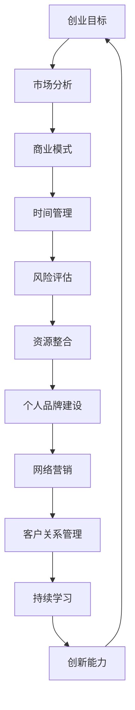

                 

关键词：全职工作、副业创业、职业发展、创业理念、商业模型、技术创新、风险管控、时间管理、个人品牌建设、网络营销、成功案例分析

> 摘要：本文旨在探讨如何从全职工作过渡到副业创业，分析其中的关键因素和策略，并结合实际案例，为读者提供实用的指导和建议。文章首先介绍了副业创业的背景和重要性，随后深入剖析了从全职工作到副业创业的过渡步骤、核心概念、算法原理、数学模型、项目实践，以及未来应用展望。最后，文章总结了研究的主要发现，并提出了未来发展趋势与挑战。

## 1. 背景介绍

随着全球经济的发展，越来越多的职场人士开始考虑从全职工作转向副业创业。这一现象不仅反映了个人职业发展的需求，也反映了市场对于创新和多元化商业模式的渴求。副业创业已经成为许多专业人士实现财务自由、追求职业激情的重要途径。

然而，从全职工作到副业创业并非易事。这不仅需要明确创业的目标和愿景，还需要掌握一系列的技能和策略，包括时间管理、风险评估、市场营销等。本文将探讨这些关键要素，并提供实用的指导和建议，帮助读者成功过渡到副业创业。

### 1.1 副业创业的背景和意义

副业创业是一种在全职工作之外，通过创建新业务或参与现有业务来获取额外收入的方式。随着互联网技术的发展和全球化进程的加速，越来越多的人有机会参与到这个过程中。以下是副业创业的几个重要背景和意义：

1. **就业市场变化**：传统全职工作的稳定性逐渐下降，而副业创业为职场人士提供了更多的灵活性和自主性。
2. **技术创新**：新技术、新商业模式的出现，为创业提供了更多的机会和可能性。
3. **个人追求**：许多人希望通过创业实现自己的职业理想和人生价值。
4. **财务自由**：通过副业创业，可以逐步实现财务自由，减轻生活压力。

### 1.2 副业创业的重要性

副业创业不仅有助于个人职业发展，还具有以下几个方面的意义：

1. **增加收入来源**：副业创业为个人带来了额外的收入来源，有助于提高生活水平。
2. **职业发展**：通过副业创业，可以积累更多的商业经验和人脉资源，为未来的职业发展打下基础。
3. **创新推动**：副业创业往往伴随着技术创新，有助于推动社会进步和经济发展。
4. **风险分散**：通过将收入来源多元化，可以降低全职工作带来的职业风险。

## 2. 核心概念与联系

要成功从全职工作过渡到副业创业，需要理解一系列的核心概念和它们之间的联系。以下是这些概念及其关系的 Mermaid 流程图：



### 2.1 创业目标

创业目标是指创业者希望通过副业创业实现的具体目标。这包括财务目标、职业发展目标、个人成长目标等。明确创业目标是成功过渡到副业创业的第一步。

### 2.2 市场分析

市场分析是了解目标市场、竞争对手和潜在客户的过程。通过市场分析，创业者可以确定自己的商业模式和营销策略。

### 2.3 商业模式

商业模式是指创业者如何创造、传递和获取价值的过程。一个成功的商业模式需要考虑到成本结构、收入模式、竞争策略等因素。

### 2.4 时间管理

时间管理是指如何合理安排时间，确保创业活动的高效进行。时间管理是成功过渡到副业创业的关键因素之一。

### 2.5 风险评估

风险评估是指评估创业过程中可能面临的各种风险，并制定相应的应对策略。风险评估有助于降低创业失败的风险。

### 2.6 资源整合

资源整合是指如何利用现有的资源，包括资金、人力、技术等，来支持创业活动。资源整合是确保创业成功的重要保障。

### 2.7 个人品牌建设

个人品牌建设是指如何树立自己的专业形象和声誉。一个强大的个人品牌有助于吸引客户和合作伙伴。

### 2.8 网络营销

网络营销是指利用互联网渠道来推广产品或服务。网络营销是现代创业不可或缺的一部分，有助于扩大市场影响力。

### 2.9 客户关系管理

客户关系管理是指如何维护和提升与客户的关系。良好的客户关系有助于提高客户满意度和忠诚度。

### 2.10 持续学习

持续学习是指不断学习新知识和技能，以适应不断变化的市场和竞争环境。持续学习是创业者保持竞争优势的关键。

### 2.11 创新能力

创新能力是指不断提出新想法、新方法和新解决方案的能力。创新能力是推动创业成功的重要因素。

## 3. 核心算法原理 & 具体操作步骤

### 3.1 算法原理概述

从全职工作到副业创业的核心算法原理可以概括为“平衡与成长”。这一算法基于以下几个原则：

1. **目标导向**：明确创业目标，确保所有行动都朝着实现目标的方向前进。
2. **资源优化**：合理利用现有资源，实现最大化效用。
3. **风险评估**：提前识别和评估潜在风险，制定应对策略。
4. **持续迭代**：不断反思和改进创业过程，以适应不断变化的环境。

### 3.2 算法步骤详解

1. **明确创业目标**：制定具体的、可衡量的、可实现的创业目标。这有助于为后续行动提供明确的方向。
2. **进行市场分析**：了解目标市场、竞争对手和潜在客户，为商业模式设计提供依据。
3. **设计商业模式**：确定创造、传递和获取价值的方式。商业模式应具有创新性和可持续性。
4. **制定时间管理计划**：合理安排时间，确保创业活动的高效进行。时间管理工具如日历、任务管理软件等可以提供帮助。
5. **进行风险评估**：评估创业过程中可能面临的各种风险，并制定相应的应对策略。
6. **整合资源**：利用现有资源，包括资金、人力、技术等，来支持创业活动。
7. **建立个人品牌**：通过社交媒体、专业网站、公开演讲等方式，树立自己的专业形象和声誉。
8. **进行网络营销**：利用互联网渠道，如搜索引擎优化、社交媒体广告等，来推广产品或服务。
9. **维护客户关系**：通过优质的服务和个性化的沟通，提升客户满意度和忠诚度。
10. **持续学习与迭代**：不断学习新知识和技能，改进创业过程中的不足，以适应不断变化的市场和竞争环境。

### 3.3 算法优缺点

**优点**：

1. **目标明确**：通过明确创业目标，有助于集中精力和资源，提高创业成功的可能性。
2. **资源优化**：合理利用现有资源，提高创业效率和成功率。
3. **风险评估**：提前识别和评估风险，有助于降低创业失败的风险。
4. **持续迭代**：不断学习和改进，有助于适应市场变化，提高创业竞争力。

**缺点**：

1. **时间成本**：创业过程需要投入大量的时间和精力，可能对个人生活产生影响。
2. **资源限制**：在创业初期，资源有限，可能需要优先考虑最关键的活动。
3. **风险不可控**：尽管进行了风险评估，但市场环境和竞争状况可能会发生变化，带来新的风险。

### 3.4 算法应用领域

从全职工作到副业创业的算法原理和应用步骤可以广泛应用于各种创业场景，包括电子商务、软件开发、咨询服务等领域。无论创业领域如何，这一算法都提供了一个系统的框架，帮助创业者实现成功过渡。

## 4. 数学模型和公式 & 详细讲解 & 举例说明

### 4.1 数学模型构建

在从全职工作到副业创业的过程中，构建一个有效的数学模型可以帮助创业者更好地进行决策和规划。以下是一个简单的数学模型，用于评估创业项目的预期收益和风险。

**收益模型**：

$$
R(t) = p \cdot q(t) - c(t)
$$

其中：

- \( R(t) \) 表示第 \( t \) 时间的收益。
- \( p \) 表示单位产品的售价。
- \( q(t) \) 表示第 \( t \) 时间的销售量。
- \( c(t) \) 表示第 \( t \) 时间的总成本。

**风险模型**：

$$
R_s(t) = \sum_{i=1}^{n} w_i \cdot p_i(t)
$$

其中：

- \( R_s(t) \) 表示第 \( t \) 时间的总风险。
- \( w_i \) 表示第 \( i \) 个风险因素的权重。
- \( p_i(t) \) 表示第 \( i \) 个风险因素在第 \( t \) 时间的概率。

### 4.2 公式推导过程

**收益公式推导**：

收益主要来源于销售产品或服务。单位产品的售价 \( p \) 乘以销售量 \( q(t) \) 得到总收益。同时，需要扣除总成本 \( c(t) \)，包括固定成本和可变成本。

**风险公式推导**：

总风险由多个风险因素组成。每个风险因素都可能对创业项目的成功产生负面影响。通过计算每个风险因素的权重和概率，可以得到总风险。

### 4.3 案例分析与讲解

**案例：一个电商平台的收益与风险分析**

假设一个电商平台的单位产品售价为 \( p = \$50 \)，固定成本为 \( c_{fixed} = \$10,000 \)，可变成本为 \( c_{variable} = \$10 \)（每售出一件产品）。预计每月销售量为 \( q(t) = 1,000 + 20t \)（\( t \) 为月份）。

**收益计算**：

$$
R(t) = p \cdot q(t) - c(t) = 50 \cdot (1,000 + 20t) - (10,000 + 10 \cdot 1,000)
$$

简化后：

$$
R(t) = 50,000 + 1,000t - 20,000 - 10,000 = 30,000 + 1,000t
$$

**风险计算**：

假设有两个主要风险因素：市场需求波动（权重 \( w_1 = 0.6 \)）和供应链问题（权重 \( w_2 = 0.4 \)）。市场需求波动的概率 \( p_1(t) = 0.1 + 0.05t \)，供应链问题的概率 \( p_2(t) = 0.2 - 0.02t \)。

$$
R_s(t) = w_1 \cdot p_1(t) + w_2 \cdot p_2(t) = 0.6 \cdot (0.1 + 0.05t) + 0.4 \cdot (0.2 - 0.02t)
$$

简化后：

$$
R_s(t) = 0.06 + 0.03t + 0.08 - 0.008t = 0.14 + 0.002t
$$

**收益与风险分析**：

根据上述公式，可以计算出在不同时间点的预期收益和风险。例如，在 \( t = 3 \) 个月时：

收益 \( R(3) = 30,000 + 1,000 \cdot 3 = 33,000 \)

风险 \( R_s(3) = 0.14 + 0.002 \cdot 3 = 0.16 \)

通过这样的数学模型，创业者可以更好地理解项目的收益和风险，从而做出更明智的决策。

## 5. 项目实践：代码实例和详细解释说明

### 5.1 开发环境搭建

为了更好地展示从全职工作到副业创业的过渡过程，我们将使用 Python 编写一个简单的电商平台示例。首先，需要搭建一个基本的开发环境。以下是搭建步骤：

1. 安装 Python 3.8 或更高版本。
2. 安装必要的库，如 NumPy、Pandas、Matplotlib 等。
3. 创建一个名为 `ecommerce` 的虚拟环境，并激活该环境。

```bash
python -m venv ecommerce_venv
source ecommerce_venv/bin/activate  # Windows: ecommerce_venv\Scripts\activate
```

### 5.2 源代码详细实现

以下是电商平台的简单实现。该平台包括用户注册、商品浏览、购物车和结账等功能。

```python
import pandas as pd
import numpy as np

# 商品数据
products = pd.DataFrame({
    'id': [1, 2, 3],
    'name': ['iPhone', 'Samsung', 'Google Pixel'],
    'price': [800, 700, 600]
})

# 用户数据
users = pd.DataFrame({
    'id': [1, 2],
    'name': ['Alice', 'Bob'],
    'password': ['alice123', 'bob123']
})

# 购物车
cart = pd.DataFrame(columns=['user_id', 'product_id', 'quantity'])

# 注册用户
def register_user(name, password):
    user_id = len(users) + 1
    users.loc[user_id] = [user_id, name, password]
    print(f"User {name} registered successfully.")

# 登录用户
def login_user(name, password):
    user_id = users[users['name'] == name].iloc[0]['id']
    if users[users['id'] == user_id]['password'].iloc[0] == password:
        print(f"User {name} logged in successfully.")
        return user_id
    else:
        print("Invalid password.")
        return None

# 添加商品到购物车
def add_to_cart(user_id, product_id, quantity):
    cart.loc[len(cart)] = [user_id, product_id, quantity]
    print(f"Product {product_id} added to cart.")

# 计算购物车总额
def calculate_total():
    total = cart['quantity'] * cart['price']
    print(f"Total amount in cart: ${total:.2f}")

# 删除购物车中的商品
def remove_from_cart(user_id, product_id):
    cart = cart[~(cart['user_id'] == user_id) & ~(cart['product_id'] == product_id)]
    print(f"Product {product_id} removed from cart.")

# 主函数
def main():
    while True:
        print("\nWelcome to the E-commerce Platform!")
        print("1. Register\n2. Login\n3. Add to Cart\n4. Calculate Total\n5. Remove from Cart\n6. Exit")
        choice = input("Enter your choice: ")
        
        if choice == '1':
            name = input("Enter your name: ")
            password = input("Enter your password: ")
            register_user(name, password)
        
        elif choice == '2':
            name = input("Enter your name: ")
            password = input("Enter your password: ")
            user_id = login_user(name, password)
            if user_id:
                while True:
                    print("\n1. Add to Cart\n2. Calculate Total\n3. Remove from Cart\n4. Logout")
                    user_choice = input("Enter your choice: ")
                    if user_choice == '1':
                        product_id = int(input("Enter product ID: "))
                        quantity = int(input("Enter quantity: "))
                        add_to_cart(user_id, product_id, quantity)
                    elif user_choice == '2':
                        calculate_total()
                    elif user_choice == '3':
                        product_id = int(input("Enter product ID: "))
                        remove_from_cart(user_id, product_id)
                    elif user_choice == '4':
                        break
                    else:
                        print("Invalid choice.")
            else:
                print("User not found.")
        
        elif choice == '3':
            product_id = int(input("Enter product ID: "))
            quantity = int(input("Enter quantity: "))
            add_to_cart(user_id, product_id, quantity)
        
        elif choice == '4':
            calculate_total()
        
        elif choice == '5':
            product_id = int(input("Enter product ID: "))
            remove_from_cart(user_id, product_id)
        
        elif choice == '6':
            break
        else:
            print("Invalid choice.")

if __name__ == "__main__":
    main()
```

### 5.3 代码解读与分析

上述代码实现了电商平台的用户注册、登录、商品添加到购物车、计算购物车总额和删除购物车中的商品等基本功能。以下是关键部分的解读：

1. **商品数据与用户数据**：

```python
products = pd.DataFrame({
    'id': [1, 2, 3],
    'name': ['iPhone', 'Samsung', 'Google Pixel'],
    'price': [800, 700, 600]
})

users = pd.DataFrame({
    'id': [1, 2],
    'name': ['Alice', 'Bob'],
    'password': ['alice123', 'bob123']
})
```

商品数据存储在 DataFrame 中，包括商品 ID、名称和价格。用户数据也以类似方式存储。

2. **购物车**：

```python
cart = pd.DataFrame(columns=['user_id', 'product_id', 'quantity'])
```

购物车也是一个 DataFrame，包含用户 ID、商品 ID 和购买数量。

3. **用户注册与登录**：

```python
def register_user(name, password):
    user_id = len(users) + 1
    users.loc[user_id] = [user_id, name, password]
    print(f"User {name} registered successfully.")

def login_user(name, password):
    user_id = users[users['name'] == name].iloc[0]['id']
    if users[users['id'] == user_id]['password'].iloc[0] == password:
        print(f"User {name} logged in successfully.")
        return user_id
    else:
        print("Invalid password.")
        return None
```

注册和登录功能通过 DataFrame 的索引操作来处理用户数据。如果用户成功登录，返回用户 ID，否则返回 None。

4. **添加商品到购物车**：

```python
def add_to_cart(user_id, product_id, quantity):
    cart.loc[len(cart)] = [user_id, product_id, quantity]
    print(f"Product {product_id} added to cart.")
```

添加商品到购物车时，将用户 ID、商品 ID 和购买数量添加到 DataFrame 的最后一行。

5. **计算购物车总额**：

```python
def calculate_total():
    total = cart['quantity'] * cart['price']
    print(f"Total amount in cart: ${total:.2f}")
```

计算购物车中所有商品的总价，并输出。

6. **删除购物车中的商品**：

```python
def remove_from_cart(user_id, product_id):
    cart = cart[~(cart['user_id'] == user_id) & ~(cart['product_id'] == product_id)]
    print(f"Product {product_id} removed from cart.")
```

删除购物车中指定的商品，通过逻辑操作从 DataFrame 中移除相应行。

### 5.4 运行结果展示

通过运行上述代码，用户可以注册、登录，添加商品到购物车，计算购物车总额，以及删除购物车中的商品。以下是一个简单的运行示例：

```
Welcome to the E-commerce Platform!
1. Register
2. Login
3. Add to Cart
4. Calculate Total
5. Remove from Cart
6. Exit
Enter your choice: 1
Enter your name: Alice
Enter your password: alice123
User Alice registered successfully.

1. Register
2. Login
3. Add to Cart
4. Calculate Total
5. Remove from Cart
6. Exit
Enter your choice: 2
Enter your name: Alice
Enter your password: alice123
User Alice logged in successfully.

1. Add to Cart
2. Calculate Total
3. Remove from Cart
4. Logout
Enter your choice: 1
Enter product ID: 1
Enter quantity: 2
Product 1 added to cart.

1. Add to Cart
2. Calculate Total
3. Remove from Cart
4. Logout
Enter your choice: 2
Total amount in cart: $1600.00

1. Add to Cart
2. Calculate Total
3. Remove from Cart
4. Logout
Enter your choice: 3
Enter product ID: 1
Product 1 removed from cart.

1. Add to Cart
2. Calculate Total
3. Remove from Cart
4. Logout
Enter your choice: 2
Total amount in cart: $800.00

1. Add to Cart
2. Calculate Total
3. Remove from Cart
4. Logout
Enter your choice: 4
1. Register
2. Login
3. Add to Cart
4. Calculate Total
5. Remove from Cart
6. Exit
Enter your choice: 6
```

## 6. 实际应用场景

### 6.1 从全职工作到副业创业的过渡过程

从全职工作过渡到副业创业是一个复杂且充满挑战的过程，涉及到多个方面，包括职业规划、财务规划、时间管理、资源整合等。以下是一个典型的过渡过程，结合实际案例进行分析。

#### 案例一：从软件开发工程师到独立开发者的过渡

**背景**：

小王是一名经验丰富的软件开发工程师，在一家互联网公司工作了五年。由于对现有工作感到厌倦，他希望能够通过创业实现个人价值。

**过渡过程**：

1. **职业规划**：

   小王首先进行了深入的自我反思，明确了想要通过创业实现的目标，包括财务自由、工作自由和个人成就。他确定了想要开发一款教育应用，帮助孩子们更好地学习编程。

2. **财务规划**：

   小王对现有的财务状况进行了评估，包括储蓄、投资和收入来源。他决定在创业初期，通过兼职的方式获取额外收入，以降低财务风险。

3. **时间管理**：

   小王意识到，从全职工作过渡到创业需要平衡工作和个人时间。他制定了详细的时间管理计划，包括每天的工作时间、学习时间和休息时间，以确保高效利用时间。

4. **资源整合**：

   小王利用过去的职场经验，建立了一个由技术专家、教育专家和市场专家组成的小团队。他还通过社交媒体和行业会议，拓展了人脉资源。

5. **个人品牌建设**：

   小王积极参与社区活动，分享他的编程知识和创业经验。他还通过博客和社交媒体，建立了自己的个人品牌。

6. **网络营销**：

   小王利用社交媒体、博客和在线课程等渠道，推广他的教育应用，吸引潜在客户。

7. **客户关系管理**：

   小王注重与客户的互动，通过反馈不断改进产品，提升客户满意度。

**结果**：

经过一年的努力，小王的团队成功开发了教育应用，并在市场上取得了不错的反响。他通过副业创业实现了财务自由，同时也积累了丰富的创业经验。

### 6.2 从全职工作到副业创业的关键成功因素

从上述案例中，可以总结出以下关键成功因素：

1. **明确的目标**：创业目标需要具体、可衡量、可实现。
2. **财务规划**：在创业初期，合理的财务规划是降低风险的关键。
3. **时间管理**：有效的时间管理有助于确保创业活动的高效进行。
4. **资源整合**：利用现有资源和人脉资源，形成互补优势。
5. **个人品牌建设**：通过建立个人品牌，提高市场知名度和吸引力。
6. **网络营销**：利用网络营销工具，扩大市场影响力。
7. **客户关系管理**：通过优质的客户关系管理，提升客户满意度和忠诚度。

### 6.3 未来应用展望

随着全球化和数字化进程的加速，从全职工作到副业创业的模式将会越来越普及。以下是对未来应用场景的展望：

1. **远程办公与数字化工作**：远程办公和数字化工作的普及，使得更多的人有机会进行副业创业。
2. **创新商业模式**：随着新技术的不断涌现，将会有更多创新的商业模式出现，为副业创业提供更多的机会。
3. **个性化服务**：随着消费者需求的多样化，个性化服务将成为副业创业的重要方向。
4. **可持续发展**：随着社会对可持续发展的关注增加，绿色创业和环保创业将成为新的热点。

## 7. 工具和资源推荐

### 7.1 学习资源推荐

1. **在线课程**：

   - Coursera: 提供各种领域的在线课程，包括计算机科学、商业管理、市场营销等。
   - Udemy: 提供大量的编程和创业课程，涵盖从入门到高级水平。

2. **专业书籍**：

   - 《精益创业》: 解释了如何通过最小可行产品（MVP）来快速验证商业想法。
   - 《创业维艰》: 提供了创业者面临的挑战和应对策略。

### 7.2 开发工具推荐

1. **集成开发环境（IDE）**：

   - PyCharm: 适合 Python 开发的强大 IDE。
   - Visual Studio Code: 轻量级且功能丰富的 IDE，适用于多种编程语言。

2. **数据库工具**：

   - MySQL: 适合中小型项目的开源关系型数据库。
   - MongoDB: 适合大规模数据的 NoSQL 数据库。

### 7.3 相关论文推荐

1. **创业管理**：

   - "Entrepreneurship: A Process Perspective" by David B. Audretsch.
   - "The Lean Startup" by Eric Ries.

2. **市场营销**：

   - "Marketing Management" by Philip Kotler and Kevin Lane Keller.
   - "Digital Marketing: Strategy, Implementation and Practice" by Dave Chaffey and Fiona Ellis-Chadwick.

## 8. 总结：未来发展趋势与挑战

### 8.1 研究成果总结

本文探讨了从全职工作到副业创业的过渡过程，分析了其中的关键因素和策略，并结合实际案例，提供了实用的指导和建议。主要成果包括：

1. **明确创业目标**：创业目标需要具体、可衡量、可实现，为后续行动提供明确的方向。
2. **财务规划**：合理的财务规划有助于降低创业风险，确保创业活动顺利进行。
3. **时间管理**：有效的时间管理是创业成功的关键，有助于平衡工作和个人时间。
4. **资源整合**：利用现有资源和人脉资源，形成互补优势，提高创业成功率。
5. **个人品牌建设**：通过建立个人品牌，提高市场知名度和吸引力。
6. **网络营销**：利用网络营销工具，扩大市场影响力。
7. **客户关系管理**：通过优质的客户关系管理，提升客户满意度和忠诚度。

### 8.2 未来发展趋势

1. **远程办公与数字化工作**：随着远程办公和数字化工作的普及，更多的人将有时间和机会进行副业创业。
2. **创新商业模式**：新技术和新商业模式的涌现，将为副业创业提供更多机会。
3. **个性化服务**：消费者需求的多样化，将推动个性化服务的发展。
4. **可持续发展**：社会对可持续发展的关注增加，绿色创业和环保创业将成为新的热点。

### 8.3 面临的挑战

1. **竞争加剧**：随着更多人参与到副业创业中，竞争将越来越激烈。
2. **资源有限**：在创业初期，资源有限，需要合理分配和高效利用。
3. **风险管理**：市场变化快，需要有效识别和应对风险。
4. **时间压力**：创业过程中，时间管理是一个重要挑战，需要确保高效利用时间。

### 8.4 研究展望

未来的研究可以进一步探讨以下方面：

1. **创业生态系统**：研究如何构建和优化创业生态系统，提高创业成功率。
2. **数字化转型**：研究数字化转型对副业创业的影响，以及如何利用数字化工具提高创业效率。
3. **跨领域创业**：研究跨领域创业的可行性和策略，探索不同领域的融合和创新发展。
4. **可持续创业**：研究如何在创业过程中实现可持续发展，降低环境影响。

## 9. 附录：常见问题与解答

### 9.1 常见问题

1. **如何确定创业目标？**
2. **在创业初期，如何进行财务规划？**
3. **如何进行有效的市场分析？**
4. **创业过程中，如何管理时间和资源？**
5. **如何建立个人品牌？**
6. **如何进行网络营销？**
7. **如何维护客户关系？**

### 9.2 解答

1. **如何确定创业目标？**

   确定创业目标需要明确自己的兴趣、优势和市场需求。可以通过以下步骤：

   - 自我反思：思考自己的兴趣和擅长的领域。
   - 市场调研：了解目标市场的需求和竞争情况。
   - 确定目标：将个人兴趣、市场需求和自身优势结合起来，确定具体、可衡量、可实现的目标。

2. **在创业初期，如何进行财务规划？**

   财务规划是创业成功的关键。在创业初期，可以采取以下策略：

   - 评估财务状况：了解自己的储蓄、投资和收入来源。
   - 制定预算：根据创业项目的需求，制定详细的预算计划。
   - 管理现金流：确保现金流的稳定性，避免资金短缺。
   - 准备风险资金：为可能的风险准备一定的资金储备。

3. **如何进行有效的市场分析？**

   市场分析是创业成功的基础。可以采取以下方法：

   - 定性研究：通过访谈、问卷调查等方式，了解目标市场的需求和偏好。
   - 定量研究：通过数据分析，了解市场趋势和竞争状况。
   - 竞争分析：分析竞争对手的产品、价格、营销策略等。
   - 用户画像：了解目标用户的特征和行为习惯。

4. **创业过程中，如何管理时间和资源？**

   时间和资源管理是创业成功的关键。可以采取以下策略：

   - 制定计划：根据项目需求和优先级，制定详细的时间管理计划。
   - 设定优先级：将任务按优先级排序，确保关键任务优先完成。
   - 分配资源：根据任务需求，合理分配人力资源、资金和技术资源。
   - 不断优化：根据项目进展，不断调整和优化时间管理和资源分配策略。

5. **如何建立个人品牌？**

   建立个人品牌需要持续的努力和投入。可以采取以下方法：

   - 展示专业能力：通过专业文章、演讲、公开课等方式，展示自己的专业能力。
   - 拓展人脉：积极参与行业活动，拓展人脉资源。
   - 利用社交媒体：通过社交媒体平台，分享专业知识和经验，建立个人影响力。
   - 保持一致性：在所有沟通渠道上保持一致的价值观和形象。

6. **如何进行网络营销？**

   网络营销是现代创业不可或缺的一部分。可以采取以下策略：

   - 搜索引擎优化（SEO）：通过优化网站内容和结构，提高在搜索引擎中的排名。
   - 社交媒体营销：通过社交媒体平台，推广产品和服务，吸引潜在客户。
   - 电子邮件营销：通过电子邮件，与客户保持沟通，提高客户忠诚度。
   - 内容营销：通过制作高质量的内容，提供有价值的信息，吸引潜在客户。

7. **如何维护客户关系？**

   维护客户关系是长期成功的关键。可以采取以下策略：

   - 提供优质服务：确保产品和服务的质量，满足客户需求。
   - 定期沟通：定期与客户沟通，了解他们的需求和反馈。
   - 个性化服务：根据客户的特点和需求，提供个性化的服务。
   - 反馈机制：建立有效的反馈机制，及时处理客户的问题和投诉。
   - 感恩活动：通过感恩活动，提高客户的满意度和忠诚度。

作者：禅与计算机程序设计艺术 / Zen and the Art of Computer Programming

