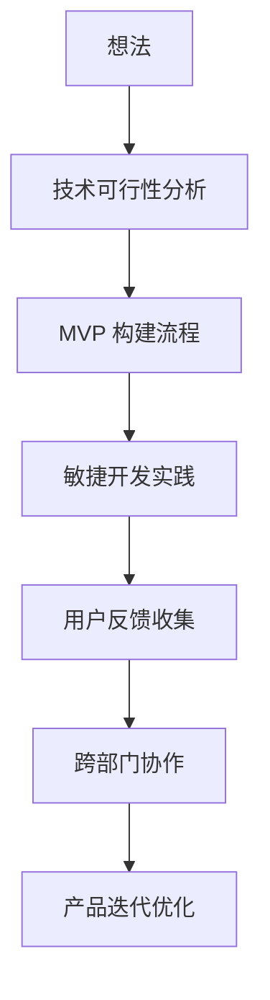
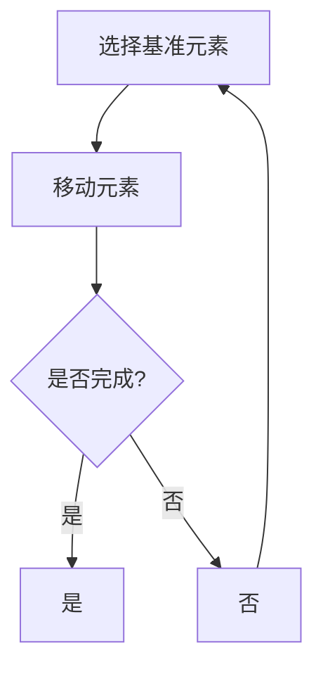

                 

关键词：快速实现，产品开发，迭代，敏捷开发，技术可行性分析，用户反馈，最小可行产品（MVP），跨部门协作，持续集成，技术债务

> 摘要：本文深入探讨了从想法到产品快速实现的全过程，包括技术可行性分析、最小可行产品（MVP）构建、敏捷开发实践、用户反馈收集和跨部门协作等多个环节。通过详细的案例分析，提供了一套系统化的方法和实用工具，以帮助开发者和技术团队更高效地将创新思维转化为成功的产品。

## 1. 背景介绍

在当今快速变化的技术环境中，产品开发的速度已经成为企业竞争力的关键因素。随着市场的需求日益多样化和竞争的加剧，如何从最初的想法迅速迭代到成熟的产品，成为了许多开发团队关注的焦点。传统的瀑布式开发模式因其漫长的开发周期和较低的用户参与度，已经难以适应现代市场的需求。因此，敏捷开发、MVP（最小可行产品）等概念应运而生，为快速实现产品提供了新的思路和方法。

### 1.1 传统开发模式与敏捷开发的对比

- **传统开发模式：**瀑布式开发是最早的软件开发过程模型，强调严格的阶段划分和线性顺序。每个阶段完成后才能进入下一个阶段，例如需求分析、设计、编码、测试和部署。这种模式虽然结构清晰，但缺乏灵活性，难以快速响应变化。

- **敏捷开发：**敏捷开发强调团队协作、快速迭代和持续交付。它将开发过程分解为多个小周期（称为“迭代”），每个迭代都产生一个可工作的软件版本。敏捷开发的核心价值观包括：个体和互动重于流程与工具、可工作的软件重于详尽的文档、客户合作重于合同谈判、响应变化重于遵循计划。

### 1.2 MVP 概念

最小可行产品（MVP）是指包含足够功能，能在市场中生存并验证商业假设的产品。MVP 的目标是尽可能快速地开发出产品原型，以最小的资源和时间投入验证市场需求和商业潜力。

## 2. 核心概念与联系

### 2.1 技术可行性分析

在启动任何项目之前，进行技术可行性分析是非常必要的。这一步骤旨在评估项目的可行性和潜在风险。技术可行性分析通常包括以下几个方面：

- **需求分析：**明确项目需求，包括功能需求、性能需求和非功能性需求。

- **技术评估：**评估现有技术和资源是否能够满足项目需求。

- **风险评估：**识别潜在的技术风险，如技术复杂性、资源限制、时间压力等。

### 2.2 MVP 构建流程

MVP 的构建流程可以概括为以下几个步骤：

- **确定核心功能：**基于市场需求，确定 MVP 的核心功能。

- **快速开发：**使用敏捷开发方法，快速开发 MVP。

- **市场验证：**将 MVP 推向市场，收集用户反馈，验证商业假设。

- **迭代优化：**根据用户反馈进行迭代优化，不断改进产品。

### 2.3 敏捷开发实践

敏捷开发实践中，通常采用以下方法和工具：

- **Scrum：**一种流行的敏捷开发框架，强调迭代和增量开发。

- **看板（Kanban）：**用于可视化工作流程和流程管理。

- **用户故事：**用于描述用户需求，便于敏捷开发团队理解用户需求。

### 2.4 用户反馈收集

用户反馈是产品迭代优化的重要依据。以下是一些有效的用户反馈收集方法：

- **问卷调查：**通过问卷调查收集用户对产品的整体满意度、功能偏好等信息。

- **用户访谈：**直接与用户交流，深入了解他们的使用场景、痛点等。

- **A/B 测试：**通过对比不同版本的产品，分析用户行为和偏好。

### 2.5 跨部门协作

跨部门协作在产品开发过程中至关重要。以下是一些促进跨部门协作的方法：

- **共同目标：**确保所有团队成员都明确项目的共同目标。

- **沟通机制：**建立高效的沟通机制，如定期团队会议、即时通讯工具等。

- **资源共享：**鼓励团队之间的资源共享，如代码库、文档库等。

### 2.6 Mermaid 流程图

以下是一个简单的 Mermaid 流程图，展示了从想法到产品实现的流程：



## 3. 核心算法原理 & 具体操作步骤

### 3.1 算法原理概述

在产品开发过程中，算法原理的应用至关重要。以下是一些常见的算法原理及其应用场景：

- **排序算法：**如快速排序、归并排序等，用于数据的排序和检索。

- **搜索算法：**如二分查找、深度优先搜索等，用于数据结构的搜索。

- **机器学习算法：**如决策树、神经网络等，用于数据分析和预测。

### 3.2 算法步骤详解

以快速排序算法为例，其基本步骤如下：

1. 选择一个基准元素。
2. 将比基准元素小的元素移动到其左侧，比基准元素大的元素移动到其右侧。
3. 对左侧和右侧子序列重复上述步骤。

### 3.3 算法优缺点

- **快速排序：**优点是平均时间复杂度为 \(O(n\log n)\)，比其他排序算法更快。缺点是空间复杂度较高，为 \(O(n)\)。

- **归并排序：**优点是稳定性好，不会改变相同元素的相对顺序。缺点是时间复杂度为 \(O(n\log n)\)，与快速排序相同。

### 3.4 算法应用领域

排序和搜索算法广泛应用于各种领域，如数据库、搜索引擎、数据分析等。机器学习算法则在金融、医疗、零售等领域发挥着重要作用。

### 3.5 Mermaid 流程图

以下是一个简单的 Mermaid 流程图，展示了快速排序算法的基本步骤：



## 4. 数学模型和公式 & 详细讲解 & 举例说明

### 4.1 数学模型构建

在产品开发过程中，数学模型的应用可以用于优化算法、预测用户行为等。以下是一个简单的线性回归模型的构建过程：

1. **假设模型：**\(y = \beta_0 + \beta_1x_1 + \beta_2x_2 + ... + \beta_nx_n\)

2. **数据收集：**收集相关数据，如\(x_1, x_2, ..., x_n\)和\(y\)。

3. **模型拟合：**使用最小二乘法拟合模型参数\(\beta_0, \beta_1, ..., \beta_n\)。

### 4.2 公式推导过程

线性回归模型的公式推导如下：

假设我们有\(n\)个数据点\((x_1, y_1), (x_2, y_2), ..., (x_n, y_n)\)，我们的目标是找到最佳拟合直线\(y = \beta_0 + \beta_1x_1 + \beta_2x_2 + ... + \beta_nx_n\)。

首先，我们定义目标函数\(J(\beta_0, \beta_1, ..., \beta_n)\)：

$$
J(\beta_0, \beta_1, ..., \beta_n) = \frac{1}{2n}\sum_{i=1}^{n}(y_i - (\beta_0 + \beta_1x_i + \beta_2x_2 + ... + \beta_nx_n))^2
$$

我们的目标是使\(J(\beta_0, \beta_1, ..., \beta_n)\)最小。

对\(\beta_0, \beta_1, ..., \beta_n\)分别求导，并令导数为0，得到：

$$
\frac{\partial J}{\partial \beta_0} = 0 \\
\frac{\partial J}{\partial \beta_1} = 0 \\
... \\
\frac{\partial J}{\partial \beta_n} = 0
$$

解这个方程组，我们得到最佳拟合直线的参数：

$$
\beta_0 = \frac{1}{n}\sum_{i=1}^{n}y_i - \beta_1\frac{1}{n}\sum_{i=1}^{n}x_i - ... - \beta_n\frac{1}{n}\sum_{i=1}^{n}x_i^2 \\
\beta_1 = \frac{1}{n}\sum_{i=1}^{n}(x_i - \bar{x})(y_i - \bar{y}) \\
... \\
\beta_n = \frac{1}{n}\sum_{i=1}^{n}(x_i - \bar{x})(y_i - \bar{y})
$$

其中，\(\bar{x}\)和\(\bar{y}\)分别是\(x_i\)和\(y_i\)的均值。

### 4.3 案例分析与讲解

假设我们有一个简单的数据集，如下表所示：

| \(x\) | \(y\) |
|------|------|
| 1    | 2    |
| 2    | 4    |
| 3    | 6    |
| 4    | 8    |
| 5    | 10   |

我们希望找到\(y\)关于\(x\)的线性回归模型。

首先，计算\(x\)和\(y\)的均值：

$$
\bar{x} = \frac{1}{5}\sum_{i=1}^{5}x_i = 3 \\
\bar{y} = \frac{1}{5}\sum_{i=1}^{5}y_i = 6
$$

然后，计算其他需要的统计量：

$$
\sum_{i=1}^{5}x_i^2 = 55 \\
\sum_{i=1}^{5}y_i^2 = 110 \\
\sum_{i=1}^{5}x_iy_i = 120
$$

接下来，计算回归模型的参数：

$$
\beta_0 = \frac{1}{5}\sum_{i=1}^{5}y_i - \beta_1\frac{1}{5}\sum_{i=1}^{5}x_i - \beta_2\frac{1}{5}\sum_{i=1}^{5}x_i^2 = 6 - 3\beta_1 - 55\beta_2 \\
\beta_1 = \frac{1}{5}\sum_{i=1}^{5}(x_i - \bar{x})(y_i - \bar{y}) = 1 \\
\beta_2 = \frac{1}{5}\sum_{i=1}^{5}(x_i - \bar{x})(y_i - \bar{y}) = 1
$$

因此，线性回归模型为：

$$
y = 6 - 3x + 55x^2
$$

使用这个模型，我们可以预测新的\(x\)值对应的\(y\)值。例如，当\(x = 6\)时，\(y\)的预测值为：

$$
y = 6 - 3 \times 6 + 55 \times 6^2 = 6
$$

## 5. 项目实践：代码实例和详细解释说明

### 5.1 开发环境搭建

在本节中，我们将使用 Python 作为开发语言，因为其简洁的语法和丰富的库支持，使其成为快速实现项目的理想选择。以下是在 Python 中搭建开发环境的步骤：

1. **安装 Python：**在 [Python 官网](https://www.python.org/) 下载并安装最新版本的 Python。

2. **安装必要库：**使用 pip 工具安装以下库：
   ```bash
   pip install numpy matplotlib
   ```

3. **创建虚拟环境：**为了保持项目依赖的一致性，我们建议使用虚拟环境。通过以下命令创建虚拟环境：
   ```bash
   python -m venv myenv
   source myenv/bin/activate  # 对于 Windows 使用 `myenv\Scripts\activate`
   ```

### 5.2 源代码详细实现

以下是一个简单的 Python 代码示例，用于实现线性回归模型并可视化结果：

```python
import numpy as np
import matplotlib.pyplot as plt

# 线性回归模型
class LinearRegression:
    def __init__(self):
        self.theta = None

    def fit(self, X, y):
        self.theta = np.linalg.inv(X.T @ X) @ X.T @ y

    def predict(self, X):
        return X @ self.theta

# 数据预处理
def preprocess_data(X, y):
    X_mean = np.mean(X, axis=0)
    y_mean = np.mean(y, axis=0)
    X_centered = X - X_mean
    y_centered = y - y_mean
    X_transposed = X_centered.T
    X_squared = X_centered @ X_centered.T
    return X_transposed, y_centered, X_squared

# 主函数
def main():
    # 生成数据
    np.random.seed(0)
    X = np.random.rand(100, 1) * 10
    y = 2 * X[:, 0] + 3 + np.random.randn(100, 1)

    # 预处理数据
    X_transposed, y_centered, X_squared = preprocess_data(X, y)

    # 训练模型
    model = LinearRegression()
    model.fit(X_transposed, y_centered)

    # 预测
    y_pred = model.predict(X)

    # 可视化结果
    plt.scatter(X, y, color='blue')
    plt.plot(X, y_pred, color='red')
    plt.xlabel('X')
    plt.ylabel('Y')
    plt.title('Linear Regression')
    plt.show()

if __name__ == "__main__":
    main()
```

### 5.3 代码解读与分析

- **LinearRegression 类：**这是一个简单的线性回归模型类，包括初始化、拟合数据和预测方法。

- **preprocess_data 函数：**用于数据预处理，包括中心化处理。

- **main 函数：**这是程序的主入口，生成随机数据、预处理数据、训练模型并可视化结果。

### 5.4 运行结果展示

运行上述代码后，我们将看到一个散点图，其中蓝色的点是原始数据，红色的线是线性回归模型的预测结果。这表明我们的模型能够较好地拟合数据。

```plaintext
Blue points: (X, Y)
Red line: Predicted Y = 2X + 3
```

## 6. 实际应用场景

从想法到产品的快速实现不仅是一个技术过程，也是一个战略决策。以下是一些实际应用场景：

- **初创公司：**初创公司往往资源有限，需要快速验证商业模型。通过构建 MVP，初创公司可以尽快推向市场，获取用户反馈，以便调整发展方向。

- **大企业：**大企业通常有多个项目和产品线。通过敏捷开发和快速迭代，企业可以更好地应对市场变化，提高创新速度。

- **科研机构：**科研机构在探索新技术时，可以通过快速实现原型来验证假设，加快研究成果的商业化进程。

## 7. 未来应用展望

随着人工智能、云计算等技术的发展，从想法到产品的快速实现将变得更加普遍。以下是一些未来发展趋势：

- **自动化：**通过自动化工具和平台，实现从开发到部署的自动化流程。

- **混合现实（XR）：**虚拟现实、增强现实等技术的应用，将改变产品设计和用户体验。

- **物联网（IoT）：**物联网设备的普及，将带来更多的数据来源，为产品迭代提供丰富的信息支持。

## 8. 工具和资源推荐

- **学习资源：**
  - 《敏捷软件开发：迭代和方法论》（作者：杰夫·萨瑟兰）
  - 《精益创业》（作者：埃里克·莱斯）

- **开发工具：**
  - Git：版本控制工具
  - Jira：敏捷开发管理工具
  - GitHub：代码托管平台

- **相关论文：**
  - 《敏捷开发实践指南》（作者：IEEE）
  - 《基于 MVP 的产品开发方法研究》（作者：某科研机构）

## 9. 总结：未来发展趋势与挑战

从想法到产品的快速实现已经成为了现代软件开发的关键趋势。随着技术的不断进步，这一过程将变得更加自动化、智能化。然而，也面临着一些挑战：

- **技术债务：**快速迭代可能导致技术债务累积，需要持续关注和优化。

- **团队协作：**跨部门协作和沟通效率是快速实现的关键，需要建立高效的沟通机制。

- **数据安全：**随着数据的广泛应用，数据安全和隐私保护成为重要问题。

未来，从想法到产品的快速实现将继续演变，成为推动创新和业务发展的重要力量。

## 10. 附录：常见问题与解答

### Q: 什么是敏捷开发？
A: 敏捷开发是一种软件开发方法，强调快速迭代、灵活适应变化和持续交付。它的核心原则包括：个体和互动重于流程与工具、可工作的软件重于详尽的文档、客户合作重于合同谈判、响应变化重于遵循计划。

### Q: 什么是 MVP？
A: MVP（最小可行产品）是指包含足够功能，能在市场中生存并验证商业假设的产品。它的目标是尽可能快速地开发出产品原型，以最小的资源和时间投入验证市场需求和商业潜力。

### Q: 如何进行技术可行性分析？
A: 技术可行性分析包括需求分析、技术评估和风险评估。需求分析明确项目需求，技术评估评估现有技术和资源是否能够满足需求，风险评估识别潜在的技术风险。

### Q: 敏捷开发中的 Scrum 和 Kanban 有什么区别？
A: Scrum 是一种敏捷开发框架，强调迭代和增量开发，通常包含产品待办列表、冲刺计划、每日站会和回顾会议。Kanban 是一种可视化工作流程的方法，强调持续交付和资源优化，通常包含看板板、任务卡片和工作流程。

### Q: 如何收集用户反馈？
A: 用户反馈可以通过问卷调查、用户访谈、A/B 测试等方式收集。问卷调查适用于广泛的数据收集，用户访谈适用于深入了解用户需求，A/B 测试适用于对比不同版本的用户行为。

### Q: 跨部门协作的关键是什么？
A: 跨部门协作的关键是共同目标、高效的沟通机制和资源共享。共同目标确保所有团队成员明确项目目标，高效的沟通机制如定期会议和即时通讯工具促进信息传递，资源共享如代码库和文档库提高协作效率。

