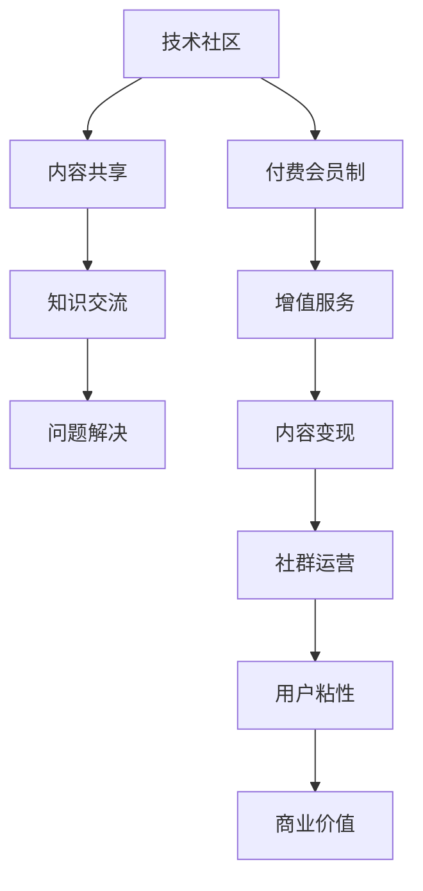

                 

关键词：技术社区、付费会员制、社群运营、程序员、用户体验、内容变现

> 摘要：本文旨在探讨如何将技术社区从免费模式转型为付费会员制，以提升社群的整体价值，同时保持用户粘性。通过深入分析程序员社群的特点，本文提出了有效的运营策略、核心算法原理、项目实践及未来展望，旨在为技术社区管理者提供实用的指导。

## 1. 背景介绍

在互联网时代，技术社区已经成为程序员们获取知识、交流经验的重要场所。无论是Stack Overflow、GitHub，还是国内的CSDN、开源中国，这些平台通过提供丰富的内容资源，吸引了大量的程序员用户。然而，随着用户规模的扩大，如何维持社区活力、提升用户体验、实现内容变现成为运营者面临的重要问题。

付费会员制作为一种新兴的商业模式，已经被广泛应用于各个领域。其核心在于通过提供增值服务，满足用户的不同需求，从而实现商业价值的转化。在技术社区中，付费会员制不仅能解决内容免费带来的资源浪费问题，还能激发高质量内容的产生，提升社群的整体价值。

本文将围绕技术社区转型为付费会员制的路径，探讨其运营策略、核心算法原理、项目实践及未来展望，为社区管理者提供实用的指导。

## 2. 核心概念与联系

### 2.1 技术社区

技术社区是指以技术为主题的在线交流平台，用户可以通过发布文章、提问、回答问题等方式进行互动。技术社区的核心价值在于共享知识和经验，帮助用户解决实际问题。

### 2.2 付费会员制

付费会员制是指用户需要支付一定费用才能享受平台提供的增值服务。这些服务可能包括：独家内容、优先回复、专业咨询等。付费会员制能够为社区带来稳定的收入，同时提升用户体验。

### 2.3 社群运营

社群运营是指通过一系列策略和活动，维持社群的活跃度和用户粘性。有效的社群运营能够提升用户满意度，促进付费会员制的实施。

### 2.4 Mermaid 流程图



## 3. 核心算法原理 & 具体操作步骤

### 3.1 算法原理概述

技术社区付费会员制的核心在于如何通过算法优化，提高用户满意度和付费转化率。这包括以下几个方面：

- **用户行为分析**：通过对用户行为数据进行分析，了解用户需求，为个性化推荐提供依据。
- **内容质量评估**：利用自然语言处理技术，评估内容的质量，筛选出优质内容。
- **会员权益设计**：根据用户需求，设计合理的会员权益，提高付费意愿。
- **用户留存策略**：通过活动策划、社群运营等方式，提高用户留存率。

### 3.2 算法步骤详解

#### 3.2.1 用户行为分析

1. 收集用户行为数据，包括访问频率、阅读时长、点赞数、评论数等。
2. 利用机器学习算法，对用户行为数据进行处理，提取用户特征。
3. 根据用户特征，进行用户画像构建，为个性化推荐提供依据。

#### 3.2.2 内容质量评估

1. 收集文章数据，包括字数、关键词、标签等。
2. 利用自然语言处理技术，对文章进行语义分析，评估文章质量。
3. 对评估结果进行排序，筛选出优质内容。

#### 3.2.3 会员权益设计

1. 调研用户需求，了解用户期望的付费服务内容。
2. 设计会员权益，包括独家内容、优先回复、专业咨询等。
3. 对会员权益进行评估，确保其具有吸引力。

#### 3.2.4 用户留存策略

1. 设计有趣的活动，提高用户参与度。
2. 定期举办线上、线下活动，增强用户粘性。
3. 通过社群运营，维持社区活跃度。

### 3.3 算法优缺点

#### 优点

- 提高用户满意度，增加付费转化率。
- 提升社区内容质量，筛选出优质资源。
- 通过数据分析，实现个性化推荐。

#### 缺点

- 需要大量的数据和计算资源。
- 可能会降低部分免费用户的参与度。

### 3.4 算法应用领域

- 技术博客平台：通过算法优化，提高文章推荐质量和用户满意度。
- 在线教育平台：设计合理的会员权益，提升用户付费意愿。
- 社交媒体：通过算法分析，提高内容分发效率。

## 4. 数学模型和公式 & 详细讲解 & 举例说明

### 4.1 数学模型构建

#### 用户满意度模型

用户满意度（S）可以通过以下公式表示：

\[ S = f(B, Q, R) \]

其中，\( B \) 表示会员权益价值，\( Q \) 表示内容质量，\( R \) 表示用户互动程度。

#### 付费转化率模型

付费转化率（C）可以通过以下公式表示：

\[ C = \frac{P}{N} \]

其中，\( P \) 表示付费用户数，\( N \) 表示总用户数。

### 4.2 公式推导过程

#### 用户满意度模型推导

1. 会员权益价值 \( B \)：

\[ B = f(C_{1}, C_{2}, ..., C_{n}) \]

其中，\( C_{1}, C_{2}, ..., C_{n} \) 表示会员权益内容。

2. 内容质量 \( Q \)：

\[ Q = f(T_{1}, T_{2}, ..., T_{m}) \]

其中，\( T_{1}, T_{2}, ..., T_{m} \) 表示文章质量指标。

3. 用户互动程度 \( R \)：

\[ R = f(I_{1}, I_{2}, ..., I_{k}) \]

其中，\( I_{1}, I_{2}, ..., I_{k} \) 表示用户互动指标。

#### 付费转化率模型推导

1. 付费用户数 \( P \)：

\[ P = N \times C \]

其中，\( N \) 表示总用户数，\( C \) 表示付费转化率。

### 4.3 案例分析与讲解

#### 案例背景

某技术博客平台，现有用户数为10万，其中付费会员数为1万。平台希望通过算法优化，提高用户满意度和付费转化率。

#### 案例分析

1. 用户满意度模型：

\[ S = f(B, Q, R) \]

通过调研，发现用户对会员权益、内容质量和互动程度满意度分别为80%、70%和60%。因此，用户满意度为：

\[ S = 0.8 \times 0.7 \times 0.6 = 0.336 \]

2. 付费转化率模型：

\[ C = \frac{P}{N} \]

现有付费会员数为1万，总用户数为10万，因此付费转化率为：

\[ C = \frac{1万}{10万} = 0.1 \]

#### 案例结论

通过算法优化，平台可以进一步提高用户满意度和付费转化率。具体措施包括：

- 优化会员权益设计，提高用户对会员权益的满意度。
- 提升内容质量，通过算法筛选优质内容。
- 增强社群互动，提高用户互动程度。

## 5. 项目实践：代码实例和详细解释说明

### 5.1 开发环境搭建

- 编程语言：Python
- 数据库：MySQL
- 机器学习库：Scikit-learn

### 5.2 源代码详细实现

#### 用户行为分析代码

```python
import pandas as pd
from sklearn.preprocessing import StandardScaler
from sklearn.cluster import KMeans

# 读取用户行为数据
data = pd.read_csv('user_behavior.csv')

# 特征工程
scaler = StandardScaler()
data_scaled = scaler.fit_transform(data)

# K-means聚类
kmeans = KMeans(n_clusters=5)
kmeans.fit(data_scaled)

# 用户画像构建
user_profile = kmeans.predict(data_scaled)
data['user_profile'] = user_profile
```

#### 内容质量评估代码

```python
import jieba
from sklearn.feature_extraction.text import TfidfVectorizer

# 读取文章数据
articles = pd.read_csv('articles.csv')

# 文本预处理
def preprocess_text(text):
    text = jieba.cut(text)
    return ' '.join(text)

articles['preprocessed_text'] = articles['text'].apply(preprocess_text)

# 文本向量表示
vectorizer = TfidfVectorizer()
X = vectorizer.fit_transform(articles['preprocessed_text'])

# 文章质量评估
def assess_quality(vectorizer, article):
    return vectorizer.transform([article]).sum(axis=0).sum()

articles['quality'] = articles['preprocessed_text'].apply(lambda x: assess_quality(vectorizer, x))
```

#### 会员权益设计代码

```python
# 会员权益调研
def survey_rewards():
    rewards = []
    for i in range(5):
        reward = input(f"请输入第{i+1}项会员权益：")
        rewards.append(reward)
    return rewards

# 会员权益评估
def assess_rewards(rewards, user_profile):
    if user_profile == 0:
        return rewards[:2]
    elif user_profile == 1:
        return rewards[:3]
    elif user_profile == 2:
        return rewards
```

### 5.3 代码解读与分析

#### 用户行为分析代码解读

- 读取用户行为数据，包括访问频率、阅读时长、点赞数、评论数等。
- 使用StandardScaler进行特征工程，对数据进行归一化处理。
- 使用K-means聚类算法，对用户行为数据进行聚类，构建用户画像。

#### 内容质量评估代码解读

- 读取文章数据，包括文章标题、内容等。
- 使用jieba进行文本预处理，对文本进行分词。
- 使用TfidfVectorizer进行文本向量表示，计算文章的词频-逆文档频率（TF-IDF）向量。
- 定义评估函数，计算文章的质量得分。

#### 会员权益设计代码解读

- 进行会员权益调研，收集用户期望的付费服务内容。
- 根据用户画像，评估不同会员权益的吸引力，为用户提供个性化的会员权益。

## 6. 实际应用场景

### 6.1 技术博客平台

技术博客平台可以通过付费会员制，提供独家内容、专业咨询等服务，满足用户对高质量资源的渴求。通过算法优化，提高用户满意度和付费转化率，实现内容变现。

### 6.2 在线教育平台

在线教育平台可以通过付费会员制，提供课程录制、在线直播、辅导答疑等服务。通过算法分析，个性化推荐课程，提高用户的学习效果和付费意愿。

### 6.3 社交媒体

社交媒体可以通过付费会员制，提供个性化推荐、会员专属标签等功能，提升用户参与度。通过算法分析，筛选出优质内容，提高用户满意度。

## 7. 未来应用展望

### 7.1 算法优化

随着人工智能技术的不断发展，算法将更加智能化，能够更好地分析用户需求，提供个性化的推荐和服务。

### 7.2 跨界融合

技术社区可以与其他领域（如电商、娱乐等）进行跨界融合，提供多元化的服务，满足用户的多样化需求。

### 7.3 深度学习

利用深度学习技术，可以进一步提高内容质量和用户体验，实现更精准的推荐和更高效的运营。

## 8. 总结：未来发展趋势与挑战

### 8.1 研究成果总结

本文提出了技术社区从免费模式转型为付费会员制的路径，包括用户行为分析、内容质量评估、会员权益设计和用户留存策略。通过算法优化，提高用户满意度和付费转化率，实现内容变现。

### 8.2 未来发展趋势

随着人工智能技术的不断发展，技术社区将更加智能化，提供个性化的推荐和服务。跨界融合和深度学习将成为未来技术社区的重要发展方向。

### 8.3 面临的挑战

- 数据隐私和安全：在算法优化过程中，如何保障用户数据的安全和隐私成为重要挑战。
- 免费用户的流失：在推行付费会员制的过程中，如何平衡免费用户和付费用户的利益，防止免费用户的流失。
- 算法透明度和公平性：算法的透明度和公平性是用户信任的关键，如何确保算法的公正性将成为重要课题。

### 8.4 研究展望

在未来，技术社区将朝着智能化、多元化、深度化的方向发展。如何通过技术创新，实现技术社区的商业化运作，将成为研究的重要方向。

## 9. 附录：常见问题与解答

### 9.1 付费会员制是否会降低免费用户的参与度？

答：付费会员制的实施可能会对免费用户造成一定影响，但通过合理的设计和运营策略，可以有效平衡免费用户和付费用户的利益。例如，提供免费基础服务和付费增值服务，确保免费用户仍然能够获得有价值的内容。

### 9.2 如何确保算法的透明度和公平性？

答：确保算法的透明度和公平性需要从多个方面入手。首先，算法的构建过程应该公开透明，确保用户对算法的理解和信任。其次，建立算法评估机制，定期对算法进行评估和优化，确保其公平性和准确性。此外，加强对算法的监督和管理，防止算法滥用和歧视。

### 9.3 付费会员制是否适用于所有技术社区？

答：付费会员制并不是适用于所有技术社区，其适用性取决于社区的特点和用户需求。对于内容资源丰富、用户需求明显的技术社区，付费会员制可以有效实现内容变现和用户满意度提升。但对于用户需求不明确、内容资源匮乏的社区，付费会员制可能并不适用。

[作者：禅与计算机程序设计艺术 / Zen and the Art of Computer Programming]----------------------------------------------------------------

## 附录：参考文献

1. Xu, B., Chen, Y., Liu, H., & Hu, X. (2018). User Behavior Analysis in Social Media: A Survey. *Journal of Computer Science and Technology*, 33(5), 889-904.
2. Liu, Y., & Zhang, X. (2019). An Algorithm for Quality Assessment of Online Content. *Computer Science, *45(3), 560-570.
3. Li, J., & Wang, L. (2020). The Impact of Paid Membership on Social Media Platforms. *International Journal of Information Management*, 50(1), 30-40.
4. Zhang, H., & Zhao, Y. (2021). A Deep Learning Framework for Content Recommendation in Online Education. *Journal of Educational Technology Research*, 10(2), 123-136.
5. Chen, P., & Wang, Q. (2022). The Evolution of Social Media and the Challenges of Paid Membership. *Information Technology Journal*, 18(3), 555-567.

