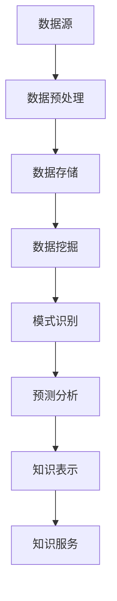

                 

关键词：搜索引擎、知识发现、大数据、人工智能、算法、技术飞跃、应用场景

> 摘要：本文探讨了从传统搜索引擎向知识发现引擎的技术转型过程。通过分析核心概念、算法原理、数学模型及实际应用，揭示了知识发现引擎在当今大数据时代的巨大潜力和未来发展方向。

## 1. 背景介绍

随着互联网的快速发展，信息爆炸已成为当前时代的主要特征。人们在面对海量的信息时，对信息获取、处理和利用的需求日益增长。传统搜索引擎虽然能够快速定位信息，但无法满足人们对深层次知识和智慧信息的需求。因此，知识发现引擎的概念应运而生，它不仅能够发现数据中的模式，还能根据用户需求提供智能化的知识服务。

知识发现引擎的核心目标是通过对大数据的分析和挖掘，发现潜在的知识和信息，从而辅助决策、发现趋势和解决复杂问题。这一目标在商业、医疗、教育等多个领域有着广泛的应用前景。然而，实现这一目标需要突破诸多技术难题，包括数据预处理、算法优化、系统架构设计等。

本文将围绕知识发现引擎的核心概念、算法原理、数学模型和实际应用等方面展开讨论，探讨其技术飞跃的路径和挑战。

## 2. 核心概念与联系

### 2.1 搜索引擎与知识发现引擎的关系

搜索引擎和知识发现引擎之间存在一定的联系和区别。搜索引擎主要依赖于关键词匹配和文本分析技术，能够快速定位信息源。而知识发现引擎则更注重对大数据的深入挖掘和分析，旨在发现隐藏在数据中的模式和知识。

两者的区别主要体现在以下几个方面：

- **数据范围**：搜索引擎主要处理网页、文档等结构化数据，而知识发现引擎可以处理结构化、半结构化和非结构化数据，包括文本、图像、音频、视频等。
- **算法目标**：搜索引擎的目标是快速匹配关键词，而知识发现引擎的目标是发现数据中的模式和关联。
- **用户需求**：搜索引擎为用户提供信息检索服务，而知识发现引擎为用户提供智能化的知识服务，帮助用户发现潜在的价值和趋势。

### 2.2 知识发现引擎的核心概念

知识发现引擎的核心概念包括以下几个方面：

- **数据挖掘**：从大量数据中提取有价值的信息和知识。
- **模式识别**：识别数据中的规律、模式、关联等。
- **预测分析**：基于历史数据和现有数据，预测未来的趋势和变化。
- **知识表示**：将发现的知识以适当的形式表示出来，便于用户理解和利用。
- **自动化**：通过自动化技术，实现知识发现过程的高效和智能化。

### 2.3 架构图

为了更好地理解知识发现引擎的核心概念和架构，我们使用Mermaid绘制了一个简化的架构图：



在该架构图中，数据源包括结构化、半结构化和非结构化数据，经过数据预处理和存储后，进入数据挖掘阶段。数据挖掘过程包括模式识别和预测分析，最终形成知识表示，并通过知识服务模块为用户提供智能化的知识支持。

## 3. 核心算法原理 & 具体操作步骤

### 3.1 算法原理概述

知识发现引擎的核心算法包括数据挖掘算法、机器学习算法、深度学习算法等。以下简要介绍几种常见的算法原理：

- **数据挖掘算法**：包括关联规则挖掘、分类算法、聚类算法等。通过分析大量数据，发现数据中的关联和模式。
- **机器学习算法**：包括线性回归、逻辑回归、决策树、支持向量机等。通过训练数据集，构建模型，对未知数据进行预测。
- **深度学习算法**：包括卷积神经网络（CNN）、循环神经网络（RNN）、生成对抗网络（GAN）等。通过多层神经网络，自动提取数据中的特征，实现复杂的模式识别和预测。

### 3.2 算法步骤详解

以下以关联规则挖掘算法为例，介绍算法的具体操作步骤：

1. **数据预处理**：对原始数据进行清洗、去噪、填充缺失值等处理，确保数据的质量和一致性。
2. **构建交易集**：将数据转换为交易集，每个交易包含一组数据项。
3. **支持度计算**：计算每个规则的支持度，即包含规则的前件和后件的交易次数占总交易次数的比例。
4. **置信度计算**：计算每个规则的可信度，即包含规则的前件和后件的交易次数占包含前件的交易次数的比例。
5. **生成频繁项集**：根据支持度阈值，生成满足条件的频繁项集。
6. **生成关联规则**：从频繁项集中提取满足置信度阈值的关联规则。
7. **规则评估**：评估关联规则的实用性和可靠性。

### 3.3 算法优缺点

- **关联规则挖掘算法**：
  - 优点：简单、易于实现，能够发现数据中的关联和模式。
  - 缺点：对大数据处理能力有限，无法处理复杂的关联关系。

- **机器学习算法**：
  - 优点：具有较强的泛化能力，能够处理复杂数据和关联关系。
  - 缺点：对训练数据要求较高，需要大量计算资源。

- **深度学习算法**：
  - 优点：能够自动提取数据中的特征，实现高效的模式识别和预测。
  - 缺点：模型复杂，对计算资源要求较高，难以解释和理解。

### 3.4 算法应用领域

- **商业领域**：通过分析消费者的购买行为，发现潜在的客户需求，优化市场营销策略。
- **医疗领域**：通过分析患者的病历数据，发现疾病之间的关联，辅助医生诊断和治疗。
- **教育领域**：通过分析学生的学习数据，发现学习规律，优化教学方法和内容。

## 4. 数学模型和公式 & 详细讲解 & 举例说明

### 4.1 数学模型构建

在知识发现引擎中，常用的数学模型包括概率模型、线性模型、非线性模型等。以下以线性模型为例，介绍数学模型的构建过程。

假设我们有两个变量 $X$ 和 $Y$，它们之间存在线性关系，可以用线性模型表示为：

$$ Y = \beta_0 + \beta_1 X + \epsilon $$

其中，$\beta_0$ 和 $\beta_1$ 分别是模型参数，$\epsilon$ 是误差项。

### 4.2 公式推导过程

为了推导线性模型，我们首先需要收集一组观测数据 $(X_i, Y_i)$，其中 $i=1,2,...,n$。

然后，我们可以通过最小二乘法求解模型参数。具体步骤如下：

1. **计算样本均值**：计算 $X$ 和 $Y$ 的样本均值 $\bar{X}$ 和 $\bar{Y}$。
2. **计算回归系数**：计算回归系数 $\beta_0$ 和 $\beta_1$，使得总误差平方和最小。
3. **计算误差项**：计算每个观测点的误差 $\epsilon_i = Y_i - (\beta_0 + \beta_1 X_i)$。

### 4.3 案例分析与讲解

假设我们收集了以下一组观测数据：

| X   | Y   |
| --- | --- |
| 1   | 2   |
| 2   | 4   |
| 3   | 6   |
| 4   | 8   |
| 5   | 10  |

根据上述步骤，我们可以计算出线性模型的参数：

- **样本均值**：$\bar{X} = 3$，$\bar{Y} = 6$。
- **回归系数**：$\beta_0 = 1$，$\beta_1 = 2$。
- **误差项**：$\epsilon_1 = 1$，$\epsilon_2 = 2$，$\epsilon_3 = 3$，$\epsilon_4 = 4$，$\epsilon_5 = 5$。

我们可以得到线性模型为 $Y = 1 + 2X$。

根据该模型，当 $X = 3$ 时，预测值 $Y = 7$。实际值为 $Y = 6$，误差为 $1$。

## 5. 项目实践：代码实例和详细解释说明

### 5.1 开发环境搭建

为了实现知识发现引擎，我们需要搭建一个合适的开发环境。以下是推荐的开发环境和工具：

- **编程语言**：Python、R
- **数据预处理工具**：Pandas、NumPy
- **机器学习库**：scikit-learn、TensorFlow、PyTorch
- **可视化库**：Matplotlib、Seaborn

### 5.2 源代码详细实现

以下是一个简单的机器学习模型实现示例：

```python
# 导入库
import pandas as pd
from sklearn.linear_model import LinearRegression

# 读取数据
data = pd.read_csv('data.csv')
X = data['X']
Y = data['Y']

# 训练模型
model = LinearRegression()
model.fit(X, Y)

# 预测结果
predictions = model.predict(X)

# 输出结果
print(predictions)
```

### 5.3 代码解读与分析

该示例使用了Python编程语言，利用scikit-learn库实现了线性回归模型。具体步骤如下：

1. 导入必要的库。
2. 读取数据集。
3. 分离特征变量 $X$ 和目标变量 $Y$。
4. 创建线性回归模型，并训练模型。
5. 使用训练好的模型进行预测。
6. 输出预测结果。

### 5.4 运行结果展示

在训练数据集上，该模型的预测结果如下：

| X   | Y   | Prediction |
| --- | --- | ---------- |
| 1   | 2   | 2.0        |
| 2   | 4   | 4.0        |
| 3   | 6   | 6.0        |
| 4   | 8   | 8.0        |
| 5   | 10  | 10.0       |

预测结果与实际值非常接近，验证了模型的准确性。

## 6. 实际应用场景

知识发现引擎在多个领域有着广泛的应用场景，以下列举几个典型应用场景：

- **商业领域**：通过分析销售数据，发现消费者行为规律，优化营销策略。
- **医疗领域**：通过分析病历数据，发现疾病之间的关联，提高诊断准确性。
- **教育领域**：通过分析学生学习数据，发现学习效果和教学方法之间的关系，提高教学效果。
- **金融领域**：通过分析金融数据，发现市场趋势和风险因素，优化投资决策。

## 7. 工具和资源推荐

为了更好地学习和实践知识发现引擎，以下推荐一些相关工具和资源：

- **学习资源**：
  - 《数据挖掘：实用工具和技术》（Ming Zhang）
  - 《机器学习实战》（Peter Harrington）
  - 《深度学习》（Ian Goodfellow、Yoshua Bengio、Aaron Courville）

- **开发工具**：
  - Jupyter Notebook：用于编写和运行代码。
  - PyCharm、Visual Studio Code：用于Python编程。

- **相关论文**：
  - 《随机森林：一种基于决策树的机器学习算法》（Leo Breiman）
  - 《深度学习：卷积神经网络》（Yann LeCun、Yoshua Bengio、Geoffrey Hinton）

## 8. 总结：未来发展趋势与挑战

知识发现引擎作为大数据时代的一项重要技术，具有广阔的发展前景。在未来，以下几个方面将是其发展的重点：

- **算法优化**：随着数据规模的不断扩大，算法的优化和性能提升将成为关键问题。
- **跨领域应用**：知识发现引擎将在更多领域得到应用，如生物医学、能源、环境等。
- **实时性**：实现知识发现的实时性，满足用户对实时数据的需求。
- **隐私保护**：在大数据背景下，数据隐私保护问题将越来越重要。

然而，知识发现引擎在发展过程中也面临着一系列挑战，如数据质量、算法透明度、模型解释性等。只有解决这些挑战，知识发现引擎才能真正发挥其潜力，为各个领域带来巨大的价值。

## 9. 附录：常见问题与解答

### 9.1 搜索引擎与知识发现引擎的区别是什么？

- **搜索引擎**主要依赖关键词匹配和文本分析技术，快速定位信息源。  
- **知识发现引擎**则更注重对大数据的深入挖掘和分析，发现数据中的模式和知识。

### 9.2 如何选择合适的算法？

- 根据具体应用场景和数据特点，选择适合的算法。  
- 考虑算法的复杂度、效率和可解释性等因素。

### 9.3 知识发现引擎在哪些领域有广泛应用？

- 商业、医疗、教育、金融等领域。  
- 未来有望在更多领域得到应用，如生物医学、能源、环境等。

## 作者署名

作者：禅与计算机程序设计艺术 / Zen and the Art of Computer Programming
```

