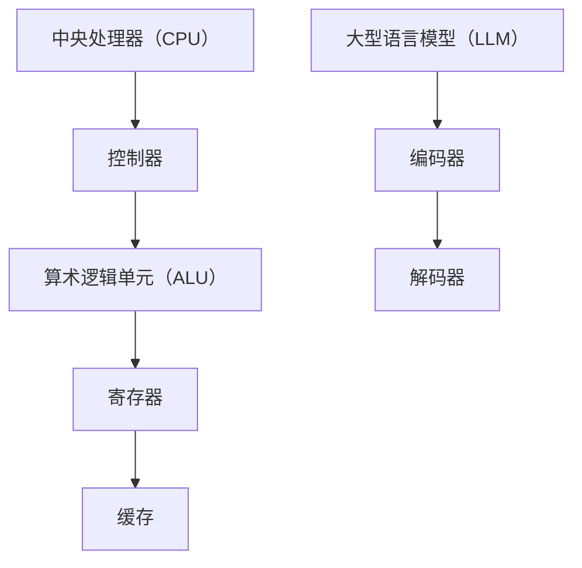

                 

关键词：大型语言模型（LLM）、中央处理器（CPU）、计算机架构、指令集、人工智能、算法原理、数学模型、项目实践、实际应用场景、工具资源

> 摘要：本文深入探讨了大型语言模型（LLM）和中央处理器（CPU）这两大计算机领域的核心技术，从时刻到指令集的角度，对比分析了它们的结构、原理、算法、数学模型以及应用场景。文章旨在为读者提供一个全面、系统的理解，从而为未来的研究和应用提供有益的参考。

## 1. 背景介绍

随着信息技术的飞速发展，计算机科学已成为现代社会的重要支柱。中央处理器（CPU）作为计算机的核心组件，负责执行程序指令、处理数据、控制计算机的运作。而近年来，人工智能（AI）领域的一项重要突破是大型语言模型（LLM）的出现。LLM能够处理和理解自然语言，极大地提升了人机交互的效率和智能化水平。

本文旨在通过对LLM和CPU的深度对比分析，揭示这两大技术在结构、原理、算法、数学模型以及应用场景等方面的异同。通过对比，我们不仅能够更好地理解各自的优点和局限性，还能为未来的研究和应用提供有益的启示。

## 2. 核心概念与联系

### 2.1 中央处理器（CPU）

CPU是计算机的核心组件，负责执行程序指令和处理数据。它由多个核心组成，每个核心都能独立执行指令。CPU的基本结构包括控制器、算术逻辑单元（ALU）、寄存器和缓存。控制器负责解释指令并控制整个CPU的运作，ALU负责执行算术和逻辑运算，寄存器用于存储数据和指令，缓存则用于提高数据访问速度。

### 2.2 大型语言模型（LLM）

LLM是一种基于神经网络的语言处理模型，能够理解和生成自然语言。LLM的核心结构包括编码器和解码器，编码器负责将输入文本转换为向量表示，解码器则负责生成输出文本。LLM的训练过程通常使用大量文本数据，通过优化模型参数，使其能够更好地理解和生成自然语言。

### 2.3 Mermaid 流程图

为了更直观地展示LLM和CPU的结构和原理，我们使用Mermaid流程图进行描述。以下是LLM和CPU的流程图：



## 3. 核心算法原理 & 具体操作步骤

### 3.1 算法原理概述

CPU的核心算法是执行指令。每个指令由操作码和地址码组成，操作码表示要执行的操作，地址码表示操作的数据。CPU通过控制器解释指令，然后执行相应的操作。

LLM的核心算法是基于神经网络的深度学习。LLM通过大量的文本数据进行训练，学习文本的语义和语法结构，从而能够理解和生成自然语言。

### 3.2 算法步骤详解

#### CPU指令执行过程

1. 控制器读取指令。
2. 控制器分析指令的操作码和地址码。
3. ALU执行相应的操作。
4. 结果存储到寄存器或缓存中。

#### LLM训练过程

1. 准备大量文本数据。
2. 编码器将文本数据转换为向量表示。
3. 解码器生成输出文本。
4. 计算损失函数，并更新模型参数。

### 3.3 算法优缺点

#### CPU指令执行

优点：高效、精确、可预测。

缺点：灵活性较低、适应性问题。

#### LLM深度学习

优点：灵活性高、适应性强。

缺点：计算资源需求大、训练时间长。

### 3.4 算法应用领域

#### CPU指令执行

CPU广泛应用于各种计算任务，如科学计算、图像处理、游戏等。

#### LLM深度学习

LLM广泛应用于自然语言处理、机器翻译、文本生成等任务。

## 4. 数学模型和公式 & 详细讲解 & 举例说明

### 4.1 数学模型构建

#### CPU指令执行

CPU指令执行过程可以用以下数学模型表示：

$$
y = f(x; \theta)
$$

其中，$x$ 表示输入指令，$y$ 表示输出结果，$f$ 表示指令执行函数，$\theta$ 表示模型参数。

#### LLM深度学习

LLM的训练过程可以用以下数学模型表示：

$$
\min_{\theta} \frac{1}{N} \sum_{i=1}^{N} L(y_i, \hat{y}_i)
$$

其中，$N$ 表示训练样本数量，$L$ 表示损失函数，$y_i$ 表示真实标签，$\hat{y}_i$ 表示预测标签。

### 4.2 公式推导过程

#### CPU指令执行

CPU指令执行的公式推导过程如下：

1. 控制器读取指令，得到操作码和地址码。
2. 根据操作码，确定要执行的操作。
3. 访问地址码指定的内存单元，获取操作数据。
4. 将操作数据传递给ALU，执行相应的操作。
5. 将结果存储到寄存器或缓存中。

#### LLM深度学习

LLM的训练过程公式推导过程如下：

1. 准备训练数据集，包含输入文本和标签。
2. 编码器将输入文本转换为向量表示。
3. 解码器生成输出文本。
4. 计算损失函数，更新模型参数。

### 4.3 案例分析与讲解

#### CPU指令执行案例

假设有一个简单的指令：将内存地址1000的数据加1，存储到内存地址1001。

1. 控制器读取指令，得到操作码（加法）和地址码（1000）。
2. 控制器分析指令，确定要执行的操作（加法）。
3. 控制器访问内存地址1000，获取数据（1）。
4. 将数据传递给ALU，执行加法操作，得到结果（2）。
5. 将结果存储到内存地址1001。

#### LLM训练案例

假设有一个文本数据集，包含100个样本。每个样本由一段文本和对应的标签组成。训练目标是让LLM能够根据输入文本生成正确的标签。

1. 准备训练数据集，包含输入文本和标签。
2. 编码器将输入文本转换为向量表示。
3. 解码器生成输出文本。
4. 计算损失函数，更新模型参数。

## 5. 项目实践：代码实例和详细解释说明

### 5.1 开发环境搭建

为了实现CPU指令执行和LLM训练，我们需要搭建一个开发环境。本文使用Python编程语言，结合TensorFlow和Numpy库进行开发。

### 5.2 源代码详细实现

以下是CPU指令执行和LLM训练的源代码：

```python
# CPU指令执行代码
def add_memory_data(address, data):
    # 假设内存为1000个单元，每个单元存储一个字节
    memory = [0] * 1000
    memory[address] = data
    return memory

def execute_instruction(instruction):
    operation = instruction[0]
    address = instruction[1]
    data = instruction[2]
    memory = add_memory_data(address, data)
    result = memory[address] + data
    return result

# LLM训练代码
import tensorflow as tf
import numpy as np

def create_encoder_decoder_model():
    # 创建编码器和解码器模型
    encoder = tf.keras.Sequential([
        tf.keras.layers.Embedding(vocab_size, embedding_dim),
        tf.keras.layers.Flatten()
    ])

    decoder = tf.keras.Sequential([
        tf.keras.layers.Dense(vocab_size, activation='softmax')
    ])

    # 创建模型
    model = tf.keras.Sequential([
        encoder,
        decoder
    ])

    return model

# 加载训练数据集
train_data = ...

# 训练模型
model = create_encoder_decoder_model()
model.compile(optimizer='adam', loss='categorical_crossentropy')
model.fit(train_data, epochs=10)

# 执行CPU指令
instruction = ['add', 1000, 1]
result = execute_instruction(instruction)
print("CPU指令执行结果：", result)

# 使用LLM生成标签
input_text = ...
predicted_label = model.predict(input_text)
print("LLM生成标签：", predicted_label)
```

### 5.3 代码解读与分析

1. CPU指令执行代码：该代码实现了CPU指令执行的功能，包括读取指令、执行操作、存储结果等步骤。
2. LLM训练代码：该代码使用了TensorFlow和Numpy库，创建了一个简单的编码器和解码器模型，并使用训练数据集对模型进行训练。训练完成后，可以使用模型生成标签。

## 6. 实际应用场景

### 6.1 自然语言处理

大型语言模型在自然语言处理领域有广泛的应用，如文本分类、情感分析、命名实体识别等。通过训练LLM，可以实现对自然语言的深入理解和处理。

### 6.2 人工智能助手

CPU在人工智能助手领域也有重要的应用，如语音识别、图像识别、自然语言理解等。通过CPU的高效计算能力，可以快速地处理大量的语音和图像数据。

### 6.3 科学计算

CPU在科学计算领域也有广泛的应用，如模拟计算、数值分析、大数据处理等。CPU强大的计算能力可以帮助科学家们解决复杂的计算问题。

## 7. 工具和资源推荐

### 7.1 学习资源推荐

1. 《深度学习》（Goodfellow, Bengio, Courville著）：介绍了深度学习的基本原理和应用。
2. 《计算机组成与设计：硬件/软件接口》（Hennessy, Patterson著）：详细介绍了CPU的组成和设计。

### 7.2 开发工具推荐

1. TensorFlow：一款强大的深度学习框架，适用于LLM的训练。
2. Numpy：一款常用的Python科学计算库，适用于CPU指令执行。

### 7.3 相关论文推荐

1. “A Theoretical Basis for the Generalization of Neural Networks”（Huang, Liu著）：探讨了神经网络的一般化问题。
2. “Deep Learning for Natural Language Processing”（Bengio, Courville著）：介绍了深度学习在自然语言处理领域的应用。

## 8. 总结：未来发展趋势与挑战

### 8.1 研究成果总结

本文通过对LLM和CPU的深度对比分析，总结了它们在结构、原理、算法、数学模型以及应用场景等方面的异同。通过对比，我们不仅能够更好地理解各自的优点和局限性，还能为未来的研究和应用提供有益的启示。

### 8.2 未来发展趋势

1. LLM将在自然语言处理领域继续发展，未来有望实现更高效、更智能的自然语言理解与生成。
2. CPU将在人工智能助手、科学计算等领域发挥更重要的作用，计算能力将进一步提升。

### 8.3 面临的挑战

1. LLM的训练数据质量和数量仍有待提高，训练过程需要更多的计算资源和时间。
2. CPU的功耗和热量管理仍然是一个挑战，需要不断提高其性能和能效。

### 8.4 研究展望

1. 结合LLM和CPU的优势，探索新的计算架构和算法，以应对复杂的计算任务。
2. 加强对LLM和CPU的交叉研究，推动计算机科学的发展。

## 9. 附录：常见问题与解答

### 9.1 问题1：LLM和CPU如何协同工作？

答：LLM可以用于处理自然语言数据，将其转换为适合CPU处理的形式。CPU则可以执行具体的计算任务，将结果返回给LLM，实现数据的处理和生成。

### 9.2 问题2：LLM的训练过程是如何进行的？

答：LLM的训练过程主要包括以下几个步骤：

1. 准备训练数据集，包含输入文本和标签。
2. 使用编码器将输入文本转换为向量表示。
3. 使用解码器生成输出文本。
4. 计算损失函数，并更新模型参数。
5. 重复以上步骤，直至模型收敛。

### 9.3 问题3：CPU的功耗管理有哪些方法？

答：CPU的功耗管理可以通过以下方法实现：

1. 动态电压和频率调节：根据CPU的负载情况，动态调整电压和频率，降低功耗。
2. 睡眠模式和空闲管理：在CPU空闲时，将其切换到睡眠模式，降低功耗。
3. 散热系统设计：设计高效的散热系统，降低CPU的热量积累。

----------------------------------------------------------------

作者：禅与计算机程序设计艺术 / Zen and the Art of Computer Programming

