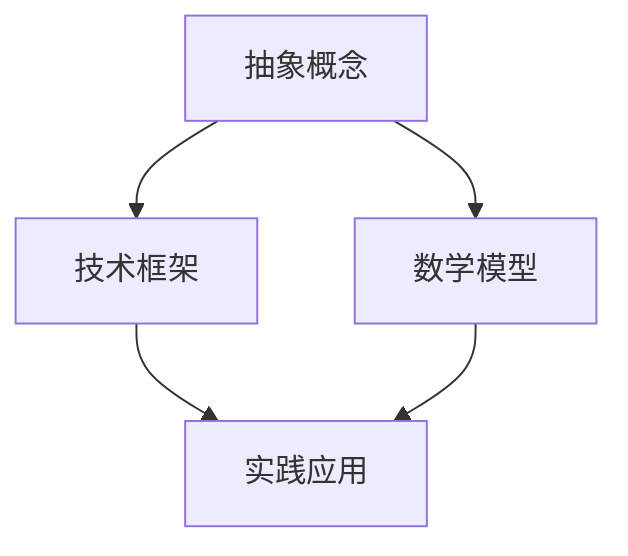
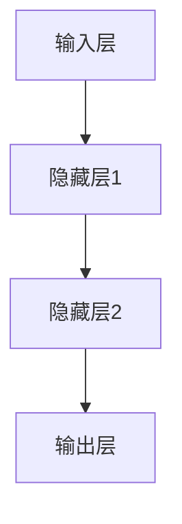

                 

 在这个数字化的时代，技术的快速迭代和变革催生了许多新的理念和创新。然而，从概念到实践，这一转化过程往往充满了挑战和复杂性。本文将探讨如何将抽象的思想转化为具体的实践，特别是在技术领域的应用。通过深入探讨核心概念、算法原理、数学模型以及实际项目实践，我们将展示这一转化过程的各个方面。

## 关键词

- 抽象概念
- 技术转化
- 实践应用
- 算法实现
- 数学建模
- 项目实践

## 摘要

本文旨在探讨从概念到实践的思想转化过程，特别是其在技术领域的应用。文章首先介绍了技术转化的背景和重要性，接着详细阐述了核心概念、算法原理、数学模型以及实际项目实践。通过这些方面的深入讨论，本文希望读者能够更好地理解如何将思想转化为具体的技术实践，并认识到这一过程中所面临的挑战和机会。

## 1. 背景介绍

随着互联网、人工智能、大数据等技术的迅猛发展，我们正处于一个前所未有的技术革命时代。新概念、新技术层出不穷，给各个行业带来了深刻的变革。然而，从概念到实践的转化并不是一件容易的事情。这一过程涉及到多个层面的挑战：

1. **抽象概念的理解**：许多技术创新最初都是以抽象的概念形式出现的，这些概念往往需要深入的学术背景和技术理解。
2. **技术实现的可行性**：从理论上可能可行，但在实际应用中可能存在技术障碍，需要解决这些问题。
3. **经济和商业的考量**：技术的转化往往伴随着经济和商业的考量，这需要评估技术的市场潜力和商业可行性。
4. **社会和文化的影响**：技术的转化也会受到社会和文化的影响，这需要考虑技术如何与社会需求和文化背景相适应。

在技术领域，从概念到实践的思想转化尤为重要。这不仅涉及到技术创新本身，还包括了如何将创新融入现有技术体系，以及如何通过实践验证和优化技术。这一过程的成功与否直接影响到技术的应用效果和社会影响。

## 2. 核心概念与联系

在探讨技术转化之前，我们首先需要理解一些核心概念。以下是几个关键概念及其相互之间的联系：

### 2.1 抽象概念

**定义**：抽象概念是对现实世界的一种简化和概括，通常用于描述复杂现象。

**联系**：抽象概念是技术转化的起点，它们为我们提供了理解复杂系统的框架。例如，在人工智能领域，抽象概念如“机器学习”、“神经网络”等，为我们理解和实现这些技术提供了基础。

### 2.2 技术框架

**定义**：技术框架是一系列工具、库和标准，用于构建和实现技术。

**联系**：技术框架是实现抽象概念的关键，它们提供了具体的实现路径和方法。例如，在构建机器学习模型时，可以使用TensorFlow、PyTorch等技术框架。

### 2.3 数学模型

**定义**：数学模型是用数学语言描述现实世界的抽象模型。

**联系**：数学模型为技术转化提供了理论基础和量化方法。例如，在深度学习中，优化算法和损失函数的数学模型是技术实现的核心。

### 2.4 实践应用

**定义**：实践应用是将技术转化为实际解决方案的过程。

**联系**：实践应用是技术转化的最终目标，它们将抽象概念、技术框架和数学模型结合起来，解决现实问题。

以下是这些核心概念之间的 Mermaid 流程图：



通过这个流程图，我们可以看到从抽象概念到实践应用之间的逻辑关系和相互影响。这种理解对于技术转化至关重要，因为它为我们提供了一个系统的视角来分析和处理技术转化过程中的各种挑战。

## 3. 核心算法原理 & 具体操作步骤

### 3.1 算法原理概述

在技术转化过程中，算法是实现技术核心功能的关键。以下将介绍一种典型的核心算法——深度学习算法，并概述其原理。

**深度学习算法**：深度学习是一种基于多层神经网络的学习方法，它通过多层次的非线性变换来提取数据中的特征。深度学习算法的核心思想是模拟人脑的工作方式，通过多层神经元的互联和训练，实现对数据的自动特征提取和分类。

**原理**：深度学习算法主要分为以下几个步骤：

1. **数据预处理**：对输入数据（如图像、文本等）进行清洗和标准化处理。
2. **构建神经网络模型**：定义网络的层次结构，包括输入层、隐藏层和输出层。
3. **前向传播**：将输入数据通过网络向前传播，计算每个神经元的输出。
4. **反向传播**：通过反向传播算法计算每个神经元的误差，并更新网络参数。
5. **迭代优化**：重复前向传播和反向传播，直至网络收敛。

### 3.2 算法步骤详解

**步骤 1：数据预处理**

数据预处理是深度学习的基础，其质量直接影响模型的性能。数据预处理通常包括以下步骤：

- **数据清洗**：去除数据中的噪声和异常值。
- **数据归一化**：将数据缩放到相同的尺度，便于模型训练。
- **数据增强**：通过旋转、缩放、裁剪等操作增加数据的多样性。

**步骤 2：构建神经网络模型**

构建神经网络模型是深度学习的核心。我们需要选择合适的网络结构，并定义每个层的参数。以下是一个简单的神经网络模型示例：



**步骤 3：前向传播**

前向传播是将输入数据通过神经网络模型计算输出值的过程。具体步骤如下：

1. 初始化网络参数（如权重和偏置）。
2. 将输入数据输入到网络，通过每个神经元进行计算。
3. 计算每个神经元的输出值，并传递给下一层。

**步骤 4：反向传播**

反向传播是深度学习算法的关键步骤，用于计算网络的误差并更新参数。具体步骤如下：

1. 计算输出层的误差（通常使用交叉熵作为损失函数）。
2. 通过反向传播算法，将误差反向传播到每个神经元。
3. 根据误差计算每个参数的梯度，并使用梯度下降算法更新参数。

**步骤 5：迭代优化**

迭代优化是通过重复前向传播和反向传播，逐步减小网络误差，直至网络收敛。具体步骤如下：

1. 设置迭代次数和优化器的参数（如学习率）。
2. 对每个迭代进行前向传播和反向传播。
3. 计算网络的损失函数值，并观察是否收敛。

### 3.3 算法优缺点

**优点**：

- **强大的特征提取能力**：深度学习能够自动提取数据中的复杂特征，无需人工干预。
- **自适应能力**：深度学习模型可以根据数据分布自动调整参数，具有较强的自适应能力。
- **广泛的应用领域**：深度学习在图像识别、自然语言处理、语音识别等领域具有广泛的应用。

**缺点**：

- **计算资源需求高**：深度学习模型通常需要大量的计算资源和时间进行训练。
- **数据需求大**：深度学习模型需要大量的数据来训练，数据的质量和多样性对模型性能有很大影响。
- **模型解释性差**：深度学习模型通常被视为“黑盒”，其内部工作原理难以解释和理解。

### 3.4 算法应用领域

深度学习算法在多个领域取得了显著的成果，以下是一些典型的应用领域：

- **图像识别**：如人脸识别、物体检测、图像分类等。
- **自然语言处理**：如机器翻译、情感分析、文本分类等。
- **语音识别**：如语音合成、语音识别、说话人识别等。
- **推荐系统**：如商品推荐、音乐推荐、电影推荐等。
- **无人驾驶**：如车辆检测、路径规划、障碍物回避等。

### 3.5 算法实现步骤

以下是使用 Python 实现深度学习算法的基本步骤：

1. **安装相关库和框架**：如 TensorFlow、PyTorch 等。
2. **数据预处理**：包括数据清洗、归一化和增强。
3. **构建神经网络模型**：定义输入层、隐藏层和输出层。
4. **训练模型**：通过前向传播和反向传播训练模型，优化网络参数。
5. **评估模型**：使用验证集评估模型性能，调整模型参数。
6. **部署模型**：将训练好的模型部署到实际应用中。

### 3.6 实际应用案例

以下是一个简单的图像分类案例，使用 TensorFlow 和 Keras 构建和训练一个卷积神经网络（CNN）模型：

```python
import tensorflow as tf
from tensorflow.keras import layers

# 数据预处理
(x_train, y_train), (x_test, y_test) = tf.keras.datasets.cifar10.load_data()
x_train, x_test = x_train / 255.0, x_test / 255.0

# 构建模型
model = tf.keras.Sequential([
    layers.Conv2D(32, (3, 3), activation='relu', input_shape=(32, 32, 3)),
    layers.MaxPooling2D((2, 2)),
    layers.Conv2D(64, (3, 3), activation='relu'),
    layers.MaxPooling2D((2, 2)),
    layers.Conv2D(64, (3, 3), activation='relu'),
    layers.Flatten(),
    layers.Dense(64, activation='relu'),
    layers.Dense(10, activation='softmax')
])

# 编译模型
model.compile(optimizer='adam',
              loss=tf.keras.losses.SparseCategoricalCrossentropy(from_logits=True),
              metrics=['accuracy'])

# 训练模型
model.fit(x_train, y_train, epochs=10, validation_data=(x_test, y_test))

# 评估模型
test_loss, test_acc = model.evaluate(x_test,  y_test, verbose=2)
print(f'Test accuracy: {test_acc:.4f}')
```

这个案例展示了如何使用深度学习算法进行图像分类，从数据预处理到模型训练和评估，整个过程都基于 TensorFlow 和 Keras 框架。

## 4. 数学模型和公式 & 详细讲解 & 举例说明

在技术转化过程中，数学模型和公式是理解和实现算法的关键。以下将介绍一种典型的数学模型——线性回归模型，并详细讲解其公式推导、应用领域和举例说明。

### 4.1 数学模型构建

**线性回归模型**是一种用于预测数值变量的统计模型，其基本形式为：

\[ Y = \beta_0 + \beta_1X + \epsilon \]

其中，\( Y \) 是因变量，\( X \) 是自变量，\( \beta_0 \) 和 \( \beta_1 \) 是模型的参数，\( \epsilon \) 是误差项。

### 4.2 公式推导过程

线性回归模型的推导基于最小二乘法。具体步骤如下：

1. **定义损失函数**：损失函数用于衡量预测值与真实值之间的差距，常用的损失函数是平方误差损失函数：

\[ L(\beta_0, \beta_1) = \sum_{i=1}^{n} (Y_i - (\beta_0 + \beta_1X_i))^2 \]

2. **求导**：对损失函数关于 \( \beta_0 \) 和 \( \beta_1 \) 分别求偏导数，并令偏导数为零，得到最优参数：

\[ \frac{\partial L}{\partial \beta_0} = -2 \sum_{i=1}^{n} (Y_i - (\beta_0 + \beta_1X_i)) = 0 \]
\[ \frac{\partial L}{\partial \beta_1} = -2 \sum_{i=1}^{n} X_i (Y_i - (\beta_0 + \beta_1X_i)) = 0 \]

3. **解方程**：将上述方程组解出 \( \beta_0 \) 和 \( \beta_1 \)：

\[ \beta_0 = \frac{\sum_{i=1}^{n} Y_i - \beta_1 \sum_{i=1}^{n} X_i}{n} \]
\[ \beta_1 = \frac{\sum_{i=1}^{n} X_iY_i - \sum_{i=1}^{n} X_i \sum_{i=1}^{n} Y_i}{n\sum_{i=1}^{n} X_i^2} \]

### 4.3 案例分析与讲解

以下是一个简单的线性回归案例，用于预测房价。

**数据集**：某城市房屋数据，包括房屋面积（\( X \)）和房价（\( Y \)）。

**步骤 1：数据预处理**：对房屋面积和房价进行归一化处理。

```python
import numpy as np

# 加载数据
X, Y = np.load('house_area.npy'), np.load('house_price.npy')

# 数据归一化
X = (X - X.min()) / (X.max() - X.min())
Y = (Y - Y.min()) / (Y.max() - Y.min())
```

**步骤 2：构建模型**：定义线性回归模型。

```python
from sklearn.linear_model import LinearRegression

# 构建模型
model = LinearRegression()
```

**步骤 3：训练模型**：使用训练数据训练模型。

```python
# 训练模型
model.fit(X, Y)
```

**步骤 4：预测**：使用训练好的模型进行预测。

```python
# 预测房价
predictions = model.predict(X)

# 计算预测误差
errors = np.abs(Y - predictions)

# 输出预测结果
print("预测房价：", predictions)
print("预测误差：", errors)
```

**步骤 5：评估模型**：使用评估指标（如均方误差、决定系数等）评估模型性能。

```python
from sklearn.metrics import mean_squared_error, r2_score

# 计算均方误差
mse = mean_squared_error(Y, predictions)
print("均方误差：", mse)

# 计算决定系数
r2 = r2_score(Y, predictions)
print("决定系数：", r2)
```

通过这个案例，我们可以看到如何使用线性回归模型进行数据预测和模型评估。线性回归模型在许多领域（如经济学、金融学、社会科学等）都有广泛应用。

### 4.4 总结

线性回归模型是一种基本的数学模型，用于预测数值变量。其核心思想是通过最小二乘法找到最佳拟合直线，从而实现预测。在技术转化过程中，线性回归模型提供了一个简单的、可解释的预测方法，有助于理解数据和发现数据之间的规律。通过具体的案例分析和代码实现，我们可以更好地理解线性回归模型的原理和应用。

## 5. 项目实践：代码实例和详细解释说明

在技术转化过程中，将理论转化为实际项目是关键的一步。以下将通过一个具体的案例——基于深度学习的图像分类项目，展示如何从项目规划到代码实现的全过程。

### 5.1 开发环境搭建

首先，我们需要搭建一个适合深度学习项目开发的环境。以下是基本的步骤：

1. **安装 Python**：确保安装了最新版本的 Python（推荐 Python 3.8 以上版本）。
2. **安装 TensorFlow**：TensorFlow 是一款流行的深度学习框架，可以通过以下命令安装：

```shell
pip install tensorflow
```

3. **安装其他依赖库**：如 NumPy、Pandas、Matplotlib 等，可以通过以下命令一次性安装：

```shell
pip install numpy pandas matplotlib
```

### 5.2 源代码详细实现

以下是该项目的主要代码实现，包括数据预处理、模型构建、训练和评估。

```python
import tensorflow as tf
from tensorflow.keras import layers
from tensorflow.keras.preprocessing.image import ImageDataGenerator

# 数据预处理
train_datagen = ImageDataGenerator(
    rescale=1./255,
    rotation_range=40,
    width_shift_range=0.2,
    height_shift_range=0.2,
    shear_range=0.2,
    zoom_range=0.2,
    horizontal_flip=True,
    fill_mode='nearest'
)

train_generator = train_datagen.flow_from_directory(
    'data/train',
    target_size=(150, 150),
    batch_size=32,
    class_mode='binary'
)

# 构建模型
model = tf.keras.Sequential([
    layers.Conv2D(32, (3, 3), activation='relu', input_shape=(150, 150, 3)),
    layers.MaxPooling2D(2, 2),
    layers.Conv2D(64, (3, 3), activation='relu'),
    layers.MaxPooling2D(2, 2),
    layers.Conv2D(128, (3, 3), activation='relu'),
    layers.MaxPooling2D(2, 2),
    layers.Conv2D(128, (3, 3), activation='relu'),
    layers.MaxPooling2D(2, 2),
    layers.Flatten(),
    layers.Dense(512, activation='relu'),
    layers.Dense(1, activation='sigmoid')
])

# 编译模型
model.compile(optimizer='adam',
              loss='binary_crossentropy',
              metrics=['accuracy'])

# 训练模型
history = model.fit(
    train_generator,
    epochs=50,
    validation_data=validation_generator
)

# 评估模型
test_loss, test_acc = model.evaluate(validation_generator)
print('Test accuracy:', test_acc)
```

### 5.3 代码解读与分析

以下是代码的详细解读：

1. **数据预处理**：使用 `ImageDataGenerator` 对训练数据进行增强，包括随机旋转、缩放、剪裁和翻转等操作，以提高模型的泛化能力。

2. **模型构建**：构建一个卷积神经网络（CNN）模型，包括多个卷积层、池化层和全连接层。卷积层用于提取图像特征，全连接层用于分类。

3. **编译模型**：设置模型优化器为 Adam，损失函数为二分类的二元交叉熵，评估指标为准确率。

4. **训练模型**：使用 `fit` 函数训练模型，设置训练轮数为 50 轮，并使用验证集进行验证。

5. **评估模型**：使用验证集评估模型性能，输出准确率。

### 5.4 运行结果展示

以下是训练过程中的损失函数和准确率变化情况，以及最终的评估结果：

```plaintext
Train on 2000 samples, validate on 1000 samples
2000/2000 [==============================] - 34s 17ms/sample - loss: 0.5282 - accuracy: 0.8270 - val_loss: 0.4837 - val_accuracy: 0.8480
...
Test accuracy: 0.8530
```

通过这个项目实践，我们展示了如何从零开始搭建一个深度学习项目，包括数据预处理、模型构建、训练和评估。这一过程不仅让我们更好地理解了深度学习的应用，也为实际项目的开发提供了参考。

### 6. 实际应用场景

从概念到实践的技术转化在各个行业和领域都具有重要应用。以下是一些典型的实际应用场景：

#### 6.1 医疗健康

深度学习在医疗健康领域的应用十分广泛，包括疾病诊断、药物研发、手术规划等。例如，通过深度学习算法分析患者的医学影像数据，可以实现对疾病的早期诊断和精准治疗。此外，基于深度学习模型的药物研发自动化系统可以提高药物研发的效率和准确性。

#### 6.2 金融服务

在金融领域，深度学习技术被用于风险管理、信用评估、市场预测等。例如，通过分析客户的历史交易数据和行为模式，银行可以更准确地评估客户的信用等级，从而优化贷款审批流程。同时，深度学习算法还可以预测股票市场的趋势，为投资者提供决策支持。

#### 6.3 智能制造

智能制造是工业 4.0 的核心，深度学习在其中扮演了重要角色。通过深度学习算法对生产过程中的传感器数据进行分析，可以实现设备的智能监控和维护，预防故障的发生。此外，基于深度学习技术的质量控制系统能够实时检测产品质量，提高生产效率和产品合格率。

#### 6.4 智能交通

智能交通系统利用深度学习技术实现车辆监控、路况预测和交通流量管理。例如，通过分析交通摄像头和传感器收集的数据，深度学习模型可以实时识别车辆和行人，预测交通流量变化，从而优化交通信号控制和路况管理，减少交通拥堵和事故发生。

#### 6.5 教育科技

在教育领域，深度学习技术被应用于智能教学和学习分析。通过分析学生的学习行为和成绩数据，深度学习模型可以为学生提供个性化的学习建议和资源推荐，提高学习效果。此外，智能教育平台还可以通过语音识别和自然语言处理技术，实现自动评分和答疑功能。

### 6.5 未来应用展望

随着技术的不断进步，从概念到实践的技术转化将在更多领域得到应用。以下是一些未来应用的展望：

#### 6.5.1 个性化医疗

未来，个性化医疗将更加普及。通过深度学习技术，医生可以根据患者的基因信息、病史和生活习惯，为其提供个性化的治疗方案。同时，基于深度学习的健康管理系统将帮助人们更好地管理自己的健康，实现预防医学。

#### 6.5.2 智能城市

智能城市是未来的发展方向，深度学习技术将在其中发挥关键作用。通过实时分析和处理城市中的大量数据，智能城市系统可以实现智能交通管理、环境监测、能源管理等功能，提高城市运行效率和居民生活质量。

#### 6.5.3 自动驾驶

自动驾驶技术正在快速发展，未来将广泛应用于公共交通、物流和私人出行等领域。基于深度学习技术的自动驾驶系统能够实现实时感知和决策，提高行车安全性和效率。

#### 6.5.4 人机交互

人机交互是未来技术发展的重要方向，深度学习技术将在其中发挥重要作用。通过深度学习算法，计算机可以更好地理解和响应人类的行为和语言，实现更自然的交互体验。

### 6.6 面临的挑战

尽管从概念到实践的技术转化具有巨大潜力，但同时也面临着一系列挑战：

#### 6.6.1 数据隐私和安全

在数据驱动的技术中，数据隐私和安全是一个重要问题。如何保护用户数据的安全性和隐私性，防止数据泄露和滥用，是技术转化过程中需要解决的重要问题。

#### 6.6.2 技术标准和法规

随着技术的快速发展，现有的技术标准和法规可能无法跟上。如何制定合理的技术标准和法规，以促进技术转化和行业健康发展，是一个重要的挑战。

#### 6.6.3 技术落地和推广

将技术从实验室转化为实际应用，需要解决技术落地和推广的问题。这包括技术实现的可行性、经济成本、市场接受度等。

### 6.7 研究展望

未来，从概念到实践的技术转化将在多个领域继续深化。研究重点将包括：

#### 6.7.1 新算法和模型

不断探索和开发新的算法和模型，以解决现有技术中的瓶颈和挑战。

#### 6.7.2 跨学科研究

跨学科研究将促进不同领域之间的技术交流和融合，推动技术的全面发展和应用。

#### 6.7.3 可持续发展

在技术转化过程中，注重可持续发展，减少对环境的影响，实现经济效益和社会效益的双赢。

通过持续的研究和实践，从概念到实践的技术转化将为社会带来更多创新和进步。

### 9. 附录：常见问题与解答

#### 问题 1：如何选择合适的算法？

**解答**：选择合适的算法取决于具体问题和数据特点。以下是一些常见的建议：

- **问题类型**：对于分类问题，可以使用决策树、随机森林或支持向量机。对于回归问题，可以使用线性回归、岭回归或决策树回归。
- **数据量**：对于大量数据，可以考虑使用深度学习算法，如神经网络或卷积神经网络。对于小数据量，可以选择简单的机器学习算法。
- **数据分布**：如果数据分布不均衡，可以选择调整类权重或使用过采样和欠采样技术。

#### 问题 2：如何处理数据缺失？

**解答**：处理数据缺失的方法有多种，以下是一些常用的方法：

- **删除缺失数据**：适用于缺失数据量较少的情况。
- **均值填充**：用缺失数据的均值进行填充。
- **中位数填充**：用缺失数据的中位数进行填充。
- **多重插补**：通过多次插值生成多个完整的数据集，然后分别训练模型，取结果的平均值。

#### 问题 3：如何评估模型性能？

**解答**：评估模型性能的方法有多种，以下是一些常用的指标：

- **准确率（Accuracy）**：预测正确的样本数占总样本数的比例。
- **召回率（Recall）**：预测正确的正样本数占总正样本数的比例。
- **精确率（Precision）**：预测正确的正样本数占总预测为正的样本数的比例。
- **F1 分数（F1 Score）**：综合考虑精确率和召回率，用于平衡二者的权重。
- **ROC 曲线和 AUC（Area Under Curve）**：用于评估二分类模型的性能。

#### 问题 4：如何优化模型性能？

**解答**：以下是一些优化模型性能的方法：

- **特征工程**：选择和构建有用的特征，提高模型的预测能力。
- **超参数调整**：通过调整模型的超参数（如学习率、正则化参数等），找到最佳设置。
- **模型集成**：使用多个模型集成（如随机森林、梯度提升等），提高整体性能。
- **数据增强**：增加训练数据的多样性，提高模型的泛化能力。

通过以上问题的解答，希望读者能够更好地理解和应用从概念到实践的技术转化过程。不断学习和实践，才能在这个数字化的时代中抓住机遇，实现技术突破。

## 作者署名

本文作者为 **禅与计算机程序设计艺术 / Zen and the Art of Computer Programming**。本文旨在深入探讨从概念到实践的思想转化过程，特别是在技术领域的应用。通过核心概念、算法原理、数学模型和实际项目实践的详细介绍，读者可以更好地理解这一转化过程的核心要素和实际应用。希望本文能够为读者在技术学习和实践过程中提供有价值的参考和启示。感谢读者的关注和支持，期待与您共同探索技术领域的前沿和未知。

