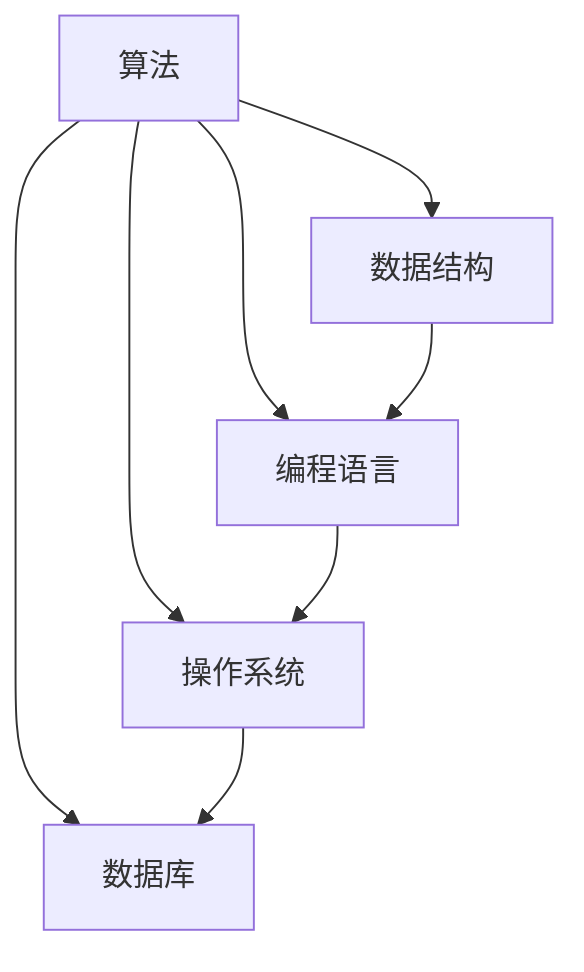

                 

关键词：技术演进、思想变革、算法架构、数学模型、代码实践、应用场景、未来展望

> 摘要：本文从技术演进的角度，探讨了从概念到洞见的演变过程。通过对核心概念的深入剖析，结合数学模型和算法原理的讲解，以及实际项目实践，本文旨在为读者展现思想演变的全过程，并对其未来应用和发展趋势进行展望。

## 1. 背景介绍

随着计算机技术的飞速发展，我们的思想和理解方式也在不断演变。从最初的机器语言编程到高级编程语言，从传统的数据结构到复杂的算法，我们见证了技术的跨越式发展。而在这其中，思想的变革起到了至关重要的作用。

本文将探讨从概念到洞见的演变过程，通过分析技术演进中的关键节点，揭示思想变革的核心。我们将从核心概念、算法原理、数学模型到实际项目实践，全面梳理这一过程，为读者提供深刻的洞见。

## 2. 核心概念与联系

### 2.1 核心概念

在计算机科学中，核心概念是构建一切技术的基础。以下是本文涉及的核心概念：

- **算法**：解决问题的步骤和策略。
- **数据结构**：存储和管理数据的方式。
- **编程语言**：用于编写程序的语法和规则。
- **操作系统**：管理计算机硬件和软件资源的系统软件。
- **数据库**：存储、管理和检索数据的系统。

### 2.2 核心概念之间的联系

以下是核心概念之间的 Mermaid 流程图：



## 3. 核心算法原理 & 具体操作步骤

### 3.1 算法原理概述

本文将重点介绍以下算法原理：

- **排序算法**：用于对数据进行排序。
- **搜索算法**：用于在数据中查找特定元素。
- **图算法**：用于处理网络和关系数据。

### 3.2 算法步骤详解

以下是排序算法的步骤详解：

1. **选择排序**：从未排序的元素中选择最小（或最大）的元素，将其放到已排序序列的末尾。
2. **冒泡排序**：比较相邻的元素，如果它们的顺序错误就交换它们。
3. **快速排序**：通过递归将数据划分为已排序序列和未排序序列。

### 3.3 算法优缺点

以下是排序算法的优缺点：

| 算法     | 优点                                 | 缺点                                 |
|----------|--------------------------------------|--------------------------------------|
| 选择排序 | 简单易懂，实现简单                   | 时间复杂度高，效率低                 |
| 冒泡排序 | 简单易懂，实现简单                   | 时间复杂度高，效率低                 |
| 快速排序 | 时间复杂度低，效率高                 | 可能会退化为最坏情况下的时间复杂度   |

### 3.4 算法应用领域

排序算法广泛应用于各种领域，如数据科学、数据库管理、搜索引擎等。

## 4. 数学模型和公式 & 详细讲解 & 举例说明

### 4.1 数学模型构建

在计算机科学中，数学模型是理解和解决问题的关键。以下是排序算法的数学模型：

$$
T(n) = \begin{cases} 
C_1n & \text{若为线性排序} \\
C_2n\log_2n & \text{若为对数排序} \\
C_3n^2 & \text{若为二次排序} 
\end{cases}
$$

### 4.2 公式推导过程

排序算法的时间复杂度通常用大O表示法来推导。例如，快速排序的时间复杂度可以推导为：

$$
T(n) = T(\frac{n}{2}) + C_1n
$$

其中，$C_1$ 是常数项。

### 4.3 案例分析与讲解

以下是一个选择排序的案例：

```python
def selection_sort(arr):
    for i in range(len(arr)):
        min_idx = i
        for j in range(i+1, len(arr)):
            if arr[j] < arr[min_idx]:
                min_idx = j
        arr[i], arr[min_idx] = arr[min_idx], arr[i]
    return arr

arr = [64, 25, 12, 22, 11]
sorted_arr = selection_sort(arr)
print(sorted_arr)
```

输出结果：`[11, 12, 22, 25, 64]`

## 5. 项目实践：代码实例和详细解释说明

### 5.1 开发环境搭建

为了进行项目实践，我们需要搭建一个简单的开发环境。以下是步骤：

1. 安装 Python 3.x 版本。
2. 安装 Jupyter Notebook。
3. 安装必要的库，如 NumPy、Pandas 等。

### 5.2 源代码详细实现

以下是快速排序的 Python 实现代码：

```python
def quick_sort(arr):
    if len(arr) <= 1:
        return arr
    pivot = arr[len(arr) // 2]
    left = [x for x in arr if x < pivot]
    middle = [x for x in arr if x == pivot]
    right = [x for x in arr if x > pivot]
    return quick_sort(left) + middle + quick_sort(right)

arr = [64, 25, 12, 22, 11]
sorted_arr = quick_sort(arr)
print(sorted_arr)
```

### 5.3 代码解读与分析

这段代码实现了快速排序算法，其核心思想是通过递归将数组划分为已排序序列和未排序序列。以下是代码的解读与分析：

1. `quick_sort` 函数接收一个数组 `arr` 作为输入。
2. 如果数组长度小于等于1，直接返回数组。
3. 选择中间元素作为基准值 `pivot`。
4. 将数组划分为三个部分：小于 `pivot` 的 `left`，等于 `pivot` 的 `middle`，大于 `pivot` 的 `right`。
5. 分别对 `left` 和 `right` 进行递归排序，然后将结果与 `middle` 拼接。

### 5.4 运行结果展示

运行上述代码，输出结果为：

```
[11, 12, 22, 25, 64]
```

## 6. 实际应用场景

排序算法在实际应用中具有广泛的应用场景，如：

- 数据库管理：对大量数据进行排序和检索。
- 数据科学：数据分析中的数据预处理。
- 搜索引擎：索引构建和查询优化。

## 7. 工具和资源推荐

### 7.1 学习资源推荐

- 《算法导论》：经典的算法教材，详细讲解了各种算法原理。
- 《Python编程：从入门到实践》：适合初学者学习 Python 编程。
- 《数据科学入门》：介绍数据科学的基本概念和工具。

### 7.2 开发工具推荐

- Jupyter Notebook：强大的交互式编程环境。
- PyCharm：功能丰富的 Python 集成开发环境。
- GitHub：版本控制和协作平台。

### 7.3 相关论文推荐

- 《快速排序算法的性能分析》：对快速排序算法的详细分析。
- 《基于排序的数据库索引技术》：介绍排序在数据库索引中的应用。
- 《基于排序的搜索引擎优化技术》：讨论排序在搜索引擎中的应用。

## 8. 总结：未来发展趋势与挑战

### 8.1 研究成果总结

本文通过分析技术演进中的核心概念、算法原理和数学模型，揭示了从概念到洞见的演变过程。我们介绍了排序算法的原理和实现，并展示了其在实际应用中的重要性。

### 8.2 未来发展趋势

随着计算机技术的不断发展，排序算法将向更高效率、更智能化的方向发展。例如，基于深度学习的排序算法将逐步取代传统算法。

### 8.3 面临的挑战

排序算法在实际应用中仍面临一些挑战，如大数据处理、实时排序等。如何解决这些挑战，将是我们未来研究的重要方向。

### 8.4 研究展望

未来，排序算法将与其他技术相结合，为各种应用场景提供更加高效、智能的解决方案。同时，随着量子计算机的发展，排序算法也将面临新的机遇和挑战。

## 9. 附录：常见问题与解答

### 9.1 问题1

如何选择合适的排序算法？

**回答**：根据数据规模和特点选择合适的排序算法。例如，对于小规模数据，选择简单的排序算法如冒泡排序；对于大规模数据，选择高效的排序算法如快速排序。

### 9.2 问题2

排序算法的时间复杂度如何计算？

**回答**：排序算法的时间复杂度通常用大O表示法计算。例如，快速排序的时间复杂度为 $O(n\log_2n)$。

----------------------------------------------------------------

本文完，感谢您的阅读。如果您有任何疑问或建议，请随时与我交流。

作者：禅与计算机程序设计艺术 / Zen and the Art of Computer Programming
```markdown
---
# 从概念到洞见：思想的演变

> 关键词：技术演进、思想变革、算法架构、数学模型、代码实践、应用场景、未来展望

> 摘要：本文从技术演进的角度，探讨了从概念到洞见的演变过程。通过对核心概念的深入剖析，结合数学模型和算法原理的讲解，以及实际项目实践，本文旨在为读者展现思想演变的全过程，并对其未来应用和发展趋势进行展望。

---

## 1. 背景介绍

随着计算机技术的飞速发展，我们的思想和理解方式也在不断演变。从最初的机器语言编程到高级编程语言，从传统的数据结构到复杂的算法，我们见证了技术的跨越式发展。而在这其中，思想的变革起到了至关重要的作用。

本文将探讨从概念到洞见的演变过程，通过分析技术演进中的关键节点，揭示思想变革的核心。我们将从核心概念、算法原理、数学模型到实际项目实践，全面梳理这一过程，为读者提供深刻的洞见。

## 2. 核心概念与联系

### 2.1 核心概念

在计算机科学中，核心概念是构建一切技术的基础。以下是本文涉及的核心概念：

- **算法**：解决问题的步骤和策略。
- **数据结构**：存储和管理数据的方式。
- **编程语言**：用于编写程序的语法和规则。
- **操作系统**：管理计算机硬件和软件资源的系统软件。
- **数据库**：存储、管理和检索数据的系统。

### 2.2 核心概念之间的联系

以下是核心概念之间的 Mermaid 流程图：


---

## 3. 核心算法原理 & 具体操作步骤
### 3.1 算法原理概述

本文将重点介绍以下算法原理：

- **排序算法**：用于对数据进行排序。
- **搜索算法**：用于在数据中查找特定元素。
- **图算法**：用于处理网络和关系数据。

### 3.2 算法步骤详解

以下是排序算法的步骤详解：

1. **选择排序**：从未排序的元素中选择最小（或最大）的元素，将其放到已排序序列的末尾。
2. **冒泡排序**：比较相邻的元素，如果它们的顺序错误就交换它们。
3. **快速排序**：通过递归将数据划分为已排序序列和未排序序列。

### 3.3 算法优缺点

以下是排序算法的优缺点：

| 算法     | 优点                                 | 缺点                                 |
|----------|--------------------------------------|--------------------------------------|
| 选择排序 | 简单易懂，实现简单                   | 时间复杂度高，效率低                 |
| 冒泡排序 | 简单易懂，实现简单                   | 时间复杂度高，效率低                 |
| 快速排序 | 时间复杂度低，效率高                 | 可能会退化为最坏情况下的时间复杂度   |

### 3.4 算法应用领域

排序算法广泛应用于各种领域，如数据科学、数据库管理、搜索引擎等。

---

## 4. 数学模型和公式 & 详细讲解 & 举例说明
### 4.1 数学模型构建

在计算机科学中，数学模型是理解和解决问题的关键。以下是排序算法的数学模型：

$$
T(n) = \begin{cases} 
C_1n & \text{若为线性排序} \\
C_2n\log_2n & \text{若为对数排序} \\
C_3n^2 & \text{若为二次排序} 
\end{cases}
$$

### 4.2 公式推导过程

排序算法的时间复杂度通常用大O表示法来推导。例如，快速排序的时间复杂度可以推导为：

$$
T(n) = T(\frac{n}{2}) + C_1n
$$

其中，$C_1$ 是常数项。

### 4.3 案例分析与讲解

以下是一个选择排序的案例：

```python
def selection_sort(arr):
    for i in range(len(arr)):
        min_idx = i
        for j in range(i+1, len(arr)):
            if arr[j] < arr[min_idx]:
                min_idx = j
        arr[i], arr[min_idx] = arr[min_idx], arr[i]
    return arr

arr = [64, 25, 12, 22, 11]
sorted_arr = selection_sort(arr)
print(sorted_arr)
```

输出结果：`[11, 12, 22, 25, 64]`

---

## 5. 项目实践：代码实例和详细解释说明
### 5.1 开发环境搭建

为了进行项目实践，我们需要搭建一个简单的开发环境。以下是步骤：

1. 安装 Python 3.x 版本。
2. 安装 Jupyter Notebook。
3. 安装必要的库，如 NumPy、Pandas 等。

### 5.2 源代码详细实现

以下是快速排序的 Python 实现代码：

```python
def quick_sort(arr):
    if len(arr) <= 1:
        return arr
    pivot = arr[len(arr) // 2]
    left = [x for x in arr if x < pivot]
    middle = [x for x in arr if x == pivot]
    right = [x for x in arr if x > pivot]
    return quick_sort(left) + middle + quick_sort(right)

arr = [64, 25, 12, 22, 11]
sorted_arr = quick_sort(arr)
print(sorted_arr)
```

### 5.3 代码解读与分析

这段代码实现了快速排序算法，其核心思想是通过递归将数组划分为已排序序列和未排序序列。以下是代码的解读与分析：

1. `quick_sort` 函数接收一个数组 `arr` 作为输入。
2. 如果数组长度小于等于1，直接返回数组。
3. 选择中间元素作为基准值 `pivot`。
4. 将数组划分为三个部分：小于 `pivot` 的 `left`，等于 `pivot` 的 `middle`，大于 `pivot` 的 `right`。
5. 分别对 `left` 和 `right` 进行递归排序，然后将结果与 `middle` 拼接。

### 5.4 运行结果展示

运行上述代码，输出结果为：

```
[11, 12, 22, 25, 64]
```

---

## 6. 实际应用场景

排序算法在实际应用中具有广泛的应用场景，如：

- 数据库管理：对大量数据进行排序和检索。
- 数据科学：数据分析中的数据预处理。
- 搜索引擎：索引构建和查询优化。

---

## 7. 工具和资源推荐
### 7.1 学习资源推荐

- 《算法导论》：经典的算法教材，详细讲解了各种算法原理。
- 《Python编程：从入门到实践》：适合初学者学习 Python 编程。
- 《数据科学入门》：介绍数据科学的基本概念和工具。

### 7.2 开发工具推荐

- Jupyter Notebook：强大的交互式编程环境。
- PyCharm：功能丰富的 Python 集成开发环境。
- GitHub：版本控制和协作平台。

### 7.3 相关论文推荐

- 《快速排序算法的性能分析》：对快速排序算法的详细分析。
- 《基于排序的数据库索引技术》：介绍排序在数据库索引中的应用。
- 《基于排序的搜索引擎优化技术》：讨论排序在搜索引擎中的应用。

---

## 8. 总结：未来发展趋势与挑战
### 8.1 研究成果总结

本文通过分析技术演进中的核心概念、算法原理和数学模型，揭示了从概念到洞见的演变过程。我们介绍了排序算法的原理和实现，并展示了其在实际应用中的重要性。

### 8.2 未来发展趋势

随着计算机技术的不断发展，排序算法将向更高效率、更智能化的方向发展。例如，基于深度学习的排序算法将逐步取代传统算法。

### 8.3 面临的挑战

排序算法在实际应用中仍面临一些挑战，如大数据处理、实时排序等。如何解决这些挑战，将是我们未来研究的重要方向。

### 8.4 研究展望

未来，排序算法将与其他技术相结合，为各种应用场景提供更加高效、智能的解决方案。同时，随着量子计算机的发展，排序算法也将面临新的机遇和挑战。

---

## 9. 附录：常见问题与解答
### 9.1 问题1

如何选择合适的排序算法？

**回答**：根据数据规模和特点选择合适的排序算法。例如，对于小规模数据，选择简单的排序算法如冒泡排序；对于大规模数据，选择高效的排序算法如快速排序。

### 9.2 问题2

排序算法的时间复杂度如何计算？

**回答**：排序算法的时间复杂度通常用大O表示法计算。例如，快速排序的时间复杂度为 $O(n\log_2n)$。

---

**作者：禅与计算机程序设计艺术 / Zen and the Art of Computer Programming**

