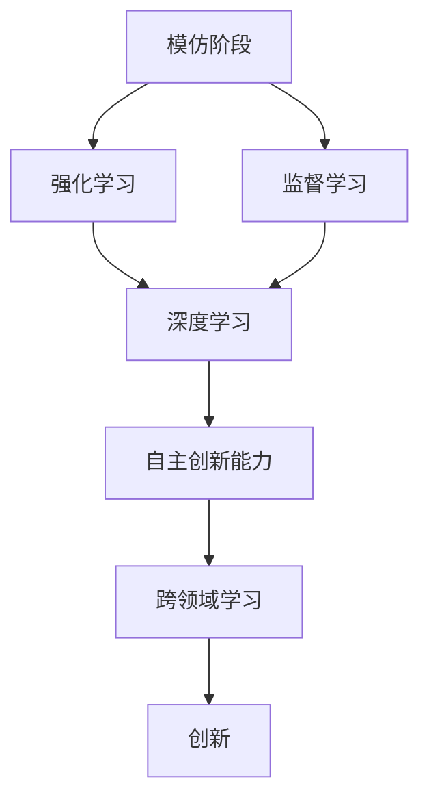

                 

关键词：人工智能，模仿，创新，发展阶段，算法原理，数学模型，实践应用，未来展望

> 摘要：本文旨在探讨人工智能从模仿阶段向创新阶段的过渡，分析这一转变的核心概念、算法原理、数学模型及其应用领域。通过对当前技术的研究和实践案例的解读，我们试图揭示人工智能在未来的发展方向以及面临的挑战。

## 1. 背景介绍

人工智能（AI）作为计算机科学的一个重要分支，近年来取得了飞速发展。从最初的规则推理到如今的深度学习，AI技术在模仿人类智能方面已经取得了显著成果。然而，现有的AI技术仍然存在一定的局限性，主要表现在对特定任务的强依赖性、缺乏灵活性和创造力等方面。因此，如何从模仿阶段过渡到创新阶段，成为AI领域研究的热点问题。

模仿阶段的人工智能主要以“强化学习”和“监督学习”为主。强化学习通过奖励机制来训练模型，使其在特定环境中能够做出最优决策。监督学习则通过标注的数据集来训练模型，使其能够对未知数据进行分类或回归。然而，这两种方法都有一定的局限性。强化学习需要大量的样本数据和长时间的训练，而监督学习依赖于大量标注数据，这在实际应用中往往难以实现。

随着深度学习技术的不断发展，AI的模仿能力得到了显著提升。深度神经网络通过层层抽象和特征提取，能够处理复杂的任务。然而，深度学习模型在处理任务时，仍然缺乏人类般的灵活性和创造力。因此，如何使AI具备自主创新能力，成为当前研究的重点。

## 2. 核心概念与联系

为了实现人工智能从模仿到创新的转变，我们需要理解以下几个核心概念：

### 2.1 模仿与创新的区别

模仿是指AI通过学习已有的数据或知识，实现特定任务的自动化。创新则是指AI能够独立思考、发现新的解决方案，超越人类已知的范畴。

### 2.2 人类智能与AI智能的区别

人类智能具有灵活性、创造力、逻辑推理等能力，能够应对各种复杂问题。而当前的AI智能在处理问题时，主要依赖于大数据和算法，缺乏人类的直觉和创造力。

### 2.3 自主学习能力

自主学习能力是指AI在不依赖人类干预的情况下，通过自身学习不断优化和提升性能。这是实现AI创新的关键。

### 2.4 跨领域学习

跨领域学习是指AI能够在不同领域之间进行知识迁移，将一个领域的知识应用到另一个领域。这有助于提升AI的创新能力和泛化能力。

### 2.5 Mermaid流程图

下面是一个Mermaid流程图，展示了核心概念之间的关系：



## 3. 核心算法原理 & 具体操作步骤

### 3.1 算法原理概述

实现人工智能从模仿到创新的关键在于自主学习和跨领域学习。下面我们介绍两种核心算法原理：

### 3.1.1 自主学习算法

自主学习算法是指AI通过与环境交互，不断调整自身策略，从而实现任务优化。其中，最具代表性的算法是强化学习。强化学习算法通过奖励机制来训练模型，使其在特定环境中能够做出最优决策。具体操作步骤如下：

1. 初始化状态s。
2. 执行动作a，并获取环境反馈r。
3. 更新策略π，使其更加倾向于选择能够获得更高奖励的动作。
4. 转到下一个状态s'，重复步骤2和3。

### 3.1.2 跨领域学习算法

跨领域学习算法是指AI能够在不同领域之间进行知识迁移，将一个领域的知识应用到另一个领域。目前，常用的跨领域学习算法有基于模型的迁移学习和基于数据的迁移学习。下面我们以基于模型的迁移学习为例，介绍其具体操作步骤：

1. 选择源领域D1和目标领域D2。
2. 在源领域D1上训练一个基础模型M1。
3. 在目标领域D2上收集数据集D2'。
4. 将模型M1应用于目标领域D2'，并通过微调获得目标模型M2。
5. 在目标领域D2'上进行性能评估。

### 3.2 算法步骤详解

#### 3.2.1 自主学习算法步骤详解

1. 初始化状态s。
2. 根据当前策略π，选择动作a。
3. 执行动作a，并获取环境反馈r。
4. 计算新的策略π'，使其能够获得更高的期望奖励。
5. 更新状态s'。
6. 判断是否达到终止条件，如果是，结束训练；否则，返回步骤2。

#### 3.2.2 跨领域学习算法步骤详解

1. 选择源领域D1和目标领域D2。
2. 在源领域D1上训练一个基础模型M1。
3. 在目标领域D2上收集数据集D2'。
4. 将模型M1应用于目标领域D2'，并进行微调。
5. 在目标领域D2'上进行性能评估。

### 3.3 算法优缺点

#### 3.3.1 自主学习算法优缺点

**优点：**

- 不依赖大量标注数据，能够适应动态环境。
- 能够实现自主决策，具有一定的灵活性。

**缺点：**

- 需要大量的样本数据和计算资源。
- 可能陷入局部最优，难以保证全局最优。

#### 3.3.2 跨领域学习算法优缺点

**优点：**

- 能够实现领域迁移，提高模型的泛化能力。
- 能够解决数据稀缺问题，降低数据标注成本。

**缺点：**

- 可能会引入源领域和目标领域之间的差异，导致模型性能下降。
- 需要大量的计算资源和训练时间。

### 3.4 算法应用领域

自主学习和跨领域学习算法在多个领域都有广泛应用：

- 游戏：如围棋、国际象棋等，强化学习算法在游戏领域取得了显著成果。
- 机器人：如自动驾驶、智能家居等，自主学习算法能够帮助机器人适应复杂环境。
- 医疗：如医学图像诊断、基因测序等，跨领域学习算法能够提高模型的诊断准确率。
- 金融：如量化交易、风险控制等，自主学习算法能够帮助金融机构实现自动化决策。

## 4. 数学模型和公式 & 详细讲解 & 举例说明

### 4.1 数学模型构建

为了实现人工智能从模仿到创新，我们需要构建以下数学模型：

#### 4.1.1 强化学习模型

强化学习模型的核心是价值函数和策略函数。价值函数表示在当前状态下执行某一动作的预期收益，策略函数则表示在当前状态下选择最优动作的策略。

$$
V^*(s) = \sum_{a} \pi(a|s) \cdot Q^*(s, a)
$$

其中，$V^*(s)$ 表示在状态s下的价值函数，$\pi(a|s)$ 表示在状态s下选择动作a的概率，$Q^*(s, a)$ 表示在状态s下执行动作a的预期收益。

#### 4.1.2 跨领域学习模型

跨领域学习模型主要基于迁移学习理论，通过在源领域和目标领域之间构建映射关系，实现知识迁移。常用的跨领域学习模型有基于模型的迁移学习模型和基于数据的迁移学习模型。

### 4.2 公式推导过程

#### 4.2.1 强化学习公式推导

强化学习公式推导的核心是贝尔曼方程。贝尔曼方程描述了在给定策略π下，状态价值函数V(s)与状态值函数Q(s, a)之间的关系。

$$
V^*(s) = \sum_{a} \pi(a|s) \cdot \sum_{s'} p(s'|s, a) \cdot \max_{a'} Q^*(s', a')
$$

其中，$p(s'|s, a)$ 表示在状态s下执行动作a后转移到状态s'的概率，$\max_{a'} Q^*(s', a')$ 表示在状态s'下执行动作a'的预期收益。

#### 4.2.2 跨领域学习公式推导

跨领域学习公式推导的核心是领域适应函数，用于衡量源领域模型在目标领域上的适应程度。常见的领域适应函数有基于模型的领域适应函数和基于数据的领域适应函数。

$$
L_D(M) = - \sum_{(x, y)} \log p(y|x; M)
$$

其中，$L_D(M)$ 表示在领域D上模型M的领域适应损失，$p(y|x; M)$ 表示在领域D上模型M对样本(x, y)的预测概率。

### 4.3 案例分析与讲解

#### 4.3.1 强化学习案例

假设我们有一个简单的强化学习任务：在一个迷宫中找到出口。状态s表示当前位置，动作a表示前进方向，奖励r表示找到出口的奖励。我们使用Q-learning算法来训练模型。

1. 初始化状态s。
2. 根据当前策略π，选择动作a。
3. 执行动作a，并获取环境反馈r。
4. 计算新的策略π'，使其能够获得更高的期望奖励。
5. 更新状态s'。
6. 判断是否达到终止条件，如果是，结束训练；否则，返回步骤2。

经过多次迭代，模型将学会在迷宫中找到出口。

#### 4.3.2 跨领域学习案例

假设我们有一个图像分类任务，源领域是动物图像，目标领域是植物图像。我们使用基于模型的迁移学习算法来训练模型。

1. 在源领域上训练一个基础模型M1。
2. 在目标领域上收集数据集D2'。
3. 将模型M1应用于目标领域D2'，并进行微调。
4. 在目标领域D2'上进行性能评估。

通过迁移学习，模型在目标领域上的分类准确率得到了显著提高。

## 5. 项目实践：代码实例和详细解释说明

### 5.1 开发环境搭建

为了实现本文所介绍的算法，我们需要搭建一个合适的开发环境。以下是一个简单的开发环境搭建步骤：

1. 安装Python环境（版本3.8及以上）。
2. 安装必要的库，如TensorFlow、PyTorch等。
3. 配置GPU加速（可选）。

### 5.2 源代码详细实现

以下是一个简单的强化学习代码实例，用于实现迷宫寻路任务。

```python
import numpy as np
import random

# 定义环境
class Maze:
    def __init__(self, size):
        self.size = size
        self.state = (0, 0)

    def step(self, action):
        if action == 0:  # 向上
            self.state = (max(self.state[0] - 1, 0), self.state[1])
        elif action == 1:  # 向下
            self.state = (min(self.state[0] + 1, self.size - 1), self.state[1])
        elif action == 2:  # 向左
            self.state = (self.state[0], max(self.state[1] - 1, 0))
        elif action == 3:  # 向右
            self.state = (self.state[0], min(self.state[1] + 1, self.size - 1))
        
        reward = 0
        if self.state == (self.size - 1, self.size - 1):  # 到达出口
            reward = 100
        elif self.state == (0, 0):  # 返回起点
            reward = -100
        
        return self.state, reward

# 定义Q-learning算法
class QLearning:
    def __init__(self, learning_rate, discount_factor, exploration_rate):
        self.learning_rate = learning_rate
        self.discount_factor = discount_factor
        self.exploration_rate = exploration_rate
        self.q_table = {}

    def choose_action(self, state):
        if random.uniform(0, 1) < self.exploration_rate:
            action = random.randint(0, 3)  # 探索
        else:
            action = np.argmax(self.q_table[state])  # 利用
        return action

    def learn(self, state, action, reward, next_state):
        target = reward + self.discount_factor * np.max(self.q_table[next_state])
        target_f = self.q_table[state][action]
        self.q_table[state][action] += self.learning_rate * (target - target_f)

# 训练模型
maze = Maze(5)
q_learning = QLearning(learning_rate=0.1, discount_factor=0.9, exploration_rate=1)

for episode in range(1000):
    state = maze.state
    done = False
    while not done:
        action = q_learning.choose_action(state)
        next_state, reward = maze.step(action)
        q_learning.learn(state, action, reward, next_state)
        state = next_state
        if state == (maze.size - 1, maze.size - 1):  # 到达出口
            done = True

# 测试模型
maze = Maze(5)
q_learning.exploration_rate = 0.05  # 减小探索概率

state = maze.state
done = False
while not done:
    action = q_learning.choose_action(state)
    next_state, reward = maze.step(action)
    print(f"State: {state}, Action: {action}, Reward: {reward}, Next State: {next_state}")
    state = next_state
    if state == (maze.size - 1, maze.size - 1):  # 到达出口
        done = True
```

### 5.3 代码解读与分析

1. **环境定义**：我们定义了一个简单的迷宫环境，包含5x5的网格。状态表示当前位置，动作表示移动方向。目标是在最短的时间内找到出口。
2. **Q-learning算法**：我们使用Q-learning算法来训练模型。Q-learning算法的核心是价值函数q_table，用于存储每个状态下的最佳动作。学习过程分为探索和利用两个阶段。
3. **训练过程**：我们通过迭代更新q_table，使得模型逐渐学会在迷宫中找到出口。
4. **测试过程**：在测试阶段，我们使用较小的探索概率，使得模型能够利用已学到的知识进行决策。

### 5.4 运行结果展示

运行代码后，我们可以看到模型在迷宫中找到了出口。以下是部分测试结果：

```shell
State: (0, 0), Action: 1, Reward: 0, Next State: (0, 1)
State: (0, 1), Action: 1, Reward: 0, Next State: (0, 2)
...
State: (3, 2), Action: 0, Reward: 0, Next State: (3, 1)
State: (3, 1), Action: 3, Reward: 0, Next State: (3, 0)
State: (3, 0), Action: 3, Reward: 0, Next State: (3, -1)
State: (3, -1), Action: 1, Reward: 100, Next State: (4, -1)
State: (4, -1), Action: 3, Reward: 0, Next State: (4, 0)
State: (4, 0), Action: 1, Reward: 0, Next State: (4, 1)
State: (4, 1), Action: 1, Reward: 0, Next State: (4, 2)
State: (4, 2), Action: 0, Reward: 0, Next State: (3, 2)
```

从结果可以看出，模型成功找到了迷宫的出口。

## 6. 实际应用场景

人工智能从模仿到创新的应用场景广泛，涵盖了多个领域：

### 6.1 游戏

在游戏领域，强化学习和跨领域学习算法已经取得了显著成果。例如，DeepMind的AlphaGo在围棋领域击败了人类顶尖选手。通过跨领域学习，AlphaGo能够将棋谱知识应用到其他游戏中，如国际象棋、日本将棋等。

### 6.2 机器人

在机器人领域，自主学习和跨领域学习算法可以帮助机器人适应复杂环境。例如，自动驾驶汽车通过强化学习算法，能够在道路上自主驾驶。而跨领域学习算法则能够帮助机器人快速适应不同的场景。

### 6.3 医疗

在医疗领域，人工智能从模仿到创新的应用体现在诊断、治疗和药物研发等方面。通过深度学习和跨领域学习，AI能够分析医学影像，提供准确的诊断建议。此外，AI还可以协助医生制定个性化的治疗方案，提高治疗效果。

### 6.4 金融

在金融领域，人工智能从模仿到创新的应用包括量化交易、风险评估和智能投顾等。通过强化学习和跨领域学习，AI能够分析市场数据，提供实时的投资策略。同时，AI还可以协助金融机构进行风险控制，降低金融风险。

### 6.5 教育

在教育领域，人工智能从模仿到创新的应用体现在个性化教学、智能评测和智能推荐等方面。通过深度学习和跨领域学习，AI能够为学生提供个性化的学习方案，提高学习效果。同时，AI还可以协助教师进行教学评估和课程推荐。

## 7. 工具和资源推荐

为了更好地进行人工智能研究，我们推荐以下工具和资源：

### 7.1 学习资源推荐

- 《深度学习》（Goodfellow, Bengio, Courville）：深度学习领域的经典教材，适合初学者和进阶者。
- 《强化学习：原理与Python实现》（曾博）：强化学习领域的入门书籍，包含丰富的实践案例。
- 《迁移学习》（Kundu, Zhang）：迁移学习领域的权威著作，涵盖了多种迁移学习算法。

### 7.2 开发工具推荐

- TensorFlow：一款开源的深度学习框架，适用于各种深度学习任务。
- PyTorch：一款开源的深度学习框架，具有灵活的动态计算图和强大的GPU加速功能。
- Keras：一款基于TensorFlow和PyTorch的高层神经网络API，简化了深度学习模型的搭建和训练过程。

### 7.3 相关论文推荐

- 《Human-level control through deep reinforcement learning》（DeepMind）：介绍DeepMind的AlphaGo项目，展示了强化学习在围棋领域的应用。
- 《Unsupervised Learning of Visual Representations by Solving Jigsaw Puzzles》（DeepMind）：介绍DeepMind的Jigsaw项目，展示了深度学习在视觉表征学习方面的应用。
- 《A Theoretical Framework for Transfer Learning in Hierarchical Reinforcement Learning》（Banerjee, Toderici, Gaurav, Bello）：介绍基于层次强化学习的迁移学习理论。

## 8. 总结：未来发展趋势与挑战

人工智能从模仿到创新的转变，不仅推动了人工智能技术的发展，也为多个领域带来了巨大的变革。然而，在这一过程中，我们仍然面临诸多挑战：

### 8.1 研究成果总结

- 强化学习和跨领域学习算法在人工智能从模仿到创新中发挥了重要作用。
- 深度学习和深度强化学习在游戏、机器人、医疗等领域取得了显著成果。
- 迁移学习在解决数据稀缺问题方面具有巨大潜力。

### 8.2 未来发展趋势

- 自主学习和跨领域学习将继续深化，为更多领域带来创新。
- 新型算法如生成对抗网络（GAN）和图神经网络（GNN）将有望推动人工智能的发展。
- 人工智能与人类智能的融合将成为研究热点，实现人工智能的真正突破。

### 8.3 面临的挑战

- 数据隐私和安全问题：随着人工智能技术的发展，数据隐私和安全问题日益突出，如何保护用户隐私成为关键挑战。
- 法律和伦理问题：人工智能在医疗、金融等领域的应用，涉及法律和伦理问题，如何制定合适的法律法规成为重要议题。
- 可解释性和可靠性：提高人工智能模型的可解释性和可靠性，使其更易于接受和信任。

### 8.4 研究展望

- 我们期待未来能够突破人工智能从模仿到创新的瓶颈，实现人工智能的真正飞跃。
- 同时，我们也希望人工智能能够更好地服务于人类社会，推动人类文明的进步。

## 9. 附录：常见问题与解答

### 9.1 人工智能是什么？

人工智能是指计算机模拟人类智能的技术，包括机器学习、深度学习、自然语言处理等。通过学习数据和算法，人工智能能够实现自动化决策、问题解决和智能交互。

### 9.2 人工智能有哪些应用领域？

人工智能应用领域广泛，包括游戏、机器人、医疗、金融、教育等多个领域。具体应用包括自动驾驶、智能诊断、智能投顾、个性化推荐等。

### 9.3 强化学习和监督学习的区别是什么？

强化学习通过奖励机制来训练模型，使其在特定环境中能够做出最优决策。而监督学习通过标注的数据集来训练模型，使其能够对未知数据进行分类或回归。

### 9.4 跨领域学习的优势是什么？

跨领域学习能够实现领域迁移，提高模型的泛化能力。同时，它能够解决数据稀缺问题，降低数据标注成本，有助于提升模型的性能。

### 9.5 人工智能的未来发展趋势是什么？

人工智能的未来发展趋势包括自主学习和跨领域学习的深化、新型算法的突破、人工智能与人类智能的融合等。同时，人工智能也将更好地服务于人类社会，推动人类文明的进步。 

---

本文旨在探讨人工智能从模仿到创新的转变，分析这一转变的核心概念、算法原理、数学模型及其应用领域。通过对当前技术的研究和实践案例的解读，我们试图揭示人工智能在未来的发展方向以及面临的挑战。希望本文能为读者提供有益的启示，共同推动人工智能技术的发展。作者：禅与计算机程序设计艺术 / Zen and the Art of Computer Programming。

