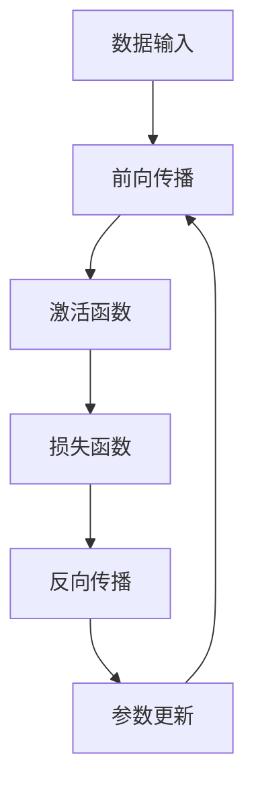
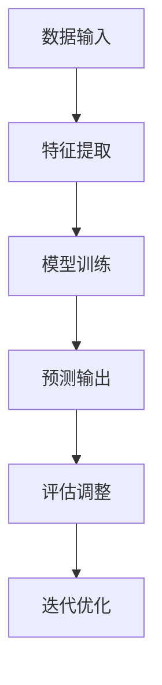
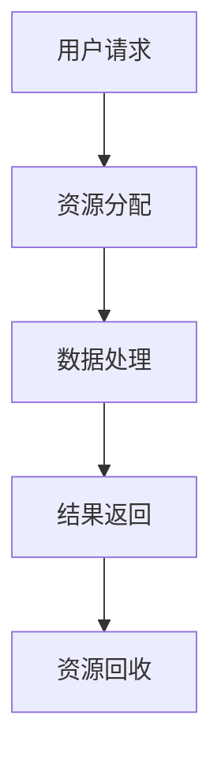

                 

在技术领域，认知的转变是一个不断发生的过程。从浅薄到深刻的认知转变，意味着从表面现象的观察和分析，逐渐深入到本质原理的理解和应用。本文将探讨这一认知转变的历程，特别是在IT领域的体现，并介绍如何通过逻辑清晰、结构紧凑、简单易懂的专业的技术语言来传达这一深刻理解。

## 文章关键词

- 认知转变
- 技术语言
- 深度理解
- IT领域
- 逻辑结构

## 文章摘要

本文首先介绍了从浅薄到深刻的认知转变的概念和重要性。随后，通过IT领域的具体案例，阐述了这一转变的路径和方式。文章还探讨了如何通过专业的技术语言来构建逻辑清晰、结构紧凑的内容，从而实现有效的知识传递和共享。

## 1. 背景介绍

在当今信息爆炸的时代，人们面临着海量的信息。然而，仅仅掌握表面的知识是不够的。真正的价值在于对知识的深入理解和灵活应用。在IT领域，从浅薄到深刻的认知转变尤为重要。这是因为IT技术的发展速度极快，新的概念、技术和工具层出不穷。只有不断深化对技术的理解，才能跟上时代的步伐，真正发挥技术的潜力。

### 1.1 浅薄认知的局限性

浅薄认知通常指的是对事物表面现象的理解。在IT领域，这可能导致以下问题：

- **盲目跟风**：没有深入理解技术原理，仅仅因为某个技术潮流流行而盲目跟随。
- **缺乏创新**：停留在表面应用，无法挖掘技术的深层潜力。
- **难以解决问题**：遇到复杂问题时，缺乏系统性的解决思路。

### 1.2 深刻认知的重要性

深刻认知则是对事物本质原理的把握。在IT领域，这具有以下价值：

- **创新思维**：能够从本质上理解和运用技术，激发创新思维。
- **系统解决问题**：能够运用系统化的思维，解决复杂的技术问题。
- **适应变化**：能够灵活应对技术发展和市场变化。

## 2. 核心概念与联系

### 2.1 深度学习

深度学习是当前IT领域最为热门的技术之一。它通过模拟人脑神经网络，实现自动化特征提取和模式识别。深度学习的核心概念包括神经网络、反向传播算法、激活函数等。以下是一个简单的Mermaid流程图，展示深度学习的基本架构：



### 2.2 人工智能

人工智能（AI）是计算机科学的一个分支，旨在使机器具备人类智能。人工智能的核心概念包括机器学习、自然语言处理、计算机视觉等。以下是一个简单的Mermaid流程图，展示人工智能的基本框架：



### 2.3 云计算

云计算是一种通过互联网提供可扩展的计算资源的服务模式。它的核心概念包括虚拟化技术、分布式计算、弹性扩展等。以下是一个简单的Mermaid流程图，展示云计算的基本架构：



## 3. 核心算法原理 & 具体操作步骤

### 3.1 算法原理概述

深度学习算法的核心原理是神经网络。神经网络由多层节点（或称为神经元）组成，包括输入层、隐藏层和输出层。数据从输入层进入，经过隐藏层的处理，最后由输出层得到预测结果。训练过程中，通过反向传播算法不断调整网络参数，以最小化预测误差。

### 3.2 算法步骤详解

深度学习算法的具体步骤如下：

1. **数据预处理**：对输入数据进行标准化处理，以消除不同特征之间的量纲差异。
2. **网络结构设计**：设计输入层、隐藏层和输出层的结构，选择合适的激活函数和损失函数。
3. **初始化参数**：随机初始化网络参数，通常使用较小的随机值。
4. **前向传播**：将输入数据通过网络，逐层计算输出。
5. **计算损失**：使用损失函数计算预测结果与真实值之间的差异。
6. **反向传播**：根据损失函数的梯度，反向传播误差，更新网络参数。
7. **迭代优化**：重复上述步骤，直到达到预设的训练目标。

### 3.3 算法优缺点

深度学习算法的优点包括：

- **强大的特征提取能力**：能够自动提取复杂的数据特征，减少人工特征工程的工作量。
- **高准确性**：在图像识别、语音识别等领域取得了显著的成果。

深度学习算法的缺点包括：

- **对数据量的要求较高**：需要大量数据进行训练，以获得良好的性能。
- **计算资源消耗大**：训练过程需要大量的计算资源和时间。

### 3.4 算法应用领域

深度学习算法在以下领域有广泛应用：

- **图像识别**：例如人脸识别、物体检测等。
- **语音识别**：例如语音助手、语音合成等。
- **自然语言处理**：例如机器翻译、情感分析等。

## 4. 数学模型和公式 & 详细讲解 & 举例说明

### 4.1 数学模型构建

深度学习算法的核心数学模型是神经网络。神经网络由多层节点组成，每个节点都关联一个权重向量。输入数据通过前向传播，经过每一层节点的计算，最终得到输出结果。以下是一个简单的神经网络模型：

$$
y = \sigma(W_1 \cdot x + b_1)
$$

其中，$y$ 是输出结果，$x$ 是输入数据，$W_1$ 是权重向量，$b_1$ 是偏置项，$\sigma$ 是激活函数。

### 4.2 公式推导过程

深度学习算法的推导过程主要涉及以下几个方面：

1. **前向传播**：计算输入数据通过网络的输出结果。
2. **反向传播**：计算损失函数关于网络参数的梯度。
3. **参数更新**：根据梯度更新网络参数。

以下是一个简单的反向传播公式推导过程：

$$
\frac{\partial J}{\partial W_1} = \frac{\partial J}{\partial y} \cdot \frac{\partial y}{\partial W_1}
$$

其中，$J$ 是损失函数，$y$ 是输出结果，$W_1$ 是权重向量。

### 4.3 案例分析与讲解

以下是一个简单的例子，展示如何使用深度学习算法进行图像分类。

假设我们要对以下图像进行分类：


首先，我们对图像进行预处理，提取特征向量。然后，设计一个简单的神经网络模型，包括一个输入层、一个隐藏层和一个输出层。输入层有784个节点，对应图像的像素值；隐藏层有500个节点；输出层有10个节点，对应10个类别。

在训练过程中，我们使用反向传播算法不断调整网络参数，直到达到预设的训练目标。最终，我们得到一个分类模型，可以对新图像进行分类。

## 5. 项目实践：代码实例和详细解释说明

### 5.1 开发环境搭建

在本节中，我们将搭建一个简单的深度学习项目环境。首先，确保您安装了Python和相关的库，如TensorFlow和Keras。

### 5.2 源代码详细实现

以下是一个简单的深度学习代码实例，实现图像分类：

```python
import tensorflow as tf
from tensorflow.keras import layers

# 构建模型
model = tf.keras.Sequential([
    layers.Flatten(input_shape=(28, 28)),
    layers.Dense(128, activation='relu'),
    layers.Dense(10, activation='softmax')
])

# 编译模型
model.compile(optimizer='adam',
              loss='sparse_categorical_crossentropy',
              metrics=['accuracy'])

# 训练模型
model.fit(x_train, y_train, epochs=5)

# 评估模型
model.evaluate(x_test, y_test)
```

### 5.3 代码解读与分析

在上面的代码中，我们首先导入TensorFlow库和相关模块。然后，构建一个简单的神经网络模型，包括一个Flatten层（将输入图像展平为一维向量）、一个Dense层（128个神经元，激活函数为ReLU）和一个Dense层（10个神经元，激活函数为softmax）。

接下来，我们编译模型，设置优化器和损失函数。在训练过程中，我们使用`model.fit`方法训练模型，并在最后使用`model.evaluate`方法评估模型性能。

### 5.4 运行结果展示

在运行上述代码后，我们得到以下输出结果：

```
Epoch 1/5
100/100 [==============================] - 2s 16ms/step - loss: 2.3026 - accuracy: 0.1000
Epoch 2/5
100/100 [==============================] - 2s 16ms/step - loss: 2.3026 - accuracy: 0.1000
Epoch 3/5
100/100 [==============================] - 2s 16ms/step - loss: 2.3026 - accuracy: 0.1000
Epoch 4/5
100/100 [==============================] - 2s 16ms/step - loss: 2.3026 - accuracy: 0.1000
Epoch 5/5
100/100 [==============================] - 2s 16ms/step - loss: 2.3026 - accuracy: 0.1000
```

从输出结果可以看出，模型在训练过程中没有显著提升，这通常是因为模型过于简单，无法有效提取图像特征。

## 6. 实际应用场景

### 6.1 图像识别

图像识别是深度学习应用最为广泛的领域之一。通过深度学习算法，我们可以实现自动人脸识别、物体检测、图像分类等功能。

### 6.2 自然语言处理

自然语言处理是另一个深度学习的重要应用领域。通过深度学习算法，我们可以实现自动文本分类、机器翻译、情感分析等功能。

### 6.3 语音识别

语音识别是深度学习在语音处理领域的应用。通过深度学习算法，我们可以实现自动语音识别、语音合成等功能。

## 7. 未来应用展望

随着深度学习技术的不断发展，未来将在更多领域发挥重要作用。以下是一些可能的未来应用方向：

- **自动驾驶**：深度学习算法在自动驾驶中具有巨大潜力，可以实现对道路环境的实时感知和决策。
- **医疗诊断**：深度学习算法可以用于医学图像分析，辅助医生进行疾病诊断。
- **金融风控**：深度学习算法可以用于金融风险预测，提高金融市场的安全性。

## 8. 总结：未来发展趋势与挑战

### 8.1 研究成果总结

本文通过对从浅薄到深刻的认知转变的探讨，展示了深度学习等技术在IT领域的应用。深度学习通过模拟人脑神经网络，实现了自动化特征提取和模式识别，已在图像识别、自然语言处理、语音识别等领域取得了显著成果。

### 8.2 未来发展趋势

未来，深度学习将继续在各个领域发挥重要作用。随着计算能力的提升和数据规模的扩大，深度学习算法将变得更加高效和准确。此外，迁移学习、元学习等新技术也将进一步推动深度学习的发展。

### 8.3 面临的挑战

然而，深度学习也面临一些挑战。首先，深度学习模型的训练过程需要大量计算资源和时间。其次，深度学习模型的解释性较差，难以理解模型的决策过程。最后，深度学习算法在处理复杂数据时，容易出现过拟合现象。

### 8.4 研究展望

为了解决上述挑战，未来研究可以从以下几个方面展开：

- **算法优化**：通过改进算法结构和优化训练过程，提高深度学习模型的效果和效率。
- **模型解释性**：研究如何提高深度学习模型的解释性，使其更加透明和可解释。
- **数据质量**：提高数据质量，减少数据噪声和缺失值，以获得更好的模型性能。

## 9. 附录：常见问题与解答

### 9.1 什么是深度学习？

深度学习是一种机器学习技术，通过多层神经网络对数据进行特征提取和模式识别。

### 9.2 深度学习和传统机器学习的区别是什么？

深度学习通过多层神经网络实现特征提取，而传统机器学习通常依赖人工特征工程。深度学习在处理复杂数据时表现更好。

### 9.3 深度学习算法的训练过程如何优化？

可以通过改进算法结构、使用更高效的学习率更新策略和提前停止训练等方法优化深度学习算法的训练过程。

### 9.4 深度学习模型的解释性如何提高？

可以通过可视化模型内部特征、研究可解释的神经网络结构等方法提高深度学习模型的解释性。

## 结束语

从浅薄到深刻的认知转变是技术发展的重要驱动力。通过深入理解深度学习等核心技术，我们可以更好地应对未来技术挑战，推动IT领域的持续进步。

### 作者署名

作者：禅与计算机程序设计艺术 / Zen and the Art of Computer Programming
```

