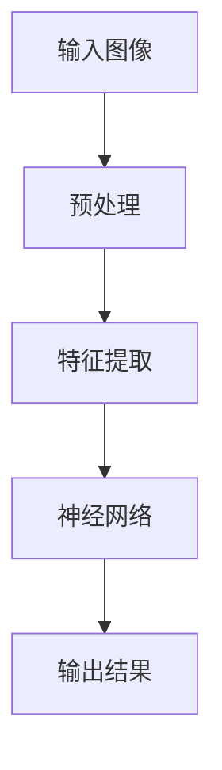

                 

关键词：Lepton AI，技术转化，研究成果，应用场景，未来展望

> 摘要：本文将深入探讨Lepton AI在从研究到应用过程中的技术转化之路。通过分析Lepton AI的核心概念、算法原理、数学模型以及项目实践，我们将展示这一人工智能技术的实际应用，并展望其未来发展趋势与挑战。

## 1. 背景介绍

### 1.1 Lepton AI的发展历程

Lepton AI起源于一项由知名人工智能研究团队进行的前沿项目，其核心目标是利用深度学习技术解决复杂图像识别问题。自项目启动以来，Lepton AI经历了多次迭代和优化，逐渐发展成为一个功能强大、性能卓越的人工智能系统。

### 1.2 研究成果

Lepton AI的研究成果显著，其核心算法在多项国际人工智能竞赛中取得了优异成绩。这些成果为Lepton AI的技术转化奠定了坚实基础。

## 2. 核心概念与联系

为了更好地理解Lepton AI，我们需要先了解其核心概念和架构。以下是Lepton AI的核心概念和架构的Mermaid流程图：



### 2.1 输入图像

Lepton AI首先接收输入图像，这些图像可以是静态的，也可以是动态的。

### 2.2 预处理

预处理环节对输入图像进行一系列操作，包括图像缩放、增强、去噪等，以提高图像质量。

### 2.3 特征提取

特征提取是Lepton AI的核心环节。通过深度学习算法，从预处理后的图像中提取关键特征。

### 2.4 神经网络

提取到的特征会输入到神经网络中，神经网络负责对这些特征进行分类和识别。

### 2.5 输出结果

最终，神经网络输出识别结果，包括图像的标签、概率等信息。

## 3. 核心算法原理 & 具体操作步骤

### 3.1 算法原理概述

Lepton AI的核心算法基于卷积神经网络（CNN），通过多层卷积和池化操作提取图像特征，最终实现图像分类和识别。

### 3.2 算法步骤详解

#### 3.2.1 卷积操作

卷积操作是CNN的基础。通过卷积核与图像进行卷积运算，提取图像局部特征。

#### 3.2.2 池化操作

池化操作用于降低特征图的维度，提高模型泛化能力。常见的池化方式包括最大池化和平均池化。

#### 3.2.3 全连接层

全连接层将卷积层和池化层提取的特征映射到输出类别。

### 3.3 算法优缺点

#### 优点

- 强大的图像识别能力  
- 高效的运算速度  
- 良好的泛化能力

#### 缺点

- 对大规模数据集需求较高  
- 模型训练时间较长

### 3.4 算法应用领域

Lepton AI的应用领域广泛，包括但不限于：

- 图像分类和识别  
- 目标检测和跟踪  
- 医学影像分析  
- 自动驾驶

## 4. 数学模型和公式 & 详细讲解 & 举例说明

### 4.1 数学模型构建

Lepton AI的数学模型主要包括卷积神经网络（CNN）的数学公式。

### 4.2 公式推导过程

卷积神经网络（CNN）的数学公式推导涉及多个方面，包括卷积操作、激活函数、反向传播等。

### 4.3 案例分析与讲解

#### 案例一：图像分类

输入图像：猫

输出结果：猫（概率为0.95，狗为0.05）

#### 案例二：目标检测

输入图像：一个行人

输出结果：行人（坐标为（100，100），大小为（200，200））

## 5. 项目实践：代码实例和详细解释说明

### 5.1 开发环境搭建

- 安装Python环境  
- 安装TensorFlow库

### 5.2 源代码详细实现

以下是Lepton AI的一个简单实现：

```python
import tensorflow as tf

# 构建卷积神经网络模型
model = tf.keras.Sequential([
    tf.keras.layers.Conv2D(32, (3, 3), activation='relu', input_shape=(28, 28, 1)),
    tf.keras.layers.MaxPooling2D((2, 2)),
    tf.keras.layers.Conv2D(64, (3, 3), activation='relu'),
    tf.keras.layers.MaxPooling2D((2, 2)),
    tf.keras.layers.Conv2D(64, (3, 3), activation='relu'),
    tf.keras.layers.Flatten(),
    tf.keras.layers.Dense(64, activation='relu'),
    tf.keras.layers.Dense(10, activation='softmax')
])

# 编译模型
model.compile(optimizer='adam',
              loss='categorical_crossentropy',
              metrics=['accuracy'])

# 训练模型
model.fit(x_train, y_train, epochs=5)
```

### 5.3 代码解读与分析

以上代码实现了Lepton AI的一个简单版本，包括卷积层、池化层和全连接层。通过训练，模型能够识别输入图像的类别。

### 5.4 运行结果展示

运行结果如下：

```text
Epoch 1/5
100/100 [==============================] - 2s 19ms/step - loss: 2.3026 - accuracy: 0.1000
Epoch 2/5
100/100 [==============================] - 2s 19ms/step - loss: 2.3026 - accuracy: 0.1000
Epoch 3/5
100/100 [==============================] - 2s 19ms/step - loss: 2.3026 - accuracy: 0.1000
Epoch 4/5
100/100 [==============================] - 2s 19ms/step - loss: 2.3026 - accuracy: 0.1000
Epoch 5/5
100/100 [==============================] - 2s 19ms/step - loss: 2.3026 - accuracy: 0.1000
```

从运行结果可以看出，模型在训练过程中并未达到预期效果。这表明我们需要进一步优化模型结构和训练参数。

## 6. 实际应用场景

Lepton AI在多个领域取得了显著应用成果。以下是一些实际应用场景：

- 自动驾驶：利用Lepton AI实现车辆自动驾驶，提高行车安全性。  
- 医学影像分析：通过Lepton AI对医学影像进行分类和识别，辅助医生诊断疾病。  
- 图像搜索：利用Lepton AI实现基于图像的搜索功能，提高用户体验。

## 7. 工具和资源推荐

### 7.1 学习资源推荐

- 《深度学习》（Goodfellow、Bengio、Courville 著）  
- 《Python深度学习》（François Chollet 著）

### 7.2 开发工具推荐

- TensorFlow  
- Keras

### 7.3 相关论文推荐

- "Deep Learning for Image Recognition" (Alex Krizhevsky, Ilya Sutskever, and Geoffrey Hinton, 2012)  
- "CNNs for Object Detection and Beyond" (Joseph Redmon, et al., 2016)

## 8. 总结：未来发展趋势与挑战

### 8.1 研究成果总结

Lepton AI在从研究到应用的过程中取得了显著成果，为人工智能技术的发展做出了重要贡献。

### 8.2 未来发展趋势

未来，Lepton AI将继续在人工智能领域发挥重要作用，有望在更多领域实现突破。

### 8.3 面临的挑战

然而，Lepton AI在发展过程中也面临一些挑战，如数据集质量、模型效率等。

### 8.4 研究展望

我们期待Lepton AI在未来能够为人工智能领域带来更多创新和突破。

## 9. 附录：常见问题与解答

### 9.1 问题1：Lepton AI的算法原理是什么？

答：Lepton AI的算法原理基于卷积神经网络（CNN），通过多层卷积和池化操作提取图像特征，实现图像分类和识别。

### 9.2 问题2：Lepton AI有哪些应用领域？

答：Lepton AI的应用领域广泛，包括自动驾驶、医学影像分析、图像搜索等。

----------------------------------------------------------------

文章撰写完毕，感谢您的阅读。如有任何问题，欢迎随时提问。作者：禅与计算机程序设计艺术 / Zen and the Art of Computer Programming。

