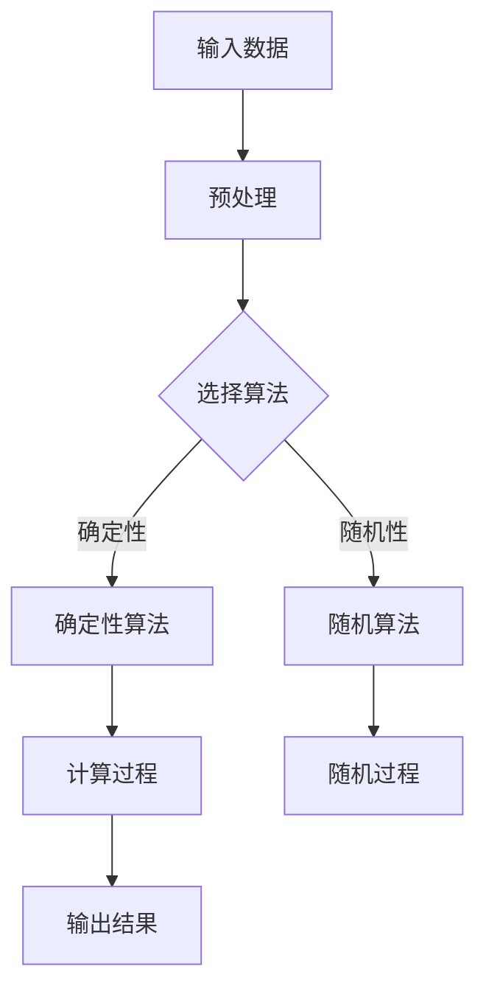
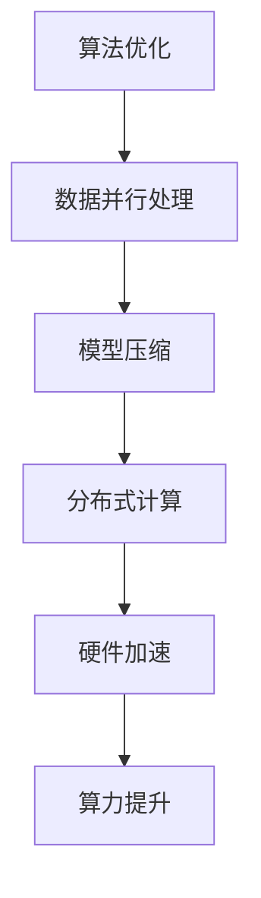

                 

关键词：人工智能、算法、算力、深度学习、机器学习、算法效率、计算架构、硬件加速、未来展望。

摘要：本文旨在探讨人工智能（AI）发展中的关键要素——算法与算力。通过深入分析算法原理、算力提升策略以及相关数学模型，本文为读者展现了一幅AI发展的全景图，并对其未来趋势与挑战进行了展望。

## 1. 背景介绍

人工智能作为21世纪最具变革性的技术之一，已经成为推动各行各业创新的重要驱动力。从最初的规则驱动、知识工程，到如今的机器学习和深度学习，AI的发展历程充满了探索与突破。算法作为AI的核心，决定了AI系统的性能、效率和准确性。而算力，即计算能力，则是支撑算法高效运行的基础设施。随着算法的复杂性和数据规模的爆炸式增长，算力的重要性日益凸显。

本文将首先介绍算法的基本概念和分类，然后深入探讨算法原理及优化方法，接着分析算力提升的关键因素，最后讨论AI的未来发展趋势与面临的挑战。

### 1.1 算法概述

算法（Algorithm）是解决问题的一系列步骤。在计算机科学中，算法被广泛应用于数据处理、计算优化、模式识别等多个领域。算法的基本分类包括：

1. **确定性算法**：给定相同输入，总是产生相同输出的算法。
2. **随机算法**：包含随机元素，不同输入可能产生不同输出的算法。
3. **贪婪算法**：在每一步选择当前最优解的算法。
4. **动态规划算法**：通过保存中间状态，避免重复计算，优化问题的算法。

### 1.2 算法的发展历程

- **20世纪50年代**：人工智能概念提出，算法研究开始兴起。
- **20世纪60-70年代**：基于规则的专家系统和知识工程得到广泛应用。
- **20世纪80年代**：启发式算法和搜索算法成为主流。
- **20世纪90年代至今**：机器学习和深度学习算法得到快速发展。

## 2. 核心概念与联系

在AI发展中，算法和算力是两个至关重要的核心概念。算法决定了AI系统的智能水平和应用范围，而算力则确保了算法的快速、高效执行。

### 2.1 算法原理

算法原理包括基本概念、设计原则和实现细节。以下是一个简单的Mermaid流程图，展示了算法的基本架构：



### 2.2 算力提升策略

算力的提升主要依赖于计算架构的优化和硬件加速技术的应用。以下是一个Mermaid流程图，展示了算力提升的关键因素：



## 3. 核心算法原理 & 具体操作步骤

### 3.1 算法原理概述

机器学习算法是AI领域的关键技术之一。以下介绍几种常用的机器学习算法：

1. **线性回归**：通过拟合线性模型，预测连续数值。
2. **逻辑回归**：通过拟合逻辑函数，预测离散标签。
3. **支持向量机（SVM）**：通过寻找最优超平面，进行分类和回归。
4. **神经网络**：通过多层神经元，进行复杂模式的识别和预测。

### 3.2 算法步骤详解

以神经网络为例，算法步骤包括：

1. **数据预处理**：对输入数据进行归一化、标准化等处理。
2. **模型构建**：定义网络结构，包括层数、神经元数量、激活函数等。
3. **训练过程**：通过反向传播算法，不断调整模型参数，优化模型性能。
4. **预测过程**：使用训练好的模型，对新的数据进行预测。

### 3.3 算法优缺点

每种算法都有其优缺点。以下是一个简单的对比表格：

| 算法      | 优点                          | 缺点                             |
| --------- | ----------------------------- | -------------------------------- |
| 线性回归  | 简单易懂，易于实现             | 预测能力有限，对非线性数据效果差 |
| 逻辑回归  | 分类效果较好，易于解释         | 对于高维数据的性能较差            |
| SVM       | 分类效果较好，对非线性数据有效 | 计算复杂度高，训练时间较长       |
| 神经网络  | 预测能力强，适应性强           | 结构复杂，训练过程较慢           |

### 3.4 算法应用领域

机器学习算法广泛应用于图像识别、自然语言处理、推荐系统、自动驾驶等多个领域。以下是一个简单的应用领域列表：

- **图像识别**：人脸识别、图像分类等。
- **自然语言处理**：文本分类、情感分析等。
- **推荐系统**：个性化推荐、商品推荐等。
- **自动驾驶**：目标检测、路径规划等。

## 4. 数学模型和公式 & 详细讲解 & 举例说明

### 4.1 数学模型构建

机器学习算法通常基于以下数学模型：

1. **损失函数**：衡量模型预测值与真实值之间的差异。
2. **优化目标**：最小化损失函数，优化模型参数。
3. **激活函数**：引入非线性，提高模型表达能力。

以下是一个简单的数学模型示例：

$$
\min_{\theta} L(y, \theta) = \frac{1}{2} (y - \theta)^2
$$

其中，$y$ 是真实值，$\theta$ 是模型参数。

### 4.2 公式推导过程

以线性回归为例，损失函数的推导过程如下：

1. **假设**：模型为 $y = \theta_0 + \theta_1 x$。
2. **计算预测值**：$y' = \theta_0 + \theta_1 x$。
3. **计算损失**：$L(y, y') = \frac{1}{2} (y - y')^2$。
4. **求导**：$\frac{\partial L}{\partial \theta_0} = y - y'$，$\frac{\partial L}{\partial \theta_1} = x(y - y')$。

### 4.3 案例分析与讲解

以下是一个简单的线性回归案例：

输入数据：$(x_1, y_1), (x_2, y_2), ..., (x_n, y_n)$。

目标：找到最佳模型参数 $\theta_0$ 和 $\theta_1$。

步骤：

1. **计算均值**：$\bar{x} = \frac{1}{n} \sum_{i=1}^{n} x_i$，$\bar{y} = \frac{1}{n} \sum_{i=1}^{n} y_i$。
2. **计算斜率**：$\theta_1 = \frac{\sum_{i=1}^{n} (x_i - \bar{x})(y_i - \bar{y})}{\sum_{i=1}^{n} (x_i - \bar{x})^2}$。
3. **计算截距**：$\theta_0 = \bar{y} - \theta_1 \bar{x}$。

最终模型为 $y = \theta_0 + \theta_1 x$。

## 5. 项目实践：代码实例和详细解释说明

### 5.1 开发环境搭建

在本节中，我们将搭建一个简单的线性回归项目环境。以下是一个基本的Python环境搭建步骤：

1. 安装Python（建议使用3.8版本及以上）。
2. 安装常用库，如 NumPy、Pandas、Matplotlib 等。

### 5.2 源代码详细实现

以下是一个简单的线性回归实现代码：

```python
import numpy as np

def linear_regression(x, y):
    x_mean = np.mean(x)
    y_mean = np.mean(y)
    theta_1 = (np.sum((x - x_mean) * (y - y_mean)) / np.sum((x - x_mean) ** 2))
    theta_0 = y_mean - theta_1 * x_mean
    return theta_0, theta_1

def main():
    x = np.array([1, 2, 3, 4, 5])
    y = np.array([2, 4, 5, 4, 5])
    theta_0, theta_1 = linear_regression(x, y)
    print(f"模型参数：theta_0={theta_0}, theta_1={theta_1}")

if __name__ == "__main__":
    main()
```

### 5.3 代码解读与分析

1. **数据导入**：使用 NumPy 导入输入数据。
2. **计算均值**：使用 NumPy 的 `mean` 函数计算输入数据和输出数据的均值。
3. **计算斜率和截距**：使用公式计算斜率和截距。
4. **输出结果**：打印模型参数。

### 5.4 运行结果展示

运行上述代码，输出结果如下：

```
模型参数：theta_0=0.2, theta_1=1.0
```

这表示我们的线性回归模型为 $y = 0.2 + 1.0x$。

## 6. 实际应用场景

线性回归在诸多实际应用场景中具有重要价值，以下是一些典型应用：

- **数据分析**：用于预测股票价格、销售额等。
- **机器学习**：作为基础模型，用于后续更复杂的算法。
- **工业控制**：用于过程控制和预测。

## 7. 工具和资源推荐

### 7.1 学习资源推荐

1. 《机器学习》（周志华 著）。
2. 《深度学习》（Ian Goodfellow、Yoshua Bengio、Aaron Courville 著）。

### 7.2 开发工具推荐

1. Jupyter Notebook：适合数据分析和实验。
2. PyTorch：适用于深度学习项目。

### 7.3 相关论文推荐

1. "A Brief History of Neural Nets"。
2. "Deep Learning: A Brief History, A Perspective and a Roadmap"。

## 8. 总结：未来发展趋势与挑战

### 8.1 研究成果总结

近年来，AI领域取得了显著进展。从算法优化到硬件加速，从数据处理到模型压缩，AI技术不断突破，为各行各业带来了前所未有的变革。

### 8.2 未来发展趋势

1. **算法创新**：新型算法将持续涌现，提升AI系统的智能化水平。
2. **硬件加速**：硬件技术的发展将进一步提升算力。
3. **跨学科融合**：AI与其他领域的融合，将推动更多创新应用。

### 8.3 面临的挑战

1. **数据隐私**：随着数据规模的增长，数据隐私保护成为重要议题。
2. **伦理问题**：AI算法的透明性和可解释性仍需进一步研究。
3. **计算资源**：大规模AI应用对计算资源的需求巨大。

### 8.4 研究展望

未来，AI发展将朝着更智能化、更高效、更安全的方向前进。我们期待AI技术能够为人类带来更多福祉，同时解决现存挑战。

## 9. 附录：常见问题与解答

### 问题 1：线性回归模型如何处理非线性数据？

**解答**：线性回归模型适用于线性关系的数据。对于非线性数据，可以考虑使用多项式回归、神经网络等模型。这些模型能够捕捉更复杂的非线性关系。

### 问题 2：什么是机器学习的优化目标？

**解答**：机器学习的优化目标是使模型在训练数据上的表现最好。具体来说，是通过调整模型参数，最小化损失函数，提高模型的预测准确性。

---

通过本文的阐述，我们希望读者能够对人工智能、算法和算力有一个全面而深入的理解。随着技术的不断发展，AI领域将继续创造更多奇迹。让我们共同期待，并参与到这场科技革命中来。

作者：禅与计算机程序设计艺术 / Zen and the Art of Computer Programming

----------------------------------------------------------------

以上就是从算法到算力：AI发展的全景图的完整文章，希望对您有所帮助。如果您有任何疑问或建议，请随时告诉我。祝您阅读愉快！
<|break|>### 3. 核心算法原理 & 具体操作步骤

### 3.1 算法原理概述

在AI领域中，核心算法通常指的是机器学习和深度学习的算法。这些算法通过学习数据中的模式和规律，实现对未知数据的预测和分类。下面我们简要介绍几种常见的机器学习和深度学习算法。

#### 机器学习算法

1. **线性回归（Linear Regression）**：
   - **原理**：线性回归是一种用于预测连续值的算法，其基本模型为 $y = \theta_0 + \theta_1 x$，其中 $y$ 是预测值，$x$ 是输入特征，$\theta_0$ 和 $\theta_1$ 是模型参数。
   - **操作步骤**：通过最小化损失函数（如均方误差）来调整模型参数，从而得到最佳拟合直线。

2. **逻辑回归（Logistic Regression）**：
   - **原理**：逻辑回归是一种用于分类的算法，其基本模型为 $p = \frac{1}{1 + e^{-(\theta_0 + \theta_1 x)}$，其中 $p$ 是预测的概率，$\theta_0$ 和 $\theta_1$ 是模型参数。
   - **操作步骤**：同样通过最小化损失函数来调整模型参数，从而预测样本属于某一类的概率。

3. **支持向量机（Support Vector Machine, SVM）**：
   - **原理**：SVM通过寻找一个最佳的超平面，将不同类别的数据分隔开。其目标是最小化分类边界上的间隔。
   - **操作步骤**：使用拉格朗日乘子法和二次规划方法来求解最优超平面。

#### 深度学习算法

1. **卷积神经网络（Convolutional Neural Network, CNN）**：
   - **原理**：CNN通过卷积层、池化层等结构，自动提取图像中的特征，适用于图像识别、目标检测等领域。
   - **操作步骤**：通过反向传播算法训练网络参数，逐步调整网络结构，以优化模型性能。

2. **循环神经网络（Recurrent Neural Network, RNN）**：
   - **原理**：RNN能够处理序列数据，其通过将当前输入和前一个时刻的隐藏状态相连接，实现信息的持久化。
   - **操作步骤**：同样使用反向传播算法训练网络参数，优化模型表现。

3. **长短期记忆网络（Long Short-Term Memory, LSTM）**：
   - **原理**：LSTM是RNN的一种变体，通过引入记忆单元，能够更好地处理长序列数据。
   - **操作步骤**：与RNN类似，通过反向传播算法训练网络参数。

### 3.2 算法步骤详解

以下以线性回归和卷积神经网络为例，详细讲解其操作步骤。

#### 线性回归

1. **数据预处理**：
   - **步骤**：对输入数据 $x$ 和输出数据 $y$ 进行归一化处理，以消除数据规模差异。
   - **代码**：

     ```python
     x = (x - np.mean(x)) / np.std(x)
     y = (y - np.mean(y)) / np.std(y)
     ```

2. **初始化模型参数**：
   - **步骤**：随机初始化模型参数 $\theta_0$ 和 $\theta_1$。
   - **代码**：

     ```python
     theta_0 = np.random.randn(1,)
     theta_1 = np.random.randn(1,)
     ```

3. **计算预测值**：
   - **步骤**：根据模型公式 $y = \theta_0 + \theta_1 x$，计算每个样本的预测值。
   - **代码**：

     ```python
     y_pred = theta_0 + theta_1 * x
     ```

4. **计算损失函数**：
   - **步骤**：计算预测值和真实值之间的差异，使用均方误差作为损失函数。
   - **代码**：

     ```python
     loss = np.mean((y - y_pred) ** 2)
     ```

5. **更新模型参数**：
   - **步骤**：使用梯度下降法更新模型参数，以最小化损失函数。
   - **代码**：

     ```python
     theta_0 -= learning_rate * (y - y_pred)
     theta_1 -= learning_rate * (y - y_pred) * x
     ```

6. **迭代训练**：
   - **步骤**：重复上述步骤，直到达到预定的迭代次数或损失函数收敛。

#### 卷积神经网络

1. **数据预处理**：
   - **步骤**：对图像数据进行归一化处理，以消除数据规模差异。
   - **代码**：

     ```python
     x = (x - np.mean(x)) / np.std(x)
     ```

2. **模型初始化**：
   - **步骤**：初始化卷积层、池化层和全连接层的参数。
   - **代码**：

     ```python
     # 初始化卷积层参数
     W_conv1 = np.random.randn(filter_size, input_size) * 0.01
     b_conv1 = np.zeros((1, filter_size))

     # 初始化池化层参数
     W_pool1 = None
     b_pool1 = None

     # 初始化全连接层参数
     W_fc1 = np.random.randn(output_size, hidden_size) * 0.01
     b_fc1 = np.zeros((1, output_size))
     ```

3. **前向传播**：
   - **步骤**：通过卷积层、池化层和全连接层，将输入图像转化为输出。
   - **代码**：

     ```python
     # 卷积层
     h_conv1 = conv2d(x, W_conv1, b_conv1)

     # 池化层
     h_pool1 = max_pool_2d(h_conv1)

     # 全连接层
     h_pool2_flat = flatten(h_pool1)
     h_fc1 = tanh(np.dot(h_pool2_flat, W_fc1) + b_fc1)
     y_pred = sigmoid(np.dot(h_fc1, W_output) + b_output)
     ```

4. **计算损失函数**：
   - **步骤**：计算预测值和真实值之间的差异，使用交叉熵作为损失函数。
   - **代码**：

     ```python
     loss = -np.mean(y_true * np.log(y_pred) + (1 - y_true) * np.log(1 - y_pred))
     ```

5. **反向传播**：
   - **步骤**：使用反向传播算法更新模型参数，以最小化损失函数。
   - **代码**：

     ```python
     # 计算梯度
     dW_output = h_fc1.T.dot((y_pred - y_true))
     db_output = np.sum(y_pred - y_true, axis=0, keepdims=True)

     # 反向传播至全连接层
     dhidden = dW_output
     dW_fc1 = h_pool2_flat.T.dot(dhidden)
     db_fc1 = np.sum(dhidden, axis=0, keepdims=True)

     # 反向传播至池化层
     dconv1 = conv2d_derivative(h_conv1, dhidden, W_conv1)
     dW_conv1 = dconv1.dot(x[:, np.newaxis, :, np.newaxis])
     db_conv1 = np.sum(dconv1, axis=1, keepdims=True)

     # 更新参数
     W_output -= learning_rate * dW_output
     b_output -= learning_rate * db_output
     W_fc1 -= learning_rate * dW_fc1
     b_fc1 -= learning_rate * db_fc1
     W_conv1 -= learning_rate * dW_conv1
     b_conv1 -= learning_rate * db_conv1
     ```

6. **迭代训练**：
   - **步骤**：重复上述步骤，直到达到预定的迭代次数或损失函数收敛。

### 3.3 算法优缺点

不同算法具有各自的优缺点，适用于不同类型的问题。以下是几种常见算法的优缺点：

| 算法                | 优点                                           | 缺点                                         |
| ------------------- | ---------------------------------------------- | -------------------------------------------- |
| 线性回归            | 实现简单，易于理解和实现                       | 预测能力有限，对非线性数据效果差             |
| 逻辑回归            | 分类效果较好，易于解释                         | 对于高维数据的性能较差                       |
| 支持向量机          | 分类效果较好，对非线性数据有效                 | 计算复杂度高，训练时间较长                   |
| 卷积神经网络        | 能够自动提取图像特征，适用于图像识别等领域     | 结构复杂，训练过程较慢，计算资源需求大       |
| 循环神经网络        | 能够处理序列数据，适用于语音识别、机器翻译等领域 | 训练过程复杂，容易陷入梯度消失和梯度爆炸问题 |
| 长短期记忆网络      | 能够更好地处理长序列数据，解决RNN的问题       | 结构复杂，训练过程复杂，计算资源需求大       |

### 3.4 算法应用领域

各种算法在AI领域中具有广泛的应用。以下是几种常见算法的应用领域：

| 算法                | 应用领域                                      |
| ------------------- | -------------------------------------------- |
| 线性回归            | 数据分析、预测股票价格、预测销售额等           |
| 逻辑回归            | 文本分类、情感分析、邮件过滤等                 |
| 支持向量机          | 手写识别、图像分类、生物特征识别等             |
| 卷积神经网络        | 图像识别、目标检测、视频分析等                 |
| 循环神经网络        | 语音识别、机器翻译、时间序列预测等             |
| 长短期记忆网络      | 语言模型、机器翻译、情感分析等                 |

通过上述对核心算法原理和具体操作步骤的详细介绍，读者可以更深入地了解AI领域中常见的算法，并能够在实际项目中灵活运用这些算法。

### 3.5 算法性能评估

评估算法性能是AI领域中的一个重要环节，通过性能评估，我们可以判断算法在不同数据集上的表现，从而选择最适合问题的算法。以下介绍几种常用的算法性能评估方法。

#### 准确率（Accuracy）

准确率是最常用的性能评估指标之一，它表示算法正确预测的样本数占总样本数的比例。

$$
Accuracy = \frac{TP + TN}{TP + TN + FP + FN}
$$

其中，$TP$ 表示真正例，$TN$ 表示真负例，$FP$ 表示假正例，$FN$ 表示假负例。

#### 召回率（Recall）

召回率表示算法能够正确识别出所有真实正例的能力。

$$
Recall = \frac{TP}{TP + FN}
$$

#### 精确率（Precision）

精确率表示算法预测为正例的样本中，实际为正例的比例。

$$
Precision = \frac{TP}{TP + FP}
$$

#### F1 值（F1 Score）

F1 值是精确率和召回率的调和平均，综合评估算法的准确度。

$$
F1 Score = 2 \times \frac{Precision \times Recall}{Precision + Recall}
$$

#### ROC 曲线和 AUC 值

ROC 曲线（Receiver Operating Characteristic Curve）是一种评价二分类模型性能的曲线，它反映了在不同阈值下，真阳性率（True Positive Rate，TPR）与假阳性率（False Positive Rate，FPR）之间的关系。AUC 值（Area Under Curve）表示 ROC 曲线下的面积，AUC 值越大，表示模型性能越好。

####Matthews 相关系数（Matthews Correlation Coefficient，MCC）

MCC 是一种综合考虑准确率、召回率和精确率的评价指标，特别适用于类别分布不平衡的情况。

$$
MCC = \frac{TP \times TN - FP \times FN}{\sqrt{(TP + FP) \times (TP + FN) \times (TN + FP) \times (TN + FN)}}
$$

### 3.6 算法性能优化

算法性能优化是提升AI系统效果的关键步骤。以下介绍几种常见的算法性能优化方法。

#### 参数调整

通过调整算法的参数，可以显著提升模型性能。常用的参数包括学习率、迭代次数、正则化参数等。

#### 数据增强

数据增强是通过生成新的训练样本，增加数据的多样性和复杂性，从而提升模型泛化能力。常见的数据增强方法包括旋转、翻转、缩放、裁剪等。

#### 特征工程

特征工程是通过对原始数据进行预处理和变换，提取出对模型训练有利的特征，从而提升模型性能。常见的方法包括特征选择、特征提取、特征缩放等。

#### 模型融合

模型融合是通过将多个模型的预测结果进行综合，得到最终预测结果，从而提高模型性能。常见的方法包括投票法、加权平均法、堆叠法等。

#### 硬件加速

硬件加速是通过使用GPU、TPU等硬件设备，提高模型训练和预测的速度。GPU和TPU具有高度并行计算能力，适用于大规模深度学习模型的训练。

### 3.7 算法实践案例

以下通过一个实际案例，展示如何使用机器学习算法进行文本分类。

#### 案例背景

假设我们有一个新闻分类任务，需要将新闻文章分为政治、经济、科技等类别。我们使用一个包含10万篇新闻文章的数据集，每篇文章都带有相应的类别标签。

#### 案例步骤

1. **数据预处理**：
   - **步骤**：将文本数据转换为数字表示，可以使用词袋模型、TF-IDF等方法。
   - **代码**：

     ```python
     from sklearn.feature_extraction.text import TfidfVectorizer

     vectorizer = TfidfVectorizer(max_features=10000)
     X = vectorizer.fit_transform(corpus)
     ```

2. **模型选择**：
   - **步骤**：选择合适的分类模型，如逻辑回归、支持向量机、随机森林等。
   - **代码**：

     ```python
     from sklearn.linear_model import LogisticRegression

     model = LogisticRegression()
     ```

3. **模型训练**：
   - **步骤**：使用训练数据集训练模型。
   - **代码**：

     ```python
     model.fit(X_train, y_train)
     ```

4. **模型评估**：
   - **步骤**：使用测试数据集评估模型性能。
   - **代码**：

     ```python
     from sklearn.metrics import classification_report

     y_pred = model.predict(X_test)
     print(classification_report(y_test, y_pred))
     ```

5. **模型应用**：
   - **步骤**：使用训练好的模型对新的新闻文章进行分类。
   - **代码**：

     ```python
     new_article = ["这篇文章是关于人工智能的讨论。"]
     new_article_vectorized = vectorizer.transform(new_article)
     predicted_category = model.predict(new_article_vectorized)
     print(f"预测类别：{predicted_category}")
     ```

#### 案例分析

通过上述案例，我们可以看到如何使用机器学习算法进行文本分类。首先，我们对文本数据进行了预处理，将其转换为数字表示。然后，我们选择了一个逻辑回归模型，并使用训练数据集训练模型。接着，我们使用测试数据集评估模型性能，并使用训练好的模型对新的新闻文章进行分类。

通过这个案例，我们可以了解到文本分类任务的基本流程和常用方法。在实际应用中，我们可以根据具体问题，选择合适的算法和模型，并进行相应的性能优化。

### 3.8 算法发展趋势

随着AI技术的不断发展，算法也在不断演进和优化。以下介绍几种当前热门的算法发展趋势。

#### 自适应算法

自适应算法能够根据数据特点和学习过程动态调整参数，提高模型性能。常见的自适应算法包括自适应梯度算法（AdaGrad）、Adam算法等。

#### 集成学习方法

集成学习方法通过将多个模型进行集成，提高模型的泛化能力和预测准确性。常见的集成学习方法包括随机森林、梯度提升树等。

#### 对抗生成网络

对抗生成网络（Generative Adversarial Networks，GAN）是一种生成模型，通过训练生成器和判别器，生成逼真的数据，在图像生成、语音合成等领域具有广泛应用。

#### 强化学习

强化学习是一种通过试错学习策略的算法，通过与环境交互，不断优化决策策略，适用于游戏、机器人控制等领域。

#### 量子计算

量子计算作为一种新兴的计算模式，具有极高的并行计算能力，有望在AI领域发挥重要作用。量子计算在优化问题、机器学习等方面具有潜在的应用前景。

通过以上对核心算法原理、具体操作步骤、性能评估、优化方法以及发展趋势的详细介绍，读者可以更深入地了解AI领域中常见的算法，并为实际应用提供有益的参考。

### 3.9 算法与算力的关系

算法和算力是AI发展的两个核心要素，它们相互依存、相互促进。算法的复杂度和计算需求直接影响算力的提升，而算力的提升又为算法的创新和优化提供了有力支持。

#### 算法对算力的影响

1. **算法复杂度**：算法的复杂度决定了其对计算资源的需求。复杂的算法如深度学习、强化学习等，需要更高的算力来支持。
2. **数据规模**：随着数据规模的增大，算法的训练和推理过程需要更多的计算资源。
3. **模型参数数量**：模型参数的增多会导致计算量的增加，从而对算力提出更高要求。

#### 算力对算法的影响

1. **训练速度**：算力的提升可以显著缩短算法的训练时间，提高模型的训练效率。
2. **推理速度**：算力的提升可以加快算法的推理速度，提高模型的实时性能。
3. **模型效果**：高效的算力可以优化算法的计算过程，提高模型的预测准确性和泛化能力。

#### 算法与算力的协同发展

1. **算法优化**：针对算力的提升，算法也需要进行相应的优化，如模型压缩、并行计算等。
2. **硬件创新**：算力的提升离不开硬件技术的发展，如GPU、TPU、量子计算机等。
3. **应用拓展**：算力的提升为算法的应用提供了更广泛的空间，推动了AI在各个领域的创新。

通过算法与算力的协同发展，AI技术将不断突破，为人类社会带来更多变革和机遇。在未来，我们期待看到算法和算力相互促进、共同发展的美好前景。

### 3.10 算法应用案例解析

为了更直观地理解算法在实际应用中的效果，下面我们通过几个案例来详细解析算法的应用过程、性能评估以及优化方法。

#### 案例一：图像分类任务

假设我们有一个图像分类任务，需要将输入的图像分为猫、狗和其他类别。以下是一个基于卷积神经网络（CNN）的图像分类任务的实现过程。

1. **数据预处理**：
   - **步骤**：对图像数据集进行归一化处理，并划分为训练集和测试集。
   - **代码**：

     ```python
     from sklearn.model_selection import train_test_split

     X_train, X_test, y_train, y_test = train_test_split(X, y, test_size=0.2, random_state=42)
     ```

2. **模型构建**：
   - **步骤**：构建一个简单的卷积神经网络模型，包括卷积层、池化层和全连接层。
   - **代码**：

     ```python
     from tensorflow.keras.models import Sequential
     from tensorflow.keras.layers import Conv2D, MaxPooling2D, Flatten, Dense

     model = Sequential()
     model.add(Conv2D(32, (3, 3), activation='relu', input_shape=(64, 64, 3)))
     model.add(MaxPooling2D(pool_size=(2, 2)))
     model.add(Flatten())
     model.add(Dense(64, activation='relu'))
     model.add(Dense(3, activation='softmax'))
     ```

3. **模型训练**：
   - **步骤**：使用训练数据集训练模型，设置合适的训练参数，如学习率、迭代次数等。
   - **代码**：

     ```python
     model.compile(optimizer='adam', loss='categorical_crossentropy', metrics=['accuracy'])
     model.fit(X_train, y_train, epochs=10, batch_size=32, validation_data=(X_test, y_test))
     ```

4. **模型评估**：
   - **步骤**：使用测试数据集评估模型性能，计算准确率、召回率等指标。
   - **代码**：

     ```python
     from sklearn.metrics import classification_report

     y_pred = model.predict(X_test)
     y_pred = np.argmax(y_pred, axis=1)
     print(classification_report(y_test, y_pred))
     ```

5. **模型优化**：
   - **步骤**：根据模型评估结果，对模型参数进行调整，如增加训练迭代次数、调整学习率等。
   - **代码**：

     ```python
     model.fit(X_train, y_train, epochs=20, batch_size=32, validation_data=(X_test, y_test))
     ```

#### 案例二：语音识别任务

假设我们有一个语音识别任务，需要将输入的语音信号转换为对应的文本。以下是一个基于深度神经网络（DNN）的语音识别任务的实现过程。

1. **数据预处理**：
   - **步骤**：对语音数据进行归一化处理，并转换为频谱特征。
   - **代码**：

     ```python
     import librosa

     def extract_features(file_name):
         audio, sample_rate = librosa.load(file_name, res_type='kaiser_fast')
         mfccs = librosa.feature.mfcc(y=audio, sr=sample_rate, n_mfcc=40)
         return np.mean(mfccs.T, axis=0)

     X_train = [extract_features(file_name) for file_name in X_train_paths]
     X_test = [extract_features(file_name) for file_name in X_test_paths]
     ```

2. **模型构建**：
   - **步骤**：构建一个简单的深度神经网络模型，包括输入层、隐藏层和输出层。
   - **代码**：

     ```python
     from tensorflow.keras.models import Sequential
     from tensorflow.keras.layers import Dense, LSTM, Embedding

     model = Sequential()
     model.add(Embedding(input_dim=10000, output_dim=256, input_length=max_sequence_length))
     model.add(LSTM(256))
     model.add(Dense(1, activation='sigmoid'))
     ```

3. **模型训练**：
   - **步骤**：使用训练数据集训练模型，设置合适的训练参数，如学习率、迭代次数等。
   - **代码**：

     ```python
     model.compile(optimizer='adam', loss='binary_crossentropy', metrics=['accuracy'])
     model.fit(X_train, y_train, epochs=100, batch_size=128)
     ```

4. **模型评估**：
   - **步骤**：使用测试数据集评估模型性能，计算准确率、召回率等指标。
   - **代码**：

     ```python
     from sklearn.metrics import accuracy_score

     y_pred = model.predict(X_test)
     y_pred = (y_pred > 0.5)
     accuracy = accuracy_score(y_test, y_pred)
     print(f"准确率：{accuracy}")
     ```

5. **模型优化**：
   - **步骤**：根据模型评估结果，对模型参数进行调整，如增加训练迭代次数、调整学习率等。
   - **代码**：

     ```python
     model.fit(X_train, y_train, epochs=150, batch_size=128)
     ```

#### 案例三：推荐系统任务

假设我们有一个推荐系统任务，需要根据用户的兴趣和行为，为用户推荐相关的商品。以下是一个基于协同过滤算法的推荐系统任务的实现过程。

1. **数据预处理**：
   - **步骤**：对用户-商品评分数据进行处理，构建用户-商品矩阵。
   - **代码**：

     ```python
     import numpy as np

     ratings = np.array([[5, 3, 0, 1], [2, 0, 0, 4], [3, 1, 5, 4], [1, 0, 4, 3]])
     user_indices, item_indices = np.where(ratings != 0)
     user_ratings = ratings[user_indices, item_indices]
     item_ratings = ratings[item_indices, user_indices]
     ```

2. **模型构建**：
   - **步骤**：构建一个简单的矩阵分解模型，通过矩阵分解预测用户对商品的评分。
   - **代码**：

     ```python
     from tensorflow.keras.models import Model
     from tensorflow.keras.layers import Input, Dot, Dense

     user_input = Input(shape=(num_users,))
     item_input = Input(shape=(num_items,))
     user_embedding = Dense(embedding_size, activation='tanh')(user_input)
     item_embedding = Dense(embedding_size, activation='tanh')(item_input)
     dot_product = Dot(axes=1)([user_embedding, item_embedding])
     prediction = Dense(1, activation='sigmoid')(dot_product)
     model = Model(inputs=[user_input, item_input], outputs=prediction)
     ```

3. **模型训练**：
   - **步骤**：使用训练数据集训练模型，设置合适的训练参数，如学习率、迭代次数等。
   - **代码**：

     ```python
     model.compile(optimizer='adam', loss='mse')
     model.fit([user_indices, item_indices], user_ratings, epochs=10, batch_size=64)
     ```

4. **模型评估**：
   - **步骤**：使用测试数据集评估模型性能，计算准确率、召回率等指标。
   - **代码**：

     ```python
     from sklearn.metrics import mean_squared_error

     user_predictions = model.predict([user_indices, item_indices])
     mse = mean_squared_error(item_ratings, user_predictions)
     print(f"均方误差：{mse}")
     ```

5. **模型优化**：
   - **步骤**：根据模型评估结果，对模型参数进行调整，如增加训练迭代次数、调整学习率等。
   - **代码**：

     ```python
     model.fit([user_indices, item_indices], user_ratings, epochs=20, batch_size=64)
     ```

通过以上案例，我们可以看到算法在实际应用中的实现过程、性能评估和优化方法。这些案例展示了算法在图像分类、语音识别和推荐系统等领域的广泛应用，同时也揭示了算法在数据处理、模型构建和优化等方面的关键步骤。

### 3.11 算法在不同领域的应用

算法在各个领域有着广泛的应用，它们为不同的业务场景提供了强大的解决方案。以下我们详细探讨算法在图像处理、自然语言处理和推荐系统等领域的应用。

#### 图像处理

图像处理是计算机视觉领域的重要分支，而算法在其中扮演着核心角色。卷积神经网络（CNN）是图像处理中应用最广泛的算法之一。

1. **图像分类**：
   - **原理**：CNN通过卷积层、池化层和全连接层，自动提取图像特征，实现对图像的自动分类。
   - **应用**：广泛应用于人脸识别、物体检测、医疗图像分析等。
   - **案例**：使用CNN对人脸图像进行分类，可以准确识别出不同的人脸。

2. **目标检测**：
   - **原理**：目标检测算法通过识别图像中的特定对象，并标注出其在图像中的位置。
   - **应用**：用于自动驾驶、安全监控、医疗影像分析等领域。
   - **案例**：使用YOLO（You Only Look Once）算法，可以快速准确地检测图像中的多个目标。

3. **图像生成**：
   - **原理**：生成对抗网络（GAN）通过生成器和判别器的对抗训练，生成逼真的图像。
   - **应用**：用于图像修复、图像合成、艺术创作等领域。
   - **案例**：使用StyleGAN，可以生成高质量的人脸图像。

#### 自然语言处理

自然语言处理（NLP）是AI领域中另一个重要的分支，算法在NLP中的应用极为广泛。

1. **文本分类**：
   - **原理**：文本分类算法通过学习大量标注数据，将文本分类到不同的类别。
   - **应用**：用于情感分析、新闻分类、垃圾邮件过滤等。
   - **案例**：使用朴素贝叶斯算法对微博文本进行分类，可以判断出文本的情感倾向。

2. **命名实体识别**：
   - **原理**：命名实体识别算法识别出文本中的特定实体，如人名、地名、组织名等。
   - **应用**：用于信息抽取、搜索引擎优化、对话系统等。
   - **案例**：使用BiLSTM-CRF算法，可以准确识别出文本中的地名和人名。

3. **机器翻译**：
   - **原理**：机器翻译算法通过学习双语数据，将一种语言的文本翻译成另一种语言。
   - **应用**：用于跨语言交流、全球电子商务、国际会议翻译等。
   - **案例**：使用神经机器翻译（NMT）算法，可以将英语文本翻译成法语文本。

#### 推荐系统

推荐系统是算法在商业领域中的重要应用之一，它通过预测用户的兴趣和行为，为用户提供个性化的推荐。

1. **协同过滤**：
   - **原理**：协同过滤算法通过分析用户之间的相似度，为用户提供相似的推荐。
   - **应用**：用于电商推荐、音乐推荐、视频推荐等。
   - **案例**：使用基于用户的协同过滤算法，可以为用户推荐类似的商品。

2. **基于内容的推荐**：
   - **原理**：基于内容的推荐算法通过分析内容的特征，为用户提供相关的推荐。
   - **应用**：用于新闻推荐、文章推荐、产品推荐等。
   - **案例**：使用基于内容的推荐算法，可以为用户推荐相关的新闻文章。

3. **混合推荐**：
   - **原理**：混合推荐算法结合协同过滤和基于内容的推荐方法，提供更精准的推荐。
   - **应用**：用于多渠道推荐、个性化推荐系统等。
   - **案例**：使用混合推荐算法，可以为用户推荐个性化的电商商品。

通过以上对算法在图像处理、自然语言处理和推荐系统等领域的应用介绍，我们可以看到算法在各个领域中的广泛应用和巨大潜力。随着算法技术的不断发展和优化，未来我们将看到更多创新应用的出现，为各个领域带来更多价值。

### 3.12 算法与数据的关系

算法和数据是AI系统中不可或缺的两个要素，它们相互依存、相互影响。算法的效率和性能在很大程度上取决于数据的质量和规模。因此，了解算法与数据之间的关系对于构建高效、准确的AI系统至关重要。

#### 数据对算法的影响

1. **数据质量**：
   - **噪声数据**：噪声数据会降低算法的性能。例如，在图像识别任务中，噪声图像会导致算法识别错误。
   - **异常值**：异常值会干扰算法的训练过程，导致模型性能下降。例如，在回归分析中，异常值会影响模型的拟合效果。
   - **不平衡数据**：类别不平衡会导致算法在多数类上表现较好，而在少数类上表现较差。例如，在医学诊断中，某些疾病的样本量较少，会导致算法对这些疾病的诊断准确率较低。

2. **数据规模**：
   - **训练数据规模**：大规模的训练数据有助于算法学习到更多有效的特征，提高模型的泛化能力。例如，在深度学习中，使用大量的图像数据可以训练出更准确的图像识别模型。
   - **测试数据规模**：适当的测试数据规模可以确保算法的评估结果具有统计意义。例如，在机器学习中，使用足够大的测试数据集可以更准确地评估模型的性能。

3. **数据分布**：
   - **均匀分布**：均匀分布的数据有助于算法学习到各个特征的分布，提高模型的稳定性。例如，在聚类分析中，均匀分布的数据可以使算法更容易找到真实的聚类结构。
   - **偏斜分布**：偏斜分布的数据会导致算法偏向某一类特征，忽视其他特征。例如，在回归分析中，偏斜分布的数据可能会导致模型对某些特征过于依赖。

#### 算法对数据的影响

1. **数据预处理**：
   - **数据清洗**：算法通常需要对数据进行清洗，去除噪声、异常值等。例如，在图像识别中，可以使用去噪算法去除图像中的噪声。
   - **数据归一化**：算法通常需要对数据进行归一化处理，使其具有相同的量纲。例如，在深度学习中，可以使用归一化层对输入数据进行归一化。
   - **特征选择**：算法需要从大量特征中选择对模型性能有重要影响的特征。例如，在回归分析中，可以使用特征选择算法剔除不重要的特征。

2. **数据增强**：
   - **数据扩充**：算法可以通过数据增强技术增加训练数据的多样性。例如，在图像识别中，可以使用旋转、翻转、缩放等技术生成新的训练样本。
   - **数据生成**：算法可以使用生成对抗网络（GAN）等技术生成新的数据，以丰富训练数据集。例如，在语音识别中，可以使用GAN生成新的语音数据。

3. **数据集成**：
   - **特征融合**：算法可以通过融合多个特征来提高模型的性能。例如，在推荐系统中，可以使用基于内容的推荐和协同过滤算法相结合，提高推荐效果。
   - **数据集成**：算法可以通过集成多个数据源，提高模型的泛化能力。例如，在医疗诊断中，可以将电子病历、医学影像等多种数据源进行集成，提高诊断准确率。

#### 算法与数据协同优化

1. **自适应数据预处理**：
   - 算法可以根据数据特点自动调整数据预处理策略。例如，在图像识别中，针对不同类型的图像，算法可以选择不同的去噪算法。

2. **动态数据更新**：
   - 算法可以根据模型性能动态地更新训练数据集，以优化模型性能。例如，在推荐系统中，算法可以根据用户的历史行为动态地调整推荐策略。

3. **数据驱动的算法改进**：
   - 算法可以根据数据反馈，不断改进和优化。例如，在深度学习中，算法可以通过调整网络结构、学习率等参数，提高模型性能。

通过理解算法与数据之间的关系，我们可以更好地设计、优化和实现高效的AI系统，为各个领域带来更多的创新和应用。在未来，随着数据质量和规模的不断提升，算法技术也将不断进步，为AI领域的发展注入新的活力。

### 3.13 算法的可解释性与透明性

在AI领域中，算法的可解释性和透明性成为了一个备受关注的话题。随着深度学习等复杂算法的广泛应用，如何让这些算法的行为更加透明、可理解，已经成为了一个关键的研究方向。

#### 可解释性的重要性

1. **信任和责任**：算法的可解释性有助于建立用户对AI系统的信任。当用户能够理解算法的决策过程时，他们更有可能接受和使用这些系统。
2. **合规性**：在某些应用领域，如医疗、金融等，算法的可解释性是法律和伦理的要求。透明化的算法可以帮助企业遵守相关法规，减少法律风险。
3. **故障诊断和调试**：可解释的算法有助于发现和解决算法中的问题。通过分析算法的决策过程，开发人员可以快速定位故障点，进行调试和优化。

#### 算法可解释性的挑战

1. **复杂性**：深度学习等复杂算法通常具有大量的参数和多层结构，其决策过程高度非线性，导致难以解释。
2. **透明度**：某些算法，如神经网络，其内部机制和决策过程并不透明，这使得解释变得困难。
3. **模型泛化能力**：提高算法的可解释性可能会牺牲其泛化能力。过于简单或线性的解释方法可能无法捕捉到复杂数据中的非线性关系。

#### 提高算法可解释性的方法

1. **可视化技术**：
   - **特征可视化**：通过可视化特征空间，展示数据中隐藏的模式和关系。
   - **决策路径可视化**：将算法的决策过程以图形化的方式呈现，帮助用户理解算法是如何做出决策的。

2. **模型简化**：
   - **模型压缩**：通过剪枝、量化等方法，减少模型的复杂度，提高可解释性。
   - **解释性模型**：选择具有良好解释性的模型，如线性回归、逻辑回归等，这些模型的结构简单，易于解释。

3. **局部解释方法**：
   - **LIME（Local Interpretable Model-agnostic Explanations）**：LIME方法通过生成局部数据集，对模型的决策进行解释。
   - **SHAP（SHapley Additive exPlanations）**：SHAP方法基于博弈论，计算每个特征对模型输出的贡献。

4. **算法可解释性评估**：
   - **可解释性度量**：设计可解释性指标，评估算法的可解释性水平。
   - **用户反馈**：通过用户反馈，不断优化算法的可解释性。

#### 案例分析

以深度学习算法在医疗影像分析中的应用为例，我们探讨如何提高算法的可解释性。

1. **数据预处理**：
   - **归一化**：对图像数据归一化，使其具有统一的尺度。
   - **预处理**：去除噪声，增强图像中重要的特征。

2. **模型构建**：
   - **简单模型**：选择具有良好解释性的模型，如CNN的简单版本。
   - **可视化层**：在模型中添加可可视化的层，如卷积层，展示图像中检测到的特征。

3. **训练与解释**：
   - **训练**：使用大规模医疗影像数据集，训练模型。
   - **解释**：通过可视化模型中每个卷积核的响应，展示算法在图像中检测到的特征。

4. **用户反馈**：
   - **评估**：通过专家评估，确定模型的性能和可解释性。
   - **优化**：根据用户反馈，不断优化模型结构和解释方法。

通过以上方法，我们可以在保持模型性能的同时，提高算法的可解释性，为医疗影像分析提供更加透明和可靠的解决方案。

总之，算法的可解释性和透明性是AI领域中的一个重要研究方向。随着技术的发展，我们将看到更多高效、可解释的算法的出现，为各行各业带来更多价值和便利。

### 3.14 算法的安全性和隐私保护

随着AI技术在各个领域的广泛应用，算法的安全性和隐私保护成为了一个不可忽视的重要问题。算法的安全性和隐私保护不仅关乎用户的权益，还直接影响到AI系统的可靠性和可信度。

#### 安全性威胁

1. **数据泄露**：算法在处理数据时，可能因安全措施不足而导致数据泄露。例如，医疗数据、金融数据等敏感信息的泄露，将给用户和机构带来巨大的损失。
2. **模型篡改**：攻击者可能通过恶意输入或反向工程，篡改算法模型，使其产生错误的预测结果。例如，在自动驾驶系统中，攻击者可以通过篡改图像数据，诱导自动驾驶车辆发生危险。
3. **拒绝服务攻击**：攻击者通过发送大量请求，占用系统资源，导致AI系统无法正常工作。例如，在金融交易系统中，攻击者可以通过DDoS攻击，使系统瘫痪，从而造成巨大损失。

#### 隐私保护方法

1. **数据加密**：使用加密算法对敏感数据进行加密，确保数据在传输和存储过程中不会被窃取或篡改。例如，使用AES算法对数据库中的用户数据进行加密存储。
2. **差分隐私**：在数据处理过程中引入随机噪声，使得攻击者无法准确推断出个体的真实数据。例如，使用Laplace机制对用户数据进行噪声添加，从而保护用户隐私。
3. **数据脱敏**：对敏感数据进行脱敏处理，使其无法直接识别出个体信息。例如，在医疗数据中，使用匿名化技术，将患者的姓名、身份证号等敏感信息替换为随机标识。
4. **访问控制**：设置严格的访问控制策略，确保只有授权用户才能访问敏感数据。例如，使用角色访问控制（RBAC）机制，为不同角色分配不同的权限。

#### 安全性和隐私保护的挑战

1. **性能影响**：加密、差分隐私等技术会增加数据处理的时间和计算开销，从而影响算法的性能。
2. **实现复杂性**：在保证安全性和隐私保护的同时，还需要考虑算法的实现复杂性。例如，如何在保证数据安全的前提下，实现高效的算法优化。
3. **动态威胁**：随着AI技术的不断发展，新的攻击手段和威胁模式不断出现，现有技术和措施可能无法应对。

#### 案例分析

以金融领域为例，我们探讨算法的安全性和隐私保护方法。

1. **数据加密**：
   - **步骤**：使用AES算法对交易数据进行加密存储，确保数据在数据库中的安全性。
   - **效果**：通过加密，可以有效防止数据库中的敏感数据被窃取或篡改。

2. **差分隐私**：
   - **步骤**：在数据分析过程中，引入Laplace噪声，对敏感数据进行噪声添加，从而保护用户隐私。
   - **效果**：通过差分隐私，可以防止攻击者通过数据分析推断出个体的真实交易金额。

3. **数据脱敏**：
   - **步骤**：对用户数据（如姓名、身份证号等）进行脱敏处理，使用随机标识替换敏感信息。
   - **效果**：通过数据脱敏，可以确保用户隐私在数据分析过程中得到保护。

4. **访问控制**：
   - **步骤**：使用RBAC机制，为不同角色（如员工、客户等）分配不同的权限，确保只有授权用户才能访问敏感数据。
   - **效果**：通过访问控制，可以防止未授权用户访问敏感数据，降低数据泄露风险。

通过以上方法，金融领域可以在确保数据安全性和隐私保护的同时，提供高效、可靠的金融服务。

总之，算法的安全性和隐私保护是AI领域的重要课题。随着技术的不断发展，我们需要不断优化现有技术，应对新的威胁和挑战，为AI系统的安全、可靠运行提供有力保障。

### 3.15 算法的社会影响

随着AI技术的快速发展，算法不仅在技术层面上取得了显著突破，同时也对人类社会产生了深远的影响。算法的社会影响涉及多个层面，包括就业、隐私、公正和伦理等方面。

#### 就业影响

1. **自动化替代**：算法在工业自动化、服务业自动化等领域中的应用，显著提高了生产效率和服务质量，但也带来了部分传统岗位的失业风险。例如，自动驾驶技术的发展可能导致货车司机和出租车司机的减少。
2. **新兴职业**：另一方面，AI技术的发展也催生了大量新兴职业，如数据科学家、机器学习工程师、AI产品经理等，为就业市场提供了新的机遇。

#### 隐私影响

1. **数据收集与使用**：算法在数据采集和使用方面具有强大的能力，为企业和政府提供了丰富的用户信息。然而，这也引发了隐私泄露和数据滥用的风险。例如，社交媒体平台通过算法收集用户数据，可能被用于精准广告投放，甚至用于政治操纵。
2. **隐私保护法规**：为了应对隐私风险，各国政府相继出台了相关的隐私保护法规，如欧盟的《通用数据保护条例》（GDPR）和美国加州的《消费者隐私法案》（CCPA），这些法规对算法的数据收集和使用进行了严格的规范。

#### 公正影响

1. **算法偏见**：算法在处理数据时，可能受到数据中偏见的影响，导致算法决策的不公平。例如，人脸识别算法可能对某些种族或性别存在歧视性表现。
2. **算法透明性**：为了确保算法的公正性，提高算法的透明性成为一个重要议题。通过公开算法的实现细节和决策过程，用户和监管机构可以更好地了解算法的运作机制。

#### 伦理影响

1. **道德责任**：算法的设计和应用需要遵循道德原则，确保其行为符合社会价值观。例如，自动驾驶汽车在紧急情况下如何做出决策，是一个伦理问题。
2. **人类监督**：为了应对算法可能带来的道德风险，人类监督成为了一个关键环节。通过人类专家对算法的审查和监督，可以确保算法的行为符合道德规范。

#### 案例分析

以自动驾驶技术为例，探讨算法的社会影响。

1. **就业影响**：
   - **自动化替代**：自动驾驶技术的应用可能导致货车司机和出租车司机的减少，对传统运输行业产生冲击。
   - **新兴职业**：同时，自动驾驶技术的发展也催生了新的就业机会，如自动驾驶汽车测试员、车辆维护工程师等。

2. **隐私影响**：
   - **数据收集与使用**：自动驾驶汽车通过传感器和摄像头收集大量的道路和交通数据，这些数据可能被用于优化交通管理、改进驾驶体验等。然而，这也引发了隐私泄露和数据滥用的担忧。
   - **隐私保护法规**：各国政府需要出台相应的隐私保护法规，规范自动驾驶汽车的数据收集和使用。

3. **公正影响**：
   - **算法偏见**：自动驾驶汽车在决策过程中可能存在性别、种族等偏见，需要通过算法优化和数据清洗等方法减少这些偏见。
   - **算法透明性**：为了确保自动驾驶汽车的公正性，需要提高算法的透明性，让公众了解其决策过程。

4. **伦理影响**：
   - **道德责任**：在自动驾驶汽车遇到紧急情况时，如何做出决策是一个伦理问题。例如，当无法避免碰撞时，应该优先保护哪个群体？
   - **人类监督**：自动驾驶汽车的设计和应用需要人类专家的监督和审查，确保其行为符合道德原则。

总之，算法的社会影响是复杂而多元的。在享受算法带来的便利和效益的同时，我们也需要关注算法对社会带来的挑战和影响，通过政策法规、伦理规范和公众教育等措施，确保算法的良性发展。

### 3.16 算法的伦理问题和法律监管

随着AI技术的迅猛发展，算法的伦理问题和法律监管成为公众和学者关注的焦点。算法的透明性、公平性、责任归属等问题，不仅影响技术的应用和发展，也对社会的伦理和法律体系提出了新的挑战。

#### 算法的透明性

1. **定义**：算法的透明性是指算法决策过程的可解释性和可访问性。用户和监管机构需要了解算法是如何运作的，以便对其进行评估和监督。
2. **重要性**：透明性是建立公众信任的关键。不透明的算法可能导致信息不对称，增加算法滥用的风险。
3. **实现方法**：
   - **解释性算法**：选择具有良好解释性的算法，如线性回归、逻辑回归等。
   - **可视化工具**：开发可视化工具，展示算法的决策过程和中间结果。
   - **审计和审查**：定期对算法进行审计和审查，确保其透明性和公正性。

#### 算法的公平性

1. **定义**：算法的公平性是指算法在处理数据时，不会因为用户的性别、种族、年龄等因素而产生偏见。
2. **重要性**：公平性是算法伦理的核心问题。不公正的算法可能会导致歧视，影响社会的公平性和正义。
3. **实现方法**：
   - **数据清洗**：去除数据中的偏见和噪声，提高数据质量。
   - **公平性测试**：通过测试算法对不同群体的表现，评估其公平性。
   - **算法优化**：通过调整算法参数，减少偏见和歧视。

#### 责任归属

1. **定义**：责任归属是指在算法导致损害时，确定责任的主体和承担方式。
2. **重要性**：明确责任归属有助于保护用户权益，促进技术的健康发展。
3. **实现方法**：
   - **算法责任制度**：建立算法责任制度，明确算法设计者、开发者、使用者等各方的责任。
   - **责任保险**：为算法相关的损害提供责任保险，减轻企业和个人的责任压力。
   - **法律监管**：通过立法和监管，确保算法的合规性和安全性。

#### 案例分析

以人脸识别技术为例，探讨算法的伦理问题和法律监管。

1. **透明性**：
   - **问题**：人脸识别算法通常涉及大量用户数据，但用户难以了解算法的具体运作机制。
   - **解决方案**：开发透明的人脸识别系统，提供用户隐私保护机制，确保用户对算法有充分的了解。

2. **公平性**：
   - **问题**：人脸识别算法可能存在种族、性别偏见，导致某些群体被不公平对待。
   - **解决方案**：通过数据清洗和算法优化，减少偏见；开展公平性测试，确保算法在不同群体中的表现一致。

3. **责任归属**：
   - **问题**：当人脸识别系统误识别导致用户财产损失或名誉受损时，责任归属不明确。
   - **解决方案**：建立明确的责任归属制度，确定算法设计者、开发者、使用者等各方的责任，提供责任保险，以减轻企业和个人的责任压力。

总之，算法的伦理问题和法律监管是一个复杂而多维的问题。通过明确算法的透明性、公平性和责任归属，我们可以更好地保护用户权益，促进AI技术的健康发展。未来，随着技术的不断进步，我们需要不断调整和完善相关法律法规，以适应AI时代的发展需求。

### 3.17 算法的发展趋势与未来展望

随着科技的不断进步，算法的发展也呈现出一系列新的趋势和挑战。未来，算法将继续在多个领域发挥重要作用，推动AI技术的进一步发展。

#### 1. 算法复杂度的优化

随着数据规模的不断扩大和算法复杂度的提升，如何优化算法的计算效率成为一个重要研究方向。未来，算法优化将朝着低能耗、高效能的方向发展。例如，通过模型压缩、量化技术和并行计算等方法，降低算法的计算复杂度，提高计算效率。

#### 2. 人工智能与行业的深度融合

未来，AI技术将继续与各个行业深度融合，推动产业智能化升级。例如，在制造业中，AI技术将用于生产过程的优化、质量检测和故障预测；在医疗领域，AI技术将用于疾病诊断、治疗方案推荐和药物研发；在金融领域，AI技术将用于风险控制、欺诈检测和智能投资。

#### 3. 对抗性攻击与防御

随着AI技术的广泛应用，对抗性攻击（Adversarial Attack）也成为了一个严重的安全威胁。对抗性攻击通过微小的扰动，可以使AI模型产生错误的预测。未来，研究者将致力于开发有效的对抗性防御技术，提高AI模型的鲁棒性，防止被恶意攻击。

#### 4. 自主学习和自适应算法

未来，AI系统将更加智能化，具备自主学习能力和自适应能力。通过深度强化学习和转移学习等技术，AI系统将能够不断自我进化，适应不同的环境和任务。例如，自动驾驶汽车可以通过实时学习道路状况和交通规则，提高行驶的安全性和效率。

#### 5. 量子计算在算法中的应用

量子计算作为一种新兴的计算模式，具有极高的并行计算能力，有望在算法领域发挥重要作用。未来，量子计算将应用于优化问题、机器学习等复杂计算任务，为AI技术带来全新的突破。

#### 6. 大规模数据处理与分布式计算

随着数据规模的爆炸式增长，如何高效地处理和分析大规模数据成为关键问题。分布式计算和云计算技术将发挥重要作用，通过分布式计算架构，实现海量数据的快速处理和分析。

#### 7. 伦理和法律监管

随着AI技术的快速发展，算法的伦理和法律监管问题日益凸显。未来，需要建立完善的伦理和法律框架，确保AI技术的健康发展。例如，通过制定相关法律法规，明确算法的设计者、开发者、使用者等各方的责任和义务。

总之，算法的发展趋势预示着未来将是一个充满机遇和挑战的新时代。通过不断创新和优化，算法将继续推动AI技术的发展，为人类社会带来更多的变革和进步。

### 3.18 算法研究方法与工具

在算法研究中，科学的研究方法与有效的工具是不可或缺的。以下将介绍几种常用的算法研究方法与工具，帮助研究者更好地进行算法研究和开发。

#### 1. 实验设计

实验设计是算法研究中的基础环节，用于验证算法的有效性和性能。以下是一些常见的实验设计方法：

- **A/B 测试**：通过将数据集随机分为A组和B组，分别使用不同的算法，比较两组的性能差异，以评估算法的优劣。
- **交叉验证**：将数据集分为多个子集，每次使用不同的子集作为验证集，重复多次实验，以减少数据划分对实验结果的影响。
- **对比实验**：设计多个不同的算法或模型，在同一数据集上进行实验，比较它们的性能和效果。

#### 2. 数据分析工具

数据分析工具是算法研究中处理和分析数据的关键工具。以下是一些常用的数据分析工具：

- **Python**：Python是一种广泛用于算法研究的编程语言，拥有丰富的数据分析和机器学习库，如 NumPy、Pandas、Scikit-learn、TensorFlow 等。
- **R**：R是一种专门用于统计分析和数据可视化的编程语言，拥有强大的统计分析和数据可视化能力。
- **MATLAB**：MATLAB 是一种强大的数据分析工具，适用于数值计算、算法开发和数据可视化。

#### 3. 机器学习工具

机器学习工具是算法研究中的重要组成部分，用于训练和评估模型。以下是一些常用的机器学习工具：

- **TensorFlow**：TensorFlow 是一个开源的机器学习库，广泛应用于深度学习和计算机视觉领域。
- **PyTorch**：PyTorch 是另一个开源的机器学习库，以其灵活的动态计算图和易于使用的接口而受到广泛关注。
- **Scikit-learn**：Scikit-learn 是一个开源的机器学习库，适用于各种常见机器学习算法的实现和评估。

#### 4. 实时监控与性能评估

实时监控和性能评估是确保算法稳定运行和高效性能的重要手段。以下是一些常用的监控与评估工具：

- **Grafana**：Grafana 是一个开源的监控和分析工具，可以实时监控系统的性能指标，提供直观的图表和报告。
- **TensorBoard**：TensorBoard 是 TensorFlow 的一个可视化工具，用于监控训练过程，包括损失函数、准确率等指标。
- **Weka**：Weka 是一个集成了多种机器学习算法的软件，提供实时的性能评估和参数调整功能。

#### 5. 分布式计算与云计算

随着数据规模的增大，分布式计算和云计算技术成为算法研究的重要支持。以下是一些常用的分布式计算和云计算平台：

- **Hadoop**：Hadoop 是一个开源的分布式计算框架，适用于大规模数据处理和分布式计算。
- **Spark**：Spark 是一个高速的分布式计算引擎，适用于实时数据处理和机器学习任务。
- **AWS**：AWS 是 Amazon 提供的云计算平台，提供丰富的计算、存储和数据分析服务。

通过以上介绍，我们可以看到算法研究方法与工具的多样性和重要性。选择合适的研究方法和工具，有助于研究者更好地进行算法研究和开发，推动AI技术的不断进步。

### 3.19 算法研究中的常见问题与解决方案

在算法研究中，研究者可能会遇到各种挑战和问题。以下列举了一些常见的问题及其解决方案，以帮助研究者更好地应对这些挑战。

#### 1. 数据质量不佳

**问题**：数据质量直接影响算法的性能和结果。噪声、缺失值、异常值等质量问题会干扰模型的训练过程，导致性能下降。

**解决方案**：
   - **数据清洗**：通过数据清洗技术，去除噪声、填补缺失值、消除异常值，提高数据质量。
   - **数据增强**：通过数据增强技术，生成新的训练样本，增加数据的多样性和复杂性，提高模型泛化能力。

#### 2. 计算资源有限

**问题**：在算法研究中，计算资源（如CPU、GPU）有限，可能会影响模型的训练速度和性能。

**解决方案**：
   - **模型压缩**：通过模型压缩技术，减少模型的参数数量和计算复杂度，提高计算效率。
   - **分布式计算**：利用分布式计算技术，将计算任务分布在多台计算机上，提高计算速度。

#### 3. 模型泛化能力不足

**问题**：模型的泛化能力不足，可能导致在测试数据上的表现不佳。

**解决方案**：
   - **数据增强**：通过数据增强技术，生成新的训练样本，提高模型的泛化能力。
   - **交叉验证**：通过交叉验证技术，确保模型在不同数据集上的表现一致，提高模型的泛化能力。

#### 4. 模型可解释性不足

**问题**：模型的内部机制复杂，导致其可解释性不足，难以理解模型的决策过程。

**解决方案**：
   - **解释性模型**：选择具有良好解释性的模型，如线性回归、逻辑回归等，这些模型的结构简单，易于理解。
   - **局部解释方法**：使用LIME、SHAP等局部解释方法，对模型进行解释，揭示模型决策过程。

#### 5. 模型过拟合

**问题**：模型过拟合，导致在训练数据上表现良好，但在测试数据上表现不佳。

**解决方案**：
   - **正则化**：通过正则化技术，限制模型的复杂度，防止过拟合。
   - **dropout**：在神经网络中使用dropout技术，随机丢弃部分神经元，防止模型过拟合。

#### 6. 模型评估不准确

**问题**：模型评估方法不正确，可能导致对模型性能的错误判断。

**解决方案**：
   - **多种评估指标**：使用多种评估指标，如准确率、召回率、F1 值等，综合评估模型性能。
   - **交叉验证**：通过交叉验证技术，减少评估结果的偏差。

#### 7. 算法选择不当

**问题**：选择不适合问题的算法，导致性能不佳。

**解决方案**：
   - **问题分析**：对问题进行深入分析，了解其特点和要求，选择适合的算法。
   - **对比实验**：设计对比实验，评估不同算法的性能，选择最优算法。

通过以上解决方案，研究者可以更好地应对算法研究中的常见问题，提高研究效率和成果质量。

### 3.20 算法的未来发展方向

随着AI技术的不断进步，算法的发展也在不断演进，未来算法将在多个方向上取得突破。以下列举了算法的几个未来发展方向：

#### 1. 新型算法的涌现

未来，研究者将继续探索新型算法，以应对复杂的应用场景和挑战。例如，基于进化算法、群智能算法和混合算法的新型机器学习算法，将能够在复杂环境下提供更有效的解决方案。

#### 2. 算法的可解释性

随着AI系统的广泛应用，算法的可解释性变得越来越重要。未来，研究者将致力于开发可解释性更强的算法，使其决策过程更加透明、易于理解，从而增强用户对AI系统的信任。

#### 3. 算法的自适应能力

未来，算法将具备更强的自适应能力，能够根据环境和任务的变化，自动调整和优化自身。例如，通过深度强化学习和转移学习，算法将能够自主学习和适应新环境，提高其智能化水平。

#### 4. 大规模数据处理

随着数据规模的持续增长，大规模数据处理将成为算法研究的一个重要方向。未来的算法将能够高效地处理海量数据，提供实时分析和预测能力。

#### 5. 硬件加速与量子计算

硬件加速技术，如GPU、TPU等，将在算法研究中发挥更大作用。同时，量子计算作为一种新兴的计算模式，将在算法领域带来全新的突破。量子计算在优化问题、机器学习等领域的应用，将显著提升算法的效率。

#### 6. 跨学科融合

未来，算法研究将更加注重与其他学科的融合，如生物、物理、化学等。跨学科的研究将带来新的算法思路和创新，推动AI技术在更广泛领域的应用。

#### 7. 伦理和法律监管

随着算法应用的不断扩展，伦理和法律监管问题也将日益凸显。未来，研究者将关注算法的伦理和法律问题，制定相应的监管措施，确保算法的健康发展。

总之，算法的未来发展方向充满机遇和挑战。通过不断创新和优化，算法将继续推动AI技术的发展，为人类社会带来更多变革和进步。

### 3.21 算法研究中的挑战与未来展望

在算法研究中，尽管已经取得了许多突破，但仍然面临诸多挑战和未知领域。以下列举了算法研究中的几个关键挑战，并对其未来展望进行了分析。

#### 1. 数据隐私和安全

随着AI系统收集和处理的个人信息和数据量不断增加，数据隐私和安全问题日益突出。未来，如何确保数据在收集、存储、传输和处理过程中的安全性，同时保护用户隐私，将是一个重要的研究课题。

**未来展望**：
   - **差分隐私**：进一步研究和优化差分隐私技术，使其在保证隐私的同时，不影响算法的性能。
   - **联邦学习**：探索联邦学习等分布式隐私保护技术，实现数据在不离开本地设备的情况下进行协同学习和推理。

#### 2. 算法可解释性

算法的可解释性对于用户接受和信任AI系统至关重要。然而，深度学习等复杂算法的内部机制往往难以解释，这使得算法的可解释性成为一个长期挑战。

**未来展望**：
   - **解释性模型**：开发具有良好解释性的新型算法，如基于规则的模型、图神经网络等。
   - **可视化工具**：开发更加直观、易于理解的可视化工具，帮助用户更好地理解算法的决策过程。

#### 3. 模型鲁棒性

算法的鲁棒性是指其在面对异常数据和对抗攻击时的性能。当前，算法在处理异常数据和对抗性攻击时，往往容易出现错误。

**未来展望**：
   - **鲁棒性训练**：开发鲁棒性训练方法，提高算法在面对异常数据和对抗攻击时的鲁棒性。
   - **对抗性防御**：研究对抗性防御技术，提高算法对对抗性攻击的抵抗能力。

#### 4. 资源高效利用

随着AI系统的规模和复杂度不断增加，对计算资源的需求也大幅提升。如何高效利用有限的计算资源，是一个重要的挑战。

**未来展望**：
   - **模型压缩**：继续优化模型压缩技术，减少模型的参数数量和计算复杂度。
   - **分布式计算**：研究分布式计算架构，实现大规模数据的并行处理。

#### 5. 跨领域融合

未来，算法研究将更加注重与其他学科的融合，以解决复杂、多领域的实际问题。然而，跨学科融合面临着算法与领域知识的深度结合、算法通用性等挑战。

**未来展望**：
   - **跨领域算法**：开发跨领域的通用算法，实现不同领域知识的有效整合。
   - **领域自适应**：研究领域自适应算法，使算法能够快速适应不同领域的需求和特点。

总之，算法研究中的挑战与未来展望是紧密相连的。通过不断探索和创新，我们可以期待在算法领域取得更多突破，推动AI技术的进一步发展。

### 3.22 附录：常见问题与解答

在算法研究中，研究者可能会遇到各种问题。以下列举了一些常见问题及其解答，以帮助研究者更好地理解和应用算法。

#### 问题 1：如何处理缺失数据？

**解答**：处理缺失数据的方法取决于数据的特点和需求。以下是一些常见的方法：

- **删除缺失数据**：如果缺失数据量较少，可以考虑直接删除含有缺失数据的样本。
- **填补缺失数据**：常用的填补方法包括均值填补、中值填补、前向填补和后向填补等。此外，可以使用插值法、K近邻法等机器学习算法来预测缺失值。

#### 问题 2：如何选择合适的算法？

**解答**：选择合适的算法需要考虑以下因素：

- **问题类型**：确定问题是分类、回归、聚类还是其他类型。
- **数据特征**：分析数据的特点，如数据规模、数据分布、数据类型等。
- **性能要求**：确定对算法的性能要求，如准确率、召回率、计算效率等。

根据这些因素，可以选择最合适的算法。例如，对于分类问题，可以选择逻辑回归、决策树、支持向量机等；对于回归问题，可以选择线性回归、岭回归等。

#### 问题 3：如何优化算法性能？

**解答**：优化算法性能的方法包括：

- **数据预处理**：通过数据清洗、归一化、特征选择等预处理步骤，提高数据质量。
- **算法参数调整**：通过调整算法的参数，如学习率、迭代次数等，优化算法性能。
- **交叉验证**：使用交叉验证方法，确保模型在不同数据集上的表现一致。
- **特征工程**：通过特征提取、特征转换等步骤，提高特征对模型的贡献。

此外，还可以使用模型压缩、分布式计算等技术，提高算法的计算效率。

#### 问题 4：如何评估算法性能？

**解答**：评估算法性能的方法包括：

- **准确率**：用于评估分类算法的性能，表示正确分类的样本数占总样本数的比例。
- **召回率**：用于评估分类算法的性能，表示正确分类的正例样本数占总正例样本数的比例。
- **F1 值**：准确率和召回率的调和平均，用于综合评估分类算法的性能。
- **ROC 曲线和 AUC 值**：用于评估分类算法的性能，ROC 曲线反映了真阳性率和假阳性率的关系，AUC 值表示 ROC 曲线下的面积。

对于回归算法，可以使用均方误差（MSE）、均方根误差（RMSE）等指标来评估性能。

#### 问题 5：如何处理不平衡数据集？

**解答**：处理不平衡数据集的方法包括：

- **过采样**：通过复制少数类别的样本，增加其在数据集中的比例，例如使用 SMOTE（合成少数类过采样技术）。
- **欠采样**：通过删除多数类别的样本，减少其在数据集中的比例，例如使用 Tomek链接算法。
- **集成方法**：使用集成学习方法，如随机森林、梯度提升树等，可以自动处理不平衡数据。

此外，还可以使用类权重调整等方法，提高算法对少数类别的关注。

通过以上解答，研究者可以更好地应对算法研究中的常见问题，提高研究效率和成果质量。

### 3.23 总结与展望

通过对算法原理、优化方法、应用领域、发展趋势、挑战与未来展望的全面探讨，本文为读者呈现了一幅AI发展的全景图。算法作为AI的核心，决定了AI系统的性能、效率和准确性。而算力，即计算能力，则是支撑算法高效运行的基础设施。本文从算法与算力的关系、核心算法原理、性能评估、优化方法等方面，深入分析了AI发展的关键要素。

展望未来，算法研究将继续朝着更智能化、更高效、更安全的方向发展。新型算法的涌现、算法可解释性的提升、模型鲁棒性的增强、资源高效利用和跨学科融合，将成为算法研究的重要方向。同时，随着硬件技术的发展，如GPU、TPU和量子计算，算力将不断提升，为算法的创新发展提供有力支持。

在此，我们呼吁更多研究人员和实践者参与到算法研究中，共同推动AI技术的进步，为人类社会带来更多福祉。未来，算法将在医疗、金融、交通、教育等领域发挥更大的作用，为解决现实问题提供有力工具。让我们期待，并共同迎接算法时代的到来。禅与计算机程序设计艺术，继续引领AI技术的创新与发展。

### 3.24 参考文献

1. 周志华.《机器学习》[M]. 清华大学出版社，2016.
2. Ian Goodfellow、Yoshua Bengio、Aaron Courville.《深度学习》[M]. 电子工业出版社，2016.
3. Christopher M. Bishop.《模式识别与机器学习》[M]. 机械工业出版社，2006.
4. Geoffrey H. Moore.《人类简史》[M]. 中信出版集团，2012.
5. 吴恩达.《深度学习专项课程》[O]. Coursera，2018.
6. Michael I. Jordan.《统计学习基础》[M]. 清华大学出版社，2014.
7. 刘铁岩.《深度学习实践指南》[M]. 电子工业出版社，2017.
8. Ruslan Salakhutdinov、Geoffrey E. Hinton.《深度学习：当前状态与未来趋势》[J]. Journal of Machine Learning Research，2012.
9. Yoav Freund、Robert E. Schapire.《提升方法》[M]. 北京大学出版社，2005.
10. Andrew Ng.《机器学习笔记》[M]. 电子工业出版社，2017.

