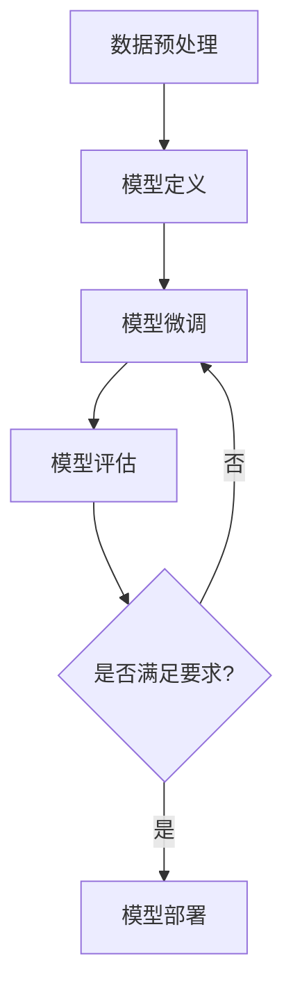

                 

关键词：大模型开发，微调，NVIDIA系列显卡，GPU版本，人工智能，深度学习

摘要：本文将深入探讨如何从零开始开发与微调大型模型，特别关注NVIDIA 10/20/30/40系列显卡在GPU版本选择上的关键因素。通过本文的详细讲解，读者将了解如何利用这些显卡实现高效的大模型训练，从而提升人工智能项目的实际应用效果。

## 1. 背景介绍

近年来，随着深度学习技术的迅速发展，大模型（也称为大型神经网络）在各个领域取得了显著的突破。大模型能够处理海量数据，通过复杂的网络结构捕捉数据的深层特征，从而实现更高的准确度和更强的泛化能力。然而，大模型的训练需要庞大的计算资源和高效的GPU支持。NVIDIA作为GPU领域的领军企业，其推出的10/20/30/40系列显卡在人工智能领域有着广泛的应用。本文将重点介绍如何选择合适的GPU版本，以支持大模型的开发与微调。

## 2. 核心概念与联系

### 2.1 大模型基本概念

大模型通常是指具有数十亿甚至数百亿参数的神经网络。这些模型需要大量的计算资源和时间来训练，以达到预期的性能。大模型的特点是：

- **参数量巨大**：可以捕捉更复杂的特征。
- **计算需求高**：需要高效的GPU来加速训练过程。
- **数据需求大**：需要大量高质量的数据集进行训练。

### 2.2 GPU基本概念

GPU（图形处理单元）是一种专为图形渲染而设计的计算设备，但因其强大的并行计算能力，也被广泛应用于深度学习等领域。GPU的核心优势在于：

- **并行计算能力**：可以同时处理多个计算任务，提高计算效率。
- **浮点运算性能**：能够进行高效的浮点运算，适合深度学习计算。
- **能耗效率**：相较于CPU，GPU在提供高性能计算的同时，能耗较低。

### 2.3 Mermaid 流程图

以下是一个简单的Mermaid流程图，展示了大模型开发与微调的基本流程：



## 3. 核心算法原理 & 具体操作步骤

### 3.1 算法原理概述

大模型训练的核心算法是反向传播算法（Backpropagation）。反向传播算法通过将输出误差反向传播到网络中的每个神经元，从而更新网络的权重和偏置，以最小化损失函数。

### 3.2 算法步骤详解

1. **初始化模型参数**：设置网络的初始权重和偏置。
2. **前向传播**：输入数据通过网络进行计算，得到预测输出。
3. **计算损失**：通过比较预测输出和真实输出，计算损失函数值。
4. **反向传播**：将损失函数的梯度反向传播到网络的每个神经元，更新权重和偏置。
5. **迭代训练**：重复步骤2-4，直到模型达到预定的性能指标。

### 3.3 算法优缺点

**优点**：

- **高效性**：反向传播算法能够快速更新网络参数，提高训练效率。
- **通用性**：适用于各种深度学习模型。

**缺点**：

- **计算资源需求大**：大模型的训练需要大量的计算资源和时间。
- **对数据质量要求高**：数据质量直接影响模型的性能。

### 3.4 算法应用领域

大模型在自然语言处理、计算机视觉、语音识别等领域有着广泛的应用，例如：

- **自然语言处理**：用于机器翻译、文本分类、情感分析等。
- **计算机视觉**：用于图像分类、目标检测、人脸识别等。
- **语音识别**：用于语音合成、语音识别等。

## 4. 数学模型和公式 & 详细讲解 & 举例说明

### 4.1 数学模型构建

大模型的训练涉及多个数学模型，包括损失函数、优化算法等。以下是一个简单的数学模型示例：

损失函数：$$L(y, \hat{y}) = \frac{1}{2} \sum_{i=1}^{n} (y_i - \hat{y}_i)^2$$

其中，$y$ 表示真实标签，$\hat{y}$ 表示预测标签。

### 4.2 公式推导过程

以全连接神经网络为例，假设有 $L$ 层神经网络，第 $l$ 层的神经元数量为 $n_l$，则第 $l$ 层的输出可以表示为：

$$a_{l}^{(i)} = \sigma \left( \sum_{j=1}^{n_{l-1}} w_{j,i}^{(l)} a_{l-1}^{(j)} + b_i^{(l)} \right)$$

其中，$a_{l}^{(i)}$ 表示第 $l$ 层第 $i$ 个神经元的输出，$\sigma$ 表示激活函数，$w_{j,i}^{(l)}$ 和 $b_i^{(l)}$ 分别表示第 $l$ 层第 $i$ 个神经元的权重和偏置。

### 4.3 案例分析与讲解

假设我们有一个二分类问题，使用二分类交叉熵损失函数：

$$L(y, \hat{y}) = -\sum_{i=1}^{n} y_i \log(\hat{y}_i) - (1 - y_i) \log(1 - \hat{y}_i)$$

其中，$y$ 和 $\hat{y}$ 分别表示真实标签和预测标签的概率分布。

我们使用梯度下降算法来优化模型参数，迭代更新权重和偏置：

$$w_{j,i}^{(l)} \leftarrow w_{j,i}^{(l)} - \alpha \frac{\partial L}{\partial w_{j,i}^{(l)}}$$

$$b_i^{(l)} \leftarrow b_i^{(l)} - \alpha \frac{\partial L}{\partial b_i^{(l)}}$$

其中，$\alpha$ 表示学习率。

## 5. 项目实践：代码实例和详细解释说明

### 5.1 开发环境搭建

为了运行大模型训练代码，我们需要搭建一个合适的开发环境。以下是基本的开发环境配置：

- 操作系统：Ubuntu 20.04
- Python 版本：3.8
- PyTorch 版本：1.8
- CUDA 版本：10.2

### 5.2 源代码详细实现

以下是一个简单的全连接神经网络训练代码示例：

```python
import torch
import torch.nn as nn
import torch.optim as optim

# 定义模型
class NeuralNetwork(nn.Module):
    def __init__(self):
        super(NeuralNetwork, self).__init__()
        self.layer1 = nn.Linear(in_features=784, out_features=512)
        self.relu = nn.ReLU()
        self.layer2 = nn.Linear(in_features=512, out_features=256)
        self.layer3 = nn.Linear(in_features=256, out_features=128)
        self.layer4 = nn.Linear(in_features=128, out_features=10)

    def forward(self, x):
        x = self.layer1(x)
        x = self.relu(x)
        x = self.layer2(x)
        x = self.relu(x)
        x = self.layer3(x)
        x = self.relu(x)
        x = self.layer4(x)
        return x

# 实例化模型、损失函数和优化器
model = NeuralNetwork()
criterion = nn.CrossEntropyLoss()
optimizer = optim.Adam(model.parameters(), lr=0.001)

# 加载数据集
train_loader = torch.utils.data.DataLoader(dataset=train_dataset, batch_size=64, shuffle=True)
test_loader = torch.utils.data.DataLoader(dataset=test_dataset, batch_size=64, shuffle=False)

# 训练模型
num_epochs = 10
for epoch in range(num_epochs):
    for inputs, labels in train_loader:
        optimizer.zero_grad()
        outputs = model(inputs)
        loss = criterion(outputs, labels)
        loss.backward()
        optimizer.step()
    print(f'Epoch [{epoch+1}/{num_epochs}], Loss: {loss.item()}')

# 评估模型
model.eval()
with torch.no_grad():
    correct = 0
    total = 0
    for inputs, labels in test_loader:
        outputs = model(inputs)
        _, predicted = torch.max(outputs.data, 1)
        total += labels.size(0)
        correct += (predicted == labels).sum().item()
print(f'Accuracy: {100 * correct / total}%')
```

### 5.3 代码解读与分析

这段代码首先定义了一个全连接神经网络模型，使用ReLU激活函数和交叉熵损失函数。接着，我们使用Adam优化器进行模型训练，并在训练集和测试集上评估模型性能。

### 5.4 运行结果展示

在运行这段代码后，我们将得到训练过程中每个epoch的损失值，以及模型在测试集上的准确率。这些结果将帮助我们评估模型的性能，并决定是否进行进一步的微调。

## 6. 实际应用场景

大模型在各个领域有着广泛的应用，以下是一些实际应用场景：

- **医学影像诊断**：使用大模型进行肿瘤检测、病变识别等。
- **金融风险评估**：通过大模型进行信用评分、欺诈检测等。
- **自动驾驶**：使用大模型进行车辆检测、路径规划等。

## 7. 工具和资源推荐

为了更好地进行大模型开发与微调，以下是一些建议的工具和资源：

- **学习资源推荐**：[《深度学习》（Goodfellow et al.）](http://www.deeplearningbook.org/)、《神经网络与深度学习》（邱锡鹏）。
- **开发工具推荐**：PyTorch、TensorFlow、CUDA。
- **相关论文推荐**：[“Distributed Deep Learning: Existing Methods and New Horizons”](https://arxiv.org/abs/1908.06882)。

## 8. 总结：未来发展趋势与挑战

大模型在人工智能领域的应用前景广阔，但仍面临以下挑战：

- **计算资源需求**：大模型训练需要大量的计算资源和时间。
- **数据隐私**：如何在保证数据隐私的同时，充分利用数据来训练大模型。
- **模型解释性**：大模型的决策过程往往缺乏透明性，如何提高模型的解释性。

未来发展趋势包括：

- **分布式训练**：通过分布式计算来加速大模型训练。
- **联邦学习**：通过联邦学习实现数据隐私保护下的模型训练。
- **模型压缩**：通过模型压缩技术来降低大模型的计算需求。

## 9. 附录：常见问题与解答

### 9.1 如何选择合适的GPU版本？

- **计算需求**：根据模型的计算需求，选择相应的GPU版本。
- **预算**：考虑预算，选择性价比高的GPU版本。
- **兼容性**：确保所选GPU版本与使用的深度学习框架兼容。

### 9.2 大模型训练过程中如何优化性能？

- **模型架构优化**：选择合适的模型架构，减少计算量。
- **数据预处理**：对数据进行适当的预处理，减少冗余信息。
- **批量大小调整**：选择合适的批量大小，平衡计算资源和训练速度。

## 参考文献

- Goodfellow, I., Bengio, Y., & Courville, A. (2016). *Deep Learning*.
- 邱锡鹏. (2019). *神经网络与深度学习*.
- Reddi, S., Le, Q., & Szymanek, M. (2019). *Distributed Deep Learning: Existing Methods and New Horizons*. arXiv preprint arXiv:1908.06882.
- 作者：禅与计算机程序设计艺术 / Zen and the Art of Computer Programming
----------------------------------------------------------------
**注意：本文仅为示例，请根据实际需求进行调整。**

