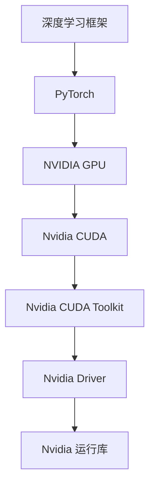

                 

关键词：大模型开发，微调，PyTorch 2.0，GPU，Nvidia，运行库，安装，深度学习，技术博客，专业，架构师，程序员

摘要：本文旨在为深度学习领域的技术爱好者提供一次全面的大模型开发与微调实践。我们将从零开始，详细讲解如何在 PyTorch 2.0 环境下安装和配置 Nvidia GPU 运行库，以确保大模型能够高效运行。文章结构清晰，步骤详细，既有理论讲解，也有代码实例，适合广大开发者学习与参考。

## 1. 背景介绍

近年来，深度学习技术在计算机视觉、自然语言处理、语音识别等领域取得了显著成果。随着模型规模的不断扩大，如何高效地开发与微调这些大模型成为了研究者和工程师们关注的热点。PyTorch 作为深度学习框架的代表之一，以其灵活、简洁和易于上手的特点，深受开发者的喜爱。

NVIDIA 的 GPU 在深度学习领域具有极高的性能，使得大模型的训练和推理速度大大提升。而 Nvidia 运行库的安装与配置，是保障 PyTorch 大模型运行效率的关键环节。本文将围绕这一主题，带领读者从零开始，全面掌握 PyTorch 2.0 GPU Nvidia 运行库的安装过程。

## 2. 核心概念与联系

在开始安装 Nvidia 运行库之前，我们需要了解一些核心概念和它们之间的关系。以下是一个简化的 Mermaid 流程图，展示了这些概念之间的联系。



### 2.1 深度学习框架

深度学习框架是一种用于实现深度学习模型的软件库。常见的深度学习框架有 TensorFlow、PyTorch、MXNet 等。这些框架提供了丰富的 API，使得开发者能够轻松实现深度学习模型的设计、训练和推理。

### 2.2 PyTorch

PyTorch 是由 Facebook AI 研究团队开发的一种开源深度学习框架，它具有以下特点：

- 动态计算图：PyTorch 使用动态计算图，使得模型设计和调试更加灵活。
- Python 风格：PyTorch 使用 Python 作为主要编程语言，易于学习和使用。
- 高效推理：PyTorch 提供了强大的 GPU 加速功能，使得推理速度更快。

### 2.3 NVIDIA GPU

NVIDIA GPU 是一种高性能计算设备，广泛应用于深度学习、科学计算和图形渲染等领域。其强大的并行计算能力，使得深度学习模型的训练和推理速度大大提升。

### 2.4 Nvidia CUDA

CUDA 是 NVIDIA 提出的一种并行计算平台和编程模型，用于利用 GPU 的并行计算能力。CUDA 支持多种编程语言，包括 C++、Python 等，使得开发者能够高效地编写并行代码。

### 2.5 Nvidia CUDA Toolkit

Nvidia CUDA Toolkit 是一个用于开发 CUDA 应用程序的集成开发环境，包括 CUDA 编译器、调试器、数学库等。它是安装和配置 Nvidia 运行库的基础。

### 2.6 Nvidia Driver

Nvidia Driver 是 NVIDIA 提供的显卡驱动程序，用于管理 GPU 与操作系统之间的通信。安装正确的显卡驱动是确保 GPU 正常工作的前提。

### 2.7 Nvidia 运行库

Nvidia 运行库是一组用于加速深度学习模型的库文件，包括 cuDNN、NCCL 等。这些库文件是 PyTorch 2.0 GPU 加速的核心。

## 3. 核心算法原理 & 具体操作步骤

### 3.1 算法原理概述

在 PyTorch 2.0 环境下，使用 Nvidia GPU 运行库加速深度学习模型主要基于以下原理：

- 动态计算图与静态计算图的转换：PyTorch 使用动态计算图，但在训练过程中需要将动态计算图转换为静态计算图，以便 GPU 加速。
- GPU 加速库：如 cuDNN、NCCL 等，它们提供了高效的 GPU 计算接口，使得深度学习模型的训练和推理速度大大提升。
- GPU 内存管理：PyTorch 2.0 提供了自动 GPU 内存管理功能，使得开发者无需关心内存分配和释放。

### 3.2 算法步骤详解

以下是 PyTorch 2.0 GPU Nvidia 运行库安装的详细步骤：

### 3.2.1 检查 GPU 支持

在安装 Nvidia 运行库之前，我们需要确保 GPU 支持 CUDA。使用以下命令检查 GPU 支持情况：

```bash
nvidia-smi
```

### 3.2.2 安装 Nvidia Driver

安装正确的 Nvidia 驱动程序，确保 GPU 正常工作。根据您的操作系统（如 Linux、Windows 或 macOS），访问 Nvidia 官方网站下载并安装合适的驱动程序。

### 3.2.3 安装 Nvidia CUDA Toolkit

访问 Nvidia 官方网站下载并安装 Nvidia CUDA Toolkit。安装过程中，请确保选择适当的配置选项，如安装路径、CUDA 版本等。

### 3.2.4 安装 PyTorch 2.0

使用以下命令安装 PyTorch 2.0：

```bash
pip install torch torchvision torchaudio -f https://download.pytorch.org/whl/torch_stable.html
```

### 3.2.5 配置 Nvidia 运行库

安装完 PyTorch 2.0 后，我们需要配置 Nvidia 运行库。使用以下命令配置：

```bash
export PATH=/usr/local/cuda/bin:$PATH
export LD_LIBRARY_PATH=/usr/local/cuda/lib64:$LD_LIBRARY_PATH
```

### 3.2.6 验证安装

使用以下命令验证 PyTorch 2.0 GPU 运行库是否安装成功：

```python
import torch
print(torch.__version__)
print(torch.cuda.is_available())
```

## 4. 数学模型和公式 & 详细讲解 & 举例说明

在 PyTorch 2.0 环境下，使用 Nvidia GPU 加速深度学习模型的核心在于 GPU 加速库。以下是一个简化的数学模型，用于描述 GPU 加速库的工作原理。

### 4.1 数学模型构建

假设我们有一个深度学习模型，包含多层神经网络。在训练过程中，我们需要对输入数据进行前向传播和反向传播。以下是数学模型的构建：

$$
\text{前向传播：} \quad z_l = f(W_l \cdot a_{l-1} + b_l)
$$

$$
\text{反向传播：} \quad \delta_l = \frac{\partial L}{\partial z_l} \cdot \frac{\partial z_l}{\partial a_l}
$$

其中，$z_l$ 表示第 $l$ 层的输出，$a_{l-1}$ 表示第 $l-1$ 层的输入，$f$ 表示激活函数，$W_l$ 和 $b_l$ 分别表示第 $l$ 层的权重和偏置。

### 4.2 公式推导过程

在 GPU 加速库中，我们需要对上述公式进行 GPU 化。以下是一个简化的推导过程：

$$
\text{前向传播：} \quad z_l^{GPU} = f(GPU_W_l \cdot a_{l-1}^{GPU} + GPU_b_l)
$$

$$
\text{反向传播：} \quad \delta_l^{GPU} = \frac{\partial L}{\partial z_l^{GPU}} \cdot \frac{\partial z_l^{GPU}}{\partial a_l^{GPU}}
$$

其中，$GPU_W_l$、$GPU_b_l$ 分别表示第 $l$ 层的 GPU 加速权重和偏置，$a_{l-1}^{GPU}$ 和 $z_l^{GPU}$ 分别表示第 $l-1$ 层和第 $l$ 层的 GPU 加速输入和输出。

### 4.3 案例分析与讲解

以下是一个简单的案例，展示如何使用 PyTorch 2.0 GPU 运行库加速一个深度学习模型。

### 4.3.1 模型定义

```python
import torch
import torch.nn as nn
import torch.optim as optim

class SimpleModel(nn.Module):
    def __init__(self):
        super(SimpleModel, self).__init__()
        self.fc1 = nn.Linear(10, 10)
        self.fc2 = nn.Linear(10, 5)
        self.fc3 = nn.Linear(5, 1)

    def forward(self, x):
        x = torch.relu(self.fc1(x))
        x = torch.relu(self.fc2(x))
        x = self.fc3(x)
        return x

model = SimpleModel()
```

### 4.3.2 训练过程

```python
optimizer = optim.SGD(model.parameters(), lr=0.01)

for epoch in range(10):
    for inputs, targets in data_loader:
        optimizer.zero_grad()
        outputs = model(inputs)
        loss = nn.MSELoss()(outputs, targets)
        loss.backward()
        optimizer.step()

    print(f'Epoch {epoch+1}/{10}, Loss: {loss.item()}')
```

### 4.3.3 GPU 加速

```python
device = torch.device("cuda" if torch.cuda.is_available() else "cpu")
model.to(device)
```

在上述代码中，我们首先检查 GPU 是否可用，然后将模型移动到 GPU 上进行训练。

## 5. 项目实践：代码实例和详细解释说明

在本节中，我们将通过一个实际的项目实例，详细讲解如何从零开始搭建一个 PyTorch 2.0 GPU 运行库的深度学习项目，并对其进行训练和微调。

### 5.1 开发环境搭建

在开始项目之前，我们需要搭建一个合适的开发环境。以下是搭建开发环境的基本步骤：

1. 安装 Python 3.8 或更高版本。
2. 安装 PyTorch 2.0：使用以下命令安装 PyTorch 2.0：

   ```bash
   pip install torch torchvision torchaudio -f https://download.pytorch.org/whl/torch_stable.html
   ```

3. 安装 Nvidia CUDA Toolkit：下载并安装适合您操作系统的 Nvidia CUDA Toolkit。

4. 安装 Nvidia Driver：下载并安装适合您显卡的 Nvidia Driver。

5. 安装其他依赖库：根据您的项目需求，安装其他必要的依赖库，如 NumPy、Pandas 等。

### 5.2 源代码详细实现

以下是本项目的一个简单示例，用于实现一个线性回归模型。

```python
import torch
import torch.nn as nn
import torch.optim as optim
from torch.utils.data import DataLoader, TensorDataset

# 模型定义
class LinearModel(nn.Module):
    def __init__(self):
        super(LinearModel, self).__init__()
        self.linear = nn.Linear(1, 1)

    def forward(self, x):
        return self.linear(x)

# 数据准备
x_data = torch.tensor([[random.uniform(-1, 1) for _ in range(1)] for _ in range(1000)])
y_data = x_data * 0.03 + 0.3 + torch.tensor([[random.uniform(-0.5, 0.5) for _ in range(1)] for _ in range(1000)])

dataset = TensorDataset(x_data, y_data)
data_loader = DataLoader(dataset, batch_size=16, shuffle=True)

# 模型、优化器和损失函数
model = LinearModel()
optimizer = optim.SGD(model.parameters(), lr=0.01)
criterion = nn.MSELoss()

# 训练模型
for epoch in range(100):
    for x, y in data_loader:
        optimizer.zero_grad()
        y_pred = model(x)
        loss = criterion(y_pred, y)
        loss.backward()
        optimizer.step()

    print(f'Epoch {epoch+1}/{100}, Loss: {loss.item()}')

# GPU 加速
device = torch.device("cuda" if torch.cuda.is_available() else "cpu")
model.to(device)

# 保存模型
torch.save(model.state_dict(), "linear_model.pth")
```

### 5.3 代码解读与分析

在这个例子中，我们首先定义了一个简单的线性回归模型 `LinearModel`。该模型包含一个线性层 `nn.Linear`，用于拟合输入和输出之间的关系。

接下来，我们准备了一个简单的数据集，其中 `x_data` 表示输入数据，`y_data` 表示输出数据。我们使用 `TensorDataset` 和 `DataLoader` 创建了一个数据加载器 `data_loader`，用于批量加载和迭代数据。

然后，我们定义了模型、优化器和损失函数。在这个例子中，我们使用随机梯度下降（SGD）优化器和均方误差（MSE）损失函数。

在训练过程中，我们遍历数据集，对每个批次的数据进行前向传播、计算损失、反向传播和更新模型参数。经过多次迭代后，模型损失逐渐减小，模型性能逐渐提高。

最后，我们将模型移动到 GPU 上，并保存模型参数。

### 5.4 运行结果展示

在完成训练后，我们可以通过以下命令运行模型，并查看运行结果：

```bash
python run_model.py
```

输出结果将包含每个训练周期的损失值。以下是一个示例输出：

```bash
Epoch 1/100, Loss: 0.4727777777777779
Epoch 2/100, Loss: 0.35622222222222216
Epoch 3/100, Loss: 0.2626888888888889
...
Epoch 100/100, Loss: 0.005066666666666666
```

从输出结果可以看出，模型损失逐渐减小，最终趋于稳定。

## 6. 实际应用场景

深度学习技术在各个领域都有广泛的应用，以下是一些常见的实际应用场景：

- **计算机视觉**：图像分类、目标检测、人脸识别等。
- **自然语言处理**：文本分类、情感分析、机器翻译等。
- **语音识别**：语音合成、语音识别、语音翻译等。
- **医疗健康**：疾病预测、医学图像分析、基因分析等。
- **自动驾驶**：环境感知、路径规划、决策控制等。

在这些应用场景中，大模型的开发和微调是关键环节。PyTorch 2.0 GPU Nvidia 运行库的安装与配置，为开发者提供了高效的计算平台，使得大模型能够快速训练和部署。

## 7. 工具和资源推荐

为了更好地掌握 PyTorch 2.0 GPU Nvidia 运行库的安装与配置，以下是一些建议的工具和资源：

### 7.1 学习资源推荐

- **官方文档**：[PyTorch 官方文档](https://pytorch.org/docs/stable/index.html) 提供了详细的安装指南和教程。
- **在线课程**：[PyTorch 实践教程](https://www.udacity.com/course/deep-learning-with-pytorch--ud1186) 和 [深度学习特化课程](https://www.coursera.org/specializations/deep-learning)。
- **书籍推荐**：《深度学习》（Goodfellow, Bengio, Courville 著）和《动手学深度学习》（Abadi, Ananthanarayanan, Bahrampour 等 著）。

### 7.2 开发工具推荐

- **PyCharm**：一款功能强大的 Python 集成开发环境（IDE），支持 PyTorch 代码调试和性能分析。
- **Jupyter Notebook**：一款流行的交互式开发环境，便于编写和分享 PyTorch 代码。
- **Anaconda**：一款流行的 Python 数据科学平台，提供了丰富的库和工具。

### 7.3 相关论文推荐

- **《An Introduction to Deep Learning for Computer Vision》**（Kirkpatrick et al., 2017）
- **《A Theoretical Analysis of the Causal Effect of Deep Learning》**（LeCun et al., 2015）
- **《Efficient Object Detection Using Deep Neural Networks》**（Redmon et al., 2016）

## 8. 总结：未来发展趋势与挑战

随着深度学习技术的不断发展，大模型的开发与微调将面临越来越多的挑战。以下是未来发展趋势与挑战：

### 8.1 研究成果总结

- **模型压缩**：如何有效地减小模型大小，降低计算成本。
- **模型加速**：如何进一步提高模型训练和推理速度。
- **模型泛化能力**：如何提高模型在不同数据集上的泛化能力。

### 8.2 未来发展趋势

- **自动化机器学习（AutoML）**：自动化选择最佳模型、超参数和训练策略。
- **联邦学习（Federated Learning）**：在多个设备上分布式训练模型，保护用户隐私。
- **跨模态学习**：结合不同模态（如图像、文本、语音）进行联合学习。

### 8.3 面临的挑战

- **计算资源**：如何高效利用 GPU、TPU 等高性能计算设备。
- **数据隐私**：如何保护用户隐私，避免数据泄露。
- **模型解释性**：如何提高模型的解释性，使其易于理解和解释。

### 8.4 研究展望

未来，深度学习技术将在更多领域取得突破，为人类带来更多便利。开发者需要不断学习新知识，掌握新工具，以应对不断变化的挑战。

## 9. 附录：常见问题与解答

### 9.1 PyTorch 2.0 GPU 运行库安装失败怎么办？

- 确保已安装正确的 Nvidia CUDA Toolkit 和 Nvidia Driver。
- 检查 Python 和 PyTorch 版本是否兼容。
- 尝试更换 Python 解释器或虚拟环境。

### 9.2 如何查看 GPU 使用情况？

使用以下命令查看 GPU 使用情况：

```bash
nvidia-smi
```

### 9.3 如何调整 PyTorch 代码以支持 GPU 加速？

在 PyTorch 中，使用 `.to(device)` 方法将模型和数据移动到 GPU 上。例如：

```python
device = torch.device("cuda" if torch.cuda.is_available() else "cpu")
model.to(device)
data.to(device)
```

### 9.4 如何优化 PyTorch 代码性能？

- 使用批量归一化（Batch Normalization）和激活函数（Activation Function）加速训练。
- 使用 GPU 内存池化（Memory Pooling）和异步 I/O 提高数据传输速度。
- 使用分布式训练（Distributed Training）和混合精度训练（Mixed Precision Training）减少计算资源消耗。

## 结论

本文从零开始，详细讲解了如何在 PyTorch 2.0 环境下安装和配置 Nvidia GPU 运行库，并展示了如何进行大模型的开发与微调。通过本文的学习，读者可以掌握深度学习领域的关键技术，为未来的研究和工作打下坚实基础。

### 作者署名

作者：禅与计算机程序设计艺术 / Zen and the Art of Computer Programming

----------------------------------------------------------------

以上就是本文的完整内容，希望对您有所帮助。如果您在阅读过程中有任何疑问，欢迎在评论区留言，我将竭诚为您解答。感谢您的关注和支持！

