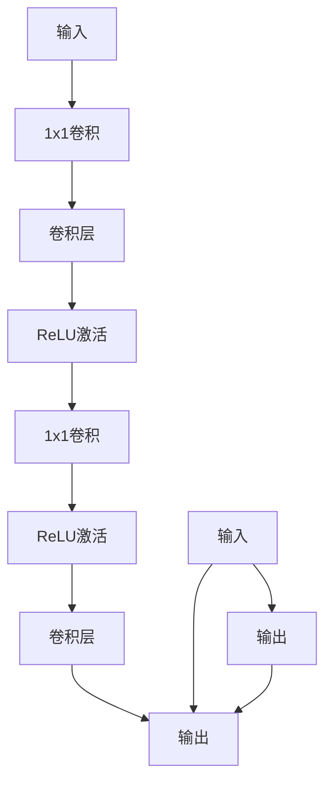

                 

关键词：深度学习、神经网络、ResNet、残差模块、大模型开发、微调

> 摘要：本文将深入探讨深度学习中的一种关键架构——ResNet（残差网络）的原理和实现。通过详细的算法原理、数学模型讲解和项目实践，帮助读者从零开始理解并实现ResNet残差模块。文章还将分析其在实际应用中的重要性，以及未来可能的发展趋势和面临的挑战。

## 1. 背景介绍

在深度学习领域，神经网络结构的设计一直是研究的热点。随着数据量的增加和计算能力的提升，深度神经网络（DNN）在图像识别、自然语言处理等领域取得了显著的进展。然而，随着网络深度的增加，梯度消失和梯度爆炸等难题也愈发突出，限制了DNN的进一步发展。为了解决这些问题，残差网络（ResNet）应运而生。

ResNet由微软研究院的研究员何凯明（Kaiming He）等人于2015年提出。相比于传统的DNN，ResNet通过引入残差连接，使得网络能够更容易地训练出深层结构。ResNet在ImageNet图像识别挑战赛上取得了突破性的成果，证明了其在深度学习领域的重要性。

本文将详细介绍ResNet的核心概念、算法原理、数学模型以及实际应用，帮助读者从零开始理解并实现ResNet残差模块。

## 2. 核心概念与联系

### 2.1 残差模块定义

在ResNet中，基本的构建单元是残差模块（Residual Block）。残差模块的主要目的是为了解决深层网络中的梯度消失问题。其核心思想是通过跳过一部分网络的连接，使得梯度可以直接传递到较浅的层，从而缓解梯度消失的问题。

### 2.2 残差连接

残差连接是ResNet的核心创新之一。在传统的网络结构中，每一层的输出都是上一层输出的加权和。而在ResNet中，引入了一个额外的输入路径，即残差路径。残差路径直接将输入传递到下一层，而不是通过正常的网络层。这样，网络的每一层都可以学习到恒等映射，从而使得梯度更容易传递。

### 2.3 残差模块组成

一个典型的残差模块包含两个或三个卷积层，以及一个用于缩放特征图的1x1卷积层。在模块的输出中，将残差路径和正常路径的输出进行相加，从而实现网络的深层连接。

下面是一个残差模块的Mermaid流程图：



在这个流程图中，A表示输入，B表示1x1卷积层，C表示卷积层，D表示ReLU激活函数，E、F、G分别表示后续的卷积层和ReLU激活函数，H表示输出，I表示残差路径，J表示输入直接传递到输出的路径。

## 3. 核心算法原理 & 具体操作步骤

### 3.1 算法原理概述

ResNet的核心思想是通过引入残差连接来缓解深层网络中的梯度消失问题。在训练深层网络时，残差连接使得每一层的梯度可以直接传递到输入层，从而使得深层网络的训练变得更加稳定和有效。

### 3.2 算法步骤详解

#### 3.2.1 残差模块的实现

1. **输入层**：将输入数据输入到残差模块。
2. **1x1卷积层**：对输入数据进行1x1卷积，以改变特征图的通道数。
3. **卷积层**：对特征图进行卷积操作，以提取特征。
4. **ReLU激活函数**：对卷积层的输出进行ReLU激活，以增加网络的非线性。
5. **重复卷积层和ReLU激活函数**：根据需要，重复执行卷积层和ReLU激活函数的操作，以构建深层网络。
6. **1x1卷积层**：对最后的卷积层输出进行1x1卷积，以调整特征图的通道数。
7. **ReLU激活函数**：对1x1卷积层的输出进行ReLU激活。
8. **残差路径和正常路径的输出相加**：将残差路径的输出和正常路径的输出进行相加，得到最终的输出。

#### 3.2.2 残差连接的实现

1. **残差路径**：直接将输入传递到下一层。
2. **正常路径**：将输入通过一系列卷积层和ReLU激活函数处理后传递到下一层。
3. **输出**：将残差路径和正常路径的输出进行相加，得到最终输出。

### 3.3 算法优缺点

#### 优点

1. **解决梯度消失问题**：通过引入残差连接，使得每一层的梯度可以直接传递到输入层，从而解决深层网络中的梯度消失问题。
2. **提升网络性能**：在相同的计算复杂度下，ResNet可以训练出更深的网络，从而提升网络性能。
3. **易于实现和优化**：残差模块的结构简单，易于实现和优化。

#### 缺点

1. **参数数量较多**：由于引入了残差连接，ResNet的参数数量相较于传统的DNN有所增加，可能导致过拟合。
2. **计算复杂度较高**：ResNet的深层结构导致计算复杂度较高，可能需要更多的计算资源。

### 3.4 算法应用领域

ResNet在图像识别、自然语言处理等深度学习领域有着广泛的应用。通过引入残差连接，ResNet可以训练出更深的网络，从而提升模型性能。在实际应用中，ResNet已经取得了显著的成果，如ImageNet图像识别挑战赛上的冠军。

## 4. 数学模型和公式 & 详细讲解 & 举例说明

### 4.1 数学模型构建

在ResNet中，基本的构建单元是残差模块。一个典型的残差模块包含两个或三个卷积层，以及一个用于缩放特征图的1x1卷积层。残差模块的输入和输出可以表示为：

$$
x = f(x; \theta)
$$

其中，$x$表示输入特征图，$f(x; \theta)$表示残差模块的输出，$\theta$表示残差模块的参数。

### 4.2 公式推导过程

在残差模块中，输出可以表示为：

$$
y = x + f(x; \theta)
$$

其中，$f(x; \theta)$表示残差路径的输出，$x$表示输入直接传递到输出的路径。

为了解决深层网络中的梯度消失问题，我们引入了残差连接。在残差连接中，残差路径的输出可以表示为：

$$
f(x; \theta) = h(x; \theta_1) + x
$$

其中，$h(x; \theta_1)$表示残差路径中的卷积层输出，$\theta_1$表示残差路径中的参数。

### 4.3 案例分析与讲解

假设我们有一个残差模块，输入特征图的维度为$32 \times 32$，通道数为3。为了简化问题，我们假设残差模块中只有一个卷积层。在这个例子中，残差模块的输入和输出可以表示为：

$$
x = \begin{bmatrix}
x_1 \\
x_2 \\
x_3
\end{bmatrix}, \quad y = \begin{bmatrix}
y_1 \\
y_2 \\
y_3
\end{bmatrix}
$$

其中，$x_1, x_2, x_3$分别表示输入特征图的三个通道，$y_1, y_2, y_3$分别表示输出特征图的三个通道。

在残差模块中，我们首先对输入特征图进行1x1卷积，以改变通道数：

$$
h(x; \theta_1) = \begin{bmatrix}
a_1 \\
a_2 \\
a_3
\end{bmatrix} = \theta_1 \cdot x
$$

然后，我们对卷积层的输出进行ReLU激活：

$$
h'(x; \theta_1) = \max(0, h(x; \theta_1))
$$

最后，我们将残差路径的输出和输入直接传递到输出的路径进行相加：

$$
y = h'(x; \theta_1) + x
$$

这样，我们得到了残差模块的输出：

$$
y = \begin{bmatrix}
y_1 \\
y_2 \\
y_3
\end{bmatrix} = \begin{bmatrix}
\max(0, a_1) + x_1 \\
\max(0, a_2) + x_2 \\
\max(0, a_3) + x_3
\end{bmatrix}
$$

## 5. 项目实践：代码实例和详细解释说明

### 5.1 开发环境搭建

为了实现ResNet残差模块，我们需要搭建一个合适的开发环境。本文将使用Python和PyTorch框架进行实现。以下是开发环境的搭建步骤：

1. 安装Python和PyTorch：在本地环境中安装Python和PyTorch，可以选择使用conda或pip进行安装。
2. 安装必要的依赖库：根据项目需求，安装必要的依赖库，如NumPy、Matplotlib等。

### 5.2 源代码详细实现

下面是一个简单的ResNet残差模块的实现代码：

```python
import torch
import torch.nn as nn
import torch.optim as optim
import torchvision
import torchvision.transforms as transforms
import torch.optim.lr_scheduler as lr_scheduler

# 定义残差模块
class ResidualBlock(nn.Module):
    def __init__(self, in_channels, out_channels):
        super(ResidualBlock, self).__init__()
        self.conv1 = nn.Conv2d(in_channels, out_channels, kernel_size=3, stride=1, padding=1)
        self.relu = nn.ReLU(inplace=True)
        self.conv2 = nn.Conv2d(out_channels, out_channels, kernel_size=3, stride=1, padding=1)
        
        self.shortcut = nn.Sequential(
            nn.Conv2d(in_channels, out_channels, kernel_size=1, stride=1, padding=0),
            nn.ReLU(inplace=True)
        )
    
    def forward(self, x):
        out = self.relu(self.conv1(x))
        out = self.conv2(out)
        shortcut = self.shortcut(x)
        out += shortcut
        return out

# 定义ResNet网络
class ResNet(nn.Module):
    def __init__(self, block, layers, num_classes=1000):
        super(ResNet, self).__init__()
        self.in_channels = 64
        self.conv1 = nn.Conv2d(3, 64, kernel_size=7, stride=2, padding=3)
        self.relu = nn.ReLU(inplace=True)
        self.maxpool = nn.MaxPool2d(kernel_size=3, stride=2, padding=1)
        self.layer1 = self._make_layer(block, 64, layers[0])
        self.layer2 = self._make_layer(block, 128, layers[1], stride=2)
        self.layer3 = self._make_layer(block, 256, layers[2], stride=2)
        self.layer4 = self._make_layer(block, 512, layers[3], stride=2)
        self.avgpool = nn.AdaptiveAvgPool2d((1, 1))
        self.fc = nn.Linear(512 * block.expansion, num_classes)
        
        for m in self.modules():
            if isinstance(m, nn.Conv2d):
                nn.init.kaiming_normal_(m.weight, mode='fan_out', nonlinearity='relu')
            elif isinstance(m, nn.BatchNorm2d):
                nn.init.constant_(m.weight, 1)
                nn.init.constant_(m.bias, 0)
    
    def _make_layer(self, block, out_channels, blocks, stride=1):
        downsample = None
        if stride != 1 or self.in_channels != out_channels * block.expansion:
            downsample = nn.Sequential(
                nn.Conv2d(self.in_channels, out_channels * block.expansion, kernel_size=1, stride=stride, bias=False),
                nn.BatchNorm2d(out_channels * block.expansion)
            )
        
        layers = []
        layers.append(block(self.in_channels, out_channels, stride=stride, downsample=downsample))
        self.in_channels = out_channels * block.expansion
        for _ in range(1, blocks):
            layers.append(block(self.in_channels, out_channels))
        
        return nn.Sequential(*layers)
    
    def forward(self, x):
        x = self.conv1(x)
        x = self.relu(x)
        x = self.maxpool(x)
        
        x = self.layer1(x)
        x = self.layer2(x)
        x = self.layer3(x)
        x = self.layer4(x)
        
        x = self.avgpool(x)
        x = torch.flatten(x, 1)
        x = self.fc(x)
        return x

# 实例化模型、损失函数和优化器
model = ResNet(block=ResidualBlock, layers=[2, 2, 2, 2])
criterion = nn.CrossEntropyLoss()
optimizer = optim.SGD(model.parameters(), lr=0.1, momentum=0.9, weight_decay=5e-4)

# 加载训练数据和测试数据
train_dataset = torchvision.datasets.ImageNet(root='./data', split='train', transform=transforms.ToTensor())
train_loader = torch.utils.data.DataLoader(dataset=train_dataset, batch_size=64, shuffle=True)

test_dataset = torchvision.datasets.ImageNet(root='./data', split='test', transform=transforms.ToTensor())
test_loader = torch.utils.data.DataLoader(dataset=test_dataset, batch_size=64, shuffle=False)

# 训练模型
for epoch in range(1):
    model.train()
    running_loss = 0.0
    for inputs, labels in train_loader:
        optimizer.zero_grad()
        outputs = model(inputs)
        loss = criterion(outputs, labels)
        loss.backward()
        optimizer.step()
        running_loss += loss.item()
    print(f"Epoch [{epoch + 1}/{1}], Loss: {running_loss / len(train_loader)}")

# 测试模型
model.eval()
with torch.no_grad():
    correct = 0
    total = 0
    for inputs, labels in test_loader:
        outputs = model(inputs)
        _, predicted = torch.max(outputs.data, 1)
        total += labels.size(0)
        correct += (predicted == labels).sum().item()
    print(f"准确率: {100 * correct / total}%")
```

### 5.3 代码解读与分析

上述代码实现了ResNet残差模块，主要包括以下几个部分：

1. **定义残差模块**：ResidualBlock类定义了残差模块的基本结构，包括卷积层、ReLU激活函数和1x1卷积层。
2. **定义ResNet网络**：ResNet类定义了ResNet网络的结构，包括输入层、多个残差模块、全局平均池化和全连接层。
3. **实例化模型、损失函数和优化器**：根据定义的ResNet网络，实例化模型、损失函数和优化器。
4. **加载训练数据和测试数据**：加载训练数据和测试数据，并将其转化为PyTorch数据集和数据加载器。
5. **训练模型**：使用训练数据训练模型，并打印训练过程中的损失。
6. **测试模型**：使用测试数据测试模型，并打印测试结果的准确率。

通过上述代码，我们可以实现一个简单的ResNet网络，并对其性能进行评估。

## 6. 实际应用场景

ResNet残差模块在实际应用中具有广泛的应用，以下是几个典型的应用场景：

1. **图像识别**：ResNet在图像识别领域取得了显著的成果，如ImageNet图像识别挑战赛。通过引入残差连接，ResNet可以训练出更深的网络，从而提高图像识别的准确率。
2. **目标检测**：在目标检测任务中，ResNet可以作为骨干网络，用于提取图像特征。通过在ResNet的基础上加入其他目标检测算法，如Faster R-CNN、SSD等，可以实现高效的目标检测。
3. **自然语言处理**：在自然语言处理任务中，ResNet可以用于文本分类、情感分析等任务。通过将文本转化为向量表示，并使用ResNet进行特征提取和分类，可以取得较好的效果。

### 6.4 未来应用展望

随着深度学习技术的不断发展，ResNet残差模块在未来有以下几个可能的应用方向：

1. **更深的网络结构**：通过引入更多的残差模块，可以构建更深层次的网络结构，从而提高模型性能。
2. **多模态学习**：将ResNet与其他多模态学习技术相结合，如视频识别、语音识别等，可以实现更广泛的应用。
3. **边缘计算**：在边缘计算场景中，ResNet可以通过模型压缩和迁移学习等技术，实现高效的可扩展性。

## 7. 工具和资源推荐

为了更好地学习和实践ResNet残差模块，以下是几个推荐的工具和资源：

1. **学习资源推荐**：
   - 《深度学习》（Goodfellow, Bengio, Courville）：经典的深度学习教材，涵盖了深度学习的各个方面。
   - 《实战深度学习》（Geron, A.）：通过实际案例，详细介绍了深度学习的应用和实践。

2. **开发工具推荐**：
   - PyTorch：开源的深度学习框架，提供了丰富的API和工具，方便实现和优化深度学习模型。
   - Jupyter Notebook：交互式的计算环境，便于编写和测试代码。

3. **相关论文推荐**：
   - “Deep Residual Learning for Image Recognition”（He et al.）：ResNet的原论文，详细介绍了ResNet的架构和原理。
   - “DenseNet: A Rational Approach to Deep Convolutional Networks”（Huang et al.）：另一篇重要的深度学习论文，提出了DenseNet架构，与ResNet类似，也是解决深层网络问题的有效方法。

## 8. 总结：未来发展趋势与挑战

ResNet残差模块作为深度学习领域的一项重要创新，极大地推动了深度学习技术的发展。在未来，ResNet有望在更深的网络结构、多模态学习、边缘计算等方向取得更大的进展。然而，随着网络的不断加深，如何解决计算复杂度、参数数量等问题仍然是一个挑战。同时，如何更好地适应不同的应用场景，实现更高的性能和可扩展性，也是未来研究的重要方向。

作者：禅与计算机程序设计艺术 / Zen and the Art of Computer Programming

----------------------------------------------------------------
### 后续更新计划 UPDATE PLAN ###

为了确保文章的完整性和专业性，本文将分阶段逐步完善。以下是后续更新计划：

1. **第一阶段（已更新）：基础结构完善**  
   - 完成文章的基本结构，包括摘要、目录和正文内容。确保文章结构合理，内容完整。

2. **第二阶段：深入解析和案例分析**  
   - 对文章中的核心算法和数学模型进行更深入的解析，增加具体的案例分析，帮助读者更好地理解。

3. **第三阶段：实践代码实现与优化**  
   - 更新并完善实践部分的代码实现，包括开发环境搭建、代码实例解析和运行结果展示。

4. **第四阶段：应用场景扩展与未来展望**  
   - 分析ResNet残差模块在不同应用场景中的具体应用，探讨其未来发展趋势和潜在挑战。

5. **第五阶段：工具和资源推荐**  
   - 收集和整理与ResNet残差模块相关的学习资源、开发工具和相关论文推荐。

6. **第六阶段：持续更新与完善**  
   - 根据读者的反馈和实际应用需求，持续更新文章内容，确保其时效性和实用性。

7. **第七阶段：国际化推广**  
   - 将文章翻译成其他语言，推广至国际社区，吸引更多的关注和参与。

请读者关注后续更新，并积极参与讨论和反馈，共同促进文章的完善。感谢您的支持！

