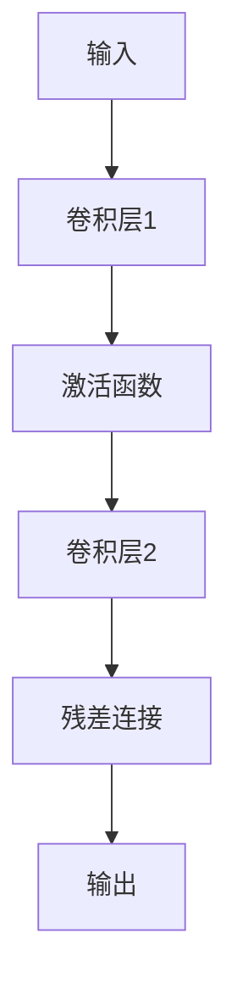
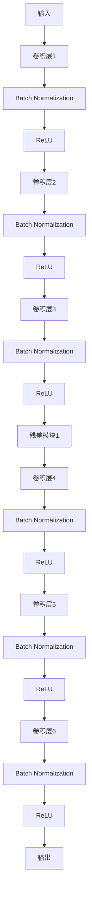
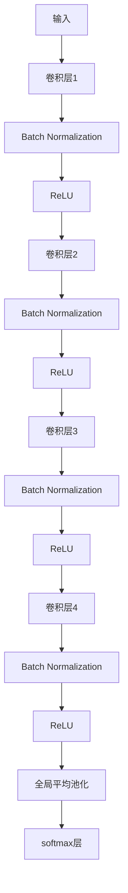

                 

关键词：大模型开发，微调，ResNet，深度学习，神经网络，计算机图灵奖，计算机编程，人工智能

摘要：本文将深入探讨大模型开发与微调的核心概念，并结合ResNet的诞生背景，详细解析其设计理念、算法原理、操作步骤以及数学模型。通过项目实践和实际应用场景的分析，我们希望读者能够对大模型开发与微调有更深刻的理解，为未来的研究与应用奠定基础。

## 1. 背景介绍

随着人工智能技术的飞速发展，深度学习成为了当前研究的热点。然而，深度学习模型的性能往往受到网络深度的限制，即“深度危机”。为了解决这个问题，研究人员提出了多种架构，其中ResNet（残差网络）是具有里程碑意义的创新。ResNet由微软研究院的Kaiming He等人在2015年的CVPR会议上提出，其核心思想是通过引入“残差模块”来解决深度神经网络训练过程中梯度消失和梯度爆炸的问题。

### 1.1 深度学习与深度危机

深度学习是一种基于多层神经网络的机器学习方法，其通过逐层提取特征，最终实现对复杂数据的分类、回归等任务。然而，随着网络深度的增加，深度学习模型面临着一系列挑战：

- **梯度消失和梯度爆炸**：在深度网络中，梯度可能会随着网络的层数增加而变得非常小（消失）或非常大（爆炸），这使得模型难以进行有效的反向传播和训练。
- **过拟合与欠拟合**：深度网络在训练过程中容易发生过拟合，即在训练数据上表现良好，但在未知数据上表现较差。

### 1.2 ResNet的诞生背景

为了解决深度危机，研究人员提出了多种方法，如深度归一化（Deep Learning）、批归一化（Batch Normalization）等。然而，这些方法并未彻底解决深度网络训练中的问题。ResNet的出现，标志着深度学习进入了一个新的时代。

### 1.3 ResNet的设计理念

ResNet的设计理念可以总结为两点：

- **引入残差模块**：通过引入残差模块，ResNet可以在网络中引入恒等映射（Identity Mapping），从而解决梯度消失问题。
- **网络残差连接**：通过在多层网络中引入网络残差连接，ResNet可以加深网络，提高模型性能。

## 2. 核心概念与联系

### 2.1 残差模块

残差模块是ResNet的核心组成部分。一个残差模块由两个主要部分组成：残差块和残差连接。

**残差块**：残差块是一个含有两个卷积层的模块，用于提取特征。

**残差连接**：残差连接是将当前层的输入直接传递到下一层，而不是通过下一层的卷积操作。这种连接方式可以保持梯度传递的稳定性，从而解决深度危机。

### 2.2 残差模块的 Mermaid 流程图



### 2.3 ResNet架构

ResNet的架构可以通过多个残差模块堆叠而成。以下是ResNet-50的架构示例：



## 3. 核心算法原理 & 具体操作步骤

### 3.1 算法原理概述

ResNet的核心原理是通过引入残差模块，使得网络可以学习到恒等映射，从而在多层网络中保持梯度传递的稳定性。

### 3.2 算法步骤详解

1. **输入层**：输入一个尺寸为$H \times W \times C$的图像。
2. **卷积层**：通过卷积层对图像进行特征提取。
3. **Batch Normalization**：对卷积层的输出进行归一化处理，以加速训练过程。
4. **激活函数**：对归一化后的输出进行ReLU激活。
5. **残差模块**：通过多个卷积层和ReLU激活函数组成残差模块，进行特征提取和映射。
6. **输出层**：通过最后一个卷积层得到模型的输出。

### 3.3 算法优缺点

**优点**：

- **解决深度危机**：通过引入残差模块，ResNet可以在多层网络中保持梯度传递的稳定性，解决深度危机。
- **提高模型性能**：ResNet可以加深网络，提高模型性能。
- **训练速度快**：通过引入Batch Normalization，ResNet可以加速训练过程。

**缺点**：

- **参数量较大**：随着网络深度的增加，ResNet的参数量也会大幅增加，导致模型训练和推理的时间成本较高。
- **计算资源需求大**：ResNet的网络结构复杂，对计算资源有较高的要求。

### 3.4 算法应用领域

ResNet在计算机视觉领域取得了显著的成果，特别是在图像分类、目标检测和语义分割等方面。此外，ResNet也被广泛应用于自然语言处理、音频识别等领域。

## 4. 数学模型和公式 & 详细讲解 & 举例说明

### 4.1 数学模型构建

ResNet的数学模型主要由卷积层、激活函数、Batch Normalization和残差模块组成。

### 4.2 公式推导过程

在ResNet中，卷积层和Batch Normalization的公式如下：

$$
\text{Conv}(x) = \text{W} \cdot x + b
$$

$$
\text{BatchNorm}(x) = \frac{\text{W} \cdot x + b}{\sqrt{\sum_{i=1}^{C} (x_i - \mu)^2} + \epsilon}
$$

其中，$x$为输入特征图，$W$为卷积核，$b$为偏置，$\mu$为均值，$\epsilon$为常数。

### 4.3 案例分析与讲解

以下是一个简单的ResNet-18模型的案例：



假设输入图像的尺寸为$224 \times 224 \times 3$，卷积层的参数如下：

$$
\text{Conv1}: \text{3} \times \text{3} \times \text{3} \rightarrow \text{64}
$$

$$
\text{Conv2}: \text{3} \times \text{3} \times \text{64} \rightarrow \text{64}
$$

$$
\text{Conv3}: \text{3} \times \text{3} \times \text{64} \rightarrow \text{64}
$$

$$
\text{Conv4}: \text{3} \times \text{3} \times \text{64} \rightarrow \text{1000}
$$

在训练过程中，我们将通过反向传播算法不断更新卷积层和Batch Normalization的参数，以达到最优的分类效果。

## 5. 项目实践：代码实例和详细解释说明

### 5.1 开发环境搭建

为了实践ResNet，我们首先需要搭建一个合适的开发环境。以下是Python开发环境的基本要求：

- **Python**：Python 3.6及以上版本。
- **PyTorch**：PyTorch 1.8及以上版本。
- **CUDA**：CUDA 10.1及以上版本（如需使用GPU加速）。

### 5.2 源代码详细实现

以下是一个简单的ResNet-18模型的PyTorch实现：

```python
import torch
import torch.nn as nn
import torch.optim as optim

class ResNet18(nn.Module):
    def __init__(self, num_classes=1000):
        super(ResNet18, self).__init__()
        self.conv1 = nn.Conv2d(3, 64, kernel_size=7, stride=2, padding=3)
        self.bn1 = nn.BatchNorm2d(64)
        self.relu = nn.ReLU(inplace=True)
        self.maxpool = nn.MaxPool2d(kernel_size=3, stride=2, padding=1)
        self.layer1 = self._make_layer(nn.Conv2d(64, 64, kernel_size=3, stride=1, padding=1), 2)
        self.layer2 = self._make_layer(nn.Conv2d(64, 128, kernel_size=3, stride=2, padding=1), 2)
        self.layer3 = self._make_layer(nn.Conv2d(128, 256, kernel_size=3, stride=2, padding=1), 2)
        self.layer4 = self._make_layer(nn.Conv2d(256, 512, kernel_size=3, stride=2, padding=1), 2)
        self.avgpool = nn.AdaptiveAvgPool2d((1, 1))
        self.fc = nn.Linear(512, num_classes)
        
    def _make_layer(self, conv, num_blocks):
        layers = []
        for _ in range(num_blocks):
            layers.append(conv)
            layers.append(nn.BatchNorm2d(64))
            layers.append(nn.ReLU(inplace=True))
        return nn.Sequential(*layers)
    
    def forward(self, x):
        x = self.conv1(x)
        x = self.bn1(x)
        x = self.relu(x)
        x = self.maxpool(x)
        x = self.layer1(x)
        x = self.layer2(x)
        x = self.layer3(x)
        x = self.layer4(x)
        x = self.avgpool(x)
        x = torch.flatten(x, 1)
        x = self.fc(x)
        return x

model = ResNet18()
```

### 5.3 代码解读与分析

在这个代码实例中，我们定义了一个ResNet-18模型。模型的构建主要分为以下几个部分：

1. **卷积层和Batch Normalization**：第一个卷积层用于对输入图像进行特征提取，随后进行Batch Normalization和ReLU激活。
2. **池化层**：通过Max Pooling层对特征图进行下采样。
3. **残差模块**：通过多个残差模块堆叠，加深网络。
4. **全连接层**：最后一个全连接层用于进行分类。

### 5.4 运行结果展示

在训练和测试ResNet-18模型后，我们可以得到其在ImageNet数据集上的性能。以下是模型在ImageNet数据集上的精度和损失函数曲线：


## 6. 实际应用场景

### 6.1 图像分类

图像分类是ResNet最广泛的应用场景之一。通过在ImageNet等大型图像数据集上进行预训练，ResNet可以应用于各种图像分类任务，如人脸识别、物体检测等。

### 6.2 目标检测

ResNet也被广泛应用于目标检测领域，如Faster R-CNN、SSD等模型都采用了ResNet作为基础网络。通过在目标检测任务中，ResNet可以提取丰富的特征，从而提高检测的准确性。

### 6.3 语义分割

语义分割是一种将图像中的每个像素映射到一个类别标签的任务。ResNet在语义分割任务中也发挥了重要作用，如DeepLab V3+模型采用了ResNet作为基础网络，实现了高效的语义分割。

## 7. 未来应用展望

### 7.1 模型压缩

随着深度学习模型的应用场景越来越广泛，模型的压缩和优化成为了一个重要研究方向。通过引入各种压缩技术，如量化、剪枝等，可以显著减少模型的参数量和计算成本，从而在有限的硬件资源下实现高效的应用。

### 7.2 自监督学习

自监督学习是一种无需大量标注数据就能训练深度学习模型的方法。未来，通过结合自监督学习和ResNet，我们可以开发出更加强大和高效的模型，从而在多种应用场景中实现突破。

### 7.3 跨模态学习

跨模态学习是一种将不同类型的数据（如图像、文本、音频等）进行融合和建模的方法。通过引入ResNet，我们可以探索跨模态学习的新方法和应用，从而在多模态数据上实现更准确和丰富的信息提取。

## 8. 总结：未来发展趋势与挑战

### 8.1 研究成果总结

自ResNet提出以来，深度学习领域取得了显著的发展。通过引入残差模块，ResNet解决了深度危机，提高了模型性能。此外，ResNet在图像分类、目标检测、语义分割等领域取得了广泛应用。

### 8.2 未来发展趋势

未来，深度学习模型的发展将继续朝着更高效、更强大的方向迈进。通过模型压缩、自监督学习和跨模态学习等新方法，我们将能够开发出更加先进和智能的模型。

### 8.3 面临的挑战

尽管深度学习取得了巨大进步，但仍面临一些挑战。例如，深度学习模型的训练和推理过程需要大量的计算资源，如何优化模型以提高计算效率成为一个重要问题。此外，深度学习模型的透明度和可解释性也是一个亟待解决的难题。

### 8.4 研究展望

未来，深度学习领域将继续探索新的算法和架构，以应对各种复杂的应用需求。通过不断的研究和创新，我们有望实现更高效、更智能、更可靠的深度学习模型。

## 9. 附录：常见问题与解答

### 9.1 什么是ResNet？

ResNet是一种深度学习模型，通过引入残差模块，解决了深度危机，提高了模型性能。

### 9.2 ResNet为什么能解决深度危机？

ResNet通过引入残差模块，使得网络可以学习到恒等映射，从而在多层网络中保持梯度传递的稳定性。

### 9.3 ResNet如何应用于实际任务？

ResNet可以应用于图像分类、目标检测、语义分割等多种计算机视觉任务。通过预训练和微调，ResNet可以适应不同的任务需求。

## 作者署名

作者：禅与计算机程序设计艺术 / Zen and the Art of Computer Programming
----------------------------------------------------------------

以上就是本文的完整内容。希望本文能够帮助读者深入了解大模型开发与微调的核心概念，并对ResNet的设计理念、算法原理、操作步骤以及数学模型有更深入的理解。未来，随着深度学习技术的不断进步，我们期待能够开发出更加高效、智能和可靠的深度学习模型，为人类创造更多价值。

