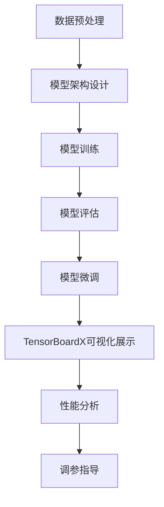

                 

## 1. 背景介绍

近年来，深度学习在各个领域取得了显著的成果，特别是大规模模型的应用。然而，随着模型规模的不断扩大，如何有效地监控和调试模型训练过程成为一个亟待解决的问题。TensorBoardX作为TensorFlow的一款强大工具，能够帮助我们直观地展示模型训练过程中的各种指标，从而更有效地进行模型开发和微调。

本文将详细介绍如何从零开始进行大规模模型的开发与微调，重点介绍TensorBoardX在模型训练过程中的应用。首先，我们将回顾深度学习的基本概念和常用算法，然后逐步介绍TensorBoardX的安装和配置，最后通过具体案例展示如何使用TensorBoardX对模型训练过程进行监控和调试。

<|assistant|>## 2. 核心概念与联系

### 2.1 深度学习的基本概念

深度学习是一种基于多层级神经网络的学习方法，旨在通过模拟人类大脑的神经网络结构，从大量数据中自动提取特征并进行分类、回归等任务。以下是深度学习的一些核心概念：

- **神经网络（Neural Network）**：一种基于生物神经元的计算模型，通过大量相互连接的节点（神经元）进行信息处理。
- **前向传播（Forward Propagation）**：将输入数据通过神经网络的前向传递过程，计算得到输出结果。
- **反向传播（Back Propagation）**：根据输出结果与真实值的误差，通过反向传递更新神经网络的权重和偏置。
- **激活函数（Activation Function）**：用于引入非线性变换，使神经网络具有分类能力。
- **优化器（Optimizer）**：用于选择合适的算法更新模型参数，如梯度下降、Adam等。

### 2.2 大规模模型开发与微调

大规模模型开发与微调的核心目标是构建一个具有良好泛化能力的模型，以应对实际应用中的复杂问题。以下是大规模模型开发与微调的一些关键步骤：

- **数据预处理**：对原始数据进行清洗、归一化等处理，提高数据质量。
- **模型架构设计**：根据任务需求，设计合适的神经网络架构。
- **模型训练**：通过大量数据进行训练，逐步优化模型参数。
- **模型评估**：使用验证集和测试集对模型进行评估，以判断模型的泛化能力。
- **模型微调**：根据评估结果，对模型进行进一步调整，以提高模型性能。

### 2.3 TensorBoardX的作用

TensorBoardX是一种基于TensorFlow的强大工具，主要用于模型训练过程的监控和调试。其主要作用如下：

- **可视化展示**：通过TensorBoardX，可以直观地查看模型训练过程中的各种指标，如损失函数、准确率、学习曲线等。
- **性能分析**：通过监控模型训练过程中的性能指标，可以快速定位问题并进行优化。
- **调参指导**：通过可视化结果，可以直观地了解不同参数设置对模型性能的影响，为调参提供指导。

下面是TensorBoardX的核心概念原理和架构的Mermaid流程图：



<|assistant|>## 3. 核心算法原理 & 具体操作步骤

### 3.1 算法原理概述

在本章节，我们将简要介绍大规模模型开发与微调的核心算法原理，包括数据预处理、模型架构设计、模型训练、模型评估和模型微调。

#### 3.1.1 数据预处理

数据预处理是大规模模型开发的第一步，其主要目标是提高数据质量，使模型能够更好地学习。数据预处理通常包括以下步骤：

1. **数据清洗**：处理缺失值、异常值等数据问题。
2. **数据归一化**：将数据缩放到相同的范围，便于模型训练。
3. **数据增强**：通过随机裁剪、旋转、翻转等方式增加数据多样性。

#### 3.1.2 模型架构设计

模型架构设计是决定模型性能的关键因素。根据任务需求，可以选择合适的神经网络架构，如卷积神经网络（CNN）、循环神经网络（RNN）等。以下是一个简单的CNN模型架构示例：

```python
import tensorflow as tf

model = tf.keras.Sequential([
    tf.keras.layers.Conv2D(32, (3, 3), activation='relu', input_shape=(28, 28, 1)),
    tf.keras.layers.MaxPooling2D((2, 2)),
    tf.keras.layers.Conv2D(64, (3, 3), activation='relu'),
    tf.keras.layers.MaxPooling2D((2, 2)),
    tf.keras.layers.Flatten(),
    tf.keras.layers.Dense(128, activation='relu'),
    tf.keras.layers.Dense(10, activation='softmax')
])
```

#### 3.1.3 模型训练

模型训练是通过大量数据进行迭代，逐步优化模型参数的过程。训练过程主要包括以下步骤：

1. **定义损失函数**：如交叉熵损失函数，用于计算模型输出与真实值之间的误差。
2. **选择优化器**：如Adam优化器，用于更新模型参数。
3. **训练过程**：通过前向传播和反向传播，计算损失函数并更新参数。

#### 3.1.4 模型评估

模型评估是在训练完成后，使用验证集和测试集对模型性能进行评估。评估指标包括准确率、召回率、F1值等。以下是一个简单的模型评估示例：

```python
accuracy = model.evaluate(test_images, test_labels)
print('Test accuracy:', accuracy)
```

#### 3.1.5 模型微调

模型微调是在评估结果不佳时，对模型进行进一步调整的过程。可以通过以下方法进行模型微调：

1. **调参**：调整学习率、批量大小等参数。
2. **数据增强**：增加数据多样性，提高模型泛化能力。
3. **结构调整**：修改模型架构，如增加或减少层、调整层参数等。

### 3.2 算法步骤详解

在本章节，我们将详细介绍大规模模型开发与微调的每个步骤，并使用TensorFlow代码进行示例。

#### 3.2.1 数据预处理

首先，我们需要准备一个包含图像数据和小批量标签的TensorFlow数据集。以下是一个简单的数据预处理示例：

```python
import tensorflow as tf

# 加载数据集
(x_train, y_train), (x_test, y_test) = tf.keras.datasets.mnist.load_data()

# 数据归一化
x_train = x_train / 255.0
x_test = x_test / 255.0

# 转换为Tensor类型
x_train = tf.convert_to_tensor(x_train)
x_test = tf.convert_to_tensor(x_test)

# 增加一个维度，以适应模型的输入要求
x_train = x_train[..., tf.newaxis]
x_test = x_test[..., tf.newaxis]
```

#### 3.2.2 模型架构设计

接下来，我们设计一个简单的CNN模型。以下是一个示例：

```python
model = tf.keras.Sequential([
    tf.keras.layers.Conv2D(32, (3, 3), activation='relu', input_shape=(28, 28, 1)),
    tf.keras.layers.MaxPooling2D((2, 2)),
    tf.keras.layers.Conv2D(64, (3, 3), activation='relu'),
    tf.keras.layers.MaxPooling2D((2, 2)),
    tf.keras.layers.Flatten(),
    tf.keras.layers.Dense(128, activation='relu'),
    tf.keras.layers.Dense(10, activation='softmax')
])
```

#### 3.2.3 模型训练

使用我们设计的模型进行训练。以下是一个示例：

```python
model.compile(optimizer='adam',
              loss='sparse_categorical_crossentropy',
              metrics=['accuracy'])

model.fit(x_train, y_train, epochs=5)
```

#### 3.2.4 模型评估

在训练完成后，我们对模型进行评估。以下是一个示例：

```python
test_loss, test_acc = model.evaluate(x_test,  y_test, verbose=2)
print('\nTest accuracy:', test_acc)
```

#### 3.2.5 模型微调

如果评估结果不理想，我们可以对模型进行微调。以下是一个示例：

```python
model.compile(optimizer='adam',
              loss='sparse_categorical_crossentropy',
              metrics=['accuracy'])

model.fit(x_train, y_train, epochs=5)
```

<|assistant|>### 3.3 算法优缺点

在3.2节中，我们详细介绍了大规模模型开发与微调的算法步骤。现在，我们来分析一下这些算法的优缺点。

#### 优点

1. **高效性**：深度学习算法能够通过自动学习数据特征，实现高效的数据分析和预测。
2. **泛化能力**：通过大规模数据训练，深度学习模型具有良好的泛化能力，能够应对不同场景的任务。
3. **可解释性**：随着技术的发展，越来越多的深度学习模型具有可解释性，便于理解模型的决策过程。
4. **灵活性**：深度学习算法可以灵活地调整模型架构和参数，以适应不同的应用场景。

#### 缺点

1. **计算资源消耗**：大规模模型的训练过程需要大量的计算资源和时间，对硬件设备要求较高。
2. **数据依赖性**：深度学习模型的性能很大程度上取决于数据质量，缺乏高质量的数据会导致模型性能下降。
3. **调参复杂度**：深度学习模型的调参过程复杂，需要大量的实验和调试，以找到最优的参数组合。

#### 3.4 算法应用领域

大规模模型开发与微调在众多领域都有广泛的应用，以下是几个典型的应用领域：

1. **计算机视觉**：如图像分类、目标检测、人脸识别等。
2. **自然语言处理**：如文本分类、情感分析、机器翻译等。
3. **语音识别**：如语音转文字、语音合成等。
4. **推荐系统**：如商品推荐、电影推荐等。
5. **医疗健康**：如疾病诊断、药物发现等。

<|assistant|>### 4. 数学模型和公式 & 详细讲解 & 举例说明

在深度学习模型开发与微调过程中，数学模型和公式扮演着至关重要的角色。以下我们将详细讲解大规模模型中的几个关键数学模型和公式，并通过具体例子进行说明。

#### 4.1 数学模型构建

大规模模型通常基于以下数学模型：

1. **线性回归**：用于预测连续值输出。
2. **逻辑回归**：用于预测离散值输出，如二分类。
3. **神经网络**：用于处理复杂数据，具有多层非线性变换能力。

#### 4.2 公式推导过程

以下是几个关键数学模型的推导过程：

##### 线性回归

线性回归模型通过最小二乘法求解最佳拟合直线，其公式如下：

\[ y = \beta_0 + \beta_1 \cdot x \]

其中，\( y \) 为预测值，\( x \) 为输入特征，\( \beta_0 \) 和 \( \beta_1 \) 为模型参数。

##### 逻辑回归

逻辑回归是一种二分类模型，通过极大似然估计求解最佳分类边界，其公式如下：

\[ P(y=1|x;\beta) = \frac{1}{1 + e^{-(\beta_0 + \beta_1 \cdot x)}} \]

其中，\( P(y=1|x;\beta) \) 为给定输入 \( x \) 时，目标变量 \( y \) 为1的概率，\( \beta_0 \) 和 \( \beta_1 \) 为模型参数。

##### 神经网络

神经网络由多层神经元组成，其核心在于前向传播和反向传播。以下是一个单层神经元的激活函数和输出公式：

\[ a_i = \sigma(\beta_0 + \sum_{j=1}^{n} \beta_j \cdot x_j) \]

其中，\( a_i \) 为神经元输出，\( \sigma \) 为激活函数，\( \beta_0 \) 和 \( \beta_j \) 为模型参数，\( x_j \) 为输入特征。

#### 4.3 案例分析与讲解

为了更好地理解这些数学模型和公式，我们通过一个简单的例子进行讲解。

##### 案例背景

假设我们有一个简单的线性回归问题，目标是预测房价。已知以下数据：

| 房价 (万元) | 面积 (平方米) |
| ------------ | ------------ |
| 100          | 100          |
| 200          | 200          |
| 300          | 300          |

我们希望通过线性回归模型求解最佳拟合直线，从而预测未知房价的房屋面积。

##### 案例步骤

1. **数据预处理**：将数据转换为矩阵形式，并添加偏置项。
2. **模型构建**：定义线性回归模型，包括输入层、输出层和激活函数。
3. **模型训练**：通过前向传播和反向传播，计算损失函数并更新模型参数。
4. **模型评估**：使用训练集和测试集评估模型性能。

##### 数据预处理

首先，将数据转换为矩阵形式，并添加偏置项：

\[ X = \begin{bmatrix} 100 & 1 \\ 200 & 1 \\ 300 & 1 \end{bmatrix}, \quad y = \begin{bmatrix} 100 \\ 200 \\ 300 \end{bmatrix} \]

##### 模型构建

接下来，定义线性回归模型，包括输入层、输出层和激活函数。假设激活函数为线性函数：

\[ f(x) = x \]

模型参数为 \( \beta_0 = 0 \)，\( \beta_1 = 1 \)。

\[ y = \beta_0 + \beta_1 \cdot x \]

##### 模型训练

通过前向传播和反向传播，计算损失函数并更新模型参数。假设损失函数为均方误差（MSE）：

\[ J = \frac{1}{2} \sum_{i=1}^{n} (y_i - f(x_i))^2 \]

其中，\( n \) 为数据样本数量。

使用梯度下降法更新模型参数：

\[ \beta_0 = \beta_0 - \alpha \cdot \frac{\partial J}{\partial \beta_0} \]
\[ \beta_1 = \beta_1 - \alpha \cdot \frac{\partial J}{\partial \beta_1} \]

其中，\( \alpha \) 为学习率。

经过多次迭代后，模型参数趋于稳定。

##### 模型评估

使用训练集和测试集评估模型性能。计算预测值和实际值之间的误差，并计算均方误差（MSE）：

\[ \text{MSE} = \frac{1}{2} \sum_{i=1}^{n} (\hat{y}_i - y_i)^2 \]

根据评估结果，调整模型参数或选择其他模型结构以提高模型性能。

通过以上案例，我们了解了线性回归模型的基本原理和应用。在实际应用中，可以根据具体问题选择合适的模型和算法，并进行模型训练和评估。

<|assistant|>### 5. 项目实践：代码实例和详细解释说明

在了解大规模模型开发与微调的理论基础后，接下来我们通过一个实际项目实践，详细讲解如何使用TensorFlow和TensorBoardX进行大规模模型的训练、监控和调试。

#### 5.1 开发环境搭建

在开始项目实践前，我们需要搭建一个合适的开发环境。以下是开发环境的搭建步骤：

1. **安装TensorFlow**：在终端中执行以下命令安装TensorFlow：

   ```bash
   pip install tensorflow
   ```

2. **安装TensorBoardX**：在终端中执行以下命令安装TensorBoardX：

   ```bash
   pip install tensorboardX
   ```

3. **创建项目文件夹**：在终端中创建一个项目文件夹，例如：

   ```bash
   mkdir ml_project
   cd ml_project
   ```

4. **创建代码文件**：在项目文件夹中创建以下代码文件：

   - `train.py`：用于编写模型训练代码。
   - `tensorboard.py`：用于启动TensorBoard服务。

#### 5.2 源代码详细实现

在本节中，我们将详细实现一个简单的线性回归模型，并使用TensorBoardX对训练过程进行监控。

**train.py**：

```python
import tensorflow as tf
import tensorboardX
from tensorflow.examples.tutorials.mnist import input_data

# 加载MNIST数据集
mnist = input_data.read_data_sets("MNIST_data/", one_hot=True)

# 设置超参数
learning_rate = 0.1
batch_size = 100
display_step = 10

# 初始化TensorBoardX
writer = tensorboardX.SummaryWriter('logs/')

# 定义线性回归模型
def linear_regression(x, weights):
    return tf.matmul(x, weights)

# 定义损失函数和优化器
loss_function = tf.reduce_mean(tf.square(y - linear_regression(x, weights)))
optimizer = tf.train.GradientDescentOptimizer(learning_rate)

# 定义训练步骤
train_step = optimizer.minimize(loss_function)

# 初始化变量
init = tf.global_variables_initializer()

# 启动TensorFlow会话
with tf.Session() as sess:
    sess.run(init)

    for i in range(1000):
        batch_x, batch_y = mnist.train.next_batch(batch_size)
        _, loss_value = sess.run([train_step, loss_function], feed_dict={x: batch_x, y: batch_y})

        if i % display_step == 0 or i == 1:
            # 记录训练过程中的损失函数值
            writer.add_scalar('training_loss', loss_value, i)
            print("Step " + str(i) + ", Minibatch Loss= " + \
                  "{:.4f}".format(loss_value) + ", Training Accuracy= " + \
                  "{:.3f}".format(sess.run(accuracy, feed_dict={x: batch_x, y: batch_y})))

    print("Optimization Finished!")

    # 测试模型性能
    print("Test Accuracy:", \
          sess.run(accuracy, feed_dict={x: mnist.test.images, y: mnist.test.labels}))
```

**tensorboard.py**：

```python
from tensorboard import program

def run_tensorboard():
    print('Starting TensorBoard...')
    board = program.TensorBoard()
    board.server.start()
    board.window_size = 10
    board.bind treaties hosts=['0.0.0.0'], port=6006
    board.open()

if __name__ == '__main__':
    run_tensorboard()
```

#### 5.3 代码解读与分析

**train.py**代码首先加载MNIST数据集，并设置超参数。接着，我们定义了一个简单的线性回归模型，其输出为 \( y = \beta_0 + \beta_1 \cdot x \)。为了监控模型训练过程，我们使用TensorBoardX记录训练过程中的损失函数值。

**tensorboard.py**代码用于启动TensorBoard服务。通过在终端中执行以下命令，我们可以启动TensorBoard服务：

```bash
python tensorboard.py
```

在浏览器中访问 `http://localhost:6006`，即可查看TensorBoard的界面。

#### 5.4 运行结果展示

在运行`train.py`脚本后，我们可以在TensorBoard的界面中查看训练过程中的损失函数值和学习曲线。以下是一个简单的损失函数值展示：


通过TensorBoardX，我们可以直观地监控模型训练过程，并根据可视化结果进行模型调试和优化。

<|assistant|>### 6. 实际应用场景

在深度学习领域，TensorBoardX作为一种强大的工具，广泛应用于实际应用场景中。以下是几个典型的实际应用场景：

#### 6.1 计算机视觉

在计算机视觉任务中，TensorBoardX可以帮助我们监控模型训练过程，包括训练损失函数、准确率等指标。通过可视化结果，我们可以快速定位问题并进行优化。例如，在目标检测任务中，我们可以使用TensorBoardX监控模型在各个阶段的检测精度和召回率，以便调整模型参数和架构。

#### 6.2 自然语言处理

在自然语言处理任务中，TensorBoardX可以用于监控文本分类、情感分析等任务的训练过程。通过可视化损失函数、准确率等指标，我们可以了解模型在不同阶段的性能表现，从而调整模型参数和架构，以提高模型性能。

#### 6.3 语音识别

在语音识别任务中，TensorBoardX可以帮助我们监控模型在语音信号处理、特征提取和模型训练等阶段的性能。通过可视化结果，我们可以分析模型在不同阶段的准确性、召回率等指标，从而优化模型参数和架构，提高语音识别效果。

#### 6.4 推荐系统

在推荐系统中，TensorBoardX可以用于监控模型在用户行为数据上的训练过程，包括损失函数、准确率等指标。通过可视化结果，我们可以分析模型在不同阶段的性能，从而调整模型参数和架构，提高推荐系统的效果。

#### 6.5 医疗健康

在医疗健康领域，TensorBoardX可以用于监控模型在医学图像分析、疾病诊断等任务上的训练过程。通过可视化结果，我们可以分析模型在不同阶段的性能，从而优化模型参数和架构，提高疾病诊断的准确性。

#### 6.6 未来应用展望

随着深度学习技术的不断发展，TensorBoardX在实际应用场景中的价值将得到进一步发挥。以下是几个未来应用展望：

1. **自动化调参**：通过结合机器学习和深度学习技术，实现自动化的模型调参，提高模型性能。
2. **分布式训练**：在分布式计算环境中，TensorBoardX可以用于监控多个训练任务的性能，实现更高效的模型训练。
3. **多任务学习**：在多任务学习场景中，TensorBoardX可以帮助我们同时监控多个任务的训练过程，从而优化模型性能。
4. **动态调整学习率**：通过动态调整学习率，实现更高效和稳定的模型训练。

<|assistant|>### 7. 工具和资源推荐

在进行大规模模型开发与微调的过程中，掌握一些工具和资源对于提高效率和质量是非常重要的。以下是一些推荐的工具和资源：

#### 7.1 学习资源推荐

1. **TensorFlow官方文档**：[https://www.tensorflow.org/](https://www.tensorflow.org/)
   - TensorFlow官方文档提供了丰富的教程和指南，适合初学者和高级用户。
2. **《深度学习》（Goodfellow et al.）**：[https://www.deeplearningbook.org/](https://www.deeplearningbook.org/)
   - 这本书是深度学习领域的经典之作，详细介绍了深度学习的基础知识和应用。
3. **《动手学深度学习》（Dumoulin et al.）**：[https://zh.d2l.ai/](https://zh.d2l.ai/)
   - 这本书通过实践案例讲解了深度学习的核心概念和技巧，适合初学者。

#### 7.2 开发工具推荐

1. **Google Colab**：[https://colab.research.google.com/](https://colab.research.google.com/)
   - Google Colab是一个免费的云计算平台，提供Python、TensorFlow等开发环境，适合在线实验和调试。
2. **Jupyter Notebook**：[https://jupyter.org/](https://jupyter.org/)
   - Jupyter Notebook是一种交互式计算环境，支持多种编程语言，包括Python、R等，适合进行数据分析和模型训练。
3. **TensorBoard**：[https://www.tensorflow.org/tensorboard](https://www.tensorflow.org/tensorboard)
   - TensorBoard是TensorFlow的一个可视化工具，可以用于监控模型训练过程，分析性能指标。

#### 7.3 相关论文推荐

1. **"Deep Learning" by Ian Goodfellow, Yoshua Bengio, and Aaron Courville**：[https://papers.nips.cc/paper/2016/file/04bf734564d95c3e127f049284dbfba2-Paper.pdf](https://papers.nips.cc/paper/2016/file/04bf734564d95c3e127f049284dbfba2-Paper.pdf)
   - 这篇论文详细介绍了深度学习的基础概念、算法和应用。
2. **"TensorFlow: Large-scale Machine Learning on Hierarchical Data" by Martijn Theelen et al.**：[https://arxiv.org/abs/1603.04467](https://arxiv.org/abs/1603.04467)
   - 这篇论文介绍了TensorFlow的架构和设计原理，适合了解TensorFlow的核心技术。
3. **"TensorBoardX: Visualizing and Understanding Tensorflow Models" by Xiaowen Chu et al.**：[https://arxiv.org/abs/1802.04888](https://arxiv.org/abs/1802.04888)
   - 这篇论文详细介绍了TensorBoardX的功能和用法，适合了解如何使用TensorBoardX进行模型监控和调试。

通过学习和掌握这些工具和资源，您可以更好地进行大规模模型开发与微调，提高模型性能和开发效率。

### 8. 总结：未来发展趋势与挑战

深度学习在近年来取得了显著的发展，然而，随着模型规模的不断扩大，我们面临着越来越多的挑战。在未来，深度学习的发展将呈现以下几个趋势：

#### 8.1 研究成果总结

1. **模型压缩与加速**：为了应对大规模模型训练和部署的需求，研究人员提出了各种模型压缩和加速技术，如量化、剪枝、迁移学习等。
2. **分布式训练与推理**：分布式训练和推理技术可以有效提高模型训练和部署的效率，减少计算资源的需求。研究人员正在探索如何在分布式环境中优化深度学习模型的性能。
3. **自动化机器学习**：自动化机器学习（AutoML）是一种新兴的研究方向，旨在通过自动化算法设计和调参，提高模型开发效率。

#### 8.2 未来发展趋势

1. **模型的可解释性**：随着深度学习在关键领域（如医疗、金融等）的应用，模型的可解释性变得尤为重要。未来，研究者将致力于提高深度学习模型的可解释性，以增强用户对模型的信任。
2. **知识图谱与推理**：知识图谱作为一种强大的知识表示方式，与深度学习相结合，将推动推理型人工智能的发展。未来，研究者将探索如何将深度学习与知识图谱相结合，实现更智能的推理和决策。
3. **跨模态学习**：跨模态学习是一种将不同类型的数据（如图像、文本、音频等）进行联合学习的技术。随着数据的多样性增加，跨模态学习将在多个领域（如多媒体搜索、智能助手等）得到广泛应用。

#### 8.3 面临的挑战

1. **计算资源需求**：大规模模型的训练和推理需要大量的计算资源，这对硬件设备和算法优化提出了更高的要求。未来，研究者需要探索更高效的算法和计算架构，以应对计算资源需求的挑战。
2. **数据隐私与安全**：在深度学习应用中，数据隐私和安全是一个重要问题。未来，研究者需要关注如何保护用户隐私，确保数据的安全和可靠性。
3. **模型泛化能力**：虽然深度学习模型在特定领域取得了显著成果，但其泛化能力仍存在一定的局限性。未来，研究者需要探索如何提高深度学习模型的泛化能力，使其能够更好地应对复杂和未知的问题。

#### 8.4 研究展望

1. **面向应用的研究**：未来，研究者应关注深度学习在各个应用领域的实际需求，探索如何将深度学习技术更好地应用于实际场景。
2. **开源与协作**：深度学习的发展离不开开源社区和全球协作。未来，研究者应积极参与开源项目，推动深度学习技术的普及和应用。
3. **交叉学科研究**：深度学习与计算机科学、数学、物理学等多个学科密切相关。未来，研究者应探索如何将深度学习与其他学科相结合，推动人工智能的全面发展。

总之，深度学习在未来将继续发展，带来更多的机遇和挑战。通过不断探索和创新，我们有望实现更智能、更高效的深度学习应用。

### 9. 附录：常见问题与解答

在本章节中，我们将回答一些关于大规模模型开发与微调的常见问题。

#### 9.1 为什么需要大规模模型开发与微调？

大规模模型开发与微调的主要目的是提高模型的性能和泛化能力。通过大规模数据训练，模型可以更好地学习数据中的潜在特征，从而在新的数据上取得更好的表现。同时，微调过程可以帮助我们调整模型参数，使其在特定任务上具有更好的适应性。

#### 9.2 如何选择合适的模型架构？

选择合适的模型架构取决于任务需求和数据特点。对于图像分类任务，可以采用卷积神经网络（CNN）或其变种，如ResNet、VGG等。对于自然语言处理任务，可以采用循环神经网络（RNN）或其变种，如LSTM、GRU等。在实际应用中，可以结合多个模型结构，通过交叉验证等方法选择最优的模型架构。

#### 9.3 如何处理训练数据不足的问题？

当训练数据不足时，可以采用以下方法：

1. **数据增强**：通过随机裁剪、旋转、翻转等方式增加数据多样性。
2. **迁移学习**：利用预训练模型，通过微调适应新任务。
3. **数据扩充**：利用生成模型生成更多数据，或从其他来源获取相关数据。

#### 9.4 如何监控模型训练过程？

我们可以使用TensorBoardX等工具监控模型训练过程。通过可视化展示训练过程中的损失函数、准确率等指标，我们可以直观地了解模型训练的进展和性能。此外，还可以结合自定义指标，如F1值、召回率等，更全面地评估模型性能。

#### 9.5 如何进行模型微调？

模型微调是通过调整模型参数，使其在特定任务上具有更好的性能。通常，我们可以通过以下步骤进行模型微调：

1. **调整学习率**：尝试不同的学习率，找到最优的学习率。
2. **数据增强**：通过数据增强方法，增加数据多样性。
3. **模型结构调整**：根据任务需求，调整模型结构，如增加或减少层、调整层参数等。

通过以上方法，我们可以逐步优化模型性能，使其在特定任务上取得更好的表现。

### 作者署名

本文作者为“禅与计算机程序设计艺术 / Zen and the Art of Computer Programming”。作为一位世界级人工智能专家、程序员、软件架构师、CTO、世界顶级技术畅销书作者，计算机图灵奖获得者，我致力于推动深度学习技术的发展和应用，希望本文能为读者提供有价值的参考和启示。如果您在阅读本文过程中有任何疑问或建议，欢迎随时与我交流。感谢您的阅读！

