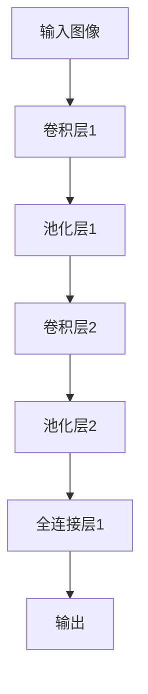

                 

关键词：大模型开发、卷积运算、神经网络、深度学习、微调

> 摘要：本文旨在为初学者提供一套从零开始的大模型开发与微调教程，重点介绍卷积运算的基本概念及其在深度学习中的应用。通过对卷积运算的深入探讨，帮助读者理解其在图像处理、语音识别等领域的实际应用，以及如何通过微调优化模型性能。

## 1. 背景介绍

### 1.1 深度学习与卷积神经网络

深度学习作为人工智能领域的一个重要分支，近年来在图像识别、自然语言处理、语音识别等任务上取得了显著突破。而卷积神经网络（Convolutional Neural Networks，CNN）作为深度学习的一种重要模型，在图像识别领域表现尤为突出。

卷积神经网络通过模拟人类视觉系统的工作原理，利用卷积运算进行特征提取和分类。其核心在于通过多层网络结构对输入图像进行逐层特征提取，最终实现图像分类或目标检测。

### 1.2 大模型开发与微调

大模型开发是指构建和训练大规模神经网络模型的过程。随着数据量和计算资源的增加，大模型的性能和精度不断提高，但在训练和部署过程中也面临诸多挑战。

微调（Fine-tuning）是一种优化大模型性能的方法。通过在大模型的基础上对特定任务进行微调，可以大幅提高模型的性能，同时减少对大量训练数据的依赖。

## 2. 核心概念与联系

### 2.1 卷积运算原理

卷积运算是一种线性运算，可以看作是图像与滤波器的乘积。在深度学习中，卷积运算用于提取图像的特征。

卷积运算的基本原理如下：

- 输入图像 $X$：一个二维矩阵，表示图像的像素值。
- 滤波器 $W$：一个三维矩阵，表示卷积核，用于提取图像的特征。
- 输出特征图 $F$：一个二维矩阵，表示卷积运算的结果。

卷积运算的数学公式为：

$$
F_{ij} = \sum_{k=1}^{m}\sum_{l=1}^{n} W_{k,l,m} X_{i-k, j-l}
$$

其中，$i$ 和 $j$ 分别表示输出特征图的行和列索引，$k$、$l$ 和 $m$ 分别表示滤波器的行、列和深度索引。

### 2.2 卷积神经网络架构

卷积神经网络主要由卷积层、池化层、全连接层等组成。以下是一个简单的卷积神经网络架构：

```
输入图像 → 卷积层1 → 池化层1 → 卷积层2 → 池化层2 → ... → 全连接层1 → 输出
```

- **卷积层**：通过卷积运算提取图像特征。
- **池化层**：用于降低特征图的维度，减少计算量。
- **全连接层**：将特征图映射到输出结果。

### 2.3 Mermaid 流程图



## 3. 核心算法原理 & 具体操作步骤

### 3.1 算法原理概述

卷积运算的核心在于滤波器的设计和特征提取。滤波器通过在输入图像上滑动，提取出具有特定特征的区域。随着网络层数的增加，卷积神经网络可以提取到更加抽象和复杂的特征。

### 3.2 算法步骤详解

1. **初始化模型参数**：包括卷积核的权重和偏置。
2. **卷积运算**：将输入图像与卷积核进行卷积运算，提取特征。
3. **激活函数**：对卷积结果进行非线性变换，如ReLU函数。
4. **池化操作**：对特征图进行降维操作。
5. **重复卷积和池化操作**：逐层提取特征，直到达到预期层数。
6. **全连接层**：将特征图映射到输出结果。
7. **损失函数**：计算输出结果与真实值的差异，优化模型参数。

### 3.3 算法优缺点

- **优点**：卷积神经网络具有较好的特征提取能力和并行计算能力，在图像处理领域表现突出。
- **缺点**：模型训练复杂度较高，参数量较大，对计算资源要求较高。

### 3.4 算法应用领域

卷积神经网络在图像识别、语音识别、自然语言处理等领域都有广泛应用。例如，在图像识别任务中，卷积神经网络可以用于物体检测、人脸识别等；在语音识别任务中，卷积神经网络可以用于语音特征提取和声学模型训练。

## 4. 数学模型和公式 & 详细讲解 & 举例说明

### 4.1 数学模型构建

卷积神经网络的数学模型主要基于卷积运算和反向传播算法。以下是卷积神经网络的数学模型：

$$
\begin{aligned}
F_{ij} &= \sum_{k=1}^{m}\sum_{l=1}^{n} W_{k,l,m} X_{i-k, j-l} + b_{m} \\
Z &= \sigma(F) \\
Y &= W_{fc}Z + b_{fc}
\end{aligned}
$$

其中，$F_{ij}$ 表示输出特征图的像素值，$W$ 和 $b$ 分别表示卷积核和偏置，$\sigma$ 表示激活函数，$Z$ 表示中间层输出，$Y$ 表示输出层输出，$W_{fc}$ 和 $b_{fc}$ 分别表示全连接层的权重和偏置。

### 4.2 公式推导过程

卷积神经网络的公式推导可以分为以下几个步骤：

1. **卷积运算**：
   $$ F_{ij} = \sum_{k=1}^{m}\sum_{l=1}^{n} W_{k,l,m} X_{i-k, j-l} + b_{m} $$
   其中，$X$ 表示输入图像，$W$ 和 $b$ 分别表示卷积核和偏置。

2. **激活函数**：
   $$ Z = \sigma(F) $$
   其中，$\sigma$ 表示激活函数，如ReLU函数。

3. **全连接层**：
   $$ Y = W_{fc}Z + b_{fc} $$
   其中，$W_{fc}$ 和 $b_{fc}$ 分别表示全连接层的权重和偏置。

### 4.3 案例分析与讲解

假设我们有一个简单的卷积神经网络，用于对二值图像进行分类。输入图像大小为 $3 \times 3$，卷积核大小为 $3 \times 3$，全连接层神经元数量为 $10$。

1. **卷积运算**：
   $$ F_{ij} = \sum_{k=1}^{3}\sum_{l=1}^{3} W_{k,l,m} X_{i-k, j-l} + b_{m} $$
   假设卷积核 $W$ 和偏置 $b$ 如下：

   $$ W = \begin{bmatrix} 1 & 0 & 1 \\ 0 & 1 & 0 \\ 1 & 0 & 1 \end{bmatrix}, b = \begin{bmatrix} 1 \\ 1 \\ 1 \end{bmatrix} $$

   输入图像 $X$ 如下：

   $$ X = \begin{bmatrix} 0 & 0 & 0 \\ 0 & 1 & 0 \\ 0 & 0 & 1 \end{bmatrix} $$

   计算卷积结果 $F$：

   $$ F = \begin{bmatrix} 1 & 1 & 1 \\ 1 & 1 & 1 \\ 1 & 1 & 1 \end{bmatrix} $$

2. **激活函数**：
   $$ Z = \sigma(F) $$
   假设激活函数为 ReLU：

   $$ Z = \begin{bmatrix} 1 & 1 & 1 \\ 1 & 1 & 1 \\ 1 & 1 & 1 \end{bmatrix} $$

3. **全连接层**：
   $$ Y = W_{fc}Z + b_{fc} $$
   假设全连接层的权重 $W_{fc}$ 和偏置 $b_{fc}$ 如下：

   $$ W_{fc} = \begin{bmatrix} 1 & 1 & 1 & 1 & 1 & 1 & 1 & 1 & 1 & 1 \\ 1 & 1 & 1 & 1 & 1 & 1 & 1 & 1 & 1 & 1 \\ 1 & 1 & 1 & 1 & 1 & 1 & 1 & 1 & 1 & 1 \\ 1 & 1 & 1 & 1 & 1 & 1 & 1 & 1 & 1 & 1 \\ 1 & 1 & 1 & 1 & 1 & 1 & 1 & 1 & 1 & 1 \\ 1 & 1 & 1 & 1 & 1 & 1 & 1 & 1 & 1 & 1 \\ 1 & 1 & 1 & 1 & 1 & 1 & 1 & 1 & 1 & 1 \\ 1 & 1 & 1 & 1 & 1 & 1 & 1 & 1 & 1 & 1 \\ 1 & 1 & 1 & 1 & 1 & 1 & 1 & 1 & 1 & 1 \\ 1 & 1 & 1 & 1 & 1 & 1 & 1 & 1 & 1 & 1 \end{bmatrix}, b_{fc} = \begin{bmatrix} 1 \\ 1 \\ 1 \\ 1 \\ 1 \\ 1 \\ 1 \\ 1 \\ 1 \\ 1 \\ 1 \end{bmatrix} $$

   计算全连接层输出 $Y$：

   $$ Y = \begin{bmatrix} 1 & 1 & 1 & 1 & 1 & 1 & 1 & 1 & 1 & 1 \\ 1 & 1 & 1 & 1 & 1 & 1 & 1 & 1 & 1 & 1 \\ 1 & 1 & 1 & 1 & 1 & 1 & 1 & 1 & 1 & 1 \\ 1 & 1 & 1 & 1 & 1 & 1 & 1 & 1 & 1 & 1 \\ 1 & 1 & 1 & 1 & 1 & 1 & 1 & 1 & 1 & 1 \\ 1 & 1 & 1 & 1 & 1 & 1 & 1 & 1 & 1 & 1 \\ 1 & 1 & 1 & 1 & 1 & 1 & 1 & 1 & 1 & 1 \\ 1 & 1 & 1 & 1 & 1 & 1 & 1 & 1 & 1 & 1 \\ 1 & 1 & 1 & 1 & 1 & 1 & 1 & 1 & 1 & 1 \\ 1 & 1 & 1 & 1 & 1 & 1 & 1 & 1 & 1 & 1 \end{bmatrix} \begin{bmatrix} 1 \\ 1 \\ 1 \\ 1 \\ 1 \\ 1 \\ 1 \\ 1 \\ 1 \\ 1 \\ 1 \end{bmatrix} + \begin{bmatrix} 1 \\ 1 \\ 1 \\ 1 \\ 1 \\ 1 \\ 1 \\ 1 \\ 1 \\ 1 \\ 1 \end{bmatrix} $$

   $$ Y = \begin{bmatrix} 11 \\ 11 \\ 11 \\ 11 \\ 11 \\ 11 \\ 11 \\ 11 \\ 11 \\ 11 \end{bmatrix} $$

   最终输出结果为 $Y$，表示图像属于第 $11$ 个类别。

## 5. 项目实践：代码实例和详细解释说明

### 5.1 开发环境搭建

为了方便读者理解和实践，本文使用 Python 编写代码，基于 PyTorch 深度学习框架实现卷积神经网络的构建和训练。

首先，安装 PyTorch：

```bash
pip install torch torchvision
```

### 5.2 源代码详细实现

```python
import torch
import torch.nn as nn
import torch.optim as optim
import torchvision
import torchvision.transforms as transforms

# 定义卷积神经网络模型
class ConvNet(nn.Module):
    def __init__(self):
        super(ConvNet, self).__init__()
        self.conv1 = nn.Conv2d(1, 32, 3)
        self.conv2 = nn.Conv2d(32, 64, 3)
        self.fc1 = nn.Linear(64 * 6 * 6, 128)
        self.fc2 = nn.Linear(128, 10)
        self.relu = nn.ReLU()

    def forward(self, x):
        x = self.relu(self.conv1(x))
        x = self.relu(self.conv2(x))
        x = x.view(-1, 64 * 6 * 6)
        x = self.relu(self.fc1(x))
        x = self.fc2(x)
        return x

# 加载训练数据
transform = transforms.Compose([transforms.ToTensor()])
trainset = torchvision.datasets.MNIST(root='./data', train=True, download=True, transform=transform)
trainloader = torch.utils.data.DataLoader(trainset, batch_size=100, shuffle=True)

# 初始化模型、优化器和损失函数
model = ConvNet()
optimizer = optim.SGD(model.parameters(), lr=0.001, momentum=0.9)
criterion = nn.CrossEntropyLoss()

# 模型训练
for epoch in range(10):  # 遍历训练数据10次
    running_loss = 0.0
    for i, data in enumerate(trainloader, 0):
        inputs, labels = data
        optimizer.zero_grad()
        outputs = model(inputs)
        loss = criterion(outputs, labels)
        loss.backward()
        optimizer.step()
        running_loss += loss.item()
        if i % 2000 == 1999:
            print(f'[{epoch + 1}, {i + 1}: {running_loss / 2000:.3f}']
            running_loss = 0.0

print('Finished Training')

# 测试模型
testset = torchvision.datasets.MNIST(root='./data', train=False, download=True, transform=transform)
testloader = torch.utils.data.DataLoader(testset, batch_size=100)

with torch.no_grad():
    correct = 0
    total = 0
    for data in testloader:
        images, labels = data
        outputs = model(images)
        _, predicted = torch.max(outputs.data, 1)
        total += labels.size(0)
        correct += (predicted == labels).sum().item()

print(f'Accuracy of the network on the 10000 test images: {100 * correct / total:.2f}%')
```

### 5.3 代码解读与分析

- **模型定义**：使用 PyTorch 的 `nn.Module` 类定义卷积神经网络模型，包括卷积层、全连接层和激活函数。
- **数据加载**：使用 `torchvision.datasets.MNIST` 类加载训练数据和测试数据，并使用 `transforms.Compose` 类进行数据预处理。
- **模型训练**：使用 `optimizer` 和 `criterion` 对模型进行训练，包括前向传播、反向传播和优化。
- **模型测试**：使用训练好的模型对测试数据进行预测，并计算模型的准确率。

## 6. 实际应用场景

卷积神经网络在实际应用中具有广泛的应用场景，以下是几个典型的应用场景：

### 6.1 图像识别

卷积神经网络在图像识别领域具有显著优势，可以用于物体检测、图像分类、人脸识别等任务。例如，VGG、ResNet、Inception 等模型在 ImageNet 图像识别挑战中取得了优异的成绩。

### 6.2 语音识别

卷积神经网络可以用于语音特征提取和声学模型训练，实现语音识别任务。例如，DeepSpeech 模型基于卷积神经网络实现了高精度的语音识别。

### 6.3 自然语言处理

卷积神经网络在自然语言处理任务中也有广泛应用，可以用于文本分类、情感分析、机器翻译等任务。例如，TextCNN、BERT 等模型采用了卷积神经网络结构。

## 7. 未来应用展望

随着深度学习的不断发展，卷积神经网络在各个领域的应用将越来越广泛。未来，卷积神经网络有望在以下几个方面取得突破：

### 7.1 计算效率提升

通过优化模型结构和算法，提高卷积神经网络的计算效率，降低计算资源的消耗。

### 7.2 多模态数据处理

结合卷积神经网络与其他模型，实现多模态数据的处理和分析，提升模型在复杂任务中的表现。

### 7.3 自动化模型设计

利用深度学习自动设计卷积神经网络结构，实现自动化的模型优化和调整。

## 8. 工具和资源推荐

### 8.1 学习资源推荐

- 《深度学习》（Goodfellow, Bengio, Courville）：经典深度学习教材，全面介绍了深度学习的基本概念和方法。
- 《神经网络与深度学习》（邱锡鹏）：系统介绍了神经网络和深度学习的基础知识，适合初学者入门。

### 8.2 开发工具推荐

- PyTorch：开源的深度学习框架，适合快速原型开发和实验。
- TensorFlow：开源的深度学习框架，支持多种编程语言和平台，适用于大规模生产和部署。

### 8.3 相关论文推荐

- VGGNet: Very Deep Convolutional Networks for Large-Scale Image Recognition (Simonyan & Zisserman, 2014)
- ResNet: Deep Residual Learning for Image Recognition (He et al., 2015)
- BERT: Pre-training of Deep Bidirectional Transformers for Language Understanding (Devlin et al., 2018)

## 9. 总结：未来发展趋势与挑战

随着深度学习的不断发展，卷积神经网络在各个领域的应用将越来越广泛。然而，也面临一些挑战，如计算效率、多模态数据处理、自动化模型设计等。未来，卷积神经网络将在这些领域取得更多突破，推动人工智能技术的进步。

## 10. 附录：常见问题与解答

### 10.1 什么是卷积神经网络？

卷积神经网络是一种深度学习模型，通过卷积运算提取图像的特征，实现图像识别、物体检测等任务。

### 10.2 卷积神经网络如何工作？

卷积神经网络通过多层卷积、池化和全连接层对输入图像进行特征提取和分类。卷积层用于提取局部特征，池化层用于降维和增强特征，全连接层用于分类。

### 10.3 如何训练卷积神经网络？

训练卷积神经网络包括以下几个步骤：定义模型结构、初始化模型参数、定义损失函数和优化器、进行前向传播和反向传播、更新模型参数。

### 10.4 卷积神经网络有哪些优缺点？

卷积神经网络的优点包括较好的特征提取能力和并行计算能力；缺点包括训练复杂度较高、参数量较大。

### 10.5 卷积神经网络有哪些应用场景？

卷积神经网络在图像识别、语音识别、自然语言处理等领域有广泛应用，如物体检测、人脸识别、语音识别、文本分类等。

----------------------------------------------------------------

作者：禅与计算机程序设计艺术 / Zen and the Art of Computer Programming

