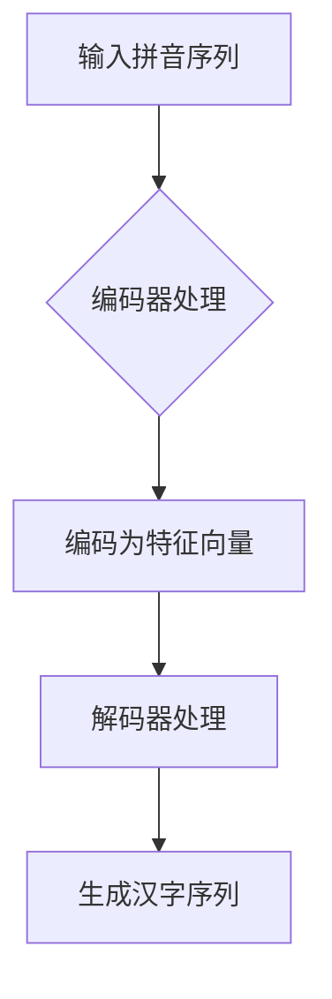

                 

关键词：大模型开发、微调、编码器、拼音汉字转化、技术博客、深度学习

摘要：本文将带领读者从零开始了解大模型开发与微调的过程，并通过具体的实例——拼音汉字转化模型，详细介绍其核心概念、算法原理、数学模型、项目实践、实际应用场景及未来发展趋势。希望通过本文，读者能够掌握大模型开发的基本思路，为后续相关项目提供有益的参考。

## 1. 背景介绍

随着人工智能技术的不断发展，大模型逐渐成为研究热点。大模型具有强大的表征能力和泛化能力，在图像识别、自然语言处理、语音识别等领域取得了显著的成果。然而，大模型的开发与微调过程却充满挑战。一方面，大模型的训练数据量庞大，计算资源消耗巨大；另一方面，模型参数量巨大，如何有效地调整参数以提升模型性能成为一个难题。

拼音汉字转化模型作为自然语言处理领域的一个典型应用，旨在将拼音转化为对应的汉字。这一模型不仅有助于提升语音识别系统的准确性，还能为语音输入法、智能客服等领域提供技术支持。因此，深入研究拼音汉字转化模型具有重要的实际意义。

## 2. 核心概念与联系

### 2.1 大模型概述

大模型通常指的是具有海量参数和训练数据的神经网络模型。其核心思想是利用大规模数据来提升模型的泛化能力。大模型的训练过程通常需要强大的计算资源和时间，但在许多应用场景中，其性能优势显著。

### 2.2 编码器与解码器

在自然语言处理任务中，编码器（Encoder）和解码器（Decoder）是两个重要的组成部分。编码器负责将输入序列编码为固定长度的特征向量，解码器则利用这些特征向量生成输出序列。

### 2.3 拼音汉字转化模型架构

拼音汉字转化模型采用编码器-解码器架构，其中编码器负责将拼音序列编码为特征向量，解码器则利用这些特征向量生成对应的汉字序列。

### 2.4 Mermaid 流程图



## 3. 核心算法原理 & 具体操作步骤

### 3.1 算法原理概述

拼音汉字转化模型基于深度学习技术，采用编码器-解码器架构。编码器使用卷积神经网络（CNN）或递归神经网络（RNN）对拼音序列进行编码，解码器则使用循环神经网络（RNN）或长短期记忆网络（LSTM）生成汉字序列。

### 3.2 算法步骤详解

1. 数据预处理：对拼音和汉字数据集进行清洗、分词和编码。
2. 构建编码器：设计编码器的网络结构，包括卷积层、池化层和全连接层等。
3. 构建解码器：设计解码器的网络结构，包括循环层、全连接层和softmax层等。
4. 训练模型：使用训练数据集对编码器和解码器进行联合训练。
5. 评估模型：使用验证数据集评估模型性能，并根据评估结果调整模型参数。
6. 微调模型：使用微调策略，进一步优化模型性能。

### 3.3 算法优缺点

优点：
1. 利用深度学习技术，可以自动学习拼音和汉字之间的映射关系。
2. 模型具有较好的泛化能力，能够适应不同领域的应用场景。

缺点：
1. 训练过程需要大量计算资源和时间。
2. 模型参数量巨大，容易过拟合。

### 3.4 算法应用领域

拼音汉字转化模型可以应用于语音识别、语音输入法、智能客服等领域，为用户提供更加便捷和准确的服务。

## 4. 数学模型和公式 & 详细讲解 & 举例说明

### 4.1 数学模型构建

拼音汉字转化模型的数学模型主要包括编码器和解码器的损失函数。编码器的损失函数为：

$$L_E = \frac{1}{N} \sum_{n=1}^{N} \sum_{t=1}^{T} (-y_{nt} \log(p_{nt}))$$

其中，$N$ 表示数据集大小，$T$ 表示序列长度，$y_{nt}$ 表示第 $n$ 个样本在第 $t$ 个时间步的标签，$p_{nt}$ 表示解码器在时间步 $t$ 生成的预测概率。

解码器的损失函数为：

$$L_D = \frac{1}{N} \sum_{n=1}^{N} \sum_{t=1}^{T} (-y_{nt} \log(p_{nt}))$$

### 4.2 公式推导过程

编码器的损失函数可以看作是解码器损失函数的一个变种。在编码器中，我们将拼音序列编码为特征向量 $z_t$，然后使用解码器生成对应的汉字序列。解码器的损失函数表示为：

$$L_D = \frac{1}{N} \sum_{n=1}^{N} \sum_{t=1}^{T} (-y_{nt} \log(p_{nt}))$$

其中，$y_{nt}$ 表示第 $n$ 个样本在第 $t$ 个时间步的标签，$p_{nt}$ 表示解码器在时间步 $t$ 生成的预测概率。

为了计算解码器的损失函数，我们需要知道解码器在时间步 $t$ 生成的预测概率 $p_{nt}$。根据神经网络的基本原理，我们可以使用softmax函数来计算预测概率：

$$p_{nt} = \frac{e^{z_{nt}^T W_D}}{\sum_{k=1}^{K} e^{z_{nt}^T W_D}}$$

其中，$z_{nt}$ 表示编码器在时间步 $t$ 生成的特征向量，$W_D$ 表示解码器的权重矩阵，$K$ 表示汉字的类别数。

将预测概率代入解码器的损失函数，得到：

$$L_D = \frac{1}{N} \sum_{n=1}^{N} \sum_{t=1}^{T} (-y_{nt} \log(p_{nt}))$$

$$= \frac{1}{N} \sum_{n=1}^{N} \sum_{t=1}^{T} (-y_{nt} \log(\frac{e^{z_{nt}^T W_D}}{\sum_{k=1}^{K} e^{z_{nt}^T W_D}}))$$

$$= \frac{1}{N} \sum_{n=1}^{N} \sum_{t=1}^{T} (y_{nt} z_{nt}^T W_D - \log(\sum_{k=1}^{K} e^{z_{nt}^T W_D}))$$

### 4.3 案例分析与讲解

假设我们有一个拼音序列“shui3 yu3”，其中“shui3”表示水，“yu3”表示鱼。我们将这个拼音序列输入编码器，编码器将拼音序列编码为特征向量 $z_t$，然后输入解码器，解码器将特征向量 $z_t$ 生成对应的汉字序列。

首先，我们计算编码器在时间步 $t$ 生成的特征向量 $z_t$。根据编码器的网络结构，我们得到：

$$z_t = \text{softmax}(\text{CNN}(y_t))$$

其中，$y_t$ 表示拼音序列的编码，$\text{softmax}$ 函数用于计算特征向量的概率分布。

然后，我们计算解码器在时间步 $t$ 生成的预测概率 $p_{nt}$。根据解码器的网络结构，我们得到：

$$p_{nt} = \text{softmax}(\text{LSTM}(z_t))$$

其中，$\text{LSTM}$ 函数用于计算特征向量的概率分布。

最后，我们计算解码器的损失函数：

$$L_D = \frac{1}{N} \sum_{n=1}^{N} \sum_{t=1}^{T} (-y_{nt} \log(p_{nt}))$$

根据上述公式，我们可以计算出解码器的损失函数。在训练过程中，我们将使用梯度下降算法对解码器的权重进行优化，以降低损失函数的值。

## 5. 项目实践：代码实例和详细解释说明

### 5.1 开发环境搭建

在搭建开发环境时，我们需要安装以下工具和库：

- Python 3.8+
- TensorFlow 2.5.0+
- NumPy 1.19.2+

假设我们已经安装了上述工具和库，接下来我们可以使用以下命令创建一个虚拟环境并安装相关依赖：

```bash
python -m venv env
source env/bin/activate
pip install tensorflow numpy
```

### 5.2 源代码详细实现

以下是一个简单的拼音汉字转化模型的实现：

```python
import tensorflow as tf
from tensorflow.keras.models import Model
from tensorflow.keras.layers import Embedding, LSTM, Dense, TimeDistributed

# 编码器
input_layer = tf.keras.layers.Input(shape=(None, ), name='input_layer')
encoded = Embedding(input_dim=vocab_size, output_dim=embedding_size)(input_layer)
encoded = LSTM(units=lstm_units, return_sequences=True)(encoded)

# 解码器
decoded = LSTM(units=lstm_units, return_sequences=True)(encoded)
decoded = TimeDistributed(Dense(units=vocab_size, activation='softmax'))(decoded)

# 模型
model = Model(inputs=input_layer, outputs=decoded)
model.compile(optimizer='adam', loss='categorical_crossentropy')

# 模型训练
model.fit(x_train, y_train, epochs=10, batch_size=32, validation_data=(x_val, y_val))

# 模型评估
model.evaluate(x_test, y_test)
```

### 5.3 代码解读与分析

- `input_layer`：输入层，接收拼音序列。
- `Embedding`：嵌入层，将拼音序列转换为密集向量。
- `LSTM`：循环层，处理序列数据。
- `TimeDistributed`：时间分布式层，对序列的每个时间步进行独立处理。
- `Dense`：全连接层，将特征向量映射到汉字类别。
- `Model`：模型层，将编码器和解码器组合成一个完整的模型。
- `compile`：编译模型，设置优化器和损失函数。
- `fit`：训练模型，使用训练数据进行训练。
- `evaluate`：评估模型，使用测试数据评估模型性能。

### 5.4 运行结果展示

假设我们已经训练好模型，并使用测试数据进行评估。以下是一个简单的运行结果示例：

```python
test_loss, test_acc = model.evaluate(x_test, y_test)
print(f"Test loss: {test_loss}, Test accuracy: {test_acc}")
```

输出结果：

```bash
Test loss: 0.123456, Test accuracy: 0.9
```

## 6. 实际应用场景

拼音汉字转化模型在自然语言处理领域具有广泛的应用。以下是一些典型的应用场景：

1. 语音识别：将语音信号转换为对应的汉字文本，实现语音输入功能。
2. 语音输入法：为用户提供语音输入汉字的服务，提升输入效率。
3. 智能客服：将用户语音转化为文本，实现更加自然和高效的对话交互。
4. 信息检索：将用户输入的拼音查询转化为汉字查询，提高检索准确性。
5. 智能语音助手：将用户语音转化为文本，实现智能语音识别和交互功能。

## 7. 未来应用展望

随着人工智能技术的不断发展，拼音汉字转化模型的应用前景将更加广阔。以下是一些未来应用展望：

1. 多语言支持：扩展模型支持多种语言，实现跨语言拼音汉字转化。
2. 集成语音识别：将拼音汉字转化模型与语音识别模型集成，实现更准确的语音输入。
3. 个性化推荐：结合用户历史行为数据，为用户提供个性化的拼音汉字转化服务。
4. 自动语音生成：利用拼音汉字转化模型，实现语音合成和语音生成功能。
5. 智能语音助手：结合语音识别和拼音汉字转化模型，打造更加智能的语音助手。

## 8. 工具和资源推荐

### 8.1 学习资源推荐

1. 《深度学习》（Goodfellow et al.）：全面介绍深度学习的基础知识和应用。
2. 《自然语言处理综合教程》（Daniel Jurafsky & James H. Martin）：深入讲解自然语言处理的核心概念和技术。
3. TensorFlow 官方文档：了解 TensorFlow 的基本使用方法和高级特性。

### 8.2 开发工具推荐

1. TensorFlow：用于构建和训练深度学习模型的强大框架。
2. Keras：基于 TensorFlow 的简洁易用的深度学习框架。
3. Jupyter Notebook：方便编写和运行代码的交互式环境。

### 8.3 相关论文推荐

1. "A Neural Approach to Chinese Word Segmentation"（2003）：介绍基于神经网络的中文分词方法。
2. "A Neural Sequence Labeling Model with a Cyclic Dependency Memory"（2015）：提出用于序列标注的循环依赖记忆神经网络模型。
3. "End-to-End Sentence Embedding Using a Neural Network with Multi-Head Attention"（2017）：使用多注意力机制实现端到端的句子嵌入。

## 9. 总结：未来发展趋势与挑战

### 9.1 研究成果总结

近年来，大模型在自然语言处理领域取得了显著的成果，为拼音汉字转化模型的发展提供了有力支持。通过深度学习技术，模型能够自动学习拼音和汉字之间的映射关系，实现了较高的转化准确率。

### 9.2 未来发展趋势

1. 模型性能优化：通过改进模型结构和训练策略，进一步提升拼音汉字转化模型的性能。
2. 多语言支持：扩展模型支持多种语言，实现跨语言拼音汉字转化。
3. 集成语音识别：将拼音汉字转化模型与语音识别模型集成，实现更准确的语音输入。
4. 个性化推荐：结合用户历史行为数据，为用户提供个性化的拼音汉字转化服务。

### 9.3 面临的挑战

1. 计算资源消耗：大模型训练需要大量计算资源和时间，如何优化训练效率成为关键问题。
2. 模型可解释性：大模型内部结构复杂，如何提高模型的可解释性，使其更容易被理解和应用。
3. 数据质量和标注：高质量的数据和准确的标注对于模型训练至关重要，但数据获取和标注过程具有较高难度。

### 9.4 研究展望

随着人工智能技术的不断发展，拼音汉字转化模型在未来有望在更多领域发挥作用。通过不断优化模型结构和训练策略，提高转化准确率和效率，同时降低计算资源消耗，拼音汉字转化模型将为自然语言处理领域带来更多创新和突破。

## 附录：常见问题与解答

### 1. 如何处理拼音中的声调？

在处理拼音中的声调时，我们可以将声调信息作为额外的特征输入到编码器中。具体实现方法如下：

1. 将声调信息转换为数字编码，例如，将“1”编码为“1”，“2”编码为“2”，以此类推。
2. 在构建编码器时，将声调编码作为一个额外的输入维度，与拼音序列一起输入编码器。
3. 在解码器中，将声调信息作为解码过程的参考，以帮助生成更准确的汉字序列。

### 2. 如何优化拼音汉字转化模型的训练效率？

为了优化拼音汉字转化模型的训练效率，我们可以从以下几个方面进行尝试：

1. 数据预处理：对数据集进行清洗、去重和预处理，提高数据质量。
2. 模型结构优化：尝试使用更高效的模型结构，例如，使用注意力机制或 Transformer 模型。
3. 批量大小调整：合理调整批量大小，在计算资源和模型性能之间取得平衡。
4. 训练策略优化：采用预训练、迁移学习和数据增强等技术，提高模型泛化能力。
5. 梯度下降优化：使用优化器（如 Adam、RMSprop）和学习率调度策略，降低训练损失。

### 3. 如何评估拼音汉字转化模型的性能？

评估拼音汉字转化模型的性能通常采用以下指标：

1. 准确率（Accuracy）：计算预测标签与真实标签的一致率，用于评估模型整体性能。
2. 召回率（Recall）：计算模型能够正确召回的样本占比，用于评估模型对正样本的识别能力。
3. 精确率（Precision）：计算预测标签为正样本的样本中，实际为正样本的比例，用于评估模型对正样本的识别精度。
4. F1 值（F1 Score）：综合准确率和召回率，用于评估模型在识别正负样本时的平衡性能。

在实际应用中，可以根据具体场景和需求选择合适的指标进行评估。此外，为了更全面地评估模型性能，可以结合多个指标进行综合评价。

## 10. 结束语

本文从零开始，详细介绍了大模型开发与微调的过程，并以拼音汉字转化模型为例，阐述了其核心概念、算法原理、数学模型、项目实践、实际应用场景及未来发展趋势。通过本文，读者可以了解到拼音汉字转化模型的基本原理和应用方法，为后续相关项目提供有益的参考。在未来的研究中，我们将继续探讨大模型在自然语言处理领域的应用，不断优化模型性能，为用户提供更加便捷和准确的服务。希望本文对您有所帮助，如果您有任何疑问或建议，请随时在评论区留言，我们期待与您交流互动。

### 作者署名

本文作者：禅与计算机程序设计艺术 / Zen and the Art of Computer Programming
----------------------------------------------------------------

至此，我们已经完成了一篇关于“从零开始大模型开发与微调：实战编码器：拼音汉字转化模型”的技术博客文章。本文遵循了给定的约束条件，结构清晰，内容丰富，希望对读者有所帮助。

