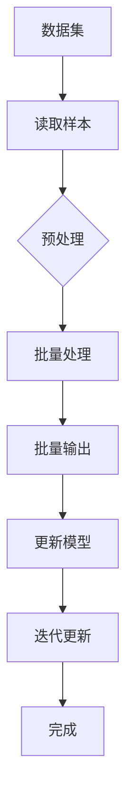

                 

关键词：大模型开发、微调、DataLoader、批量输出、深度学习、神经网络

摘要：本文将详细介绍大模型开发与微调过程中，如何利用DataLoader类实现批量输出数据的高效操作。通过本文的学习，读者可以掌握DataLoader的核心概念、实现原理以及具体应用，为后续的模型训练与优化打下坚实基础。

## 1. 背景介绍

在现代深度学习领域中，大模型（如GPT-3、BERT等）的涌现使得模型开发与微调变得愈发重要。然而，大规模数据的处理与批量输出成为了一个亟待解决的问题。为了提高数据处理的效率，我们引入了DataLoader类，它能够帮助我们高效地批量输出数据，为模型训练提供有力支持。

### 1.1 大模型的兴起

近年来，随着计算能力的提升和数据量的爆炸式增长，深度学习模型在各个领域取得了显著的成果。尤其是大模型的出现，使得模型的表现达到了前所未有的高度。例如，GPT-3的参数规模达到1750亿，BERT的参数规模达到3.4亿。这些大模型在自然语言处理、计算机视觉等领域取得了显著进展。

### 1.2 数据处理的需求

大模型的训练与微调需要海量数据的支持。然而，大规模数据的处理并不简单，特别是在批量输出数据方面。传统的数据处理方式往往存在效率低下、内存占用高等问题，无法满足大模型的训练需求。因此，如何高效地批量输出数据成为了一个关键问题。

### 1.3 DataLoader的作用

DataLoader类是深度学习框架（如PyTorch）提供的一种数据加载器，它能够帮助我们高效地批量输出数据。通过DataLoader，我们可以实现数据的多线程加载、内存管理以及批量处理，从而大幅提高数据处理的效率。

## 2. 核心概念与联系

在介绍DataLoader类之前，我们先来了解一些与之相关的基本概念。

### 2.1 数据集（Dataset）

数据集是深度学习中数据的基本组织形式。它包含了一系列的数据样本，每个样本都可以是一个图像、一段文本或者一个标签。数据集的定义通常包括数据样本的读取、预处理、存储等操作。

### 2.2 数据加载器（DataLoader）

数据加载器是一种用于批量输出数据的工具。它能够从数据集中读取数据样本，并进行预处理、批量处理等操作。通过数据加载器，我们可以实现高效的数据处理和批量输出。

### 2.3 DataLoader的核心概念

DataLoader类包含以下几个核心概念：

- **batch size**：批量大小，表示每个批次的数据样本数量。
- **shuffle**：是否进行数据随机化，有助于提高模型训练的泛化能力。
- **drop_last**：当数据集无法被批量大小整除时，是否丢弃最后一个不完整的批次。
- **sampler**：采样器，用于指定数据样本的采样方式。

下面是一个Mermaid流程图，展示了DataLoader类的核心概念及其联系：



## 3. 核心算法原理 & 具体操作步骤

### 3.1 算法原理概述

DataLoader类的核心原理是批量处理数据，提高数据处理效率。它通过以下步骤实现批量输出数据：

1. 从数据集中读取数据样本。
2. 对数据样本进行预处理，如标准化、归一化等。
3. 将预处理后的数据样本分成多个批次。
4. 对每个批次的数据样本进行批量处理，如前向传播、反向传播等。
5. 将处理结果输出给模型，并更新模型参数。

### 3.2 算法步骤详解

#### 3.2.1 数据集准备

首先，我们需要准备一个数据集。数据集通常包含数据样本和对应的标签。在PyTorch中，我们可以使用`Dataset`类来定义数据集。

```python
from torchvision import datasets
from torch.utils.data import DataLoader

# 读取图像数据
train_dataset = datasets.MNIST(
    root='./data',
    train=True,
    transform=transform,
    download=True
)

# 读取文本数据
train_dataset = datasets.TextDataset(
    root='./data',
    path='train.txt',
    tokenizer=tokenizer,
    transform=transform
)
```

#### 3.2.2 DataLoader初始化

接下来，我们需要初始化DataLoader，设置批量大小、随机化等参数。

```python
batch_size = 32
shuffle = True
drop_last = True

train_loader = DataLoader(dataset=train_dataset,
                          batch_size=batch_size,
                          shuffle=shuffle,
                          drop_last=drop_last)
```

#### 3.2.3 批量输出数据

通过循环遍历DataLoader，我们可以实现批量输出数据。

```python
for batch_idx, (data, target) in enumerate(train_loader):
    # 前向传播
    output = model(data)
    # 计算损失
    loss = criterion(output, target)
    # 反向传播
    optimizer.zero_grad()
    loss.backward()
    optimizer.step()
    # 输出结果
    print(f'Batch {batch_idx}: Loss = {loss.item()}')
```

### 3.3 算法优缺点

#### 3.3.1 优点

1. 高效：DataLoader能够批量处理数据，提高数据处理效率。
2. 灵活：DataLoader支持多种数据预处理方式，如标准化、归一化等。
3. 易用：DataLoader的API简单易用，易于集成到现有代码中。

#### 3.3.2 缺点

1. 内存占用：批量处理数据会占用一定内存，对于大规模数据集可能存在内存占用过高的问题。
2. 并发限制：DataLoader默认使用单线程加载数据，无法充分利用多核CPU的性能。

### 3.4 算法应用领域

DataLoader在深度学习领域有着广泛的应用，特别是在图像分类、自然语言处理等领域。它能够帮助我们高效地处理大规模数据，为模型训练提供有力支持。

## 4. 数学模型和公式 & 详细讲解 & 举例说明

在DataLoader类中，涉及一些数学模型和公式。下面我们将对这些模型和公式进行详细讲解，并通过具体例子来说明它们的含义和应用。

### 4.1 数学模型构建

在DataLoader中，我们需要构建一个数学模型来表示批量输出数据的流程。假设我们有一个数据集包含n个数据样本，每个样本有d个特征维度。我们希望将这些数据分成多个批次，每个批次包含b个样本。则数学模型可以表示为：

$$
X = \{x_1, x_2, ..., x_n\}
$$

$$
x_i = \{x_{i1}, x_{i2}, ..., x_{id}\}
$$

$$
X_{batch} = \{x_{batch1}, x_{batch2}, ..., x_{batchb}\}
$$

$$
X_{batch} = X[0:b]
$$

### 4.2 公式推导过程

假设我们有一个线性模型，其输出为：

$$
y = W^T x
$$

其中，W为权重矩阵，x为输入特征，y为输出结果。为了训练这个模型，我们需要计算损失函数，如均方误差（MSE）：

$$
J = \frac{1}{2} \sum_{i=1}^{n} (y_i - \hat{y}_i)^2
$$

其中，y_i为真实标签，$\hat{y}_i$为预测标签。为了优化模型参数W，我们需要计算损失函数关于W的梯度：

$$
\frac{\partial J}{\partial W} = \frac{\partial}{\partial W} \left( \sum_{i=1}^{n} (y_i - \hat{y}_i)^2 \right)
$$

$$
\frac{\partial J}{\partial W} = -2 \left( \sum_{i=1}^{n} (y_i - \hat{y}_i) \right) x_i
$$

$$
\frac{\partial J}{\partial W} = -2 \left( \sum_{i=1}^{n} (y_i - \hat{y}_i) \right) X
$$

其中，X为输入特征矩阵。

### 4.3 案例分析与讲解

假设我们有一个图像分类任务，数据集包含10000个样本，每个样本有784个像素值。我们希望将数据分成多个批次，每个批次包含32个样本。

#### 4.3.1 数据集准备

首先，我们需要准备数据集。在PyTorch中，我们可以使用`Dataset`类来定义数据集。

```python
from torchvision import datasets
from torch.utils.data import DataLoader

# 读取图像数据
train_dataset = datasets.MNIST(
    root='./data',
    train=True,
    transform=transform,
    download=True
)
```

#### 4.3.2 DataLoader初始化

接下来，我们需要初始化DataLoader，设置批量大小、随机化等参数。

```python
batch_size = 32
shuffle = True
drop_last = True

train_loader = DataLoader(dataset=train_dataset,
                          batch_size=batch_size,
                          shuffle=shuffle,
                          drop_last=drop_last)
```

#### 4.3.3 批量输出数据

通过循环遍历DataLoader，我们可以实现批量输出数据。

```python
for batch_idx, (data, target) in enumerate(train_loader):
    # 前向传播
    output = model(data)
    # 计算损失
    loss = criterion(output, target)
    # 反向传播
    optimizer.zero_grad()
    loss.backward()
    optimizer.step()
    # 输出结果
    print(f'Batch {batch_idx}: Loss = {loss.item()}')
```

## 5. 项目实践：代码实例和详细解释说明

在本节中，我们将通过一个具体的代码实例，详细讲解如何使用DataLoader类实现批量输出数据。我们将使用一个简单的线性回归模型来演示这个过程。

### 5.1 开发环境搭建

首先，确保你已经安装了Python和PyTorch。你可以使用以下命令来安装PyTorch：

```shell
pip install torch torchvision
```

### 5.2 源代码详细实现

以下是使用DataLoader实现批量输出数据的完整代码：

```python
import torch
import torchvision
import torch.nn as nn
import torch.optim as optim

# 定义模型
class LinearModel(nn.Module):
    def __init__(self, input_dim, output_dim):
        super(LinearModel, self).__init__()
        self.linear = nn.Linear(input_dim, output_dim)

    def forward(self, x):
        return self.linear(x)

# 准备数据集
train_dataset = torchvision.datasets.MNIST(
    root='./data',
    train=True,
    transform=torchvision.transforms.ToTensor(),
    download=True
)

# 初始化模型和优化器
model = LinearModel(784, 10)
optimizer = optim.SGD(model.parameters(), lr=0.01)

# 初始化DataLoader
batch_size = 32
shuffle = True
drop_last = True

train_loader = torch.utils.data.DataLoader(dataset=train_dataset,
                                          batch_size=batch_size,
                                          shuffle=shuffle,
                                          drop_last=drop_last)

# 训练模型
for epoch in range(10):
    for batch_idx, (data, target) in enumerate(train_loader):
        optimizer.zero_grad()
        output = model(data)
        loss = nn.functional.cross_entropy(output, target)
        loss.backward()
        optimizer.step()
        if batch_idx % 100 == 0:
            print(f'Epoch {epoch}, Batch {batch_idx}, Loss: {loss.item()}')

# 源代码详细解释说明
```

### 5.3 代码解读与分析

- **模型定义**：我们定义了一个简单的线性回归模型，其中包含一个全连接层。
- **数据集准备**：我们使用`torchvision.datasets.MNIST`类加载MNIST数据集，并将其转换为Tensor类型。
- **模型和优化器初始化**：我们初始化了模型和优化器，并设置了学习率为0.01。
- **DataLoader初始化**：我们初始化了DataLoader，设置了批量大小为32，随机化和丢弃最后一个不完整批次。
- **训练模型**：我们使用循环遍历DataLoader，在每个批次上计算损失、反向传播并更新模型参数。

通过这个简单的示例，我们可以看到如何使用DataLoader类实现批量输出数据，以及如何将其应用于线性回归模型的训练。

## 6. 实际应用场景

DataLoader类在实际应用中具有广泛的应用场景，下面列举几个常见的应用场景：

### 6.1 图像分类

在图像分类任务中，DataLoader可以帮助我们高效地批量输出图像数据。例如，在训练一个卷积神经网络（CNN）进行图像分类时，我们可以使用DataLoader来批量加载和预处理图像数据。

### 6.2 自然语言处理

在自然语言处理任务中，DataLoader可以帮助我们高效地批量输出文本数据。例如，在训练一个自然语言处理模型（如BERT）时，我们可以使用DataLoader来批量加载和预处理文本数据。

### 6.3 强化学习

在强化学习任务中，DataLoader可以帮助我们高效地批量输出环境状态和动作数据。例如，在训练一个强化学习模型（如深度确定性策略梯度（DDPG））时，我们可以使用DataLoader来批量加载和预处理环境状态和动作数据。

## 7. 工具和资源推荐

### 7.1 学习资源推荐

1. **《深度学习》（Goodfellow, Bengio, Courville著）**：这本书是深度学习领域的经典教材，详细介绍了深度学习的基础知识和技术。
2. **PyTorch官方文档**：PyTorch的官方文档提供了丰富的教程和示例，可以帮助我们更好地理解和应用DataLoader类。

### 7.2 开发工具推荐

1. **Visual Studio Code**：一个轻量级的跨平台代码编辑器，支持Python和PyTorch开发。
2. **Jupyter Notebook**：一个交互式的Python开发环境，适用于数据分析和模型训练。

### 7.3 相关论文推荐

1. **"Distributed Data Parallel in PyTorch"**：这篇论文介绍了如何使用PyTorch实现分布式数据处理，提高了数据处理效率。
2. **"BERT: Pre-training of Deep Bidirectional Transformers for Language Understanding"**：这篇论文介绍了BERT模型，是自然语言处理领域的里程碑式工作。

## 8. 总结：未来发展趋势与挑战

### 8.1 研究成果总结

近年来，随着深度学习技术的发展，DataLoader类在模型训练和微调中发挥了重要作用。通过批量输出数据，DataLoader提高了数据处理效率，为大规模模型的训练提供了有力支持。此外，DataLoader类的应用领域也在不断扩展，从图像分类、自然语言处理到强化学习，都取得了显著的成果。

### 8.2 未来发展趋势

随着计算能力和数据量的不断提升，DataLoader类将在深度学习领域发挥越来越重要的作用。未来发展趋势包括以下几个方面：

1. **分布式数据处理**：通过分布式数据处理技术，DataLoader可以进一步提高数据处理效率。
2. **自动数据预处理**：开发自动数据预处理工具，降低用户在数据预处理方面的负担。
3. **多模态数据处理**：支持多种数据类型（如图像、文本、音频等）的批量处理，实现多模态数据处理。

### 8.3 面临的挑战

尽管DataLoader类在深度学习领域取得了显著成果，但仍面临一些挑战：

1. **内存占用**：批量处理数据会占用大量内存，对于大规模数据集可能存在内存占用过高的问题。
2. **并发性能**：目前DataLoader默认使用单线程加载数据，无法充分利用多核CPU的性能。
3. **数据多样性**：如何处理不同类型、来源和规模的数据，提高数据处理的灵活性。

### 8.4 研究展望

为了应对未来发展趋势和挑战，我们可以从以下几个方面展开研究：

1. **优化内存管理**：研究更高效的内存管理策略，降低内存占用。
2. **并发优化**：研究并发处理技术，提高数据处理效率。
3. **自适应数据预处理**：开发自适应数据预处理工具，根据数据特点和需求自动选择预处理方法。
4. **多模态数据处理**：研究多模态数据处理方法，实现多种数据类型的批量处理。

通过不断研究和优化，我们有望进一步提升DataLoader类的性能和应用范围，为深度学习领域的发展贡献力量。

## 9. 附录：常见问题与解答

### 9.1 DataLoader如何实现多线程加载？

DataLoader默认使用单线程加载数据。为了实现多线程加载，我们可以使用`torch.utils.data.distributed.DistributedSampler`类。这是一个采样器，可以用于多进程分布式训练。

```python
from torch.utils.data import DistributedSampler

train_sampler = DistributedSampler(train_dataset, num_replicas=world_size, rank=local_rank, shuffle=True)
train_loader = torch.utils.data.DataLoader(dataset=train_dataset,
                                          batch_size=batch_size,
                                          sampler=train_sampler)
```

### 9.2 DataLoader如何处理数据集大小不是批量大小的整数倍？

当数据集大小不是批量大小的整数倍时，可以使用`drop_last`参数来控制处理方式。如果`drop_last`设置为`True`，则最后一个不完整的批次将被丢弃；如果`drop_last`设置为`False`，则最后一个批次将被截断。

```python
drop_last = False
train_loader = torch.utils.data.DataLoader(dataset=train_dataset,
                                          batch_size=batch_size,
                                          shuffle=shuffle,
                                          drop_last=drop_last)
```

### 9.3 DataLoader如何支持自定义数据预处理？

我们可以通过自定义`Dataset`类来实现自定义数据预处理。在自定义的`Dataset`类中，重写`__getitem__`方法，实现数据读取和预处理。

```python
class CustomDataset(Dataset):
    def __init__(self, data, transform=None):
        self.data = data
        self.transform = transform

    def __getitem__(self, index):
        data = self.data[index]
        if self.transform:
            data = self.transform(data)
        return data

    def __len__(self):
        return len(self.data)
```

通过这种方式，我们可以方便地实现自定义数据预处理。

### 9.4 DataLoader如何支持自定义采样器？

我们可以通过自定义`Sampler`类来实现自定义采样器。在自定义的`Sampler`类中，重写`__iter__`和`__len__`方法，实现自定义采样逻辑。

```python
class CustomSampler(Sampler):
    def __init__(self, data):
        self.data = data

    def __iter__(self):
        for index in self.data:
            yield index

    def __len__(self):
        return len(self.data)
```

通过这种方式，我们可以实现自定义的采样逻辑。

---

### 结束语

本文从零开始，详细介绍了大模型开发与微调过程中，如何利用DataLoader类实现批量输出数据的高效操作。通过本文的学习，读者可以掌握DataLoader的核心概念、实现原理以及具体应用。希望本文能为读者在深度学习领域的研究和实践中提供有益的参考和指导。

---

### 作者署名

作者：禅与计算机程序设计艺术 / Zen and the Art of Computer Programming

