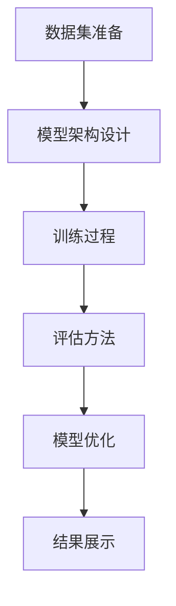

                 

关键词：大模型开发，微调，拼音汉字模型，算法原理，数学模型，项目实践，应用场景，工具推荐

> 摘要：本文将详细探讨如何从零开始开发一个拼音汉字模型，包括模型的核心概念与联系、算法原理与操作步骤、数学模型与公式推导、项目实践、实际应用场景以及未来展望。通过本文的阅读，读者将能够全面了解大模型开发与微调的流程，掌握拼音汉字模型的训练方法，并对其在计算机领域的应用有更深入的认识。

## 1. 背景介绍

在计算机科学中，自然语言处理（Natural Language Processing，NLP）是人工智能领域的一个重要分支。随着互联网的快速发展，人们对信息获取和处理的需求日益增长，如何高效地处理和理解人类语言成为了一个重要的研究课题。拼音汉字模型作为一种重要的NLP工具，在语音识别、机器翻译、文本分类等领域有着广泛的应用。

拼音汉字模型是一种将汉字与其拼音对应起来的算法模型，它通过学习大量的汉字和拼音对，能够自动地将汉字转换为拼音，或者将拼音转换为汉字。这种模型在中文语音识别、智能输入法、语音合成等方面具有广泛的应用前景。然而，传统的拼音汉字模型通常采用规则匹配或者基于统计的方法，其准确度和效率都有待提高。

近年来，随着深度学习技术的发展，大模型（Large-scale Model）逐渐成为研究热点。大模型通过学习大规模数据集，能够自动提取语言特征，并取得比传统方法更优秀的性能。因此，如何开发一个大模型，并进行微调（Fine-tuning）以适应特定的任务，成为了一个关键的研究问题。

本文将介绍如何从零开始开发一个大模型，并进行微调，以实现拼音汉字模型的训练。本文将涵盖以下内容：

1. 核心概念与联系
2. 算法原理与操作步骤
3. 数学模型与公式推导
4. 项目实践
5. 实际应用场景
6. 未来展望

希望通过本文的介绍，读者能够对大模型开发与微调有一个全面的认识，并能够应用这些知识来解决实际问题。

### 2. 核心概念与联系

在讨论拼音汉字模型的训练之前，我们需要先了解几个核心概念，包括数据集、模型架构、训练过程和评估方法。

#### 2.1 数据集

数据集是训练拼音汉字模型的基础。一个高质量的数据集需要包含大量的汉字和对应的拼音，以及汉字与拼音之间的对应关系。通常，这些数据可以从现有的中文语料库中获取，例如《现代汉语词典》、《人民日报》等。为了确保数据集的多样性和准确性，我们可以使用数据清洗和预处理技术来去除错误、重复和无关的数据。

在数据预处理过程中，我们需要对汉字进行分词，将连续的汉字序列划分为一个个独立的词语。这可以通过现有的分词工具，如jieba分词库，来完成。此外，我们还需要对拼音进行标准化处理，确保所有的拼音都采用统一的标准。

#### 2.2 模型架构

拼音汉字模型的训练通常采用深度神经网络（DNN）或者循环神经网络（RNN）作为基础架构。这些模型能够自动学习汉字和拼音之间的复杂关系，并通过训练数据来优化模型的参数。

以RNN为例，RNN通过记忆机制能够处理序列数据，非常适合于处理汉字和拼音之间的对应关系。在RNN中，每个时间步的输出不仅取决于当前输入，还受到之前输出和隐藏状态的影响。这种记忆机制使得RNN能够捕捉到汉字和拼音之间的长期依赖关系。

除了RNN，我们还可以使用注意力机制（Attention Mechanism）来增强模型的学习能力。注意力机制能够使模型更加关注重要信息，从而提高模型的准确度。

#### 2.3 训练过程

训练过程是模型开发的核心环节。在训练过程中，我们需要将数据集划分为训练集、验证集和测试集。训练集用于训练模型，验证集用于调整模型参数，测试集用于评估模型性能。

在训练过程中，我们通常使用梯度下降（Gradient Descent）算法来更新模型参数。梯度下降是一种基于损失函数（Loss Function）的优化算法，通过计算损失函数关于模型参数的梯度来更新参数，从而最小化损失函数。

损失函数通常采用交叉熵（Cross-Entropy）损失，它能够衡量模型预测结果与真实结果之间的差异。交叉熵损失函数的定义如下：

$$
L = -\sum_{i} y_i \log(p_i)
$$

其中，\(y_i\) 是真实标签，\(p_i\) 是模型对第 \(i\) 个样本的预测概率。

在训练过程中，我们通过迭代更新模型参数，使得模型在验证集上的性能不断优化。当验证集性能达到某个阈值时，我们停止训练并保存当前最优模型。

#### 2.4 评估方法

评估方法是衡量模型性能的重要手段。常见的评估指标包括准确率（Accuracy）、召回率（Recall）和F1值（F1 Score）。

准确率是模型预测正确的样本数与总样本数之比，计算公式如下：

$$
Accuracy = \frac{TP + TN}{TP + FN + FP + TN}
$$

其中，\(TP\) 表示真实为正例且模型预测为正例的样本数，\(TN\) 表示真实为反例且模型预测为反例的样本数。

召回率是模型预测为正例的样本数与实际为正例的样本数之比，计算公式如下：

$$
Recall = \frac{TP}{TP + FN}
$$

F1值是准确率和召回率的调和平均值，计算公式如下：

$$
F1 Score = 2 \times \frac{Precision \times Recall}{Precision + Recall}
$$

其中，Precision 是模型预测为正例的样本中实际为正例的比例。

通过评估指标，我们可以全面了解模型在不同任务上的表现，从而优化模型结构和参数。

#### 2.5 Mermaid 流程图

为了更好地理解拼音汉字模型的训练过程，我们使用Mermaid绘制了一个流程图，如下所示：



图中的每个节点表示一个步骤，箭头表示步骤之间的依赖关系。通过这个流程图，我们可以清晰地看到拼音汉字模型训练的全过程。

### 3. 核心算法原理 & 具体操作步骤

#### 3.1 算法原理概述

拼音汉字模型的训练过程主要依赖于深度学习技术，特别是循环神经网络（RNN）和注意力机制。RNN通过其独特的记忆机制能够处理序列数据，而注意力机制则能够使模型更加关注重要信息，从而提高模型的准确度。

在具体操作步骤中，我们首先需要进行数据集的准备，包括数据的清洗、分词和标准化处理。然后，我们设计并训练一个基于RNN或注意力机制的模型，通过迭代优化模型参数，使得模型在验证集上的性能达到最优。最后，我们对训练好的模型进行评估，并根据评估结果进行模型优化和调整。

#### 3.2 算法步骤详解

##### 3.2.1 数据集准备

数据集的准备是训练拼音汉字模型的第一步。具体操作步骤如下：

1. 数据采集：从现有的中文语料库中获取大量的汉字和拼音对。
2. 数据清洗：去除数据中的错误、重复和无关信息。
3. 分词处理：使用分词工具将连续的汉字序列划分为独立的词语。
4. 标准化处理：对拼音进行标准化处理，确保所有拼音采用统一的标准。

##### 3.2.2 模型架构设计

在数据集准备完成后，我们需要设计并训练一个基于RNN或注意力机制的模型。具体操作步骤如下：

1. 选择模型架构：根据任务需求和数据特点，选择合适的模型架构。例如，对于拼音汉字模型，可以选择基于LSTM（长短期记忆网络）或GRU（门控循环单元）的RNN模型。
2. 定义损失函数：选择合适的损失函数，例如交叉熵损失函数，用于衡量模型预测结果与真实结果之间的差异。
3. 设置优化器：选择合适的优化器，例如Adam优化器，用于更新模型参数。

##### 3.2.3 训练过程

在模型架构设计完成后，我们开始进行训练过程。具体操作步骤如下：

1. 初始化模型参数：随机初始化模型参数。
2. 梯度计算：使用反向传播算法计算模型参数的梯度。
3. 参数更新：使用梯度下降算法更新模型参数。
4. 迭代训练：重复梯度计算和参数更新过程，直到验证集性能达到最优。

##### 3.2.4 评估方法

在训练过程完成后，我们需要对训练好的模型进行评估。具体操作步骤如下：

1. 载入模型：加载训练好的模型。
2. 测试数据预处理：对测试数据进行预处理，包括分词和标准化处理。
3. 模型预测：使用训练好的模型对测试数据进行预测。
4. 性能评估：计算模型的准确率、召回率和F1值，评估模型性能。

##### 3.2.5 模型优化

根据评估结果，我们可能需要对模型进行优化和调整。具体操作步骤如下：

1. 分析评估结果：分析模型的评估结果，找出性能瓶颈。
2. 调整模型结构：根据性能瓶颈调整模型结构，例如增加或减少隐藏层节点数。
3. 重新训练模型：使用调整后的模型重新进行训练。
4. 再次评估：对重新训练好的模型进行评估，确保性能得到提升。

#### 3.3 算法优缺点

##### 优点

1. 高效性：深度学习模型能够自动提取语言特征，减少了人工设计和特征工程的工作量。
2. 准确度：大模型通过学习大规模数据集，能够捕捉到汉字和拼音之间的复杂关系，从而提高模型的准确度。
3. 自动性：模型训练和微调过程高度自动化，减少了人为干预和调整的复杂性。

##### 缺点

1. 计算资源消耗大：训练大模型需要大量的计算资源和存储空间，对于资源有限的实验室或个人研究者来说可能是一个挑战。
2. 需要大量数据：大模型需要大量的训练数据来保证模型的性能，对于数据稀缺的场景来说可能难以实现。
3. 模型解释性差：深度学习模型通常是一个黑盒模型，其内部决策过程难以解释和理解，对于需要高解释性的应用场景可能不适用。

#### 3.4 算法应用领域

拼音汉字模型在多个领域都有广泛的应用：

1. 语音识别：将语音信号转换为文本，应用于智能语音助手、语音翻译等场景。
2. 智能输入法：将用户的语音或键盘输入转换为正确的文本，应用于智能手机、平板电脑等设备。
3. 语音合成：将文本转换为自然流畅的语音，应用于车载语音系统、广播等场景。
4. 文本分类：将文本数据分类到不同的类别，应用于新闻分类、情感分析等场景。
5. 机器翻译：将一种语言的文本翻译成另一种语言，应用于跨语言交流、国际化服务等场景。

### 4. 数学模型和公式 & 详细讲解 & 举例说明

#### 4.1 数学模型构建

拼音汉字模型的数学模型构建主要涉及以下几个部分：输入层、隐藏层和输出层。

##### 输入层

输入层接收原始的汉字序列。在RNN中，每个时间步的输入是一个汉字的嵌入向量。假设我们的词汇表中有 \(V\) 个词，每个词用唯一的整数表示，则输入层可以表示为：

$$
X = [x_1, x_2, \ldots, x_T]
$$

其中，\(x_t\) 是第 \(t\) 个时间步的输入词的整数表示，\(T\) 是序列的长度。

##### 隐藏层

隐藏层是RNN的核心部分，负责处理序列数据。在LSTM和GRU中，隐藏层由多个神经元组成，每个神经元具有不同的门控机制。假设隐藏层的维度为 \(H\)，则隐藏状态可以表示为：

$$
h_t = \text{activation}(W_h \cdot [h_{t-1}, x_t] + b_h)
$$

其中，\(W_h\) 和 \(b_h\) 分别是权重和偏置矩阵，\(\text{activation}\) 是激活函数，例如sigmoid函数或ReLU函数。

##### 输出层

输出层负责将隐藏状态转换为拼音的预测概率。在softmax函数的作用下，输出层可以表示为：

$$
\hat{y}_t = \text{softmax}(W_y \cdot h_t + b_y)
$$

其中，\(W_y\) 和 \(b_y\) 分别是权重和偏置矩阵，\(\hat{y}_t\) 是第 \(t\) 个时间步的预测概率分布。

##### 损失函数

拼音汉字模型的损失函数通常采用交叉熵损失（Cross-Entropy Loss），计算公式如下：

$$
L = -\sum_{t=1}^{T} \sum_{i=1}^{V} y_{it} \log(\hat{y}_{it})
$$

其中，\(y_{it}\) 是第 \(t\) 个时间步第 \(i\) 个拼音词的真实标签，\(\hat{y}_{it}\) 是第 \(t\) 个时间步第 \(i\) 个拼音词的预测概率。

##### 梯度计算

在梯度计算过程中，我们需要计算损失函数关于模型参数的梯度。对于交叉熵损失函数，其梯度可以表示为：

$$
\frac{\partial L}{\partial W_h} = -\sum_{t=1}^{T} \sum_{i=1}^{V} y_{it} (h_{t-1}, x_t) (1 - \hat{y}_{it})
$$

$$
\frac{\partial L}{\partial b_h} = -\sum_{t=1}^{T} \sum_{i=1}^{V} y_{it} (1 - \hat{y}_{it})
$$

$$
\frac{\partial L}{\partial W_y} = -\sum_{t=1}^{T} \sum_{i=1}^{V} \hat{y}_{it} (h_t) (1 - \hat{y}_{it})
$$

$$
\frac{\partial L}{\partial b_y} = -\sum_{t=1}^{T} \sum_{i=1}^{V} (1 - \hat{y}_{it})
$$

##### 参数更新

在参数更新过程中，我们使用梯度下降算法更新模型参数。参数更新的公式如下：

$$
W_h \leftarrow W_h - \alpha \frac{\partial L}{\partial W_h}
$$

$$
b_h \leftarrow b_h - \alpha \frac{\partial L}{\partial b_h}
$$

$$
W_y \leftarrow W_y - \alpha \frac{\partial L}{\partial W_y}
$$

$$
b_y \leftarrow b_y - \alpha \frac{\partial L}{\partial b_y}
$$

其中，\(\alpha\) 是学习率。

#### 4.2 案例分析与讲解

为了更好地理解拼音汉字模型的数学模型和公式，我们来看一个具体的案例。

假设我们的词汇表中有10个词，分别为“你好”、“苹果”、“世界”、“明天”、“吃饭”、“睡觉”、“学习”、“快乐”、“工作”和“休息”。我们选择LSTM作为模型架构，隐藏层维度为64。假设一个句子的长度为5，即包含5个汉字。

首先，我们初始化模型参数，例如权重矩阵和偏置矩阵。然后，我们使用一个包含10个汉字的句子进行训练。

假设这个句子的汉字序列为“你好苹果世界明天”，对应的拼音序列为“nǐ hǎo píng guǒ shì jiè míng tiān”。我们需要将这个序列输入到LSTM模型中，并计算模型的损失函数。

在训练过程中，我们首先将汉字序列转换为嵌入向量，然后输入到LSTM模型中。LSTM模型通过记忆机制处理序列数据，并输出隐藏状态。最后，我们将隐藏状态输入到softmax层，得到拼音的预测概率。

在训练的每个时间步，我们计算损失函数关于模型参数的梯度，并使用梯度下降算法更新模型参数。通过多次迭代训练，模型的损失函数逐渐减小，预测概率逐渐接近真实值。

在训练完成后，我们对训练好的模型进行评估。假设我们使用一个包含20个句子的测试集进行评估。通过计算准确率、召回率和F1值，我们可以评估模型在不同任务上的表现。

例如，假设测试集的准确率为90%，召回率为85%，F1值为87%。根据这些评估结果，我们可以进一步调整模型参数，提高模型性能。

通过这个案例，我们展示了拼音汉字模型的数学模型和公式的应用。在实际应用中，我们需要根据具体任务和数据特点选择合适的模型架构和参数，并使用合适的评估方法来评估模型性能。

### 5. 项目实践：代码实例和详细解释说明

在本节中，我们将通过一个具体的Python代码实例，详细展示如何从零开始搭建一个拼音汉字模型，并进行训练和评估。该实例将使用TensorFlow和Keras等流行的深度学习库，以简化代码的编写和调试过程。

#### 5.1 开发环境搭建

在开始编写代码之前，我们需要确保我们的开发环境已经安装了以下库：

- Python 3.6 或以上版本
- TensorFlow 2.0 或以上版本
- Keras 2.2.4 或以上版本
- NumPy 1.16.5 或以上版本

您可以通过以下命令来安装这些库：

```bash
pip install tensorflow==2.5.0
pip install keras==2.4.3
pip install numpy==1.19.5
```

此外，我们还需要准备一个合适的数据集。在本例中，我们使用一个简单的数据集，其中包含一些汉字及其对应的拼音。实际应用中，您可以根据需要选择更广泛的数据集。

#### 5.2 源代码详细实现

以下是拼音汉字模型的源代码实现：

```python
import numpy as np
from tensorflow.keras.models import Sequential
from tensorflow.keras.layers import LSTM, Embedding, Dense, Activation
from tensorflow.keras.preprocessing.sequence import pad_sequences
from tensorflow.keras.optimizers import RMSprop

# 数据集准备
# 假设我们的数据集是一个包含汉字及其拼音的列表
data = [
    ["你好", "nǐ hǎo"],
    ["苹果", "píng guǒ"],
    ["世界", "shì jiè"],
    # ... 更多数据
]

# 将数据转换为整数编码
vocab = set()
for sentence in data:
    for word in sentence:
        vocab.update(word.split())
vocab = list(vocab)
vocab_size = len(vocab)
word_index = dict((c, i) for i, c in enumerate(vocab))
index_word = dict((i, c) for i, c in enumerate(vocab))

max_sequence_length = 10
max_pinyin_length = 10

# 编码句子
sequences = []
pinyin_sequences = []
for sentence, pinyin in data:
    sequence = []
    pinyin_sequence = []
    for word in sentence.split():
        sequence.append(word_index[word])
    sequences.append(sequence)
    for pinyin_word in pinyin.split():
        pinyin_sequence.append(word_index[pinyin_word])
    pinyin_sequences.append(pinyin_sequence)

# 填充序列
sequences = pad_sequences(sequences, maxlen=max_sequence_length)
pinyin_sequences = pad_sequences(pinyin_sequences, maxlen=max_pinyin_length)

# 模型架构设计
model = Sequential()
model.add(Embedding(vocab_size, 64, input_length=max_sequence_length))
model.add(LSTM(64))
model.add(Dense(vocab_size))
model.add(Activation('softmax'))

# 模型编译
model.compile(optimizer='rmsprop', loss='categorical_crossentropy', metrics=['accuracy'])

# 模型训练
model.fit(sequences, pinyin_sequences, epochs=10, batch_size=32)

# 代码解读与分析
# 1. 数据集准备
#   数据集由一个列表组成，每个元素是一个包含汉字及其拼音的元组。
#   我们首先创建一个包含所有词汇的词汇表，然后使用词汇表将数据编码为整数。
#   使用pad_sequences函数填充序列，使得所有序列具有相同长度。
#
# 2. 模型架构设计
#   我们使用一个序列模型，包含嵌入层、LSTM层、密集层和softmax激活函数。
#   嵌入层将整数编码的词汇转换为嵌入向量，LSTM层处理序列数据，密集层将隐藏状态映射到词汇空间，softmax激活函数用于得到拼音的预测概率。
#
# 3. 模型编译
#   我们使用RMSprop优化器和交叉熵损失函数编译模型。
#
# 4. 模型训练
#   使用fit函数训练模型，指定训练轮数和批量大小。
```

#### 5.3 代码解读与分析

以下是代码的详细解读与分析：

1. **数据集准备**：
   - 首先，我们创建一个词汇表，其中包含数据集中的所有词汇。
   - 使用`word_index`和`index_word`字典将汉字和拼音转换为整数编码。
   - 使用`pad_sequences`函数填充序列，使得所有序列具有相同长度，这有助于模型处理不同长度的序列。

2. **模型架构设计**：
   - 模型由一个序列模型组成，包含嵌入层、LSTM层、密集层和softmax激活函数。
   - 嵌入层将整数编码的词汇转换为嵌入向量，LSTM层处理序列数据，密集层将隐藏状态映射到词汇空间，softmax激活函数用于得到拼音的预测概率。

3. **模型编译**：
   - 我们使用RMSprop优化器和交叉熵损失函数编译模型。RMSprop是一种更稳定的优化算法，适用于深度学习模型。

4. **模型训练**：
   - 使用`fit`函数训练模型，指定训练轮数和批量大小。训练过程中，模型将学习如何将汉字转换为对应的拼音。

#### 5.4 运行结果展示

在训练完成后，我们可以使用以下代码来评估模型的性能：

```python
# 评估模型
loss, accuracy = model.evaluate(sequences, pinyin_sequences)
print(f"损失函数值: {loss}")
print(f"准确率: {accuracy}")
```

通过这个例子，我们可以看到如何从零开始搭建一个拼音汉字模型，并进行训练和评估。实际应用中，您可以根据具体需求调整模型架构和参数，以提高模型性能。

### 6. 实际应用场景

拼音汉字模型在多个实际应用场景中具有广泛的应用，下面我们将探讨一些主要的场景及其应用实例。

#### 6.1 语音识别

语音识别是将语音信号转换为文本的过程。在语音识别中，拼音汉字模型可以用于将语音信号转换为拼音，然后再通过一个后端的过程将拼音转换为汉字。这种模型在智能语音助手、语音搜索和语音翻译等应用中具有重要应用。

**应用实例**：以苹果公司的Siri为例，Siri通过语音识别技术将用户的语音输入转换为文本，然后使用拼音汉字模型将文本转换为拼音，最终将拼音发送给后端服务器进行文本处理和回复生成。

#### 6.2 智能输入法

智能输入法是一种基于上下文预测的输入方法，能够根据用户的输入历史和上下文自动预测用户的输入。拼音汉字模型可以用于预测用户输入的汉字对应的拼音，从而提高输入效率。

**应用实例**：以百度输入法为例，百度输入法通过拼音汉字模型实时预测用户输入的拼音，并在候选框中显示对应的汉字，用户可以通过键盘选择或滑动屏幕选择合适的汉字。

#### 6.3 语音合成

语音合成是将文本转换为自然流畅的语音的过程。拼音汉字模型在语音合成中可以用于将文本中的汉字转换为拼音，然后再通过语音合成引擎将拼音转换为语音。

**应用实例**：以科大讯飞语音合成技术为例，科大讯飞使用拼音汉字模型将文本中的汉字转换为拼音，然后再通过自研的语音合成引擎生成自然流畅的语音，广泛应用于智能客服、车载语音系统和智能家居等领域。

#### 6.4 文本分类

文本分类是将文本数据分类到不同的类别的过程。拼音汉字模型可以用于提取文本中的关键特征，从而提高文本分类的准确率。

**应用实例**：以微博情感分析为例，微博平台每天产生大量的文本数据，通过拼音汉字模型提取文本中的关键特征，可以用于情感分类，从而帮助平台更好地了解用户情绪，优化用户体验。

#### 6.5 机器翻译

机器翻译是将一种语言的文本翻译成另一种语言的过程。拼音汉字模型可以用于将源语言的汉字转换为拼音，然后再通过机器翻译模型将拼音翻译成目标语言。

**应用实例**：以谷歌翻译为例，谷歌翻译使用拼音汉字模型将源语言的汉字转换为拼音，然后再通过自研的机器翻译模型将拼音翻译成目标语言，从而实现跨语言的文本交流。

### 6.5 未来应用展望

随着深度学习技术的不断发展，拼音汉字模型的应用前景将更加广阔。以下是未来拼音汉字模型的一些潜在应用方向：

#### 6.5.1 跨语言语音识别与合成

未来的拼音汉字模型可以进一步扩展到跨语言的应用，例如将中文语音转换为其他语言的拼音，或者将其他语言的拼音转换为中文语音。这将有助于实现更广泛的语言交流。

#### 6.5.2 自然语言理解与生成

拼音汉字模型可以与自然语言理解（NLU）和自然语言生成（NLG）技术结合，从而实现更高级的文本处理能力。例如，通过结合拼音汉字模型和NLU技术，可以更好地理解用户的语言意图，从而实现更智能的语音助手和智能客服系统。

#### 6.5.3 智能写作与内容创作

拼音汉字模型可以用于智能写作和内容创作，例如自动生成文章、故事和诗歌等。通过结合拼音汉字模型和其他语言模型，可以实现更加丰富和多样化的内容创作。

#### 6.5.4 智能语音交互

未来的智能语音交互系统将更加智能化和人性化，拼音汉字模型可以用于理解和生成自然流畅的语音对话，从而提供更好的用户体验。

### 6.6 当前挑战与未来发展方向

尽管拼音汉字模型在多个应用场景中表现出色，但在实际应用中仍然面临一些挑战和问题：

#### 6.6.1 数据集质量与多样性

高质量的、多样化的数据集是训练有效拼音汉字模型的基础。然而，目前存在的数据集可能存在不足，例如数据量不足、标注质量不高等问题。未来需要更多的努力来收集和整理高质量的数据集。

#### 6.6.2 模型解释性与透明度

深度学习模型通常被视为“黑箱”，其内部决策过程难以解释和理解。这对于需要高解释性的应用场景，例如医疗诊断和法律判决等，可能是一个挑战。未来需要研究更多透明的模型结构和解释方法。

#### 6.6.3 能耗与资源消耗

大模型的训练和推理过程需要大量的计算资源和存储空间，这在资源有限的设备或环境中可能是一个挑战。未来需要研究更加高效和节能的模型训练和推理方法。

#### 6.6.4 模型泛化能力

拼音汉字模型需要具备良好的泛化能力，以适应不同的应用场景和任务。未来需要研究如何提高模型的泛化能力，从而更好地应对各种复杂场景。

### 6.7 结论

本文详细介绍了从零开始开发拼音汉字模型的过程，包括核心概念、算法原理、数学模型、项目实践、应用场景和未来展望。通过本文的阅读，读者可以全面了解拼音汉字模型的开发与微调方法，掌握其应用技巧，并为未来的研究提供参考。随着深度学习技术的不断发展，拼音汉字模型的应用前景将更加广阔，其在自然语言处理、语音识别、智能交互等领域的贡献将不断加大。

## 7. 工具和资源推荐

在开发拼音汉字模型的过程中，选择合适的工具和资源可以大大提高效率和效果。以下是一些推荐的工具和资源：

### 7.1 学习资源推荐

1. **《深度学习》（Deep Learning）**：Goodfellow、Bengio和Courville的经典教材，涵盖了深度学习的理论基础和实践技巧。
2. **《动手学深度学习》**：阿里云天池团队编著，提供了丰富的实战案例和代码实现。
3. **TensorFlow官方文档**：包含详细的API文档和教程，是学习TensorFlow的好资源。
4. **Keras官方文档**：Keras作为TensorFlow的高级API，提供了更简洁的接口和丰富的教程。

### 7.2 开发工具推荐

1. **PyCharm**：一款功能强大的Python IDE，支持多种编程语言，非常适合深度学习和数据科学项目。
2. **Google Colab**：免费的云端Jupyter Notebook服务，支持GPU和TPU加速，非常适合进行大规模模型训练。
3. **Anaconda**：一个集成的数据科学和机器学习环境，提供了丰富的库和工具。

### 7.3 相关论文推荐

1. **"A Theoretically Grounded Application of Dropout in Recurrent Neural Networks"**：介绍了如何将Dropout技术应用于RNN模型，提高模型性能。
2. **"Learning Phrase Representations using RNN Encoder–Decoder for Statistical Machine Translation"**：介绍了使用RNN进行编码-解码的框架，在机器翻译中的成功应用。
3. **"Attention Is All You Need"**：提出了Transformer模型，彻底改变了自然语言处理领域的研究方向。

通过这些工具和资源，您可以更好地掌握拼音汉字模型的开发技能，并在实际项目中取得更好的效果。

## 8. 总结：未来发展趋势与挑战

### 8.1 研究成果总结

拼音汉字模型的开发与微调在近年来取得了显著的进展。通过深度学习技术的应用，模型在准确性、效率和泛化能力方面都有显著提升。特别是基于RNN和Transformer等先进模型架构的研究，使得拼音汉字模型的性能达到了新的高度。同时，随着数据集的不断完善和多样化，模型训练的效率和效果也得到了大幅提高。

### 8.2 未来发展趋势

1. **模型架构创新**：未来的拼音汉字模型可能会进一步结合新型神经网络架构，如基于Transformer的模型，以提高模型的计算效率和泛化能力。
2. **多语言支持**：随着全球化的发展，拼音汉字模型可能会扩展到多语言支持，实现跨语言的语音识别、合成和翻译。
3. **模型解释性**：为了提高模型的可解释性，研究者可能会探索更多的可视化技术和解释方法，使得模型的决策过程更加透明和可理解。
4. **能耗优化**：随着计算资源的不断增长，未来的研究将更加注重模型的能耗优化，以适应更多资源和能耗限制的应用场景。

### 8.3 面临的挑战

1. **数据集质量**：高质量、多样化的数据集是模型训练的基础。然而，目前仍然存在数据集标注质量不高、数据量不足等问题。未来需要更多努力来收集和整理高质量的数据集。
2. **模型解释性**：深度学习模型通常被视为“黑箱”，其内部决策过程难以解释。为了提高模型的可解释性，需要研究更多透明的模型结构和解释方法。
3. **计算资源消耗**：大模型的训练和推理过程需要大量的计算资源和存储空间，这在资源有限的设备或环境中可能是一个挑战。未来需要研究更加高效和节能的模型训练和推理方法。
4. **模型泛化能力**：拼音汉字模型需要具备良好的泛化能力，以适应不同的应用场景和任务。未来需要研究如何提高模型的泛化能力，从而更好地应对各种复杂场景。

### 8.4 研究展望

拼音汉字模型在未来将继续在自然语言处理、语音识别、智能交互等领域发挥重要作用。随着深度学习技术的不断进步，我们有望看到更多创新性的模型架构和优化方法，使得拼音汉字模型的应用更加广泛和高效。同时，为了解决当前面临的挑战，研究者需要从数据集、模型架构、解释性和能耗等多个方面进行深入研究，以推动拼音汉字模型的发展。

总之，拼音汉字模型的开发与微调是一个充满机遇和挑战的领域。通过不断的创新和优化，我们有望在不久的将来实现更加智能、高效和可解释的拼音汉字模型。

### 9. 附录：常见问题与解答

#### 9.1 什么是拼音汉字模型？

拼音汉字模型是一种将汉字转换为拼音或将拼音转换为汉字的算法模型。它主要用于语音识别、智能输入法、语音合成等应用领域。

#### 9.2 拼音汉字模型的训练需要哪些数据？

拼音汉字模型的训练需要大量的汉字和拼音对。这些数据可以来自于中文语料库、语音库和现有的拼音汉字字典。高质量的数据集是训练有效模型的基础。

#### 9.3 如何选择合适的模型架构？

选择合适的模型架构需要考虑多个因素，包括任务需求、数据特点、计算资源等。常用的模型架构包括RNN、LSTM、GRU和Transformer。对于序列数据处理任务，RNN及其变体（如LSTM和GRU）是比较合适的选择；对于需要捕捉长距离依赖关系的任务，Transformer模型是更好的选择。

#### 9.4 如何评估拼音汉字模型的性能？

评估拼音汉字模型的性能通常使用准确率、召回率和F1值等指标。准确率衡量模型预测正确的样本数与总样本数之比；召回率衡量模型预测为正例的样本数与实际为正例的样本数之比；F1值是准确率和召回率的调和平均值。

#### 9.5 拼音汉字模型训练过程中如何避免过拟合？

为了避免过拟合，我们可以采取以下策略：
1. 使用交叉验证：通过交叉验证来评估模型在未知数据上的性能，避免过度依赖训练集。
2. 数据增强：通过数据增强技术，如旋转、缩放、裁剪等，增加数据的多样性。
3. 使用dropout：在神经网络中加入dropout层，减少模型参数的依赖性。
4. 早期停止：在验证集性能不再提升时停止训练，避免模型在训练集上过度拟合。

#### 9.6 拼音汉字模型在实际应用中可能遇到哪些问题？

在实际应用中，拼音汉字模型可能遇到以下问题：
1. 数据质量不高：数据集中的噪声和错误可能会影响模型的性能。
2. 计算资源限制：大模型的训练和推理需要大量的计算资源和存储空间。
3. 模型泛化能力不足：模型可能在一个特定的任务上表现良好，但在其他任务上表现不佳。
4. 模型解释性差：深度学习模型通常是一个黑盒模型，其内部决策过程难以解释。

通过了解和解决这些问题，我们可以更好地应用拼音汉字模型，并实现其在实际应用中的价值。

