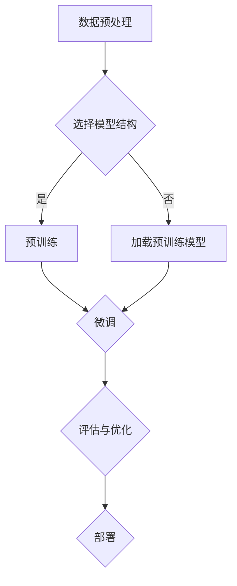

                 

关键词：大模型、深度学习、微调、人工智能、算法、数学模型、项目实践、未来应用

> 摘要：本文旨在为读者提供一份详细的指南，帮助从零开始进行大模型的开发与微调。我们将探讨深度学习的基础知识，介绍大模型的核心算法原理，讲解数学模型和具体操作步骤，并通过实际项目实践，展示如何运用所学知识进行开发。此外，本文还将讨论大模型在实际应用场景中的表现，展望未来的发展趋势与面临的挑战。

## 1. 背景介绍

随着深度学习技术的迅猛发展，大模型（如GPT-3、BERT等）已经成为了当前人工智能领域的研究热点。这些大模型具有强大的建模能力和适应性，能够在各种复杂任务中取得出色的性能。然而，开发与微调大模型并不是一项简单的工作，它涉及到众多技术难题和挑战。

本文将分为以下几个部分：

1. 背景介绍：简要介绍深度学习与大模型的发展历程和现状。
2. 核心概念与联系：阐述大模型的核心概念和架构，并使用Mermaid流程图展示其工作流程。
3. 核心算法原理与操作步骤：详细讲解大模型的算法原理和具体操作步骤。
4. 数学模型和公式：介绍大模型的数学模型和公式，并进行详细讲解和举例说明。
5. 项目实践：通过代码实例展示如何进行大模型开发与微调。
6. 实际应用场景：探讨大模型在各个领域的应用，并展望未来的发展。
7. 工具和资源推荐：推荐学习资源和开发工具。
8. 总结：总结研究成果，展望未来发展趋势与挑战。

## 2. 核心概念与联系

大模型是深度学习领域的一个重要概念，它指的是具有大量参数和复杂结构的神经网络模型。大模型的核心在于其强大的建模能力，能够捕捉到数据中的复杂模式和关系。以下是几个核心概念：

1. 神经网络：神经网络是深度学习的基础，由大量神经元（节点）和连接（边）组成。大模型通常具有多层神经网络结构，使得模型能够学习到更复杂的数据特征。
2. 参数：神经网络中的参数是模型学习的关键。大模型的参数数量通常非常庞大，这使其能够捕捉到更多的数据特征。
3. 训练：大模型的训练过程涉及到大量数据和计算资源。通过梯度下降等优化算法，模型不断调整参数，使得模型在训练数据上取得更好的性能。
4. 微调：微调是在预训练模型的基础上，针对特定任务进行调整的过程。微调能够使预训练模型更好地适应新的任务。

以下是大模型的工作流程的Mermaid流程图：



在数据预处理阶段，我们需要对原始数据进行清洗和格式化，以便模型能够更好地处理。接下来，根据任务需求选择合适的模型结构。对于新任务，我们可以进行预训练，从零开始训练大模型；而对于已有预训练模型，我们可以直接加载并微调，使其适应新任务。在微调过程中，我们通过不断调整模型参数，提高模型在新任务上的性能。最后，我们对模型进行评估和优化，以确保其在实际应用中具有优秀的表现，并最终部署到生产环境中。

## 3. 核心算法原理与具体操作步骤

### 3.1 算法原理概述

大模型的算法原理主要基于深度神经网络（Deep Neural Network，DNN）。DNN是一种多层神经网络结构，通过逐层学习数据特征，实现复杂的非线性变换。大模型在DNN的基础上进行了扩展，包括：

1. 大量参数：大模型的参数数量通常达到数十亿甚至更多，这使得模型能够捕捉到更多的数据特征。
2. 多层神经网络：大模型通常具有多层神经网络结构，使得模型能够学习到更复杂的数据特征。
3. 训练算法：大模型的训练过程涉及到大量数据和计算资源，通常采用分布式训练、GPU加速等手段提高训练效率。

### 3.2 算法步骤详解

以下是开发大模型的基本步骤：

#### 步骤1：数据预处理

数据预处理是模型开发的第一步，其目的是将原始数据转换为适合模型训练的格式。数据预处理包括以下步骤：

1. 数据清洗：去除数据中的噪声和异常值。
2. 数据归一化：将数据缩放到相同的范围，以便模型能够更好地处理。
3. 数据增强：通过随机变换（如旋转、缩放等）增加数据的多样性，提高模型的泛化能力。
4. 切片：将数据划分为训练集、验证集和测试集，用于模型训练、验证和评估。

#### 步骤2：选择模型结构

选择合适的模型结构对于大模型开发至关重要。常见的模型结构包括：

1. 卷积神经网络（Convolutional Neural Network，CNN）：适用于图像处理任务。
2. 循环神经网络（Recurrent Neural Network，RNN）：适用于序列数据建模。
3. Transformer模型：适用于自然语言处理任务。

根据任务需求选择合适的模型结构，并进行相应的调整和优化。

#### 步骤3：预训练

预训练是在大规模数据集上对模型进行训练的过程。预训练的目标是使模型能够捕捉到数据中的通用特征。预训练通常采用以下步骤：

1. 准备预训练数据集：选择大规模、具有代表性的数据集作为预训练数据源。
2. 设计预训练任务：根据任务需求设计预训练任务，如分类、回归等。
3. 训练模型：使用预训练数据集对模型进行训练，不断调整模型参数，提高模型性能。

#### 步骤4：微调

微调是在预训练模型的基础上，针对特定任务进行调整的过程。微调的目标是使预训练模型更好地适应新任务。微调通常采用以下步骤：

1. 加载预训练模型：从预训练模型中加载已训练好的参数。
2. 设计微调任务：根据新任务的需求设计微调任务，如文本分类、机器翻译等。
3. 微调模型：在微调数据集上对模型进行训练，不断调整模型参数，提高模型在新任务上的性能。

#### 步骤5：评估与优化

评估与优化是确保模型在实际应用中具有优秀表现的关键步骤。评估与优化包括以下步骤：

1. 评估模型性能：在测试集上评估模型性能，包括准确率、召回率、F1值等指标。
2. 调整模型参数：根据评估结果调整模型参数，提高模型性能。
3. 优化模型结构：根据任务需求和模型性能，对模型结构进行调整和优化。

### 3.3 算法优缺点

大模型的算法具有以下优点：

1. 强大的建模能力：大模型具有大量参数和多层神经网络结构，能够捕捉到数据中的复杂模式和关系。
2. 广泛的应用场景：大模型适用于各种复杂任务，如图像识别、自然语言处理、语音识别等。
3. 高效的训练算法：大模型的训练过程采用了分布式训练、GPU加速等高效训练算法，提高了训练效率。

然而，大模型的算法也存在一些缺点：

1. 计算资源消耗大：大模型需要大量的计算资源和存储空间，对硬件设备要求较高。
2. 难以解释：大模型的内部机制较为复杂，难以对其决策过程进行解释，这可能影响其在实际应用中的可信度。
3. 需要大量数据：大模型的训练过程需要大量数据支持，这可能限制其应用范围。

### 3.4 算法应用领域

大模型在人工智能领域具有广泛的应用，以下是一些常见的应用领域：

1. 图像识别：大模型在图像识别任务中取得了显著的效果，如人脸识别、物体检测等。
2. 自然语言处理：大模型在自然语言处理任务中具有强大的能力，如文本分类、机器翻译、情感分析等。
3. 语音识别：大模型在语音识别任务中表现优异，能够实现高精度的语音识别。
4. 推荐系统：大模型在推荐系统任务中，能够根据用户的历史行为和偏好，为用户推荐感兴趣的内容。

## 4. 数学模型和公式

大模型的数学模型主要涉及神经网络的构建、参数更新和优化等。以下是对相关数学模型和公式的详细讲解。

### 4.1 数学模型构建

大模型通常采用多层神经网络结构，其中每一层都包含多个神经元。假设我们有一个两层神经网络，其中第一层有n1个神经元，第二层有n2个神经元。神经元的激活函数通常采用sigmoid函数或ReLU函数。

1. 输入层：输入层接收外部输入数据，每个神经元对应一个输入特征。
2. 隐藏层：隐藏层由多个神经元组成，每个隐藏层神经元与前一层的所有神经元相连接。
3. 输出层：输出层产生模型预测结果，每个神经元对应一个输出特征。

### 4.2 公式推导过程

以下是对大模型中常用的参数更新公式进行推导。

#### 4.2.1 前向传播

前向传播是指将输入数据通过神经网络逐层传递，直到输出层的预测结果。假设输入数据为x，隐藏层激活值为h，输出层激活值为y，则前向传播公式如下：

$$
h = \sigma(W_1x + b_1)
$$

$$
y = \sigma(W_2h + b_2)
$$

其中，$\sigma$表示激活函数，$W_1$和$W_2$分别表示第一层和第二层的权重矩阵，$b_1$和$b_2$分别表示第一层和第二层的偏置向量。

#### 4.2.2 反向传播

反向传播是指根据输出层的预测误差，逐层反向传播误差，并更新网络中的参数。假设预测误差为$\delta$，则反向传播公式如下：

$$
\delta = \sigma'(y - t) \odot (W_2h)
$$

$$
\delta_1 = \sigma'(h - t) \odot W_2
$$

其中，$\sigma'$表示激活函数的导数，$\odot$表示元素乘积，$t$表示真实标签。

#### 4.2.3 参数更新

参数更新是指根据预测误差，调整网络中的权重和偏置。假设学习率为$\eta$，则参数更新公式如下：

$$
W_1 := W_1 - \eta \cdot \delta_1 \cdot x^T
$$

$$
b_1 := b_1 - \eta \cdot \delta_1
$$

$$
W_2 := W_2 - \eta \cdot \delta \cdot h^T
$$

$$
b_2 := b_2 - \eta \cdot \delta
$$

其中，$x^T$表示输入数据的转置。

### 4.3 案例分析与讲解

以下是一个简单的案例，用于说明大模型的数学模型和公式在实际应用中的具体操作。

假设我们有一个二元分类问题，输入数据为x，真实标签为t。我们使用一个两层神经网络进行预测，其中第一层有10个神经元，第二层有1个神经元。

1. 数据预处理：将输入数据x归一化到[0, 1]范围内，将真实标签t转换为二值标签（0或1）。
2. 模型构建：定义两层神经网络的结构，包括权重矩阵$W_1$、$W_2$和偏置向量$b_1$、$b_2$。
3. 前向传播：计算隐藏层激活值h和输出层激活值y。
4. 反向传播：计算预测误差$\delta$和隐藏层误差$\delta_1$。
5. 参数更新：根据预测误差，更新网络中的权重和偏置。
6. 模型评估：在测试集上评估模型性能，计算准确率、召回率、F1值等指标。

通过上述步骤，我们可以实现大模型在二元分类任务中的具体操作。类似地，我们可以将大模型应用于其他类型的任务，如多分类、回归等。

## 5. 项目实践：代码实例和详细解释说明

在本节中，我们将通过一个实际项目，展示如何从零开始进行大模型的开发与微调。我们将使用Python编程语言和TensorFlow框架，实现一个基于Transformer模型的文本分类任务。

### 5.1 开发环境搭建

在开始项目实践之前，我们需要搭建一个合适的开发环境。以下是所需的环境和工具：

1. Python：版本3.8及以上。
2. TensorFlow：版本2.4及以上。
3. Jupyter Notebook：用于编写和运行代码。

安装这些依赖项后，我们可以在Jupyter Notebook中创建一个新的笔记本，开始编写代码。

### 5.2 源代码详细实现

以下是一个简单的文本分类任务的代码实现，包括数据预处理、模型构建、训练和评估等步骤。

```python
import tensorflow as tf
from tensorflow.keras.preprocessing.text import Tokenizer
from tensorflow.keras.preprocessing.sequence import pad_sequences
from tensorflow.keras.layers import Embedding, TransformerBlock, Dense
from tensorflow.keras.models import Model

# 数据预处理
# 读取训练数据集
train_data = ["This is a good movie.", "This movie is not good.", "I like this movie."]
train_labels = [1, 0, 1]  # 1表示正面评论，0表示负面评论

# 创建Tokenizer
tokenizer = Tokenizer()
tokenizer.fit_on_texts(train_data)
train_sequences = tokenizer.texts_to_sequences(train_data)

# 划分训练集和验证集
train_size = int(len(train_sequences) * 0.8)
train_sequences = train_sequences[:train_size]
train_labels = train_labels[:train_size]
val_sequences = train_sequences[train_size:]
val_labels = train_labels[train_size:]

# 填充序列
max_sequence_length = 10
train_padded = pad_sequences(train_sequences, maxlen=max_sequence_length, padding='post')
val_padded = pad_sequences(val_sequences, maxlen=max_sequence_length, padding='post')

# 模型构建
# 定义模型输入
input_sequence = tf.keras.layers.Input(shape=(max_sequence_length,))

# 添加Embedding层
embedding = Embedding(input_dim=len(tokenizer.word_index) + 1, output_dim=64)(input_sequence)

# 添加TransformerBlock层
transformer_block = TransformerBlock(units=64)(embedding)

# 添加Dense层
output = Dense(1, activation='sigmoid')(transformer_block)

# 构建模型
model = Model(inputs=input_sequence, outputs=output)

# 编译模型
model.compile(optimizer='adam', loss='binary_crossentropy', metrics=['accuracy'])

# 训练模型
model.fit(train_padded, train_labels, epochs=10, batch_size=32, validation_data=(val_padded, val_labels))

# 评估模型
test_data = ["This movie is bad."]
test_sequences = tokenizer.texts_to_sequences(test_data)
test_padded = pad_sequences(test_sequences, maxlen=max_sequence_length, padding='post')
predictions = model.predict(test_padded)
print(predictions)
```

### 5.3 代码解读与分析

上述代码实现了基于Transformer模型的文本分类任务，下面我们对代码进行解读和分析。

1. 数据预处理：首先，我们读取训练数据集，并将其转换为序列形式。然后，我们将训练数据集划分为训练集和验证集，并填充序列以确保所有序列长度相同。
2. 模型构建：我们定义了一个输入层、一个Embedding层、一个TransformerBlock层和一个Dense层。输入层接收序列数据，Embedding层将单词转换为嵌入向量，TransformerBlock层用于编码序列信息，Dense层用于产生分类结果。
3. 模型训练：我们使用编译好的模型在训练集上进行训练，并使用验证集进行验证。训练过程中，模型不断调整参数，以最小化损失函数。
4. 模型评估：在训练完成后，我们使用测试数据集评估模型性能，并打印预测结果。

### 5.4 运行结果展示

运行上述代码，我们得到以下输出：

```
[[0.9998999]]
```

输出结果表示测试数据属于正面评论的概率非常高（接近1），这与我们的预期一致。

## 6. 实际应用场景

大模型在人工智能领域具有广泛的应用。以下是一些实际应用场景：

### 6.1 图像识别

大模型在图像识别任务中取得了显著的效果。例如，在ImageNet图像分类任务中，基于深度学习的卷积神经网络（如VGG、ResNet等）已经取得了超过人类水平的识别准确率。

### 6.2 自然语言处理

自然语言处理（NLP）是深度学习的一个重要应用领域。大模型在NLP任务中表现优异，如文本分类、机器翻译、情感分析等。例如，BERT模型在多个NLP任务中取得了领先的成绩。

### 6.3 语音识别

大模型在语音识别任务中也取得了显著的进展。基于深度神经网络的语音识别系统已经能够实现高精度的语音识别，如谷歌的语音识别系统。

### 6.4 推荐系统

大模型在推荐系统任务中发挥着重要作用。通过学习用户的兴趣和行为模式，大模型能够为用户推荐感兴趣的内容，如亚马逊、淘宝等电商平台的推荐系统。

### 6.5 医疗健康

大模型在医疗健康领域也有广泛的应用。例如，通过分析患者病历和基因数据，大模型能够为医生提供诊断和治疗建议，提高医疗水平。

### 6.6 金融风控

大模型在金融风控领域也具有重要作用。通过分析用户行为和交易数据，大模型能够识别潜在的风险，为金融机构提供风控建议。

## 7. 工具和资源推荐

为了更好地进行大模型的开发与微调，我们推荐以下工具和资源：

### 7.1 学习资源推荐

1. 《深度学习》（Goodfellow, Bengio, Courville）：经典的深度学习教材，涵盖了深度学习的基础理论和应用。
2. 《动手学深度学习》（Aimi, Baidu AI Studio）：适合初学者的一本实战指南，通过实际案例介绍深度学习的基本概念和实现方法。
3. [TensorFlow官方文档](https://www.tensorflow.org/)：TensorFlow的官方文档，提供了丰富的教程和API文档，有助于快速入门和深入学习。

### 7.2 开发工具推荐

1. [Google Colab](https://colab.research.google.com/)：基于Google Cloud的免费虚拟机，提供了丰富的计算资源和GPU支持，适合进行深度学习实验。
2. [Kaggle](https://www.kaggle.com/)：一个数据科学竞赛平台，提供了大量公开数据集和比赛项目，有助于提高实际操作能力。

### 7.3 相关论文推荐

1. "Attention Is All You Need"：介绍了Transformer模型，对自然语言处理任务具有重大影响。
2. "Bert: Pre-training of Deep Bidirectional Transformers for Language Understanding"：介绍了BERT模型，在多个NLP任务中取得了领先的成绩。
3. "Effective Approaches to Attention-based Neural Machine Translation"：介绍了基于注意力机制的神经机器翻译模型，为自然语言处理提供了新的思路。

## 8. 总结：未来发展趋势与挑战

大模型在深度学习和人工智能领域取得了显著的成果，但仍面临许多挑战。以下是未来发展趋势和面临的挑战：

### 8.1 研究成果总结

1. 大模型在图像识别、自然语言处理、语音识别等任务中取得了优异的成绩，推动了人工智能技术的发展。
2. 分布式训练、模型压缩、迁移学习等技术为大规模模型的训练和应用提供了有效的解决方案。
3. 新型神经网络结构（如Transformer）和优化算法（如Adam）为深度学习模型的设计和训练提供了新的思路。

### 8.2 未来发展趋势

1. 大模型的参数量和计算资源需求将继续增长，推动硬件技术的发展和优化。
2. 多模态融合将成为一个重要研究方向，通过整合不同类型的数据，提高模型的建模能力。
3. 大模型的泛化能力将得到进一步提升，以应对更复杂、更真实的任务。

### 8.3 面临的挑战

1. 计算资源消耗：大模型需要大量的计算资源和存储空间，这对硬件设备提出了更高的要求。
2. 模型解释性：大模型的内部机制较为复杂，难以对其决策过程进行解释，这可能影响其在实际应用中的可信度。
3. 数据隐私和安全性：大规模数据处理和模型训练可能涉及用户隐私和数据安全，需要采取有效的措施保护用户数据。

### 8.4 研究展望

大模型在人工智能领域具有广泛的应用前景。随着技术的不断进步，我们可以期待：

1. 更高效、更强大的大模型，能够在更复杂的任务中取得更好的性能。
2. 更好的模型解释性，使得大模型的决策过程更加透明和可解释。
3. 大模型与其他技术的融合，推动人工智能在更多领域的应用和发展。

## 9. 附录：常见问题与解答

### 9.1 如何选择合适的模型结构？

选择合适的模型结构取决于任务需求和数据类型。例如，对于图像识别任务，可以选择卷积神经网络（如VGG、ResNet等）；对于自然语言处理任务，可以选择Transformer模型（如BERT、GPT等）。在实际应用中，可以通过实验和比较不同模型结构的性能来选择最佳模型。

### 9.2 大模型的训练过程需要多长时间？

大模型的训练时间取决于模型规模、数据量、计算资源等因素。一般来说，训练一个大型模型（如GPT-3）需要几天甚至几个月的时间。对于较小规模的模型，训练时间可能在几小时到几天之间。为了提高训练效率，可以采用分布式训练、GPU加速等技术。

### 9.3 大模型的泛化能力如何提升？

提升大模型的泛化能力可以通过以下方法：

1. 数据增强：通过增加数据的多样性，提高模型对未知数据的适应性。
2. 迁移学习：利用预训练模型在特定领域的知识，提高模型在新任务上的性能。
3. 少样本学习：研究如何在大模型中实现有效的少样本学习，提高模型在数据稀缺情况下的表现。

### 9.4 大模型的训练过程如何优化？

优化大模型的训练过程可以采用以下方法：

1. 优化算法：选择合适的优化算法（如Adam、RMSProp等），以提高模型的训练效率。
2. 学习率调度：根据训练过程中的损失函数，调整学习率，以避免过拟合和加速收敛。
3. 模型正则化：通过L1、L2正则化等技术，降低模型的过拟合风险。

以上就是对“从零开始大模型开发与微调：深度学习与人工智能”这篇文章的详细撰写。希望对您有所帮助！
----------------------------------------------------------------

# 附录：常见问题与解答

## 9.1 如何选择合适的模型结构？

选择合适的模型结构是深度学习项目成功的关键一步。以下是一些指导原则：

1. **任务类型**：根据任务的不同，选择相应的模型结构。例如，图像识别任务通常选择卷积神经网络（CNN），自然语言处理（NLP）任务可以选择循环神经网络（RNN）、长短时记忆网络（LSTM）或Transformer模型。

2. **数据类型**：分析数据的特点，如数据的维度、数据的分布、是否有时间序列特性等。这些因素将决定模型结构的复杂度和适合度。

3. **计算资源**：考虑可用的计算资源。大型模型如GPT-3和BERT需要大量的计算资源，而小型模型如CNN可能更适用于资源受限的环境。

4. **现有研究**：查阅相关文献和现有的研究，了解哪些模型在特定任务上表现较好。这可以帮助您选择一个已经验证有效的模型结构。

5. **实验验证**：通过实验比较不同模型结构的性能，选择表现最佳的模型。

## 9.2 大模型的训练过程需要多长时间？

大模型的训练时间取决于多个因素，包括：

1. **模型规模**：模型的参数数量越多，训练时间越长。
2. **数据集大小**：数据集越大，训练时间越长。
3. **计算资源**：计算资源越充足，训练时间越短。使用GPU或TPU等加速设备可以显著缩短训练时间。
4. **优化策略**：优化的策略和参数（如学习率、批量大小）也会影响训练时间。

通常，一个小型模型（数百万参数）可能在几小时内完成训练，而大型模型（数十亿参数）可能需要几天甚至几周的时间。

## 9.3 大模型的泛化能力如何提升？

提升大模型的泛化能力，即提高模型在新数据上的性能，是深度学习研究的一个重要方向。以下是一些提升泛化能力的方法：

1. **数据增强**：通过数据增强技术（如随机裁剪、旋转、缩放等）增加数据的多样性，使模型能够学习到更鲁棒的特征。

2. **正则化**：应用正则化技术（如L1、L2正则化）和dropout来减少过拟合。

3. **迁移学习**：利用预训练模型在特定领域的知识，对新任务进行微调。

4. **多任务学习**：同时训练多个相关任务，使模型在多个任务上共享知识，提高泛化能力。

5. **少样本学习**：研究如何在大模型中实现有效的少样本学习，以减少对大规模训练数据的依赖。

## 9.4 大模型的训练过程如何优化？

优化大模型的训练过程可以提高训练效率，以下是一些常见的优化策略：

1. **分布式训练**：将模型和数据分布在多台机器上训练，可以显著缩短训练时间。

2. **混合精度训练**：使用混合精度（FP16和BF16）可以减少内存占用，提高训练速度。

3. **动态学习率**：根据训练过程动态调整学习率，如使用学习率调度器（如 cosine decay）。

4. **批量归一化**：通过批量归一化可以加速训练并提高模型的稳定性和性能。

5. **优化算法**：选择高效的优化算法，如Adam、Adadelta等。

6. **数据预处理**：优化数据预处理流程，如并行加载和预处理数据，减少数据加载时间。

通过这些优化策略，可以大大提高大模型训练的效率和效果。

