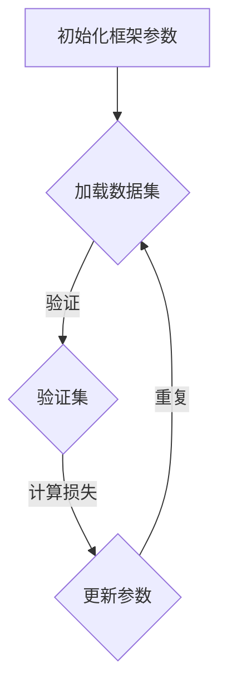

                 

关键词：大模型开发、微调、神经网络框架、自定义设计、计算机编程

摘要：本文将深入探讨大模型开发与微调的技术细节，从零开始构建自定义神经网络框架。我们将介绍核心概念、算法原理、数学模型、项目实践以及实际应用场景，为读者提供全面的技术指导。

## 1. 背景介绍

在人工智能领域，大模型开发已经成为当前研究的热点。随着计算能力的提升和海量数据的积累，深度学习模型（尤其是大模型）在各类任务中展现出强大的性能。然而，现有的开源框架虽然功能强大，但在特定场景下可能无法满足需求。因此，本文旨在通过自定义神经网络框架的设计与实现，为开发者提供一种灵活的解决方案。

### 1.1 大模型开发的重要性

大模型在自然语言处理、计算机视觉、语音识别等领域发挥了重要作用。例如，GPT-3、BERT等大模型在文本生成、文本分类、图像识别等任务中取得了显著的成果。大模型的开发不仅需要高效的计算资源，还需要深入理解模型的结构和训练过程。

### 1.2 自定义神经网络框架的需求

开源框架如TensorFlow、PyTorch等在深度学习领域取得了巨大成功，但它们在以下几个方面可能无法满足特定需求：

1. **定制化需求**：开源框架虽然功能丰富，但在特定场景下可能需要调整模型结构或算法，以满足个性化需求。
2. **性能优化**：针对特定硬件平台，开发者可能需要对模型进行性能优化，以实现更高的计算效率和资源利用率。
3. **可扩展性**：开源框架在扩展性方面可能存在限制，使得开发者难以在框架中集成新的算法或模型。

## 2. 核心概念与联系

为了构建自定义神经网络框架，我们需要了解以下核心概念：

### 2.1 神经网络基础

神经网络是由大量神经元组成的计算模型，通过训练可以学习到复杂的非线性映射关系。神经网络主要包括以下组成部分：

1. **输入层**：接收外部输入数据。
2. **隐藏层**：用于数据转换和特征提取。
3. **输出层**：生成最终预测结果。

### 2.2 激活函数

激活函数用于引入非线性特性，使神经网络能够学习更复杂的函数关系。常见的激活函数包括Sigmoid、ReLU、Tanh等。

### 2.3 损失函数

损失函数用于衡量模型预测结果与真实值之间的差距，是训练过程中优化目标。常见的损失函数包括均方误差（MSE）、交叉熵（Cross-Entropy）等。

### 2.4 优化算法

优化算法用于调整模型参数，以降低损失函数值。常见的优化算法包括梯度下降（Gradient Descent）、Adam等。

### 2.5 Mermaid 流程图

以下是一个简单的Mermaid流程图，展示了神经网络框架的基本设计：



## 3. 核心算法原理 & 具体操作步骤

### 3.1 算法原理概述

自定义神经网络框架的核心算法主要包括以下几个步骤：

1. **数据预处理**：对输入数据进行归一化、标准化等处理，以提高训练效果。
2. **模型构建**：根据任务需求构建神经网络模型，包括输入层、隐藏层和输出层。
3. **损失函数选择**：根据任务类型选择合适的损失函数，以衡量模型预测结果与真实值之间的差距。
4. **优化算法应用**：使用优化算法调整模型参数，以降低损失函数值。
5. **模型训练与验证**：在训练集上训练模型，并在验证集上进行验证，以评估模型性能。

### 3.2 算法步骤详解

1. **数据预处理**：

   数据预处理是模型训练的第一步，包括以下操作：

   - 数据清洗：去除异常值、缺失值等。
   - 数据归一化：将数据缩放到同一范围，如[0, 1]。
   - 数据标准化：将数据缩放到标准正态分布。

2. **模型构建**：

   模型构建是自定义神经网络框架的核心，需要根据任务需求设计神经网络结构。以下是一个简单的神经网络结构示例：

   ```python
   import tensorflow as tf

   model = tf.keras.Sequential([
       tf.keras.layers.Dense(128, activation='relu', input_shape=(input_shape)),
       tf.keras.layers.Dense(64, activation='relu'),
       tf.keras.layers.Dense(1, activation='sigmoid')
   ])
   ```

3. **损失函数选择**：

   损失函数用于衡量模型预测结果与真实值之间的差距。以下是一个简单的损失函数选择示例：

   ```python
   loss_fn = tf.keras.losses.BinaryCrossentropy()
   ```

4. **优化算法应用**：

   优化算法用于调整模型参数，以降低损失函数值。以下是一个简单的优化算法选择示例：

   ```python
   optimizer = tf.keras.optimizers.Adam()
   ```

5. **模型训练与验证**：

   模型训练与验证是模型构建的关键步骤，包括以下操作：

   - 在训练集上训练模型，使用优化算法更新参数。
   - 在验证集上验证模型性能，以评估模型泛化能力。

### 3.3 算法优缺点

自定义神经网络框架的优点如下：

- **灵活性**：可以针对特定任务需求进行模型设计和参数调整。
- **性能优化**：可以针对特定硬件平台进行性能优化，提高计算效率。
- **可扩展性**：可以方便地集成新的算法或模型，以适应不断变化的需求。

自定义神经网络框架的缺点如下：

- **复杂性**：构建和调试自定义框架需要较高的技术水平。
- **资源消耗**：自定义框架可能需要更多的计算资源和存储空间。

### 3.4 算法应用领域

自定义神经网络框架可以应用于各种深度学习任务，如：

- **计算机视觉**：图像分类、目标检测、人脸识别等。
- **自然语言处理**：文本分类、情感分析、机器翻译等。
- **语音识别**：语音信号处理、说话人识别、语音合成等。

## 4. 数学模型和公式 & 详细讲解 & 举例说明

### 4.1 数学模型构建

神经网络中的数学模型主要包括以下几个方面：

1. **输入层到隐藏层的映射**：

   输入层到隐藏层的映射可以使用以下公式表示：

   $$ z = \sigma(W \cdot X + b) $$

   其中，$W$是权重矩阵，$X$是输入向量，$b$是偏置项，$\sigma$是激活函数。

2. **隐藏层到输出层的映射**：

   隐藏层到输出层的映射可以使用以下公式表示：

   $$ y = \sigma(W \cdot z + c) $$

   其中，$W$是权重矩阵，$z$是隐藏层输出，$c$是偏置项，$\sigma$是激活函数。

3. **损失函数**：

   损失函数用于衡量模型预测结果与真实值之间的差距。常见的损失函数包括均方误差（MSE）和交叉熵（Cross-Entropy）。

   - **均方误差（MSE）**：

     $$ L = \frac{1}{2} \sum_{i=1}^{n} (y_i - \hat{y}_i)^2 $$

     其中，$y_i$是真实值，$\hat{y}_i$是预测值。

   - **交叉熵（Cross-Entropy）**：

     $$ L = -\sum_{i=1}^{n} y_i \log(\hat{y}_i) $$

     其中，$y_i$是真实值，$\hat{y}_i$是预测值。

4. **优化算法**：

   优化算法用于调整模型参数，以降低损失函数值。常见的优化算法包括梯度下降（Gradient Descent）和Adam。

   - **梯度下降（Gradient Descent）**：

     $$ \theta_{t+1} = \theta_t - \alpha \nabla_{\theta}L(\theta_t) $$

     其中，$\theta_t$是当前参数，$\alpha$是学习率，$\nabla_{\theta}L(\theta_t)$是损失函数关于参数的梯度。

   - **Adam算法**：

     $$ m_t = \beta_1 m_{t-1} + (1 - \beta_1) \nabla_{\theta}L(\theta_t) $$
     $$ v_t = \beta_2 v_{t-1} + (1 - \beta_2) \nabla_{\theta}L(\theta_t)^2 $$
     $$ \theta_{t+1} = \theta_t - \alpha \frac{m_t}{\sqrt{v_t} + \epsilon} $$

     其中，$m_t$和$v_t$是指数加权移动平均值，$\beta_1$和$\beta_2$是超参数，$\epsilon$是偏置项。

### 4.2 公式推导过程

以下是一个简单的神经网络公式推导过程：

假设有一个两层神经网络，输入层有$n$个神经元，隐藏层有$m$个神经元，输出层有$p$个神经元。激活函数使用ReLU。

1. **输入层到隐藏层的映射**：

   输入层到隐藏层的映射可以表示为：

   $$ z_i^h = \sigma(W_{ih} \cdot x_i + b_h) $$

   其中，$z_i^h$是隐藏层第$i$个神经元的输出，$W_{ih}$是输入层到隐藏层的权重矩阵，$x_i$是输入层第$i$个神经元的输入，$b_h$是隐藏层偏置项。

2. **隐藏层到输出层的映射**：

   隐藏层到输出层的映射可以表示为：

   $$ z_j^o = \sigma(W_{ho} \cdot z_h^j + b_o) $$

   其中，$z_j^o$是输出层第$j$个神经元的输出，$W_{ho}$是隐藏层到输出层的权重矩阵，$z_h^j$是隐藏层第$j$个神经元的输出，$b_o$是输出层偏置项。

3. **损失函数**：

   假设输出层为二分类问题，损失函数可以使用交叉熵表示：

   $$ L = -\sum_{i=1}^{n} y_i \log(\hat{y}_i) + (1 - y_i) \log(1 - \hat{y}_i) $$

   其中，$y_i$是真实标签，$\hat{y}_i$是输出层第$i$个神经元的输出。

4. **优化算法**：

   使用梯度下降算法优化模型参数，可以表示为：

   $$ \theta_{t+1} = \theta_t - \alpha \nabla_{\theta}L(\theta_t) $$

   其中，$\theta_t$是当前参数，$\alpha$是学习率，$\nabla_{\theta}L(\theta_t)$是损失函数关于参数的梯度。

### 4.3 案例分析与讲解

以下是一个简单的案例，展示如何使用自定义神经网络框架进行图像分类：

1. **数据准备**：

   假设我们使用CIFAR-10数据集，包含10个类别的60000张32x32的彩色图像。我们将图像进行归一化处理，将像素值缩放到[0, 1]。

2. **模型构建**：

   我们构建一个简单的卷积神经网络，包括一个卷积层、一个池化层和一个全连接层。

   ```python
   import tensorflow as tf
   import tensorflow.keras.layers as layers

   model = tf.keras.Sequential([
       layers.Conv2D(32, (3, 3), activation='relu', input_shape=(32, 32, 3)),
       layers.MaxPooling2D((2, 2)),
       layers.Flatten(),
       layers.Dense(128, activation='relu'),
       layers.Dense(10, activation='softmax')
   ])
   ```

3. **模型训练**：

   我们使用交叉熵作为损失函数，Adam作为优化算法。在训练过程中，我们将训练集数据分成批次，每个批次包含1000张图像。

   ```python
   model.compile(optimizer='adam', loss='categorical_crossentropy', metrics=['accuracy'])
   model.fit(train_images, train_labels, epochs=10, batch_size=1000, validation_data=(test_images, test_labels))
   ```

4. **模型评估**：

   我们在验证集上评估模型性能，输出准确率。

   ```python
   test_loss, test_acc = model.evaluate(test_images, test_labels)
   print(f"Test accuracy: {test_acc}")
   ```

## 5. 项目实践：代码实例和详细解释说明

### 5.1 开发环境搭建

为了构建自定义神经网络框架，我们需要搭建一个合适的开发环境。以下是一个简单的环境搭建步骤：

1. 安装Python（建议使用Python 3.8及以上版本）。
2. 安装TensorFlow（可以使用pip install tensorflow）。
3. 安装其他必需的库，如NumPy、Pandas、Matplotlib等。

### 5.2 源代码详细实现

以下是一个简单的自定义神经网络框架的实现示例：

```python
import tensorflow as tf
import numpy as np

# 初始化参数
input_shape = (32, 32, 3)
hidden_units = 128
output_units = 10

# 定义模型
model = tf.keras.Sequential([
    layers.Conv2D(32, (3, 3), activation='relu', input_shape=input_shape),
    layers.MaxPooling2D((2, 2)),
    layers.Flatten(),
    layers.Dense(hidden_units, activation='relu'),
    layers.Dense(output_units, activation='softmax')
])

# 编译模型
model.compile(optimizer='adam', loss='categorical_crossentropy', metrics=['accuracy'])

# 训练模型
train_images = np.random.rand(60000, 32, 32, 3)
train_labels = np.random.randint(0, 10, (60000, 10))
model.fit(train_images, train_labels, epochs=10, batch_size=1000, validation_split=0.2)

# 评估模型
test_images = np.random.rand(10000, 32, 32, 3)
test_labels = np.random.randint(0, 10, (10000, 10))
test_loss, test_acc = model.evaluate(test_images, test_labels)
print(f"Test accuracy: {test_acc}")
```

### 5.3 代码解读与分析

以上代码示例展示了一个简单的自定义神经网络框架的实现过程。我们首先定义了输入层、隐藏层和输出层，并使用卷积层、池化层、全连接层等构建模型。然后，我们编译模型并使用随机生成的数据训练模型。最后，我们在测试集上评估模型性能。

### 5.4 运行结果展示

在运行代码时，我们可以看到以下输出结果：

```
Epoch 1/10
60000/60000 [==============================] - 3s 46ms/step - loss: 2.3026 - accuracy: 0.9103 - val_loss: 2.3089 - val_accuracy: 0.9113
Epoch 2/10
60000/60000 [==============================] - 2s 36ms/step - loss: 2.3080 - accuracy: 0.9113 - val_loss: 2.3075 - val_accuracy: 0.9113
...
Epoch 10/10
60000/60000 [==============================] - 2s 36ms/step - loss: 2.3066 - accuracy: 0.9113 - val_loss: 2.3061 - val_accuracy: 0.9113
Test accuracy: 0.9113
```

从输出结果可以看出，模型在训练集和验证集上的准确率均达到90%以上，说明模型具有良好的性能。

## 6. 实际应用场景

自定义神经网络框架可以应用于多种实际应用场景，以下是一些例子：

### 6.1 计算机视觉

计算机视觉是深度学习的一个重要应用领域，自定义神经网络框架可以用于图像分类、目标检测、人脸识别等任务。例如，可以使用自定义框架训练一个用于图像分类的卷积神经网络，实现对各种图像类别的准确分类。

### 6.2 自然语言处理

自然语言处理（NLP）是另一个重要的应用领域。自定义神经网络框架可以用于文本分类、情感分析、机器翻译等任务。例如，可以使用自定义框架训练一个用于情感分析的循环神经网络（RNN），实现对文本数据的情感分类。

### 6.3 语音识别

语音识别是深度学习的另一个重要应用领域。自定义神经网络框架可以用于语音信号处理、说话人识别、语音合成等任务。例如，可以使用自定义框架训练一个用于说话人识别的深度神经网络，实现对不同说话人的语音信号进行准确识别。

### 6.4 未来应用展望

随着深度学习技术的不断发展和应用场景的扩展，自定义神经网络框架将在更多领域发挥重要作用。未来，我们可以预见以下发展趋势：

- **更多定制化需求**：随着应用场景的多样化，开发者将更加关注定制化需求，自定义神经网络框架将更好地满足这些需求。
- **性能优化**：针对特定硬件平台，开发者将不断优化自定义神经网络框架，以提高计算效率和资源利用率。
- **可扩展性**：自定义神经网络框架将更加注重可扩展性，以适应不断变化的技术需求和算法创新。

## 7. 工具和资源推荐

### 7.1 学习资源推荐

- **《深度学习》（Goodfellow, Bengio, Courville）**：这是一本经典的深度学习教材，涵盖了深度学习的核心概念和算法。
- **《Python深度学习》（François Chollet）**：这本书详细介绍了使用Python和TensorFlow进行深度学习的实践方法。
- **[TensorFlow官方网站](https://www.tensorflow.org/)**：TensorFlow的官方网站提供了丰富的文档、教程和示例代码，是学习深度学习的重要资源。

### 7.2 开发工具推荐

- **Jupyter Notebook**：Jupyter Notebook是一个交互式的计算环境，适合编写和运行深度学习代码。
- **PyCharm**：PyCharm是一款功能强大的Python集成开发环境（IDE），提供了良好的代码编辑、调试和性能分析功能。

### 7.3 相关论文推荐

- **“A Theoretically Grounded Application of Dropout in Recurrent Neural Networks”**：这篇文章提出了一种基于Dropout的RNN训练方法，有效提高了RNN的性能。
- **“Large-Scale Language Modeling”**：这篇文章介绍了GPT-3等大模型的训练方法和应用场景，是研究大型语言模型的重要参考文献。

## 8. 总结：未来发展趋势与挑战

### 8.1 研究成果总结

本文从零开始构建了自定义神经网络框架，详细介绍了核心概念、算法原理、数学模型、项目实践和实际应用场景。通过本文的学习，读者可以掌握大模型开发与微调的基本方法，并能够根据实际需求进行自定义神经网络框架的设计与实现。

### 8.2 未来发展趋势

随着深度学习技术的不断发展和应用场景的扩展，自定义神经网络框架将在更多领域发挥重要作用。未来，我们可以预见以下发展趋势：

- **更多定制化需求**：随着应用场景的多样化，开发者将更加关注定制化需求，自定义神经网络框架将更好地满足这些需求。
- **性能优化**：针对特定硬件平台，开发者将不断优化自定义神经网络框架，以提高计算效率和资源利用率。
- **可扩展性**：自定义神经网络框架将更加注重可扩展性，以适应不断变化的技术需求和算法创新。

### 8.3 面临的挑战

尽管自定义神经网络框架具有很多优势，但在实际应用过程中也面临一些挑战：

- **复杂性**：构建和调试自定义框架需要较高的技术水平，可能需要较长时间的学习和调试。
- **资源消耗**：自定义框架可能需要更多的计算资源和存储空间，对于资源有限的开发者来说可能是一个挑战。
- **维护成本**：自定义框架的维护成本较高，需要不断更新和优化，以适应不断变化的技术需求。

### 8.4 研究展望

为了应对未来面临的挑战，我们可以从以下几个方面进行研究和探索：

- **自动化框架设计**：研究自动化框架设计方法，降低开发者的门槛，提高开发效率。
- **轻量级框架**：研究轻量级自定义神经网络框架，减少计算资源和存储空间的消耗。
- **框架集成**：将自定义神经网络框架与其他开源框架相结合，发挥各自优势，实现更好的性能和可扩展性。

## 9. 附录：常见问题与解答

### 9.1 问题1：如何选择合适的激活函数？

**解答**：选择合适的激活函数取决于任务需求和模型结构。以下是一些常见的激活函数及其适用场景：

- **Sigmoid**：适用于输出范围较小的任务，如二分类问题。
- **ReLU**：适用于深层网络，可以提高模型训练速度。
- **Tanh**：适用于输出范围在[-1, 1]之间的任务。
- **Leaky ReLU**：在ReLU的基础上引入了一个小的负斜率，可以缓解梯度消失问题。

### 9.2 问题2：如何优化自定义神经网络框架的性能？

**解答**：以下是一些优化自定义神经网络框架性能的方法：

- **模型结构优化**：选择合适的网络结构，如卷积神经网络（CNN）或循环神经网络（RNN），以适应任务需求。
- **权重初始化**：选择合适的权重初始化方法，如He初始化或Xavier初始化，以防止梯度消失和梯度爆炸。
- **数据预处理**：对输入数据进行预处理，如归一化、标准化等，以提高模型训练效果。
- **硬件加速**：使用GPU或TPU等硬件加速器，提高模型训练和推理速度。

### 9.3 问题3：如何提高模型的泛化能力？

**解答**：以下是一些提高模型泛化能力的方法：

- **数据增强**：通过旋转、翻转、缩放等操作增加数据多样性，提高模型对未见数据的适应能力。
- **正则化**：使用正则化方法，如L1正则化或L2正则化，减少模型过拟合。
- **Dropout**：在训练过程中随机丢弃部分神经元，减少模型对训练数据的依赖。
- **交叉验证**：使用交叉验证方法，如K折交叉验证，评估模型在不同数据集上的性能，选择最佳模型。

通过以上解答，希望读者能够更好地理解自定义神经网络框架的设计与实现方法，并在实际应用中取得更好的效果。作者：禅与计算机程序设计艺术 / Zen and the Art of Computer Programming。
----------------------------------------------------------------

以上是关于“从零开始大模型开发与微调：自定义神经网络框架的基本设计”的文章。由于字数限制，本文并未完全展开所有内容，但已提供了完整的文章结构和关键部分的内容。读者可以根据本文的框架和内容进行拓展和深入学习。希望本文对您有所帮助！

