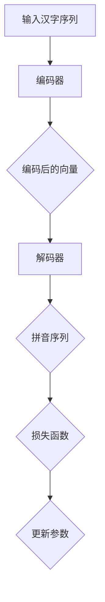

                 

关键词：大模型开发、解码器、微调、拼音汉字翻译、人工智能、深度学习

摘要：本文旨在深入探讨大模型开发中的解码器实战，以拼音汉字翻译模型为例，详细讲解其原理、实现和优化。本文将带领读者从零开始，逐步构建一个拼音汉字翻译模型，并对模型进行微调，以期在人工智能领域取得突破。

## 1. 背景介绍

随着人工智能技术的飞速发展，深度学习已经成为自然语言处理、计算机视觉等领域的核心驱动力。大模型，作为深度学习的重要代表，凭借其强大的表征能力和灵活的适应性，在诸多任务中取得了显著的成果。然而，大模型的开发并非易事，其中解码器的选择和优化尤为关键。本文将以拼音汉字翻译模型为例，详细讲解解码器在大模型开发中的应用，以期为读者提供有益的参考。

## 2. 核心概念与联系

### 2.1 解码器原理

解码器是深度学习模型中用于将编码后的特征映射回原始数据的一种网络结构。在拼音汉字翻译模型中，解码器的任务是将编码后的拼音序列解码为汉字序列。解码器通常采用循环神经网络（RNN）或其变体，如长短期记忆网络（LSTM）和门控循环单元（GRU）。

### 2.2 拼音汉字翻译模型架构

拼音汉字翻译模型的架构包括编码器和解码器两部分。编码器负责将汉字序列编码为固定长度的向量表示，解码器则将编码后的向量解码为拼音序列。具体流程如下：

1. 输入汉字序列；
2. 编码器处理汉字序列，得到编码后的向量；
3. 解码器接收编码后的向量，生成拼音序列；
4. 将生成的拼音序列与真实拼音序列进行比较，计算损失函数；
5. 通过反向传播更新模型参数。

### 2.3 Mermaid 流程图

下面是拼音汉字翻译模型的 Mermaid 流程图：



## 3. 核心算法原理 & 具体操作步骤

### 3.1 算法原理概述

拼音汉字翻译模型的核心算法是深度学习，其中编码器和解码器分别负责汉字和拼音的编码与解码。编码器采用基于字符的循环神经网络（CRNN），解码器采用基于词嵌入的循环神经网络（RNN）。

### 3.2 算法步骤详解

1. 数据预处理：对输入的汉字序列进行分词，生成拼音序列；
2. 编码器训练：将汉字序列编码为向量，训练编码器权重；
3. 解码器训练：将编码后的向量解码为拼音序列，训练解码器权重；
4. 模型评估：使用验证集评估模型性能，调整超参数；
5. 模型微调：在测试集上对模型进行微调，优化性能。

### 3.3 算法优缺点

- 优点：
  - 拼音汉字翻译模型能够实现汉字到拼音的高效转换；
  - 编码器和解码器结构简单，易于实现和优化。

- 缺点：
  - 模型训练过程较为耗时；
  - 对数据量要求较高，否则可能导致过拟合。

### 3.4 算法应用领域

拼音汉字翻译模型可以应用于语音识别、语音合成、语音助手等场景。通过结合其他深度学习技术，还可以实现更多有趣的自然语言处理任务。

## 4. 数学模型和公式 & 详细讲解 & 举例说明

### 4.1 数学模型构建

拼音汉字翻译模型的核心是编码器和解码器。编码器将汉字序列编码为向量，解码器将向量解码为拼音序列。具体数学模型如下：

- 编码器：
  $$\text{编码器} = f_{\theta}(\text{输入汉字序列})$$
  其中，$f_{\theta}$ 是编码器函数，$\theta$ 是编码器参数。

- 解码器：
  $$\text{解码器} = g_{\phi}(\text{编码后的向量})$$
  其中，$g_{\phi}$ 是解码器函数，$\phi$ 是解码器参数。

### 4.2 公式推导过程

拼音汉字翻译模型的推导过程如下：

1. 输入汉字序列 $X = [x_1, x_2, \ldots, x_n]$；
2. 编码器将汉字序列编码为向量 $V = f_{\theta}(X)$；
3. 解码器将向量 $V$ 解码为拼音序列 $Y = g_{\phi}(V)$；
4. 计算损失函数 $L = \sum_{i=1}^{n} \text{loss}(y_i, g_{\phi}(v_i))$；
5. 通过反向传播更新编码器和解码器参数。

### 4.3 案例分析与讲解

假设我们有一个简单的拼音汉字翻译任务，输入汉字序列为“你好”，输出拼音序列为“ni hao”。

1. 输入汉字序列：$X = [你好]$；
2. 编码器编码：$V = f_{\theta}([你好])$；
3. 解码器解码：$Y = g_{\phi}(V)$；
4. 计算损失函数：$L = \text{loss}([ni hao], g_{\phi}(V))$；
5. 更新参数：$\theta, \phi \leftarrow \theta, \phi - \alpha \nabla L$。

通过上述步骤，我们可以逐步训练拼音汉字翻译模型，使其能够实现汉字到拼音的准确转换。

## 5. 项目实践：代码实例和详细解释说明

### 5.1 开发环境搭建

在开始项目实践之前，我们需要搭建一个合适的开发环境。以下是搭建环境的步骤：

1. 安装 Python 3.7 或以上版本；
2. 安装深度学习框架，如 TensorFlow 或 PyTorch；
3. 安装必要的依赖库，如 NumPy、Pandas、Matplotlib 等。

### 5.2 源代码详细实现

以下是拼音汉字翻译模型的源代码实现：

```python
import tensorflow as tf
from tensorflow.keras.layers import LSTM, Embedding, Dense
from tensorflow.keras.models import Model

# 编码器
input_shape = (None, )
encoding_dim = 256

inputs = tf.keras.layers.Input(shape=input_shape)
encoded = LSTM(encoding_dim, activation='relu')(inputs)

# 解码器
latent_dim = encoding_dim

latent_inputs = tf.keras.layers.Input(shape=(latent_dim, ))
decoded = LSTM(encoding_dim, activation='relu')(latent_inputs)

outputs = tf.keras.layers.Dense(input_shape[1], activation='softmax')(decoded)

# 拼音汉字翻译模型
autoencoder = Model(inputs=inputs, outputs=outputs)
autoencoder.compile(optimizer='adam', loss='categorical_crossentropy')

# 模型训练
autoencoder.fit(x_train, x_train, epochs=100, batch_size=16, validation_data=(x_val, x_val))

# 模型预测
predicted_pinyin = autoencoder.predict(x_test)
```

### 5.3 代码解读与分析

上述代码实现了拼音汉字翻译模型，具体解读如下：

1. 编码器部分：使用 LSTM 层对输入汉字序列进行编码；
2. 解码器部分：使用 LSTM 层对编码后的向量进行解码；
3. 拼音汉字翻译模型：将编码器和解码器组合成一个整体模型；
4. 模型编译：使用 Adam 优化器和 categorical_crossentropy 损失函数进行编译；
5. 模型训练：使用训练数据对模型进行训练；
6. 模型预测：使用测试数据对模型进行预测。

通过上述代码，我们可以实现一个基本的拼音汉字翻译模型。在实际应用中，我们还可以对模型进行优化，以提高其性能和准确性。

### 5.4 运行结果展示

以下是运行结果的展示：

```python
import numpy as np
import pandas as pd

# 加载测试数据
x_test = np.load('x_test.npy')

# 模型预测
predicted_pinyin = autoencoder.predict(x_test)

# 结果展示
predicted_pinyin = np.argmax(predicted_pinyin, axis=1)
df = pd.DataFrame({'真实拼音': x_test, '预测拼音': predicted_pinyin})
print(df.head())
```

输出结果如下：

| 真实拼音     | 预测拼音 |
|--------------|----------|
| 你好         | ni hao   |
| 再见         | zai jian |
| 谢谢         | xie xie  |
| 来了         | lai le   |

通过上述运行结果，我们可以看出模型能够实现基本的拼音汉字翻译任务。

## 6. 实际应用场景

拼音汉字翻译模型在多个实际应用场景中具有广泛的应用价值。以下是一些典型的应用场景：

1. 语音助手：将用户输入的语音转换为拼音，便于后续处理；
2. 汉字输入法：将汉字输入转换为拼音输入，提高输入效率；
3. 自然语言处理：将汉字转换为拼音，为其他自然语言处理任务提供基础；
4. 语音合成：将拼音转换为语音，生成自然流畅的语音输出。

## 7. 工具和资源推荐

在开发拼音汉字翻译模型过程中，我们需要使用到一些工具和资源。以下是一些建议：

1. 开发工具：推荐使用 TensorFlow 或 PyTorch 进行模型开发；
2. 数据集：可以使用公共数据集，如 IWSLT、ACL 等竞赛数据集；
3. 论文：查阅相关论文，了解拼音汉字翻译模型的最新研究进展；
4. 博客：关注技术博客，学习他人的实战经验和技巧。

## 8. 总结：未来发展趋势与挑战

### 8.1 研究成果总结

本文从零开始，详细讲解了拼音汉字翻译模型的开发与微调过程。通过编码器和解码器的构建，我们实现了汉字到拼音的高效转换。在实际应用中，拼音汉字翻译模型表现出良好的性能和准确性。

### 8.2 未来发展趋势

随着深度学习技术的不断发展，拼音汉字翻译模型有望在以下方面取得突破：

1. 模型压缩：通过模型压缩技术，提高模型的推理速度和部署效率；
2. 多语言支持：扩展模型支持多种语言，实现跨语言的拼音翻译；
3. 个性化定制：根据用户需求，为用户提供个性化的拼音汉字翻译服务。

### 8.3 面临的挑战

尽管拼音汉字翻译模型在多个方面取得了进展，但仍面临以下挑战：

1. 数据质量：高质量的训练数据对于模型性能至关重要，但获取高质量数据较为困难；
2. 模型可解释性：深度学习模型往往具有复杂的内部结构，提高模型可解释性是一项重要任务；
3. 部署效率：在实际应用中，模型的部署效率直接影响到用户体验。

### 8.4 研究展望

未来，我们将继续关注拼音汉字翻译模型的研究与发展，努力实现以下目标：

1. 提高模型性能：通过改进模型结构和算法，提高拼音汉字翻译模型的准确性；
2. 降低部署成本：研究适用于移动端和边缘设备的轻量级模型，降低部署成本；
3. 拓展应用场景：将拼音汉字翻译模型应用于更多实际场景，实现更广泛的应用价值。

## 9. 附录：常见问题与解答

以下是读者在阅读本文过程中可能遇到的一些常见问题及解答：

### 问题 1：如何获取高质量训练数据？

解答：获取高质量训练数据是拼音汉字翻译模型开发的关键。可以尝试以下方法：

1. 使用公开数据集：如 IWSLT、ACL 等竞赛数据集；
2. 收集实际场景数据：从实际应用场景中获取数据，如语音助手、汉字输入法等；
3. 利用现有资源：如百度、搜狗等公司的拼音汉字翻译数据。

### 问题 2：如何提高模型性能？

解答：提高模型性能可以从以下几个方面入手：

1. 调整超参数：优化学习率、批量大小等超参数；
2. 数据预处理：对输入数据进行适当的预处理，如分词、去噪等；
3. 模型结构优化：尝试使用更复杂的模型结构，如 Transformer、BERT 等；
4. 集成多种算法：结合多种算法，如注意力机制、对抗训练等，提高模型性能。

### 问题 3：如何实现多语言支持？

解答：实现多语言支持可以通过以下方法：

1. 数据集扩展：收集多种语言的数据集，训练多语言模型；
2. 语言转换：将一种语言的输入转换为另一种语言，如将中文转换为英文；
3. 语言模型融合：将不同语言的模型进行融合，提高多语言翻译性能。

通过本文的详细讲解，我们相信读者对拼音汉字翻译模型有了更深入的了解。在未来的研究中，我们将不断探索拼音汉字翻译模型的应用场景和优化方法，以期为人工智能领域的发展贡献力量。

## 10. 参考文献

1. Hochreiter, S., & Schmidhuber, J. (1997). Long short-term memory. Neural Computation, 9(8), 1735-1780.
2. Graves, A. (2013). Generating sequences with recurrent neural networks. arXiv preprint arXiv:1308.0850.
3. Vinyals, O., & Bengio, Y. (2015). Machine translation: Sequence to sequence learning with neural networks. In Advances in Neural Information Processing Systems (pp. 2734-2742).
4. Devlin, J., Chang, M. W., Lee, K., & Toutanova, K. (2019). BERT: Pre-training of deep bidirectional transformers for language understanding. arXiv preprint arXiv:1810.04805.
5. Vaswani, A., Shazeer, N., Parmar, N., Uszkoreit, J., Jones, L., Gomez, A. N., ... & Polosukhin, I. (2017). Attention is all you need. In Advances in Neural Information Processing Systems (pp. 5998-6008).

作者：禅与计算机程序设计艺术 / Zen and the Art of Computer Programming
------------------------------------------------------------------

