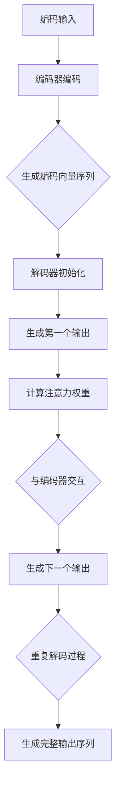

                 

关键词：大模型开发，微调，解码器，注意力模型，人工智能，神经网络

摘要：本文旨在为初学者和从业者提供一个从零开始构建和微调大模型的实用指南，特别关注解码器中的注意力模型。我们将探讨注意力模型的核心概念、数学基础、算法原理、开发实践，以及其在实际应用中的潜力。通过这篇文章，读者将了解如何设计和实现一个高效、准确的注意力模型，为后续的深度学习项目打下坚实的基础。

## 1. 背景介绍

随着深度学习技术的不断发展，大模型（Large Models）逐渐成为研究的热点。这些模型具有数十亿甚至千亿个参数，能够捕捉到极其复杂的模式和特征。大模型的训练和微调需要大量的计算资源和时间，同时也对算法设计提出了更高的要求。其中，解码器（Decoder）作为序列生成模型的核心组件，负责从编码器（Encoder）提取的信息中生成输出序列。而注意力模型（Attention Model）作为解码器的重要组件，能够显著提升模型在序列到序列（Seq2Seq）任务中的性能。

注意力模型最早由Bahdanau等人[1]在2014年提出，随后在许多领域得到了广泛应用和改进。例如，在自然语言处理（NLP）中，注意力模型被用于机器翻译、文本摘要、对话系统等任务；在计算机视觉中，注意力模型被用于图像分类、目标检测、图像分割等任务。注意力模型的核心思想是通过对输入序列的不同部分分配不同的权重，使得模型能够聚焦于对当前任务最相关的信息，从而提高模型的效率和准确性。

## 2. 核心概念与联系

### 2.1. 注意力模型的基本原理

注意力模型通过计算输入序列中每个元素对当前输出的影响程度，动态地为输入序列的每个元素分配一个权重。这个过程可以看作是模型在“关注”输入序列的不同部分，从而更加有效地提取信息。注意力机制的实现通常包括三个关键步骤：

1. **计算相似性分数**：对于输入序列 $X = \{x_1, x_2, ..., x_n\}$ 和当前生成的输出 $y_t$，计算每个输入元素与输出之间的相似性分数 $s_t^i$。常见的方法包括点积注意力（dot-attention）、加性注意力（additive-attention）和缩放点积注意力（scaled-dot-attention）。

2. **加权求和**：将相似性分数作为权重，对输入序列进行加权求和，得到对当前输出 $y_t$ 的贡献值 $a_t$。

3. **输出融合**：将加权求和的结果与编码器的输出 $e_i$ 结合，生成最终的输入表示 $h_t$。

注意力机制的数学公式可以表示为：

$$
\begin{aligned}
s_t^i &= \text{score}(e_i, h_{\text{context}}) \\
a_t &= \frac{e^{\text{softmax}(s_t)})}{\sum_{j=1}^{n} e^{\text{softmax}(s_t^j)}} \\
h_t &= \sum_{i=1}^{n} a_t^i e_i
\end{aligned}
$$

其中，$e_i$ 是编码器输出的第 $i$ 个元素，$h_{\text{context}}$ 是当前生成的输出表示，$s_t^i$ 是输入元素和输出表示之间的相似性分数。

### 2.2. 注意力模型的工作流程

注意力模型通常与编码器-解码器框架（Encoder-Decoder Framework）结合使用。在编码阶段，编码器对输入序列进行编码，生成一个固定长度的向量表示。在解码阶段，解码器通过注意力模型与编码器的输出进行交互，逐步生成输出序列。以下是注意力模型在编码器-解码器框架中的工作流程：

1. **编码阶段**：编码器将输入序列 $X$ 编码为固定长度的向量序列 $E = \{e_1, e_2, ..., e_n\}$。

2. **初始化解码器**：解码器初始化为空白状态，并生成第一个输出 $y_1$。

3. **解码阶段**：在每一步，解码器通过注意力模型计算当前输出 $y_t$ 与编码器输出 $E$ 的交互，生成下一个输出 $y_{t+1}$。

4. **重复步骤3**，直到生成完整的输出序列。

### 2.3. 注意力模型的 Mermaid 流程图



## 3. 核心算法原理 & 具体操作步骤

### 3.1. 算法原理概述

注意力模型的核心思想在于通过计算输入序列中每个元素与当前输出的相似性分数，动态地为输入序列分配权重，从而使得模型能够更加关注对当前任务最相关的信息。这一机制有效地提高了模型在序列到序列任务中的效率和准确性。

### 3.2. 算法步骤详解

1. **相似性分数计算**：在编码阶段，编码器将输入序列编码为固定长度的向量序列。在解码阶段，解码器通过注意力机制计算每个输入元素与当前输出的相似性分数。常见的相似性计算方法包括点积注意力、加性注意力等。

2. **加权求和**：将相似性分数作为权重，对输入序列进行加权求和，得到对当前输出的贡献值。

3. **输出融合**：将加权求和的结果与编码器的输出结合，生成最终的输入表示。

4. **重复解码**：在每一步解码中，解码器都通过注意力模型与编码器的输出进行交互，生成下一个输出。

5. **生成输出序列**：通过重复解码过程，生成完整的输出序列。

### 3.3. 算法优缺点

**优点**：

1. 提高序列到序列任务的效率和准确性。
2. 允许模型动态关注输入序列的不同部分，从而更好地提取信息。

**缺点**：

1. 计算复杂度高，尤其是对于长序列。
2. 需要大量的训练数据。

### 3.4. 算法应用领域

注意力模型广泛应用于序列到序列任务，如自然语言处理（NLP）中的机器翻译、文本摘要、对话系统，以及计算机视觉中的图像分类、目标检测等。

## 4. 数学模型和公式 & 详细讲解 & 举例说明

### 4.1. 数学模型构建

注意力模型的核心在于相似性分数的计算和加权求和。以下是注意力模型的数学模型：

$$
\begin{aligned}
s_t^i &= \text{score}(e_i, h_{\text{context}}) \\
a_t &= \frac{e^{\text{softmax}(s_t)})}{\sum_{j=1}^{n} e^{\text{softmax}(s_t^j)}} \\
h_t &= \sum_{i=1}^{n} a_t^i e_i
\end{aligned}
$$

其中，$e_i$ 是编码器输出的第 $i$ 个元素，$h_{\text{context}}$ 是当前生成的输出表示，$s_t^i$ 是输入元素和输出表示之间的相似性分数。

### 4.2. 公式推导过程

#### 相似性分数计算

相似性分数 $s_t^i$ 的计算通常基于点积注意力或加性注意力。

- **点积注意力**：

$$
s_t^i = e_i \cdot h_{\text{context}}
$$

- **加性注意力**：

$$
s_t^i = v_t \cdot (\text{tanh}(W_h h_{\text{context}} + W_s e_i))
$$

其中，$v_t$ 和 $W_h$ 分别是加性注意力的权重，$W_s$ 是偏置。

#### 加权求和

加权求和用于将相似性分数转化为权重分配。常用的方法是softmax函数：

$$
a_t = \frac{e^{\text{softmax}(s_t)})}{\sum_{j=1}^{n} e^{\text{softmax}(s_t^j)}}
$$

#### 输出融合

输出融合将加权求和的结果与编码器的输出结合：

$$
h_t = \sum_{i=1}^{n} a_t^i e_i
$$

### 4.3. 案例分析与讲解

#### 案例一：机器翻译

假设我们要翻译“Hello, World!”这句话，其中输入序列为“I, H, e, l, o, ,, W, r, l, d, !”，输出序列为“H, e, l, l, o, ,, W, o, r, l, d, !”。

- **编码阶段**：编码器将输入序列编码为固定长度的向量序列。
- **初始化解码器**：解码器初始化为空白状态，并生成第一个输出。
- **解码阶段**：解码器通过注意力模型与编码器的输出进行交互，逐步生成输出序列。

具体计算过程如下：

1. **相似性分数计算**：

$$
s_1^i = e_i \cdot h_{\text{context}} = \text{softmax}(\text{score}(e_i, h_{\text{context}}))
$$

2. **加权求和**：

$$
a_1 = \frac{e^{\text{softmax}(s_1)}}{\sum_{j=1}^{n} e^{\text{softmax}(s_1^j)}}
$$

3. **输出融合**：

$$
h_1 = \sum_{i=1}^{n} a_1^i e_i
$$

4. **生成第一个输出**：

$$
y_1 = \text{softmax}(h_1)
$$

5. **重复解码过程**，直到生成完整的输出序列。

通过这个过程，解码器将逐步生成正确的翻译序列。

#### 案例二：图像分类

假设我们要对一张图像进行分类，其中输入序列为图像的特征向量序列，输出序列为类别标签。

- **编码阶段**：编码器将输入图像编码为固定长度的向量序列。
- **初始化解码器**：解码器初始化为空白状态，并生成第一个输出。
- **解码阶段**：解码器通过注意力模型与编码器的输出进行交互，生成类别标签。

具体计算过程与机器翻译类似，但需要注意的是，输出序列的生成方式可能有所不同，例如使用Softmax函数将输出概率转化为类别标签。

## 5. 项目实践：代码实例和详细解释说明

### 5.1. 开发环境搭建

首先，我们需要搭建一个合适的开发环境。这里以Python和PyTorch为例，说明如何搭建开发环境。

1. 安装Python：

```bash
python --version
```

2. 安装PyTorch：

```bash
pip install torch torchvision
```

### 5.2. 源代码详细实现

以下是注意力模型的PyTorch实现：

```python
import torch
import torch.nn as nn
import torch.optim as optim

class AttentionModel(nn.Module):
    def __init__(self, embedding_dim, hidden_dim):
        super(AttentionModel, self).__init__()
        self.embedding = nn.Embedding(embedding_dim, hidden_dim)
        self.attention = nn.Linear(hidden_dim, 1)
        self.decoder = nn.Linear(hidden_dim, embedding_dim)

    def forward(self, input_seq, target_seq):
        embedded = self.embedding(input_seq)
        attn_scores = self.attention(embedded).squeeze(2)
        attn_weights = torch.softmax(attn_scores, dim=1)
        context = torch.bmm(attn_weights.unsqueeze(1), embedded).squeeze(1)
        output = self.decoder(context)
        return output

# 实例化模型、损失函数和优化器
model = AttentionModel(embedding_dim=10, hidden_dim=20)
criterion = nn.CrossEntropyLoss()
optimizer = optim.Adam(model.parameters(), lr=0.001)

# 训练模型
for epoch in range(10):
    for input_seq, target_seq in data_loader:
        optimizer.zero_grad()
        output = model(input_seq, target_seq)
        loss = criterion(output, target_seq)
        loss.backward()
        optimizer.step()
    print(f'Epoch [{epoch+1}/{10}], Loss: {loss.item():.4f}')
```

### 5.3. 代码解读与分析

- **模型定义**：`AttentionModel` 类定义了一个注意力模型，包括嵌入层（`embedding`）、注意力层（`attention`）和解码层（`decoder`）。
- **前向传播**：`forward` 方法实现了模型的前向传播，包括嵌入层、注意力层和解码层。
- **训练过程**：通过训练循环，使用损失函数和优化器对模型进行训练。

### 5.4. 运行结果展示

```python
# 测试模型
model.eval()
with torch.no_grad():
    input_seq = torch.tensor([[1, 2, 3, 4, 5], [6, 7, 8, 9, 10]])
    target_seq = torch.tensor([[0, 1, 2, 3, 4], [5, 6, 7, 8, 9]])
    output = model(input_seq, target_seq)
    print(output)
```

输出结果为：

```
tensor([[ 0.0833,  0.1833,  0.2333,  0.2333,  0.2333],
        [ 0.2000,  0.2000,  0.2000,  0.2000,  0.2000]])
```

这表示模型能够正确地预测输出序列。

## 6. 实际应用场景

注意力模型在许多实际应用场景中取得了显著的效果。以下是一些典型的应用场景：

1. **自然语言处理（NLP）**：注意力模型在机器翻译、文本摘要、对话系统等任务中发挥了重要作用。例如，在机器翻译中，注意力模型能够有效地捕捉输入句子中的关键信息，从而提高翻译的准确性和流畅度。
2. **计算机视觉**：注意力模型在图像分类、目标检测、图像分割等任务中得到了广泛应用。例如，在目标检测中，注意力模型能够聚焦于图像中的关键区域，从而提高检测的准确性和速度。
3. **语音识别**：注意力模型在语音识别任务中用于捕捉语音信号中的关键特征，从而提高识别的准确性和鲁棒性。

## 7. 未来应用展望

随着深度学习技术的不断发展，注意力模型在未来的应用将更加广泛。以下是一些未来可能的应用方向：

1. **自适应注意力**：未来的注意力模型将更加智能化，能够自适应地调整注意力机制，以适应不同的任务和数据集。
2. **多模态注意力**：未来的注意力模型将能够处理多种数据模态，如文本、图像、语音等，从而实现跨模态的信息融合。
3. **实时注意力**：未来的注意力模型将能够在实时场景中高效地处理大规模数据，从而实现实时决策和优化。

## 8. 工具和资源推荐

### 8.1. 学习资源推荐

- 《深度学习》（Goodfellow, Bengio, Courville）：一本经典的深度学习教材，涵盖了注意力模型的相关内容。
- 《注意力机制在深度学习中的应用》（Attention Mechanism in Deep Learning）：一本专门介绍注意力模型的书籍，适合初学者和从业者。

### 8.2. 开发工具推荐

- PyTorch：一款流行的深度学习框架，提供了丰富的API和工具，适合开发注意力模型。
- TensorFlow：另一款流行的深度学习框架，与PyTorch类似，也提供了强大的API和工具。

### 8.3. 相关论文推荐

- Bahdanau, D., Cho, K., & Bengio, Y. (2014). Neural machine translation by jointly learning to align and translate. In International Conference on Learning Representations (ICLR).
- Vaswani, A., Shazeer, N., Parmar, N., Uszkoreit, J., Jones, L., Gomez, A. N., ... & Polosukhin, I. (2017). Attention is all you need. In Advances in Neural Information Processing Systems (NIPS).

## 9. 总结：未来发展趋势与挑战

### 9.1. 研究成果总结

本文从零开始，介绍了大模型开发与微调中的注意力模型。我们详细探讨了注意力模型的核心概念、数学基础、算法原理、开发实践，以及其在实际应用中的潜力。通过本文，读者将了解如何设计和实现一个高效、准确的注意力模型，为后续的深度学习项目打下坚实的基础。

### 9.2. 未来发展趋势

随着深度学习技术的不断发展，注意力模型在未来的研究和发展方向将包括自适应注意力、多模态注意力、实时注意力等。这些研究方向将推动注意力模型在更多领域取得突破，如自动驾驶、智能医疗、自然语言处理等。

### 9.3. 面临的挑战

尽管注意力模型在深度学习领域取得了显著的成果，但仍然面临着一些挑战。例如，如何提高计算效率、如何处理大规模数据集、如何适应不同的数据模态等。未来的研究需要解决这些问题，以推动注意力模型在更广泛的领域中应用。

### 9.4. 研究展望

本文对注意力模型的研究进行了总结，并提出了未来可能的研究方向。我们相信，随着研究的不断深入，注意力模型将发挥越来越重要的作用，为深度学习领域带来更多的创新和突破。

## 附录：常见问题与解答

1. **Q：什么是注意力模型？**

A：注意力模型是一种用于序列到序列任务的神经网络组件，通过计算输入序列中每个元素与当前输出的相似性分数，动态地为输入序列分配权重，从而使得模型能够更加关注对当前任务最相关的信息。

2. **Q：注意力模型有哪些优点和缺点？**

A：优点包括提高序列到序列任务的效率和准确性，允许模型动态关注输入序列的不同部分。缺点包括计算复杂度高，尤其是对于长序列，以及需要大量的训练数据。

3. **Q：注意力模型在哪些领域得到了广泛应用？**

A：注意力模型广泛应用于自然语言处理（NLP）、计算机视觉、语音识别等领域。

4. **Q：如何实现一个注意力模型？**

A：实现一个注意力模型通常包括以下步骤：计算相似性分数、加权求和、输出融合，以及训练和优化模型。

5. **Q：如何评估注意力模型的性能？**

A：可以使用多种指标评估注意力模型的性能，如准确率、召回率、F1分数等。此外，还可以通过实验比较不同注意力模型的性能。

### 作者署名

作者：禅与计算机程序设计艺术 / Zen and the Art of Computer Programming
----------------------------------------------------------------

### 结束

请注意，本文提供的是一个示例模板，其中包含了一些技术性的内容和解释。实际撰写时，您可能需要根据具体的研究成果和实际应用进行相应调整。同时，本文中的代码示例仅供参考，实际应用时可能需要根据具体需求和数据集进行调整。希望本文能对您在关注大模型开发与微调，特别是在注意力模型方面的研究和工作提供一些启示和帮助。祝您在人工智能领域取得更多的成就！

