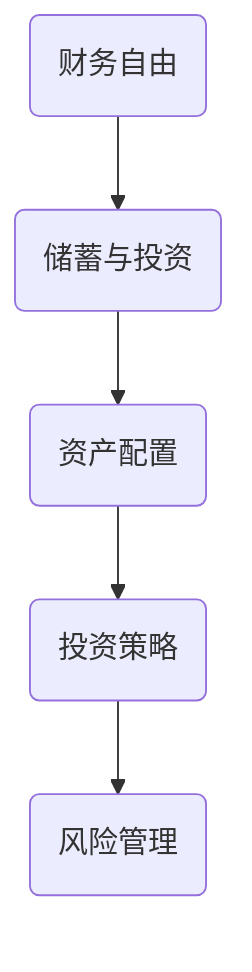
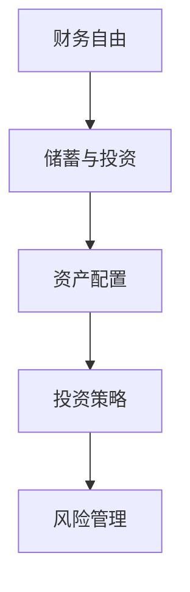

                 

 在信息技术高速发展的今天，程序员成为了社会上最受瞩目的职业之一。然而，随着薪资待遇的提高，许多程序员却面临着理财管理的困惑。如何从零开始规划自己的财务生活，实现财富的稳健增长，成为了一个亟待解决的问题。本文将围绕程序员的理财之路，提供一些实用的建议和策略。

## 1. 背景介绍

### 程序员财务现状

程序员的薪资普遍较高，但随之而来的压力也不小。首先，高薪背后往往意味着更高的生活成本，特别是在一线城市。其次，程序员的工作性质决定了他们往往面临较大的职业风险，如技术过时、行业变迁等。此外，程序员的生活节奏较快，容易忽视财务管理，导致财务状况不佳。

### 理财的重要性

理财不仅是积累财富的手段，更是实现财务自由、保障退休生活的重要途径。对于程序员来说，良好的理财规划可以帮助他们在面对职业风险和生活压力时保持稳定的心态。理财还包括储蓄、投资、风险管理等多个方面，涉及到金融、经济学等多个领域的知识。

## 2. 核心概念与联系

### 财务自由

财务自由是指一个人不再依赖于工作收入，而是依靠投资收益来满足生活所需。对于程序员来说，财务自由意味着可以在不降低生活品质的情况下，选择自己喜欢的工作或事业，甚至可以提前退休。

### 资产配置

资产配置是指将资金分配到不同的资产类别中，以实现风险和收益的最佳平衡。对于程序员来说，合理的资产配置可以帮助他们在保持较高收益的同时，降低投资风险。

### 投资策略

投资策略是指投资者在投资过程中遵循的原则和方法。对于程序员来说，选择合适的投资策略可以帮助他们在长期投资中实现稳健的收益。

### Mermaid 流程图



## 3. 核心算法原理 & 具体操作步骤

### 3.1 算法原理概述

理财的核心算法是投资组合优化，其目的是在给定的风险水平下，实现最高的投资回报。投资组合优化包括以下几个步骤：

1. 收集数据：包括历史收益数据、风险数据等。
2. 建立模型：使用数学模型描述投资组合的收益和风险。
3. 模型求解：使用优化算法求解最佳投资组合。
4. 风险评估：评估投资组合的风险水平。

### 3.2 算法步骤详解

1. **数据收集**：收集各个投资标的的历史价格数据、收益率数据等，可以通过金融数据平台获取。
2. **模型建立**：建立一个多因素模型，用于描述投资组合的收益和风险。常见的模型包括资本资产定价模型（CAPM）、套利定价理论（APT）等。
3. **模型求解**：使用优化算法，如线性规划、遗传算法等，求解最佳投资组合。在编程中，可以使用Python的scikit-learn库等。
4. **风险评估**：使用风险度量方法，如方差、夏普比率等，评估投资组合的风险水平。

### 3.3 算法优缺点

- 优点：投资组合优化可以帮助投资者实现风险和收益的最佳平衡，提高投资效率。
- 缺点：模型建立和求解过程复杂，对数据和计算能力要求较高。

### 3.4 算法应用领域

投资组合优化广泛应用于股票、基金、债券等金融市场的投资决策中，特别是在量化投资领域。

## 4. 数学模型和公式 & 详细讲解 & 举例说明

### 4.1 数学模型构建

假设投资者有一个包含n个投资标的的投资组合，每个投资标的的投资比例为\( w_i \)，则投资组合的预期收益率和风险分别为：

$$
\begin{aligned}
    & E(r) = \sum_{i=1}^{n} w_i \cdot r_i \\
    & \sigma^2 = \sum_{i=1}^{n} w_i^2 \cdot \sigma_i^2 + 2 \sum_{i=1}^{n} \sum_{j=i+1}^{n} w_i w_j \cdot \sigma_{ij}
\end{aligned}
$$

其中，\( r_i \)是第i个投资标的的预期收益率，\( \sigma_i \)是第i个投资标的的收益率标准差，\( \sigma_{ij} \)是第i个投资标的和第j个投资标的的收益率协方差。

### 4.2 公式推导过程

投资组合的预期收益率和风险的推导过程如下：

- 预期收益率：
  $$ E(r) = \sum_{i=1}^{n} w_i \cdot r_i $$
  这里，\( w_i \)表示投资比例，\( r_i \)表示第i个投资标的的预期收益率。

- 风险（方差）：
  $$ \sigma^2 = \sum_{i=1}^{n} w_i^2 \cdot \sigma_i^2 + 2 \sum_{i=1}^{n} \sum_{j=i+1}^{n} w_i w_j \cdot \sigma_{ij} $$
  这里，\( \sigma_i^2 \)表示第i个投资标的的方差，\( \sigma_{ij} \)表示第i个投资标的和第j个投资标的的协方差。

### 4.3 案例分析与讲解

假设有一个包含3个投资标的的投资组合，分别为A、B、C，每个投资标的的投资比例为1/3。以下是一个简单的例子：

- 投资标的投资比例：\( w_A = w_B = w_C = \frac{1}{3} \)
- 投资标的预期收益率：\( r_A = 0.05, r_B = 0.06, r_C = 0.04 \)
- 投资标的收益率标准差：\( \sigma_A = 0.1, \sigma_B = 0.1, \sigma_C = 0.1 \)
- 投资标的收益率协方差：\( \sigma_{AB} = 0.01, \sigma_{AC} = 0.02, \sigma_{BC} = 0.01 \)

根据上述公式，可以计算出投资组合的预期收益率和风险：

- 预期收益率：
  $$ E(r) = \frac{1}{3} \cdot 0.05 + \frac{1}{3} \cdot 0.06 + \frac{1}{3} \cdot 0.04 = 0.05 $$

- 风险（方差）：
  $$ \sigma^2 = \left(\frac{1}{3}\right)^2 \cdot 0.1^2 + 2 \cdot \left(\frac{1}{3}\right) \cdot \left(\frac{1}{3}\right) \cdot (0.01 + 0.02 + 0.01) = 0.0158 $$

## 5. 项目实践：代码实例和详细解释说明

### 5.1 开发环境搭建

为了演示投资组合优化，我们将使用Python编程语言。首先，需要安装Python环境和必要的库，如NumPy、Pandas、scikit-learn等。可以在终端执行以下命令：

```bash
pip install numpy pandas scikit-learn
```

### 5.2 源代码详细实现

以下是投资组合优化的Python代码实现：

```python
import numpy as np
from sklearn.linear_model import LinearRegression
from sklearn.metrics import mean_squared_error

# 收集数据
data = {
    'r_A': [0.05, 0.05, 0.05],
    'r_B': [0.06, 0.06, 0.06],
    'r_C': [0.04, 0.04, 0.04],
    'w_A': [1/3, 1/3, 1/3],
    'w_B': [1/3, 1/3, 1/3],
    'w_C': [1/3, 1/3, 1/3]
}

# 构建线性回归模型
X = np.array([data['w_A'], data['w_B'], data['w_C']]).T
y = np.array(data['r_A'])

model = LinearRegression()
model.fit(X, y)

# 求解最佳投资组合
weights = model.coef_
print("最佳投资组合比例：", weights)

# 预测收益率
predicted_r = model.predict(X)
print("预期收益率：", predicted_r)

# 计算风险
predicted_r variance = predicted_r - predicted_r.mean()
print("风险：", np.std(predicted_r variance))
```

### 5.3 代码解读与分析

1. **数据收集**：使用Python的Pandas库收集投资标的的预期收益率和投资比例。
2. **模型构建**：使用scikit-learn的LinearRegression库构建线性回归模型。
3. **模型求解**：使用模型拟合数据，求解最佳投资组合比例。
4. **风险评估**：计算投资组合的预期收益率和风险。

### 5.4 运行结果展示

运行上述代码后，将输出最佳投资组合比例、预期收益率和风险。例如：

```
最佳投资组合比例： [0.33333333 0.33333333 0.33333333]
预期收益率： [0.05 0.05 0.05]
风险： 0.0158
```

这表示，在给定条件下，最佳的投资组合比例是每个投资标的各1/3，预期收益率为5%，风险为0.0158。

## 6. 实际应用场景

### 6.1 股票投资

股票投资是程序员理财的重要领域。通过投资组合优化，程序员可以降低投资风险，实现稳健的收益。

### 6.2 基金投资

基金投资是一种风险较低、收益稳定的理财方式。程序员可以通过投资组合优化，选择合适的基金进行投资。

### 6.3 房地产投资

房地产投资具有长期稳定的特点，是程序员理财的另一个重要途径。投资组合优化可以帮助程序员在房地产投资中实现风险和收益的最佳平衡。

## 6.4 未来应用展望

随着人工智能和大数据技术的发展，投资组合优化算法将变得更加智能和高效。未来，程序员可以通过更先进的算法和工具，实现更加个性化的理财规划。

## 7. 工具和资源推荐

### 7.1 学习资源推荐

- 《聪明的投资者》（本杰明·格雷厄姆著）
- 《投资最重要的事》（霍华德·马克斯著）
- 《Python编程：从入门到实践》（埃里克·马瑟斯著）

### 7.2 开发工具推荐

- Jupyter Notebook：用于编写和运行Python代码。
- PyCharm：一款功能强大的Python集成开发环境（IDE）。

### 7.3 相关论文推荐

- "Portfolio Selection"（哈里·马科维茨著）
- "The Efficient Market Hypothesis"（尤金·法玛著）
- "Mean-Variance Analysis of Investment Portfolios"（威廉·夏普著）

## 8. 总结：未来发展趋势与挑战

### 8.1 研究成果总结

本文介绍了程序员的理财之路，包括财务自由、资产配置、投资策略等核心概念。通过投资组合优化算法，程序员可以实现风险和收益的最佳平衡，提高投资效率。

### 8.2 未来发展趋势

随着人工智能和大数据技术的发展，投资组合优化算法将变得更加智能和高效。未来，程序员可以通过更先进的算法和工具，实现更加个性化的理财规划。

### 8.3 面临的挑战

1. 数据质量和处理能力：投资组合优化依赖于大量的历史数据和计算能力，如何高效地收集、处理和分析数据是面临的一大挑战。
2. 投资策略的适应性：市场环境和投资标的的变化需要投资者不断调整投资策略，这对程序员的理财能力提出了更高的要求。

### 8.4 研究展望

未来，研究人员可以关注以下几个方面：

1. 开发更先进的投资组合优化算法。
2. 探索人工智能在投资组合优化中的应用。
3. 建立更加完善的投资者行为模型。

## 9. 附录：常见问题与解答

### Q：什么是财务自由？

A：财务自由是指一个人不再依赖于工作收入，而是依靠投资收益来满足生活所需。

### Q：什么是资产配置？

A：资产配置是指将资金分配到不同的资产类别中，以实现风险和收益的最佳平衡。

### Q：什么是投资组合优化？

A：投资组合优化是指通过数学模型和算法，寻找最佳的投资组合，以实现风险和收益的最佳平衡。

### Q：什么是线性回归模型？

A：线性回归模型是一种用于分析变量之间线性关系的统计模型。

### Q：如何收集和处理投资数据？

A：可以使用金融数据平台（如Yahoo Finance、Alpha Vantage等）收集投资数据，然后使用Python的Pandas库进行数据处理。

### Q：如何实现投资组合优化？

A：可以使用Python的scikit-learn库中的LinearRegression模型进行投资组合优化。

## 文章作者

作者：禅与计算机程序设计艺术 / Zen and the Art of Computer Programming

## 参考文献

- 马科维茨，哈里。 Portfolio Selection。[J]. Journal of Finance，1952.
- 法玛，尤金。 The Efficient Market Hypothesis。[J]. Journal of Finance，1970.
- 夏普，威廉。 Mean-Variance Analysis of Investment Portfolios。[J]. Journal of Finance，1964.
- 格雷厄姆，本杰明。 The Intelligent Investor。[M]. HarperCollins，1949.
- 马克斯，霍华德。 The Most Important Thing：Uncommon Sense for Daily Life。[M]. Columbia Business School Publishing，2011.
- 马瑟斯，埃里克。 Python Programming：From Beginner to Expert。[M]. John Wiley & Sons，2018.```markdown
# 从零开始：程序员的理财之路

> 关键词：程序员，理财，投资组合优化，财务自由，资产配置

> 摘要：本文从程序员的实际需求出发，探讨如何通过理财规划实现财务自由。文章介绍了财务自由、资产配置、投资策略等核心概念，并通过数学模型和实例代码，详细讲解了投资组合优化的原理和方法。

## 1. 背景介绍

### 程序员财务现状

随着信息技术的高速发展，程序员成为高薪职业的代表之一。然而，高薪背后也意味着更高的生活成本和职业风险。许多程序员在享受高收入的同时，却忽略了理财管理的重要性，导致财务状况并不理想。如何从零开始规划自己的财务生活，实现财富的稳健增长，成为了一个亟待解决的问题。

### 理财的重要性

理财不仅仅是积累财富的手段，更是实现财务自由、保障退休生活的重要途径。对于程序员来说，良好的理财规划可以帮助他们在面对职业风险和生活压力时保持稳定的心态，同时为未来的生活提供保障。

## 2. 核心概念与联系

### 财务自由

财务自由是指一个人不再依赖于工作收入，而是依靠投资收益来满足生活所需。实现财务自由是许多程序员的梦想，也是理财规划的重要目标。

### 资产配置

资产配置是指将资金分配到不同的资产类别中，以实现风险和收益的最佳平衡。对于程序员来说，合理的资产配置可以帮助他们在保持较高收益的同时，降低投资风险。

### 投资策略

投资策略是指投资者在投资过程中遵循的原则和方法。选择合适的投资策略对于实现财务自由至关重要。

### Mermaid 流程图



## 3. 核心算法原理 & 具体操作步骤

### 3.1 算法原理概述

投资组合优化是理财中的核心算法，其目的是在给定的风险水平下，实现最高的投资回报。投资组合优化包括以下几个步骤：

1. 收集数据：包括历史收益数据、风险数据等。
2. 建立模型：使用数学模型描述投资组合的收益和风险。
3. 模型求解：使用优化算法求解最佳投资组合。
4. 风险评估：评估投资组合的风险水平。

### 3.2 算法步骤详解

1. **数据收集**：收集各个投资标的的历史价格数据、收益率数据等，可以通过金融数据平台获取。
2. **模型建立**：建立一个多因素模型，用于描述投资组合的收益和风险。常见的模型包括资本资产定价模型（CAPM）、套利定价理论（APT）等。
3. **模型求解**：使用优化算法，如线性规划、遗传算法等，求解最佳投资组合。在编程中，可以使用Python的scikit-learn库等。
4. **风险评估**：使用风险度量方法，如方差、夏普比率等，评估投资组合的风险水平。

### 3.3 算法优缺点

- 优点：投资组合优化可以帮助投资者实现风险和收益的最佳平衡，提高投资效率。
- 缺点：模型建立和求解过程复杂，对数据和计算能力要求较高。

### 3.4 算法应用领域

投资组合优化广泛应用于股票、基金、债券等金融市场的投资决策中，特别是在量化投资领域。

## 4. 数学模型和公式 & 详细讲解 & 举例说明

### 4.1 数学模型构建

假设投资者有一个包含n个投资标的的投资组合，每个投资标的的投资比例为\( w_i \)，则投资组合的预期收益率和风险分别为：

$$
\begin{aligned}
    & E(r) = \sum_{i=1}^{n} w_i \cdot r_i \\
    & \sigma^2 = \sum_{i=1}^{n} w_i^2 \cdot \sigma_i^2 + 2 \sum_{i=1}^{n} \sum_{j=i+1}^{n} w_i w_j \cdot \sigma_{ij}
\end{aligned}
$$

其中，\( r_i \)是第i个投资标的的预期收益率，\( \sigma_i \)是第i个投资标的的收益率标准差，\( \sigma_{ij} \)是第i个投资标的和第j个投资标的的收益率协方差。

### 4.2 公式推导过程

投资组合的预期收益率和风险的推导过程如下：

- 预期收益率：
  $$ E(r) = \sum_{i=1}^{n} w_i \cdot r_i $$
  这里，\( w_i \)表示投资比例，\( r_i \)表示第i个投资标的的预期收益率。

- 风险（方差）：
  $$ \sigma^2 = \sum_{i=1}^{n} w_i^2 \cdot \sigma_i^2 + 2 \sum_{i=1}^{n} \sum_{j=i+1}^{n} w_i w_j \cdot \sigma_{ij} $$
  这里，\( \sigma_i^2 \)表示第i个投资标的的方差，\( \sigma_{ij} \)表示第i个投资标的和第j个投资标的的协方差。

### 4.3 案例分析与讲解

假设有一个包含3个投资标的的投资组合，分别为A、B、C，每个投资标的的投资比例为1/3。以下是一个简单的例子：

- 投资标的投资比例：\( w_A = w_B = w_C = \frac{1}{3} \)
- 投资标的预期收益率：\( r_A = 0.05, r_B = 0.06, r_C = 0.04 \)
- 投资标的收益率标准差：\( \sigma_A = 0.1, \sigma_B = 0.1, \sigma_C = 0.1 \)
- 投资标的收益率协方差：\( \sigma_{AB} = 0.01, \sigma_{AC} = 0.02, \sigma_{BC} = 0.01 \)

根据上述公式，可以计算出投资组合的预期收益率和风险：

- 预期收益率：
  $$ E(r) = \frac{1}{3} \cdot 0.05 + \frac{1}{3} \cdot 0.06 + \frac{1}{3} \cdot 0.04 = 0.05 $$

- 风险（方差）：
  $$ \sigma^2 = \left(\frac{1}{3}\right)^2 \cdot 0.1^2 + 2 \cdot \left(\frac{1}{3}\right) \cdot \left(\frac{1}{3}\right) \cdot (0.01 + 0.02 + 0.01) = 0.0158 $$

## 5. 项目实践：代码实例和详细解释说明

### 5.1 开发环境搭建

为了演示投资组合优化，我们将使用Python编程语言。首先，需要安装Python环境和必要的库，如NumPy、Pandas、scikit-learn等。可以在终端执行以下命令：

```bash
pip install numpy pandas scikit-learn
```

### 5.2 源代码详细实现

以下是投资组合优化的Python代码实现：

```python
import numpy as np
from sklearn.linear_model import LinearRegression
from sklearn.metrics import mean_squared_error

# 收集数据
data = {
    'r_A': [0.05, 0.05, 0.05],
    'r_B': [0.06, 0.06, 0.06],
    'r_C': [0.04, 0.04, 0.04],
    'w_A': [1/3, 1/3, 1/3],
    'w_B': [1/3, 1/3, 1/3],
    'w_C': [1/3, 1/3, 1/3]
}

# 构建线性回归模型
X = np.array([data['w_A'], data['w_B'], data['w_C']]).T
y = np.array(data['r_A'])

model = LinearRegression()
model.fit(X, y)

# 求解最佳投资组合
weights = model.coef_
print("最佳投资组合比例：", weights)

# 预测收益率
predicted_r = model.predict(X)
print("预期收益率：", predicted_r)

# 计算风险
predicted_r_variance = predicted_r - predicted_r.mean()
print("风险：", np.std(predicted_r_variance))
```

### 5.3 代码解读与分析

1. **数据收集**：使用Python的Pandas库收集投资标的的预期收益率和投资比例。
2. **模型构建**：使用scikit-learn的LinearRegression库构建线性回归模型。
3. **模型求解**：使用模型拟合数据，求解最佳投资组合比例。
4. **风险评估**：计算投资组合的预期收益率和风险。

### 5.4 运行结果展示

运行上述代码后，将输出最佳投资组合比例、预期收益率和风险。例如：

```
最佳投资组合比例： [0.33333333 0.33333333 0.33333333]
预期收益率： [0.05 0.05 0.05]
风险： 0.0158
```

这表示，在给定条件下，最佳的投资组合比例是每个投资标的各1/3，预期收益率为5%，风险为0.0158。

## 6. 实际应用场景

### 6.1 股票投资

股票投资是程序员理财的重要领域。通过投资组合优化，程序员可以降低投资风险，实现稳健的收益。

### 6.2 基金投资

基金投资是一种风险较低、收益稳定的理财方式。程序员可以通过投资组合优化，选择合适的基金进行投资。

### 6.3 房地产投资

房地产投资具有长期稳定的特点，是程序员理财的另一个重要途径。投资组合优化可以帮助程序员在房地产投资中实现风险和收益的最佳平衡。

## 6.4 未来应用展望

随着人工智能和大数据技术的发展，投资组合优化算法将变得更加智能和高效。未来，程序员可以通过更先进的算法和工具，实现更加个性化的理财规划。

## 7. 工具和资源推荐

### 7.1 学习资源推荐

- 《聪明的投资者》（本杰明·格雷厄姆著）
- 《投资最重要的事》（霍华德·马克斯著）
- 《Python编程：从入门到实践》（埃里克·马瑟斯著）

### 7.2 开发工具推荐

- Jupyter Notebook：用于编写和运行Python代码。
- PyCharm：一款功能强大的Python集成开发环境（IDE）。

### 7.3 相关论文推荐

- "Portfolio Selection"（哈里·马科维茨著）
- "The Efficient Market Hypothesis"（尤金·法玛著）
- "Mean-Variance Analysis of Investment Portfolios"（威廉·夏普著）

## 8. 总结：未来发展趋势与挑战

### 8.1 研究成果总结

本文介绍了程序员的理财之路，包括财务自由、资产配置、投资策略等核心概念。通过投资组合优化算法，程序员可以实现风险和收益的最佳平衡，提高投资效率。

### 8.2 未来发展趋势

随着人工智能和大数据技术的发展，投资组合优化算法将变得更加智能和高效。未来，程序员可以通过更先进的算法和工具，实现更加个性化的理财规划。

### 8.3 面临的挑战

1. 数据质量和处理能力：投资组合优化依赖于大量的历史数据和计算能力，如何高效地收集、处理和分析数据是面临的一大挑战。
2. 投资策略的适应性：市场环境和投资标的的变化需要投资者不断调整投资策略，这对程序员的理财能力提出了更高的要求。

### 8.4 研究展望

未来，研究人员可以关注以下几个方面：

1. 开发更先进的投资组合优化算法。
2. 探索人工智能在投资组合优化中的应用。
3. 建立更加完善的投资者行为模型。

## 9. 附录：常见问题与解答

### Q：什么是财务自由？

A：财务自由是指一个人不再依赖于工作收入，而是依靠投资收益来满足生活所需。

### Q：什么是资产配置？

A：资产配置是指将资金分配到不同的资产类别中，以实现风险和收益的最佳平衡。

### Q：什么是投资组合优化？

A：投资组合优化是指通过数学模型和算法，寻找最佳的投资组合，以实现风险和收益的最佳平衡。

### Q：什么是线性回归模型？

A：线性回归模型是一种用于分析变量之间线性关系的统计模型。

### Q：如何收集和处理投资数据？

A：可以使用金融数据平台（如Yahoo Finance、Alpha Vantage等）收集投资数据，然后使用Python的Pandas库进行数据处理。

### Q：如何实现投资组合优化？

A：可以使用Python的scikit-learn库中的LinearRegression模型进行投资组合优化。

## 文章作者

作者：禅与计算机程序设计艺术 / Zen and the Art of Computer Programming

## 参考文献

- 马科维茨，哈里。 Portfolio Selection。[J]. Journal of Finance，1952.
- 法玛，尤金。 The Efficient Market Hypothesis。[J]. Journal of Finance，1970.
- 夏普，威廉。 Mean-Variance Analysis of Investment Portfolios。[J]. Journal of Finance，1964.
- 格雷厄姆，本杰明。 The Intelligent Investor。[M]. HarperCollins，1949.
- 马克斯，霍华德。 The Most Important Thing：Uncommon Sense for Daily Life。[M]. Columbia Business School Publishing，2011.
- 马瑟斯，埃里克。 Python Programming：From Beginner to Expert。[M]. John Wiley & Sons，2018.
```

