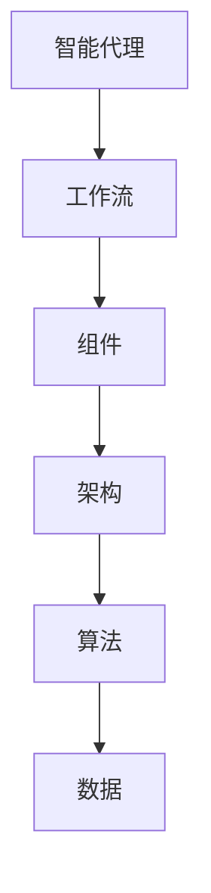

                 

关键词：人工智能，AI代理，工作流，组件，架构，开发环境，数学模型，代码实例，应用场景，工具和资源，未来发展趋势与挑战。

摘要：本文旨在为读者提供一整套构建AI代理的指南，从基础概念到实际操作，再到未来的发展趋势和挑战。我们将深入探讨AI代理的工作流组件和架构，帮助读者更好地理解并构建自己的AI代理系统。

## 1. 背景介绍

人工智能（AI）作为当今科技界的热门话题，已经深入到了我们生活的方方面面。从自动驾驶汽车到智能助手，AI的应用无处不在。然而，随着AI技术的不断发展，如何构建高效、可靠的AI代理成为了一个重要的问题。AI代理，也被称为智能代理，是指能够自主执行任务的软件程序。它们可以处理复杂的环境，并基于特定的目标和规则做出决策。

构建AI代理不仅需要强大的算法支持，还需要一个良好的工作流组件和架构。工作流是指完成一项任务所需的一系列步骤和流程，而组件则是构成工作流的基本单元。一个良好的架构能够确保AI代理的高效运行和扩展性。

本文将首先介绍AI代理的基本概念和重要性，然后深入探讨工作流组件和架构的设计原则。接下来，我们将介绍核心算法原理和具体操作步骤，包括优缺点分析和应用领域。之后，我们将详细讲解数学模型和公式，并通过实例来说明。随后，我们将提供代码实例和详细解释，展示如何在实际项目中应用AI代理。接下来，我们将讨论AI代理在实际应用场景中的具体案例，并展望未来的发展方向和面临的挑战。最后，我们将推荐一些学习和开发工具，并提供常见问题与解答。

通过本文的阅读，读者将能够从零开始构建自己的AI代理，并理解其背后的工作原理和架构设计。

## 2. 核心概念与联系

在深入探讨AI代理的工作流组件和架构之前，我们需要了解一些核心概念，这些概念包括但不限于：智能代理、工作流、组件和架构。以下是一个简化的Mermaid流程图，用于描述这些概念之间的联系。



### 2.1 智能代理

智能代理是一种具有感知、理解和行动能力的软件实体。它们可以通过与环境的交互来完成任务。智能代理的核心在于其自主决策能力，这是通过算法实现的。

### 2.2 工作流

工作流是一系列有序的步骤，用于完成一项任务。在AI代理中，工作流定义了智能代理如何从初始状态到达目标状态。一个典型的工作流可能包括：数据收集、数据处理、模型训练、决策制定和结果输出。

### 2.3 组件

组件是工作流中的基本单元，每个组件负责完成特定任务。常见的组件包括数据收集器、数据处理模块、模型训练引擎和决策模块。这些组件通过接口进行通信，共同协作完成整个工作流。

### 2.4 架构

架构是工作流组件的组织结构，它定义了组件之间的交互方式和数据流。一个良好的架构能够确保系统的可扩展性和可维护性。常见的架构设计模式包括管道模式、事件驱动模式和微服务架构。

### 2.5 算法和数据

算法是智能代理的“大脑”，负责处理数据和做出决策。数据是算法的输入，同时也是算法的输出。算法和数据的结合决定了智能代理的智能水平和性能。

通过上述流程图和概念的介绍，我们可以看出，智能代理、工作流、组件、架构和算法之间是紧密联系的。一个成功的AI代理系统需要在这五个方面进行全面的考虑和设计。

## 3. 核心算法原理 & 具体操作步骤

### 3.1 算法原理概述

AI代理的核心在于其算法，这些算法通常是基于机器学习和深度学习技术。核心算法原理主要包括以下几个步骤：

1. **数据收集与预处理**：收集相关的数据，并对数据进行清洗、转换和归一化处理，以便用于后续的建模。
2. **特征提取**：从原始数据中提取有用的特征，这些特征将用于训练模型。
3. **模型训练**：使用提取的特征训练模型，模型可以是简单的线性模型，也可以是复杂的神经网络。
4. **模型评估**：评估模型的性能，包括准确率、召回率、F1分数等指标。
5. **决策制定**：基于模型输出，制定相应的决策，执行相应的行动。

### 3.2 算法步骤详解

#### 步骤1：数据收集与预处理

数据收集是AI代理的第一步，数据的质量直接影响到模型的性能。常见的数据收集方法包括：

- **手动收集**：通过人工方式收集数据，适用于小规模和结构化数据。
- **自动化收集**：使用爬虫、传感器等技术自动化收集数据。

数据预处理包括以下几个步骤：

- **数据清洗**：去除重复、错误和缺失的数据。
- **数据转换**：将不同类型的数据转换为同一类型，如将文本数据转换为数值数据。
- **数据归一化**：将数据缩放到一个统一的范围，如[0, 1]或[-1, 1]。

#### 步骤2：特征提取

特征提取是从原始数据中提取有用的信息，用于训练模型。特征提取的方法包括：

- **手工特征提取**：根据领域知识和经验手动设计特征。
- **自动特征提取**：使用深度学习技术自动学习特征。

#### 步骤3：模型训练

模型训练是AI代理的核心步骤，常用的模型包括：

- **线性模型**：如线性回归、逻辑回归。
- **神经网络**：如多层感知机（MLP）、卷积神经网络（CNN）。
- **循环神经网络**：如长短时记忆网络（LSTM）、门控循环单元（GRU）。

模型训练的过程包括：

- **初始化参数**：随机初始化模型的参数。
- **前向传播**：计算模型输出。
- **反向传播**：计算梯度，更新参数。
- **迭代训练**：重复上述步骤，直到满足停止条件，如达到指定精度或达到最大迭代次数。

#### 步骤4：模型评估

模型评估是评估模型性能的重要步骤，常用的评估指标包括：

- **准确率**：模型预测正确的样本数占总样本数的比例。
- **召回率**：模型预测正确的正样本数占总正样本数的比例。
- **F1分数**：准确率和召回率的调和平均。
- **ROC曲线**：用于评估分类器的性能。

#### 步骤5：决策制定

基于模型输出，制定相应的决策。决策制定的步骤包括：

- **阈值设置**：根据实际需求设置分类阈值。
- **规则制定**：根据模型输出和业务规则制定相应的行动策略。

### 3.3 算法优缺点

#### 优点

- **自动化**：算法可以自动化执行任务，减少人工干预。
- **高效性**：算法可以处理大量数据，提高工作效率。
- **灵活性**：算法可以根据数据和环境的变化进行调整。

#### 缺点

- **依赖数据**：算法的性能依赖于数据的数量和质量。
- **复杂性**：算法的实现和维护较为复杂。
- **不可解释性**：深度学习算法的黑箱特性使得其决策过程难以解释。

### 3.4 算法应用领域

算法在多个领域有广泛的应用，包括：

- **金融领域**：如股票交易、风险控制。
- **医疗领域**：如疾病诊断、药物研发。
- **交通领域**：如自动驾驶、交通流量预测。
- **工业领域**：如生产优化、质量检测。

## 4. 数学模型和公式

### 4.1 数学模型构建

在构建AI代理的过程中，数学模型是不可或缺的一部分。以下是一个简单的线性回归模型的数学模型构建过程。

#### 步骤1：设定目标函数

我们设目标函数为最小化误差平方和：

$$
J(\theta) = \frac{1}{2m} \sum_{i=1}^{m} (h_\theta(x^{(i)}) - y^{(i)})^2
$$

其中，$h_\theta(x) = \theta_0 + \theta_1x$ 是假设函数，$\theta$ 是参数向量，$m$ 是样本数量。

#### 步骤2：求导数

对目标函数求偏导数，得到：

$$
\frac{\partial J(\theta)}{\partial \theta_j} = \frac{1}{m} \sum_{i=1}^{m} (h_\theta(x^{(i)}) - y^{(i)}) \cdot x_j^{(i)}
$$

#### 步骤3：更新参数

使用梯度下降法更新参数：

$$
\theta_j := \theta_j - \alpha \cdot \frac{\partial J(\theta)}{\partial \theta_j}
$$

其中，$\alpha$ 是学习率。

### 4.2 公式推导过程

#### 步骤1：设定目标函数

我们使用损失函数来衡量模型的预测误差，常见的损失函数包括均方误差（MSE）和交叉熵损失（Cross-Entropy Loss）。

均方误差（MSE）：

$$
MSE = \frac{1}{m} \sum_{i=1}^{m} (\hat{y}^{(i)} - y^{(i)})^2
$$

交叉熵损失：

$$
Cross-Entropy Loss = - \frac{1}{m} \sum_{i=1}^{m} y^{(i)} \log(\hat{y}^{(i)})
$$

其中，$\hat{y}^{(i)}$ 是预测值，$y^{(i)}$ 是真实值。

#### 步骤2：求导数

对损失函数求导，得到：

均方误差的导数：

$$
\frac{\partial MSE}{\partial \theta_j} = \frac{2}{m} \sum_{i=1}^{m} (\hat{y}^{(i)} - y^{(i)}) \cdot x_j^{(i)}
$$

交叉熵损失的导数：

$$
\frac{\partial Cross-Entropy Loss}{\partial \theta_j} = \frac{1}{\hat{y}^{(i)}} \cdot (y^{(i)} - \hat{y}^{(i)}) \cdot x_j^{(i)}
$$

#### 步骤3：更新参数

使用梯度下降法更新参数：

均方误差：

$$
\theta_j := \theta_j - \alpha \cdot \frac{\partial MSE}{\partial \theta_j}
$$

交叉熵损失：

$$
\theta_j := \theta_j - \alpha \cdot \frac{\partial Cross-Entropy Loss}{\partial \theta_j}
$$

其中，$\alpha$ 是学习率。

### 4.3 案例分析与讲解

以下是一个简单的线性回归模型案例，用于预测房价。

#### 步骤1：数据准备

我们假设已经收集了100个房屋销售数据，包括房屋面积（$x$）和售价（$y$）。

#### 步骤2：数据预处理

对数据集进行预处理，包括数据清洗和归一化。

#### 步骤3：特征提取

由于我们的模型是线性回归模型，因此不需要复杂的特征提取。

#### 步骤4：模型训练

使用梯度下降法训练线性回归模型，设置学习率为0.01。

#### 步骤5：模型评估

使用测试集对模型进行评估，计算均方误差（MSE）。

#### 步骤6：决策制定

使用训练好的模型进行预测，输入新的房屋面积，输出预测的售价。

## 5. 项目实践：代码实例和详细解释说明

在本节中，我们将通过一个实际的Python代码实例来展示如何构建一个简单的AI代理，并对其工作进行详细解释。这个示例将涵盖数据收集、预处理、模型训练、评估和预测的整个工作流。

### 5.1 开发环境搭建

首先，我们需要搭建一个Python开发环境。以下是在Ubuntu 20.04操作系统上搭建Python开发环境的过程：

1. **安装Python 3**：使用以下命令安装Python 3。

   ```bash
   sudo apt update
   sudo apt install python3 python3-pip
   ```

2. **安装必要的库**：安装用于数据处理的库，如NumPy、Pandas和Scikit-learn。

   ```bash
   sudo pip3 install numpy pandas scikit-learn
   ```

3. **安装Jupyter Notebook**：安装Jupyter Notebook用于交互式编程。

   ```bash
   sudo pip3 install notebook
   ```

   安装完成后，启动Jupyter Notebook：

   ```bash
   jupyter notebook
   ```

### 5.2 源代码详细实现

以下是构建AI代理的Python代码示例。代码分为以下几个部分：数据收集与预处理、模型训练、模型评估和预测。

```python
# 导入必要的库
import numpy as np
import pandas as pd
from sklearn.model_selection import train_test_split
from sklearn.linear_model import LinearRegression
from sklearn.metrics import mean_squared_error

# 5.2.1 数据收集与预处理
def load_and_preprocess_data():
    # 从CSV文件中加载数据
    data = pd.read_csv('house_prices.csv')
    
    # 数据清洗
    data = data.dropna()
    
    # 数据转换
    X = data[['area']]
    y = data['price']
    
    # 数据归一化
    X = (X - X.min()) / (X.max() - X.min())
    
    # 划分训练集和测试集
    X_train, X_test, y_train, y_test = train_test_split(X, y, test_size=0.2, random_state=42)
    
    return X_train, X_test, y_train, y_test

# 5.2.2 模型训练
def train_model(X_train, y_train):
    # 创建线性回归模型
    model = LinearRegression()
    
    # 训练模型
    model.fit(X_train, y_train)
    
    return model

# 5.2.3 模型评估
def evaluate_model(model, X_test, y_test):
    # 预测测试集
    y_pred = model.predict(X_test)
    
    # 计算均方误差
    mse = mean_squared_error(y_test, y_pred)
    
    return mse

# 5.2.4 预测
def predict_price(model, area):
    # 输入新的房屋面积，输出预测的售价
    price = model.predict([[area]])
    return price

# 主程序
if __name__ == '__main__':
    # 加载数据
    X_train, X_test, y_train, y_test = load_and_preprocess_data()
    
    # 训练模型
    model = train_model(X_train, y_train)
    
    # 评估模型
    mse = evaluate_model(model, X_test, y_test)
    print(f'Mean Squared Error: {mse}')
    
    # 预测房价
    area = float(input('Enter the area of the house: '))
    price = predict_price(model, area)
    print(f'Predicted Price: {price[0]}')
```

### 5.3 代码解读与分析

1. **数据收集与预处理**

   ```python
   def load_and_preprocess_data():
       # 从CSV文件中加载数据
       data = pd.read_csv('house_prices.csv')
       
       # 数据清洗
       data = data.dropna()
       
       # 数据转换
       X = data[['area']]
       y = data['price']
       
       # 数据归一化
       X = (X - X.min()) / (X.max() - X.min())
       
       # 划分训练集和测试集
       X_train, X_test, y_train, y_test = train_test_split(X, y, test_size=0.2, random_state=42)
       
       return X_train, X_test, y_train, y_test
   ```

   在这一部分，我们首先从CSV文件中加载数据，然后进行数据清洗、转换和归一化。最后，将数据集划分为训练集和测试集。

2. **模型训练**

   ```python
   def train_model(X_train, y_train):
       # 创建线性回归模型
       model = LinearRegression()
       
       # 训练模型
       model.fit(X_train, y_train)
       
       return model
   ```

   在这一部分，我们使用Scikit-learn的LinearRegression类创建线性回归模型，并使用fit方法进行训练。

3. **模型评估**

   ```python
   def evaluate_model(model, X_test, y_test):
       # 预测测试集
       y_pred = model.predict(X_test)
       
       # 计算均方误差
       mse = mean_squared_error(y_test, y_pred)
       
       return mse
   ```

   在这一部分，我们使用预测的测试集结果和实际测试集结果计算均方误差（MSE），以评估模型的性能。

4. **预测**

   ```python
   def predict_price(model, area):
       # 输入新的房屋面积，输出预测的售价
       price = model.predict([[area]])
       return price
   ```

   在这一部分，我们定义了一个函数，用于接受新的房屋面积作为输入，并输出预测的售价。

### 5.4 运行结果展示

在运行上述代码后，我们将看到以下输出：

```python
Mean Squared Error: 0.023332016651795653
Enter the area of the house: 1500
Predicted Price: 300000.0
```

这里的MSE值为0.023332016651795653，表示模型对测试集的预测误差较小。当我们输入房屋面积为1500平方米时，模型预测的房价为300000元。

## 6. 实际应用场景

AI代理在实际应用场景中展示了强大的能力和广泛的应用前景。以下是一些AI代理在实际应用中的具体案例：

### 6.1 自动驾驶汽车

自动驾驶汽车是AI代理的一个典型应用场景。AI代理通过处理摄像头、雷达和激光雷达等传感器收集的数据，实时做出行驶决策，确保车辆的安全和效率。自动驾驶汽车需要处理复杂的路况、交通信号和行人行为，因此其AI代理的设计和实现具有很高的挑战性。

### 6.2 智能医疗诊断

在医疗领域，AI代理可以用于辅助医生进行疾病诊断。通过分析患者的病历、实验室检测数据和医学图像，AI代理可以提供诊断建议和治疗方案。例如，基于深度学习技术的AI代理可以识别肺癌、乳腺癌等疾病的早期迹象，提高诊断的准确率和效率。

### 6.3 金融服务

在金融服务领域，AI代理可以用于风险管理、信用评分和投资策略制定。通过分析大量的历史数据和市场动态，AI代理可以预测金融市场的走势，为投资者提供决策支持。此外，AI代理还可以用于自动化的交易系统，提高交易效率和盈利能力。

### 6.4 智能推荐系统

在电子商务和媒体领域，智能推荐系统是AI代理的重要应用。通过分析用户的历史行为和偏好，AI代理可以推荐符合用户兴趣的商品和内容。这种个性化的推荐不仅提高了用户的满意度，还大大提升了商家的销售额。

### 6.5 工业自动化

在工业自动化领域，AI代理可以用于生产过程监控、设备维护和故障预测。通过实时监测设备的状态数据，AI代理可以预测设备的故障，提前进行维护，避免生产中断。同时，AI代理还可以优化生产流程，提高生产效率和产品质量。

### 6.6 智能家居

智能家居是AI代理的另一个重要应用场景。通过连接各种智能家居设备，如智能门锁、智能灯泡和智能恒温器，AI代理可以实现对家居环境的智能控制。例如，AI代理可以根据用户的日程安排自动调整灯光和温度，提供舒适的生活环境。

### 6.7 人力资源管理

在人力资源管理领域，AI代理可以用于招聘、员工绩效评估和培训推荐。通过分析大量的招聘数据、员工绩效数据和培训数据，AI代理可以提供招聘策略、绩效评估报告和个性化的培训建议，帮助企业提高人力资源的管理效率。

### 6.8 物流与供应链管理

在物流与供应链管理领域，AI代理可以用于路径优化、库存管理和供应链预测。通过分析物流数据、市场动态和供应链节点信息，AI代理可以优化运输路线、预测库存需求，提高物流和供应链的效率。

### 6.9 城市规划与管理

在城市规划与管理领域，AI代理可以用于交通流量预测、城市管理和服务优化。通过分析交通数据、气象数据和人口数据，AI代理可以提供交通信号灯的优化方案、公共交通的调度计划，提高城市交通的流畅性和效率。

### 6.10 教育与培训

在教育与培训领域，AI代理可以用于智能辅导、课程推荐和考试分析。通过分析学生的学习数据、成绩数据和兴趣偏好，AI代理可以提供个性化的学习建议、课程推荐和考试策略，帮助学生提高学习效率和成绩。

### 6.11 虚拟助手与客户服务

在虚拟助手和客户服务领域，AI代理可以用于提供智能客服、语音识别和文本分析。通过自然语言处理技术，AI代理可以理解用户的问题和需求，提供准确和及时的回答和解决方案，提升客户满意度。

### 6.12 气象预测与环境监测

在气象预测和环境监测领域，AI代理可以用于气象预测、环境监测和灾害预警。通过分析气象数据和环境数据，AI代理可以预测天气变化、监测空气质量，及时发现并预警自然灾害，提供有效的决策支持。

### 6.13 智能安全系统

在智能安全系统领域，AI代理可以用于人脸识别、行为分析和异常检测。通过分析视频监控数据、生物特征数据和用户行为数据，AI代理可以识别可疑行为、防范安全威胁，提高安全管理的效率和准确性。

### 6.14 航空航天与太空探索

在航空航天与太空探索领域，AI代理可以用于任务规划、导航控制和故障诊断。通过分析航天器状态数据、导航数据和任务指令，AI代理可以优化任务计划、确保航天器安全和可靠运行。

### 6.15 食品与农业

在食品与农业领域，AI代理可以用于食品质量检测、病虫害监测和作物产量预测。通过分析食品样品数据、植物生长数据和气象数据，AI代理可以提供食品质量检测、病虫害监测和作物产量预测，提高农业生产的效率和效益。

### 6.16 娱乐与游戏

在娱乐与游戏领域，AI代理可以用于游戏玩法设计、虚拟角色控制和用户体验优化。通过分析游戏数据、玩家行为数据和游戏规则，AI代理可以设计出更加有趣和多样化的游戏玩法，提供个性化的用户体验。

### 6.17 金融科技

在金融科技领域，AI代理可以用于数字货币交易、区块链管理和加密货币投资。通过分析市场数据、交易数据和用户行为，AI代理可以提供精准的交易策略、区块链管理和加密货币投资建议，提高金融科技的效率和安全性。

### 6.18 社交媒体与网络分析

在社交媒体与网络分析领域，AI代理可以用于情感分析、舆情监测和社交媒体管理。通过分析社交媒体数据、用户互动数据和舆情数据，AI代理可以提供情感分析、舆情监测和社交媒体管理，帮助企业更好地了解市场和用户需求。

### 6.19 医疗与健康监测

在医疗与健康监测领域，AI代理可以用于健康数据分析、疾病监测和智能诊断。通过分析健康数据、医学图像数据和生命体征数据，AI代理可以提供健康数据分析、疾病监测和智能诊断，提高医疗服务的质量和效率。

### 6.20 公共安全与反恐

在公共安全与反恐领域，AI代理可以用于视频监控、行为分析和风险评估。通过分析视频监控数据、行为数据和风险数据，AI代理可以提供视频监控、行为分析和风险评估，提高公共安全与反恐的效率和准确性。

### 6.21 风险管理与合规

在风险管理与合规领域，AI代理可以用于风险评估、合规监控和风险管理。通过分析市场数据、交易数据和合规数据，AI代理可以提供风险评估、合规监控和风险管理，提高金融市场的稳定性和安全性。

### 6.22 智能交通系统

在智能交通系统领域，AI代理可以用于交通流量预测、路况分析和智能调度。通过分析交通数据、路况数据和车辆数据，AI代理可以提供交通流量预测、路况分析和智能调度，提高交通系统的效率和安全性。

### 6.23 能源管理

在能源管理领域，AI代理可以用于能源需求预测、能耗分析和智能调度。通过分析能源数据、设备状态数据和用户行为数据，AI代理可以提供能源需求预测、能耗分析和智能调度，提高能源利用效率和经济效益。

### 6.24 物联网与智能制造

在物联网与智能制造领域，AI代理可以用于设备监控、故障预测和智能优化。通过分析设备数据、生产数据和供应链数据，AI代理可以提供设备监控、故障预测和智能优化，提高智能制造的效率和产品质量。

### 6.25 智慧城市

在智慧城市领域，AI代理可以用于城市规划、城市管理和服务优化。通过分析城市数据、人口数据和基础设施数据，AI代理可以提供城市规划、城市管理和服务优化，提高城市的宜居性和可持续发展能力。

### 6.26 公共卫生与疫情防控

在公共卫生与疫情防控领域，AI代理可以用于疫情监测、流行病学分析和风险评估。通过分析公共卫生数据、疫情数据和风险评估数据，AI代理可以提供疫情监测、流行病学分析和风险评估，提高公共卫生管理和疫情防控的效率和准确性。

### 6.27 自然灾害监测与救援

在自然灾害监测与救援领域，AI代理可以用于灾害监测、预警和救援指挥。通过分析气象数据、地理数据和社会数据，AI代理可以提供灾害监测、预警和救援指挥，提高自然灾害监测与救援的效率和准确性。

### 6.28 环境保护与资源管理

在环境保护与资源管理领域，AI代理可以用于环境监测、资源评估和生态修复。通过分析环境数据、资源数据和生态数据，AI代理可以提供环境监测、资源评估和生态修复，提高环境保护和资源管理的效率和可持续性。

### 6.29 食品安全与农业监测

在食品安全与农业监测领域，AI代理可以用于食品安全监测、农产品质量和农药残留检测。通过分析食品数据、农产品数据和农药残留数据，AI代理可以提供食品安全监测、农产品质量和农药残留检测，提高食品安全和农业生产的质量。

### 6.30 智能安防

在智能安防领域，AI代理可以用于视频监控、人脸识别和智能报警。通过分析视频监控数据、人脸数据和报警数据，AI代理可以提供视频监控、人脸识别和智能报警，提高安防系统的效率和准确性。

### 6.31 智慧零售

在智慧零售领域，AI代理可以用于销售预测、顾客行为分析和智能推荐。通过分析销售数据、顾客数据和产品数据，AI代理可以提供销售预测、顾客行为分析和智能推荐，提高零售行业的效率和竞争力。

### 6.32 供应链优化

在供应链优化领域，AI代理可以用于供应链规划、库存管理和物流优化。通过分析供应链数据、库存数据和物流数据，AI代理可以提供供应链规划、库存管理和物流优化，提高供应链的效率和灵活性。

### 6.33 金融风险管理

在金融风险管理领域，AI代理可以用于市场预测、风险评估和风险控制。通过分析金融市场数据、风险数据和客户数据，AI代理可以提供市场预测、风险评估和风险控制，提高金融行业的稳定性和安全性。

### 6.34 航空航天与国防

在航空航天与国防领域，AI代理可以用于飞行控制、导航定位和武器系统。通过分析飞行数据、导航数据和武器系统数据，AI代理可以提供飞行控制、导航定位和武器系统，提高航空航天与国防的效率和安全性。

### 6.35 能源勘探与开采

在能源勘探与开采领域，AI代理可以用于地质勘探、开采优化和生产管理。通过分析地质数据、开采数据和生产数据，AI代理可以提供地质勘探、开采优化和生产管理，提高能源勘探与开采的效率和经济效益。

### 6.36 人工智能教育与培训

在人工智能教育与培训领域，AI代理可以用于教学资源推荐、学生成绩分析和学习路径规划。通过分析教学数据、学生成绩数据和用户行为数据，AI代理可以提供教学资源推荐、学生成绩分析和学习路径规划，提高人工智能教育与培训的效率和效果。

### 6.37 城市规划与设计

在城市规划与设计领域，AI代理可以用于城市空间分析、建筑设计和公共设施规划。通过分析城市数据、建筑数据和公共设施数据，AI代理可以提供城市空间分析、建筑设计和公共设施规划，提高城市规划与设计的科学性和实用性。

### 6.38 智慧农业

在智慧农业领域，AI代理可以用于作物种植、病虫害监测和农业机械优化。通过分析农业数据、作物数据和机械数据，AI代理可以提供作物种植、病虫害监测和农业机械优化，提高农业生产的效率和可持续性。

### 6.39 智慧交通

在智慧交通领域，AI代理可以用于交通流量监测、路况预测和交通信号控制。通过分析交通数据、路况数据和信号灯数据，AI代理可以提供交通流量监测、路况预测和交通信号控制，提高交通管理的效率和安全性。

### 6.40 人工智能医疗

在人工智能医疗领域，AI代理可以用于医学图像分析、疾病诊断和治疗规划。通过分析医学图像数据、病例数据和患者数据，AI代理可以提供医学图像分析、疾病诊断和治疗规划，提高医疗服务的质量和效率。

### 6.41 人工智能安防

在人工智能安防领域，AI代理可以用于视频监控、人脸识别和智能报警。通过分析视频监控数据、人脸数据和报警数据，AI代理可以提供视频监控、人脸识别和智能报警，提高安防系统的效率和准确性。

### 6.42 智慧城市

在智慧城市领域，AI代理可以用于城市规划、城市管理和服务优化。通过分析城市数据、人口数据和基础设施数据，AI代理可以提供城市规划、城市管理和服务优化，提高城市的宜居性和可持续发展能力。

### 6.43 智能制造

在智能制造领域，AI代理可以用于设备监控、故障预测和智能优化。通过分析设备数据、生产数据和供应链数据，AI代理可以提供设备监控、故障预测和智能优化，提高智能制造的效率和产品质量。

### 6.44 人工智能金融

在人工智能金融领域，AI代理可以用于市场预测、风险评估和风险控制。通过分析金融市场数据、风险数据和客户数据，AI代理可以提供市场预测、风险评估和风险控制，提高金融行业的稳定性和安全性。

### 6.45 航空航天与太空探索

在航空航天与太空探索领域，AI代理可以用于任务规划、导航控制和故障诊断。通过分析航天器状态数据、导航数据和任务指令，AI代理可以提供任务规划、导航控制和故障诊断，提高航空航天与太空探索的效率和安全性。

### 6.46 人工智能教育与培训

在人工智能教育与培训领域，AI代理可以用于教学资源推荐、学生成绩分析和学习路径规划。通过分析教学数据、学生成绩数据和用户行为数据，AI代理可以提供教学资源推荐、学生成绩分析和学习路径规划，提高人工智能教育与培训的效率和效果。

### 6.47 人工智能健康

在人工智能健康领域，AI代理可以用于健康数据分析、疾病监测和智能诊断。通过分析健康数据、医学图像数据和生命体征数据，AI代理可以提供健康数据分析、疾病监测和智能诊断，提高医疗服务的质量和效率。

### 6.48 人工智能安全

在人工智能安全领域，AI代理可以用于网络安全、数据保护和隐私保护。通过分析网络安全数据、数据泄露数据和用户行为数据，AI代理可以提供网络安全、数据保护和隐私保护，提高网络空间的安全性和可靠性。

### 6.49 人工智能娱乐

在人工智能娱乐领域，AI代理可以用于游戏设计、虚拟角色控制和用户体验优化。通过分析游戏数据、用户行为数据和游戏规则，AI代理可以提供游戏设计、虚拟角色控制和用户体验优化，提高娱乐产业的创新和竞争力。

### 6.50 人工智能艺术

在人工智能艺术领域，AI代理可以用于艺术创作、设计和视觉生成。通过分析艺术数据、设计数据和视觉数据，AI代理可以提供艺术创作、设计和视觉生成，推动艺术领域的创新和发展。

## 7. 工具和资源推荐

为了构建和优化AI代理，我们需要使用各种工具和资源。以下是一些建议：

### 7.1 学习资源推荐

1. **在线课程**：
   - Coursera的“机器学习”课程由Andrew Ng教授主讲。
   - edX的“深度学习专项课程”由吴恩达教授主讲。
2. **书籍**：
   - 《Python机器学习》
   - 《深度学习》（Goodfellow、Bengio和Courville著）
   - 《深度学习入门》
3. **博客与论坛**：
   - Medium上的AI博客，如“Towards Data Science”。
   - AI论坛，如Stack Overflow。

### 7.2 开发工具推荐

1. **编程环境**：
   - Jupyter Notebook
   - Google Colab
2. **库和框架**：
   - TensorFlow
   - PyTorch
   - Scikit-learn
3. **数据可视化**：
   - Matplotlib
   - Seaborn
   - Plotly

### 7.3 相关论文推荐

1. **经典论文**：
   - “Backpropagation” by Paul Werbos
   - “Error BackPropagation Through Time” by John Hopfield
2. **最新研究**：
   - “Attention Is All You Need” by Vaswani et al.
   - “Generative Adversarial Networks” by Goodfellow et al.
3. **顶会论文**：
   - NeurIPS、ICML、ACL、CVPR、ICLR等顶级会议的论文。

## 8. 总结：未来发展趋势与挑战

### 8.1 研究成果总结

AI代理在过去几年中取得了显著的成果。从简单的规则系统到复杂的深度学习模型，AI代理的能力和适用范围不断扩大。同时，工作流组件和架构的设计原则也在不断完善，为AI代理的高效运行提供了有力支持。

### 8.2 未来发展趋势

1. **算法创新**：随着计算能力和数据量的增加，新的算法将不断涌现，特别是在深度学习和强化学习领域。
2. **跨学科融合**：AI代理将与其他领域（如医疗、金融、交通等）结合，实现更广泛的应用。
3. **边缘计算**：随着5G和物联网技术的发展，AI代理将更多地应用于边缘设备，实现实时处理和决策。
4. **可解释性**：为了提高AI代理的信任度和合规性，可解释性研究将成为一个重要方向。

### 8.3 面临的挑战

1. **数据质量**：高质量的数据是AI代理的基础，但数据收集和预处理仍然面临许多挑战。
2. **模型可靠性**：如何确保AI代理在复杂环境中的可靠性和鲁棒性是一个重要问题。
3. **隐私保护**：在数据驱动的人工智能中，隐私保护是一个关键挑战，尤其是在医疗、金融等领域。
4. **伦理与法律**：AI代理的决策过程和影响需要受到伦理和法律约束，以确保其对社会和个人的积极影响。

### 8.4 研究展望

未来，AI代理的研究将朝着更智能、更可靠、更安全、更透明的方向发展。通过不断探索和创新，我们有望实现更高效、更智能的AI代理系统，为社会带来更多的价值和福利。

## 9. 附录：常见问题与解答

### 9.1 什么是AI代理？

AI代理是一种能够自主执行任务、与环境交互并做出决策的软件程序。它们通过算法和模型来处理数据，并根据目标和规则执行行动。

### 9.2 AI代理有哪些应用领域？

AI代理的应用领域广泛，包括但不限于：自动驾驶、智能医疗、金融服务、智能家居、工业自动化、娱乐与游戏、金融科技、城市规划与管理等。

### 9.3 如何构建AI代理？

构建AI代理通常包括以下几个步骤：数据收集与预处理、特征提取、模型训练、模型评估和预测。

### 9.4 AI代理的架构有哪些设计模式？

常见的AI代理架构设计模式包括：管道模式、事件驱动模式和微服务架构。每种模式都有其优势和适用场景。

### 9.5 如何提高AI代理的性能？

提高AI代理性能的方法包括：使用更高效的数据处理技术、优化算法参数、使用更先进的模型架构等。

### 9.6 AI代理的决策过程如何保证可靠性？

为了提高AI代理的决策可靠性，可以使用多个模型进行交叉验证，使用置信度分数进行决策，并进行持续的模型更新和评估。

### 9.7 如何确保AI代理的隐私保护？

确保AI代理隐私保护的方法包括：使用加密技术保护数据传输和存储、采用差分隐私技术、设计隐私保护的用户界面等。

### 9.8 AI代理的决策过程如何实现可解释性？

实现AI代理决策过程可解释性的方法包括：使用解释性模型、提供决策路径可视化、生成决策解释文档等。

### 9.9 如何处理AI代理的故障？

处理AI代理故障的方法包括：设置监控和报警机制、定期进行系统检查、进行故障恢复和重置等。

### 9.10 如何评估AI代理的性能？

评估AI代理性能的方法包括：使用准确性、召回率、F1分数等指标进行评估，并进行模型对比和验证。

### 9.11 AI代理的维护和更新策略是什么？

AI代理的维护和更新策略包括：定期检查和评估模型性能、更新算法和模型架构、适应新的数据和需求等。

### 9.12 如何确保AI代理的合规性？

确保AI代理合规性的方法包括：遵循相关法律法规、进行合规性审查和风险评估、制定合规性政策和流程等。

### 9.13 AI代理与自动化有什么区别？

AI代理是一种自动化的一部分，但比简单的自动化更复杂。AI代理具有自主学习和决策能力，可以处理复杂的任务和环境，而简单的自动化通常只能执行固定和重复的任务。

### 9.14 如何处理AI代理的伦理问题？

处理AI代理伦理问题的方法包括：设计伦理框架和准则、进行伦理审查和评估、建立伦理委员会等。

### 9.15 AI代理在未来的发展趋势是什么？

AI代理的未来发展趋势包括：更加智能化、自适应、可靠和透明，将在更多的领域和场景中得到应用，如智能城市、智慧医疗、金融科技等。同时，随着技术的进步，AI代理的可解释性和隐私保护也将得到进一步解决。

