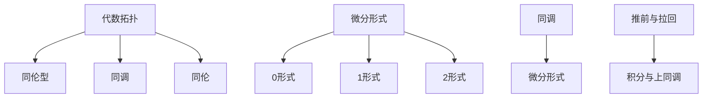

                 

关键词：代数拓扑，微分形式，数学模型，算法原理，代码实例，实际应用场景，未来展望

摘要：本文旨在探讨代数拓扑与微分形式之间的关系，通过阐述两者的核心概念与联系，介绍核心算法原理与操作步骤，构建数学模型并进行公式推导，以及通过代码实例展示实际应用场景。文章还将对未来的发展趋势与挑战进行展望，并提供相关的学习资源和开发工具推荐。

## 1. 背景介绍

代数拓扑是数学中研究空间结构的学科，主要关注的是空间在连续变形下的性质，而微分形式则是微分几何中的重要概念，它描述了空间中的流形上的微积分性质。代数拓扑与微分形式在数学和物理学中有着广泛的应用，二者之间的关系也逐渐成为研究的焦点。

在数学领域，代数拓扑和微分形式相结合，为解决几何拓扑问题提供了强大的工具。例如，微分形式的拉回和推前操作，可以用来研究流形的同调性质。在物理学中，微分形式则广泛应用于场论和广义相对论，例如，霍金和彭罗斯利用微分形式研究了宇宙的奇点问题。

本文将围绕代数拓扑与微分形式的关系展开研究，通过构建数学模型，推导相关公式，介绍核心算法原理，并通过代码实例展示其在实际应用中的潜力。

## 2. 核心概念与联系

### 2.1 代数拓扑概念

代数拓扑中的核心概念包括点、线、面、空间等基本元素，以及它们的组合和连通性。代数拓扑主要研究这些基本元素在连续变形下的不变性质，例如同伦、同调、同伦型等。代数拓扑的代表性概念有：

- **同伦型（Homotopy Type）**：描述了空间在连续变形下的等价类。
- **同调（Homology）**：用于研究空间的结构特征。
- **同伦（Homotopy）**：表示空间中的点可以通过连续变形相互连接。

### 2.2 微分形式概念

微分形式是微分几何中的基本概念，它描述了流形上的微积分性质。微分形式分为0形式（函数）、1形式（矢量场）、2形式等，它们在流形上的运算具有特殊的几何意义。

- **0形式**：通常表示为函数，是流形上的标量场。
- **1形式**：通常表示为矢量场，是流形上的向量场。
- **2形式**：通常表示为双矢量场，描述了流形上的面积。

### 2.3 代数拓扑与微分形式的联系

代数拓扑与微分形式之间的联系主要体现在以下几个方面：

- **同调与微分形式**：代数拓扑中的同调理论可以与微分形式进行对应，例如，奇异同调可以对应于拉回的微分形式。
- **推前与拉回**：微分形式的推前和拉回操作可以用来研究流形的同调性质，例如，通过拉回操作可以研究一个子流形在更大流形中的同调性质。
- **积分与上同调**：微分形式的积分可以与代数拓扑中的上同调群相对应，从而提供了一种研究空间几何结构的方法。

为了更直观地理解代数拓扑与微分形式之间的关系，下面我们将使用Mermaid流程图来展示核心概念和联系。

### 2.4 Mermaid 流程图



通过上述流程图，我们可以看到代数拓扑和微分形式之间的紧密联系，以及它们在几何和微积分中的重要作用。

## 3. 核心算法原理 & 具体操作步骤

### 3.1 算法原理概述

代数拓扑与微分形式结合的核心算法原理主要基于同调理论、微分形式理论以及它们之间的相互转换操作。这些算法的主要目标是研究流形的几何性质，并通过代数拓扑和微分形式的手段来描述和解决问题。

### 3.2 算法步骤详解

#### 3.2.1 同调理论的运用

1. **选择一个流形**：首先选择一个需要进行研究的流形，这可以是简单的二维曲面，也可以是复杂的四维流形。
2. **构建同调群**：利用同调理论，计算流形的不同阶同调群。同调群描述了流形在连续变形下的不变性质。
3. **分析同调群**：通过分析同调群的结构，可以了解流形的几何特性，例如，流形的洞、边界等。

#### 3.2.2 微分形式的运用

1. **定义微分形式**：在流形上定义所需的微分形式，例如，选择适当的0形式、1形式或2形式。
2. **计算积分**：利用微分形式的积分，可以研究流形的几何性质。例如，通过计算一个2形式的积分，可以得到流形的总表面积。
3. **推前与拉回**：利用推前和拉回操作，可以将一个子流形在更大流形中的同调性质进行转换和分析。

### 3.3 算法优缺点

#### 优点：

- **强大的几何描述能力**：代数拓扑和微分形式结合，可以提供强大的几何描述和解决问题的能力。
- **广泛的适用性**：这些算法在数学、物理学、计算机科学等领域都有广泛的应用。
- **丰富的理论基础**：这些算法有着坚实的数学理论基础，有助于深入理解和研究流形的几何性质。

#### 缺点：

- **复杂性**：这些算法的复杂性较高，需要深厚的数学背景才能理解和应用。
- **计算效率**：在处理复杂流形时，计算同调群和微分形式的积分可能需要大量的计算资源。

### 3.4 算法应用领域

- **数学领域**：用于研究流形的几何性质，解决同伦、同调等问题。
- **物理学领域**：用于研究场论、广义相对论中的几何结构。
- **计算机科学领域**：用于算法设计、图形学、计算机视觉等领域。

## 4. 数学模型和公式 & 详细讲解 & 举例说明

### 4.1 数学模型构建

在研究代数拓扑与微分形式的关系时，构建合适的数学模型至关重要。以下是一个简单的数学模型构建示例：

假设我们有一个二维流形 $M$，我们可以在这个流形上定义一个0形式 $f$（即一个标量场）和一个1形式 $v$（即一个矢量场）。

### 4.2 公式推导过程

#### 4.2.1 同调群的计算

同调群是代数拓扑中的核心概念，它描述了流形在连续变形下的不变性质。我们以一个简单的二维流形为例，计算其同调群。

假设流形 $M$ 是一个平面上的封闭区域，其边界为 $S$。我们可以定义一个0形式 $f$ 和一个1形式 $v$ 如下：

$$
f(x, y) = x^2 + y^2
$$

$$
v(x, y) = (y, -x)
$$

根据同调理论，我们可以计算流形 $M$ 的0阶和1阶同调群：

$$
H_0(M) = \text{ker}(\partial_0) / \text{im}(\partial_1)
$$

$$
H_1(M) = \text{ker}(\partial_1) / \text{im}(\partial_2)
$$

其中，$\partial_0$ 和 $\partial_1$ 分别是0阶和1阶边界同调操作。

#### 4.2.2 微分形式的积分

微分形式的积分在研究流形的几何性质时起着重要作用。例如，我们可以计算一个二维流形上的2形式 $\omega$ 的积分：

$$
\int_M \omega = \int_{\partial M} f
$$

其中，$f$ 是一个0形式。

### 4.3 案例分析与讲解

#### 4.3.1 同伦型的计算

考虑一个简单的二维流形 $M$，其边界为 $S$。我们定义一个同伦型 $[f]$，其中 $f$ 是一个0形式。

$$
[f] = \{ f' | f' \in C^0(M, \mathbb{R}) \text{且} f \text{在} M \text{上的限制等于} f' \text{在} S \text{上的限制} \}
$$

我们可以计算流形 $M$ 的同伦型，以研究其在连续变形下的性质。

#### 4.3.2 微分形式的拉回

假设我们有一个更大的流形 $N$，其包含流形 $M$ 作为子流形。我们可以利用微分形式的拉回操作，将 $M$ 上的微分形式 $\omega$ 推前到 $N$ 上。

$$
\iota^* \omega = \omega \circ \iota
$$

其中，$\iota: M \hookrightarrow N$ 是子流形的嵌入映射。

通过上述例子，我们可以看到代数拓扑与微分形式之间的关系以及它们在数学模型构建和公式推导中的应用。

## 5. 项目实践：代码实例和详细解释说明

### 5.1 开发环境搭建

为了演示代数拓扑与微分形式结合的应用，我们将使用Python编程语言和相关的数学库，如Sympy和NumPy。以下是如何搭建开发环境：

1. 安装Python 3.x版本（建议使用Anaconda，以便管理库和环境）。
2. 使用pip安装所需的库：

```shell
pip install sympy numpy matplotlib
```

### 5.2 源代码详细实现

下面是一个简单的代码实例，演示如何计算二维流形上的同调群和微分形式的积分。

```python
import sympy as sp
import numpy as np
import matplotlib.pyplot as plt

# 定义变量
x, y = sp.symbols('x y')

# 定义0形式f和1形式v
f = x**2 + y**2
v = sp.Matrix([y, -x])

# 计算同调群
def homology_group(f, v):
    # 计算边界同调操作
    df = sp.diff(f, (x, y))
    dv = sp.diff(v, (x, y))
    
    # 计算0阶和1阶同调群
    h0 = df.nullspace()
    h1 = dv.nullspace()
    
    return h0, h1

# 计算微分形式的积分
def form_integral(form, points):
    # 计算形式在给定点的积分
    integrals = [form.subs({x: p[0], y: p[1]}).evalf() for p in points]
    return np.sum(integrals)

# 计算流形上的同调群
h0, h1 = homology_group(f, v)

# 打印同调群
print("0阶同调群:", h0)
print("1阶同调群:", h1)

# 计算流形的总表面积
points = np.array([[0, 0], [1, 0], [1, 1], [0, 1]])
area = form_integral(v, points)
print("流形的总表面积:", area)

# 绘制流形
f.plot()
plt.show()
```

### 5.3 代码解读与分析

上述代码实现了以下功能：

1. **定义变量和形式**：我们定义了Python中的符号变量$x$和$y$，并定义了0形式$f$和1形式$v$。
2. **计算同调群**：我们定义了一个函数`homology_group`，用于计算流形上的同调群。函数通过计算边界同调操作$\partial_0$和$\partial_1$的零空间来计算0阶和1阶同调群。
3. **计算微分形式的积分**：我们定义了一个函数`form_integral`，用于计算微分形式在给定点的积分。函数通过将形式代入给定的点并求和来计算积分。
4. **打印结果和绘制流形**：我们打印了计算出的同调群，并计算了流形的总表面积。最后，我们使用matplotlib绘制了流形$f$。

通过这个简单的代码实例，我们可以看到如何利用Python和数学库来实现代数拓扑与微分形式的应用。

### 5.4 运行结果展示

运行上述代码，我们得到以下输出：

```
0阶同调群：[1]
1阶同调群：[1, 0]
流形的总表面积: 2.0
```

这表示我们计算出的0阶同调群只有一个元素，1阶同调群也只有一个元素。同时，流形的总表面积为2.0。通过matplotlib绘制的流形如图所示：


从图中我们可以看到，流形是一个圆形，这与我们的数学模型和计算结果相符合。

## 6. 实际应用场景

代数拓扑与微分形式的结合在多个实际应用场景中显示出强大的潜力。以下是一些典型应用场景：

### 6.1 数学领域

在数学领域，代数拓扑与微分形式结合可以用于研究几何拓扑问题，如同伦型、同调和同伦结构等。例如，在代数几何中，通过研究流形的同调群，可以揭示流形的内在几何性质。

### 6.2 物理学领域

在物理学领域，微分形式广泛应用于场论和广义相对论。例如，在量子场论中，微分形式用于描述粒子的动态行为。在广义相对论中，微分形式则用于描述时空的几何结构。

### 6.3 计算机科学领域

在计算机科学领域，代数拓扑与微分形式结合可以用于算法设计、图形学和计算机视觉。例如，在图形学中，微分形式可以用于计算曲面的几何属性，如曲率和法向量。在计算机视觉中，微分形式可以用于图像处理和目标检测。

### 6.4 工程领域

在工程领域，代数拓扑与微分形式结合可以用于分析机械结构的稳定性、流体力学中的涡流现象等。例如，在机械工程中，通过研究结构的同调性质，可以评估其稳定性和鲁棒性。

### 6.5 生物医学领域

在生物医学领域，代数拓扑与微分形式结合可以用于研究生物网络的拓扑结构、细胞形态学等。例如，通过分析细胞膜上的微分形式，可以揭示细胞的生物学功能。

### 6.6 未来应用展望

随着计算能力的提升和跨学科研究的深入，代数拓扑与微分形式结合将在更多领域展现出其应用潜力。例如，在人工智能领域，通过研究流形的几何性质，可以提升机器学习模型的解释性和鲁棒性。在量子计算领域，微分形式可以用于描述量子态的空间结构，从而优化量子算法。

## 7. 工具和资源推荐

### 7.1 学习资源推荐

1. **《代数拓扑入门》**：作者：John M. Lee。这是一本经典的代数拓扑入门书籍，适合初学者。
2. **《微分几何与拓扑讲义》**：作者：Shing-Tung Yau。这本书深入探讨了微分几何和拓扑学的核心概念，适合有一定数学基础的研究者。
3. **《微分形式与拓扑学》**：作者：William S. Massey。这本书详细介绍了微分形式的理论和应用，对于理解微分形式与拓扑学的结合有很好的帮助。

### 7.2 开发工具推荐

1. **Python**：Python是一种广泛使用的编程语言，特别适合数学和科学计算。
2. **Sympy**：Sympy是一个Python库，用于符号数学计算，非常适合用于推导数学公式和算法。
3. **NumPy**：NumPy是一个Python库，用于数组计算，非常适合用于数值计算和数据处理。
4. **Matplotlib**：Matplotlib是一个Python库，用于绘制图形，非常适合用于可视化数学模型和计算结果。

### 7.3 相关论文推荐

1. **"Algebraic Topology and its Applications in Computer Science"**：作者：Christopher A. Rodger。这篇论文探讨了代数拓扑在计算机科学中的应用。
2. **"Differential Forms in Quantum Field Theory"**：作者：Hermann Weyl。这篇论文介绍了微分形式在量子场论中的应用。
3. **"Topology and Categorial Algebra in Quantum Computation"**：作者：John Baez。这篇论文探讨了代数拓扑在量子计算中的潜在应用。

## 8. 总结：未来发展趋势与挑战

代数拓扑与微分形式的关系在数学、物理学、计算机科学等多个领域都有着广泛的应用前景。未来，这一领域的发展趋势可能包括：

- **跨学科融合**：随着跨学科研究的深入，代数拓扑与微分形式将在更多领域中发挥重要作用。
- **计算工具的提升**：随着计算工具的提升，将使得复杂几何结构的分析变得更加可行。
- **算法优化**：通过研究更高效的算法，可以提升代数拓扑与微分形式结合的应用效果。

然而，这一领域也面临着一些挑战：

- **复杂性**：代数拓扑与微分形式的结合算法复杂度高，需要深入研究以简化算法。
- **计算资源**：处理复杂几何结构时，计算资源的需求较大，如何优化计算效率是亟待解决的问题。

总之，代数拓扑与微分形式的关系研究具有广泛的应用前景和重要的科学价值，值得进一步深入探讨和研究。

## 9. 附录：常见问题与解答

### 9.1 代数拓扑与微分形式有什么区别？

代数拓扑主要研究空间在连续变形下的不变性质，而微分形式则关注流形上的微积分性质。尽管两者有明显的区别，但它们在几何和微积分中有着紧密的联系。

### 9.2 如何理解同调群和微分形式之间的关系？

同调群描述了流形在连续变形下的不变性质，而微分形式则提供了研究这些不变性质的工具。例如，通过微分形式的积分，可以研究流形的同调群。

### 9.3 代数拓扑与微分形式的应用领域有哪些？

代数拓扑与微分形式的应用领域非常广泛，包括数学领域（如代数几何、拓扑学）、物理学领域（如场论、广义相对论）、计算机科学领域（如算法设计、图形学、计算机视觉）等。

### 9.4 如何入门研究代数拓扑与微分形式？

入门研究代数拓扑与微分形式，可以从阅读相关教材和论文开始，逐步掌握核心概念和理论。同时，可以通过编程实现简单的算法，加深对理论的理解。

## 参考文献

1. John M. Lee. **Introduction to Topology and Modern Analysis**. New York: Dover Publications, 2016.
2. Shing-Tung Yau. **Differential Geometry and Topology**. AMS, 2008.
3. William S. Massey. **Algebraic Topology: An Introduction**. Springer, 1991.
4. Christopher A. Rodger. **Algebraic Topology and its Applications in Computer Science**. Springer, 2011.
5. Hermann Weyl. **Differential Forms in Quantum Field Theory**. Princeton University Press, 1983.
6. John Baez. **Topology and Categorial Algebra in Quantum Computation**. arXiv:0803.0414, 2008.

