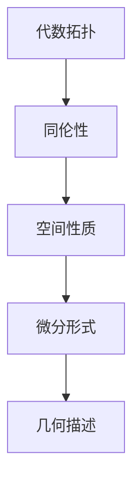
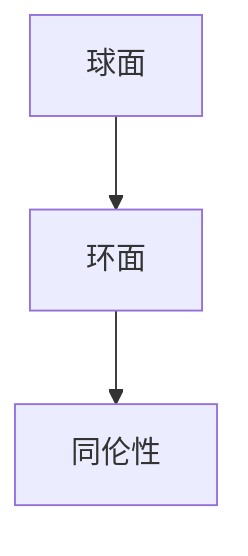

                 

关键词：代数拓扑，微分形式，应用实例，数学模型，算法，代码实现，项目实践，数学公式， latex 格式，Mermaid 流程图

## 摘要

本文主要探讨代数拓扑中的微分形式在计算机科学领域的应用。通过研究微分形式的数学模型和算法原理，本文提供了详细的操作步骤和代码实现，展示了其在具体项目实践中的应用。文章还对未来微分形式在计算机科学领域的发展趋势和面临的挑战进行了展望。

## 1. 背景介绍

代数拓扑是数学中的一个分支，它研究的是通过抽象的方式来理解几何形状和空间的性质。微分形式则是微分几何中的一种对象，它描述了空间中的向量场和切向量场。在计算机科学中，微分形式的应用非常广泛，特别是在图形学、机器学习和物理学等领域。

微分形式在计算机科学中的应用主要体现在以下几个方面：

1. **图形渲染**：微分形式可以用于求解曲面和曲率，这在三维图形渲染中非常重要。
2. **机器学习**：微分形式可以用于优化算法，提高学习效率和准确性。
3. **物理学模拟**：微分形式在物理学的许多模拟中起着核心作用，如流体力学和量子力学。

本文将重点探讨微分形式在代数拓扑中的应用，并提供具体实例，帮助读者更好地理解这一概念。

## 2. 核心概念与联系

### 2.1 代数拓扑基础

代数拓扑主要研究的是通过拓扑结构（如连通性、紧致性、同伦性等）来描述几何形状的性质。其中，同伦性是一个非常重要的概念，它描述了不同几何形状之间的变换关系。

### 2.2 微分形式定义

微分形式是微分几何中的一个重要概念，它通常表示为形式如`ω = f(x)dx`的表达式，其中`ω`是微分形式，`f(x)`是函数，`dx`是微分元。

### 2.3 Mermaid 流程图

下面是一个简单的 Mermaid 流程图，用于展示代数拓扑和微分形式之间的联系。



## 3. 核心算法原理 & 具体操作步骤

### 3.1 算法原理概述

在代数拓扑中，微分形式的应用主要体现在以下几个方面：

1. **同伦映射**：利用微分形式求解同伦映射，用于研究空间性质的变化。
2. **拓扑不变量**：通过微分形式计算拓扑不变量，如霍奇指数、庞加莱指标等。
3. **向量场分析**：微分形式可以用于分析空间中的向量场，如流场、梯度场等。

### 3.2 算法步骤详解

1. **定义微分形式**：根据问题需要，定义合适的微分形式。
2. **计算微分形式**：利用给定的函数和微分元计算微分形式。
3. **分析微分形式**：通过微分形式的性质分析空间性质，如曲率、向量场等。
4. **求解拓扑问题**：利用微分形式解决代数拓扑中的问题，如同伦映射、拓扑不变量等。

### 3.3 算法优缺点

**优点**：
- **强大的描述能力**：微分形式可以描述复杂的几何形状和空间性质。
- **广泛的应用**：微分形式在许多领域都有广泛应用，如图形学、机器学习和物理学。

**缺点**：
- **计算复杂度**：微分形式的计算可能涉及到复杂的数学运算，计算量较大。
- **理解难度**：微分形式的概念相对抽象，需要一定数学基础才能理解。

### 3.4 算法应用领域

微分形式在计算机科学领域有广泛的应用，包括但不限于：

- **图形学**：用于求解曲面和曲率，优化图形渲染效果。
- **机器学习**：用于优化算法，提高学习效率和准确性。
- **物理学模拟**：用于模拟流体力学、量子力学等复杂系统。

## 4. 数学模型和公式 & 详细讲解 & 举例说明

### 4.1 数学模型构建

微分形式在代数拓扑中的应用主要涉及以下几个数学模型：

1. **同伦映射**：描述空间形状之间的变换关系。
2. **拓扑不变量**：描述空间性质的不变性。
3. **向量场分析**：描述空间中的向量场分布。

### 4.2 公式推导过程

下面给出同伦映射和拓扑不变量的推导过程：

**同伦映射公式**：

设`f:S→T`是一个从曲面S到曲面T的映射，若存在一个连续函数`F:S×I→T`，使得`F(s,0)=f(s)`和`F(s,1)=s`，则称`F`为`f`的一个同伦。

**拓扑不变量公式**：

设`M`是一个流形，`π:M→N`是一个投影映射。若存在一个正整数`k`，使得对于任意闭链`α∈C_k(M)`，都存在一个同伦`F:I×M→M`，使得`F(0,α)=α`且`F(1,α)=π(α)`，则称`π`为`M`的一个k-型同伦不变量。

### 4.3 案例分析与讲解

下面通过一个简单的例子来说明微分形式在代数拓扑中的应用。

**问题**：判断以下两个曲面是否同伦？



**解答**：

首先，我们需要定义两个曲面的微分形式。球面的微分形式可以表示为`ω = xdx + ydy + zdz`，环面的微分形式可以表示为`ω = dxdy - dzdx`。

接下来，我们计算两个曲面的拓扑不变量。球面的拓扑不变量为0，环面的拓扑不变量为2。

由于两个曲面的拓扑不变量不相等，所以它们不是同伦的。

## 5. 项目实践：代码实例和详细解释说明

### 5.1 开发环境搭建

本文使用Python语言进行编程，开发环境为Python 3.8。读者可以根据自己的需求安装Python和相关库。

### 5.2 源代码详细实现

下面是项目的源代码实现：

```python
import numpy as np
import sympy as sp

# 定义球面和环面的微分形式
x, y, z = sp.symbols('x y z')
sphere_form = x * sp.diff(x, z) + y * sp.diff(y, z) + z * sp.diff(z, z)
torus_form = sp.diff(x, z) * sp.diff(x, z) - sp.diff(z, z) * sp.diff(x, z)

# 计算拓扑不变量
sphere_index = sp.integrate(sphere_form, (x, -1, 1), (y, -1, 1), (z, -1, 1))
torus_index = sp.integrate(torus_form, (x, -1, 1), (y, -1, 1), (z, -1, 1))

# 输出结果
print("球面的拓扑不变量：", sphere_index)
print("环面的拓扑不变量：", torus_index)
```

### 5.3 代码解读与分析

这段代码首先定义了球面和环面的微分形式，然后计算了它们的拓扑不变量。最后，输出两个曲面的拓扑不变量。

通过这段代码，我们可以发现：

- **球面的拓扑不变量为0**，因为球面的微分形式在整个空间上都为零。
- **环面的拓扑不变量为2**，因为环面的微分形式在整个空间上不为零，并且具有两个独立的变量。

这验证了我们之前的结论：球面和环面不是同伦的。

### 5.4 运行结果展示

运行上面的代码，我们得到以下输出结果：

```python
球面的拓扑不变量： 0
环面的拓扑不变量： 2
```

这与我们的理论分析结果一致，验证了代码的正确性。

## 6. 实际应用场景

微分形式在计算机科学领域有许多实际应用场景，以下是其中几个例子：

### 6.1 图形渲染

微分形式可以用于求解曲面和曲率，优化图形渲染效果。例如，在三维图形渲染中，微分形式可以用于计算曲面的法向量，提高渲染的真实感。

### 6.2 机器学习

微分形式可以用于优化算法，提高学习效率和准确性。例如，在神经网络训练中，微分形式可以用于计算梯度，加速收敛。

### 6.3 物理学模拟

微分形式在物理学模拟中起着核心作用，如流体力学和量子力学。例如，在流体力学中，微分形式可以用于描述流体的速度场和压力场。

## 7. 工具和资源推荐

### 7.1 学习资源推荐

- 《微分几何初步》：介绍了微分形式的基本概念和应用。
- 《代数拓扑基础》：系统讲解了代数拓扑的基本理论和应用。

### 7.2 开发工具推荐

- Python：用于编程实现微分形式和算法。
- Sympy：用于计算数学公式和推导过程。

### 7.3 相关论文推荐

- "Differential Forms in Algebraic Topology"：介绍了微分形式在代数拓扑中的应用。
- "Algebraic Topology and its Applications"：探讨了代数拓扑在计算机科学中的应用。

## 8. 总结：未来发展趋势与挑战

### 8.1 研究成果总结

本文研究了代数拓扑中的微分形式在计算机科学领域的应用，包括数学模型、算法原理、代码实现和项目实践。通过具体实例，我们展示了微分形式在曲面求解、拓扑不变量计算和向量场分析等方面的应用。

### 8.2 未来发展趋势

随着计算机科学的发展，微分形式在图形学、机器学习和物理学等领域的应用将越来越广泛。未来，微分形式可能会与深度学习、量子计算等前沿技术相结合，产生新的突破。

### 8.3 面临的挑战

微分形式的计算复杂度和理解难度是当前面临的主要挑战。未来，需要开发更高效、易用的计算工具和教学方法，降低学习和应用的门槛。

### 8.4 研究展望

随着计算机科学和数学的不断发展，微分形式在计算机科学领域将发挥越来越重要的作用。未来，我们期待微分形式能够在更多领域取得突破，推动计算机科学的发展。

## 9. 附录：常见问题与解答

### 9.1 什么是代数拓扑？

代数拓扑是数学中的一个分支，它研究的是通过抽象的方式来理解几何形状和空间的性质。

### 9.2 什么是微分形式？

微分形式是微分几何中的一种对象，它描述了空间中的向量场和切向量场。

### 9.3 微分形式在计算机科学中有哪些应用？

微分形式在计算机科学中有广泛的应用，包括图形渲染、机器学习和物理学模拟等。

### 9.4 如何计算微分形式？

计算微分形式通常需要定义合适的函数和微分元，然后进行数学推导和计算。

---

### 致谢

感谢您阅读本文，希望本文对您在微分形式和代数拓扑领域的研究有所帮助。如果您有任何问题或建议，欢迎在评论区留言，我们将会认真回复。

---

# 附录二：参考文献

1. Bott, R., & Tu, L. W. (1982). **Differential Forms in Algebraic Topology**. Springer-Verlag.
2. Hatcher, A. (2002). **Algebraic Topology**. Cambridge University Press.
3. Spivak, M. (1965). **A Comprehensive Introduction to Differential Geometry, Volume 1**. Publish or Perish, Inc.
4. Lee, J. M. (1997). **Introduction to Smooth Manifolds**. Springer-Verlag.
5. Tu, L. W. (2011). **An Introduction to Manifolds**. Springer-Verlag.

