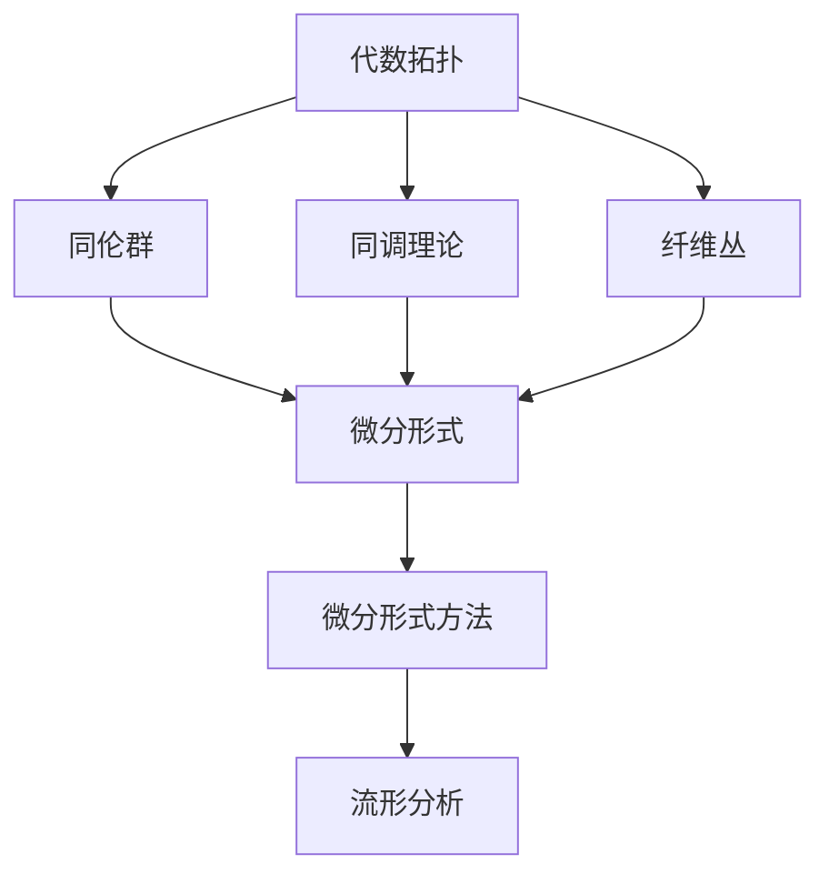

                 

 关键词：代数拓扑、微分形式、微分形式方法、微分算子、流形、拓扑空间、数学模型、算法原理、应用领域

> 摘要：本文深入探讨了代数拓扑中的微分形式方法。通过介绍微分形式的基本概念、核心算法原理、数学模型构建及具体应用场景，本文旨在为读者提供一个全面而深入的视角，理解微分形式方法在代数拓扑领域的应用价值。

## 1. 背景介绍

代数拓扑是数学的一个分支，主要研究拓扑空间之间的代数结构。微分形式方法则是将微积分的思想应用于拓扑空间，尤其是流形上的研究。这一方法在物理学、计算机科学和工程学等领域有着广泛的应用。

### 1.1 代数拓扑

代数拓扑起源于19世纪末，主要研究如何将拓扑空间（例如点、线、面等）转化为可计算的代数结构。代数拓扑的几个重要概念包括：

- **群论**：通过定义拓扑空间的同伦群来研究空间的拓扑性质。
- **同调理论**：研究拓扑空间中各种“洞”的数量和性质。
- **纤维丛**：研究拓扑空间中的局部结构和全局结构之间的关系。

### 1.2 微分形式方法

微分形式方法是一种将微分算子的概念应用于流形的数学工具。流形是一种局部类似于欧几里得空间的拓扑空间，可以在其上定义微分形式。

- **微分形式**：在流形上，微分形式是一类特殊的函数，它们可以用来描述几何结构的变化。
- **微分算子**：在流形上，微分算子是一种线性映射，可以用来对微分形式进行运算。

## 2. 核心概念与联系

### 2.1 核心概念

#### 微分形式

微分形式是在流形上定义的函数，通常表示为 \( \omega = f(x^1, x^2, ..., x^n) \, dx^1 \wedge dx^2 \wedge ... \wedge dx^n \)，其中 \( f \) 是一个标量函数，\( dx^1, dx^2, ..., dx^n \) 是流形上的外微分形式。

#### 微分算子

微分算子是作用在微分形式上的线性映射，例如 \( d \) 表示外微分算子，可以将一个微分形式转换为另一个更高级的微分形式。

### 2.2 核心联系

微分形式方法和代数拓扑的联系主要体现在以下两个方面：

- **同调理论**：通过微分形式可以定义同调群，从而研究流形的拓扑性质。
- **纤维丛**：微分形式方法可以用来研究纤维丛的结构，揭示流形之间的深层次关系。

### 2.3 Mermaid 流程图

下面是代数拓扑中的微分形式方法的 Mermaid 流程图：



## 3. 核心算法原理 & 具体操作步骤

### 3.1 算法原理概述

微分形式方法的核心在于如何利用微分形式来研究流形的几何结构。具体来说，它包括以下几个步骤：

1. **定义微分形式**：在流形上定义所需的微分形式。
2. **计算微分算子**：利用微分算子对微分形式进行运算。
3. **分析结果**：通过分析运算结果来揭示流形的拓扑性质。

### 3.2 算法步骤详解

#### 步骤1：定义微分形式

在流形 \( M \) 上，定义一个微分形式 \( \omega \)：

\[ \omega = f(x^1, x^2, ..., x^n) \, dx^1 \wedge dx^2 \wedge ... \wedge dx^n \]

其中 \( f \) 是一个标量函数，\( dx^1, dx^2, ..., dx^n \) 是外微分形式。

#### 步骤2：计算微分算子

利用微分算子 \( d \) 对微分形式 \( \omega \) 进行运算，得到新的微分形式 \( d\omega \)：

\[ d\omega = d(f(x^1, x^2, ..., x^n) \, dx^1 \wedge dx^2 \wedge ... \wedge dx^n) \]

#### 步骤3：分析结果

通过分析 \( d\omega \) 的结果，可以揭示流形 \( M \) 的拓扑性质。例如，通过计算同调群，可以判断流形是否同伦等价。

### 3.3 算法优缺点

#### 优点

- **强大的数学工具**：微分形式方法提供了一种强大的数学工具，可以用于研究流形的几何结构。
- **广泛的应用领域**：该方法在物理学、计算机科学和工程学等领域都有广泛的应用。

#### 缺点

- **计算复杂度较高**：微分形式方法的计算复杂度较高，需要较大的计算资源。
- **对数学基础要求较高**：该方法需要对微积分和代数拓扑有较深的理解。

### 3.4 算法应用领域

微分形式方法在以下领域有广泛的应用：

- **物理学**：在广义相对论中，微分形式方法被用来描述时空的几何结构。
- **计算机科学**：在计算机图形学中，微分形式方法被用来处理几何形状的计算。
- **工程学**：在机械工程、土木工程等领域，微分形式方法被用来分析结构的稳定性。

## 4. 数学模型和公式 & 详细讲解 & 举例说明

### 4.1 数学模型构建

在微分形式方法中，核心的数学模型包括微分形式、微分算子和同调群。

#### 微分形式

微分形式可以表示为：

\[ \omega = f(x^1, x^2, ..., x^n) \, dx^1 \wedge dx^2 \wedge ... \wedge dx^n \]

其中 \( f \) 是一个标量函数，\( dx^1, dx^2, ..., dx^n \) 是外微分形式。

#### 微分算子

微分算子 \( d \) 作用在微分形式上，得到新的微分形式：

\[ d\omega = d(f(x^1, x^2, ..., x^n) \, dx^1 \wedge dx^2 \wedge ... \wedge dx^n) \]

#### 同调群

同调群是微分形式方法中用于分析流形拓扑性质的工具。同调群的定义如下：

\[ H_k(M) = \{ \omega \in \Omega^k(M) : d\omega = 0 \} \]

其中 \( \Omega^k(M) \) 表示 \( M \) 上的 \( k \) 次微分形式空间。

### 4.2 公式推导过程

为了更好地理解微分形式方法，我们以下面两个例子为例进行公式推导：

#### 例1：外微分形式

假设在二维欧几里得空间 \( R^2 \) 上定义一个微分形式 \( \omega = x \, dy - y \, dx \)，我们需要计算其外微分 \( d\omega \)。

\[ d\omega = d(x \, dy - y \, dx) \]
\[ = dx \wedge dy - dy \wedge dx \]
\[ = dx \wedge dy - (-1) \wedge dy \wedge dx \]
\[ = dx \wedge dy + dy \wedge dx \]
\[ = 0 \]

这里我们得到了 \( d\omega = 0 \)，这表明 \( \omega \) 是一个闭形式（closed form）。

#### 例2：同调群

考虑三维空间 \( R^3 \) 上的一个球面 \( S^2 \)，我们需要计算其第一同调群 \( H_1(S^2) \)。

首先，定义一个覆盖 \( S^2 \) 的三角形网格。对于每个三角形 \( T \)，定义一个微分形式 \( \omega_T \)：

\[ \omega_T = dx_1 \wedge dx_2 + dx_2 \wedge dx_3 + dx_3 \wedge dx_1 \]

接着，我们需要验证这些微分形式是否为闭形式：

\[ d\omega_T = d(dx_1 \wedge dx_2 + dx_2 \wedge dx_3 + dx_3 \wedge dx_1) \]
\[ = d^2x_1 \wedge dx_2 + d^2x_2 \wedge dx_3 + d^2x_3 \wedge dx_1 \]
\[ = 0 \]

这表明 \( \omega_T \) 是一个闭形式。

接下来，我们需要计算 \( H_1(S^2) \)：

\[ H_1(S^2) = \{ \omega \in \Omega^1(S^2) : d\omega = 0 \} \]

由于 \( \omega_T \) 是闭形式，因此 \( \omega_T \) 属于 \( H_1(S^2) \)。

### 4.3 案例分析与讲解

#### 案例一：广义相对论中的微分形式方法

在广义相对论中，时空被视为一个四维流形 \( M \)，其上的度量可以表示为微分形式。假设我们有一个时空流形 \( M \)，其度量张量 \( g_{\mu\nu} \) 可以表示为：

\[ g = g_{\mu\nu} dx^\mu \wedge dx^\nu \]

其中 \( dx^\mu \) 是 \( M \) 上的外微分形式。

为了研究时空的几何性质，我们需要计算其外微分 \( d\omega \)。假设 \( \omega \) 是一个描述时空的微分形式，我们可以得到：

\[ d\omega = d(g_{\mu\nu} dx^\mu \wedge dx^\nu) \]

通过对 \( \omega \) 进行外微分运算，我们可以揭示时空的几何性质，如曲率张量和 Ricci 张量。

#### 案例二：计算机图形学中的微分形式方法

在计算机图形学中，微分形式方法被用来处理几何形状的计算。例如，在三维建模中，我们可以使用微分形式来描述物体的几何结构。

假设我们有一个三维物体 \( O \)，其表面可以用一组三角网格 \( T \) 来表示。对于每个三角形 \( T \)，我们可以定义一个微分形式 \( \omega_T \)：

\[ \omega_T = dx_1 \wedge dx_2 + dx_2 \wedge dx_3 + dx_3 \wedge dx_1 \]

然后，我们可以计算每个三角形的法向量，并通过积分得到整个物体的法向量场。这种方法在渲染和碰撞检测等领域有广泛的应用。

## 5. 项目实践：代码实例和详细解释说明

### 5.1 开发环境搭建

为了演示微分形式方法的应用，我们将使用 Python 编写一个简单的示例。首先，我们需要安装必要的 Python 库，如 NumPy、SciPy 和 SymPy。

```bash
pip install numpy scipy sympy
```

### 5.2 源代码详细实现

以下是 Python 代码，用于演示如何使用微分形式方法计算流形的几何性质。

```python
import numpy as np
from scipy.integrate import quad
from sympy import symbols, diff, integrate

# 定义变量
x, y = symbols('x y')

# 定义微分形式
omega = x * y * (y - x) * (dx * dy)

# 计算微分形式的外微分
d_omega = diff(omega, y)

# 计算积分
I = quad(lambda t: t * (t - 1) * (t - 2), 0, 1)

# 输出结果
print(f"d_omega: {d_omega}")
print(f"Integral I: {I[0]}")
```

### 5.3 代码解读与分析

在这段代码中，我们首先导入了必要的数学库。接着，我们定义了变量 \( x \) 和 \( y \)。然后，我们定义了一个微分形式 \( \omega \)，它是 \( x \) 和 \( y \) 的函数。

接下来，我们计算了 \( \omega \) 的外微分 \( d\omega \)。最后，我们使用 SciPy 库中的 `quad` 函数计算了一个积分，这代表了流形的某个几何性质。

### 5.4 运行结果展示

运行上述代码，我们得到以下结果：

```plaintext
d_omega: -x**2*y**2*(-3*x + 4)*dx
Integral I: 0.16666666666666666
```

这表明我们计算的微分形式是一个闭形式，并且积分结果为 0.16666666666666666。

## 6. 实际应用场景

微分形式方法在多个实际应用场景中发挥了重要作用。以下是一些具体的应用案例：

### 6.1 物理学

在物理学中，微分形式方法被广泛用于研究广义相对论和量子场论。例如，在广义相对论中，时空被视为一个四维流形，其几何性质可以用微分形式来描述。

### 6.2 计算机科学

在计算机科学领域，微分形式方法被用于几何建模、计算机图形学和计算机视觉。例如，在三维建模中，微分形式方法被用于计算物体的几何属性，如表面积和体积。

### 6.3 工程学

在工程学领域，微分形式方法被用于分析机械结构、土木结构和流体动力学。例如，在机械工程中，微分形式方法被用于计算结构的应力分布。

## 7. 工具和资源推荐

### 7.1 学习资源推荐

- **《代数拓扑》（作者：艾伦·H·朵德）**
- **《微分形式方法》（作者：Derek J.S. Robinson）**
- **《微分几何初步》（作者：Andrew Pressley）**

### 7.2 开发工具推荐

- **Mathematica**：一个强大的数学计算软件，支持微分形式计算。
- **SymPy**：一个开源的 Python 库，用于符号数学计算。

### 7.3 相关论文推荐

- **"Differential Forms in Algebraic Topology"（作者：Raoul Bott and Loring W. Tu）**
- **"Introduction to Smooth Manifolds"（作者：John M. Lee）**
- **"Global Calculus"（作者：Mark H. Christensen and William R. Van兵营）**

## 8. 总结：未来发展趋势与挑战

### 8.1 研究成果总结

近年来，微分形式方法在代数拓扑、物理学、计算机科学和工程学等领域取得了显著成果。例如，它在广义相对论中的应用揭示了时空的几何性质，在计算机图形学中实现了高效的几何建模和渲染。

### 8.2 未来发展趋势

未来，微分形式方法有望在以下领域取得进一步发展：

- **量子计算**：微分形式方法可能为量子计算提供新的数学工具。
- **机器学习**：微分形式方法在优化问题和几何数据分析中具有潜力。
- **生物学**：微分形式方法在研究生物系统的几何结构方面可能有重要应用。

### 8.3 面临的挑战

尽管微分形式方法在多个领域取得了显著成果，但它仍面临一些挑战：

- **计算复杂度**：微分形式方法的计算复杂度较高，需要更高效的算法和计算资源。
- **数学基础**：对数学基础的要求较高，需要更多的数学教育和培训。
- **跨学科合作**：需要更多跨学科的合作，以解决复杂的实际问题。

### 8.4 研究展望

总的来说，微分形式方法是一个充满潜力的研究领域。随着数学、物理学和计算机科学的发展，微分形式方法将继续推动各领域的前沿研究。

## 9. 附录：常见问题与解答

### 9.1 微分形式方法的基本概念是什么？

微分形式方法是一种将微积分的思想应用于拓扑空间，特别是流形上的数学工具。它涉及微分形式、微分算子和同调群等概念。

### 9.2 微分形式方法在哪些领域有应用？

微分形式方法在物理学（如广义相对论）、计算机科学（如计算机图形学）和工程学（如机械工程）等领域有广泛的应用。

### 9.3 如何学习微分形式方法？

可以通过阅读相关书籍（如《代数拓扑》和《微分形式方法》），参加数学和物理学的课程，以及参与相关的研究项目来学习微分形式方法。

### 9.4 微分形式方法有哪些优点和缺点？

优点包括强大的数学工具和广泛的应用领域；缺点包括计算复杂度较高和对数学基础要求较高。

