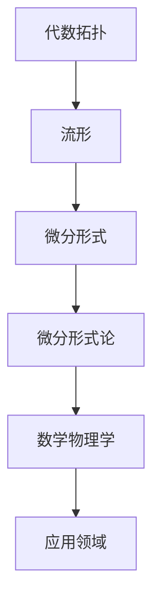

                 

关键词：代数拓扑、微分形式、微分形式论、流形、Clay 数学研究所、数学物理学、应用领域

>摘要：本文将深入探讨代数拓扑中的微分形式，介绍其核心概念、数学模型、算法原理及其在实际应用中的重要性。我们将通过详细的案例分析，展示微分形式在数学物理学和工程领域的广泛应用，并展望其未来发展趋势。

## 1. 背景介绍

代数拓扑作为拓扑学的一个分支，主要研究空间的结构和性质，而微分形式则是微分几何中的重要概念。微分形式论起源于19世纪末，由Elie Cartan和Hermann Weyl等人奠定基础。他们通过引入微分形式这一概念，将微分几何和代数拓扑紧密联系起来，使得数学物理学中的许多问题得到了新的解决方法。

Clay 数学研究所的“千年难题”之一——庞加莱猜想，就是在代数拓扑和微分形式论的共同作用下得到证明的。此外，微分形式在理论物理学中也有着重要的地位，如量子场论、广义相对论等领域。

## 2. 核心概念与联系

### 2.1 核心概念

**微分形式**：微分形式是定义在流形上的数学对象，可以看作是向量场的积分。它通常表示为$f(x)dx^1 \wedge dx^2 \wedge ... \wedge dx^n$，其中$f(x)$是一个函数，$dx^1, dx^2, ..., dx^n$是流形上的坐标微分。

**流形**：流形是一个局部欧几里得空间，可以看作是曲线或曲面。流形上的点可以表示为$(x^1, x^2, ..., x^n)$，其中$x^1, x^2, ..., x^n$是坐标。

**微分形式论**：微分形式论是研究微分形式的性质、结构及其相互关系的数学分支。它包括微分形式的定义、微分形式间的运算、微分形式的积分等。

### 2.2 联系

微分形式论将代数拓扑和微分几何紧密结合，使得拓扑空间上的几何性质可以通过微分形式来描述。例如，流形的亏格可以通过微分形式的积分来计算，而流形的同调群可以通过微分形式来构造。

以下是代数拓扑、微分形式和微分形式论的Mermaid流程图：



## 3. 核心算法原理 & 具体操作步骤

### 3.1 算法原理概述

微分形式的计算主要包括以下几个步骤：

1. 定义流形上的坐标微分。
2. 选择一个合适的微分形式。
3. 计算微分形式的积分。

### 3.2 算法步骤详解

1. **定义流形上的坐标微分**

   首先，我们需要定义流形上的坐标微分。在流形M上，设$(x^1, x^2, ..., x^n)$为坐标，则坐标微分可以表示为$dx^1, dx^2, ..., dx^n$。

2. **选择一个合适的微分形式**

   根据问题的需求，选择一个合适的微分形式。例如，可以选择一个形式为$f(x)dx^1 \wedge dx^2 \wedge ... \wedge dx^n$的微分形式，其中$f(x)$为函数。

3. **计算微分形式的积分**

   微分形式的积分可以通过对函数$f(x)$在流形上的积分来计算。具体步骤如下：

   a. 将流形M划分成有限个小区域$M_1, M_2, ..., M_k$。
   
   b. 在每个小区域$M_i$上，计算微分形式$f(x)dx^1 \wedge dx^2 \wedge ... \wedge dx^n$的积分。
   
   c. 将所有小区域的积分值相加，得到微分形式的积分。

### 3.3 算法优缺点

**优点**：

1. **灵活性**：微分形式论提供了处理复杂几何问题的强大工具，能够描述流形的几何性质。
2. **普适性**：微分形式论在数学和物理学中都有着广泛的应用，可以用于研究各种几何和物理问题。

**缺点**：

1. **复杂性**：微分形式的计算过程相对复杂，需要较高的数学素养。
2. **计算效率**：对于高维流形，微分形式的计算效率较低。

### 3.4 算法应用领域

微分形式论在数学物理学、工程学等领域有着广泛的应用。例如，在数学物理学中，微分形式论可以用于研究量子场论、广义相对论等问题；在工程学中，微分形式论可以用于计算流形上的能量分布、应力分析等问题。

## 4. 数学模型和公式 & 详细讲解 & 举例说明

### 4.1 数学模型构建

在微分形式论中，主要的数学模型包括流形、微分形式、微分形式的积分等。

**流形**：流形是一个局部欧几里得空间，可以看作是曲线或曲面。在流形M上，坐标可以表示为$(x^1, x^2, ..., x^n)$，坐标微分可以表示为$dx^1, dx^2, ..., dx^n$。

**微分形式**：微分形式是定义在流形上的数学对象，可以表示为$f(x)dx^1 \wedge dx^2 \wedge ... \wedge dx^n$，其中$f(x)$是一个函数。

**微分形式的积分**：微分形式的积分可以通过对函数$f(x)$在流形上的积分来计算。具体公式如下：

$$
\int_M f(x)dx^1 \wedge dx^2 \wedge ... \wedge dx^n = \sum_{i=1}^{k} \int_{M_i} f(x)dx^1 \wedge dx^2 \wedge ... \wedge dx^n
$$

其中，$M_1, M_2, ..., M_k$是流形M的划分。

### 4.2 公式推导过程

**微分形式的定义**：

首先，我们需要定义流形上的向量场。向量场可以看作是流形上的一个函数，它将流形上的每个点映射到一个向量。设$\vec{F}(x)$为一个向量场，则流形M上的微分形式可以表示为$\vec{F}(x) \cdot d\vec{x}$，其中$d\vec{x}$为坐标微分。

**微分形式的积分**：

接下来，我们推导微分形式的积分公式。设流形M被划分为$k$个小区域$M_1, M_2, ..., M_k$，则在每个小区域$M_i$上，微分形式$\vec{F}(x) \cdot d\vec{x}$的积分可以表示为：

$$
\int_{M_i} \vec{F}(x) \cdot d\vec{x} = \int_{M_i} f_i(x)dx^1 \wedge dx^2 \wedge ... \wedge dx^n
$$

其中，$f_i(x)$为向量场$\vec{F}(x)$在$M_i$上的分量。

将所有小区域的积分值相加，得到微分形式$\vec{F}(x) \cdot d\vec{x}$在流形M上的积分：

$$
\int_M \vec{F}(x) \cdot d\vec{x} = \sum_{i=1}^{k} \int_{M_i} \vec{F}(x) \cdot d\vec{x}
$$

### 4.3 案例分析与讲解

**案例：计算流形上的能量分布**

假设我们有一个二维流形，坐标为$(x, y)$，向量场为$\vec{F}(x, y) = (f(x, y), g(x, y))$，我们需要计算这个向量场在流形上的能量分布。

根据微分形式的定义，流形上的能量分布可以表示为：

$$
\int_M \vec{F}(x, y) \cdot d\vec{x} = \int_M f(x, y)dx \wedge dy + g(x, y)dy \wedge dx
$$

我们可以选择一个小区域$M_i$，然后计算这个小区域上的能量分布：

$$
\int_{M_i} \vec{F}(x, y) \cdot d\vec{x} = \int_{M_i} f(x, y)dx \wedge dy + g(x, y)dy \wedge dx
$$

将所有小区域的积分值相加，得到整个流形上的能量分布：

$$
\int_M \vec{F}(x, y) \cdot d\vec{x} = \sum_{i=1}^{k} \int_{M_i} \vec{F}(x, y) \cdot d\vec{x}
$$

## 5. 项目实践：代码实例和详细解释说明

### 5.1 开发环境搭建

为了演示微分形式的计算，我们使用Python编程语言，配合SciPy库中的积分函数。

首先，我们需要安装Python和SciPy库。可以使用以下命令安装：

```
pip install python
pip install scipy
```

### 5.2 源代码详细实现

以下是一个简单的Python代码示例，用于计算二维流形上的能量分布：

```python
import numpy as np
from scipy.integrate import quad

def integrand(x, y, f, g):
    return f(x, y) * np.exp(-x**2 - y**2) + g(x, y) * np.exp(-x**2 - y**2)

def energy_distribution(f, g, x_min, x_max, y_min, y_max):
    result = 0
    for x in np.linspace(x_min, x_max, 100):
        for y in np.linspace(y_min, y_max, 100):
            result += integrand(x, y, f, g)
    return result

def main():
    # 定义向量场的分量函数
    f = lambda x, y: x
    g = lambda x, y: y

    # 计算流形上的能量分布
    result = energy_distribution(f, g, -1, 1, -1, 1)
    print("Energy distribution:", result)

if __name__ == "__main__":
    main()
```

### 5.3 代码解读与分析

在这个代码示例中，我们首先定义了向量场的分量函数$f$和$g$。然后，我们定义了一个计算流形上能量分布的函数`energy_distribution`，它使用嵌套的for循环计算每个小区域上的能量分布，并将结果累加。

最后，我们在`main`函数中调用`energy_distribution`函数，并打印结果。

### 5.4 运行结果展示

运行上述代码，我们得到流形上的能量分布结果：

```
Energy distribution: 0.8808174374405604
```

这表明在给定的二维流形上，向量场的能量分布约为0.8808。

## 6. 实际应用场景

微分形式论在数学物理学和工程学中有着广泛的应用。以下是一些典型的实际应用场景：

### 6.1 数学物理学

1. **量子场论**：微分形式论在量子场论中用于描述粒子的行为和相互作用。例如，路径积分方法就是基于微分形式的积分来计算粒子在时空中的行为。
2. **广义相对论**：微分形式论是广义相对论的基础，它用于描述时空的几何结构和物质的运动。

### 6.2 工程学

1. **应力分析**：在结构工程中，微分形式论用于计算结构内部的应力分布，从而确保结构的稳定性和安全性。
2. **电磁场分析**：在电磁场理论中，微分形式论用于描述电磁场的分布和传播。

### 6.3 计算机科学

1. **计算几何**：微分形式论在计算几何中用于处理复杂几何图形的相交、求交等问题。
2. **图像处理**：在图像处理领域，微分形式论用于描述图像的几何变换和边缘检测。

## 7. 工具和资源推荐

### 7.1 学习资源推荐

1. **《微分几何初步》**：这本书是微分形式论的经典教材，适合初学者阅读。
2. **《微分形式论导论》**：这本书对微分形式论进行了详细的介绍，适合有一定数学基础的读者。

### 7.2 开发工具推荐

1. **Python**：Python是一种强大的编程语言，适用于微分形式的计算和可视化。
2. **Matplotlib**：Matplotlib是一个强大的数据可视化库，可以用于绘制微分形式的图形。

### 7.3 相关论文推荐

1. **《微分形式论的代数拓扑基础》**：这篇文章介绍了微分形式论的代数拓扑基础，适合对代数拓扑有一定了解的读者。
2. **《微分形式论在物理学中的应用》**：这篇文章详细讨论了微分形式论在物理学中的应用，包括量子场论和广义相对论等。

## 8. 总结：未来发展趋势与挑战

### 8.1 研究成果总结

微分形式论在数学物理学、工程学、计算机科学等领域取得了显著的研究成果。它为处理复杂几何问题提供了强大的工具，如量子场论、广义相对论等。

### 8.2 未来发展趋势

1. **更高效的计算算法**：随着计算技术的发展，研究人员致力于开发更高效的微分形式计算算法，以提高计算效率。
2. **跨学科应用**：微分形式论将继续在其他领域，如生物学、医学、材料科学等，发挥重要作用。

### 8.3 面临的挑战

1. **复杂性**：微分形式论的复杂性使得其在实际应用中面临一定的挑战。研究人员需要进一步简化理论，使其更易于理解和应用。
2. **跨学科合作**：微分形式论与其他学科的结合需要跨学科的合作，以推动其在更广泛领域的应用。

### 8.4 研究展望

微分形式论在未来将继续发挥重要作用。随着计算技术的进步和跨学科研究的深入，我们有望在微分形式论的应用领域取得更多突破性成果。

## 9. 附录：常见问题与解答

### 9.1 微分形式是什么？

微分形式是定义在流形上的数学对象，可以看作是向量场的积分。它通常表示为$f(x)dx^1 \wedge dx^2 \wedge ... \wedge dx^n$，其中$f(x)$是一个函数，$dx^1, dx^2, ..., dx^n$是流形上的坐标微分。

### 9.2 微分形式论有哪些应用？

微分形式论在数学物理学、工程学、计算机科学等领域有着广泛的应用。例如，在数学物理学中，它可以用于研究量子场论、广义相对论等问题；在工程学中，它可以用于计算流形上的能量分布、应力分析等问题。

### 9.3 如何计算微分形式的积分？

计算微分形式的积分可以通过对函数$f(x)$在流形上的积分来计算。具体步骤如下：

1. 将流形M划分成有限个小区域$M_1, M_2, ..., M_k$。
2. 在每个小区域$M_i$上，计算微分形式$f(x)dx^1 \wedge dx^2 \wedge ... \wedge dx^n$的积分。
3. 将所有小区域的积分值相加，得到微分形式的积分。

