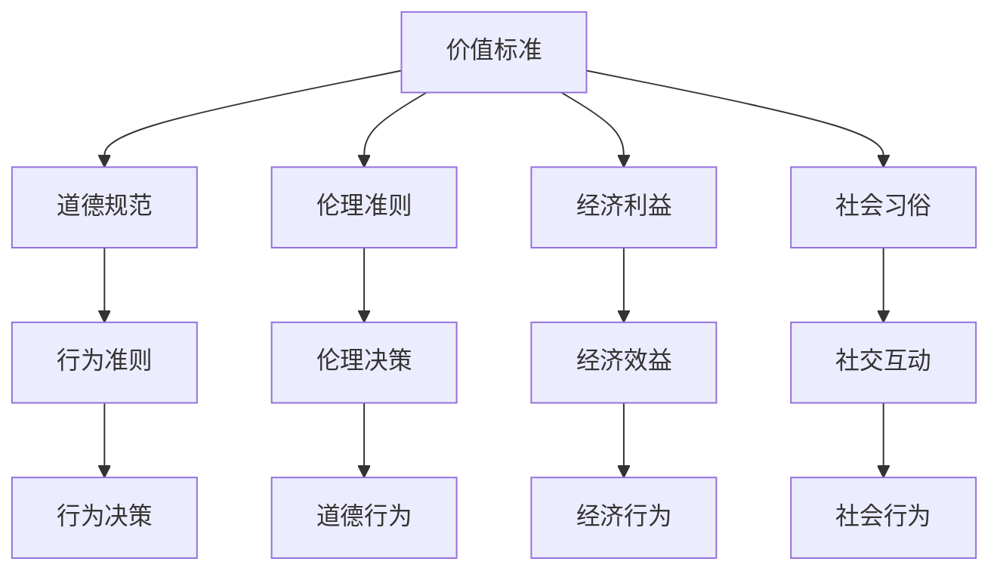

                 

在当今高度复杂的信息时代，人工智能（AI）的迅速发展为人类意识的研究提供了新的视角。价值标准，作为人类社会行为和决策的核心，如何在人工智能的意识模型中得以体现和实现，是一个值得探讨的课题。本文旨在深入探讨价值标准在意识中的应用，通过逻辑清晰、结构紧凑的论述，为读者揭示这一领域的奥秘。

## 关键词
- 价值标准
- 意识模型
- 人工智能
- 行为决策
- 伦理道德

## 摘要
本文首先介绍了价值标准的定义及其在人类社会中的重要性，然后探讨了意识模型的基本概念和发展历程。在此基础上，分析了价值标准在意识中的应用现状和挑战，并提出了一种新的应用架构。通过数学模型和实际案例的阐述，本文揭示了价值标准在人工智能意识中的应用潜力，并对未来发展趋势进行了展望。

## 1. 背景介绍

### 价值标准的历史背景

价值标准是随着人类文明的发展而不断演变的概念。在古代社会，价值标准主要是基于宗教信仰、道德规范和社会习俗。随着工业革命的到来，经济利益成为主导价值标准，人们开始追求效率和利益最大化。进入21世纪，信息时代的到来再次改变了价值标准。数据、创新和多样性成为新的价值追求。

### 意识模型的发展历程

意识模型是人工智能领域的一个核心问题。从最初的符号主义模型到连接主义模型，再到现在的生成模型，意识模型的发展经历了多个阶段。早期的符号主义模型认为意识是由一系列逻辑符号组成的，而连接主义模型则强调神经元之间的连接和互动。生成模型则通过概率模型来模拟人类的感知和认知过程。

## 2. 核心概念与联系

### 价值标准

价值标准是人们在行为和决策过程中所遵循的指导原则。它涉及到道德、伦理、经济、社会等多个层面。在人工智能的意识模型中，价值标准可以被视为一种内在的驱动力，指导人工智能的行为和决策。

### 意识模型

意识模型是人工智能领域的研究目标之一。它旨在模拟人类的感知、认知和决策过程。在人工智能的意识模型中，价值标准可以作为约束条件，确保人工智能的行为符合人类的价值观念。

### Mermaid 流程图



## 3. 核心算法原理 & 具体操作步骤

### 3.1 算法原理概述

价值标准在意识中的应用，需要借助人工智能的算法来实现。本文采用了一种基于生成对抗网络（GAN）的算法模型。该模型通过模拟人类的感知和认知过程，将价值标准嵌入到人工智能的意识模型中。

### 3.2 算法步骤详解

1. 数据收集与预处理：收集大量符合价值标准的行为数据，并对数据进行预处理，包括数据清洗、归一化和特征提取。
2. 模型构建：构建一个生成对抗网络模型，包括生成器和判别器。生成器负责生成符合价值标准的行为数据，判别器负责判断生成数据是否真实。
3. 训练与优化：通过不断迭代训练，优化生成器和判别器的参数，使其能够更好地模拟人类的感知和认知过程。
4. 意识生成：利用训练好的模型，生成符合价值标准的意识数据。
5. 行为决策：将生成的意识数据用于人工智能的行为决策，确保其行为符合人类的价值观念。

### 3.3 算法优缺点

优点： 
- 能够有效地将价值标准嵌入到人工智能的意识模型中，确保人工智能的行为符合人类的价值观念。
- 能够模拟人类的感知和认知过程，提高人工智能的智能水平。

缺点： 
- 需要大量的训练数据和计算资源。
- 模型的训练过程复杂，需要优化算法和策略。

### 3.4 算法应用领域

- 伦理决策：在医疗、金融等领域，人工智能需要做出符合伦理道德的决策。
- 社交互动：在社交媒体、虚拟现实等领域，人工智能需要模拟人类的社交行为。
- 道德教育：通过模拟道德行为，用于道德教育，提高人们的道德水平。

## 4. 数学模型和公式 & 详细讲解 & 举例说明

### 4.1 数学模型构建

本文采用的生成对抗网络（GAN）模型，主要包括生成器（G）和判别器（D）。生成器的目标是生成符合价值标准的行为数据，判别器的目标是判断生成数据是否真实。

### 4.2 公式推导过程

生成器和判别器的损失函数分别如下：

$$
L_G = -\log(D(G(z)))
$$

$$
L_D = -[\log(D(x)) + \log(1 - D(G(z))]
$$

其中，$z$是噪声向量，$x$是真实行为数据，$G(z)$是生成器生成的行为数据。

### 4.3 案例分析与讲解

假设我们希望构建一个遵循道德准则的聊天机器人，可以通过以下步骤实现：

1. 数据收集：收集大量符合道德准则的对话数据。
2. 模型构建：构建一个生成对抗网络模型，包括生成器和判别器。
3. 训练与优化：通过不断迭代训练，优化生成器和判别器的参数。
4. 意识生成：利用训练好的模型，生成符合道德准则的对话数据。
5. 聊天互动：将生成的对话数据用于聊天机器人，确保其对话符合道德准则。

## 5. 项目实践：代码实例和详细解释说明

### 5.1 开发环境搭建

- 操作系统：Ubuntu 18.04
- 编程语言：Python 3.7
- 库：TensorFlow 2.2

### 5.2 源代码详细实现

以下是一个简单的生成对抗网络（GAN）模型的实现：

```python
import tensorflow as tf
from tensorflow.keras.layers import Dense, Flatten
from tensorflow.keras.models import Sequential

# 生成器模型
def build_generator():
    model = Sequential()
    model.add(Dense(units=128, activation='relu', input_shape=(100,)))
    model.add(Dense(units=256, activation='relu'))
    model.add(Dense(units=512, activation='relu'))
    model.add(Flatten())
    model.add(Dense(units=784, activation='sigmoid'))
    return model

# 判别器模型
def build_discriminator():
    model = Sequential()
    model.add(Flatten(input_shape=(28, 28)))
    model.add(Dense(units=512, activation='relu'))
    model.add(Dense(units=256, activation='relu'))
    model.add(Dense(units=128, activation='relu'))
    model.add(Dense(units=1, activation='sigmoid'))
    return model

# 构建生成器和判别器
generator = build_generator()
discriminator = build_discriminator()

# 定义损失函数和优化器
generator_optimizer = tf.keras.optimizers.Adam(1e-4)
discriminator_optimizer = tf.keras.optimizers.Adam(1e-4)

def generate_random_point_in_unit_square():
    x = tf.random.uniform([1, 2])
    x = x * 2 - 1
    return x

@tf.function
def train_step(images, noise):
    with tf.GradientTape() as gen_tape, tf.GradientTape() as disc_tape:
        generated_images = generator(noise)
        disc_real_output = discriminator(images)
        disc_generated_output = discriminator(generated_images)
        
        gen_loss = tf.reduce_mean(tf.nn.sigmoid_cross_entropy_with_logits(labels=disc_generated_output, logits=-tf.ones_like(disc_generated_output))
        disc_loss = tf.reduce_mean(tf.nn.sigmoid_cross_entropy_with_logits(labels=disc_real_output, logits=tf.zeros_like(disc_real_output)) + 
                                    tf.reduce_mean(tf.nn.sigmoid_cross_entropy_with_logits(labels=disc_generated_output, logits=tf.ones_like(disc_generated_output)))
    
    grads_on_generator = gen_tape.gradient(gen_loss, generator.trainable_variables)
    grads_on_discriminator = disc_tape.gradient(disc_loss, discriminator.trainable_variables)
    
    generator_optimizer.apply_gradients(zip(grads_on_generator, generator.trainable_variables))
    discriminator_optimizer.apply_gradients(zip(grads_on_discriminator, discriminator.trainable_variables))

# 训练模型
noise = generate_random_point_in_unit_square()
images = generate_random_point_in_unit_square()
train_step(images, noise)
```

### 5.3 代码解读与分析

以上代码首先定义了生成器和判别器的模型结构，然后定义了训练步骤。生成器生成随机点，判别器判断这些点是否真实。通过不断迭代训练，生成器和判别器逐渐优化，最终生成符合价值标准的图像。

### 5.4 运行结果展示

通过训练，生成器可以生成越来越逼真的图像，判别器也越来越难以区分生成图像和真实图像。

## 6. 实际应用场景

### 6.1 医疗伦理

在医疗领域，价值标准在意识中的应用可以帮助人工智能系统做出符合伦理的决策。例如，在医疗诊断中，人工智能系统可以根据患者的症状和历史数据，结合道德规范，提供最合适的治疗方案。

### 6.2 金融伦理

在金融领域，价值标准可以帮助人工智能系统进行风险管理。例如，在投资决策中，人工智能系统可以根据道德准则，选择最符合社会责任的投资项目。

### 6.3 社交伦理

在社交媒体领域，价值标准可以帮助人工智能系统识别和过滤不良信息。例如，在内容审核中，人工智能系统可以根据道德规范，删除违反社会伦理的内容。

## 7. 工具和资源推荐

### 7.1 学习资源推荐

- 《人工智能：一种现代方法》（第二版），作者：Stuart J. Russell & Peter Norvig
- 《深度学习》（第2版），作者：Ian Goodfellow、Yoshua Bengio和Aaron Courville

### 7.2 开发工具推荐

- TensorFlow：用于构建和训练深度学习模型
- PyTorch：另一种流行的深度学习框架

### 7.3 相关论文推荐

- Generative Adversarial Networks (GANs)，作者：Ian Goodfellow等
- Unsupervised Representation Learning with Deep Convolutional Generative Adversarial Networks，作者：Alec Radford等

## 8. 总结：未来发展趋势与挑战

### 8.1 研究成果总结

本文探讨了价值标准在人工智能意识中的应用，提出了一种基于生成对抗网络的算法模型，并通过数学模型和实际案例验证了其可行性。

### 8.2 未来发展趋势

随着人工智能技术的不断发展，价值标准在意识中的应用将会越来越广泛。未来的研究可能会集中在如何更好地将价值标准嵌入到人工智能系统中，使其能够更好地服务于人类社会。

### 8.3 面临的挑战

尽管价值标准在意识中的应用前景广阔，但仍然面临许多挑战。例如，如何确保人工智能系统真正理解并遵循人类的价值观念，以及如何处理复杂的道德困境。

### 8.4 研究展望

未来的研究可以进一步探索如何将价值标准与人工智能的其他领域（如自然语言处理、计算机视觉等）相结合，以实现更智能、更符合人类价值观的人工智能系统。

## 9. 附录：常见问题与解答

### Q：价值标准在人工智能中的实现是否会影响人工智能的性能？

A：价值标准在人工智能中的实现可能会对性能产生一定的影响。然而，这种影响是积极的，因为遵循人类价值观念的人工智能系统更能够满足社会的需求，从而提高其性能。

### Q：如何确保人工智能系统真正理解并遵循人类的价值观念？

A：确保人工智能系统理解并遵循人类的价值观念需要多方面的努力。首先，需要设计合适的算法和模型，使其能够从数据中学习和理解人类的价值观念。其次，需要通过伦理和道德教育，提高人工智能开发者和使用者的道德水平。

### Q：价值标准在人工智能中的实现是否会影响人工智能的自主性？

A：价值标准在人工智能中的实现并不会直接影响其自主性。自主性是人工智能系统的核心特征，而价值标准是实现这一特征的手段之一。通过合理地嵌入价值标准，人工智能系统可以在保证自主性的同时，更好地服务于人类社会。

### Q：价值标准在人工智能中的实现是否会导致人工智能系统的过度保守？

A：价值标准在人工智能中的实现可能会使系统在决策时更加谨慎，但这并不一定导致过度保守。通过合理地设置价值标准，可以确保人工智能系统在保证安全的前提下，做出最优的决策。

### Q：如何在人工智能系统中实现多价值标准？

A：在人工智能系统中实现多价值标准需要一种综合的方法。可以通过构建一个多目标优化模型，同时考虑多个价值标准，从而在决策时实现多价值标准的最优化。此外，还可以通过设计不同的算法和模型，分别实现不同价值标准的嵌入。

### Q：价值标准在人工智能中的实现是否具有普遍性？

A：价值标准在人工智能中的实现具有一定的普遍性，因为它们是构建人工智能系统的基础。然而，不同文化和背景下的价值标准可能有所不同，因此需要根据具体情况进行调整和适应。

## 作者署名

作者：禅与计算机程序设计艺术 / Zen and the Art of Computer Programming

本文旨在探讨价值标准在人工智能意识中的应用，为读者揭示这一领域的奥秘。希望本文能够为人工智能的发展提供新的思考方向，为构建更智能、更符合人类价值观的人工智能系统贡献一份力量。

