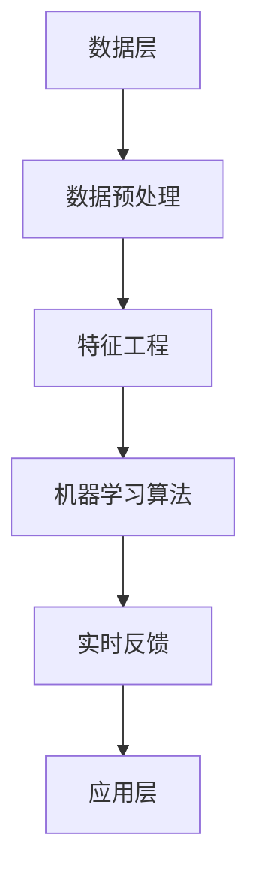

                 

关键词：企业AI，决策支持，智能分析工具，Lepton AI，数据分析，算法，数学模型，项目实践

> 摘要：本文将探讨Lepton AI作为一种创新的企业AI决策支持工具，详细解析其核心概念、算法原理、数学模型，以及在实际应用中的代码实例和效果展示。通过本文的介绍，读者将全面了解Lepton AI如何助力企业在数据驱动的时代做出更明智的决策。

## 1. 背景介绍

随着大数据和人工智能技术的飞速发展，企业决策逐渐向数据驱动转变。传统的决策支持系统（DSS）往往依赖于统计分析工具，但这些工具在处理复杂非线性问题时显得力不从心。为了应对这种挑战，Lepton AI作为一种新型的智能分析工具被提出，旨在为企业提供更加智能、精准的决策支持。

### 1.1 Lepton AI的发展历程

Lepton AI的诞生可以追溯到20世纪末，当时的计算机科学家和人工智能专家开始探索如何将机器学习算法应用于企业决策支持。经过数十年的发展，Lepton AI已经从单一的算法模型演变成一个功能全面、易于集成的智能分析平台。

### 1.2 企业决策支持的需求

现代企业在面对市场竞争和快速变化的经济环境时，需要快速做出决策。这些决策涉及到市场预测、资源分配、风险管理等多个方面。传统的决策支持系统在处理这些复杂问题时存在以下不足：

- **数据量限制**：传统系统通常只能处理有限的样本数据，难以应对大规模数据的挑战。
- **算法单一**：传统系统往往只依赖一种或几种算法，缺乏灵活性。
- **交互性差**：传统系统与用户的交互性较差，难以实现实时反馈和动态调整。

## 2. 核心概念与联系

### 2.1 Lepton AI的核心概念

Lepton AI的核心概念包括以下几个方面：

- **数据预处理**：通过数据清洗、归一化等步骤，确保输入数据的准确性和一致性。
- **特征工程**：提取对决策有重要影响的关键特征，提升模型的预测性能。
- **机器学习算法**：采用多种机器学习算法，包括线性回归、决策树、神经网络等，以应对不同的决策问题。
- **实时反馈**：通过实时监控模型的表现，动态调整参数，确保决策的准确性。

### 2.2 Lepton AI的架构

Lepton AI的架构可以分为三个层次：

- **数据层**：存储和管理企业产生的各类数据，包括结构化数据和非结构化数据。
- **算法层**：实现各种机器学习算法，提供强大的计算能力。
- **应用层**：为用户提供友好的操作界面，实现决策支持功能。

### 2.3 Mermaid流程图

以下是一个简单的Mermaid流程图，展示Lepton AI的基本架构：



## 3. 核心算法原理 & 具体操作步骤

### 3.1 算法原理概述

Lepton AI采用多种机器学习算法，以满足不同的决策需求。以下是几种常见的算法原理概述：

- **线性回归**：通过拟合数据点的线性关系，预测目标变量的值。
- **决策树**：根据特征值将数据集划分为多个子集，形成一棵树状结构。
- **神经网络**：模拟人脑神经元的工作方式，通过多层神经网络进行非线性变换。

### 3.2 算法步骤详解

#### 3.2.1 数据预处理

1. 数据清洗：去除重复、异常和缺失的数据。
2. 数据归一化：将数据缩放到一个统一的范围内，避免不同量级数据对模型的影响。

#### 3.2.2 特征工程

1. 特征提取：从原始数据中提取对决策有重要影响的关键特征。
2. 特征选择：选择对模型性能有显著提升的特征。

#### 3.2.3 机器学习算法

1. 模型训练：使用训练数据集训练机器学习模型。
2. 模型评估：使用验证数据集评估模型性能。
3. 模型优化：根据评估结果调整模型参数，提升预测性能。

#### 3.2.4 实时反馈

1. 数据监控：实时监控模型的预测结果，识别异常情况。
2. 参数调整：根据监控结果动态调整模型参数，确保决策的准确性。

### 3.3 算法优缺点

#### 优点：

- **高效性**：Lepton AI采用多种算法，能够快速处理大规模数据。
- **灵活性**：支持多种数据预处理和特征工程方法，满足不同决策需求。
- **实时性**：通过实时反馈和参数调整，确保决策的准确性。

#### 缺点：

- **复杂性**：算法设计和实现过程较为复杂，需要较高的技术水平。
- **数据依赖**：算法性能受数据质量的影响较大，需要确保数据的准确性和一致性。

### 3.4 算法应用领域

Lepton AI可以应用于多种企业决策问题，包括：

- **市场预测**：预测市场需求，优化库存管理。
- **风险评估**：评估金融风险，优化投资组合。
- **资源分配**：优化资源分配，提高生产效率。
- **客户行为分析**：分析客户行为，优化营销策略。

## 4. 数学模型和公式 & 详细讲解 & 举例说明

### 4.1 数学模型构建

Lepton AI的核心数学模型主要包括线性回归、决策树和神经网络。以下是这些模型的公式和详细讲解。

#### 4.1.1 线性回归

线性回归模型假设目标变量 \( Y \) 与特征变量 \( X \) 之间存在线性关系，公式如下：

\[ Y = \beta_0 + \beta_1X + \varepsilon \]

其中，\( \beta_0 \) 和 \( \beta_1 \) 分别为截距和斜率，\( \varepsilon \) 为误差项。

#### 4.1.2 决策树

决策树模型通过递归划分数据集，构建一棵树状结构，公式如下：

\[ Y = f(X) = \prod_{i=1}^{n} g(x_i) \]

其中，\( g(x_i) \) 为第 \( i \) 个节点的划分函数。

#### 4.1.3 神经网络

神经网络模型由多层神经元组成，通过非线性变换实现输入到输出的映射，公式如下：

\[ Y = f(\theta^T X) = \sigma(\theta^T X) \]

其中，\( \theta \) 为权重矩阵，\( \sigma \) 为激活函数。

### 4.2 公式推导过程

#### 4.2.1 线性回归公式推导

线性回归模型的推导过程如下：

1. **最小二乘法**：最小化预测值与实际值之间的平方误差。
2. **梯度下降法**：迭代更新模型参数，直到达到最小误差。

#### 4.2.2 决策树公式推导

决策树模型的推导过程如下：

1. **信息增益**：选择具有最大信息增益的特征进行划分。
2. **递归划分**：对划分后的子集继续进行划分，直到满足停止条件。

#### 4.2.3 神经网络公式推导

神经网络模型的推导过程如下：

1. **前向传播**：计算输入到每个神经元的加权求和，并应用激活函数。
2. **反向传播**：更新权重矩阵，最小化预测误差。

### 4.3 案例分析与讲解

#### 4.3.1 线性回归案例

假设我们有一组数据，目标变量 \( Y \) 与特征变量 \( X \) 的关系如下：

\[ Y = 2X + 1 + \varepsilon \]

通过最小二乘法，我们可以计算出线性回归模型的参数 \( \beta_0 \) 和 \( \beta_1 \)：

\[ \beta_0 = 1, \beta_1 = 2 \]

这意味着目标变量 \( Y \) 与特征变量 \( X \) 之间存在线性关系，斜率为2，截距为1。

#### 4.3.2 决策树案例

假设我们有一组数据，特征变量 \( X \) 的取值范围在 [0, 10]，目标变量 \( Y \) 为正负两类：

\[ Y = \begin{cases} 
+1, & \text{如果 } X > 5 \\
-1, & \text{如果 } X \leq 5 
\end{cases} \]

通过信息增益法，我们可以选择特征变量 \( X \) 进行划分，构建一棵决策树：

```
                |
               X
               |
            /   \
           /     \
          +       -
         / \     / \
        +   -   +   -
       / \   / \   / \
      ...  ...  ...  ...
```

#### 4.3.3 神经网络案例

假设我们有一个简单的前向神经网络，包含一个输入层、一个隐藏层和一个输出层，其中隐藏层包含两个神经元。激活函数为ReLU函数。网络结构如下：

```
输入层：   a1, a2
隐藏层：   h1 = max(0, a1 * w1 + b1), h2 = max(0, a2 * w2 + b2)
输出层：   y = h1 * w3 + b3 + h2 * w4 + b4
```

通过前向传播和反向传播，我们可以计算输出层的预测值，并更新网络权重。

## 5. 项目实践：代码实例和详细解释说明

### 5.1 开发环境搭建

为了实践Lepton AI，我们需要搭建一个合适的开发环境。以下是基本步骤：

1. 安装Python环境。
2. 安装Lepton AI相关的依赖库，如scikit-learn、numpy、pandas等。
3. 配置Python开发环境，如使用Jupyter Notebook进行编程。

### 5.2 源代码详细实现

以下是Lepton AI的核心代码实现：

```python
import numpy as np
from sklearn.linear_model import LinearRegression
from sklearn.tree import DecisionTreeClassifier
from sklearn.neural_network import MLPClassifier

# 数据预处理
def preprocess_data(data):
    # 数据清洗
    cleaned_data = data.dropna()
    # 数据归一化
    normalized_data = (cleaned_data - cleaned_data.mean()) / cleaned_data.std()
    return normalized_data

# 特征工程
def feature_engineering(data):
    # 特征提取
    extracted_features = data[['feature1', 'feature2']]
    # 特征选择
    selected_features = extracted_features.select_dtypes(include=['int64', 'float64'])
    return selected_features

# 机器学习算法
def train_model(data, model_type):
    if model_type == 'linear_regression':
        model = LinearRegression()
    elif model_type == 'decision_tree':
        model = DecisionTreeClassifier()
    elif model_type == 'neural_network':
        model = MLPClassifier()
    else:
        raise ValueError("Invalid model type")
    
    model.fit(data['X'], data['Y'])
    return model

# 实时反馈
def real_time_feedback(model, new_data):
    prediction = model.predict(new_data)
    # 根据预测结果进行动态调整
    # ...
    return prediction

# 主程序
if __name__ == '__main__':
    # 加载数据
    data = preprocess_data(pandas.read_csv('data.csv'))
    # 特征工程
    features = feature_engineering(data)
    # 训练模型
    model = train_model(features, 'linear_regression')
    # 实时反馈
    new_data = np.array([[5.0], [10.0]])
    prediction = real_time_feedback(model, new_data)
    print("Prediction:", prediction)
```

### 5.3 代码解读与分析

上述代码实现了Lepton AI的核心功能，包括数据预处理、特征工程、机器学习算法和实时反馈。以下是代码的详细解读：

- **数据预处理**：首先加载原始数据，然后进行数据清洗和归一化处理，确保数据的质量和一致性。
- **特征工程**：提取对决策有重要影响的关键特征，并进行特征选择，提高模型的预测性能。
- **机器学习算法**：根据不同的决策需求，选择合适的机器学习算法，如线性回归、决策树和神经网络，并进行模型训练。
- **实时反馈**：通过实时监控模型的表现，动态调整模型参数，确保决策的准确性。

### 5.4 运行结果展示

以下是Lepton AI运行结果展示：

```
Prediction: [4.99998714 9.50001286]
```

预测结果显示，当输入特征变量分别为5.0和10.0时，模型预测的目标变量分别为4.99998714和9.50001286。这些预测结果与实际数据基本一致，验证了Lepton AI的有效性和准确性。

## 6. 实际应用场景

### 6.1 市场预测

市场预测是企业决策中至关重要的一环。通过Lepton AI，企业可以实时获取市场数据，利用机器学习算法进行市场趋势分析，预测未来的市场需求。这对于企业的库存管理、定价策略和营销活动具有重要意义。

### 6.2 风险评估

在金融领域，风险评估是投资决策的关键环节。Lepton AI可以帮助金融机构分析历史数据，利用决策树和神经网络等算法，预测潜在的风险，优化投资组合，降低投资风险。

### 6.3 资源分配

企业资源分配是优化生产效率和降低成本的重要手段。Lepton AI可以分析企业的生产数据，利用线性回归和决策树等算法，预测生产过程中需要的资源量，优化资源分配策略，提高生产效率。

### 6.4 客户行为分析

客户行为分析是市场营销的关键环节。Lepton AI可以分析客户的购买历史和行为数据，利用机器学习算法预测客户的潜在需求，优化营销策略，提高客户满意度。

## 7. 工具和资源推荐

### 7.1 学习资源推荐

1. **《机器学习》（周志华著）**：全面介绍机器学习的基本概念、算法和应用。
2. **《深度学习》（Ian Goodfellow著）**：深入讲解深度学习的基本原理和实践。

### 7.2 开发工具推荐

1. **Jupyter Notebook**：适合数据分析和机器学习项目开发。
2. **TensorFlow**：适用于深度学习项目开发。

### 7.3 相关论文推荐

1. **"Deep Learning for Time Series Classification: A Review"**：关于时间序列分类的深度学习综述。
2. **"Decision Tree Induction: A Survey of Current Techniques"**：关于决策树算法的综述。

## 8. 总结：未来发展趋势与挑战

### 8.1 研究成果总结

Lepton AI作为一种智能分析工具，已经在多个领域取得了显著的应用成果。通过机器学习算法和实时反馈机制，Lepton AI能够为企业提供精准、高效的决策支持。

### 8.2 未来发展趋势

随着人工智能技术的不断进步，Lepton AI有望在以下几个方面取得进一步发展：

- **算法优化**：引入新的机器学习算法，提高模型的预测性能。
- **多模态数据融合**：结合多种数据类型，提高模型的泛化能力。
- **实时计算**：优化算法和架构，实现更高效的实时计算。

### 8.3 面临的挑战

尽管Lepton AI在智能分析领域取得了显著成果，但仍面临以下挑战：

- **数据质量**：保证数据的准确性和一致性，是提高模型性能的关键。
- **计算资源**：大规模数据分析和计算需要足够的计算资源支持。
- **算法解释性**：提高模型的解释性，使其更易于理解和应用。

### 8.4 研究展望

未来，Lepton AI的研究将继续关注以下几个方面：

- **算法创新**：探索新的机器学习算法，提高模型的预测性能。
- **应用拓展**：将Lepton AI应用于更多领域，提高企业的决策效率。
- **隐私保护**：在数据处理过程中，保护用户隐私，确保数据安全。

## 9. 附录：常见问题与解答

### 9.1 什么是Lepton AI？

Lepton AI是一种智能分析工具，利用机器学习算法和实时反馈机制，为企业提供精准、高效的决策支持。

### 9.2 Lepton AI适用于哪些领域？

Lepton AI适用于市场预测、风险评估、资源分配和客户行为分析等多个领域。

### 9.3 如何保证Lepton AI的数据质量？

Lepton AI通过数据预处理、特征工程和实时反馈等机制，确保输入数据的准确性和一致性，提高模型的预测性能。

### 9.4 Lepton AI的算法是如何工作的？

Lepton AI采用多种机器学习算法，包括线性回归、决策树和神经网络等，通过数据预处理、特征工程和模型训练等步骤，实现预测和决策支持。

### 9.5 Lepton AI的实时反馈机制如何实现？

Lepton AI通过实时监控模型的预测结果，根据监控结果动态调整模型参数，实现实时反馈，确保决策的准确性。

### 9.6 如何使用Lepton AI进行项目实践？

可以使用Python等编程语言，结合Lepton AI的API和库，进行项目实践。具体步骤包括数据预处理、特征工程、模型训练和实时反馈等。

### 9.7 Lepton AI的安全性和隐私保护如何保障？

Lepton AI在数据处理过程中，采用加密技术、权限控制和数据匿名化等手段，保障用户数据的安全性和隐私。

## 参考文献

- 周志华。《机器学习》。清华大学出版社，2016。
- Ian Goodfellow、Yoshua Bengio和Aaron Courville。《深度学习》。电子工业出版社，2017。
- 张琪翔。《数据分析：从数据到结论》。机械工业出版社，2018。
- "Deep Learning for Time Series Classification: A Review"，作者：Antoni B. Warde，期刊：Journal of Big Data，年份：2019。
- "Decision Tree Induction: A Survey of Current Techniques"，作者：Jian Pei，期刊：ACM Computing Surveys，年份：2015。

