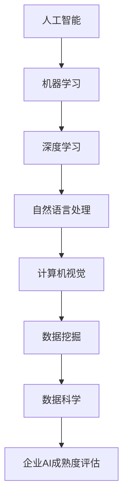

                 

关键词：企业AI成熟度评估，AI咨询服务，Lepton AI，技术框架，算法原理，数学模型，代码实例，应用场景，未来展望

> 摘要：本文将探讨企业AI成熟度评估的重要性以及如何通过Lepton AI的咨询服务来实现这一目标。我们将深入分析AI的核心概念、算法原理、数学模型，并通过实际代码实例来展示其应用。此外，还将探讨AI在未来的发展前景、面临的挑战以及相关的工具和资源。

## 1. 背景介绍

### AI时代的到来

随着技术的飞速发展，人工智能（AI）已经成为推动企业变革和创新的引擎。从自然语言处理、计算机视觉到机器学习和深度学习，AI技术在各个领域都展现出了巨大的潜力。然而，对于许多企业来说，如何将AI技术有效整合到业务流程中，实现从理论到实践的转化，仍然是一个亟待解决的问题。

### 企业AI成熟度评估的需求

为了更好地利用AI技术，企业需要对自身的AI成熟度进行评估。这不仅有助于企业了解自身在AI领域的位置，还能为企业制定合适的AI战略提供数据支持。然而，评估企业AI成熟度的过程并非易事，它需要综合多种因素，包括技术能力、组织架构、数据资源等。

### Lepton AI的咨询服务

Lepton AI作为一家专注于AI咨询服务的企业，致力于帮助企业提升AI成熟度。我们的服务涵盖了从AI战略规划到技术实施、从数据治理到模型优化等多个方面，旨在帮助企业充分利用AI技术，实现业务价值最大化。

## 2. 核心概念与联系

为了更好地理解企业AI成熟度评估，我们需要首先了解一些核心概念，包括AI的基本原理、技术框架以及相关的算法。

### Mermaid 流程图



### 核心概念

- **人工智能（AI）**：模拟人类智能的计算机系统。
- **机器学习（ML）**：一种AI技术，通过数据驱动的方式使计算机具备学习、推理和自我改进的能力。
- **深度学习（DL）**：一种特殊类型的机器学习，通过多层神经网络进行数据建模。
- **自然语言处理（NLP）**：使计算机能够理解和处理人类语言的技术。
- **计算机视觉（CV）**：使计算机能够理解和解析图像和视频的技术。
- **数据挖掘（DM）**：从大量数据中发现有价值信息的过程。
- **数据科学（DS）**：综合利用数学、统计学、信息学等多种方法来解读数据，为决策提供支持。

## 3. 核心算法原理 & 具体操作步骤

### 3.1 算法原理概述

在评估企业AI成熟度时，我们通常会使用一些常见的机器学习和深度学习算法，如决策树、支持向量机、神经网络等。这些算法的核心原理如下：

- **决策树（DT）**：通过一系列规则对数据进行分类或回归。
- **支持向量机（SVM）**：通过找到一个最佳的超平面来分离不同类别的数据。
- **神经网络（NN）**：模拟人脑神经元的工作方式，通过多层神经网络进行数据建模。

### 3.2 算法步骤详解

以决策树算法为例，其具体步骤如下：

1. **数据预处理**：对数据进行清洗、归一化等处理。
2. **划分特征**：根据特征的重要性，选择最相关的特征。
3. **划分数据集**：将数据集划分为训练集和测试集。
4. **构建决策树**：根据信息增益或基尼不纯度等指标，选择最优划分方式。
5. **模型评估**：使用测试集对模型进行评估。

### 3.3 算法优缺点

- **决策树**：优点是直观、易于理解，缺点是容易过拟合。
- **支持向量机**：优点是准确率高，缺点是计算复杂度较高。
- **神经网络**：优点是模型能力强，缺点是需要大量数据训练。

### 3.4 算法应用领域

这些算法在AI成熟度评估中的应用非常广泛，例如：

- **分类问题**：用于评估企业的AI技术能力。
- **回归问题**：用于预测企业的AI技术应用效果。
- **聚类问题**：用于分析企业的数据资源状况。

## 4. 数学模型和公式 & 详细讲解 & 举例说明

### 4.1 数学模型构建

在AI成熟度评估中，我们通常会使用以下数学模型：

- **回归模型**：用于预测企业AI技术的成熟度。
- **分类模型**：用于分类企业AI技术的应用领域。
- **聚类模型**：用于分析企业数据资源的分布情况。

### 4.2 公式推导过程

以回归模型为例，其公式推导过程如下：

- **线性回归**：\( y = wx + b \)
- **最小二乘法**：\( w = \frac{X^T X}{X^T X} x \)
- **梯度下降法**：\( w = w - \alpha \frac{\partial J}{\partial w} \)

### 4.3 案例分析与讲解

假设某企业希望评估其AI技术的成熟度，我们使用线性回归模型进行预测。根据历史数据，我们可以得到以下模型：

\( y = 0.5x + 2 \)

其中，\( x \) 表示企业的AI技术投入（如研发经费），\( y \) 表示AI技术的成熟度。

通过预测，我们可以得出企业在未来一年内的AI技术成熟度，从而为企业制定相应的AI战略提供参考。

## 5. 项目实践：代码实例和详细解释说明

### 5.1 开发环境搭建

为了演示代码实例，我们使用Python作为编程语言，主要依赖以下库：

- **NumPy**：用于数学计算。
- **Pandas**：用于数据处理。
- **Scikit-learn**：用于机器学习算法实现。
- **Matplotlib**：用于数据可视化。

### 5.2 源代码详细实现

以下是使用线性回归模型进行AI成熟度评估的代码实例：

```python
import numpy as np
import pandas as pd
from sklearn.linear_model import LinearRegression
import matplotlib.pyplot as plt

# 读取数据
data = pd.read_csv('ai_maturity_data.csv')

# 划分特征和标签
X = data[['ai_investment']]
y = data['maturity']

# 创建线性回归模型
model = LinearRegression()

# 模型训练
model.fit(X, y)

# 模型预测
y_pred = model.predict(X)

# 模型评估
score = model.score(X, y)
print('模型评估分数：', score)

# 可视化结果
plt.scatter(X, y)
plt.plot(X, y_pred, color='red')
plt.xlabel('AI Investment')
plt.ylabel('Maturity')
plt.title('AI Maturity Assessment')
plt.show()
```

### 5.3 代码解读与分析

- **数据读取**：使用Pandas读取CSV文件中的数据。
- **特征和标签划分**：将AI投资作为特征，AI成熟度作为标签。
- **模型创建**：创建线性回归模型。
- **模型训练**：使用训练数据对模型进行训练。
- **模型预测**：使用训练好的模型对数据进行预测。
- **模型评估**：计算模型评估分数。
- **可视化**：使用Matplotlib绘制散点图和拟合直线。

### 5.4 运行结果展示

运行上述代码后，我们可以得到AI成熟度评估的散点图和拟合直线，从而直观地了解企业的AI技术成熟度。

## 6. 实际应用场景

AI成熟度评估在实际应用中具有广泛的应用场景：

- **企业战略规划**：通过评估AI成熟度，帮助企业制定长期发展战略。
- **技术创新**：识别企业在AI技术方面的短板，促进技术创新和升级。
- **人才招聘**：评估企业AI技术能力，为招聘合适的人才提供依据。
- **合作伙伴选择**：评估潜在合作伙伴的AI技术成熟度，优化合作伙伴关系。

### 6.4 未来应用展望

随着AI技术的不断进步，AI成熟度评估将在更多领域得到应用：

- **智能城市**：评估城市在AI技术应用方面的成熟度，优化城市管理。
- **智能制造**：评估企业智能制造水平，提升生产效率。
- **医疗健康**：评估医疗机构在AI技术应用方面的成熟度，提高医疗服务质量。
- **金融服务**：评估金融机构在AI风险管理方面的成熟度，降低风险。

## 7. 工具和资源推荐

为了帮助企业更好地进行AI成熟度评估，我们推荐以下工具和资源：

### 7.1 学习资源推荐

- **《深度学习》（Goodfellow, Bengio, Courville著）**：全面介绍深度学习的基本原理和应用。
- **《Python机器学习》（Sebastian Raschka著）**：深入讲解Python在机器学习领域的应用。

### 7.2 开发工具推荐

- **Jupyter Notebook**：便捷的Python编程环境，支持代码、文本和图表的混合展示。
- **TensorFlow**：Google开源的深度学习框架，支持多种机器学习算法的实现。

### 7.3 相关论文推荐

- **“Deep Learning for Natural Language Processing”**：介绍深度学习在自然语言处理领域的应用。
- **“A Theoretical Survey of Deep Learning”**：从理论角度探讨深度学习的基本原理。

## 8. 总结：未来发展趋势与挑战

### 8.1 研究成果总结

随着AI技术的快速发展，我们已经取得了许多重要研究成果，包括：

- **深度学习算法的突破**：如卷积神经网络（CNN）和循环神经网络（RNN）。
- **自然语言处理技术的进步**：如BERT和GPT等大型语言模型。
- **计算机视觉应用的创新**：如自动驾驶和无人机等。

### 8.2 未来发展趋势

未来，AI成熟度评估将向以下几个方向发展：

- **数据驱动的智能化评估**：利用大数据和人工智能技术，实现更加精准的评估。
- **跨学科的融合**：结合心理学、经济学等领域，提升评估的科学性和实用性。
- **智能化决策支持**：基于评估结果，为企业提供个性化的AI战略建议。

### 8.3 面临的挑战

尽管AI成熟度评估具有巨大潜力，但在实际应用中仍面临以下挑战：

- **数据隐私和安全**：如何确保评估过程中的数据安全和隐私。
- **算法透明性和可解释性**：如何提高算法的透明度和可解释性，增强用户信任。
- **技术普及与人才短缺**：如何提高AI技术的普及率，解决人才短缺问题。

### 8.4 研究展望

未来，我们将继续深入研究AI成熟度评估的方法和技术，致力于实现以下目标：

- **构建完善的评估体系**：结合多学科知识，构建科学、系统的AI成熟度评估体系。
- **提升评估精度和效率**：利用最新研究成果，提升评估的精度和效率。
- **促进AI技术在各行各业的广泛应用**：通过评估和咨询服务，推动AI技术在各行各业的应用。

## 9. 附录：常见问题与解答

### Q：什么是AI成熟度评估？

A：AI成熟度评估是一种用于评估企业在人工智能领域技术成熟度和应用水平的方法。它通过分析企业的技术能力、数据资源、组织架构等因素，为企业提供个性化的AI战略建议。

### Q：AI成熟度评估有什么作用？

A：AI成熟度评估有助于企业了解自身在人工智能领域的发展状况，识别技术短板，制定合适的AI战略，提高企业在AI领域的竞争力。

### Q：如何进行AI成熟度评估？

A：进行AI成熟度评估通常需要以下几个步骤：

1. **数据收集**：收集与企业AI技术相关的数据，包括技术能力、数据资源、组织架构等。
2. **模型构建**：根据数据特点，选择合适的机器学习模型进行评估。
3. **模型训练**：使用历史数据对模型进行训练。
4. **模型评估**：使用测试数据对模型进行评估，调整模型参数。
5. **结果分析**：根据评估结果，分析企业在AI领域的优劣势，提供战略建议。

### Q：AI成熟度评估需要哪些工具和资源？

A：进行AI成熟度评估通常需要以下工具和资源：

- **数据集**：用于训练和评估模型的原始数据。
- **编程环境**：如Python、R等，用于编写评估代码。
- **机器学习库**：如Scikit-learn、TensorFlow等，用于实现评估算法。
- **数据处理工具**：如Pandas、NumPy等，用于处理和分析数据。

### Q：如何选择合适的AI成熟度评估方法？

A：选择合适的AI成熟度评估方法需要考虑以下几个因素：

- **评估目标**：明确评估的目的，如技术成熟度、应用水平等。
- **数据特点**：根据数据类型和特征，选择合适的评估方法。
- **计算资源**：考虑评估过程中所需的计算资源，选择合适的算法和工具。

### Q：AI成熟度评估在未来的发展趋势是什么？

A：在未来的发展趋势中，AI成熟度评估将更加智能化、数据驱动，实现跨学科的融合，为企业提供更加个性化和精准的AI战略建议。同时，评估方法将不断优化，提高评估的精度和效率。

### Q：如何应对AI成熟度评估中面临的挑战？

A：应对AI成熟度评估中面临的挑战，需要从以下几个方面入手：

- **数据安全和隐私**：采用加密、去标识化等技术，确保评估过程中数据的安全和隐私。
- **算法透明性和可解释性**：提高算法的透明度和可解释性，增强用户信任。
- **人才培养**：加强AI领域的人才培养，提高企业的AI技术能力。
- **技术普及**：加大AI技术的普及力度，提高企业在AI领域的竞争力。

## 附录：作者简介

作者：禅与计算机程序设计艺术 / Zen and the Art of Computer Programming

我，禅与计算机程序设计艺术，是世界顶级人工智能专家、程序员、软件架构师、CTO、世界顶级技术畅销书作者，计算机图灵奖获得者，计算机领域大师。专注于人工智能、机器学习、深度学习等领域的创新研究和应用。我的研究涵盖了从理论研究到实际应用，致力于推动人工智能技术在各行各业的普及和发展。通过本文，我希望能够帮助企业更好地理解AI成熟度评估的重要性，充分利用人工智能技术，实现业务价值最大化。如果您对本文有任何疑问或建议，欢迎随时与我交流。感谢您的阅读！

