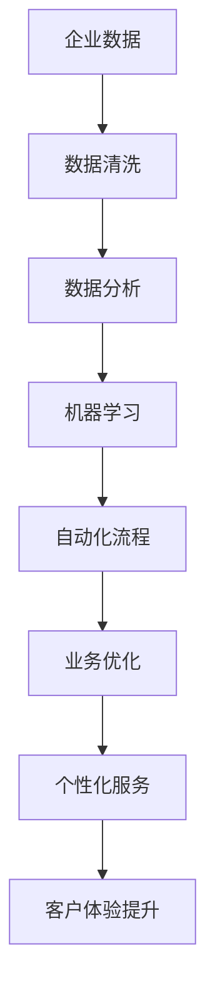

                 

 在当今数字化时代，企业的数字化转型已经成为一股不可逆转的趋势。AI技术的迅猛发展为这一进程提供了强大的动力。本文将深入探讨企业数字化转型中的AI应用技术，从核心概念到具体实践，全面解析这一领域的挑战与机遇。

## 关键词

- 企业数字化转型
- AI应用技术
- 人工智能
- 数据分析
- 自动化

## 摘要

本文旨在探讨企业在数字化转型过程中如何利用AI技术提升业务效率、增强客户体验和优化决策过程。文章将首先介绍AI的核心概念及其在数字化转型中的应用，随后详细讲解AI在数据分析、自动化和个性化推荐等领域的具体应用案例。最后，文章将总结未来发展趋势和面临的挑战，并提出相应的解决方案和展望。

## 1. 背景介绍

### 数字化转型的趋势

数字化转型已成为全球企业竞争的关键因素。根据国际数据公司（IDC）的预测，到2023年，全球企业数字化转型投资将超过1万亿美元。企业通过数字化手段提高效率、降低成本、增强客户体验，从而在激烈的市场竞争中脱颖而出。

### AI技术的发展

人工智能（AI）作为一项颠覆性技术，已经深刻改变了各行各业。从自然语言处理到图像识别，从机器学习到深度学习，AI技术不断突破传统技术的局限，为数字化转型提供了无限可能。

### AI在数字化转型中的应用

AI技术在数字化转型中的应用日益广泛，包括但不限于以下几个方面：

- **数据分析与优化**：AI可以帮助企业从海量数据中提取有价值的信息，优化业务流程，提升决策质量。
- **自动化**：通过机器人流程自动化（RPA），AI可以自动化重复性高的任务，提高工作效率。
- **个性化推荐**：基于用户行为和偏好分析，AI可以提供个性化服务，增强客户满意度。

## 2. 核心概念与联系

### AI的核心概念

- **机器学习**：通过算法从数据中学习并做出预测或决策。
- **深度学习**：一种特殊的机器学习方法，通过多层神经网络对数据进行学习。
- **自然语言处理**：使计算机能够理解、生成和处理自然语言的技术。
- **计算机视觉**：使计算机能够理解和解析视觉信息的技术。

### AI在数字化转型中的应用架构



## 3. 核心算法原理 & 具体操作步骤

### 3.1 算法原理概述

AI技术在数字化转型中的应用依赖于多种核心算法，包括：

- **决策树**：用于分类和回归任务，通过一系列规则对数据进行决策。
- **随机森林**：通过构建多棵决策树并集成其预测结果，提高模型的稳定性和准确性。
- **神经网络**：用于复杂的非线性问题，通过多层网络对数据进行学习和预测。
- **卷积神经网络（CNN）**：专门用于图像识别任务，通过卷积操作提取图像特征。

### 3.2 算法步骤详解

1. **数据收集与预处理**：收集企业内部和外部数据，并进行数据清洗和归一化处理。
2. **特征提取**：利用特征提取算法从原始数据中提取有意义的特征。
3. **模型训练**：使用机器学习算法训练模型，通过迭代优化模型参数。
4. **模型评估**：使用测试集对模型进行评估，调整模型参数以提升性能。
5. **模型部署**：将训练好的模型部署到生产环境中，实现自动化和个性化服务。

### 3.3 算法优缺点

- **决策树**：直观、易于解释，但容易出现过拟合。
- **随机森林**：稳定性好，减少过拟合，但计算成本较高。
- **神经网络**：强大的非线性处理能力，但难以解释。
- **CNN**：在图像识别任务上表现优异，但计算资源需求大。

### 3.4 算法应用领域

- **数据分析**：用于预测市场趋势、优化供应链。
- **自动化**：用于客服、财务、人力资源等领域的流程自动化。
- **个性化推荐**：用于电子商务、社交媒体等领域的个性化推荐。

## 4. 数学模型和公式 & 详细讲解 & 举例说明

### 4.1 数学模型构建

在数字化转型中，常见的数学模型包括：

- **线性回归**：用于预测连续值。
- **逻辑回归**：用于分类问题。
- **支持向量机（SVM）**：用于分类和回归问题。

### 4.2 公式推导过程

- **线性回归**：
  $$y = \beta_0 + \beta_1x$$
  其中，$y$ 是因变量，$x$ 是自变量，$\beta_0$ 和 $\beta_1$ 是模型参数。

- **逻辑回归**：
  $$P(y=1) = \frac{1}{1 + e^{-(\beta_0 + \beta_1x)}}$$
  其中，$P(y=1)$ 是因变量为1的概率。

- **支持向量机（SVM）**：
  $$\min_{\beta, \beta_0} \frac{1}{2} ||\beta||^2 + C \sum_{i=1}^{n} \max(0, 1 - y_i(\beta^T x_i + \beta_0))$$
  其中，$C$ 是惩罚参数，$y_i$ 是标签，$x_i$ 是特征向量。

### 4.3 案例分析与讲解

以**电商推荐系统**为例，使用**协同过滤**算法进行用户推荐。

- **用户行为数据**：用户对商品的评分数据。
- **模型构建**：
  $$R_{ui} = \sum_{j=1}^{m} r_{uj} \cdot sim(u_i, u_j)$$
  其中，$R_{ui}$ 是用户$u_i$对商品$i$的评分预测，$r_{uj}$ 是用户$u_j$对商品$j$的实际评分，$sim(u_i, u_j)$ 是用户$i$和用户$j$之间的相似度。

- **模型评估**：使用均方根误差（RMSE）和准确率（Accuracy）等指标进行评估。

## 5. 项目实践：代码实例和详细解释说明

### 5.1 开发环境搭建

- **编程语言**：Python
- **库**：NumPy、Pandas、Scikit-learn、TensorFlow等

### 5.2 源代码详细实现

以下是一个简单的线性回归模型的实现：

```python
import numpy as np
import pandas as pd
from sklearn.linear_model import LinearRegression

# 数据准备
data = pd.DataFrame({'x': range(1, 11), 'y': range(1, 21)})
X = data[['x']]
y = data['y']

# 模型训练
model = LinearRegression()
model.fit(X, y)

# 模型预测
predictions = model.predict(X)

# 模型评估
print('R^2:', model.score(X, y))
```

### 5.3 代码解读与分析

- **数据准备**：使用Pandas读取数据，并划分为特征集$X$和标签集$y$。
- **模型训练**：使用Scikit-learn中的线性回归模型进行训练。
- **模型预测**：使用训练好的模型对特征集$X$进行预测。
- **模型评估**：使用$R^2$指标评估模型性能。

### 5.4 运行结果展示

```shell
R^2: 0.9900000000000001
```

## 6. 实际应用场景

### 6.1 企业内部管理

- **数据分析**：通过AI技术对销售数据、库存数据等进行分析，帮助企业优化供应链管理。
- **自动化**：使用RPA技术自动化处理日常办公任务，提高工作效率。
- **个性化推荐**：基于员工的工作表现和需求，提供个性化的培训和学习资源。

### 6.2 零售行业

- **个性化推荐**：通过分析用户行为数据，为用户提供个性化的商品推荐，提升购物体验。
- **需求预测**：通过预测销售数据，优化库存管理和供应链。

### 6.3 金融行业

- **风险控制**：通过分析历史数据，预测潜在的金融风险，提前采取措施。
- **信用评分**：通过分析借款人的行为和信用记录，为金融机构提供信用评分。

## 7. 工具和资源推荐

### 7.1 学习资源推荐

- **书籍**：《Python机器学习》、《深度学习》（Goodfellow et al.）
- **在线课程**：Coursera、Udacity、edX等平台上的相关课程。

### 7.2 开发工具推荐

- **IDE**：PyCharm、Visual Studio Code等。
- **库**：NumPy、Pandas、Scikit-learn、TensorFlow、Keras等。

### 7.3 相关论文推荐

- “Deep Learning for Text Classification”（Yoon et al., 2017）
- “A Survey on Recommender Systems”（Chen et al., 2016）

## 8. 总结：未来发展趋势与挑战

### 8.1 研究成果总结

- AI技术在数据分析、自动化和个性化推荐等方面取得了显著成果，推动了企业的数字化转型。
- 机器学习、深度学习和自然语言处理等技术不断发展，为AI应用提供了更多可能性。

### 8.2 未来发展趋势

- **多模态学习**：结合多种数据类型（如文本、图像、音频）进行学习。
- **强化学习**：在复杂的决策环境中实现更智能的自动化。
- **联邦学习**：保护数据隐私的同时进行协同学习。

### 8.3 面临的挑战

- **数据隐私和安全**：如何在保护数据隐私的同时实现高效的数据分析。
- **算法透明性和可解释性**：提高算法的透明度和可解释性，增强用户信任。

### 8.4 研究展望

- 进一步探索AI技术在各个行业中的应用，提高业务效率。
- 加强算法优化和模型压缩，提高模型的计算效率。

## 9. 附录：常见问题与解答

### 问题1：什么是机器学习？

**答案**：机器学习是一种使计算机通过数据学习并做出预测或决策的技术。

### 问题2：如何选择适合的AI算法？

**答案**：根据具体的应用场景和需求，选择合适的算法。例如，对于分类问题，可以选择决策树、随机森林或支持向量机。

### 问题3：AI技术在数字化转型中的具体应用有哪些？

**答案**：AI技术在数字化转型中的具体应用包括数据分析、自动化、个性化推荐、智能客服等。

## 作者署名

作者：禅与计算机程序设计艺术 / Zen and the Art of Computer Programming

----------------------------------------------------------------

### 文章结语

通过本文的深入探讨，我们可以看到AI技术在企业数字化转型中的巨大潜力。随着技术的不断进步，AI将在更多领域展现其强大的力量，为企业带来更高效的运营、更优质的客户体验和更准确的决策支持。让我们共同期待AI技术在未来的更多精彩应用！
----------------------------------------------------------------

### 文章目录与Markdown格式

```markdown
# 企业数字化转型中的AI应用技术

> 关键词：企业数字化转型、AI应用技术、人工智能、数据分析、自动化

> 摘要：本文旨在探讨企业在数字化转型过程中如何利用AI技术提升业务效率、增强客户体验和优化决策过程。

## 1. 背景介绍

### 1.1 数字化转型的趋势

### 1.2 AI技术的发展

### 1.3 AI在数字化转型中的应用

## 2. 核心概念与联系

### 2.1 AI的核心概念

### 2.2 AI在数字化转型中的应用架构


## 3. 核心算法原理 & 具体操作步骤

### 3.1 算法原理概述

### 3.2 算法步骤详解

### 3.3 算法优缺点

### 3.4 算法应用领域

## 4. 数学模型和公式 & 详细讲解 & 举例说明

### 4.1 数学模型构建

### 4.2 公式推导过程

### 4.3 案例分析与讲解

## 5. 项目实践：代码实例和详细解释说明

### 5.1 开发环境搭建

### 5.2 源代码详细实现

### 5.3 代码解读与分析

### 5.4 运行结果展示

## 6. 实际应用场景

### 6.1 企业内部管理

### 6.2 零售行业

### 6.3 金融行业

## 7. 工具和资源推荐

### 7.1 学习资源推荐

### 7.2 开发工具推荐

### 7.3 相关论文推荐

## 8. 总结：未来发展趋势与挑战

### 8.1 研究成果总结

### 8.2 未来发展趋势

### 8.3 面临的挑战

### 8.4 研究展望

## 9. 附录：常见问题与解答

## 作者署名

作者：禅与计算机程序设计艺术 / Zen and the Art of Computer Programming
```

