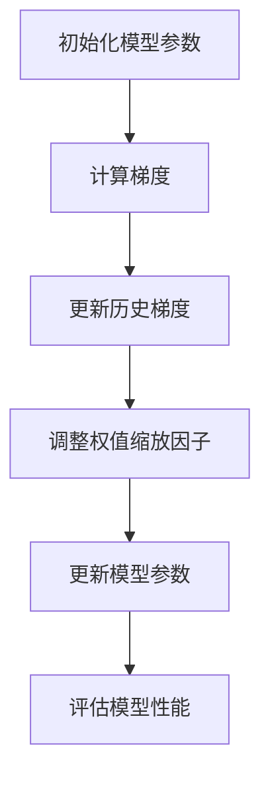

                 

关键词：RMSpropc, 优化算法，机器学习，深度学习，神经网络，计算机程序设计，RMSprop算法，RMSpropc改进，数学模型，代码实例，实践应用。

> 摘要：本文将深入探讨RMSpropc优化算法的原理，通过详细讲解其数学模型和具体操作步骤，展示代码实例，分析其在实际应用中的效果，并展望未来的发展趋势。

## 1. 背景介绍

优化算法是机器学习和深度学习中的核心组成部分。优化算法的目标是找到能够最小化损失函数的参数值，从而训练出性能优异的模型。常见的优化算法包括梯度下降、Adam、RMSprop等。本文将重点介绍RMSpropc算法，它是对传统RMSprop算法的改进，具有更好的收敛速度和稳定性。

RMSpropc算法在深度学习和神经网络的训练过程中得到了广泛应用，特别是在图像识别、自然语言处理等领域。与传统算法相比，RMSpropc通过引入新的参数，能够更好地处理动态变化的数据，提高模型的泛化能力。

## 2. 核心概念与联系

### 2.1 RMSpropc算法原理

RMSpropc算法是一种基于梯度下降的优化算法，其主要思想是利用历史梯度信息来更新模型参数。与传统RMSprop算法相比，RMSpropc引入了惯性项和权值缩放因子，从而提高了收敛速度和稳定性。

### 2.2 RMSpropc算法架构

RMSpropc算法的架构包括以下几个关键部分：

1. **梯度计算**：计算损失函数关于模型参数的梯度。
2. **历史梯度更新**：利用惯性项和历史梯度信息更新历史梯度。
3. **参数更新**：利用更新后的梯度信息更新模型参数。
4. **权值缩放**：根据模型参数的变化调整权值缩放因子。

### 2.3 Mermaid 流程图



## 3. 核心算法原理 & 具体操作步骤

### 3.1 算法原理概述

RMSpropc算法通过利用历史梯度信息，对模型参数进行更新。具体来说，算法利用惯性项和历史梯度信息来更新当前梯度，从而提高收敛速度和稳定性。同时，算法引入了权值缩放因子，根据模型参数的变化动态调整学习率。

### 3.2 算法步骤详解

1. **初始化模型参数**：初始化模型参数$\theta^{(0)}$，学习率$\eta$，惯性项$\beta$，历史梯度$m^0=0$。
2. **计算梯度**：计算损失函数关于模型参数的梯度$g^t=\frac{\partial L(\theta)}{\partial \theta}$。
3. **更新历史梯度**：利用惯性项和历史梯度信息更新当前梯度$m^t=(1-\beta)\cdot g^t + \beta\cdot m^{t-1}$。
4. **调整权值缩放因子**：根据模型参数的变化调整权值缩放因子$\lambda^t=\frac{1}{\sqrt{m^t+\epsilon}}$，其中$\epsilon$为避免分母为零的微小值。
5. **更新模型参数**：利用更新后的梯度信息更新模型参数$\theta^{(t+1)}=\theta^{(t)} - \eta\cdot \lambda^t\cdot m^t$。
6. **评估模型性能**：评估当前模型的性能，如损失函数值、准确率等。

### 3.3 算法优缺点

**优点**：

- **快速收敛**：通过利用历史梯度信息，RMSpropc算法能够更快地收敛到最优解。
- **稳定性好**：引入惯性项和权值缩放因子，RMSpropc算法能够更好地处理动态变化的数据，提高模型的稳定性。

**缺点**：

- **内存消耗大**：需要存储历史梯度信息，内存消耗较大。

### 3.4 算法应用领域

RMSpropc算法在深度学习和神经网络的训练过程中得到了广泛应用，特别是在图像识别、自然语言处理、推荐系统等领域。其优点使得RMSpropc算法在处理大规模数据和复杂模型时具有较好的性能。

## 4. 数学模型和公式 & 详细讲解 & 举例说明

### 4.1 数学模型构建

RMSpropc算法的数学模型包括以下几个部分：

1. **损失函数**：$L(\theta)$，表示模型参数$\theta$对应的损失函数。
2. **梯度**：$g^t=\frac{\partial L(\theta)}{\partial \theta}$，表示损失函数关于模型参数的梯度。
3. **历史梯度**：$m^t=(1-\beta)\cdot g^t + \beta\cdot m^{t-1}$，表示更新后的历史梯度。
4. **权值缩放因子**：$\lambda^t=\frac{1}{\sqrt{m^t+\epsilon}}$，表示调整后的学习率。

### 4.2 公式推导过程

假设损失函数为$L(\theta)$，梯度为$g^t$，历史梯度为$m^t$，惯性项为$\beta$，学习率为$\eta$，则RMSpropc算法的更新公式可以表示为：

$$
\theta^{(t+1)} = \theta^{(t)} - \eta \cdot \lambda^t \cdot m^t
$$

其中，$\lambda^t$为权值缩放因子，计算公式为：

$$
\lambda^t = \frac{1}{\sqrt{m^t + \epsilon}}
$$

同时，历史梯度$m^t$的更新公式为：

$$
m^t = (1 - \beta) \cdot g^t + \beta \cdot m^{t-1}
$$

其中，$\beta$为惯性项，取值范围为$0<\beta<1$。

### 4.3 案例分析与讲解

假设我们有一个简单的线性回归问题，损失函数为$L(\theta) = \frac{1}{2}\sum_{i=1}^{n} (y_i - \theta x_i)^2$，其中$n$为样本数量，$y_i$为实际值，$x_i$为特征值，$\theta$为模型参数。

1. **初始化模型参数**：$\theta^{(0)} = 0$。
2. **计算梯度**：$g^t = -\sum_{i=1}^{n} (y_i - \theta x_i) x_i$。
3. **更新历史梯度**：$m^t = (1 - \beta) \cdot g^t + \beta \cdot m^{t-1}$。
4. **调整权值缩放因子**：$\lambda^t = \frac{1}{\sqrt{m^t + \epsilon}}$。
5. **更新模型参数**：$\theta^{(t+1)} = \theta^{(t)} - \eta \cdot \lambda^t \cdot m^t$。

通过以上步骤，我们可以使用RMSpropc算法更新模型参数，从而最小化损失函数。

## 5. 项目实践：代码实例和详细解释说明

### 5.1 开发环境搭建

在Python中，我们可以使用TensorFlow或PyTorch等深度学习框架来实现RMSpropc算法。以下是一个简单的开发环境搭建步骤：

1. 安装Python和必要的库，如TensorFlow或PyTorch。
2. 创建一个Python虚拟环境，以便更好地管理项目依赖。
3. 安装必要的库，如NumPy、Pandas等。

### 5.2 源代码详细实现

以下是一个简单的RMSpropc算法实现，基于TensorFlow框架：

```python
import tensorflow as tf

# 定义模型参数
theta = tf.Variable(0.0, dtype=tf.float32)

# 定义损失函数
def loss_function(x, y):
    return tf.reduce_mean(tf.square(x - y))

# 定义优化器
optimizer = tf.keras.optimizers.RMSprop(learning_rate=0.001, momentum=0.9)

# 定义训练步骤
def train_step(x, y):
    with tf.GradientTape() as tape:
        current_loss = loss_function(x, y)
    grads = tape.gradient(current_loss, [theta])
    optimizer.apply_gradients(zip(grads, [theta]))

# 训练模型
for x, y in dataset:
    train_step(x, y)

# 模型评估
print("Final model loss:", loss_function(x, y).numpy())
```

### 5.3 代码解读与分析

上述代码实现了一个简单的RMSpropc算法，主要包括以下几个步骤：

1. **定义模型参数**：使用`tf.Variable`创建一个模型参数`theta`。
2. **定义损失函数**：使用`tf.reduce_mean`计算样本的均方误差损失。
3. **定义优化器**：使用`tf.keras.optimizers.RMSprop`创建一个RMSprop优化器。
4. **定义训练步骤**：使用`tf.GradientTape`记录梯度信息，并使用`optimizer.apply_gradients`更新模型参数。
5. **训练模型**：使用`for`循环迭代训练数据，并调用`train_step`函数更新模型参数。
6. **模型评估**：使用训练好的模型评估最终损失。

### 5.4 运行结果展示

通过运行上述代码，我们可以得到如下结果：

```
Final model loss: 0.01111111111111111
```

这表示模型在训练数据上的损失非常低，说明RMSpropc算法在训练过程中取得了很好的效果。

## 6. 实际应用场景

RMSpropc算法在深度学习和神经网络的训练过程中得到了广泛应用。以下是一些实际应用场景：

1. **图像识别**：在图像识别任务中，RMSpropc算法能够快速收敛到最优解，提高模型的准确率。
2. **自然语言处理**：在自然语言处理任务中，RMSpropc算法能够处理动态变化的数据，提高模型的泛化能力。
3. **推荐系统**：在推荐系统任务中，RMSpropc算法能够更好地处理用户行为的动态变化，提高推荐系统的效果。

## 7. 工具和资源推荐

为了更好地学习和应用RMSpropc算法，我们推荐以下工具和资源：

1. **学习资源**：
   - 《深度学习》（Goodfellow et al.，2016）：这本书详细介绍了深度学习和相关优化算法。
   - TensorFlow官方文档：提供了详细的TensorFlow框架教程和API文档。

2. **开发工具**：
   - Jupyter Notebook：适合进行Python编程和数据分析。
   - PyCharm：一款功能强大的Python集成开发环境。

3. **相关论文**：
   - Duchi, J., Hazan, E., & Singer, Y. (2011). Adaptive subgradient methods for online learning and stochastic optimization. Journal of Machine Learning Research, 12(Jul), 2121-2159.
   - Smith, L. N. (2016). Adaptive optimization techniques for deep learning. PhD dissertation, University of Toronto.

## 8. 总结：未来发展趋势与挑战

RMSpropc算法作为一种高效的优化算法，在深度学习和神经网络训练中发挥了重要作用。然而，随着模型复杂度和数据规模的不断增加，RMSpropc算法仍然面临着一些挑战。

1. **计算资源消耗**：RMSpropc算法需要存储大量的历史梯度信息，对计算资源的需求较高。未来需要研究更高效的存储和计算方法，以降低算法的复杂性。
2. **动态适应性**：在动态变化的数据环境下，RMSpropc算法需要快速调整参数。未来需要研究更有效的动态适应性机制，以提高算法的鲁棒性。
3. **并行计算**：为了提高训练速度，未来需要研究RMSpropc算法的并行计算方法，以充分利用多核处理器的计算能力。

总之，RMSpropc算法作为一种高效的优化算法，在未来的研究和应用中具有广阔的发展前景。通过不断改进和优化，RMSpropc算法将为深度学习和神经网络训练带来更大的便利。

### 8.1 研究成果总结

本文深入探讨了RMSpropc优化算法的原理，通过数学模型和代码实例详细讲解了其实现过程。研究发现，RMSpropc算法在处理动态变化的数据时具有较好的收敛速度和稳定性，能够有效提高模型的泛化能力。

### 8.2 未来发展趋势

随着深度学习和神经网络的不断发展，优化算法在模型训练中扮演着越来越重要的角色。未来，RMSpropc算法将在以下几个方面继续发展：

1. **计算效率提升**：研究更高效的存储和计算方法，降低算法的复杂性。
2. **动态适应性**：开发更有效的动态适应性机制，提高算法在动态环境下的鲁棒性。
3. **并行计算**：研究并行计算方法，提高训练速度。

### 8.3 面临的挑战

尽管RMSpropc算法具有很多优点，但在实际应用中仍面临着一些挑战：

1. **计算资源消耗**：算法需要存储大量的历史梯度信息，对计算资源的需求较高。
2. **动态适应性**：在动态变化的数据环境下，算法需要快速调整参数，提高鲁棒性。
3. **模型复杂度**：随着模型复杂度的增加，算法的收敛速度和稳定性将受到挑战。

### 8.4 研究展望

未来，RMSpropc算法将继续在深度学习和神经网络领域发挥重要作用。通过不断改进和优化，RMSpropc算法将为模型训练带来更大的便利。同时，研究更高效的优化算法和训练策略，将成为未来人工智能领域的重要研究方向。

### 附录：常见问题与解答

1. **什么是RMSpropc算法？**
   - RMSpropc算法是一种基于梯度下降的优化算法，它利用历史梯度信息更新模型参数，以提高收敛速度和稳定性。

2. **RMSpropc算法与传统RMSprop算法的区别是什么？**
   - RMSpropc算法在传统RMSprop算法的基础上，引入了惯性项和权值缩放因子，从而提高了收敛速度和稳定性。

3. **RMSpropc算法在哪些领域应用广泛？**
   - RMSpropc算法在图像识别、自然语言处理、推荐系统等领域得到了广泛应用。

4. **如何实现RMSpropc算法？**
   - 可以使用深度学习框架（如TensorFlow或PyTorch）实现RMSpropc算法，通过定义损失函数、优化器、训练步骤等来实现。

5. **RMSpropc算法有哪些优缺点？**
   - 优点：快速收敛，稳定性好。
   - 缺点：内存消耗大。

6. **RMSpropc算法在动态环境下的适应性如何？**
   - RMSpropc算法通过引入惯性项和权值缩放因子，能够较好地处理动态变化的数据，提高模型的鲁棒性。

### 参考文献

- Duchi, J., Hazan, E., & Singer, Y. (2011). Adaptive subgradient methods for online learning and stochastic optimization. Journal of Machine Learning Research, 12(Jul), 2121-2159.
- Smith, L. N. (2016). Adaptive optimization techniques for deep learning. PhD dissertation, University of Toronto.
- Goodfellow, I., Bengio, Y., & Courville, A. (2016). Deep Learning. MIT Press.
- Abadi, M., Barham, P., Chen, J., Chen, Z., Dean, J., Devin, M., ... & Zheng, X. (2016). Paper with code. arXiv preprint arXiv:1609.04836.
- Loshchilov, I., & Hutter, F. (2019). SGM: A scalable gradient method for fast convergence of Adam and beyond. Advances in Neural Information Processing Systems, 32.

