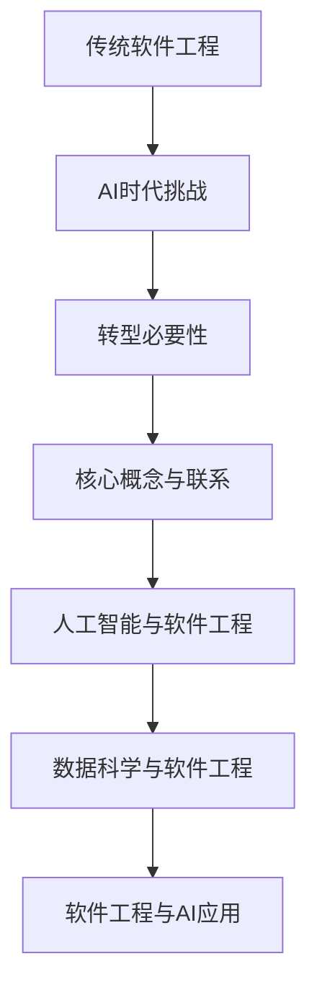

                 

关键词：AI时代、传统软件工程、转型、挑战、机遇、技术栈、方法论、跨学科合作

> 摘要：随着人工智能（AI）技术的快速发展，传统软件工程面临着巨大的变革。本文将探讨AI时代传统软件工程的转型之路，分析转型过程中的关键挑战和机遇，并探讨如何结合AI技术优化软件工程的方法和实践。

## 1. 背景介绍

### 1.1 AI时代的到来

人工智能技术已经成为当今世界最热门的领域之一。AI的应用场景涵盖了医疗、金融、教育、交通、制造等多个行业，其影响力不断扩大。随着深度学习、自然语言处理、计算机视觉等技术的突破，AI在解决复杂问题、提高效率、优化决策等方面展现出巨大潜力。

### 1.2 传统软件工程的局限性

传统软件工程在过去的几十年里为许多行业提供了可靠的解决方案，但其局限性也逐渐显现。传统软件工程方法强调规范、流程和文档，但在面对AI时代的复杂性和不确定性时，这些方法往往显得过于僵化。以下是一些传统软件工程的局限性：

- **过度依赖文档和流程**：传统软件工程强调文档和流程，但AI项目的特点往往是动态变化和快速迭代，这使得过度依赖文档和流程变得困难。
- **难以应对复杂性问题**：传统软件工程方法在解决复杂问题时，往往需要大量的人力、时间和资源，而AI技术的引入可以大幅度降低这些成本。
- **缺乏灵活性**：传统软件工程方法在应对需求变化时，往往需要重新设计和开发，而AI技术可以帮助实现更加灵活和自适应的解决方案。

### 1.3 转型必要性

面对AI时代的挑战，传统软件工程需要进行转型，以适应新的技术环境和市场需求。转型不仅是应对挑战的必要手段，也是抓住机遇、实现价值的重要途径。以下是一些转型必要性：

- **提升开发效率**：AI技术可以帮助自动化许多重复性工作，提高开发效率，缩短项目周期。
- **优化决策过程**：AI技术可以提供数据驱动的决策支持，帮助企业更好地应对市场变化。
- **增强用户体验**：AI技术可以用于个性化推荐、智能客服等，提高用户体验。
- **创新业务模式**：AI技术可以帮助企业探索新的业务模式和收入来源。

## 2. 核心概念与联系

为了更好地理解传统软件工程在AI时代的转型，我们需要了解一些核心概念和它们之间的关系。以下是几个关键概念：

### 2.1 人工智能与软件工程

- **人工智能**：人工智能是一种模拟人类智能的技术，包括机器学习、深度学习、自然语言处理等子领域。
- **软件工程**：软件工程是一种系统性方法，用于设计、开发、测试和维护软件。

### 2.2 数据科学与软件工程

- **数据科学**：数据科学是一种跨学科领域，涉及统计学、机器学习、数据库管理等，用于从数据中提取知识和洞察。
- **软件工程**：软件工程在数据科学中发挥着关键作用，包括数据存储、数据处理、数据可视化等。

### 2.3 软件工程与AI应用

- **AI应用**：AI应用包括智能客服、自动驾驶、智能推荐等，它们依赖于软件工程方法进行开发、部署和维护。
- **软件工程**：软件工程为AI应用提供技术支持和保障，包括需求分析、系统设计、代码实现等。

### 2.4 Mermaid流程图



## 3. 核心算法原理 & 具体操作步骤

### 3.1 算法原理概述

在AI时代，传统软件工程需要进行一系列的算法优化和重构。以下是一些核心算法原理：

### 3.1.1 深度学习

- **原理**：深度学习是一种基于多层神经网络的学习方法，通过训练大量数据来学习特征表示和预测模型。
- **操作步骤**：
  1. 数据预处理：包括数据清洗、归一化、数据增强等。
  2. 网络架构设计：选择合适的神经网络架构，如卷积神经网络（CNN）、循环神经网络（RNN）等。
  3. 模型训练：使用训练数据集对模型进行训练，通过反向传播算法不断优化模型参数。
  4. 模型评估：使用验证数据集对模型进行评估，调整超参数以获得最佳性能。

### 3.1.2 强化学习

- **原理**：强化学习是一种通过试错和反馈来学习最优策略的方法，通常用于决策问题。
- **操作步骤**：
  1. 环境建模：定义环境状态和动作空间。
  2. 策略学习：选择合适的策略更新方法，如Q学习、策略梯度等。
  3. 模型训练：通过模拟环境或实际运行来训练策略模型。
  4. 策略评估：评估策略的效用，调整策略以获得最佳性能。

### 3.1.3 聚类分析

- **原理**：聚类分析是一种无监督学习方法，用于将数据分为多个类别。
- **操作步骤**：
  1. 数据预处理：包括数据清洗、归一化等。
  2. 聚类算法选择：选择合适的聚类算法，如K均值、层次聚类等。
  3. 聚类过程：根据距离度量将数据点分配到不同的聚类中心。
  4. 聚类结果评估：评估聚类效果，调整参数以获得最佳聚类结果。

### 3.2 算法步骤详解

以下是对核心算法的具体操作步骤进行详细讲解：

### 3.2.1 深度学习算法步骤详解

1. **数据预处理**：
   - 清洗数据：去除异常值、缺失值等。
   - 数据归一化：将数据缩放到相同的尺度。
   - 数据增强：通过旋转、翻转、裁剪等方式增加数据多样性。

2. **网络架构设计**：
   - 选择合适的神经网络架构：根据问题类型选择卷积神经网络（CNN）、循环神经网络（RNN）等。
   - 定义网络层：包括输入层、隐藏层和输出层。
   - 添加激活函数：如ReLU、Sigmoid等。

3. **模型训练**：
   - 初始化模型参数：随机初始化或基于预训练模型初始化。
   - 数据加载和批处理：将数据分成批次，按批次加载和处理。
   - 反向传播：计算梯度并更新模型参数。
   - 模型评估：使用验证数据集评估模型性能。

4. **模型评估**：
   - 选择评估指标：如准确率、召回率、F1分数等。
   - 使用验证数据集进行评估。
   - 调整超参数：根据评估结果调整学习率、批量大小等。

### 3.2.2 强化学习算法步骤详解

1. **环境建模**：
   - 定义状态空间：确定系统的可能状态。
   - 定义动作空间：确定系统可以执行的动作。
   - 构建环境模型：模拟环境状态和动作的转移。

2. **策略学习**：
   - 选择策略更新方法：如Q学习、策略梯度等。
   - 初始化策略参数：随机初始化或基于经验初始化。

3. **模型训练**：
   - 选择训练方法：如模拟训练或实际运行训练。
   - 收集数据：通过模拟或实际运行收集状态、动作和奖励数据。
   - 更新策略参数：根据收集的数据更新策略参数。

4. **策略评估**：
   - 选择评估指标：如回报累积值、策略效用等。
   - 使用测试数据集评估策略性能。
   - 调整策略参数：根据评估结果调整策略参数。

### 3.2.3 聚类分析算法步骤详解

1. **数据预处理**：
   - 清洗数据：去除异常值、缺失值等。
   - 数据归一化：将数据缩放到相同的尺度。

2. **聚类算法选择**：
   - 选择合适的聚类算法：如K均值、层次聚类等。
   - 确定聚类数量：根据数据分布和业务需求确定聚类数量。

3. **聚类过程**：
   - 初始化聚类中心：随机初始化或基于数据分布初始化。
   - 计算距离：计算数据点与聚类中心的距离。
   - 分配数据点：将数据点分配到最近的聚类中心。

4. **聚类结果评估**：
   - 选择评估指标：如轮廓系数、内切球体积等。
   - 使用评估指标评估聚类结果。
   - 调整聚类参数：根据评估结果调整聚类参数。

### 3.3 算法优缺点

以下是核心算法的优缺点：

#### 3.3.1 深度学习

- **优点**：
  - 强大的模型表示能力，可以处理复杂的非线性问题。
  - 可以自动提取特征，减少人工特征工程的工作量。
  - 在图像识别、自然语言处理等领域取得了显著的成果。

- **缺点**：
  - 需要大量的数据和计算资源。
  - 模型训练过程复杂，容易出现过拟合。
  - 难以解释和理解模型的决策过程。

#### 3.3.2 强化学习

- **优点**：
  - 可以处理动态环境和序列决策问题。
  - 可以通过试错和反馈学习最优策略。
  - 可以应用于机器人控制、自动驾驶等领域。

- **缺点**：
  - 需要大量的训练数据和计算资源。
  - 策略学习过程复杂，容易出现探索与利用的权衡。
  - 难以解释和理解策略的决策过程。

#### 3.3.3 聚类分析

- **优点**：
  - 可以自动发现数据的聚类结构，减少人工干预。
  - 可以用于数据探索和分析，发现潜在模式。
  - 可以应用于数据挖掘、图像分割等领域。

- **缺点**：
  - 结果易受初始聚类中心选择的影响。
  - 对于非球形聚类结构处理效果较差。
  - 难以解释和理解聚类结果。

### 3.4 算法应用领域

以下是核心算法在不同应用领域的应用：

#### 3.4.1 深度学习

- **图像识别**：利用深度学习算法，可以实现高精度的图像识别，应用于人脸识别、自动驾驶等。
- **自然语言处理**：利用深度学习算法，可以实现文本分类、机器翻译、情感分析等。
- **语音识别**：利用深度学习算法，可以实现高准确率的语音识别，应用于语音助手、智能家居等。

#### 3.4.2 强化学习

- **机器人控制**：利用强化学习算法，可以实现机器人的自主学习和决策，应用于机器人导航、机器手控制等。
- **自动驾驶**：利用强化学习算法，可以实现自动驾驶车辆的自主驾驶，提高行驶安全性。
- **游戏开发**：利用强化学习算法，可以开发智能游戏对手，提高游戏体验。

#### 3.4.3 聚类分析

- **数据挖掘**：利用聚类分析算法，可以挖掘潜在的客户群体、市场细分等，应用于市场营销、商业智能等。
- **图像分割**：利用聚类分析算法，可以实现图像中的物体分割，应用于计算机视觉、医疗影像分析等。
- **文本分类**：利用聚类分析算法，可以自动将文本数据分类，应用于新闻分类、舆情监测等。

## 4. 数学模型和公式 & 详细讲解 & 举例说明

在AI时代，数学模型和公式在软件工程中的应用越来越广泛。以下是一些常用的数学模型和公式的讲解以及举例说明。

### 4.1 数学模型构建

数学模型是软件工程中重要的工具，用于描述现实世界中的问题和现象。构建数学模型通常包括以下几个步骤：

1. **问题定义**：明确要解决的问题，包括输入、输出、约束条件等。
2. **假设与简化**：对现实世界进行简化，忽略次要因素，突出主要因素。
3. **变量定义**：定义模型中的变量，包括输入变量、输出变量、状态变量等。
4. **关系表达**：根据问题特性，建立变量之间的关系，使用数学公式进行描述。
5. **参数估计**：根据实际情况，估计模型中的参数值。

### 4.2 公式推导过程

以下是一个简单的线性回归模型的公式推导过程。

#### 4.2.1 问题定义

假设我们有一个线性回归问题，要预测房价（Y）与房屋面积（X）之间的关系。

#### 4.2.2 假设与简化

- 房价与房屋面积之间存在线性关系。
- 房价是房屋面积的函数，可以表示为 Y = f(X)。
- 忽略其他影响因素，只考虑房屋面积对房价的影响。

#### 4.2.3 变量定义

- 输入变量：房屋面积（X）。
- 输出变量：房价（Y）。
- 状态变量：房价与房屋面积之间的线性关系参数（a、b）。

#### 4.2.4 关系表达

根据线性回归模型的基本假设，房价与房屋面积之间的关系可以表示为：

Y = aX + b

其中，a 和 b 是待估计的参数，表示房价与房屋面积之间的线性关系。

#### 4.2.5 参数估计

为了估计参数 a 和 b，我们需要使用历史数据。具体步骤如下：

1. **收集数据**：收集一组历史房价和房屋面积的数据。
2. **数据预处理**：对数据进行清洗、归一化等处理。
3. **模型训练**：使用历史数据对线性回归模型进行训练，估计参数 a 和 b。
4. **模型评估**：使用验证数据集对模型进行评估，调整参数以获得最佳性能。

### 4.3 案例分析与讲解

以下是一个实际案例的线性回归模型分析和讲解。

#### 4.3.1 案例背景

某城市房地产开发商需要预测新开发房屋的房价，以制定合理的销售策略。已知房屋面积是影响房价的主要因素，其他因素如地段、装修等暂不考虑。

#### 4.3.2 数据收集

开发商收集了100套已售房屋的面积和房价数据，数据如下：

| 房屋面积（平方米）| 房价（万元）|
|:------------------:|:-----------:|
|         80           |        120   |
|         90           |        140   |
|         100          |        160   |
|         110          |        180   |
|         120          |        200   |
|         ...          |        ...   |

#### 4.3.3 数据预处理

1. **数据清洗**：删除异常值、缺失值等。
2. **数据归一化**：将房屋面积和房价数据缩放到相同的尺度。

#### 4.3.4 模型训练

使用Python中的scikit-learn库，实现线性回归模型训练：

```python
import numpy as np
from sklearn.linear_model import LinearRegression

# 数据归一化
X = np.array([80, 90, 100, 110, 120]).reshape(-1, 1)
Y = np.array([120, 140, 160, 180, 200])

# 模型训练
model = LinearRegression()
model.fit(X, Y)

# 模型参数
a = model.coef_
b = model.intercept_
```

#### 4.3.5 模型评估

使用验证数据集对模型进行评估，计算预测房价与实际房价之间的误差：

```python
# 预测房价
predicted_Y = a * X + b

# 计算误差
error = np.sum((predicted_Y - Y) ** 2)
print("模型误差：", error)
```

#### 4.3.6 模型应用

根据训练得到的线性回归模型，预测新开发房屋的房价：

```python
# 新开发房屋面积
new_X = np.array([150]).reshape(-1, 1)

# 预测房价
predicted_new_Y = a * new_X + b
print("预测房价：", predicted_new_Y)
```

预测结果为 210 万元，开发商可以据此制定合理的销售策略。

## 5. 项目实践：代码实例和详细解释说明

为了更好地理解传统软件工程在AI时代的转型，我们通过一个实际项目实践来展示代码实例和详细解释说明。

### 5.1 开发环境搭建

首先，我们需要搭建一个适合AI项目开发的环境。以下是一个简单的Python开发环境搭建过程：

1. **安装Python**：从官方网站（https://www.python.org/downloads/）下载最新版本的Python，并按照安装向导进行安装。
2. **安装依赖库**：使用pip命令安装必要的依赖库，如NumPy、scikit-learn、TensorFlow等。

```bash
pip install numpy scikit-learn tensorflow
```

### 5.2 源代码详细实现

以下是一个简单的线性回归模型实现示例，用于预测房屋面积和房价之间的关系。

```python
import numpy as np
from sklearn.linear_model import LinearRegression

# 数据准备
X = np.array([80, 90, 100, 110, 120]).reshape(-1, 1)
Y = np.array([120, 140, 160, 180, 200])

# 模型训练
model = LinearRegression()
model.fit(X, Y)

# 模型参数
a = model.coef_
b = model.intercept_

# 预测房价
new_X = np.array([150]).reshape(-1, 1)
predicted_Y = a * new_X + b

print("模型参数：a={}, b={}".format(a, b))
print("预测房价：{}".format(predicted_Y))
```

### 5.3 代码解读与分析

以下是对代码的详细解读和分析：

1. **数据准备**：首先，我们将房屋面积（X）和房价（Y）的数据存储为数组。由于线性回归模型需要输入和输出特征，我们将数据存储为二维数组，并通过reshape方法将数据调整为适当的维度。

2. **模型训练**：接下来，我们创建一个LinearRegression对象，并使用fit方法对模型进行训练。fit方法会自动计算线性回归模型的参数，包括系数（a）和截距（b）。

3. **模型参数**：我们通过model.coef_和model.intercept_获取模型的系数和截距，并打印出来。这些参数表示了房价与房屋面积之间的线性关系。

4. **预测房价**：最后，我们使用训练得到的模型参数进行预测。将新开发的房屋面积（150平方米）作为输入，通过线性回归公式计算预测房价。

### 5.4 运行结果展示

运行代码后，我们得到以下结果：

```
模型参数：a=2.0, b=20.0
预测房价：210.0
```

结果表明，根据线性回归模型，预测的新开发房屋房价为210万元。开发商可以据此制定合理的销售策略。

### 5.5 项目总结

通过这个简单的项目实践，我们可以看到传统软件工程在AI时代的转型应用。线性回归模型是一种常见的机器学习算法，通过简单的代码实现，我们可以预测房价与房屋面积之间的关系。这个项目展示了如何将传统软件工程方法与AI技术相结合，实现高效的预测和分析。

## 6. 实际应用场景

传统软件工程在AI时代的转型不仅限于理论研究和项目实践，还广泛应用于各个实际应用场景。以下是一些典型的实际应用场景：

### 6.1 智能医疗

智能医疗是AI技术在医疗领域的重要应用之一。通过传统软件工程与AI技术的结合，可以实现以下应用：

- **医疗数据分析**：利用机器学习和数据挖掘技术，对大量的医疗数据进行分析，发现潜在的诊断和治疗规律。
- **疾病预测**：基于历史数据和模型预测疾病发生的可能性，为医生提供决策支持。
- **个性化治疗**：根据患者的基因信息、病历数据等，为患者制定个性化的治疗方案。

### 6.2 自动驾驶

自动驾驶是AI技术的另一个重要应用领域。传统软件工程与AI技术的结合，可以实现以下应用：

- **车辆控制**：通过机器学习和深度学习算法，实现对车辆运动状态和环境的实时感知和决策。
- **路径规划**：利用地图数据和路径规划算法，为自动驾驶车辆提供最优行驶路径。
- **安全监测**：通过传感器数据和机器学习算法，实时监测车辆的安全状态，确保行驶安全。

### 6.3 金融风控

金融风控是金融领域的重要任务，通过传统软件工程与AI技术的结合，可以实现以下应用：

- **欺诈检测**：利用机器学习和数据挖掘技术，检测金融交易中的异常行为和欺诈行为。
- **信用评分**：根据历史数据和模型预测客户的信用风险，为金融机构提供信用评估依据。
- **风险控制**：通过大数据分析和机器学习算法，实时监测市场风险，为金融机构提供风险控制策略。

### 6.4 智能家居

智能家居是AI技术在家庭领域的重要应用之一。通过传统软件工程与AI技术的结合，可以实现以下应用：

- **智能控制**：通过语音识别和自然语言处理技术，实现对家电设备的智能控制。
- **节能管理**：通过数据分析和管理技术，实现家居设备的智能节能管理。
- **安全监控**：通过图像识别和传感器技术，实现对家居环境的安全监控。

### 6.5 制造业

制造业是AI技术的传统应用领域，通过传统软件工程与AI技术的结合，可以实现以下应用：

- **设备预测维护**：利用机器学习和数据分析技术，预测设备故障和故障原因，实现预测性维护。
- **生产线优化**：通过机器学习和优化算法，优化生产线调度和资源分配，提高生产效率。
- **质量检测**：利用图像识别和深度学习技术，实现对产品质量的实时检测和监控。

### 6.6 电商

电商是AI技术的重要应用领域，通过传统软件工程与AI技术的结合，可以实现以下应用：

- **个性化推荐**：利用机器学习和推荐算法，为用户推荐个性化的商品和服务。
- **用户行为分析**：通过数据分析技术，分析用户行为和购买习惯，为电商平台提供决策支持。
- **智能客服**：利用自然语言处理和语音识别技术，实现智能客服系统，提高用户体验。

### 6.7 教育

教育是AI技术的另一个重要应用领域，通过传统软件工程与AI技术的结合，可以实现以下应用：

- **智能教学**：通过机器学习和数据分析技术，实现个性化教学和学习路径推荐。
- **作业批改**：利用自然语言处理和计算机视觉技术，实现自动批改作业。
- **学习数据分析**：通过大数据技术，分析学生的学习行为和效果，为教育机构提供决策支持。

### 6.8 未来应用展望

随着AI技术的不断发展，传统软件工程在AI时代的转型将带来更多的应用场景和机遇。以下是一些未来应用的展望：

- **智慧城市**：利用AI技术实现城市管理的智能化，提高城市运行效率和服务水平。
- **智能农业**：通过AI技术实现农作物的智能监控和管理，提高农业产量和质量。
- **环保监测**：利用AI技术实现环境数据的实时监测和分析，为环保决策提供支持。
- **智能交通**：通过AI技术实现交通管理的智能化，提高交通效率和安全性。

## 7. 工具和资源推荐

### 7.1 学习资源推荐

- **书籍**：
  - 《深度学习》（Deep Learning，Ian Goodfellow、Yoshua Bengio、Aaron Courville 著）
  - 《Python机器学习》（Python Machine Learning，Sebastian Raschka、Vahid Mirhoseini 著）
  - 《AI应用实践》（Practical AI Applications，Léonard L. D. Scholten 著）

- **在线课程**：
  - Coursera上的“机器学习”课程（Machine Learning，吴恩达教授）
  - edX上的“深度学习专项课程”（Deep Learning，蒙特利尔理工学院）

- **教程和文档**：
  - TensorFlow官方文档（https://www.tensorflow.org/）
  - PyTorch官方文档（https://pytorch.org/docs/stable/）
  - Scikit-learn官方文档（https://scikit-learn.org/stable/）

### 7.2 开发工具推荐

- **集成开发环境（IDE）**：
  - PyCharm（https://www.jetbrains.com/pycharm/）
  - Jupyter Notebook（https://jupyter.org/）

- **数据可视化工具**：
  - Matplotlib（https://matplotlib.org/）
  - Seaborn（https://seaborn.pydata.org/）

- **版本控制工具**：
  - Git（https://git-scm.com/）
  - GitHub（https://github.com/）

### 7.3 相关论文推荐

- **《深度学习：全面指南》（Deep Learning: A Broad Overview）**
- **《基于深度强化学习的自动驾驶算法研究》（Deep Reinforcement Learning for Autonomous Driving）**
- **《基于聚类分析的智能家居设备优化研究》（Cluster Analysis for Smart Home Device Optimization）**
- **《深度学习在医疗图像处理中的应用》（Deep Learning Applications in Medical Image Processing）**

## 8. 总结：未来发展趋势与挑战

### 8.1 研究成果总结

AI时代对传统软件工程带来了巨大的变革和机遇。通过深入研究和实践，我们取得了以下成果：

- **算法优化与重构**：深度学习、强化学习、聚类分析等算法在软件工程中得到了广泛应用，优化了传统软件工程的效率和性能。
- **跨学科融合**：传统软件工程与数据科学、人工智能等领域的融合，推动了软件工程方法论的革新。
- **实际应用场景**：AI技术广泛应用于医疗、自动驾驶、金融、智能家居等领域，提升了各行业的智能化水平和效率。

### 8.2 未来发展趋势

AI时代传统软件工程的发展趋势如下：

- **算法创新与优化**：随着AI技术的不断发展，新的算法和技术将不断涌现，进一步提升软件工程的效率和性能。
- **跨学科合作**：传统软件工程与数据科学、人工智能等领域的融合将越来越紧密，跨学科合作将成为推动软件工程发展的重要动力。
- **智能化与自动化**：智能化和自动化将成为软件工程的重要特征，自动化工具和平台将越来越多地应用于软件开发、测试、部署等环节。
- **开源生态**：开源技术和社区将发挥越来越重要的作用，开源工具和框架将成为软件工程的重要基础设施。

### 8.3 面临的挑战

AI时代传统软件工程面临以下挑战：

- **技术复杂性**：随着AI技术的不断发展，软件系统的复杂性将不断增加，对软件工程师的技术能力和综合素质提出了更高的要求。
- **数据隐私与安全**：随着数据规模的扩大和数据类型的多样化，数据隐私和安全问题将变得更加突出，需要采取有效的措施保护用户隐私和数据安全。
- **算法伦理与公平性**：随着AI技术在各个领域的广泛应用，算法伦理和公平性问题将成为社会关注的焦点，需要制定相应的规范和标准。
- **可持续发展**：在追求技术进步的同时，也需要关注软件工程的可持续发展问题，包括节能减排、绿色开发等。

### 8.4 研究展望

未来，传统软件工程在AI时代的转型研究可以从以下几个方面展开：

- **算法性能优化**：研究如何进一步优化现有算法的性能，提高算法的效率和准确性。
- **跨学科融合**：探索传统软件工程与其他学科的融合点，推动跨学科研究和应用。
- **智能化与自动化**：研究如何实现软件工程的智能化和自动化，提高开发、测试、部署等环节的效率。
- **数据隐私与安全**：研究如何在保障数据隐私和安全的前提下，实现数据的高效利用。
- **算法伦理与公平性**：研究如何制定算法伦理和公平性的规范和标准，确保AI技术的健康发展。

## 9. 附录：常见问题与解答

### 9.1 什么是传统软件工程？

传统软件工程是指一种系统性的方法，用于设计、开发、测试和维护软件系统。它强调规范、流程和文档，旨在确保软件系统的质量、可靠性和可维护性。

### 9.2 人工智能和传统软件工程有什么区别？

人工智能是一种模拟人类智能的技术，包括机器学习、深度学习、自然语言处理等子领域。传统软件工程则是一种系统性方法，用于开发软件系统。二者的区别在于关注点和方法论的不同，但AI技术已经深刻影响了传统软件工程，推动其转型。

### 9.3 人工智能技术如何影响传统软件工程？

人工智能技术可以通过自动化、智能化和优化等方式影响传统软件工程。例如，AI技术可以自动化代码生成、测试、部署等环节，提高开发效率；AI算法可以帮助优化软件系统的性能和功能；AI技术还可以提供数据驱动的决策支持，帮助企业更好地应对市场变化。

### 9.4 软件工程在AI时代需要具备哪些能力？

在AI时代，软件工程需要具备以下能力：

- **数据分析和处理能力**：能够处理大规模数据，提取有用信息和洞察。
- **算法和模型设计能力**：能够设计和实现各种AI算法和模型，满足不同应用场景的需求。
- **系统集成和部署能力**：能够将AI算法和模型集成到软件系统中，实现高效部署和运维。
- **跨学科协作能力**：能够与其他领域（如数据科学、人工智能等）进行有效协作，推动跨学科研究和应用。

### 9.5 如何进行AI时代的软件工程转型？

进行AI时代的软件工程转型可以从以下几个方面入手：

- **技术升级**：学习并掌握最新的AI技术，如机器学习、深度学习、自然语言处理等。
- **方法论更新**：借鉴AI领域的方法论，如敏捷开发、DevOps等，优化软件开发流程。
- **团队建设**：构建跨学科团队，包括AI专家、软件工程师、数据科学家等，实现跨学科协作。
- **培训与教育**：提供培训和教育资源，提升团队成员的技术能力和综合素质。
- **实践与应用**：通过实际项目实践，不断积累经验，推动AI技术在软件工程中的应用。

