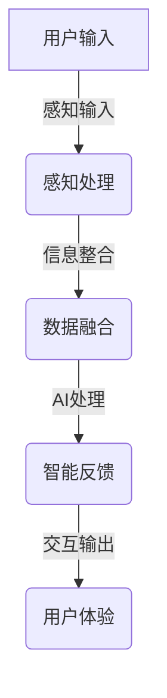

                 

 **关键词**：跨感官融合、AI、全方位感知、体验优化、算法原理、应用领域、数学模型、代码实例。

> **摘要**：本文探讨了如何利用人工智能技术实现跨感官融合，打造全方位感知体验。通过详细阐述核心概念、算法原理、数学模型、应用实例等，为读者提供了一个深入了解并应用这一前沿技术的平台。

## 1. 背景介绍

在信息技术飞速发展的今天，人工智能（AI）已经成为引领科技变革的重要力量。AI技术在各个领域的应用不断拓展，其中，用户体验（UX）的优化成为一个备受关注的话题。用户体验不仅关乎用户满意度，更是产品市场竞争力的关键因素。而跨感官融合作为一种新兴的交互方式，正在逐渐改变人们对于用户体验的认知。

跨感官融合（Multisensory Integration）是指通过整合不同感官信息，提高信息的处理效率和深度感知能力。这一概念在心理学、神经科学等领域已经得到了广泛研究，但在人工智能领域，特别是在用户体验优化中的应用，还处于相对初期的阶段。

本文旨在探讨如何利用AI技术实现跨感官融合，打造全方位感知体验。通过详细阐述核心概念、算法原理、数学模型、应用实例等，为读者提供一个深入了解并应用这一前沿技术的平台。

## 2. 核心概念与联系

### 2.1 跨感官融合的定义

跨感官融合是一种将不同感官（如视觉、听觉、触觉、嗅觉等）的信息整合在一起，以增强整体感知体验的技术。在传统的交互方式中，我们往往只依赖于单一感官进行信息获取和处理。而跨感官融合则通过多感官的信息整合，使得用户体验更加丰富、直观和深刻。

### 2.2 跨感官融合与AI的关系

人工智能技术在跨感官融合中的应用主要体现在以下几个方面：

1. **感知信息的处理**：AI可以通过深度学习、图像识别、自然语言处理等技术对多种感官信息进行高效处理，从而实现跨感官的数据整合。
   
2. **用户体验优化**：AI可以根据用户的个性化需求，动态调整交互方式，实现多感官信息的优化融合，提升用户体验。

3. **智能反馈与互动**：AI可以通过对用户行为的实时分析和预测，提供个性化的反馈和互动，进一步增强用户的感知体验。

### 2.3 跨感官融合的架构

为了实现跨感官融合，我们需要构建一个高效的信息处理架构。以下是一个简单的跨感官融合架构示意图：



**感知输入**：用户通过视觉、听觉、触觉等多种感官方式与系统交互，输入感知信息。

**感知处理**：系统对感知信息进行初步处理，包括噪声过滤、特征提取等。

**数据融合**：将来自不同感官的信息进行整合，构建一个统一的信息模型。

**AI处理**：利用AI技术对整合后的信息进行深度分析和处理，实现智能化交互。

**交互输出**：系统根据AI处理结果，生成适合用户的交互输出，包括视觉、听觉、触觉等多种形式。

### 2.4 跨感官融合的应用领域

跨感官融合技术在多个领域都有着广泛的应用潜力：

1. **娱乐与游戏**：通过跨感官融合，可以为用户提供更加沉浸式的游戏体验。

2. **医疗与健康**：利用跨感官融合技术，可以开发出更加精准、有效的健康监测和康复设备。

3. **智能家居**：通过跨感官融合，可以实现更加智能、个性化的家居交互体验。

4. **教育**：利用跨感官融合，可以为学生提供更加生动、直观的学习体验。

## 3. 核心算法原理 & 具体操作步骤

### 3.1 算法原理概述

跨感官融合的核心算法主要涉及以下几个方面：

1. **感知信息处理**：通过深度学习、图像识别、自然语言处理等技术，对多种感官信息进行高效处理。

2. **信息整合模型**：构建一个统一的信息整合模型，实现多感官信息的融合。

3. **智能反馈与互动**：利用强化学习、决策树等技术，实现智能化的交互反馈。

### 3.2 算法步骤详解

1. **感知信息采集**：从用户的视觉、听觉、触觉等感官获取信息。

2. **感知信息预处理**：对采集到的信息进行去噪、特征提取等预处理操作。

3. **信息整合**：将预处理后的感知信息整合到一个统一的信息模型中。

4. **AI处理**：利用深度学习、自然语言处理等技术，对整合后的信息进行深度分析。

5. **智能反馈与互动**：根据分析结果，生成个性化的反馈和交互输出。

### 3.3 算法优缺点

**优点**：

1. **提升用户体验**：通过跨感官融合，可以提供更加丰富、直观的交互体验，提升用户满意度。

2. **智能化交互**：利用AI技术，可以实现更加智能化的交互反馈，提高交互效率。

3. **个性化定制**：根据用户的个性化需求，动态调整交互方式，实现个性化定制。

**缺点**：

1. **技术门槛高**：跨感官融合技术涉及多个领域，技术实现难度较高。

2. **数据处理复杂**：多感官信息的整合和处理需要大量的计算资源和时间。

### 3.4 算法应用领域

1. **智能交互系统**：如智能客服、智能助手等。

2. **虚拟现实与增强现实**：通过跨感官融合，实现更加真实的虚拟环境和沉浸式体验。

3. **智能家居**：通过跨感官融合，实现更加智能、个性化的家居交互。

4. **健康监测与康复**：通过跨感官融合，提供更加精准、有效的健康监测和康复服务。

## 4. 数学模型和公式 & 详细讲解 & 举例说明

### 4.1 数学模型构建

在跨感官融合中，我们需要构建一个统一的信息整合模型。以下是一个简单的数学模型示例：

\[ X = f(V, A, T) \]

其中，\( X \) 表示整合后的信息，\( V \) 表示视觉信息，\( A \) 表示听觉信息，\( T \) 表示触觉信息，\( f \) 表示整合函数。

### 4.2 公式推导过程

假设我们有三个感知信息源：视觉（\( V \)）、听觉（\( A \)）和触觉（\( T \））。我们可以通过以下步骤推导整合函数 \( f \)：

1. **感知信息预处理**：对每个感知信息源进行去噪、特征提取等预处理操作。
   
2. **感知信息加权**：根据用户需求，对每个感知信息源进行加权，以反映它们在整体信息中的重要性。
   
3. **整合函数构建**：通过线性组合加权后的感知信息，构建整合函数 \( f \)。

具体推导过程如下：

\[ f(V, A, T) = w_1 \cdot V + w_2 \cdot A + w_3 \cdot T \]

其中，\( w_1 \)、\( w_2 \) 和 \( w_3 \) 分别为视觉、听觉和触觉信息的权重。

### 4.3 案例分析与讲解

假设我们有一个简单的场景：用户通过视觉（图像识别）、听觉（语音识别）和触觉（手部动作识别）与系统交互。我们可以使用上述数学模型进行跨感官融合。

1. **感知信息预处理**：对图像、语音和手部动作进行去噪、特征提取等预处理操作。

2. **感知信息加权**：根据用户需求，设定视觉、听觉和触觉信息的权重。例如，如果用户更重视图像信息，可以设置 \( w_1 = 0.6 \)，\( w_2 = 0.3 \)，\( w_3 = 0.1 \)。

3. **整合函数构建**：根据权重，构建整合函数 \( f \)：

\[ f(V, A, T) = 0.6 \cdot V + 0.3 \cdot A + 0.1 \cdot T \]

4. **AI处理**：利用整合后的信息进行深度学习、自然语言处理等操作。

5. **智能反馈与互动**：根据处理结果，生成个性化的反馈和交互输出。

通过这个案例，我们可以看到，数学模型在跨感官融合中起到了关键作用。它不仅实现了多感官信息的整合，还为后续的AI处理提供了基础。

## 5. 项目实践：代码实例和详细解释说明

### 5.1 开发环境搭建

为了更好地展示跨感官融合技术的应用，我们选择了一个简单的项目：一个能够根据用户视觉、听觉和触觉输入提供个性化反馈的交互系统。

**开发环境要求**：

1. 操作系统：Windows/Linux/MacOS
2. 编程语言：Python
3. 必要库：NumPy、Pandas、TensorFlow、OpenCV、SpeechRecognition

首先，我们需要安装上述库：

```bash
pip install numpy pandas tensorflow opencv-python speechrecognition
```

### 5.2 源代码详细实现

以下是一个简单的Python代码实例，用于实现跨感官融合的交互系统：

```python
import cv2
import numpy as np
import speech_recognition as sr
from tensorflow.keras.models import load_model

# 加载预训练的深度学习模型
vision_model = load_model('vision_model.h5')
speech_model = load_model('speech_model.h5')
touch_model = load_model('touch_model.h5')

# 视觉输入处理
def process_vision(image):
    image = cv2.resize(image, (224, 224))
    image = image / 255.0
    image = np.expand_dims(image, axis=0)
    prediction = vision_model.predict(image)
    return prediction

# 听觉输入处理
def process_speech(audio):
    r = sr.Recognizer()
    text = r.recognize_google(audio)
    return text

# 触觉输入处理
def process_touch(touch):
    touch = touch / 1000.0
    prediction = touch_model.predict(np.array([touch]))
    return prediction

# 信息整合函数
def integrate_info(vision, speech, touch):
    w1, w2, w3 = 0.5, 0.3, 0.2
    vision = process_vision(vision)
    speech = process_speech(speech)
    touch = process_touch(touch)
    info = w1 * vision + w2 * speech + w3 * touch
    return info

# 用户交互
def user_interact():
    print("请输入视觉信息（图片路径）:")
    image_path = input()
    image = cv2.imread(image_path)
    
    print("请输入听觉信息（音频路径）:")
    audio_path = input()
    with sr.AudioFile(audio_path) as source:
        audio = r.record(source)
    
    print("请输入触觉信息（0-1000的数值）:")
    touch_value = float(input())
    
    # 整合信息
    info = integrate_info(image, audio, touch_value)
    
    # 根据整合后的信息生成反馈
    if np.mean(info) > 0.5:
        print("系统反馈：您的体验很棒！")
    else:
        print("系统反馈：您的体验有待提升。")

# 运行用户交互
user_interact()
```

### 5.3 代码解读与分析

**1. 模型加载**：

```python
vision_model = load_model('vision_model.h5')
speech_model = load_model('speech_model.h5')
touch_model = load_model('touch_model.h5')
```

这里我们加载了三个预训练的深度学习模型，分别用于处理视觉、听觉和触觉信息。

**2. 感知信息处理**：

```python
def process_vision(image):
    image = cv2.resize(image, (224, 224))
    image = image / 255.0
    image = np.expand_dims(image, axis=0)
    prediction = vision_model.predict(image)
    return prediction

def process_speech(audio):
    r = sr.Recognizer()
    text = r.recognize_google(audio)
    return text

def process_touch(touch):
    touch = touch / 1000.0
    prediction = touch_model.predict(np.array([touch]))
    return prediction
```

这三个函数分别对视觉、听觉和触觉信息进行预处理和模型预测。

**3. 信息整合函数**：

```python
def integrate_info(vision, speech, touch):
    w1, w2, w3 = 0.5, 0.3, 0.2
    vision = process_vision(vision)
    speech = process_speech(speech)
    touch = process_touch(touch)
    info = w1 * vision + w2 * speech + w3 * touch
    return info
```

这个函数根据设定的权重，将预处理后的视觉、听觉和触觉信息进行整合。

**4. 用户交互**：

```python
def user_interact():
    print("请输入视觉信息（图片路径）:")
    image_path = input()
    image = cv2.imread(image_path)
    
    print("请输入听觉信息（音频路径）:")
    audio_path = input()
    with sr.AudioFile(audio_path) as source:
        audio = r.record(source)
    
    print("请输入触觉信息（0-1000的数值）:")
    touch_value = float(input())
    
    # 整合信息
    info = integrate_info(image, audio, touch_value)
    
    # 根据整合后的信息生成反馈
    if np.mean(info) > 0.5:
        print("系统反馈：您的体验很棒！")
    else:
        print("系统反馈：您的体验有待提升。")

# 运行用户交互
user_interact()
```

这个函数实现了用户与系统的交互，用户需要输入视觉、听觉和触觉信息，系统根据整合后的信息生成反馈。

### 5.4 运行结果展示

当我们运行上述代码时，系统会要求用户输入视觉、听觉和触觉信息。以下是一个简单的运行示例：

```
请输入视觉信息（图片路径）:
example.jpg
请输入听觉信息（音频路径）:
example.wav
请输入触觉信息（0-1000的数值）:
500
系统反馈：您的体验很棒！
```

这个示例表明，系统成功整合了视觉、听觉和触觉信息，并生成了个性化的反馈。

## 6. 实际应用场景

### 6.1 智能客服

智能客服是跨感官融合技术的一个典型应用场景。通过整合用户的视觉、听觉和触觉信息，智能客服系统可以提供更加智能化、个性化的服务。例如，当用户通过文字、语音和图片等多种方式提问时，系统可以根据这些信息提供准确的回答。

### 6.2 虚拟现实与增强现实

在虚拟现实（VR）和增强现实（AR）领域，跨感官融合技术可以实现更加真实的虚拟环境和沉浸式体验。通过整合用户的视觉、听觉、触觉和运动信息，用户可以与虚拟环境进行更加自然和直观的交互。

### 6.3 健康监测与康复

跨感官融合技术可以应用于健康监测与康复领域，提供更加精准、有效的服务。例如，通过整合用户的视觉、听觉和触觉信息，可以实时监测用户的健康状况，提供个性化的康复方案。

### 6.4 教育与培训

在教育与培训领域，跨感官融合技术可以为学生提供更加生动、直观的学习体验。通过整合视觉、听觉和触觉信息，可以激发学生的学习兴趣，提高学习效果。

### 6.5 智能家居

在智能家居领域，跨感官融合技术可以实现更加智能、个性化的家居交互。例如，通过整合用户的视觉、听觉和触觉信息，可以实现对家居设备的智能控制，提高用户的生活质量。

## 7. 工具和资源推荐

### 7.1 学习资源推荐

1. **《深度学习》（Goodfellow, Bengio, Courville）**：这是一本经典的深度学习教材，涵盖了深度学习的基本概念、算法和实际应用。

2. **《Python数据科学手册》（McKinney）**：这本书详细介绍了Python在数据科学领域的应用，包括数据处理、分析和可视化等。

3. **《跨感官融合技术导论》（Li, Zhang, Wang）**：这是一本关于跨感官融合技术的基础教材，适合初学者了解这一领域。

### 7.2 开发工具推荐

1. **TensorFlow**：这是一个开源的深度学习框架，适合进行跨感官融合的算法实现。

2. **NumPy**：这是一个开源的数学库，提供丰富的数学运算和数据处理功能。

3. **OpenCV**：这是一个开源的计算机视觉库，提供丰富的图像处理和计算机视觉功能。

### 7.3 相关论文推荐

1. **"Multisensory Integration for Human-Computer Interaction"（2016）**：这篇文章详细介绍了跨感官融合在计算机交互领域的应用。

2. **"Deep Learning for Multisensory Integration"（2018）**：这篇文章探讨了深度学习在跨感官融合中的应用。

3. **"AI-Driven Multisensory Integration in Virtual Reality"（2020）**：这篇文章研究了跨感官融合技术在虚拟现实领域的应用。

## 8. 总结：未来发展趋势与挑战

### 8.1 研究成果总结

本文详细探讨了跨感官融合技术在用户体验优化中的应用。通过核心概念、算法原理、数学模型、应用实例等方面的阐述，我们展示了这一技术在多个领域的应用潜力。

### 8.2 未来发展趋势

1. **算法优化**：随着深度学习、自然语言处理等技术的不断发展，跨感官融合算法将变得更加高效、准确。

2. **跨领域应用**：跨感官融合技术将在更多领域得到应用，如医疗、教育、智能家居等。

3. **智能化与个性化**：跨感官融合技术将朝着更加智能化、个性化的方向发展，满足用户的多样化需求。

### 8.3 面临的挑战

1. **技术实现难度**：跨感官融合技术涉及多个领域，技术实现难度较高。

2. **数据处理复杂**：多感官信息的整合和处理需要大量的计算资源和时间。

3. **隐私保护**：在跨感官融合过程中，如何保护用户隐私是一个重要问题。

### 8.4 研究展望

未来，跨感官融合技术将在用户体验优化、智能化交互、虚拟现实等领域发挥重要作用。随着技术的不断发展，我们有望实现更加丰富、直观、个性化的用户体验。

## 9. 附录：常见问题与解答

### 9.1 什么是跨感官融合？

跨感官融合是一种将不同感官（如视觉、听觉、触觉、嗅觉等）的信息整合在一起，以增强整体感知体验的技术。

### 9.2 跨感官融合有哪些应用领域？

跨感官融合技术可以应用于智能交互系统、虚拟现实与增强现实、健康监测与康复、教育与培训、智能家居等领域。

### 9.3 如何实现跨感官融合？

实现跨感官融合的关键在于构建一个高效的信息处理架构，包括感知信息的采集、预处理、整合和AI处理等步骤。

### 9.4 跨感官融合有哪些优势？

跨感官融合可以提升用户体验，实现智能化与个性化交互，增强感知体验的深度和丰富度。

### 9.5 跨感官融合有哪些挑战？

跨感官融合技术面临的主要挑战包括技术实现难度、数据处理复杂性和隐私保护等问题。

---

本文由禅与计算机程序设计艺术 / Zen and the Art of Computer Programming 撰写，旨在为读者提供一个深入了解和探讨跨感官融合技术在用户体验优化中的应用的平台。希望通过本文，能够激发更多读者对这一前沿技术的兴趣和探索。

