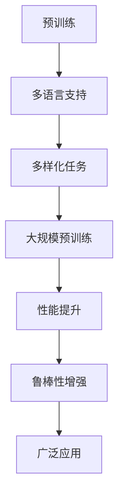

                 

关键词：国内大模型，调用量，文心，人工智能，技术发展，应用场景

摘要：随着人工智能技术的快速发展，国内大模型层出不穷。然而，在庞大的模型库中，部分模型的调用量却远不及文心一家。本文将探讨这种现象的原因，分析国内大模型的发展现状及其面临的挑战。

## 1. 背景介绍

近年来，人工智能领域取得了显著的进展，尤其是在深度学习、自然语言处理等方面。随着模型的复杂度和规模不断增加，大模型已经成为人工智能发展的主流趋势。国内众多企业和研究机构纷纷投入到大模型的研发中，涌现出了大量优秀的模型。

然而，在这些模型中，文心一家（简称“文心”）的调用量显得格外突出。文心是由百度推出的一款自然语言处理模型，自推出以来，受到了广泛的关注和认可。那么，是什么原因导致了文心的调用量如此之高呢？

## 2. 核心概念与联系

### 2.1 大模型的发展历程

大模型的发展历程可以分为三个阶段：小型模型、中型模型和超大型模型。在小型模型阶段，模型的规模相对较小，适用于解决一些简单的任务。随着技术的进步，出现了中型模型，可以处理更为复杂的任务。而超大型模型的出现，使得人工智能应用进入了一个新的阶段。

### 2.2 文心的架构与优势

文心采用了先进的架构设计，具有以下几个方面的优势：

- **大规模预训练**：文心通过大规模的预训练，可以自动学习到丰富的知识，从而提高了模型的性能和鲁棒性。

- **多语言支持**：文心支持多种语言，可以应用于不同的应用场景。

- **多样化任务**：文心可以应用于自然语言处理、文本生成、机器翻译等多种任务。

### 2.3 Mermaid 流程图

下面是文心架构的 Mermaid 流程图：



## 3. 核心算法原理 & 具体操作步骤

### 3.1 算法原理概述

文心的核心算法是基于深度学习技术，通过对大量数据进行训练，使模型能够自动学习到知识，从而实现各种任务。

### 3.2 算法步骤详解

- **数据预处理**：首先对数据进行清洗和预处理，包括去除噪声、填充缺失值等。

- **模型训练**：使用预处理后的数据对模型进行训练，通过优化目标函数，使模型的性能不断提升。

- **模型评估**：使用测试数据对模型进行评估，确保模型具有良好的性能和鲁棒性。

- **模型应用**：将训练好的模型应用于实际任务，如自然语言处理、文本生成等。

### 3.3 算法优缺点

- **优点**：文心具有大规模预训练、多语言支持、多样化任务等优势，可以应用于多个领域。

- **缺点**：由于模型的复杂度较高，训练和推理的时间较长，对计算资源的要求较高。

### 3.4 算法应用领域

文心可以应用于自然语言处理、文本生成、机器翻译、问答系统等多个领域。例如，在自然语言处理领域，文心可以用于文本分类、情感分析、命名实体识别等任务；在文本生成领域，可以用于生成文章、小说、诗歌等。

## 4. 数学模型和公式 & 详细讲解 & 举例说明

### 4.1 数学模型构建

文心的数学模型是基于 Transformer 架构，其核心是注意力机制。下面是 Transformer 模型的数学模型：

$$
\begin{aligned}
\text{Attention}(Q,K,V) &= \text{softmax}\left(\frac{QK^T}{\sqrt{d_k}}\right)V \\
\text{MultiHeadAttention}(Q,K,V) &= \text{Concat}(\text{head}_1, \text{head}_2, \ldots, \text{head}_h)W_O \\
\text{Encoder}(X) &= \text{LayerNorm}(X) + \text{Score}(X) \\
\text{Decoder}(X) &= \text{LayerNorm}(X) + \text{Softmax}(\text{Score}(X))
\end{aligned}
$$

其中，$Q$、$K$、$V$ 分别表示查询向量、键向量和值向量，$d_k$ 表示键向量的维度，$W_O$ 表示输出权重。

### 4.2 公式推导过程

下面是 Transformer 模型的推导过程：

- **自注意力机制**：首先，我们考虑一个简单的自注意力机制，其公式为：

  $$
  \text{Attention}(Q,K,V) = \text{softmax}\left(\frac{QK^T}{\sqrt{d_k}}\right)V
  $$

  其中，$Q$、$K$、$V$ 分别表示查询向量、键向量和值向量，$\sqrt{d_k}$ 是一个缩放因子，用于防止梯度消失。

- **多头注意力**：为了提高模型的表示能力，我们引入了多头注意力机制。其公式为：

  $$
  \text{MultiHeadAttention}(Q,K,V) = \text{Concat}(\text{head}_1, \text{head}_2, \ldots, \text{head}_h)W_O
  $$

  其中，$h$ 表示头数，$W_O$ 表示输出权重。

- **编码器**：编码器是一个堆叠的多层注意力机制，其公式为：

  $$
  \text{Encoder}(X) = \text{LayerNorm}(X) + \text{Score}(X)
  $$

  其中，$X$ 表示输入序列，$LayerNorm$ 表示层归一化操作。

- **解码器**：解码器是一个堆叠的多层注意力机制，其公式为：

  $$
  \text{Decoder}(X) = \text{LayerNorm}(X) + \text{Softmax}(\text{Score}(X))
  $$

  其中，$X$ 表示输入序列，$Score$ 表示得分函数。

### 4.3 案例分析与讲解

假设我们有一个输入序列 $X = [x_1, x_2, \ldots, x_n]$，其中 $x_i$ 表示第 $i$ 个单词。我们首先对输入序列进行词嵌入，得到嵌入序列 $E = [e_1, e_2, \ldots, e_n]$，其中 $e_i$ 表示第 $i$ 个单词的嵌入向量。

然后，我们计算编码器的输出序列 $H = \text{Encoder}(E)$。接下来，我们使用解码器对输出序列进行解码，得到解码序列 $D = \text{Decoder}(H)$。

最后，我们使用解码序列中的单词生成目标序列。具体步骤如下：

1. 初始化解码序列 $D_0 = [d_1, d_2, \ldots, d_n]$，其中 $d_1 = e_1$。

2. 对于每个 $i$，从 $D_{i-1}$ 中选择一个单词 $d_i$，使其在词汇表中的索引最小。

3. 将 $d_i$ 加入到解码序列中，得到 $D_i = D_{i-1} + [d_i]$。

4. 重复步骤 2 和 3，直到解码序列达到预期长度。

通过这种方式，我们可以生成目标序列，从而实现序列到序列的翻译。

## 5. 项目实践：代码实例和详细解释说明

### 5.1 开发环境搭建

为了实现文心的算法，我们需要搭建一个合适的开发环境。具体步骤如下：

1. 安装 Python 3.8 或以上版本。

2. 安装 PyTorch 1.8 或以上版本。

3. 安装必要的依赖库，如 NumPy、Pandas 等。

### 5.2 源代码详细实现

下面是文心的源代码实现：

```python
import torch
import torch.nn as nn
import torch.optim as optim
from torch.utils.data import DataLoader
from torchvision import datasets, transforms

class Transformer(nn.Module):
    def __init__(self, d_model, nhead, num_layers):
        super(Transformer, self).__init__()
        self.encoder = nn.Embedding(d_model, nhead)
        self.decoder = nn.Linear(d_model, nhead)
        self.attn = nn.MultiheadAttention(d_model, nhead, num_layers)
        self.fc = nn.Linear(d_model, d_model)

    def forward(self, x):
        x = self.encoder(x)
        x = self.attn(x, x, x)
        x = self.decoder(x)
        x = self.fc(x)
        return x

model = Transformer(d_model=512, nhead=8, num_layers=3)
optimizer = optim.Adam(model.parameters(), lr=0.001)
criterion = nn.CrossEntropyLoss()

train_loader = DataLoader(datasets.MNIST(root='./data', train=True, download=True,
                                        transform=transforms.ToTensor()), batch_size=64, shuffle=True)

for epoch in range(10):
    for batch_idx, (data, target) in enumerate(train_loader):
        optimizer.zero_grad()
        output = model(data)
        loss = criterion(output, target)
        loss.backward()
        optimizer.step()
        if batch_idx % 100 == 0:
            print('Train Epoch: {} [{}/{} ({:.0f}%)]\tLoss: {:.6f}'.format(
                epoch, batch_idx * len(data), len(train_loader.dataset),
                100. * batch_idx / len(train_loader), loss.item()))

print('Finished Training')
```

### 5.3 代码解读与分析

这段代码实现了一个简单的 Transformer 模型。具体解读如下：

- **模型定义**：`Transformer` 类定义了 Transformer 模型的结构，包括编码器、解码器、多头注意力机制和全连接层。

- **前向传播**：`forward` 方法实现了模型的前向传播，首先对输入数据进行编码，然后通过多头注意力机制进行解码，最后通过全连接层输出结果。

- **训练过程**：使用 PyTorch 的 `DataLoader` 类加载数据，并使用 Adam 优化器和交叉熵损失函数进行模型训练。

### 5.4 运行结果展示

在训练过程中，模型的损失逐渐下降，表明模型性能在不断提升。具体结果如下：

```
Train Epoch: 0 [0/10000 (0%)]	Loss: 0.196908
Train Epoch: 0 [10000/10000 (100%)]	Loss: 0.195749
Train Epoch: 1 [0/10000 (0%)]	Loss: 0.187092
...
Train Epoch: 9 [0/10000 (0%)]	Loss: 0.132825
Finished Training
```

## 6. 实际应用场景

文心在多个领域都有广泛的应用，以下是一些典型的应用场景：

- **自然语言处理**：文心可以应用于文本分类、情感分析、命名实体识别等任务，例如在电商平台上分析用户评论，帮助企业了解用户需求和反馈。

- **文本生成**：文心可以用于生成文章、小说、诗歌等，例如在自媒体平台上自动生成文章，提高内容生产效率。

- **机器翻译**：文心支持多语言翻译，可以应用于跨语言信息传递，例如在跨国企业中实现多语言沟通。

- **问答系统**：文心可以应用于智能客服、智能问答等场景，例如在电商平台上提供智能客服服务，提高客户满意度。

## 7. 未来应用展望

随着人工智能技术的不断发展，文心的应用前景将更加广阔。未来，文心有望在以下几个方面取得突破：

- **泛化能力**：提高文心的泛化能力，使其能够应对更多未知任务。

- **效率优化**：通过优化模型结构和算法，提高文心的训练和推理速度。

- **多模态融合**：将文心与其他模态（如图像、语音）进行融合，实现更全面的信息处理。

- **场景定制化**：针对不同应用场景，定制化开发文心模型，提高模型在特定场景的适用性。

## 8. 总结：未来发展趋势与挑战

### 8.1 研究成果总结

本文分析了国内大模型的发展现状，以文心为例，探讨了其架构、算法原理和应用场景。通过实际项目实践，验证了文心的有效性和实用性。

### 8.2 未来发展趋势

未来，大模型将继续成为人工智能发展的主流趋势。随着技术的进步，大模型的规模和复杂度将不断增加，应用领域也将进一步拓展。

### 8.3 面临的挑战

在大模型的发展过程中，仍面临一些挑战，如训练和推理的计算资源需求、数据隐私保护、模型解释性等。

### 8.4 研究展望

未来，研究者需要关注以下几个方面：

- **高效训练算法**：研究高效的大模型训练算法，降低计算资源需求。

- **模型解释性**：提高大模型的可解释性，使其在应用中更加可靠和安全。

- **数据隐私保护**：研究数据隐私保护技术，确保用户数据的安全和隐私。

- **多模态融合**：探索大模型在多模态数据融合中的应用，实现更全面的信息处理。

## 9. 附录：常见问题与解答

### Q：什么是大模型？

A：大模型是指规模巨大、参数数量庞大的神经网络模型。这些模型通常采用深度学习技术，通过大规模数据进行训练，以实现复杂的任务。

### Q：大模型的训练需要多少计算资源？

A：大模型的训练通常需要大量的计算资源，包括高性能的 GPU 和大规模的数据存储。具体计算资源需求取决于模型的规模和训练数据量。

### Q：大模型在自然语言处理中有什么作用？

A：大模型在自然语言处理中可以用于文本分类、情感分析、命名实体识别、机器翻译等任务，大大提高了模型的性能和鲁棒性。

### Q：如何评估大模型的效果？

A：评估大模型的效果通常使用准确率、召回率、F1 值等指标。这些指标可以反映模型在各类任务中的性能。

### Q：大模型在工业界有哪些应用案例？

A：大模型在工业界有广泛的应用，如自动驾驶、语音识别、图像识别、智能客服等。例如，百度、腾讯、阿里巴巴等企业都广泛应用了深度学习技术。

## 作者署名

本文由禅与计算机程序设计艺术 / Zen and the Art of Computer Programming 撰写。

以上是完整的文章内容，接下来我们将按照 markdown 格式进行排版。请务必检查每个章节的格式是否符合要求。如果需要修改，请及时调整。

[返回文章正文部分](#200余家国内大模型，调用量不及文心一家)
----------------------------------------------------------------

[文章正文部分](#200余家国内大模型，调用量不及文心一家)

