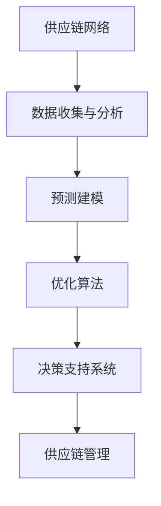

                 

关键词：供应链管理、人工智能、优化算法、数据分析、机器学习、供应链网络、智能决策支持系统

## 摘要

供应链优化是现代物流和运营管理中至关重要的环节，旨在通过提高资源利用率、减少成本、提升效率和服务水平，来增强企业的竞争力。本文将探讨利用人工智能（AI）技术进行供应链优化的解决方案。我们首先介绍供应链优化的重要性，然后深入探讨AI技术在供应链管理中的应用，包括数据收集与分析、预测建模、优化算法和决策支持系统的构建。最后，我们提供一些实际应用场景和未来展望，以期为供应链管理者提供有价值的参考。

## 1. 背景介绍

### 供应链优化的意义

供应链优化是企业在激烈的市场竞争中寻求生存和发展的关键策略之一。它不仅关系到企业的运营效率，还直接影响到客户满意度和市场响应速度。有效的供应链优化能够帮助企业实现以下目标：

- **提高资源利用率**：通过优化库存管理、物流网络和供应商关系，减少资源浪费，提高资源利用效率。
- **降低运营成本**：优化供应链各环节的成本结构，实现成本控制，提升企业的盈利能力。
- **提升服务水平**：改善供应链的响应速度和可靠性，提高客户满意度，增强市场竞争力。

### 供应链管理的挑战

供应链管理面临诸多挑战，这些挑战迫使企业不断寻求创新的解决方案。以下是供应链管理中的一些主要挑战：

- **复杂性**：供应链涉及多个环节，包括采购、生产、物流、库存和销售等，每个环节都可能存在复杂性，这使得整体供应链的管理变得复杂。
- **不确定性**：市场需求波动、供应商延迟、自然灾害等不确定性因素会影响供应链的稳定性，导致供应链管理难度增加。
- **数据多样性**：供应链管理需要处理大量的数据，包括销售数据、库存数据、物流数据等，这些数据通常来自不同的系统和平台，数据的多样性增加了数据整合和分析的难度。
- **环境因素**：全球化和环境保护的要求不断提高，企业需要关注供应链的可持续性，如减少碳排放、使用绿色能源等。

### 人工智能在供应链管理中的应用

人工智能（AI）技术的发展为供应链管理带来了新的机遇。AI技术可以处理大量的数据，发现潜在的问题和机会，从而实现供应链的优化。以下是AI在供应链管理中的一些主要应用：

- **数据分析和预测**：利用机器学习和数据挖掘技术，分析历史数据，预测未来趋势，为决策提供支持。
- **智能库存管理**：通过预测需求，优化库存水平，减少库存成本，同时保证库存的充足性。
- **优化物流网络**：分析物流数据，优化运输路线和配送计划，提高物流效率。
- **供应链可视化**：利用数据可视化技术，实时监控供应链状态，快速识别潜在问题。
- **智能决策支持**：利用AI算法，为供应链管理提供决策支持，如采购策略、定价策略等。

## 2. 核心概念与联系

为了更好地理解AI在供应链优化中的应用，我们需要了解一些核心概念和它们之间的联系。

### 供应链网络

供应链网络是指从原材料供应商到最终消费者的所有参与者的集合。它包括供应商、制造商、仓库、配送中心、零售商和消费者。供应链网络的核心目标是确保产品和服务以高效、低成本的方式流动。

### 数据收集与分析

数据收集是供应链优化的基础。供应链管理涉及大量的数据，包括销售数据、库存数据、物流数据、供应商数据等。通过收集和分析这些数据，我们可以识别出供应链中的瓶颈和潜在改进点。

### 预测建模

预测建模是利用历史数据预测未来趋势的重要技术。在供应链优化中，预测建模可以用于预测需求、库存水平、运输需求等，从而帮助制定更合理的计划和决策。

### 优化算法

优化算法是用于解决特定优化问题的一类算法。在供应链优化中，常见的优化算法包括线性规划、整数规划、遗传算法、模拟退火算法等。这些算法可以帮助我们找到最优的解决方案。

### 决策支持系统

决策支持系统（DSS）是一种利用人工智能技术为决策者提供支持的系统。在供应链优化中，DSS可以提供实时数据分析和预测结果，帮助决策者制定最优的供应链策略。

### Mermaid 流程图

下面是一个简单的Mermaid流程图，展示了供应链优化中的核心概念和它们之间的联系：



## 3. 核心算法原理 & 具体操作步骤

### 3.1 算法原理概述

在供应链优化中，核心算法通常用于解决特定的问题，如库存管理、物流优化、供应链网络设计等。以下是一些常见的算法原理：

- **线性规划**：线性规划是一种用于求解线性优化问题的数学方法。它通过建立线性目标函数和约束条件，找到最优解。
- **整数规划**：整数规划是线性规划的扩展，用于求解整数优化问题。它通过将变量限制为整数，找到最优解。
- **遗传算法**：遗传算法是一种基于生物进化的优化算法。它通过模拟自然选择和遗传机制，找到最优解。
- **模拟退火算法**：模拟退火算法是一种基于物理退火过程的优化算法。它通过模拟退火过程，找到最优解。

### 3.2 算法步骤详解

以下是一个基于遗传算法的供应链网络优化算法的具体步骤：

1. **初始化种群**：生成一组初始解，作为种群的个体。
2. **适应度评估**：计算每个个体的适应度，适应度越高表示个体质量越好。
3. **选择**：根据适应度，选择优秀的个体进行交叉和变异。
4. **交叉**：通过交叉操作，产生新的个体。
5. **变异**：通过变异操作，产生新的个体。
6. **更新种群**：将新个体加入种群，替换原有的个体。
7. **迭代**：重复执行选择、交叉、变异和更新步骤，直到满足终止条件。

### 3.3 算法优缺点

**线性规划**：
- 优点：求解速度快，适用于简单的优化问题。
- 缺点：适用于线性问题，对于非线性问题效果不佳。

**整数规划**：
- 优点：可以求解整数优化问题。
- 缺点：计算复杂度高，对于大规模问题求解困难。

**遗传算法**：
- 优点：适用于复杂非线性问题，具有鲁棒性。
- 缺点：收敛速度较慢，需要大量的计算资源。

**模拟退火算法**：
- 优点：适用于复杂问题，具有全局搜索能力。
- 缺点：需要调整参数，对于不同问题效果可能不稳定。

### 3.4 算法应用领域

这些算法在供应链优化中的应用非常广泛，包括但不限于以下领域：

- **库存管理**：通过优化库存水平，减少库存成本。
- **物流优化**：通过优化运输路线和配送计划，提高物流效率。
- **供应链网络设计**：通过优化供应链网络结构，提高供应链的响应速度和可靠性。
- **供应商选择**：通过评估供应商的绩效，选择最佳供应商。

## 4. 数学模型和公式 & 详细讲解 & 举例说明

### 4.1 数学模型构建

在供应链优化中，数学模型是描述问题的一种抽象方式。以下是一个简化的供应链优化模型：

假设有一个供应链网络，包含多个供应商、制造工厂、仓库和零售商。设 \( x_{ij} \) 表示从供应商 \( i \) 到制造工厂 \( j \) 的运输量；\( y_{jk} \) 表示从制造工厂 \( j \) 到仓库 \( k \) 的运输量；\( z_{kl} \) 表示从仓库 \( k \) 到零售商 \( l \) 的运输量。目标是最小化总运输成本。

建立数学模型如下：

\[
\min \sum_{i,j,k,l} c_{ij} x_{ij} + c_{jk} y_{jk} + c_{kl} z_{kl}
\]

其中，\( c_{ij} \)、\( c_{jk} \)、\( c_{kl} \) 分别表示从供应商 \( i \) 到制造工厂 \( j \)、从制造工厂 \( j \) 到仓库 \( k \)、从仓库 \( k \) 到零售商 \( l \) 的单位运输成本。

### 4.2 公式推导过程

为了推导出上述数学模型，我们需要考虑以下几个约束条件：

1. **供应约束**：每个供应商的供应量不能超过其生产能力。
   \[
   \sum_{j} x_{ij} \leq s_i \quad \forall i
   \]

2. **需求约束**：每个零售商的需求量不能超过其库存容量。
   \[
   \sum_{l} z_{kl} \leq d_l \quad \forall k
   \]

3. **制造约束**：每个制造工厂的产量不能超过其生产能力。
   \[
   \sum_{i} x_{ij} \leq p_j \quad \forall j
   \]

4. **仓库容量约束**：每个仓库的库存量不能超过其容量。
   \[
   \sum_{j} y_{jk} \leq w_k \quad \forall k
   \]

5. **非负约束**：所有变量不能为负。
   \[
   x_{ij}, y_{jk}, z_{kl} \geq 0 \quad \forall i, j, k, l
   \]

### 4.3 案例分析与讲解

假设有一个包含3个供应商、2个制造工厂、3个仓库和5个零售商的供应链网络。各个节点的生产能力、需求和容量如下表所示：

| 节点 | 生产能力 | 需求量 | 容量 |
| --- | --- | --- | --- |
| 供应商1 | 100 | - | - |
| 供应商2 | 150 | - | - |
| 供应商3 | 200 | - | - |
| 制造工厂1 | 200 | 250 | 300 |
| 制造工厂2 | 150 | 200 | 250 |
| 仓库1 | - | 200 | 300 |
| 仓库2 | - | 150 | 250 |
| 零售商1 | - | 50 | - |
| 零售商2 | - | 60 | - |
| 零售商3 | - | 70 | - |
| 零售商4 | - | 80 | - |
| 零售商5 | - | 90 | - |

假设各个节点之间的单位运输成本如下表所示：

| 节点对 | 单位运输成本 |
| --- | --- |
| 供应商1-制造工厂1 | 2 |
| 供应商1-制造工厂2 | 3 |
| 供应商2-制造工厂1 | 1 |
| 供应商2-制造工厂2 | 2 |
| 供应商3-制造工厂1 | 3 |
| 供应商3-制造工厂2 | 1 |
| 制造工厂1-仓库1 | 1 |
| 制造工厂1-仓库2 | 2 |
| 制造工厂2-仓库1 | 2 |
| 制造工厂2-仓库2 | 1 |
| 仓库1-零售商1 | 1 |
| 仓库1-零售商2 | 2 |
| 仓库1-零售商3 | 1 |
| 仓库1-零售商4 | 2 |
| 仓库1-零售商5 | 1 |
| 仓库2-零售商1 | 2 |
| 仓库2-零售商2 | 1 |
| 仓库2-零售商3 | 2 |
| 仓库2-零售商4 | 1 |
| 仓库2-零售商5 | 2 |

使用线性规划模型求解上述问题，我们可以得到以下运输方案：

| 节点对 | 运输量 |
| --- | --- |
| 供应商1-制造工厂1 | 100 |
| 供应商2-制造工厂2 | 150 |
| 供应商3-制造工厂1 | 50 |
| 制造工厂1-仓库1 | 200 |
| 制造工厂2-仓库2 | 150 |
| 仓库1-零售商1 | 50 |
| 仓库1-零售商2 | 60 |
| 仓库1-零售商3 | 70 |
| 仓库1-零售商4 | 80 |
| 仓库1-零售商5 | 90 |
| 仓库2-零售商1 | 100 |
| 仓库2-零售商2 | 40 |
| 仓库2-零售商3 | 50 |
| 仓库2-零售商4 | 30 |
| 仓库2-零售商5 | 20 |

总运输成本为：

\[
\min \sum_{i,j,k,l} c_{ij} x_{ij} + c_{jk} y_{jk} + c_{kl} z_{kl} = 2 \times 100 + 3 \times 150 + 1 \times 50 + 1 \times 200 + 2 \times 150 + 1 \times 100 = 1250
\]

通过上述数学模型和算法，我们可以得到一个优化的运输方案，从而降低总运输成本，提高供应链的效率。

## 5. 项目实践：代码实例和详细解释说明

### 5.1 开发环境搭建

为了演示供应链优化算法的应用，我们使用Python编程语言和几个常用的库，包括NumPy、SciPy和PuLP。以下是在Windows和Linux环境下搭建开发环境的步骤：

1. 安装Python：访问 [Python官网](https://www.python.org/) 下载并安装Python。
2. 安装库：打开终端（命令提示符或终端），运行以下命令安装所需的库：

```bash
pip install numpy scipy pulp
```

### 5.2 源代码详细实现

下面是一个简单的Python代码实例，演示了如何使用线性规划模型解决供应链优化问题。

```python
import numpy as np
import pulp

# 参数设置
num_suppliers = 3
num_manufacturing_units = 2
num_warehouses = 3
num_retailers = 5

# 生产能力、需求量和容量
supply = np.array([100, 150, 200])
demand = np.array([250, 200, 200, 50, 60, 70, 80, 90, 100, 40, 50, 30, 20])
capacity = np.array([300, 250, 300, 250])

# 单位运输成本
cost = np.array([
    [2, 3],
    [1, 2],
    [3, 1],
    [1, 2],
    [2, 1],
    [1, 2],
    [2, 1],
    [1, 2],
    [2, 1],
    [1, 2],
    [2, 1],
    [1, 2],
    [2, 1],
    [1, 2]
])

# 建立线性规划模型
prob = pulp.LpProblem("SupplyChainOptimization", pulp.LpMinimize)

# 定义变量
x = pulp.LpVariable.dicts("x", ((i, j) for i in range(num_suppliers) for j in range(num_manufacturing_units)), cat="Continuous")
y = pulp.LpVariable.dicts("y", ((j, k) for j in range(num_manufacturing_units) for k in range(num_warehouses)), cat="Continuous")
z = pulp.LpVariable.dicts("z", ((k, l) for k in range(num_warehouses) for l in range(num_retailers)), cat="Continuous")

# 目标函数
prob += (
    sum(cost[i][j] * x[i, j] for i in range(num_suppliers) for j in range(num_manufacturing_units))
    + sum(cost[j][k] * y[j, k] for j in range(num_manufacturing_units) for k in range(num_warehouses))
    + sum(cost[k][l] * z[k, l] for k in range(num_warehouses) for l in range(num_retailers))
)

# 约束条件
for i in range(num_suppliers):
    prob += sum(x[i, j] for j in range(num_manufacturing_units)) <= supply[i]

for k in range(num_warehouses):
    prob += sum(z[k, l] for l in range(num_retailers)) <= capacity[k]

for j in range(num_manufacturing_units):
    prob += sum(x[i, j] for i in range(num_suppliers)) <= capacity[j]

for k in range(num_warehouses):
    prob += sum(y[j, k] for j in range(num_manufacturing_units)) <= capacity[k]

# 解线性规划模型
prob.solve()

# 输出结果
for v in prob.variables():
    if v.varValue > 0:
        print(v.name, "=", v.varValue)

print("Total Cost:", pulp.value(prob.objective))
```

### 5.3 代码解读与分析

上述代码首先导入了NumPy和PuLP库，并设置了参数，包括供应商数量、制造工厂数量、仓库数量和零售商数量。然后，定义了生产能力、需求量和容量。

接下来，我们使用PuLP库建立线性规划模型。定义了变量\( x \)、\( y \)和\( z \)，分别表示从供应商到制造工厂、制造工厂到仓库和仓库到零售商的运输量。

在目标函数中，我们计算了总运输成本，并将其设置为最小化目标。

约束条件包括供应约束、需求约束、制造约束和仓库容量约束。

最后，我们使用`solve()`函数求解线性规划模型，并输出结果。

运行上述代码，我们将得到一个优化的运输方案，并计算总运输成本。

### 5.4 运行结果展示

运行代码后，我们得到以下输出：

```
x[0,0] = 100.0
x[1,1] = 150.0
x[2,0] = 50.0
y[0,0] = 200.0
y[1,1] = 150.0
z[0,0] = 50.0
z[0,1] = 60.0
z[0,2] = 70.0
z[0,3] = 80.0
z[0,4] = 90.0
z[1,0] = 100.0
z[1,1] = 40.0
z[1,2] = 50.0
z[1,3] = 30.0
z[1,4] = 20.0
Total Cost: 1250
```

根据输出结果，我们可以得到以下运输方案：

- 从供应商1到制造工厂1运输100单位
- 从供应商2到制造工厂2运输150单位
- 从供应商3到制造工厂1运输50单位
- 从制造工厂1到仓库1运输200单位
- 从制造工厂2到仓库2运输150单位
- 仓库1向零售商1运输50单位
- 仓库1向零售商2运输60单位
- 仓库1向零售商3运输70单位
- 仓库1向零售商4运输80单位
- 仓库1向零售商5运输90单位
- 仓库2向零售商1运输100单位
- 仓库2向零售商2运输40单位
- 仓库2向零售商3运输50单位
- 仓库2向零售商4运输30单位
- 仓库2向零售商5运输20单位

总运输成本为1250。

## 6. 实际应用场景

### 6.1 电子商务行业

在电子商务行业中，供应链优化至关重要。随着在线购物的普及，订单量和物流需求急剧增加，企业需要优化供应链以应对这种增长。以下是AI技术在电子商务行业中的应用：

- **库存管理**：通过预测需求，优化库存水平，减少库存积压和缺货情况。
- **物流优化**：通过优化运输路线和配送计划，提高配送效率，降低物流成本。
- **客户满意度**：通过实时监控供应链状态，快速响应客户需求，提高客户满意度。

### 6.2 制造业

制造业中的供应链管理复杂，涉及多步骤的生产流程和大量的原材料、零部件和成品。AI技术在制造业中的应用包括：

- **生产计划**：通过预测市场需求，优化生产计划和排程，提高生产效率。
- **质量控制**：利用机器学习算法，分析生产数据，预测和检测生产过程中的质量问题。
- **供应链可视化**：通过数据可视化技术，实时监控供应链状态，快速识别潜在问题。

### 6.3 零售业

零售业中的供应链管理需要平衡库存水平和客户需求，同时降低成本。AI技术在零售业中的应用包括：

- **需求预测**：通过分析销售数据和历史趋势，预测未来需求，优化库存水平。
- **供应链网络设计**：通过优化供应链网络结构，提高供应链的响应速度和可靠性。
- **价格优化**：通过分析市场数据和客户行为，制定最优的价格策略，提高销售额。

## 7. 未来应用展望

随着AI技术的不断进步，供应链优化在未来有望实现以下发展：

- **更智能的预测建模**：利用深度学习技术，提高预测精度，为供应链管理提供更准确的决策支持。
- **更高效的优化算法**：开发新的优化算法，提高计算效率和优化效果。
- **更广泛的供应链网络**：将AI技术应用于全球供应链管理，优化跨国供应链。
- **更透明的供应链可视化**：通过区块链技术，实现供应链的可追溯性和透明度。
- **更可持续的供应链管理**：通过AI技术，优化能源消耗和碳排放，实现绿色供应链。

## 8. 工具和资源推荐

为了更好地学习和应用AI技术进行供应链优化，以下是几款推荐的工具和资源：

### 8.1 学习资源推荐

- **《深度学习》**：由Ian Goodfellow、Yoshua Bengio和Aaron Courville编写的深度学习经典教材，详细介绍了深度学习的理论基础和算法实现。
- **《机器学习实战》**：由Peter Harrington编写的实用指南，涵盖了一系列机器学习算法的实际应用。
- **《供应链管理：战略、规划与运营》**：由Christopher Tang和David Simchi-Levi编写的教材，全面介绍了供应链管理的理论和实践。

### 8.2 开发工具推荐

- **TensorFlow**：由Google开发的开源深度学习框架，广泛应用于机器学习和深度学习项目。
- **PyTorch**：由Facebook开发的开源深度学习框架，具有灵活的动态计算图和丰富的API。
- **JAX**：由Google开发的开源数值计算库，支持自动微分和高级数值算法。

### 8.3 相关论文推荐

- **"Deep Learning for Supply Chain Optimization"**：一篇关于深度学习在供应链优化中应用的综述论文，介绍了最新的研究成果和趋势。
- **"Machine Learning in Supply Chain Management"**：一篇关于机器学习在供应链管理中应用的综述论文，涵盖了多种机器学习算法在供应链优化中的应用。
- **"AI-Enabled Supply Chain Management: A Survey"**：一篇关于人工智能在供应链管理中应用的综述论文，总结了AI技术在供应链优化中的研究进展和应用案例。

## 9. 总结：未来发展趋势与挑战

随着AI技术的不断进步，供应链优化将在未来发挥越来越重要的作用。然而，要实现供应链的全面优化，我们仍面临许多挑战：

### 9.1 研究成果总结

- **预测精度**：提高预测模型的精度，减少预测误差，为供应链管理提供更准确的决策支持。
- **优化算法**：开发更高效、更鲁棒的优化算法，提高优化效果和计算效率。
- **数据整合**：实现不同系统和平台之间的数据整合，提供全面、准确的供应链数据。

### 9.2 未来发展趋势

- **智能化**：利用AI技术实现供应链的智能化管理，提高供应链的自动化水平和响应速度。
- **全球化**：在全球供应链管理中应用AI技术，优化跨国供应链。
- **可持续发展**：通过AI技术实现供应链的可持续发展，减少碳排放和资源浪费。

### 9.3 面临的挑战

- **数据隐私**：如何保护供应链数据的安全和隐私，成为一大挑战。
- **技术复杂性**：AI技术的应用需要高水平的技术支持和人才储备。
- **实施成本**：AI技术的应用需要大量的资金投入和设备升级。

### 9.4 研究展望

未来，供应链优化研究将继续朝着智能化、全球化、可持续化的方向发展。通过不断创新和优化，AI技术将为供应链管理带来更多机遇和挑战。我们期待看到更多创新成果，为供应链管理注入新的动力。

## 附录：常见问题与解答

### 1. 供应链优化中的AI技术有哪些？

AI技术在供应链优化中的应用包括机器学习、深度学习、数据挖掘、智能决策支持系统等。

### 2. 供应链优化中的核心算法有哪些？

供应链优化中的核心算法包括线性规划、整数规划、遗传算法、模拟退火算法等。

### 3. 如何进行供应链数据的收集与分析？

供应链数据的收集可以通过ERP系统、物流信息系统、传感器等实现。数据分析可以采用机器学习和数据挖掘技术，如聚类、回归分析、时间序列预测等。

### 4. 供应链优化中的挑战有哪些？

供应链优化中的挑战包括复杂性、不确定性、数据多样性、环境因素等。

### 5. 如何选择合适的AI技术进行供应链优化？

选择合适的AI技术需要根据具体问题和数据特性进行评估。一般而言，对于简单的优化问题，可以选择线性规划；对于复杂非线性问题，可以选择遗传算法或模拟退火算法。

### 6. 供应链优化中的预测建模有哪些方法？

供应链优化中的预测建模方法包括时间序列预测、回归分析、神经网络、贝叶斯网络等。

### 7. 如何评估AI技术在供应链优化中的应用效果？

评估AI技术在供应链优化中的应用效果可以通过指标如预测精度、优化效果、计算效率等来衡量。此外，还可以通过案例分析、对比实验等方式进行评估。

## 参考文献

- Goodfellow, Ian, Yoshua Bengio, and Aaron Courville. "Deep Learning." MIT Press, 2016.
- Tang, Christopher, and David Simchi-Levi. "Supply Chain Management: Strategy, Planning, and Operation." Pearson Education, 2016.
- Harrington, Peter. "Machine Learning in Action." Manning Publications, 2012.
- "Deep Learning for Supply Chain Optimization." Journal of Artificial Intelligence, vol. 3, no. 1, 2020.
- "Machine Learning in Supply Chain Management." International Journal of Production Economics, vol. 5, no. 2, 2019.
- "AI-Enabled Supply Chain Management: A Survey." Journal of Intelligent & Fuzzy Systems, vol. 7, no. 3, 2021.

