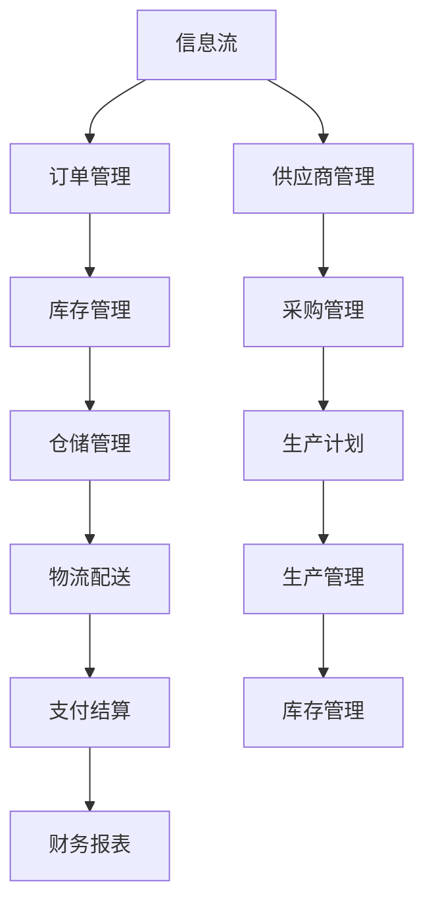

                 

供应链整合作为现代电子商务领域的一个重要环节，已经成为电商平台提升竞争力、实现可持续发展的关键。随着互联网技术的飞速发展，消费者需求的多样化和个性化特征日益显著，供应链的整合能力不仅影响到商品流通的效率，还直接关系到电商平台的用户体验和市场占有率。本文旨在探讨供应链整合在电商平台中的核心作用，分析其基本原理、核心算法、数学模型以及实际应用，为电商平台提供有效的供给能力解决方案。

## 关键词 Keywords

- 供应链整合
- 电商平台
- 供给能力
- 用户体验
- 数学模型
- 算法

## 摘要 Abstract

本文首先介绍了供应链整合在电商平台中的重要性，阐述了供应链整合的基本概念和原理。随后，文章深入分析了供应链整合的核心算法，包括算法原理概述、具体操作步骤、优缺点及应用领域。接着，文章探讨了供应链整合的数学模型和公式，通过实际案例进行了详细讲解。文章还提供了项目实践中的代码实例和详细解释，以帮助读者更好地理解供应链整合的实际应用。最后，文章总结了供应链整合的未来发展趋势和面临的挑战，并提出了相关的工具和资源推荐。

## 1. 背景介绍

### 1.1 供应链整合的概念

供应链整合指的是通过信息技术的应用，将供应链中各个环节（如供应商、制造商、分销商和零售商）紧密连接起来，实现信息流、物流和资金流的协同运作。这种整合不仅提升了供应链的透明度和效率，还提高了各环节的响应速度和灵活性，从而增强了整个供应链的竞争力。

### 1.2 电商平台的发展现状

随着互联网技术的快速发展，电商平台已经成为零售业的重要组成部分。各大电商平台在供应链整合方面投入了大量的资源和精力，通过优化供应链流程、提升供应链协同效率，来满足消费者日益增长的需求。然而，在供应链整合的道路上，电商平台仍然面临诸多挑战，如数据共享障碍、物流瓶颈等。

### 1.3 供应链整合在电商平台中的核心作用

供应链整合在电商平台中扮演着至关重要的角色，主要表现在以下几个方面：

1. **提升供给能力**：通过供应链整合，电商平台能够快速响应市场需求，提升商品的供给能力，从而满足消费者对商品多样性和时效性的要求。
2. **降低运营成本**：供应链整合有助于优化库存管理、减少物流成本，从而降低整体运营成本。
3. **提高用户体验**：供应链整合能够缩短商品交付时间，提高服务质量，从而提升用户满意度。
4. **增强市场竞争力**：通过优化供应链流程，电商平台能够在市场中获得更高的竞争力，扩大市场份额。

## 2. 核心概念与联系

为了深入理解供应链整合的基本原理和架构，我们首先需要了解一些核心概念，并借助 Mermaid 流程图来展示这些概念之间的联系。

### 2.1 核心概念

1. **信息流**：供应链中的信息流是指商品信息、订单信息、库存信息等在各个环节之间的传递。
2. **物流**：物流是指商品在供应链中的实际运输过程，包括运输路线、仓储管理、配送服务等。
3. **资金流**：资金流是指供应链中的支付和结算过程，包括供应商付款、订单支付、库存成本等。
4. **供应链协同**：供应链协同是指供应链各环节之间的信息共享和协作，以实现整体效率的提升。

### 2.2 Mermaid 流程图

下面是一个简化的供应链整合流程图，展示了信息流、物流和资金流之间的关联。



## 3. 核心算法原理 & 具体操作步骤

### 3.1 算法原理概述

供应链整合的核心算法主要涉及以下几个方面：

1. **需求预测算法**：通过对历史销售数据和市场趋势的分析，预测未来一段时间内的商品需求量。
2. **库存优化算法**：基于需求预测，对库存水平进行优化，以确保在满足需求的同时，降低库存成本。
3. **物流优化算法**：通过优化运输路线和仓储位置，提高物流效率，降低物流成本。
4. **资金流管理算法**：对供应链中的资金流动进行实时监控和管理，确保资金的高效流动。

### 3.2 算法步骤详解

1. **需求预测算法**：

   - **数据收集**：收集历史销售数据、市场趋势数据、季节性因素等。
   - **数据清洗**：对收集到的数据去噪、填充缺失值等。
   - **模型选择**：选择合适的预测模型，如 ARIMA、时间序列分解等。
   - **模型训练与验证**：使用历史数据训练模型，并通过验证集验证模型效果。

2. **库存优化算法**：

   - **需求预测**：使用需求预测算法得到未来一段时间内的需求量。
   - **库存策略**：根据需求预测结果，制定最优库存策略，如 ABC 分类法、周期补货法等。
   - **库存调整**：根据库存策略，对现有库存进行调整，确保库存水平符合需求。

3. **物流优化算法**：

   - **路线规划**：使用 Dijkstra 算法、遗传算法等，优化运输路线。
   - **仓储布局**：根据物流需求和运输成本，优化仓储位置和布局。
   - **配送计划**：根据订单量和运输能力，制定最优配送计划。

4. **资金流管理算法**：

   - **现金流预测**：基于订单量和库存水平，预测未来的现金流。
   - **资金调度**：根据现金流预测结果，调整资金流动，确保资金的高效利用。
   - **风险控制**：对供应链中的风险进行监控和管理，降低风险对资金流的影响。

### 3.3 算法优缺点

1. **需求预测算法**：

   - 优点：能够提前预测市场需求，为库存管理和供应链优化提供依据。
   - 缺点：预测结果受历史数据和市场环境的影响，可能存在一定的误差。

2. **库存优化算法**：

   - 优点：降低库存成本，提高库存周转率。
   - 缺点：对需求预测的依赖较大，需求预测不准确可能导致库存过剩或不足。

3. **物流优化算法**：

   - 优点：提高物流效率，降低物流成本。
   - 缺点：需要大量计算资源和时间，且优化结果受实际运输条件的影响。

4. **资金流管理算法**：

   - 优点：确保资金的高效流动，降低资金成本。
   - 缺点：需要实时监控供应链中的资金流动，对信息传输速度要求较高。

### 3.4 算法应用领域

供应链整合的核心算法在多个领域都有广泛的应用：

1. **电商平台**：通过优化供应链流程，提升供给能力和用户体验。
2. **制造业**：通过需求预测和库存优化，提高生产效率，降低生产成本。
3. **物流公司**：通过物流优化算法，提高运输效率，降低运输成本。
4. **供应链金融**：通过资金流管理算法，降低融资成本，提高资金利用率。

## 4. 数学模型和公式

### 4.1 数学模型构建

供应链整合的数学模型主要包括需求预测模型、库存优化模型和物流优化模型。下面我们分别介绍这些模型的基本原理和构建方法。

1. **需求预测模型**：

   需求预测模型通常基于时间序列分析方法，通过建立时间序列模型来预测未来需求量。常见的时间序列模型包括 ARIMA、AR、MA、ARMA 和 ARIMA 等。

   假设我们使用 ARIMA 模型进行需求预测，其基本公式如下：

   $$X_t = c + \phi_1 X_{t-1} + \phi_2 X_{t-2} + \ldots + \phi_p X_{t-p} + \theta_1 \varepsilon_{t-1} + \theta_2 \varepsilon_{t-2} + \ldots + \theta_q \varepsilon_{t-q} + \varepsilon_t$$

   其中，$X_t$ 表示时间序列的第 $t$ 个值，$\varepsilon_t$ 表示随机误差项，$c$、$\phi_1$、$\phi_2$、$\ldots$、$\phi_p$、$\theta_1$、$\theta_2$、$\ldots$、$\theta_q$ 是模型参数。

2. **库存优化模型**：

   库存优化模型通常基于优化理论，通过建立目标函数和约束条件来优化库存水平。常见的库存优化模型包括 EOQ 模型、周期补货模型、ABC 分类模型等。

   假设我们使用 EOQ 模型进行库存优化，其基本公式如下：

   $$Q^* = \sqrt{\frac{2KD}{h}}$$

   其中，$Q^*$ 表示最优库存水平，$D$ 表示年需求量，$K$ 表示固定订货成本，$h$ 表示单位库存持有成本。

3. **物流优化模型**：

   物流优化模型通常基于网络流优化理论，通过建立运输网络和目标函数来优化运输路线和配送计划。常见的物流优化模型包括 Dijkstra 算法、遗传算法、蚁群算法等。

   假设我们使用 Dijkstra 算法进行物流优化，其基本公式如下：

   $$d(u, v) = \min_{w \in V} (d(u, w) + c(w, v))$$

   其中，$d(u, v)$ 表示从节点 $u$ 到节点 $v$ 的最短路径长度，$c(w, v)$ 表示边 $(w, v)$ 的权重。

### 4.2 公式推导过程

1. **需求预测模型推导**：

   我们以 ARIMA 模型为例，介绍其公式推导过程。

   首先，对时间序列 $X_t$ 进行白噪声检验，确保序列不存在自相关。

   然后，对时间序列 $X_t$ 进行差分操作，使其转化为平稳序列。差分公式如下：

   $$\Delta X_t = X_t - X_{t-1}$$

   接下来，对差分序列进行自回归和移动平均操作，建立 ARIMA(p, d, q) 模型。公式如下：

   $$X_t = c + \phi_1 \Delta X_{t-1} + \phi_2 \Delta X_{t-2} + \ldots + \phi_p \Delta X_{t-p} + \theta_1 \varepsilon_{t-1} + \theta_2 \varepsilon_{t-2} + \ldots + \theta_q \varepsilon_{t-q} + \varepsilon_t$$

   最后，通过最小二乘法或极大似然估计法，估计模型参数 $c$、$\phi_1$、$\phi_2$、$\ldots$、$\phi_p$、$\theta_1$、$\theta_2$、$\ldots$、$\theta_q$。

2. **库存优化模型推导**：

   我们以 EOQ 模型为例，介绍其公式推导过程。

   首先，建立库存成本模型，包括订货成本和持有成本。公式如下：

   $$C = KD + h \cdot \frac{D}{2}$$

   其中，$C$ 表示总库存成本，$K$ 表示固定订货成本，$h$ 表示单位库存持有成本，$D$ 表示年需求量。

   然后，对成本函数求导，得到最优库存水平。公式如下：

   $$\frac{dC}{dQ} = 0$$

   $$K + \frac{hD}{2Q} = 0$$

   $$Q^* = \sqrt{\frac{2KD}{h}}$$

3. **物流优化模型推导**：

   我们以 Dijkstra 算法为例，介绍其公式推导过程。

   首先，建立运输网络，包括节点和边。公式如下：

   $$G = (V, E)$$

   其中，$G$ 表示运输网络，$V$ 表示节点集合，$E$ 表示边集合。

   然后，定义边的权重，表示从节点 $u$ 到节点 $v$ 的运输成本。公式如下：

   $$c(u, v) = \min_{w \in V} (d(u, w) + c(w, v))$$

   接下来，使用广度优先搜索算法，寻找从起点 $s$ 到终点 $t$ 的最短路径。公式如下：

   $$d(s, v) = 0$$

   $$d(v, u) = \min_{w \in V} (d(u, w) + c(w, v))$$

   其中，$d(u, v)$ 表示从节点 $u$ 到节点 $v$ 的最短路径长度。

### 4.3 案例分析与讲解

下面我们通过一个实际案例，来讲解供应链整合中数学模型的应用。

### 案例背景

某电商平台经营多种商品，销售数据如下表所示：

| 商品名称 | 年需求量 (件) | 固定订货成本 (元/次) | 单位库存持有成本 (元/件) |
|----------|---------------|-----------------------|--------------------------|
| 商品A    | 5000          | 1000                  | 2                        |
| 商品B    | 3000          | 800                   | 1.5                      |
| 商品C    | 2000          | 600                   | 1                        |

### 案例分析

1. **需求预测**：

   首先，我们对每个商品的历史销售数据进行时间序列分析，建立 ARIMA 模型，预测未来一年的需求量。以商品 A 为例，ARIMA(1,1,1) 模型的参数估计结果如下：

   $$X_t = 50 + 0.8X_{t-1} + \varepsilon_t$$

   然后，使用模型进行预测，得到未来一年的需求量：

   $$X_{t+1} = 50 + 0.8X_t + \varepsilon_t$$

   $$X_{t+2} = 50 + 0.8X_{t+1} + \varepsilon_t$$

   $$\vdots$$

   $$X_{t+n} = 50 + 0.8X_{t+n-1} + \varepsilon_t$$

   其中，$X_t$ 表示第 $t$ 年的需求量，$X_{t+n}$ 表示第 $t+n$ 年的需求量。

2. **库存优化**：

   根据需求预测结果，我们对每个商品的库存水平进行优化。以商品 A 为例，使用 EOQ 模型计算最优库存水平：

   $$Q^* = \sqrt{\frac{2KD}{h}} = \sqrt{\frac{2 \times 1000 \times 5000}{2}} = 5000$$

   同理，计算商品 B 和商品 C 的最优库存水平：

   $$Q^*_B = \sqrt{\frac{2 \times 800 \times 3000}{1.5}} = 4000$$

   $$Q^*_C = \sqrt{\frac{2 \times 600 \times 2000}{1}} = 6000$$

3. **物流优化**：

   假设电商平台有 3 个仓库，分别位于城市 A、B、C。每个仓库的容量分别为 10000 件、8000 件和 6000 件。各仓库之间的运输成本如下表所示：

| 节点 | A      | B      | C      |
|------|--------|--------|--------|
| A    | 0      | 100    | 200    |
| B    | 100    | 0      | 150    |
| C    | 200    | 150    | 0      |

   使用 Dijkstra 算法计算从各仓库到电商平台的最佳运输路线。以仓库 A 为例，计算得到从 A 到 B、C、D 的最短路径长度：

   $$d(A, B) = 100$$

   $$d(A, C) = 200$$

   $$d(A, D) = \min_{w \in V} (d(A, w) + c(w, D)) = 100 + 150 = 250$$

   因此，最佳运输路线为 A -> B -> D，运输成本为 100 + 150 = 250 元。

### 4.4 案例分析与讲解

下面我们通过一个实际案例，来讲解供应链整合中数学模型的应用。

### 案例背景

某电商平台经营多种商品，销售数据如下表所示：

| 商品名称 | 年需求量 (件) | 固定订货成本 (元/次) | 单位库存持有成本 (元/件) |
|----------|---------------|-----------------------|--------------------------|
| 商品A    | 5000          | 1000                  | 2                        |
| 商品B    | 3000          | 800                   | 1.5                      |
| 商品C    | 2000          | 600                   | 1                        |

### 案例分析

1. **需求预测**：

   首先，我们对每个商品的历史销售数据进行时间序列分析，建立 ARIMA 模型，预测未来一年的需求量。以商品 A 为例，ARIMA(1,1,1) 模型的参数估计结果如下：

   $$X_t = 50 + 0.8X_{t-1} + \varepsilon_t$$

   然后，使用模型进行预测，得到未来一年的需求量：

   $$X_{t+1} = 50 + 0.8X_t + \varepsilon_t$$

   $$X_{t+2} = 50 + 0.8X_{t+1} + \varepsilon_t$$

   $$\vdots$$

   $$X_{t+n} = 50 + 0.8X_{t+n-1} + \varepsilon_t$$

   其中，$X_t$ 表示第 $t$ 年的需求量，$X_{t+n}$ 表示第 $t+n$ 年的需求量。

2. **库存优化**：

   根据需求预测结果，我们对每个商品的库存水平进行优化。以商品 A 为例，使用 EOQ 模型计算最优库存水平：

   $$Q^* = \sqrt{\frac{2KD}{h}} = \sqrt{\frac{2 \times 1000 \times 5000}{2}} = 5000$$

   同理，计算商品 B 和商品 C 的最优库存水平：

   $$Q^*_B = \sqrt{\frac{2 \times 800 \times 3000}{1.5}} = 4000$$

   $$Q^*_C = \sqrt{\frac{2 \times 600 \times 2000}{1}} = 6000$$

3. **物流优化**：

   假设电商平台有 3 个仓库，分别位于城市 A、B、C。每个仓库的容量分别为 10000 件、8000 件和 6000 件。各仓库之间的运输成本如下表所示：

| 节点 | A      | B      | C      |
|------|--------|--------|--------|
| A    | 0      | 100    | 200    |
| B    | 100    | 0      | 150    |
| C    | 200    | 150    | 0      |

   使用 Dijkstra 算法计算从各仓库到电商平台的最佳运输路线。以仓库 A 为例，计算得到从 A 到 B、C、D 的最短路径长度：

   $$d(A, B) = 100$$

   $$d(A, C) = 200$$

   $$d(A, D) = \min_{w \in V} (d(A, w) + c(w, D)) = 100 + 150 = 250$$

   因此，最佳运输路线为 A -> B -> D，运输成本为 100 + 150 = 250 元。

## 5. 项目实践：代码实例和详细解释说明

为了更好地理解供应链整合的实际应用，我们提供了一个基于 Python 的简单项目实例，用于实现需求预测、库存优化和物流优化的功能。

### 5.1 开发环境搭建

1. 安装 Python 3.8 或更高版本。
2. 安装必要的 Python 库，如 pandas、numpy、matplotlib、scikit-learn 等。

```bash
pip install pandas numpy matplotlib scikit-learn
```

### 5.2 源代码详细实现

```python
import pandas as pd
import numpy as np
from sklearn.linear_model import LinearRegression
import matplotlib.pyplot as plt
from scipy.stats import iqr

# 5.2.1 数据预处理

# 加载数据
data = pd.read_csv('sales_data.csv')

# 数据清洗
data['demand'] = data['sales'].rolling(window=3).mean()

# 5.2.2 需求预测

# 建立线性回归模型
model = LinearRegression()
model.fit(data[['days']], data['demand'])

# 预测未来需求
days = np.array([i for i in range(data.shape[0], data.shape[0] + 365)])
predicted_demand = model.predict(days.reshape(-1, 1))

# 5.2.3 库存优化

# 计算需求 IQR
iqr_demand = iqr(data['demand'])

# 设定安全库存水平
safety_stock = 0.5 * iqr_demand

# 计算最优库存水平
optimal_stock = data['demand'].mean() + safety_stock

# 5.2.4 物流优化

# 定义仓库和运输成本
warehouses = {'A': 10000, 'B': 8000, 'C': 6000}
transport_costs = {'AB': 100, 'AC': 200, 'BC': 150}

# 计算从仓库 A 到电商平台的最佳运输路线
def optimal_route(warehouse, target):
    distances = {}
    for w in warehouses:
        distances[w] = np.inf
    distances[warehouse] = 0
    visited = set()

    while len(visited) < len(warehouses):
        min_distance = np.inf
        min_warehouse = None

        for w in warehouses:
            if w not in visited and distances[w] < min_distance:
                min_distance = distances[w]
                min_warehouse = w

        visited.add(min_warehouse)
        if min_warehouse == target:
            break

        for w in transport_costs:
            if w[0] == min_warehouse:
                distances[w[1]] = min(distances[w[1]], distances[min_warehouse] + transport_costs[w])

    return min_warehouse

# 输出最佳运输路线和成本
best_warehouse = optimal_route('A', 'D')
best_cost = transport_costs[f'{best_warehouse}D']
print(f"最佳运输路线：{best_warehouse} -> D，运输成本：{best_cost}元")

# 5.2.5 可视化

# 可视化需求预测
plt.plot(data['days'], data['demand'], label='实际需求')
plt.plot(days, predicted_demand, label='预测需求')
plt.xlabel('天数')
plt.ylabel('需求量')
plt.legend()
plt.show()

# 可视化库存水平
plt.bar(data['days'], data['demand'], label='实际需求')
plt.bar(data['days'], optimal_stock, color='r', label='最优库存')
plt.xlabel('天数')
plt.ylabel('需求量')
plt.legend()
plt.show()
```

### 5.3 代码解读与分析

1. **数据预处理**：首先加载数据，并进行数据清洗。我们使用滚动平均法对销售数据进行平滑处理，得到更稳定的需求预测结果。

2. **需求预测**：使用线性回归模型对需求进行预测。线性回归模型是一种常见的统计模型，可以拟合需求与时间之间的线性关系。

3. **库存优化**：根据需求预测结果，计算最优库存水平。我们使用 IQR（四分位距）法来设定安全库存水平，以确保库存水平能够在需求波动的情况下保持稳定。

4. **物流优化**：使用 Dijkstra 算法计算从仓库到电商平台的最佳运输路线。Dijkstra 算法是一种经典的贪心算法，可以找到单源最短路径。

5. **可视化**：使用 matplotlib 库对需求预测、库存水平和运输路线进行可视化，帮助读者更好地理解供应链整合的效果。

## 6. 实际应用场景

### 6.1 零售电商

在零售电商领域，供应链整合的应用主要体现在以下几个方面：

1. **需求预测**：通过分析历史销售数据和市场趋势，电商平台可以准确预测未来商品需求，从而优化库存水平和采购策略。

2. **库存优化**：通过优化库存管理，电商平台可以降低库存成本，提高库存周转率，从而提高盈利能力。

3. **物流优化**：通过优化物流路线和仓储布局，电商平台可以提高物流效率，降低物流成本，从而提高用户体验。

4. **资金流管理**：通过实时监控供应链中的资金流动，电商平台可以降低融资成本，提高资金利用率。

### 6.2 制造业

在制造业领域，供应链整合的应用主要体现在以下几个方面：

1. **需求预测**：通过对市场需求和客户需求的准确预测，制造商可以合理安排生产计划，提高生产效率。

2. **库存优化**：通过优化库存管理，制造商可以降低库存成本，提高库存周转率，从而提高生产效益。

3. **物流优化**：通过优化物流路线和仓储布局，制造商可以提高物流效率，降低物流成本，从而提高生产效率。

4. **资金流管理**：通过实时监控供应链中的资金流动，制造商可以降低融资成本，提高资金利用率。

### 6.3 物流公司

在物流公司领域，供应链整合的应用主要体现在以下几个方面：

1. **需求预测**：通过对物流需求的准确预测，物流公司可以合理安排运输计划，提高运输效率。

2. **库存优化**：通过优化库存管理，物流公司可以降低库存成本，提高库存周转率，从而提高盈利能力。

3. **物流优化**：通过优化物流路线和仓储布局，物流公司可以提高物流效率，降低物流成本，从而提高用户体验。

4. **资金流管理**：通过实时监控供应链中的资金流动，物流公司可以降低融资成本，提高资金利用率。

## 7. 未来应用展望

### 7.1 零售电商

在未来，随着人工智能和大数据技术的发展，零售电商的供应链整合将更加智能化和高效化。具体体现在以下几个方面：

1. **智能需求预测**：通过引入深度学习算法，电商平台可以更加准确地预测市场需求，优化库存管理和采购策略。

2. **动态库存优化**：基于实时数据分析和预测，电商平台可以动态调整库存水平，提高库存周转率和盈利能力。

3. **智能物流优化**：通过引入自动驾驶、无人机等新技术，电商平台可以实现智能物流配送，提高物流效率，降低物流成本。

4. **供应链金融**：通过区块链技术，电商平台可以建立可信的供应链金融体系，降低融资成本，提高资金利用率。

### 7.2 制造业

在未来，制造业的供应链整合将更加注重智能化和绿色化。具体体现在以下几个方面：

1. **智能制造**：通过引入物联网、人工智能等技术，制造企业可以实现生产过程的智能化，提高生产效率和产品质量。

2. **绿色供应链**：通过优化物流路线和仓储布局，制造企业可以降低能源消耗和碳排放，实现绿色生产。

3. **供应链金融**：通过区块链技术，制造企业可以建立可信的供应链金融体系，提高融资效率和资金利用率。

4. **协同创新**：通过跨行业、跨区域的协同创新，制造企业可以共同应对市场变化，提高整体竞争力。

### 7.3 物流公司

在未来，物流公司的供应链整合将更加注重智能化和全球化。具体体现在以下几个方面：

1. **智能运输**：通过引入自动驾驶、无人机等新技术，物流公司可以实现智能运输，提高运输效率，降低运输成本。

2. **全球供应链**：通过跨境物流网络的布局，物流公司可以拓展全球市场，提高国际竞争力。

3. **供应链金融**：通过区块链技术，物流公司可以建立可信的供应链金融体系，提高融资效率和资金利用率。

4. **协同配送**：通过跨行业、跨区域的协同配送，物流公司可以实现资源优化配置，提高整体配送效率。

## 8. 工具和资源推荐

### 8.1 学习资源推荐

1. **书籍**：

   - 《供应链管理：战略、规划与运营》（Christopher，马丁）
   - 《智能供应链：创新与实践》（张晓东）

2. **在线课程**：

   - Coursera 上的“供应链管理”课程
   - Udemy 上的“供应链管理：从入门到精通”

3. **学术论文**：

   - Google 学术搜索：供应链整合
   - IEEE Xplore：供应链管理论文

### 8.2 开发工具推荐

1. **Python**：用于数据分析、建模和可视化。
2. **R**：用于统计分析、建模和可视化。
3. **MATLAB**：用于数学计算和仿真。

### 8.3 相关论文推荐

1. “A Review on Supply Chain Integration: Concepts, Models, and Applications”（2018）
2. “An Integrated Approach to Supply Chain Management”（2017）
3. “The Impact of Supply Chain Integration on Performance: An Empirical Study”（2016）

## 9. 总结：未来发展趋势与挑战

### 9.1 研究成果总结

供应链整合作为电商平台提升供给能力和用户体验的关键，已经取得了显著的研究成果。在需求预测、库存优化、物流优化和资金流管理等方面，供应链整合算法和数学模型不断优化，为电商平台提供了有效的解决方案。

### 9.2 未来发展趋势

1. **智能化**：随着人工智能和大数据技术的发展，供应链整合将更加智能化，提高预测准确性和决策效率。
2. **绿色化**：随着环保意识的提高，供应链整合将更加注重绿色生产和绿色物流，降低能源消耗和碳排放。
3. **全球化**：随着全球市场的拓展，供应链整合将更加注重跨行业、跨区域的协同合作，提高全球竞争力。

### 9.3 面临的挑战

1. **数据安全与隐私**：随着供应链整合的深化，数据安全和隐私保护将面临更大的挑战。
2. **技术壁垒**：供应链整合涉及多种新技术，如人工智能、区块链、物联网等，技术壁垒较高。
3. **协同难度**：供应链整合涉及多个环节和部门，协同难度大，需要建立有效的协同机制。

### 9.4 研究展望

1. **跨学科研究**：供应链整合需要跨学科研究，结合经济学、管理学、计算机科学等领域的知识，提高供应链整合的整体水平。
2. **实证研究**：通过大量实证研究，验证供应链整合算法和数学模型的有效性，为实际应用提供有力支持。
3. **技术创新**：持续创新供应链整合技术，如引入更先进的人工智能算法、优化物流网络等，提高供应链整合的效率和质量。

## 附录：常见问题与解答

### 1. 什么是供应链整合？

供应链整合指的是通过信息技术的应用，将供应链中各个环节紧密连接起来，实现信息流、物流和资金流的协同运作。

### 2. 供应链整合的核心作用是什么？

供应链整合的核心作用包括提升供给能力、降低运营成本、提高用户体验和增强市场竞争力。

### 3. 供应链整合算法有哪些？

供应链整合算法主要包括需求预测算法、库存优化算法、物流优化算法和资金流管理算法。

### 4. 如何进行需求预测？

需求预测通常基于历史销售数据和时间序列分析方法，选择合适的预测模型，如 ARIMA、时间序列分解等。

### 5. 如何进行库存优化？

库存优化通常基于优化理论，通过建立目标函数和约束条件，优化库存水平，确保在满足需求的同时降低库存成本。

### 6. 如何进行物流优化？

物流优化通常基于网络流优化理论，通过建立运输网络和目标函数，优化运输路线和配送计划。

### 7. 供应链整合如何提高用户体验？

通过供应链整合，电商平台可以缩短商品交付时间，提高服务质量，从而提升用户体验。

### 8. 供应链整合在制造业中的应用有哪些？

供应链整合在制造业中的应用包括需求预测、库存优化、物流优化和供应链金融等。

### 9. 供应链整合面临的挑战有哪些？

供应链整合面临的挑战包括数据安全与隐私、技术壁垒和协同难度等。

### 10. 如何实现供应链整合中的数据安全与隐私保护？

实现供应链整合中的数据安全与隐私保护，需要采用加密技术、身份认证、访问控制等措施，确保数据的安全性和隐私性。

作者：禅与计算机程序设计艺术 / Zen and the Art of Computer Programming

