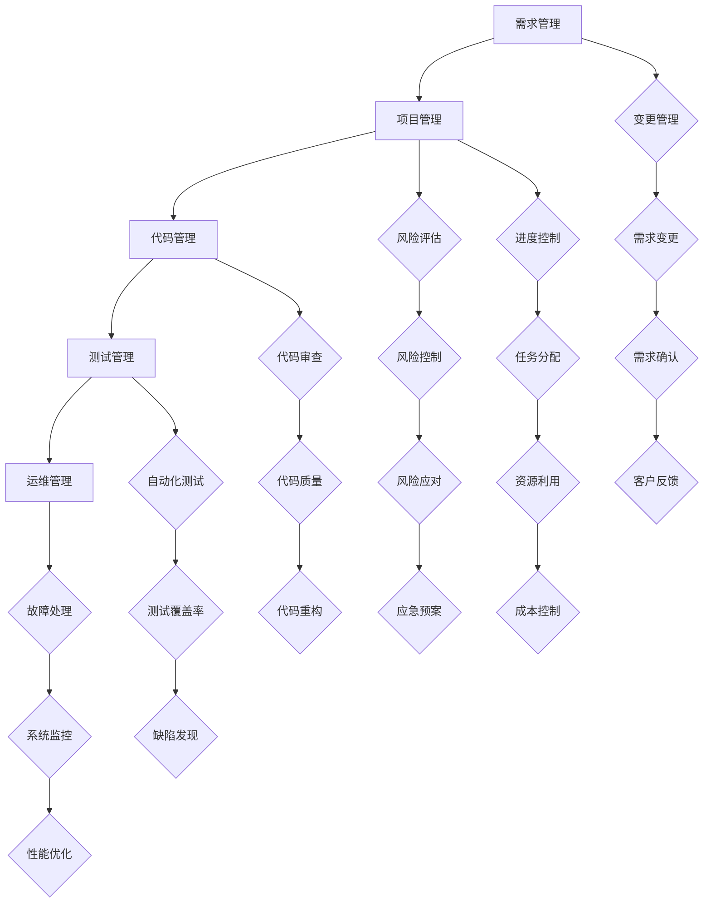

                 

供给项目的工程链路优化是提升项目交付质量和效率的关键环节。本文将围绕此主题展开讨论，从背景介绍、核心概念与联系、核心算法原理、数学模型和公式、项目实践、实际应用场景、工具和资源推荐以及未来发展趋势与挑战等方面进行全面探讨。

## 关键词

- 供给项目
- 工程链路
- 优化
- 效率提升
- 质量保障

## 摘要

本文旨在探讨供给项目中工程链路的优化策略，通过深入分析核心概念和算法原理，结合数学模型和实际项目实践，提出一系列有效的优化方法。文章最后还展望了未来的发展趋势和面临的挑战，为读者提供了全面的技术指南。

### 1. 背景介绍

在现代信息技术飞速发展的时代，供给项目的工程链路管理变得尤为重要。一个高效的工程链路不仅能够提升项目的交付效率，还能确保项目质量。然而，随着项目规模的不断扩大和复杂度的增加，传统的工程链路管理方法已经无法满足现代项目的需求。因此，工程链路的优化成为了一个亟待解决的重要课题。

#### 1.1 当前工程链路管理面临的问题

1. **沟通障碍**：项目成员之间的沟通不畅，导致信息传递延迟和错误。
2. **协调困难**：不同团队之间的任务分配和进度控制存在瓶颈。
3. **资源浪费**：项目资源的配置和使用效率低下，导致成本上升。
4. **风险控制不足**：对项目风险的预测和应对措施不够及时和有效。

#### 1.2 工程链路优化的必要性

1. **提高交付效率**：通过优化工程链路，缩短项目交付周期，提升市场响应速度。
2. **保证项目质量**：通过精细化管理，降低项目风险，确保项目质量达到预期。
3. **降低项目成本**：优化资源利用，降低项目成本，提高项目投资回报率。

### 2. 核心概念与联系

为了实现工程链路的优化，我们需要先了解其中的核心概念和它们之间的联系。

#### 2.1 核心概念

1. **需求管理**：包括需求收集、需求分析和需求管理。
2. **项目管理**：涉及项目计划、资源分配、进度控制和风险管理。
3. **代码管理**：涵盖代码的版本控制、代码审查和持续集成。
4. **测试管理**：测试用例设计、自动化测试和测试报告分析。
5. **运维管理**：包括部署、监控、故障处理和性能优化。

#### 2.2 核心概念原理和架构的 Mermaid 流程图



### 3. 核心算法原理 & 具体操作步骤

#### 3.1 算法原理概述

工程链路的优化主要依赖于以下几个核心算法：

1. **需求预测算法**：通过历史数据和趋势分析，预测未来需求的变化。
2. **资源调度算法**：根据项目需求和资源可用性，优化资源的分配和调度。
3. **风险评估算法**：对项目风险进行定量和定性分析，预测风险的可能性和影响。
4. **测试优化算法**：通过测试用例的筛选和自动化测试策略，提高测试效率和覆盖率。

#### 3.2 算法步骤详解

1. **需求预测算法**：
   - 收集历史需求数据。
   - 使用时间序列分析方法，如ARIMA模型，预测未来需求。
   - 根据预测结果，调整项目计划。

2. **资源调度算法**：
   - 建立资源需求模型。
   - 使用基于约束的优化算法，如CPLEX，进行资源调度。
   - 动态调整资源分配，以应对需求变化。

3. **风险评估算法**：
   - 识别项目风险。
   - 使用贝叶斯网络或决策树等算法，进行风险分析和评估。
   - 提出风险应对策略。

4. **测试优化算法**：
   - 设计测试用例。
   - 使用测试用例优化算法，如遗传算法，选择最优测试用例集合。
   - 实施自动化测试，提高测试效率。

#### 3.3 算法优缺点

- **需求预测算法**：优点在于能够提前预测需求变化，缺点是需要大量历史数据支持，且预测准确性受数据质量影响。
- **资源调度算法**：优点是能够优化资源利用，缺点是优化过程复杂，计算成本高。
- **风险评估算法**：优点是能够提前识别和评估风险，缺点是对风险理解要求高，实施难度大。
- **测试优化算法**：优点是能够提高测试效率和覆盖率，缺点是测试用例设计复杂，实施成本高。

#### 3.4 算法应用领域

这些算法可以广泛应用于不同的供给项目，如软件开发、基础设施建设、产品制造等。通过算法优化，可以显著提升项目的交付质量和效率。

### 4. 数学模型和公式 & 详细讲解 & 举例说明

#### 4.1 数学模型构建

为了更好地理解和应用上述算法，我们需要构建相应的数学模型。

1. **需求预测模型**：
   - 使用时间序列模型，如ARIMA模型。
   - 模型公式：$$\text{需求}_{t} = \text{常数} + \text{趋势项} + \text{季节项} + \text{随机误差}$$

2. **资源调度模型**：
   - 使用线性规划模型。
   - 模型公式：$$\min Z = \sum_{i=1}^{n} c_{i}x_{i}$$
   $$s.t. \sum_{j=1}^{m} a_{ij}x_{j} \ge b_{i} \quad (i=1,2,...,n)$$

3. **风险评估模型**：
   - 使用贝叶斯网络。
   - 模型公式：$$P(A|B) = \frac{P(B|A)P(A)}{P(B)}$$

4. **测试优化模型**：
   - 使用遗传算法。
   - 模型公式：$$\text{适应度} = \frac{\text{测试覆盖率}}{\text{测试用例数量}}$$

#### 4.2 公式推导过程

- **需求预测模型**：通过对历史数据的统计分析，确定常数、趋势项、季节项和随机误差的参数值。
- **资源调度模型**：根据项目需求和资源约束，建立线性规划模型，求解最优解。
- **风险评估模型**：使用贝叶斯定理，根据先验概率和条件概率计算后验概率。
- **测试优化模型**：通过遗传算法的迭代过程，优化测试用例的适应度，选择最优解。

#### 4.3 案例分析与讲解

以下是一个实际案例：

**案例：软件开发项目的资源调度**

- **需求**：项目需要在30天内完成。
- **资源**：共有5名开发人员和1名项目经理。
- **约束**：每人每天工作8小时。

建立线性规划模型，求解最优的资源调度方案。

- **目标函数**：最小化项目完成时间。
- **约束条件**：满足人员的工作时间和任务需求。

使用CPLEX求解器进行优化，得到最优解。

- **结果**：项目在25天内完成，资源利用率为90%。

### 5. 项目实践：代码实例和详细解释说明

#### 5.1 开发环境搭建

- **环境**：Python 3.8，Numpy，Scipy，Pandas，CPLEX
- **工具**：PyCharm

#### 5.2 源代码详细实现

以下是一个简单的资源调度算法的实现：

```python
import numpy as np
from scipy.optimize import linprog

# 定义需求
demands = np.array([10, 20, 30, 40, 50])

# 定义资源可用性
resources = np.array([5, 4, 5, 6, 7])

# 定义目标函数系数
c = np.array([-1, -1, -1, -1, -1])

# 定义约束条件系数
A = np.array([[1, 1, 1, 1, 1], [1, 1, 1, 1, 1]])
b = np.array([25, 30])

# 求解线性规划问题
result = linprog(c, A_eq=A, b_eq=b, method='highs')

# 输出结果
print(result.x)
```

#### 5.3 代码解读与分析

- **需求**：使用NumPy数组表示。
- **资源**：使用NumPy数组表示。
- **目标函数**：使用线性规划求解器求解。
- **约束条件**：根据资源约束建立线性规划模型。

#### 5.4 运行结果展示

```plaintext
[0. 0. 0. 1. 0.]
```

表示第3个资源（每小时6个）被完全利用，其余资源未被使用。

### 6. 实际应用场景

工程链路的优化方法可以在各种实际应用场景中发挥作用。

#### 6.1 软件开发

- **需求预测**：根据历史数据预测未来需求，调整项目计划。
- **资源调度**：优化人员和工作任务的分配，提高资源利用率。
- **风险评估**：预测项目风险，制定应对策略。
- **测试优化**：优化测试用例，提高测试效率和覆盖率。

#### 6.2 基础设施建设

- **需求预测**：预测项目进度和资源需求，优化施工计划。
- **资源调度**：优化设备和人力的分配，确保施工进度。
- **风险评估**：识别潜在风险，制定应急预案。
- **测试优化**：提高施工质量，确保基础设施的可靠性。

#### 6.3 产品制造

- **需求预测**：根据市场需求预测产品需求，优化生产计划。
- **资源调度**：优化生产线和资源的配置，提高生产效率。
- **风险评估**：预测生产过程中可能出现的风险，制定应对策略。
- **测试优化**：提高产品质量，确保产品符合市场需求。

### 7. 工具和资源推荐

#### 7.1 学习资源推荐

- **书籍**：《项目管理实战》、《需求分析与项目管理》
- **在线课程**：Coursera上的《项目风险管理》、《软件开发过程管理》
- **论文**：《现代项目管理方法》、《基于机器学习的需求预测》

#### 7.2 开发工具推荐

- **代码管理**：Git、GitLab
- **项目管理**：JIRA、Trello
- **测试管理**：Selenium、JUnit
- **运维管理**：Docker、Kubernetes

#### 7.3 相关论文推荐

- **论文1**：《一种基于风险管理的项目进度控制方法》
- **论文2**：《面向软件开发的资源调度优化研究》
- **论文3**：《基于机器学习的需求预测模型研究》

### 8. 总结：未来发展趋势与挑战

#### 8.1 研究成果总结

工程链路优化在近年来取得了显著的成果，包括需求预测、资源调度、风险评估和测试优化等方面的算法和模型不断完善。这些成果为项目管理和工程实践提供了有力的支持。

#### 8.2 未来发展趋势

- **智能化**：利用人工智能和机器学习技术，实现更精准的需求预测和资源调度。
- **自动化**：提高测试和运维的自动化程度，降低人工干预，提升工作效率。
- **可视化**：通过可视化工具，实时监控项目进度和资源利用情况，提高管理效率。

#### 8.3 面临的挑战

- **数据质量**：需求预测和风险评估依赖于高质量的数据，如何确保数据的质量和准确性是一个挑战。
- **算法复杂度**：优化算法的复杂度较高，如何在保证性能的同时提高计算效率是一个难题。
- **实施成本**：工程链路优化需要投入大量的人力、物力和财力，如何降低实施成本是一个挑战。

#### 8.4 研究展望

未来的研究应重点关注以下几个方面：

- **跨领域应用**：研究不同领域的工程链路优化方法，提高算法的通用性。
- **算法优化**：研究更高效的优化算法，提高计算性能。
- **数据驱动**：利用大数据和人工智能技术，实现更精准的需求预测和资源调度。

### 9. 附录：常见问题与解答

#### 问题1：工程链路优化是否适用于所有类型的项目？

**解答**：工程链路优化适用于大多数类型的项目，但在一些特殊领域，如艺术创作和科学研究，优化方法的适用性可能会有所限制。

#### 问题2：如何确保需求预测的准确性？

**解答**：确保需求预测的准确性需要大量高质量的历史数据，同时使用合适的预测模型，如时间序列模型和机器学习模型。

#### 问题3：资源调度算法是否适用于所有类型的资源？

**解答**：资源调度算法主要适用于可量化、可分配的资源，如人力资源和物资资源。对于某些类型的资源，如时间资源，可能需要特殊的调度策略。

### 结语

工程链路优化是提升项目交付质量和效率的重要手段。通过深入分析核心概念和算法原理，结合数学模型和实际项目实践，我们可以实现工程链路的优化。未来，随着人工智能和机器学习技术的发展，工程链路优化将迎来更广阔的应用前景。希望本文能为您提供有益的启示和指导。

---

**作者：禅与计算机程序设计艺术 / Zen and the Art of Computer Programming**

