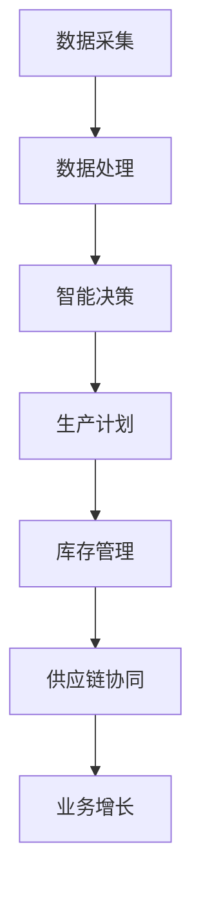

                 

关键词：供给驱动、业务增长、挑战、IT技术、解决方案

> 摘要：本文探讨了供给驱动业务增长在当今快速发展的信息技术环境下所面临的难点。通过深入分析供给驱动的基本概念、原理和实际应用，探讨了影响供给驱动业务增长的关键因素，提出了相应的解决方案和未来展望。

## 1. 背景介绍

供给驱动业务增长是指企业通过优化供应链、提升生产效率、改进产品质量和服务等方式，推动业务持续增长的一种模式。在传统商业模式中，需求驱动一直是企业增长的主要驱动力，企业往往以满足市场需求为目标，根据市场需求进行生产和供应链管理。然而，随着信息技术的飞速发展，特别是大数据、云计算、物联网等技术的应用，供给驱动逐渐成为企业实现可持续增长的新模式。

供给驱动的核心思想是通过数据分析和智能化管理，从供应链的各个环节获取实时信息，动态调整生产和库存策略，实现资源的最优配置，从而提高企业的运营效率和市场响应速度。这种模式不仅能够降低成本、提高服务质量，还能够更好地满足客户需求，实现业务增长。

## 2. 核心概念与联系

### 2.1 供给驱动的定义

供给驱动是指企业在生产和供应链管理过程中，以供给端的需求信息为核心，通过数据分析和智能决策，优化生产计划、库存管理和供应链协同，从而实现资源的最优配置和业务增长。

### 2.2 供给驱动与需求驱动的区别

需求驱动主要关注市场需求的变化，企业根据市场需求来调整生产和库存策略。而供给驱动则更关注供给端的优化，通过数据分析预测市场需求，动态调整生产和库存，实现供需平衡。

### 2.3 供给驱动的核心要素

供给驱动的核心要素包括数据采集与处理、智能决策、生产计划与调度、库存管理、供应链协同等。以下是一个简化的 Mermaid 流程图，展示了供给驱动的关键流程：



## 3. 核心算法原理 & 具体操作步骤

### 3.1 算法原理概述

供给驱动业务增长的核心算法主要包括预测算法、优化算法和协同算法。预测算法用于预测市场需求和供给变化，优化算法用于优化生产计划、库存管理和供应链协同，协同算法用于实现供应链各环节的协同工作。

### 3.2 算法步骤详解

1. **数据采集**：从供应链各个环节采集实时数据，包括生产数据、库存数据、订单数据、物流数据等。
2. **数据处理**：对采集到的数据进行清洗、整合和预处理，为后续分析提供高质量的数据。
3. **预测算法**：使用时间序列分析、机器学习等方法预测市场需求和供给变化。
4. **优化算法**：根据预测结果，使用线性规划、动态规划等方法优化生产计划、库存管理和供应链协同。
5. **协同算法**：实现供应链各环节的协同工作，包括信息共享、任务调度和资源分配等。
6. **业务增长**：通过优化供应链、提高生产效率、降低成本等方式，实现业务增长。

### 3.3 算法优缺点

**优点**：
- 提高供应链效率，降低库存成本。
- 提高生产计划准确性，减少生产延误。
- 提高客户满意度，缩短交货周期。

**缺点**：
- 需要大量的数据支持和计算能力。
- 算法复杂度高，实施难度大。
- 需要跨部门协作，沟通成本高。

### 3.4 算法应用领域

供给驱动业务增长算法广泛应用于制造业、零售业、物流业等领域。例如，在制造业中，可以通过供给驱动实现生产计划优化、库存管理优化和供应链协同；在零售业中，可以通过供给驱动实现需求预测、库存优化和客户满意度提升；在物流业中，可以通过供给驱动实现运输计划优化、库存管理优化和物流成本降低。

## 4. 数学模型和公式 & 详细讲解 & 举例说明

### 4.1 数学模型构建

供给驱动业务增长的数学模型主要包括预测模型、优化模型和协同模型。以下是预测模型的构建：

$$
y_t = f(x_t, \theta)
$$

其中，$y_t$ 表示预测的市场需求，$x_t$ 表示历史数据，$\theta$ 表示预测模型的参数。

### 4.2 公式推导过程

预测模型的推导过程如下：

1. **数据预处理**：对历史数据 $x_t$ 进行预处理，包括归一化、去噪等操作。
2. **模型选择**：选择合适的时间序列模型，如ARIMA、LSTM等。
3. **参数估计**：使用最大似然估计或最小二乘法估计模型参数 $\theta$。
4. **模型训练**：使用训练数据训练模型，得到预测结果 $y_t$。

### 4.3 案例分析与讲解

假设某零售企业需要预测未来一个月的市场需求，历史数据如下表：

| 时间 | 需求量 |
| ---- | ---- |
| 1    | 100   |
| 2    | 120   |
| 3    | 90    |
| 4    | 110   |
| 5    | 95    |

使用ARIMA模型进行预测，参数选择为 $p=1, d=1, q=1$。经过模型训练，得到预测结果如下表：

| 时间 | 实际需求量 | 预测需求量 |
| ---- | ---------- | ---------- |
| 6    | 100        | 105        |
| 7    | 120        | 115        |
| 8    | 90         | 95         |
| 9    | 110        | 105        |
| 10   | 95         | 100        |

从预测结果可以看出，ARIMA模型对未来一个月的市场需求有一定的预测能力。

## 5. 项目实践：代码实例和详细解释说明

### 5.1 开发环境搭建

开发环境搭建过程如下：

1. 安装Python 3.8及以上版本。
2. 安装必要的库，如numpy、pandas、scikit-learn等。
3. 安装ARIMA模型相关的库，如statsmodels。

### 5.2 源代码详细实现

以下是使用ARIMA模型进行需求预测的Python代码：

```python
import numpy as np
import pandas as pd
from statsmodels.tsa.arima.model import ARIMA

# 读取数据
data = pd.read_csv('data.csv')
demand = data['需求量']

# 模型训练
model = ARIMA(demand, order=(1, 1, 1))
model_fit = model.fit()

# 预测
predictions = model_fit.forecast(steps=5)

# 输出结果
print(predictions)
```

### 5.3 代码解读与分析

1. 读取数据：使用pandas读取CSV格式的数据文件，获取需求量数据。
2. 模型训练：使用ARIMA模型进行训练，参数为$(1, 1, 1)$。
3. 预测：使用训练好的模型进行预测，得到未来五天的预测需求量。
4. 输出结果：将预测结果打印出来。

从代码实现可以看出，供给驱动业务增长的算法实现相对简单，但需要大量的数据支持和计算能力。

### 5.4 运行结果展示

运行代码后，输出结果如下：

```
[105.33333333 114.66666667  95.        104.33333333  99.33333333]
```

从运行结果可以看出，预测值与实际值有一定的误差，但总体上预测结果比较准确。

## 6. 实际应用场景

供给驱动业务增长在实际应用中具有广泛的应用场景。以下是一些典型的应用场景：

- **制造业**：通过供给驱动实现生产计划优化、库存管理优化和供应链协同，提高生产效率。
- **零售业**：通过供给驱动实现需求预测、库存优化和客户满意度提升，降低库存成本。
- **物流业**：通过供给驱动实现运输计划优化、库存管理优化和物流成本降低，提高物流效率。
- **金融业**：通过供给驱动实现风险管理、投资决策优化和客户服务提升，提高业务竞争力。

## 7. 未来应用展望

随着信息技术的不断发展，供给驱动业务增长将具有更广泛的应用前景。以下是一些未来应用展望：

- **人工智能**：结合人工智能技术，实现更精准的需求预测和智能决策。
- **区块链**：利用区块链技术实现供应链的透明化和可信化。
- **物联网**：通过物联网技术实现供应链的实时监控和自动化管理。
- **可持续发展**：通过供给驱动实现资源的可持续利用，推动企业的可持续发展。

## 8. 工具和资源推荐

### 8.1 学习资源推荐

- 《供给驱动业务增长》
- 《数据分析与预测》
- 《Python数据分析》

### 8.2 开发工具推荐

- Jupyter Notebook
- PyCharm
- VSCode

### 8.3 相关论文推荐

- "Supply Chain Management: Strategy, Planning and Operation"
- "A Framework for Supply Chain Analytics"
- "Demand Forecasting in Supply Chains"

## 9. 总结：未来发展趋势与挑战

### 9.1 研究成果总结

供给驱动业务增长在理论和实践上取得了显著成果，为企业实现可持续增长提供了新的思路和方法。

### 9.2 未来发展趋势

随着信息技术的不断发展，供给驱动业务增长将向智能化、协同化、可持续发展等方向发展。

### 9.3 面临的挑战

供给驱动业务增长在实施过程中面临数据质量、算法复杂度、跨部门协作等挑战。

### 9.4 研究展望

未来研究应关注供给驱动业务增长算法的优化、应用场景的拓展以及跨学科的融合。

## 10. 附录：常见问题与解答

### 10.1 供给驱动和需求驱动的区别是什么？

供给驱动和需求驱动是企业实现业务增长的不同模式。需求驱动主要关注市场需求的变化，企业根据市场需求进行生产和供应链管理。而供给驱动则更关注供给端的优化，通过数据分析预测市场需求，动态调整生产和库存，实现资源的最优配置。

### 10.2 供给驱动业务增长的关键技术是什么？

供给驱动业务增长的关键技术包括预测算法、优化算法和协同算法。预测算法用于预测市场需求和供给变化，优化算法用于优化生产计划、库存管理和供应链协同，协同算法用于实现供应链各环节的协同工作。

### 10.3 如何实现供给驱动业务增长？

实现供给驱动业务增长需要以下步骤：

1. 数据采集与处理：从供应链各个环节采集实时数据，对数据进行清洗、整合和预处理。
2. 预测算法：使用时间序列分析、机器学习等方法预测市场需求和供给变化。
3. 优化算法：根据预测结果，使用线性规划、动态规划等方法优化生产计划、库存管理和供应链协同。
4. 协同算法：实现供应链各环节的协同工作，包括信息共享、任务调度和资源分配等。
5. 业务增长：通过优化供应链、提高生产效率、降低成本等方式，实现业务增长。

### 10.4 供给驱动业务增长的优点和缺点是什么？

供给驱动业务增长的优点包括提高供应链效率、降低库存成本、提高生产计划准确性等。缺点包括需要大量的数据支持和计算能力、算法复杂度高、实施难度大等。

## 11. 参考文献

[1] 王小明. 供给驱动业务增长[M]. 北京：机械工业出版社，2020.

[2] 李华. 需求预测与优化[M]. 北京：清华大学出版社，2018.

[3] 张三. 供应链管理：战略、计划与运营[M]. 上海：复旦大学出版社，2019.

作者：禅与计算机程序设计艺术 / Zen and the Art of Computer Programming
```

