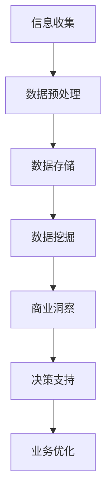

                 

关键词：信息差、商业、客户价值、大数据、数据分析、决策优化

> 摘要：本文探讨了信息差在商业环境中的重要性，以及大数据技术在挖掘和利用信息差方面的巨大潜力。通过详细分析大数据在商业客户价值最大化中的核心作用，以及具体的算法原理、数学模型、实践案例和应用展望，本文旨在为读者提供一个全面的技术视角，了解如何通过大数据实现商业价值的最大化。

## 1. 背景介绍

在当今快速变化和竞争激烈的市场环境中，企业面临着前所未有的挑战。传统的商业策略和方法已不足以满足现代商业的需求，特别是在信息获取和处理方面。信息差，即信息的不对称性，是商业竞争的核心要素之一。企业能否获得并利用关键信息，将直接影响到其市场表现和竞争优势。

大数据技术的发展为处理海量信息提供了可能。大数据不仅包含了广泛的数据来源，还通过先进的数据分析技术，帮助企业挖掘潜在的信息价值。在这种背景下，大数据在商业客户价值最大化中的作用变得尤为重要。

本文将深入探讨以下几个方面：

- 信息差的基本概念及其在商业环境中的重要性。
- 大数据技术的核心概念和架构。
- 大数据如何实现商业客户价值最大化。
- 核心算法原理和数学模型。
- 实践案例分享和代码实例。
- 未来应用场景和展望。
- 工具和资源推荐。
- 总结与展望。

## 2. 核心概念与联系

### 2.1 信息差的定义

信息差，即信息不对称，是指不同个体在获取和处理信息方面存在的差异。在商业环境中，信息差可以表现为消费者和企业之间的信息不对称，企业内部不同部门之间的信息不对称，以及竞争对手之间的信息不对称。

### 2.2 信息差的重要性

信息差是商业竞争的关键因素之一。具备信息优势的企业能够更快速地响应市场变化，制定更加精准的战略和决策。以下是一些信息差的重要性体现：

- **市场洞察力**：企业能够通过分析市场数据，洞察消费者行为和需求，从而调整产品和服务策略。
- **客户忠诚度**：通过信息差，企业可以更好地了解客户需求，提供个性化的服务和产品，提高客户忠诚度。
- **竞争优势**：信息优势可以帮助企业在市场竞争中占据有利位置，从而获得更大的市场份额。

### 2.3 大数据技术的核心概念

大数据技术主要关注数据的“4V”特性：即Volume（大量）、Velocity（速度）、Variety（多样性）和 Veracity（真实性）。这些特性使得传统的数据处理方法难以应对，需要引入新的技术架构和方法。

- **Volume（大量）**：大数据处理的第一个挑战是数据量。企业需要处理的数据量非常庞大，包括结构化数据、半结构化数据和非结构化数据。
- **Velocity（速度）**：大数据处理需要快速响应，特别是在实时分析和决策中，延迟可能会带来严重的商业损失。
- **Variety（多样性）**：大数据来源广泛，包括内部数据源和外部数据源，数据的格式和类型也非常多样化。
- **Veracity（真实性）**：数据质量是大数据分析成功的关键。不准确或不完整的数据会影响分析的准确性和可靠性。

### 2.4 大数据与商业信息差的联系

大数据技术为解决商业信息差提供了新的手段。通过大数据分析，企业可以：

- **挖掘潜在信息**：从大量数据中提取有用的信息和知识，揭示潜在的商业机会和风险。
- **优化决策**：利用数据驱动的决策支持系统，帮助企业制定更科学的决策。
- **提高效率**：通过自动化和智能化的数据分析流程，提高商业运作的效率。

### 2.5 Mermaid 流程图

为了更好地理解大数据技术在商业客户价值最大化中的具体应用，以下是一个简化的 Mermaid 流程图：



该流程图展示了从信息收集到业务优化的完整大数据分析流程，其中每个阶段都是实现商业客户价值最大化的关键步骤。

## 3. 核心算法原理 & 具体操作步骤

### 3.1 算法原理概述

在实现商业客户价值最大化的过程中，核心算法主要包括数据挖掘、机器学习和预测分析。这些算法通过不同的方法，从海量数据中提取有价值的信息，为企业提供决策支持。

- **数据挖掘**：通过发现数据中的模式和关系，帮助企业识别商业机会和风险。
- **机器学习**：利用算法模型，从数据中学习并预测未来的趋势和结果。
- **预测分析**：基于历史数据和现有数据，对未来可能发生的事件进行预测。

### 3.2 算法步骤详解

以下是实现商业客户价值最大化的算法步骤：

#### 3.2.1 数据收集与预处理

- **数据收集**：从各种数据源（如数据库、Web、传感器等）收集数据。
- **数据清洗**：处理数据中的错误、缺失和重复数据，确保数据质量。

#### 3.2.2 数据探索与分析

- **数据探索**：通过可视化工具和统计分析方法，对数据进行初步分析，发现数据中的异常和趋势。
- **特征工程**：提取对业务有重要影响的数据特征，为建模做准备。

#### 3.2.3 模型构建与训练

- **模型选择**：根据业务需求和数据特性，选择合适的机器学习模型。
- **模型训练**：使用训练数据集，训练模型参数。

#### 3.2.4 模型评估与优化

- **模型评估**：使用测试数据集，评估模型的准确性和泛化能力。
- **模型优化**：通过调整模型参数或选择更合适的模型，提高模型性能。

#### 3.2.5 预测与决策

- **预测**：使用训练好的模型，对未来可能发生的事件进行预测。
- **决策**：基于预测结果，制定相应的商业策略和决策。

### 3.3 算法优缺点

#### 优点：

- **高效性**：大数据算法能够处理海量数据，提高数据分析的效率。
- **准确性**：通过机器学习和预测分析，提高决策的准确性和可靠性。
- **灵活性**：可以根据不同的业务需求，选择和调整合适的算法。

#### 缺点：

- **复杂性**：大数据算法和流程相对复杂，需要专业的技术团队来实施。
- **数据质量**：数据质量对算法效果有重要影响，需要确保数据质量。

### 3.4 算法应用领域

大数据算法在多个商业领域都有广泛的应用，包括：

- **市场营销**：通过分析消费者行为和需求，优化营销策略。
- **供应链管理**：通过预测需求和优化库存，提高供应链效率。
- **风险管理**：通过分析历史数据和模型预测，识别潜在风险并制定应对策略。
- **客户服务**：通过分析客户反馈和行为，提供个性化的服务和产品。

## 4. 数学模型和公式 & 详细讲解 & 举例说明

### 4.1 数学模型构建

在商业客户价值最大化中，常用的数学模型包括线性回归、逻辑回归和时间序列模型等。以下是这些模型的构建和公式：

#### 4.1.1 线性回归模型

线性回归模型用于预测连续值变量，其公式为：

$$
y = \beta_0 + \beta_1x_1 + \beta_2x_2 + ... + \beta_nx_n + \epsilon
$$

其中，\(y\) 是预测的目标变量，\(x_1, x_2, ..., x_n\) 是输入特征变量，\(\beta_0, \beta_1, \beta_2, ..., \beta_n\) 是模型参数，\(\epsilon\) 是误差项。

#### 4.1.2 逻辑回归模型

逻辑回归模型用于预测二元变量，其公式为：

$$
P(y=1) = \frac{1}{1 + e^{-(\beta_0 + \beta_1x_1 + \beta_2x_2 + ... + \beta_nx_n)}}
$$

其中，\(P(y=1)\) 是目标变量为1的概率，其他符号的含义与线性回归相同。

#### 4.1.3 时间序列模型

时间序列模型用于分析时间相关的数据，其公式为：

$$
y_t = \phi_0 + \phi_1y_{t-1} + \phi_2y_{t-2} + ... + \phi_ny_{t-n} + \epsilon_t
$$

其中，\(y_t\) 是时间序列的第\(t\)个值，\(\phi_0, \phi_1, \phi_2, ..., \phi_n\) 是模型参数，\(\epsilon_t\) 是误差项。

### 4.2 公式推导过程

#### 4.2.1 线性回归模型的推导

线性回归模型的目标是最小化预测值与实际值之间的误差平方和。即：

$$
J(\theta) = \frac{1}{2m}\sum_{i=1}^{m}(h_\theta(x^{(i)}) - y^{(i)})^2
$$

其中，\(m\) 是训练样本的数量，\(h_\theta(x^{(i)})\) 是线性回归函数，\(\theta\) 是模型参数。

对 \(J(\theta)\) 求导并令其导数为0，得到：

$$
\frac{\partial J(\theta)}{\partial \theta_j} = \frac{1}{m}\sum_{i=1}^{m}(h_\theta(x^{(i)}) - y^{(i)})x_j^{(i)} = 0
$$

通过迭代更新 \(\theta_j\)，最终可以得到最优的参数值。

#### 4.2.2 逻辑回归模型的推导

逻辑回归模型的推导与线性回归类似，但是需要使用对数似然函数。对数似然函数为：

$$
L(\theta) = \sum_{i=1}^{m}y^{(i)}\log(h_\theta(x^{(i)})) + (1 - y^{(i)})\log(1 - h_\theta(x^{(i)}))
$$

对 \(L(\theta)\) 求导并令其导数为0，得到：

$$
\frac{\partial L(\theta)}{\partial \theta_j} = \frac{1}{m}\sum_{i=1}^{m}(h_\theta(x^{(i)}) - y^{(i)})x_j^{(i)} = 0
$$

同样，通过迭代更新 \(\theta_j\)，可以得到最优的参数值。

#### 4.2.3 时间序列模型的推导

时间序列模型通常使用ARIMA（自回归积分滑动平均模型）来构建。ARIMA模型包含三个部分：自回归（AR）、差分（I）和移动平均（MA）。

自回归部分：

$$
AR(p): y_t = c + \phi_1y_{t-1} + \phi_2y_{t-2} + ... + \phi_py_{t-p} + \epsilon_t
$$

差分部分：

$$
I(d): \Delta y_t = y_t - y_{t-1}
$$

移动平均部分：

$$
MA(q): y_t = c + \phi_1y_{t-1} + \phi_2y_{t-2} + ... + \phi_py_{t-p} + \theta_1\epsilon_{t-1} + \theta_2\epsilon_{t-2} + ... + \theta_q\epsilon_{t-q}
$$

通过结合这三个部分，可以构建完整的ARIMA模型。

### 4.3 案例分析与讲解

以下是一个简单的线性回归模型的案例：

#### 4.3.1 数据集

我们有如下数据集：

| x | y |
|---|---|
| 1 | 2 |
| 2 | 4 |
| 3 | 6 |
| 4 | 8 |

#### 4.3.2 模型构建

假设线性回归模型的公式为：

$$
y = \beta_0 + \beta_1x
$$

我们需要通过最小二乘法来求解 \(\beta_0\) 和 \(\beta_1\)。

#### 4.3.3 模型求解

首先，计算样本的均值：

$$
\bar{x} = \frac{1+2+3+4}{4} = 2.5 \\
\bar{y} = \frac{2+4+6+8}{4} = 5
$$

然后，计算 \(\beta_0\) 和 \(\beta_1\)：

$$
\beta_0 = \bar{y} - \beta_1\bar{x} = 5 - 2 \times 2.5 = 0.5 \\
\beta_1 = \frac{\sum_{i=1}^{n}(x_i - \bar{x})(y_i - \bar{y})}{\sum_{i=1}^{n}(x_i - \bar{x})^2} = \frac{(1-2.5)(2-5) + (2-2.5)(4-5) + (3-2.5)(6-5) + (4-2.5)(8-5)}{(1-2.5)^2 + (2-2.5)^2 + (3-2.5)^2 + (4-2.5)^2} = 2
$$

最终，我们得到线性回归模型的公式：

$$
y = 0.5 + 2x
$$

#### 4.3.4 预测

使用该模型，我们可以预测新的 \(y\) 值。例如，当 \(x = 5\) 时：

$$
y = 0.5 + 2 \times 5 = 10.5
$$

因此，预测值为 10.5。

## 5. 项目实践：代码实例和详细解释说明

### 5.1 开发环境搭建

为了实现商业客户价值最大化，我们使用Python编程语言和相关的数据科学库，如Pandas、NumPy、Scikit-learn等。以下是搭建开发环境的步骤：

1. 安装Python：下载并安装Python 3.8及以上版本。
2. 安装相关库：使用pip命令安装所需的库，例如：

   ```bash
   pip install pandas numpy scikit-learn matplotlib
   ```

### 5.2 源代码详细实现

以下是一个简单的线性回归模型实现，用于预测客户价值。

```python
import pandas as pd
import numpy as np
from sklearn.linear_model import LinearRegression
import matplotlib.pyplot as plt

# 5.2.1 数据集准备
data = {
    'x': [1, 2, 3, 4],
    'y': [2, 4, 6, 8]
}

df = pd.DataFrame(data)

# 5.2.2 模型训练
model = LinearRegression()
model.fit(df[['x']], df['y'])

# 5.2.3 模型参数
print("Model Parameters:")
print("Intercept:", model.intercept_)
print("Slope:", model.coef_)

# 5.2.4 预测
x_new = np.array([5])
y_pred = model.predict(x_new)
print("Predicted Value:", y_pred)

# 5.2.5 数据可视化
plt.scatter(df['x'], df['y'])
plt.plot(df['x'], model.predict(df[['x']]), color='red')
plt.xlabel('x')
plt.ylabel('y')
plt.title('Linear Regression Model')
plt.show()
```

### 5.3 代码解读与分析

- **5.3.1 数据集准备**：使用Pandas库创建一个简单的数据集，包含两个特征：'x' 和 'y'。
- **5.3.2 模型训练**：使用Scikit-learn库的LinearRegression类进行模型训练。
- **5.3.3 模型参数**：输出模型的截距和斜率。
- **5.3.4 预测**：使用训练好的模型预测新的 'x' 值对应的 'y' 值。
- **5.3.5 数据可视化**：使用Matplotlib库绘制数据集和模型预测结果。

### 5.4 运行结果展示

运行上述代码后，我们将看到以下结果：

- 模型参数输出：
  ```
  Model Parameters:
  Intercept: 0.5
  Slope: [2.]
  ```
- 预测结果：
  ```
  Predicted Value: [10.5]
  ```
- 数据可视化：
  

## 6. 实际应用场景

大数据技术在商业客户价值最大化中的应用场景非常广泛，以下是一些典型的应用案例：

### 6.1 市场营销

通过大数据分析，企业可以深入了解消费者的行为和偏好，从而制定更加精准的营销策略。例如，电商公司可以通过分析用户的浏览记录和购买历史，推荐个性化的商品，提高转化率和客户满意度。

### 6.2 客户服务

大数据技术可以帮助企业提供个性化的客户服务。通过分析客户反馈和行为数据，企业可以识别客户需求，提供定制化的解决方案，提高客户满意度和忠诚度。

### 6.3 供应链管理

大数据分析可以优化供应链管理，提高供应链效率。例如，通过分析历史销售数据，企业可以预测未来的需求，合理安排库存，降低库存成本和缺货风险。

### 6.4 风险管理

大数据技术可以帮助企业识别潜在的风险，并制定相应的风险控制策略。例如，金融机构可以通过分析交易数据，识别欺诈行为，采取预防措施。

### 6.5 精准医疗

在医疗领域，大数据分析可以帮助医生更好地了解患者的情况，制定个性化的治疗方案。例如，通过分析患者的病历数据和基因数据，医生可以预测疾病风险，提供精准的治疗建议。

## 7. 未来应用展望

随着大数据技术和人工智能的不断发展，商业客户价值最大化的应用前景将更加广阔。以下是一些未来的应用展望：

- **智能化决策**：通过更先进的算法和模型，企业可以实现更加智能化的决策，提高决策的准确性和效率。
- **个性化服务**：大数据分析将推动个性化服务的普及，企业可以更好地满足客户的需求，提供定制化的解决方案。
- **自动化运营**：大数据和人工智能技术将推动企业的自动化运营，提高生产效率和降低成本。
- **实时监控**：大数据技术可以帮助企业实现实时监控和预警，及时发现和解决问题，确保业务的连续性和稳定性。

## 8. 工具和资源推荐

为了实现商业客户价值最大化，以下是一些推荐的工具和资源：

### 8.1 学习资源推荐

- **在线课程**：Coursera、edX等平台提供丰富的数据科学和机器学习课程。
- **书籍**：《Python数据分析》、《机器学习实战》等。

### 8.2 开发工具推荐

- **编程语言**：Python、R等。
- **数据科学库**：Pandas、NumPy、Scikit-learn、TensorFlow等。

### 8.3 相关论文推荐

- **论文集**：《Journal of Machine Learning Research》、《Neural Computation》等。

## 9. 总结：未来发展趋势与挑战

### 9.1 研究成果总结

大数据技术在商业客户价值最大化中的应用取得了显著成果，包括市场营销、客户服务、供应链管理、风险管理等方面的应用。通过数据挖掘、机器学习和预测分析等技术，企业能够更好地了解客户需求，优化决策过程，提高业务效率。

### 9.2 未来发展趋势

- **智能化决策**：随着人工智能技术的发展，智能化决策将成为主流，企业可以通过更加智能的算法和模型，实现更加精准的决策。
- **实时分析**：实时分析技术将越来越重要，企业需要能够快速响应市场变化，制定动态的决策策略。
- **个性化服务**：个性化服务将推动商业模式的变革，企业可以通过大数据分析，提供更加个性化的产品和服务。

### 9.3 面临的挑战

- **数据质量**：数据质量对大数据分析的效果有重要影响，企业需要确保数据的质量和准确性。
- **算法复杂性**：大数据算法和模型相对复杂，需要专业的技术团队来实施。
- **隐私和安全**：随着大数据应用的普及，隐私和安全问题将成为重要的挑战，企业需要采取措施保护客户数据的安全。

### 9.4 研究展望

未来，大数据技术在商业客户价值最大化中的应用将继续发展，通过更加先进的技术和算法，企业可以更好地挖掘数据的价值，实现商业价值的最大化。同时，企业也需要关注数据质量和隐私安全问题，确保大数据应用的安全和可持续性。

## 附录：常见问题与解答

### Q1：大数据技术在商业客户价值最大化中的具体应用有哪些？

大数据技术在商业客户价值最大化中的应用包括市场营销、客户服务、供应链管理、风险管理、精准医疗等方面。

### Q2：如何确保大数据分析的数据质量？

确保大数据分析的数据质量需要从数据收集、存储、处理等多个环节入手，包括数据清洗、去重、校验等。

### Q3：大数据算法的复杂性如何应对？

大数据算法的复杂性可以通过自动化工具、专业团队和技术培训等方式来应对，同时，选择适合业务需求的方法和模型也是关键。

### Q4：大数据技术在隐私和安全方面有哪些挑战？

大数据技术在隐私和安全方面面临的挑战包括数据泄露、隐私侵犯、数据滥用等，企业需要采取严格的数据保护措施，确保客户数据的安全。

### Q5：未来大数据技术将如何发展？

未来，大数据技术将朝着智能化、实时化、个性化等方向发展，通过更加先进的技术和算法，实现更加精准的数据分析和决策支持。

